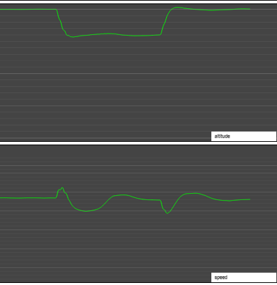

<!--

## Implementing auto-throttle

So, we're going to need one more fix to our altitude hold code: we need to auto-throttle the plane so we stay within safe speed limits.

```javascript
async function getTargetVS(autopilot, state, maxVS) {
  let targetVS = DEFAULT_TARGET_VS;
  let altDiff = undefined;

  const targetAltitude = autopilot.modes[ALTITUDE_HOLD];
  if (targetAltitude) {
    altDiff = targetAltitude - state.altitude;
    targetVS = constrainMap(altDiff, -200, 200, -maxVS, maxVS);
    // After our initial target calculation, run through an autothrottle step to
    // see if we need to throttle down, and set a smaller vertical speed as target:
    targetVS = await autoThrottle(state, autopilot.api, altDiff, targetVS);
  }

  return { targetVS, altDiff };
}

// Strap in, we're going to have to do some work.
async function autoThrottle(state, api, altDiff, targetVS) {
  // First, let's get both our current flight data and the
  // plane's "design speeds":
  const { verticalSpeed: VS } = state;
  const speed = round(state.speed);
  const {
    DESIGN_SPEED_CLIMB: sc,
    DESIGN_SPEED_VC: vc, // "cruise" speed
    NUMBER_OF_ENGINES: engineCount,
  } = await api.get(...ATT_PROPERTIES);

  // Small fix: we want these values in knots, not feet per second
  const cruiseSpeed = round(vc / KNOT_IN_FPS);
  const climbSpeed = round(sc / KNOT_IN_FPS);

  // Then we maths our way to how big of an adjustment to the throttle
  // we want to make if we're going too fast, or too slow:
  const throttleStep = 0.2;
  const tinyStep = throttleStep / 10;
  const ALT_LIMIT = 50;
  const BRACKET = 2;
  const adjustment = constrainMap(abs(altDiff), 0, ALT_LIMIT, tinyStep, throttleStep);

  // And we set up a helper function that can throttle all engines at the
  // same time (because not every airplane has only a single engine!).
  function change(v) { changeThrottle(api, engineCount, v); }

  // ...and then let's talk about what's supposed to happen here...

  return targetVS;
}
```

We interrupt this code so we can think about what situations our plane might be in, because those will dictate which action we take with regards to throttling:

1. We can be in level flight, and usually that means a reasonably stable speed.
2. We can be climbing, which runs the risk of a stall if we climb too fast and lose too much speed.
3. We can be descending, which runs the risk of losing control surface efficacy or even tearing the plane apart.

Each of these three has a plane-specific speed constraint associated with it:

1. In level flight, there is an "optimal cruise speed", known as `Vc`.
2. When we're climbing, there is an "optimal climb speed", known as `Vy`, which is related to how fast the plane can go "right now", so it's not a single "vertical speed" value, it varies.
3. When we're descending, our speed is dictated by a plane's "never exceed" speed, known as `Vne`. As it says on the tin: we never want to exceed that speed. And really, we generally want to stay well below it: we'd prefer to live.

So let's write some code for each of those three cases. First, cruise flight:

```javascript
async function autoThrottle(state, api, altDiff, targetVS) {
  ...

  function change(v) { changeThrottle(api, engineCount, v); }

  // Are we at/near cruise altitude with a VS that's stable enough that we can throttle?
  if (abs(altDiff) < ALT_LIMIT) {
    // If so, throttle up from to cruise speed:
    if (speed < cruiseSpeed - BRACKET && VS < 15) {
      change(constrainMap(cruiseSpeed - speed, 0, 10, adjustment, throttleStep));
    }
    // Or, of course, throttle *down* to cruise speed:
    if (speed > cruiseSpeed + BRACKET && VS > -15) {
      // And note the minus sign here:
      change(-constrainMap(speed - cruiseSpeed, 0, 10, adjustment, throttleStep));
    }
  }
```

Then, what to do during a climb:

```javascript
  // If we need to climb, we'll typically need to throttle the plane up to optimal climb speed:
  else if (altDiff > ALT_LIMIT) {
    // Throttle up to climb speed
    if (speed < climbSpeed) change(adjustment);
    // Or, if we're at climb speed  but our vertical speed is not high enough, throttle up some more
    else if (VS < 0.8 * targetVS) change(adjustment);
  }
```

And finally, what to do during a descent:

```javascript
  // And last, if we need to descend, throttle (mostly) down to maintain a safe speed.
  else if (altDiff < -ALT_LIMIT) {
    // If we're going too fast, throttle down to cruise speed
    if (speed > cruiseSpeed + BRACKET) {
      // And note the minus sign here, too:
      change(-adjustment);
    }
    // And if we're going too slow, which would also be bad, speed up a little.
    else if (speed < cruiseSpeed - BRACKET) {
      change(adjustment / 2);
    }
    // Also, as this situation represents a potential danger, we should be
    // aiming for a slower descent: return a new target VS that is lower
    // than what the code thought we could pull off:
    return constrainMap(speed, climbSpeed - 20, climbSpeed, 0, targetVS);
  }

  // And finally, if we get here, then our target VS was fine, and we keep its original value.
  return targetVS;
}
```

So, let's try this one more time: we'll leave the heading change off for now, first let's try out altitude changes and see if we don't enter "the rollercoaster of death":



Much better. This time dropping from 2000 feet to 1600 feet shows our speed starting to pick up as we start to descend, and then immediately getting curbed by our auto-throttle code. In fact, to keep us safe, we see the speed dip to _below_ cruise speed, and then slowly creep back up as we settle into our new level. Going back up to 2000 feet shows the auto throttle giving us a bit more speed as we climb, settling back down to cruise speed after we've reached our target.

One thing to note is that our altitudes are no longer as "crisp": we're now overshooting our targets a little and then recover over a longer period of time because the target vertical speed and auto throttle "interfere" with each other: we could try to tune that to perfect by writing more code and running more tests, but this feels acceptable for now. We can always revisit this later.

-->