<!-- there's going to be interactive graphics here -->

<script  type="module" src="./graphics/graphics-element/graphics-element.js" async></script>
<link rel="stylesheet" href="./graphics/graphics-element/graphics-element.css" async>

<style>
  html, body {
    width: 800px;
    margin: 0 auto;
  }
  img {
    border: 1px solid black;
  }
</style>


# Flying planes with JavaScript


To allay any concerns: this is not about running JavaScript software to control an actual aircraft.

**_That would kill people_**.

Instead, we're writing a web page that can control an autopilot running in JS that, in turn, controls a little virtual aeroplane. And by "little" I actually mean "most aeroplanes in [Microsoft Flight Simulator 2020](https://www.flightsimulator.com/)" because as it turns out, MSFS comes with an API that can be used to both query _*and set*_ values ranging from anything as simple as cockpit lights to something as complex as spawning a fleet of aircraft and making them fly in formation while making their smoke pattern spell out the works of Chaucer in its original middle English.

While we're not doing that (...today?), we _*are*_ going to write an autopilot for planes that don't have one, as well as planes that do have one but that are just a 1950's chore to work with, while also tacking on some functionality that just straight up doesn't exist in modern autopilots. The thing that lets us perform this trick is that MSFS comes with something called [SimConnect](https://docs.flightsimulator.com/html/Programming_Tools/SimConnect/SimConnect_SDK.htm), which is an SDK that lets people write addons for the game using C, C++, or languages with .NET support... and so, of course, folks have been writing connectors to "port" the SimConnect function calls to officially unsupported languages like Go, Node, Python, etc.

Which means that we could, say, write a web page that allows us to see what's going on in the game. And toggle in-game settings. And --and this is the one that's the most fun-- _fly the plane_ from a web page. And once we're done "it'll be that easy" but the road to get there is going to take a little bit of prep work... some of it tedious, some of it weird, but all of it's going to set us up for just doing absolutely ridiculous things and at the end of it, we'll have a fully functional autopilot _with auto-takeoff and flight planning that's as easy as using google maps_ and whatever's missing, you can probably bolt on yourself!

Before we get there though, let's start at the start. If the idea is to interface with MSFS from a webpage, and webpages use JS, then your first thought might be "Cool, can I write an [express](https://expressjs.com/) server that connects to MSFS?" to which the answer is: yes! There is the [node-simconnect](https://www.npmjs.com/package/node-simconnect) package for [Node](https://nodejs.org), which implements full access to the SimConnect DLL file, but it's very true to the original C++ SDK, meaning it's a bit like "programming C++ in JavaScript". Now, you might like that (I don't know your background) but JS has its own set of conventions that don't really line up with the C++ way of doing things, and because I know my way around programming and I like writing JS, I created a somewhat more "JavaScripty" API on top of node-simconnect called [msfs-simconnect-api-wrapper](https://www.npmjs.com/package/msfs-simconnect-api-wrapper) (I am _*great*_ at naming things) which lets me (and you!) write code that can talk to MSFS in a way that looks and feels much more like standard JavaScript, so... let's use that!

Also, because we want to talk "from the browser to a game", we don't really want to have to rely on HTML GET and POST requests, because they're both slow, and unidirectional: the game will never be able to talk to us unless it's to answer a question we sent it. That's not great, especially not if we want to register event handlers, so instead we'll use [web sockets](https://developer.mozilla.org/en-US/docs/Web/API/WebSockets_API), which let us set up a persistent bidirectional data connection And to make that a trivial task, we're going to use a library called ["socketless"](https://github.com/Pomax/socketless), which lets us write client/server code as if everything is just local code, and it magically makes things work over the network.

If that sounds cool: you can check out the complete project over on the ["Are we flying?"](https://github.com/Pomax/are-we-flying) Github repository, and you can just clone that and run the project with a simple `run.bat`, but if you want to actually learn something... let's dive in!

## The structure of this "tutorial"

We'll be tackling this whole thing in four parts:

1. In the first part we'll cover the prep work we need to do in order to set up a working combination of MSFS, a SimConnect API server for communicating to and from MSFS, and a web server that hosts a webpage and takes care of communicating to and from the API server.
2. In the the second part we'll cover the "web page pages", where we're going to visualize everything we can visualize relating to our flights in MSFS, including graphs that plot the various control values over time (altitude, speed, heading, trim values, etc.) to get a better insight into how our aeroplane(s) responds to control inputs.
3. In the third part we'll cover the thing you came here for: writing our own autopilot (in several stages of complexity) and making our computer fly planes all on its own!
4. In the fourth part, we're going to cover the thing you didn't even realize you came here for: taking everything we've done and turning it into a google maps style autopilot, where we just tap a few places we want to pass over in the browser, and then with the plane still sitting on the runway, click "take off" in the browser and have the plane just... start flying in MSFS with us along for the ride, not having to do anything. And then clicking "auto land" to make the game pick an airport near the last waypoint we placed and just have it land there. _Because we can_.

And along the way we're going to learn a few developer tricks like hot reloading ES modules, mocking SimConnect, and other such fun things.

By the time we're done, we'll have a web page that looks a little bit like this:

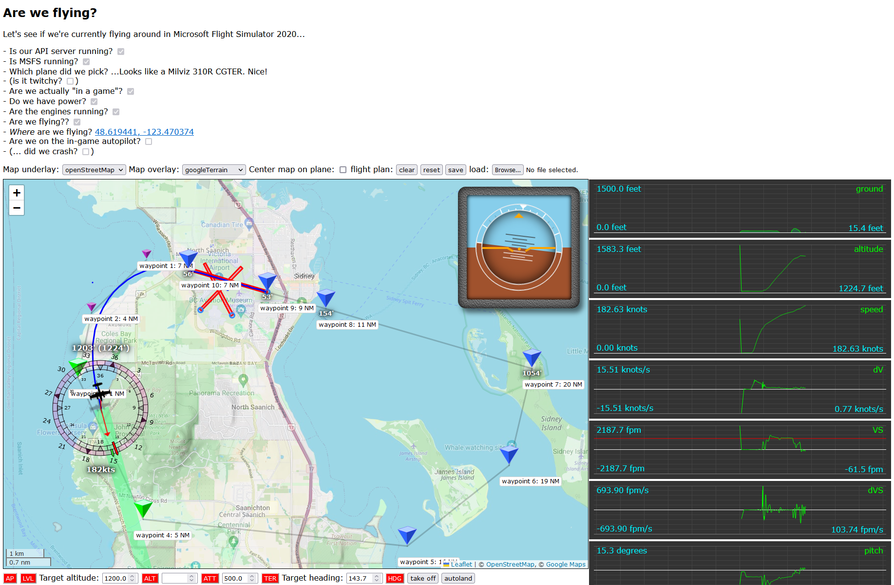

While the in game view looking like this:


or this:


If that sounds (and looks) good to you, then read on!

# Table of Contents

- REGENERATE LATER

# Part one: The prep work

As mentioned, we're going to have to do a bit of prep work before we can start writing the fun stuff, so let's get this done. We're going to implement three things:

1. An API server that talks directly to MSFS, and accepts web socket connections that can be used by API clients to interact with MSFS,
2. a web server that serves a webpage, and accepts web socket connections from the webpage, which it can forward to the API server, and
3. a web page with some code that connects it to the API (as far as it knows) using a web socket and can show the various aspects of a flight.

In high fidelity image media, we'll be implementing this:


And as mentioned, to make our lives a little easier we're going to be using the [socketless](https://www.npmjs.com/package/socketless) library to take care of the actual client/server management, so we can just focus on writing the code that's going to let us show a user interface based on talking to MSFS. The nice thing about this library is that it does some magic that lets clients and servers call functions on each other "without knowing there's a network". If the server has a function called `test` then the client can just call `const testResult = await this.server.test()` and done, as far as the client knows, the server is just a local variable. Similarly, if the client has a function called `test` then server can call that with a `const testResult = await this.clients[...].test()` and again, as far as the server knows it's just working with a local variable.

## An .env file

Let's start with an `.env` file for housing a few variables that we want to be using across all our code:

```env
WEB_PORT=3000
API_PORT=8080
```

Nothing fancy, just two ports for now.

## A socketless API, and web servers

Before we look at the "real" code we need to write, let's quickly run through the code required to run our API server, which we'll put in `api-server.js`:

```js
// First we load our .env file:
import url from "node:url";
const __dirname = url.fileURLToPath(new URL(".", import.meta.url));
import dotenv from "dotenv";
dotenv.config({ path: `${__dirname}/.env` });

// Then we set up socketless so it can do its thing:
import { createServer } from "socketless";
import { ServerClass } from "./src/classes/index.js";

// Where "its thing" is creating an API server:
const { webserver } = createServer(ServerClass);

// Which we then run like any other Node server.
const { API_PORT } = process.env;
webserver.listen(API_PORT, () => {
  console.log(`Server listening on http://localhost:${API_PORT}`);
});
```

And that's it, that's all the code we need for our API server. At least in terms of the actual "running the server". We'll look at the server class in the next section.

Next up, the code required to run the "web server" part of our above "diagram" which we'll put in `web-server.js`:

```js
// We start the same was as above:
import url from "node:url";
const __dirname = url.fileURLToPath(new URL(".", import.meta.url));
import dotenv from "dotenv";
dotenv.config({ path: `${__dirname}/.env` });

// Then we set up socketless:
import { ClientClass } from "./src/classes/client/client.js";
import { createWebClient } from "socketless";

// But instead of a server, we're going to build a "web client",
// which is something that can both act as client to our server,
// as well as running its own local web server so that browsers
// can connect to it and present a UI based on the client state:
const { API_PORT, WEB_PORT } = process.env;

// Clients need to know which URL to find the server at:
const serverURL = `http://localhost:${API_PORT}`;

// And web clients need to know which directory/folder to serve static content from:
const dir = `${__dirname}/public`;

// Which means we can create our web client:
const { clientWebServer } = createWebClient(ClientClass, serverURL, dir);

// And then run its web server the same way we ran the API server, above:
clientWebServer.listen(WEB_PORT, () => {
  console.log(`Server listening on http://localhost:${WEB_PORT}`);
  // With an extra bit that automatically opens a browser for us:
  if (process.argv.includes(`--browser`)) {
    import("open").then(({ default: open }) => {
      open(`http://localhost:${WEB_PORT}`);
    });
  }
});
```

So a tiny bit more code, but that's all we need to do in terms of setting up our "API server ↔ client ↔ browser" constellation. The `socketless` library takes care of all of that so we can focus on actually implementing the code we _care_ about. And on that note, let's look at that code because we have two classes to implement:

1. the server class, which will be our interface between MSFS and our clients, and
1. the client class, which will be our interface between the server and the browser.

### But first, some testing!

Before we implement those though, let's verify that the code we wrote even works by implementing some tiny client and server classes with just enough code to show connections and function calls to work.

First, let's install our dependencies: [dotenv](https://www.npmjs.com/package/dotenv), [open](https://www.npmjs.com/package/open),  [socketless](https://www.npmjs.com/package/socketless), and [msfs-simconnect-api-wrapper](https://www.npmjs.com/package/msfs-simconnect-api-wrapper).

```javascript
> npm i dotenv open socketless msfs-simconnect-api-wrapper
```

And then we'll want to update our `package.json` to include `"type": "module"` since we'll be writing modern JS with normal `import` and `export` syntax rather than using the legacy Node.js `require` or the `module` global.

With that done, we can fill in `src/classes/index.js`:

```js
// Our client class will announce its own connection, as well as browser connections:
export class ClientClass {
  onConnect() {
    console.log(`[client] We connected to the server!`);
  }
  onBrowserConnect() {
    console.log(`[client] A browser connected!`);
  }
}

// Our server class will also announce that it got client connections:
export class ServerClass {
  onConnect(client) {
    console.log(`[server] A client connected!`);
  }
  // And has a little test function that both logs and returns a value:
  async test() {
    console.log(`[server] test!`);
    return "success!";
  }
}
```

And then we'll create a quick `public/index.html` page that we can load in the browser:

```html
<!DOCTYPE html>
<html lang="en-GB">
  <head>
    <meta charset="utf-8" />
    <title>Let's test our connections!</title>
    <script src="js/setup.js" type="module" async></script>
  </head>
  <body>
    <!-- we only need the dev tools console tab for now -->
  </body>
</html>
```

With a bare minimum browser client in `public/js/index.js`:

```javascript
// We don't need to put a "socketless.js" in our public dir,
// this is a "magic import" provided by socketless itself
// when we're connected to a socketless web server:
import { createBrowserClient } from "./socketless.js";

// Then we set up our browser client to announce its connections:
class BrowserClient {
  async init() {
    console.log(`[browser] We're connected to our web client!`);
    // And then as part of startup, we'll call the server's
    // test function, just to confirm that works:
    console.log(`Calling test:`, await this.server.test());
  }
}

// And then the only thing left to do in the browser
// is to create a browser client instance:
createBrowserClient(BrowserClient);
```

So let's run `node api-server.js` in one terminal, and `node web-server.js --browser` in another. Doing so will show us the following text in the server terminal:

```
...> node api-server.js
Server listening on http://localhost:8080
[server] A client connected!
[server] test!
```

And will show us the following in the client terminal:

```
...> node web-server.js --browser
Server listening on http://localhost:3000
Opening a browser...
[client] We connected to the server!
[client] A browser connected!
```

And then, because the `--browser` flag opened a browser, if we look at the browser's developer tools' `console` tab, we see:

```
[browser] We're connected to our web client! index.js:9:17
Calling test: success!
```

Awesome, we have a complete API server + web server + browser thin client and "things just work™", we didn't have to write a single line of websocket or remote function calling code!

## Our API server

Our server class is how clients "talk" to MSFS. Any function we expose on the server class will end up being a function that, as far as clients know, is just part of the local `this.server` object, so we'll want to make sure to keep things that should not be directly accessible either off the class (i.e. declare and initialize them outside the class) or mark them as private using the `#` character, so that they can't be called by anyone else.

Let's update our server class and let's move it into its own `src/classes/server.js` instead so we're not mixing our client and server code:

```js
// load the environment:
import url from "node:url";
const __dirname = url.fileURLToPath(new URL(".", import.meta.url));
import dotenv from "dotenv";
dotenv.config({ path: `${__dirname}/../../../.env` });

// And then import the MSFS connector library and create an API instance:
import { SystemEvents, MSFS_API } from "msfs-simconnect-api-wrapper";
const api = new MSFS_API();

// We have three "global" values that need to be communicated every time a client connects:

// 1: our actual API connector:
let api = false;

// 2: are we connected to MSFS?
let MSFS = false;

// 3: is a flight in progress right now?
let flying = false;

// Then we define a function that lets us set up the connection to MSFS
// so we don't need all that code in our server class constructor:
function connectServerToAPI(onConnect) {
  api.connect({
    // when we lose the connection, try to reconnect
    autoReconnect: true,    
    // and keep doing that forever
    retries: Infinity,
    // at a 5 second interval.
    retryInterval: 5,
    // But when we *do* connect, call this:
    onConnect,
    // And every time we retry, do this:
    onRetry: (_, s) =>
      console.log(`Can't connect to MSFS, retrying in ${s} seconds`),
  });
}

// Next up, our server class:
export class ServerClass {
  constructor() {
    this.init();
  }

  async init() {
    // set up the API variable - note that because this is a global,
    // clients can't directly access the API. However, we'll be setting
    // up some API routing to make that a non-issue in a bit.
    api = new MSFS_API();
    
    // Set up call handling for API calls: this will be explained after we
    // finish writing this class. We bind this as `this.api` so that any
    // client/ will be able to call `this.server.api...` and have things work.
    this.api = new APIWrapper(api, () => MSFS);

    // Add "function routing" for the api and autopilot
    this.#setupRouting();

    // Then wait for MSFS to come online
    connectServerToAPI(() => this.#onMSFSConnect());
  }
  
  // Our routing, for now, is just some code that allows client to call
  // endpoints that will get (after security checks) passed on to the API:
  async #setupRouting() {
    this.api = new APIRouter(api, () => MSFS);

    // Note: with that, all clients will now be able to call server.api.[...]
  }

  // Note that this is a private function: only "this" can access it, as 
  // above in the "connectServerToAPI(() => this.#onMSFSConnect());" line.
  async #onMSFSConnect() {
    // we have a connection, so:
    MSFS = true;

    console.log(`Connected to MSFS.`);
    console.log(`${(await api.get(`ALL_AIRPORTS`)).ALL_AIRPORTS.length} airports loaded`);

		// register for some of the events we're interested in...
    this.#registerWithAPI(api);
    
    // then notify all clients that my have connected already that we have connection:
    this.clients.forEach((client) => client.onMSFS(MSFS));

    // then, start polling the game state at a regular interval:
    this.#poll();
  }

  /**
   * register a bunch of events that we want to be notified of:
   */
  #registerWithAPI(api, autopilot) {
    // Obviously, it'll be good to know if we're paused or not:
    api.on(SystemEvents.PAUSED, async () => {
      autopilot.setPaused(true);
      this.clients.forEach((client) => client.pause());
    });

    api.on(SystemEvents.UNPAUSED, async () => {
      autopilot.setPaused(false);
      this.clients.forEach((client) => client.unpause());
    });

    // And, similarly, whether we just crashed the plane or not:
    api.on(SystemEvents.CRASHED, async () => {
      this.clients.forEach((client) => client.crashed());
    });

    api.on(SystemEvents.CRASH_RESET, async () => {
      this.clients.forEach((client) => client.crashReset());
    });

    // And then, whenever the "sim" or "view" values change,
    // check the camera to determine whether we're actually
    // in-game or not.
    api.on(SystemEvents.SIM, () => this.#checkFlying());
    api.on(SystemEvents.VIEW, () => this.#checkFlying());
  }

  /**
   * If the camera enum is 9 or higher, we are not actually in-game,
   * even if the SIM variable is 1, so we use this to determine whether
   * we're in-flight (because there is no true "are we flyin?" var that
   * can be checked on connect)
   */
  async #checkFlying(client) {
    // of we're not connected, we can't check on our flight status...
    if (!MSFS) return;
    
    // we we are, get some important values:
    const data = await api.get(
      `CAMERA_STATE`,
      `CAMERA_SUBSTATE`,
      `SIM_ON_GROUND`,
      `ELECTRICAL_AVIONICS_BUS_VOLTAGE`,
      `ELECTRICAL_TOTAL_LOAD_AMPS`
    );

    // if we didn't get anything, that's... a problem...
    if (!data) {
      return console.warn(`there was no camera information? O_o`);
    }

    // If we did, get all the values we wanted:
    const {
      CAMERA_STATE: camera,
      CAMERA_SUBSTATE: camerasub,
      SIM_ON_GROUND: onGround,
      ELECTRICAL_AVIONICS_BUS_VOLTAGE: load,
      ELECTRICAL_TOTAL_LOAD_AMPS: amps,
    } = data;

    // then, before we do anything, let connected clients know about the camera:
    if (client) {
      client.setCamera(camera, camerasub);
    } else {
      this.clients.forEach((client) => client.setCamera(camera, camerasub));
    }

    // Then, check whether or not we changed state from "not flying" to "flying":
    const wasFlying = flying;
    flying = (2 <= camera && camera < 9) && (onGround === 0 || load !== 0 || amps !== 0);
    if (flying !== wasFlying) {
      // If that happened, inform all connected clients that we're now flying:
      this.clients.forEach((client) => client.setFlying(flying));
    } else if (client) {
      // If not, just let the "current client" know. If there is one:
      client.setFlying(flying);
    }
  }
  
  /**
   * Let's check out the polling function. For one: it's a private function,
   * meaning that it can only be called using `this.#poll()`. Which means
   * that remote clients can't call it either, which is *very* good.
   */
  async #poll() {
    // Check if there's a flight in progress:
    this.#checkFlying();
    // Then rerun the check 5 seconds from now:
    setTimeout(() => this.#poll(), 5000);
  }

  /**
   * Check whether a flight is in progress. And there is no single
   * MSFS variable we can check for that, so strap in: we're doing
   * some "well if X, Y, and Z, we *must* be flying".
   */
  async #checkFlying(client) {
    if (!MSFS) return;

    // Get the current camera settings, the "is the plane on
    // the ground" variable, and how a value that tells us
    // whether power is flowing in the aircraft:
    const {
      CAMERA_STATE: camera,
      CAMERA_SUBSTATE: subcamera,
      SIM_ON_GROUND: onGround,
      ELECTRICAL_AVIONICS_BUS_VOLTAGE: load,
    } = await this.api.get(
      client,
      `CAMERA_STATE`,
      `CAMERA_SUBSTATE`,
      `SIM_ON_GROUND`,
      `ELECTRICAL_AVIONICS_BUS_VOLTAGE`
    );

    // Record whether we "were" flying or not:
    const wasFlying = flying;

    // Now, If the camera enum is 9 or higher, we are not actually in-game,
    // even if the `SIM` variable, which tells us whether we're in-game or not,
    // is 1. We could be in-game but with the plane turned off and parked
    // somewhere, so let's check some more things: if the plane's not on the
    // ground, obviously we're flying, but if the plane *is* on the ground, but
    // we're powered up, then it's likely we're in the "ground part" of a flight,
    // where we might be getting ready to taxi, or we're taxying, or we're
    // barrelling down the runway about to take off...
    flying = 2 <= camera && camera < 9 && (onGround === 0 || load !== 0);

    // If this was in response to a client connecting, we immediately let
    // them know whether we're flying or not. If not, we inform *all* clients
    // of the flying state, but only if it's different from what it was before:
    if (client) {
      client.setFlying(flying);
    } else if (flying !== wasFlying) {
      this.clients.forEach((client) => client.setFlying(flying));
    }
  }

  // And that's it, that's our server code for now!
}
```

Now, if you were paying attention you'll have noticed that we've glossed over the `APIRouter` code, which is arguably some of the most important code, because it's the code that lets clients interface "directly" with MSFS. The MSFS library offers five functions for this, which we need to expose to clients:

- register: register as event listener for one of the (few) "subscription" based MSFS event.
- forget: the opposite of register.
- get: a way to get the current value(s) for SimConnect variable(s).
- set: a way to set variable(s) to specific value(s).
- trigger: a way to trigger one of the (_many_) sim events.

So let's look at how we expose those to the client in a `routes/api-router.js`:

```js
import { createHash } from "node:crypto";
import { SystemEvents } from "msfs-simconnect-api-wrapper";

const resultCache = {};
const eventTracker = {};

export class APIRouter {
  // we have a private variable for the "real" API:
  #api;

  // which we bind as part of our constructor:
  constructor(api) {
    this.#api = api;
  }

  // then, when clients call this.server.register(...), we do:
  async register(client, ...eventNames) {
    if (!this.#api.connected) return;
    eventNames.forEach((eventName) => this.#registerEvent(client, eventName));
  }

  // And when clients call this.server.forget(...), we do:
  async forget(client, eventName) {
    if (!this.#api.connected) return;
    const pos = eventTracker[eventName].listeners.findIndex(
      (c) => c === client
    );
    if (pos === -1) return;
    eventTracker[eventName].listeners.splice(pos, 1);
    if (eventTracker[eventName].listeners.length === 0) {
      eventTracker[eventName].off();
    }
  }

  // and when clients call this.server.get(...), we do:
  async get(client, ...simVarNames) {
    if (!this.#api.connected) return {};
    const now = Date.now();
    const key = createHash("sha1").update(simVarNames.join(`,`)).digest("hex");
    // Check cache, and fill if nonexistent/expired necessary.
    resultCache[key] ??= { expires: now };
    if (resultCache[key]?.expires <= now === true) {
      resultCache[key].expires = now + 100;
      resultCache[key].data = new Promise(async (resolve) => {
        try {
          resolve(await this.#api.get(...simVarNames));
        } catch (e) {
          console.warn(e);
          resolve({});
        }
      });
    }
    // Then await the cache entry's data before responding.
    return await resultCache[key].data;
  }

  // when clients call this.server.set(...), we do:
  async set(client, simVars) {
    if (!this.#api.connected) return false;

    if (typeof simVars !== `object`)
      throw new Error(`api.set input must be an object.`);

    const errors = [];
    const entries = Object.entries(simVars);
    console.log(`Setting ${entries.length} simvars:`, Object.keys(simVars).join(`,`));
    entries.forEach(([key, value]) => {
      try {
        this.#api.set(key, value);
      } catch (e) {
        errors.push(e.message);
      }
    });
    return errors.length ? errors : true;
  }

  // for triggers, when clients call this.server.trigger(...), we do:
  async trigger(client, eventName, value) {
    if (!this.#api.connected) return false;
    if (!client.authenticated) return false;
    this.#api.trigger(eventName, value);
  }

  //, then, our private function for registering events on the API:
  #registerEvent(client, eventName) {
    const tracker = (eventTracker[eventName] ??= { listeners: [] });

    // custom "api server only" event
    if (eventName === `MSFS`) {
      return client.onMSFS(this.#api.connected);
    }

    // is this client already registered for this event?
    if (tracker.listeners.includes(client)) {
      console.log(`Ignoring ${eventName} registration: client already registered. Current value: ${tracker.value}`);
      return false;
    }

    // turn SIM into onSim, and FLIGHT_LOADED into onFlightLoaded
    const eventHandlerName =
      `on` +
      eventName
        .split(`_`)
        .map((v) => v[0].toUpperCase() + v.substring(1).toLowerCase())
        .join(``);

    tracker.listeners.push(client);

    if (!tracker.off) {
      tracker.off = this.#api.on(SystemEvents[eventName], (...result) => {
        tracker.value = result;
        tracker.listeners.forEach((client) =>
          client[eventHandlerName](tracker.value)
        );
      });
    }
  }
}
```

Phew. That was a lot of code! But hopefully, it all made sense. Because we still have to look at our client class... which is going to be a _lot_ less code =)

## Our client (which also acts as web server)

In addition to our API server, we're going to need a client that is also a web server, so that we can connect a browser and actually, you know, _use_ all of this. This means we'll have to define a client class such that `socketless` can take care of the rest. Thankfully, this is super easy: our client doesn't need to "do" anything other than make sure that values make it from the server to the browser, and vice versa, so we're going to essentially be writing a state-manager, where the client takes signals from the server and turns them into `this.state` updates, and then `socketless` will take care of the tedious "making sure the browser gets that" parts. So: client class time! (which we put in its own `src/classes/client.js`)

```js
import { FlightInformation } from "./flight-information.js";

// when we lose the connection to the server, this will be our reconnection interval:
const RECONNECT_TIMEOUT_IN_MS = 5000;

/**
 * Our client class
 */
export class ClientClass {
  #reconnection;

  /**
   * When our client starts up, start a "reconnect 5 seconds
   * from now" attempt, cleaned up when we connect.
   */
  init() {
    this.#resetState();
    setTimeout(() => this.#tryReconnect(), RECONNECT_TIMEOUT_IN_MS);
  }

  /**
   * A private function that lets us reconnect to the server
   * in case it disappears and comes back online.
   */
  async #tryReconnect() {
    // "setState" is a magic function that comes with socketless, and will
    // automatically lead to a browser sync, if there's a browser connected.
    this.setState({
      autopilot: null,
      crashed: false,
      flightData: false,
      flightModel: false,
      flying: false,
      MSFS: false,
      serverConnection: false,
      paused: true,
    });
  }

  /**
   * A private function that lets us reconnect to the server
   * in case it disappears and comes back online.
   */
  async #tryReconnect() {
    if (this.server) {
      clearTimeout(this.#reconnection);
      console.log(`reconnected`);
      return;
    }
    console.log(`trying to reconnect to the server...`);
    this.#resetState();
    this.reconnect(); // this is a magic socketless function
    this.#reconnection = setTimeout(
      () => this.#tryReconnect(),
      RECONNECT_TIMEOUT_IN_MS
    );
  }

  
  /**
   * The main role of our client is to encode a state that can be
   * automatically communicated to the browser. As such, really
   * the only thing we're doing si setting up a state, and then
   * updating that based on server signals.
   */
  async onConnect() {
    clearTimeout(this.#reconnection);
    console.log(`client connected to server`);
    // Set up our "initial" state. However, we might already have been
    // sent events by the server by the time this kicks in, so we need
    // to make sure to not overwrite any values that are "not nullish".
    this.setState({
      autopilot: this.state.autopilot ?? (await this.server.autopilot.getParameters()),
      serverConnection: true,
    });
    await this.server.api.register(`MSFS`);
  }

  /**
   * If we become disconnected from the server, go into a
   * "holding pattern" where we check whether the server
   * is back every few seconds.
   */
  async onDisconnect() {
    // First, since we obviously don't have a server anymore,
    // we won't be informed about whether or not we're still
    // flying, or really anything about the flight at all, so
    // record that we're not flying (anymore).
    this.setState({ flying: false, MSFS: false, serverConnection: false });
    // Then start the reconnect cycle
    this.#tryReconnect();
  }

  // Record that a connection has been established. Since the state
  // gets automatically synced at the browser, this means the browser
  // can also see that `this.state.connected` is true.
  async onBrowserConnect(browser) {
    this.setState({ browserConnected: true });
  }

  // And the opposite when the browser disconnects, of course:
  async onBrowserDisconnect(browser) {
    this.setState({ browserConnected: false });
  }

  // Then a set of self-explanatory "state copies" based on server events:
  async onMSFS(value) {
    this.setState({ MSFS: value });
  }

  async pause() {
    this.setState({ paused: true });
  }
  
  async unpause() {
    this.setState({ paused: false });
  }
  
  async crashed() {
    this.setState({ crashed: true });
  }
  
  async crashReset() {
    this.setState({ crashed: false });
  }

  async setCamera(camera, cameraSubState) {
    this.setState({
      camera: {
        main: camera,
        sub: cameraSubState,
      },
    });
  }

  /**
   * Then the function that matters most: the one that tells the client
   * whether we're flying or not. If we are, and we previously weren't,
   * start a value poll for "flight data", which we'll define after we
   * wrap up this client class
   */
  async setFlying(flying) {
    const wasFlying = this.state.flying;
    this.setState({ flying });
    // Did we switch from "not flying" to "flying"?
    if (flying && !wasFlying) {
      console.log(`starting a new flight...`);
      this.setState({ crashed: false, MSFS: true, paused: false });
    }
  }
}
```

With that, let's move on to the browser.

## The browser code

In order for the browser to be able to "do something", we'll use the same `index.html` we made earlier, but let's update our `index.js`:

```js
import { createBrowserClient } from "./socketless.js";

// Let's import a class that's *actually* going to do the work...
import { Plane } from "./plane.js";

// And then we update our browser client, whose sole responsibility
// is to hand off state updates to our "Plane":
class BrowserClient {
  plane;

  async init() {
    this.plane = new Plane(this.server);
  }

  async update(prevState) {
    document.body.classList.toggle(`connected`, this.state.serverConnection);
    // Rather than "doing anything here", we just pass the current state
    // on to the Plane, and all we do here is wait for the next update.
    this.plane.updateState(this.state);    
  }
}

createBrowserClient(BrowserClient);
```

As mentioned in the code, the `socketless.js` import is handled by the web client itself, it "just exists" if you're using `socketless`. So that just leaves looking at our `Plane` code, which we'll put in `public/js/plane.js`:

```js
// We'll be building this out throughout this document, but this
// will be our main entry point when it comes to what the browser
// shows in terms of both visualisation and interactivity.
export class Plane {
  constructor(server) {
    this.server = server;
    this.lastUpdate = {
      lat: 0,
      long: 0,
      flying: false,
      crashed: false,
      flightData: {
        PLANE_LATITUDE: 0,
        PLANE_LONGITUDE: 0,
      },
    };
  }

  async updateState(state) {
    this.state = state;
    const now = Date.now();

    // ...we'll be filling this out in soon enough!

    this.lastUpdate = { time: now, ...state };
  }
}
```

And that's it. There's nothing "meaningful" in our plane class yet, but for the moment we're done: we've set up a complete API server, web server, and browser system.

## Adding "write protection"

That just leaves one last thing: making sure everyone can _read_ values, but that only "we" get to _write_ values. You don't want someone just randomly messing with your flight!

In order to do that, we first add a new key to our `.env` file to act as a security key:

```sh
export API_PORT=8080
export WEB_PORT=3000
export FLIGHT_OWNER_KEY=FOK-12345
```

Super secure!

Of course, when we make our web page available, we'll want to make triple-sure that we change this key to something a little more secret-appropriate =)

Let's update our `server.js` class to tap into the key:

```js
...

const { FLIGHT_OWNER_KEY } = process.env;

...

export class ServerClass {
  ...

  /**
   * An almost trivially simple authentication function:
   * if we get the right value, the client's authenticated.
   * If not, they're not
   */
  async authenticate(client, flightOwnerKey) {
    if (flightOwnerKey !== FLIGHT_OWNER_KEY) return false;
    console.log(`authenticating client`);
    return (client.authenticated = true);
  }
}

```

With that, we can now make clients, and by extension browsers, authenticate by having them call `this.server.authenticate(...)`, so let's make that work by updating our `client.js` so it loads that key (if it has access to it) and calls the authentication function:

```js
import { FlightInformation } from "./flight-information.js";

// First, we try to get the key from our environment,
// if the client is running with the --owner runtim flag:
let fok = undefined;
if (process.argv.includes(`--owner`)) {
  fok = process.env.FLIGHT_OWNER_KEY;
}

export class ClientClass {
  #reconnection;

  ...

  // The only update will be to our "onConnect", where we're
  // going to immediately try to authenticate with the server:
  async onConnect() {
    ...

    // If we have a flight owner key (because we might not!),
    // use that to authenticate with the server:
    if (fok) {
      this.setState({ authenticated: await this.server.authenticate(fok) });
    }

    await this.server.api.register(`MSFS`);
  }

  ...
});
```

With that, all that's left is making sure that the `set` and `trigger` calls to the API will only work for authenticated clients:

```js
...

export class APIRouter {
  ...

  async set(client, simVars) {
    if (!this.#api.connected) return false;
    if (!client.authenticated) return false;
    ...
  }

  async trigger(client, eventName, value) {
    if (!this.#api.connected) return false;
    if (!client.authenticated) return false;
    this.#api.trigger(eventName, value);
  }
}
```

And that's our "authentication" added, so we have all the parts in place:

1. we can start up MSFS,
2. we can start up our API server using `node api-server.js`,
3. we can start up our web server using `node web-server.js --owner` (to enable the `/fok` route),
4. we can load up http://localhost:3000 in the browser, and then
5. we can use a UI that's based on the current client state, with the option to get values from MSFS as well as set values and trigger events in MSFS as needed.

## Testing our code

So, let's run this code and _actually_ talk to MSFS. First, let's make sure we have direct access to our browser client by updating that `setup.js`:

```js
...

// we won't leave this in, but it'll let us do some testing in our dev tools:
window.browserClient = createBrowserClient(BrowserClient);
```

As you can see the `createBrowserClient` returns the actual instance it builds. There's rarely a reason to capture that, but it can be _very_ useful for testing, like now!

Let's fire up MSFS and load up a plane on on a runway somewhere, run our API server, run our client with the `--owner` and `--browser` flags, and then let's open the developer tools in the browser and get to the `Console` tab. While there, let's ask MSFS for some things:

```javascript
» await browserClient.server.api.get(
  `CATEGORY`,
  `DESIGN_CRUISE_ALT`,
  `DESIGN_TAKEOFF_SPEED`,
  `ENGINE_TYPE`,
  `IS_TAIL_DRAGGER`,
  `NUMBER_OF_ENGINES`,
  `TITLE`,
  `TOTAL_WEIGHT`,
  `TYPICAL_DESCENT_RATE`,
  `WING_SPAN`,
);
```

If we had loaded up a De Havilland DHC-2 "Beaver", we might get the following response:

```javascript
« ▼ Object {
  "CATEGORY": "Airplane",
  "DESIGN_CRUISE_ALT": 5000,
  "DESIGN_TAKEOFF_SPEED": 65,
  "ENGINE_TYPE": 0,
  "IS_TAIL_DRAGGER": 1,
  "NUMBER_OF_ENGINES": 1,
  "TITLE": "Blackbird Simulations DHC-2 Beaver Wheels N93E",
  "TOTAL_WEIGHT": 3954.932373046875,
  "TYPICAL_DESCENT_RATE": 16.66666666666665,
  "WING_SPAN": 48
}
```

Of course, none of these things have units, but that's what the [SimConnect documentation](https://docs.flightsimulator.com/html/Programming_Tools/SimVars/Simulation_Variables.htm) is for: the Beaver is designed to cruise at 5000 feet, take off at 65 knots, it has a two wheels up front and a little wibble wheel at the back (i.e. it's a "tail dragger"), it has one engine, which is a piston propeller (which we know by looking up the enum for engine type); it weighs 3955 pounds, has a wing span of 48 feet, and has a typical descent rate of 16.667 feet per second.

And of course, we can also ask for information that's relevant to our flight _right now_ rather than just asking about the plane in general. Say we actually took off and are cruising along, we can run:

```javascript
» await browserClient.server.api.get(
  `AIRSPEED_INDICATED`,
  `ELEVATOR_TRIM_PCT`,
  `PLANE_ALT_ABOVE_GROUND`,
  `PLANE_ALTITUDE`,
  `PLANE_BANK_DEGREES`,
  `PLANE_HEADING_DEGREES_GYRO`,
  `PLANE_LONGITUDE`,
  `PLANE_LATITUDE`,
  `VERTICAL_SPEED`,
);
```

And this might give us something like:

```javascript
« ▼ Object {
  "AIRSPEED_INDICATED": 139.7057647705078,
  "ELEVATOR_TRIM_PCT": -0.33069596466810336,
  "PLANE_ALT_ABOVE_GROUND": 573.1917558285606,
  "PLANE_ALTITUDE": 996.7162778193412,
  "PLANE_BANK_DEGREES": -0.001284847042605199,
  "PLANE_HEADING_DEGREES_GYRO": 4.539803629684118,
  "PLANE_LONGITUDE": -2.1609759665698802,
  "PLANE_LATITUDE": 0.8514234731618152,
  "VERTICAL_SPEED": 0.3496674597263333
}
```

This tells us our plane is flying over Vancouver Island at GPS coordinates -123.814803 longitude, 48.782971 latitude (both values reported in degrees radians by MSFS, not decimal degrees), with an air speed of about 140 knots (which is around 260kmh/161mph), flying at an altitude of almost 1000 feet (305m) above sea level, but really only about 573 feet (174m) above the ground. We can see that we're flying fairly straight (our "bank" angle is basically 0), with a heading of 260 degrees on the compass (given in radians again), and we can see that we're flying fairly straight in the vertical sense, too: the plane is currently moving up at about a third of a foot per second (so about 4", or 10cm, per second), which is well within "flying straight" limits.

We can trigger events, too:

```javascript
» await browserClient.server.api.get(`TAILWHEEL_LOCK_ON`);
» browserClient.server.api.trigger(`TOGGLE_TAILWHEEL_LOCK`);
» await browserClient.server.api.get(`TAILWHEEL_LOCK_ON`);
```

Which should result in:

```javascript
« ▼ Object {
  "TAILWHEEL_LOCK_ON": 0
}
« undefined
« ▼ Object {
  "TAILWHEEL_LOCK_ON": 1
}
```

And of course, we can listen for events. For example, we can write this:

```javascript
» browserClient.server.api.on(`CRASHED`, () => console.log(`...we crashed!`))
```

And now if we point our plane towards the ground and just let gravity do the rest (don't worry, it's just pixels, it's perfectly safe), eventually our flight will come to an abrupt stop, the MSFS screen will go black, and we'll get a little dialog telling us that we crashed... but if we look at the dev tools console for our web page, we'll also see this little gem:

```javascript
...we crashed!
```

Which means our crash event listener worked. So this is promising, we have a full loop!

## Hot-reloading to make our dev lives easier

Now, being able to write code is all well and good, but we're going to be _working on that code_ a lot, so it'd be nice if we don't constantly have to stop and restart the server and just have code changes kick in automatically. And while there isn't anything baked into JS to make that happen, with a bit of smart programming we can take advantage of filesystem watching, as we well as how `import` works, to do this for us.

We can, for instance, write a function that will selectively watch a single file for changes, and if it sees any, load the new code in, and then trigger an event handler for "whoever might need it":

```javascript
import fs from "node:fs";

export function watch(filePath, onChange) {
  // Step 1: don't run file-watching in production. Obviously.
  if (process.env.NODE_ENV === `production`) return;

  // Next, we get the current call stack (by "abusing" the Error object)
  // so we can report on that when a file change warrants an update.
  const callStack = new Error().stack
    .split(`\n`)
    .slice(2)
    .map((v) => v.trim().replace(`at `, `  `))
    .join(`\n`);

  // Next, start checking this file for changes every second:
  fs.watchFile(filePath, { interval: 1000 }, async () => {
    // If there was a change, re-import this file as an ES module, with a
    // "cache busting" URL that includes the current time stamp. Modules are
    // cached based on their exact URL, so adding a query argument that we
    // can vary means we we "reimport" the code:
    console.log(`RELOADING ${filePath} AT ${DATE.now()}`);
    const module = await import(`file:///${filePath}?ts=${Date.now()}`);

    // To confirm to ourselves that a module was fully loaded as a "new module" we
    // check whether it has a `LOAD_TIME` constant that it set during load, and log
    // what that value is. Because it should be very close to our reload time.
    if (module.LOAD_TIME) console.log(`  module.LOAD_TIME:${module.LOAD_TIME}`);

    // Then we log the stack so we know where this reload was set up in our code:
    console.log(callStack);

    // And then we run whatever code needs to run now that the module's been reloaded.
    onChange(module);
  });
}
```

The most important part that makes this work is actually an explicit memory leak: modules are cached based on their URL, and URL query arguments count towards URL "uniqueness",  so by loading `...?ts=${Date.now()}` we make sure we load a new copy of the file when it's changed. But because there is no mechanism for "unloading" modules is modern JS, every save-and-reload will effectively cause a new file to be loaded in. Of course, our files are tiny compared to how much memory we have, so this is going to be a non-issue, but it's still good to know about.

A more practical problem, though, is that we can no longer "just import something from a module", because imports are considered considered constants, and you can "reimport" something. Instead, we need to be a little more clever about how we import things: we'll import the thing we want, but alias it to a different variable, then create a `let` variable with the name we _do_ want, and then we set up module reloading so that it reassigns that name we want with an updated module:

```javascript
import url from "node:url";
const __dirname = url.fileURLToPath(new URL(".", import.meta.url));
import { watch } from "./reload-watcher.js";

// normally you'd use `import { Something } from "./some-module.js"`,
// but we can't update variables created that way. Instead, we need
// to work in a slightly roundabout manner:
import { Something as _s } from "./some-module.js";

// we now have an immutable variable called "_s", which we can assign
// to a *mutable* variable with the actual name we want to use:
let Something = _s;

// We can then set up our reload watched to update that mutable variable
// every time something changes in our module file:
watch(__dirname, `some-module.js`, (lib) => {
  Something = lib.Something;
});
```

We'll be making extensive use of this once we implement our autopilot in part three. In fact, we can go one step further, and update objects that are already "running" to the updated class, by taking advantage of how inheritance works in JS: we can update running instances' prototypes and thus "switch them over" to the new flavour of our code:

```javascript
// Imagine we load a class from a module and create an instance of that class:
import { Something as _s } from "./some/dir/with/some-module.js";
let Something = _s;
let instance = new Something();

// We can then set up our reload watcher to update that mutable
// variable everytime something changes in our module file:
watch(__dirname, `some/dir/with/some-module.js`, (lib) => {
  // Update our class binding:
  Something = lib.Something;
  // And then update our class instance's prototype:
  if (instance) {
    Object.setPrototypeOf(instance, Something.prototype);
    // This swaps the old prototype for the new code, without affecting
    // any of the methods that were set on our instance, while leaving any
    // data unaffected. Something that is particularly useful for autopilot
    // updates *while* we're flying!
  }
});
```


# Part two: visualizing flights

Before we try to automate flight by writing an autopilot, it helps if we can know what "a flight" is, in that it'd be good to know what our plane is doing and how it's responding to control inputs. So before we get to the best part three, part two is going to be about building out our web page so that we get some insight into our plane's behaviour.

## Checking the game data

We know when we're connected to MSFS, so let's write a few functions that let us cascade through the various stages of the game before we get to "actually controlling a plane". Let's start with what we want that to look like:

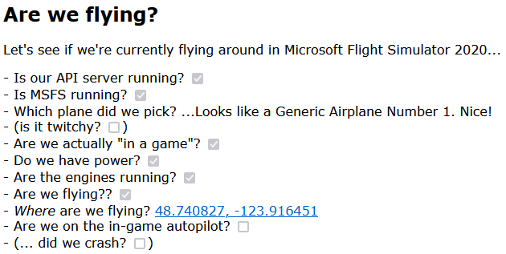

Nothing particularly fancy (although we can pretty much use any amount of CSS to turn it _into_ something fancy), but it lets us see where in the process of firing up MSFS, clicking through to the world map, and starting a flight we are. So let's update our HTML file to include these questions, and then we can update our JS to start answering them:

```html
<h1>Are we flying?</h1>
<p>
  Let's see if we're currently flying around in Microsoft Flight Simulator
  2020...
</p>
<ul>
  <li>
    Is our API server running?
    <input type="checkbox" disabled class="server-online" />
  </li>
  <li>
    Is MSFS running? <input type="checkbox" disabled class="msfs-running" />
  </li>
  <li>
    Which plane did we pick?
    <span class="specific-plane">... nothing yet?</span>
  </li>
  <li>
    Are we actually "in a game"?
    <input type="checkbox" disabled class="in-game" />
  </li>
  <li>
    Do we have power? <input type="checkbox" disabled class="powered-up" />
  </li>
  <li>
    Are the engines running?
    <input type="checkbox" disabled class="engines-running" />
  </li>
  <li>Are we flying?? <input type="checkbox" disabled class="in-the-air" /></li>
  <li>
    <em>Where</em> are we flying? <span class="latitude">-</span>,
    <span class="longitude">-</span>
  </li>
  <li>
    Are we on the in-game autopilot?
    <input type="checkbox" disabled class="using-ap" />
  </li>
  <li>
    (... did we crash? <input type="checkbox" disabled class="plane-crashed" />)
  </li>
</ul>
```

Excellent: boring, but serviceable, so let's move on to the JS side!

First let's write a little convenience file called `questions.js` that we're going to use to (un)check these questions, based on the fact that we have access to the web client's state:

```javascript
const content = await fetch("questions.html").then((res) => res.text());
const questions = document.getElementById(`questions`);
questions.innerHTML = content;

// The query selectors for our elements:
const qss = [
  `server-online`,
  `msfs-running`,
  `in-game`,
  `powered-up`,
  `engines-running`,
  `in-the-air`,
  `using-ap`,
  `plane-crashed`,
  `specific-plane`,
  `latitude`,
  `longitude`,
];

// A bit of house-keeping
const vowels = [`a`, `i`, `u`, `e`, `o`, `A`, `I`, `U`, `E`, `O`];

function titleCase(s) {
  return s.substring(0, 1).toUpperCase() + s.substring(1).toLowerCase();
}

function reCase(e) {
  return e
    .split(`-`)
    .map((s, p) => (p === 0 ? s : titleCase(s)))
    .join(``);
}

// Let's create an object that's { serverOnline: span, msfsRunning: span, ... }
// because that'll make it easier to set text and check checkboxes:
const elements = Object.fromEntries(
  qss.map((e) => {
    const propName = reCase(e);
    return [propName, document.querySelector(`.${e}`)];
  })
);

// And then our questions helper: we're simply going to set every checkbox
// based on what's in the current state, only spending a little more time
// on the plane model, and mostly because we want the right "a" vs. "an"
// depending on whether the title starts with a vowel or not:
export const Questions = {
  update(state) {
    elements.serverOnline.checked = !state.offline;
    elements.msfsRunning.checked = state.MSFS;
    elements.inGame.checked = state.camera?.main < 9;
    elements.poweredUp.checked = state.flightData?.POWERED_UP;
    elements.enginesRunning.checked = state.flightData?.ENGINES_RUNNING;
    elements.inTheAir.checked =
      state.flightData && !state.flightData.SIM_ON_GROUND;
    elements.usingAp.checked = state.flightData?.AUTOPILOT_MASTER;
    elements.planeCrashed.checked = state.crashed;
    elements.latitude.textContent =
      state.flightData?.PLANE_LATITUDE.toFixed(6) ?? `-`;
    elements.longitude.textContent =
      state.flightData?.PLANE_LONGITUDE.toFixed(6) ?? `-`;
    this.modelLoaded(state.flightModel?.TITLE);
  },

  modelLoaded(modelName) {
    let model = `(...nothing yet?)`;
    if (modelName) {
      let article = `a`;
      if (vowels.includes(modelName.substring(0, 1))) article += `n`;
      model = `...Looks like ${article} ${modelName}. Nice!`;
    }
    elements.specificPlane.textContent = model;
  },
};
```

Cool! Of course, this does nothing yet, so let's plug it into our `plane.js` so that we can run through our sequence of "where in the game we are" as part of the update call:

```javascript
...
import { Questions } from "./questions.js";

export class Plane {
  ...

  async updateState(state) {
    this.state = state;
    const now = Date.now();

    // Update our questions:
    Questions.update(state);

    this.lastUpdate = { time: now, ...state };
  }
}
```

And that's the "game state" readback sorted out! Easy-peasy!

### Trying our question list out

Let's try this out:

- Start MSFS,
- then up the server with `node api-server.js` and our client with `node web-server.js --owner --browser` ,
- then look at what happens in the browser as MSFS finished starting up.
- Load up a plane on a runway somewhere, and see what happens.
- Load up a plane mid-flight and see what the checkboxes do! And of course,
- look at what happens when you shut down MSFS, and what happens when you shut down the API server _before_ you shut down the web client.

## Putting our plane on the map

Of course, we still only implemented the code that lets us answer the question list, but that's hardly the only thing we'll want to see on our page. Let's add something that let's us actually _**see**_ something on our webpage... so let's set up a [Leaflet](https://leafletjs.com/) map that we can put our plane on, so we can see what's happening in-sim.

Step one: some HTML to make that work:

```html
<div id="visualization">
  <!-- We'll hook Leaflet into the following div -->
  <div id="map" style="width: 1200px; height: 800px"></div>
</div>
```

And then let's write a `public/js/map.js` that we can import to take care of the map for us:

```javascript
import { waitFor } from "./utils.js";

const DUNCAN_AIRPORT = [48.7566, -123.71134];

// Leaflet creates a global "L" object to work with, so use that to tie into the <div id="map"></div> we have sitting
// in our index.html. However, because independent page scripts can't be imported, we need to wait for it to be available:
const L = await waitFor(async () => window.L);

// With our "L" object available, ler's make a map, centered on Duncan airport:
export const map = L.map("map").setView(DUNCAN_AIRPORT, 15);

// Of course, this won't *show* anything: we still need an actual map tile layer:
L.tileLayer(`https://tile.openstreetmap.org/{z}/{x}/{y}.png`, {
  maxZoom: 19,
  attribution: `© <a href="http://www.openstreetmap.org/copyright">OpenStreetMap</a>`,
}).addTo(map);
```

With a quick look at that `waitFor` function:

```javascript
// Return a promise that doesn't resolve until `fn()` returns a truthy value
export function waitFor(fn, timeout = 5000, retries = 100) {
  return new Promise((resolve, reject) => {
    (async function run() {
      if (--retries === 0) reject(new Error(`max retries reached`));
      try {
        const data = await fn();
        if (!data) return setTimeout(run, timeout, retries);
        resolve(data);
      } catch (e) {
        reject(e);
      }
    })();
  });
}
```

We use this because we don't want to do any map work until Leaflet's been loaded in, and as an external third party library, we have no idea when that might be. We can now add an `import { map: defaultMap } from "./maps.js"` to our `plane.js` and presto! Now our browser page actually has more than just text:


Which is pretty good, but it's lacking a certain something... oh right: our plane. Let's make a quick little plane icon and put that on the map, at the correct latitude and longitude, pointing in the right direction. Let's make a `public/map-marker.html` file and put some code in there:

```html
<div id="plane-icon">
  <div class="bounds">
    <link rel="stylesheet" href="css/map-marker.css" />

    <div class="basics">
      <!-- One normal plane: -->
      
      <!-- And a plane shadow, because seeing a shadow on a map makes a *huge* difference: -->
      
    </div>
  </div>
</div>
```

With that `plane.png` being a simple little non-existent plane silhouette:


Although we do want a bit of CSS here, because while we _could_ rotate this image using JS to point in the right direction, that's a bit silly when CSS lets you use `tranform: rotate(...)` : all we need to do is make sure that the CSS variable `--heading` is some plain number in degrees, and then CSS will do the rest. So...

```css
#plane-icon {
  /* in terms of CSS, our id element is the keeper of CSS-variables: */
  --heading: 0;
  --degrees: calc(1deg * var(--heading));
  --altitude: 0;
  --alt-em: calc(sqrt(var(--altitude)) / 20);
}

#plane-icon .basics {
  /* we want to overlay the plane and its shadow, so mark this element relative */
  position: relative;
}

#plane-icon .basics .shadow {
  /* the higher we're flying, the more our shadow should blur: */
  --shadow-blur-size: calc(1px * var(--alt-em) / 2);
  position: absolute;
  filter: blur(var(--shadow-blur-size)) opacity(0.3);
  transform-origin: center center;
  /* we only need to rotate the shadow */
  transform: rotate(var(--degrees));
}

#plane-icon .basics .plane {
  --elevation-offset: calc(-1em * var(--alt-em)) position: absolute;
  transform-origin: center center;
  /* but we rotate *and* move the real plane icon up based on high it's flying */
  transform: translate(0, var(--elevation-offset)) rotate(var(--degrees));
}
```

Which just leaves the fun part: let's add this icon to our map. First, a little map helper file in `public/js/map-marker.js`:

```javascript
// Load our .html "partial"
const content = await fetch("map-marker.html").then((res) => res.text());
const div = document.createElement(`div`);
div.innerHTML = content;
const MapMarker = div.children[0];

// Then create a little helper function that gets the HTML we need for
// leaflet to put our icon on the map, with some initial heading:
MapMarker.getHTML = (initialHeading) => {
  MapMarker.style.setProperty(`--heading`, initialHeading);
  return MapMarker.outerHTML;
};

// And then just export that.
export { MapMarker };
```

And then we can update our `plane.js`:

```js
import { MapMarker } from "./map-marker.js";

...

class Plane {
  constructor(server, map = defaultMap, location = DUNCAN_AIRPORT, heading = 135) {
    ...
    // bind the map, and add our plane icon:
    this.map = map;
    this.addPlaneIconToMap(map, location, heading);
  }

  /**
   * We'll use Leaflet's "icon" functionality to add our plane:
   */
  async addPlaneIconToMap(map, location, heading) {
    const props = {
      icon: L.divIcon({
        iconSize: [36, 25],
        iconAnchor: [36/2, 25/2],
        className: `map-pin`,
        html: MapMarker.getHTML(heading)
      }),
    };
    // Create our plane icon on the map:
    this.marker = L.marker(location, props).addTo(map);
    // And then cache the resulting HTML element so we can use it later in the code:
    this.planeIcon = document.querySelector(`#plane-icon`);
  }

  /**
   * We've seen this function before =)
   */
  async updateState(state) {
    this.state = state;
    const now = Date.now();
    Questions.update(state);

    // let's update our map!
    if (state.flightData) {
      this.updateMap(state);
    }

    this.lastUpdate = { time: now, ...state };
  }

  /**
   * A dedicated function for updating the map!
   */
  async updateMap({ flightData }) {
    const { map, marker, planeIcon } = this;
    const { PLANE_LATITUDE: lat, PLANE_LONGITUDE: long } = flightData;

    // Do we have a GPS coordinate? (And not the 0,0 off the West coast
    // of Africa that you get while you're not in game?)
    if (lat === undefined || long === undefined) return;
    if (abs(lat) < 0.1 && abs(long) < 0.1) return;

    // Update our plane's position on the map:
    marker.setLatLng([lat, long]);

    // And make sure the map follows our plane, so we don't fly off the screen:
    map.setView([lat, long]);

    // And then set our CSS variables so that the browser "does the rest":
    this.updateMarker(planeIcon.style, flightData);
  }

  /**
   * A dedicated function for updating the marker, which right now means
   * updating the CSS variables we're using to show our plane and shadow.
   */
  updateMarker(css, flightData) {
    // Point the plane in the right direction:
    const heading = flightData.PLANE_HEADING_DEGREES_MAGNETIC;
    css.setProperty(`--heading`, heading);

    // And then also place the plane itself higher than
    // its shadown on the ground, if we're in the air:
    const cg = flightData.STATIC_CG_TO_GROUND;
    const paag = flightData.PLANE_ALT_ABOVE_GROUND;
    css.setProperty(`--altitude`, Math.max(paag - cg, 0));
  }
}
```

And through the magic of "the O.G. web stack" we suddenly have a visualization that shows our plane somewhere in the air, and its shadow on the ground:


Nice!

...

...I mean... I guess it's nicer than note having a plane on the map, but this doesn't really tell us much, does it? How high are we flying? What's our airspeed? Which heading are we actually flying? I think we're going to need some more HTML.And some SVG. And probably some CSS variables. And a smattering of JS.

### Improving our visualization

Let's start by considering what we might want to visualize. We basically want all the information you'd get in a cockpit, but presented in marker form, so let's go for the traditional navigation marker: a compass, with information arranged in and around that. What if we had a nice compass ring around our plane, with heading indication, current speed, and current altitude (both above the ground and "as far as the barometer can tell"). What about something like... this?


Oh yeah: we're getting fancy. We're not using a simple little pin with a text bubble, we're cramming as much MSFS information into our marker as we can:

- Up top we have the current altitude above the ground in feet, with the altitude relative to sea level in parentheses.
- Down below, the speed in knots.
- In the center, we have the plane itself, offset vertically based on its altitude, with a picture that looks like the in-game plane.
- Below it, on the ground, we have the same plane but blurred and made translucent so it looks like a ground shadow.
- Also below the plane we have an altitude line connecting the plane to its GPS position on the map,
- as well as a line indicating both the current heading and speed of the plane.
- The outer compass ring represents the magnetic compass as we see it inside the plane,
- and the an inner compass ring represents the "true" north, based on GPS.
- The outer ring has a red "heading bug" that points in the direction that the plane should be going according to the autopilot,
- as well a green "current heading" marker so we don't have to guess our heading based on the speed line.

How do we build that? With HTML and SVG:

```html
<div id="plane-icon">
  <div class="bounds">
    <link rel="stylesheet" href="css/map-marker.css" />

    <div class="basics">
      
      
      <hr class="alt-line" />
      <hr class="speedo" />
      <hr class="speedarrow" />
      <div class="speed label">0kts</div>
      <div class="alt label">0' (500')</div>
    </div>

    <svg class="compass" viewBox="0 0 200 200">
      <g transform="scale(0.9)">
        <g class="box">
          <path d="M0 100 L 200 100" />
          <path d="M100 0 L 100 200" />
          <rect
            x="0"
            y="0"
            width="200"
            height="200"
            stroke="black"
            fill="none"
          />
        </g>

        <g transform="translate(0,0) scale(0.92)">
          <g class="inner ring">
            <!-- and then a whoooole bunch of SVG code -->
          </g>
          <g class="outer ring">
            <!-- and then even more SVG code -->
          </g>
          <!-- and even more SVG code! -->
        </g>
    </svg>
  </div>
</div>
```

Now, I'm skipping over the SVG code here mostly because it's just a _lot_ of SVG and really all you need is to copy-paste the code [here](https://github.com/Pomax/are-we-flying/blob/main/public/map-marker.html) to keep following along. What's more important is the updates to our CSS:

```css
#plane-icon {
  --speed: 120; /* our airspeed in knots, without a unit */
  --altitude: 1500; /* our altitude in feet, without a unit */
  --heading: 150; /* our magnetic compass heading in degrees, without a unit */
  --heading-bug: 220; /* our "heading bug" compass angle in degrees, without a unit */
  --north: 15.8; /* the compass deviation from true north in degrees, without a unit */
  --alt-em: calc(sqrt(var(--sqrt-alt)) / 20);
  --f: 250;
  --dim: calc(var(--f) * 1px);
  --font-size: calc(var(--dim) / 17);

  font-family: Arial;
  font-size: var(--font-size);
  position: relative;
  top: 11px;
  left: 16px;
}

/*
 And then a whole bunch of CSS that makes use of those variables
*/
```

Again, if you want to follow along grab the CSS [here](https://github.com/Pomax/are-we-flying/blob/main/public/css/map-marker.css), but the important part is those new CSS variables, which we can update on the JS side based on the values we get from MSFS:

```javascript
import { getAirplaneSrc } from "./airplane-src.js";
const { max, sqrt } = Math;

...

export class Plane {

  ...

  /**
   * Our map update function is a little bigger now:
   */
  async updateMap(flightData, now) {
    const { map, marker, planeIcon } = this;
    const { paused, crashed, flightModel } = this.state;
    const { PLANE_LATITUDE: lat, PLANE_LONGITUDE: long } = flightData;

    if (lat === undefined || long === undefined) return;
    if (abs(lat) < 0.1 && abs(long) < 0.1) return;

    marker.setLatLng([lat, long]);
    map.setView([lat, long]);
    this.setCSSVariables(planeIcon.style, flightData);

    // Is the game paused? Or, have we crashed??
    planeIcon.classList.toggle(`paused`, paused);
    planeIcon.classList.toggle(`crashed`, crashed);

    // Make sure we're using the right silhouette image:
    const pic = getAirplaneSrc(flightModel.TITLE);
    [...planeIcon.querySelectorAll(`img`)].forEach(
      (img) => (img.src = `planes/${pic}`)
    );

    // Then update the marker's CSS variables and various text bits:
    this.updateMarker(planeIcon.style, flightData);
  }

  /**
   * Our marker update function is also little bigger now:
   */
  updateMarker(css, flightData) {
    const cg = flightData.STATIC_CG_TO_GROUND;
    const paag = flightData.PLANE_ALT_ABOVE_GROUND;
    const palt = paag - cg;
    const speed = flightData.AIRSPEED_INDICATED;
    const heading = flightData.PLANE_HEADING_DEGREES_MAGNETIC;
    const trueHeading = flightData.PLANE_HEADING_DEGREES_TRUE;
    const bug = flightData.AUTOPILOT_HEADING_LOCK_DIR;

    this.autopilot.setCurrentAltitude(palt);
    css.setProperty(`--altitude`, max(palt, 0));
    css.setProperty(`--sqrt-alt`, sqrt(max(palt, 0)));
    css.setProperty(`--speed`, speed | 0);
    css.setProperty(`--north`, trueHeading - heading);
    css.setProperty(`--heading`, heading);
    css.setProperty(`--heading-bug`, bug);

    const alt = flightData.INDICATED_ALTITUDE;
    const galt = fligthData.GROUND_ALTITUDE;
    const altitudeText = (galt | 0) === 0 ? `${alt | 0}'` : `${palt | 0}' (${alt | 0}')`;
    planeIcon.querySelector(`.alt`).textContent = altitudeText;
    planeIcon.querySelector(`.speed`).textContent = `${speed | 0}kts`;
  }
}
```

And the final bit of the puzzle, `airplane-src.js`, for which we're going to want to create a directory called `public/planes` so that we can fill it with plane icons, like these:


And then with some tactical JS we can swap the correct icon in based on the plane we're flying:

```javascript
export const defaultPlane = `plane.png`;

export function getAirplaneSrc(title = ``) {
  let pic = defaultPlane;
  let plane = title.toLowerCase();

  // let's find our plane!
  if (plane.includes(` 152`)) pic = `152.png`;
  else if (plane.includes(` 310`)) pic = `310.png`;
  else if (plane.includes(` beaver`)) pic = `beaver.png`;
  else if (plane.includes(` kodiak`)) pic = `kodiak.png`;
  else if .....you get the idea...

  // And a quick check: is this the float plane variant?
  if (plane.includes(`amphibian`) || plane.includes(`float`)) {
    pic = pic.replace(`.png`, `-float.png`);
  }

  // Done, return the appropriate icon. Or just `plane.png` if we don't have this plane in our list.
  return pic;
}
```

And that'll do it. Let's fire up MSFS, load a plane into the world, and let's see what that looks like!


That's looking pretty good!

**“Oh, yeah that looks cool! But hold up... why are there _two_ compasses?”** —you, hopefully (again)

Yeah, so, here's a fun thing about our planet: you'd think magnetic lines run north to south, like those pictures of metal filings around a magnet... which they would, if the Earth was a bar-magnet-sized magnet. Instead, it's an _absolutely huge_ and highly imperfect magnet, so if we look at a picture of "how wrong a magnet wrt true north/south anywhere on the planet", things look like this:

<figure style="width: 80%; margin: auto;">
    <a href="https://en.wikipedia.org/wiki/File:World_Magnetic_Declination_2015.pdf">
      
    </a>
    <figcaption style="text-align:center">A map of the magnetic declination on planet Earth</figcaption>
</figure>

The green lines are where a compass will _actually_ point north, but everywhere else on the planet your compass will be off by various degrees. For example, it's only a tiny bit off if you're in Belgium, but at the south tip of the border between Alaska and Canada, your compass will be a pointing a whopping 20 degrees away from true north. When you're flying a plane, you'd better be aware of that, and you better know which of your instruments use compass heading, and which of them use true heading, or you might not get to where you thought you were going.

### Seeing the terrain

So... this looks good, but we're missing one thing: terrain. Maps might be flat, but the world isn't, and when we're flying we'd like to know where the hills and mountains are so we can either avoid them, or plan accordingly. So let's add a terrain layer to our map by updating our `maps.js`:

```javascript
...

// Let's make our layers a little more "data driven" by first defining a list of sources:
const sources = [
  {
    name: `openStreetMap`,
    url: `https://tile.openstreetmap.org/{z}/{x}/{y}.png`,
    maxZoom: 19,
    attribution: {
      url: `http://www.openstreetmap.org/copyright`,
      label: `OpenStreetMap`,
    },
  },
  {
    name: `googleTerrain`,
    url: `http://{s}.google.com/vt/lyrs=p&x={x}&y={y}&z={z}`,
    subdomains: ["mt0", "mt1", "mt2", "mt3"],
    maxZoom: 20,
    attribution: {
      url: `https://www.google.com/permissions/geoguidelines`,
      label: `Google Maps`,
    },
  },
];

// and then converting those to map layers:
const mapLayers = Object.fromEntries(
  sources.map((e) => [
    e.name,
    L.tileLayer(e.url, {
      subdomains: e.subdomains ?? [],
      maxZoom: e.maxZoom,
      attribution: `© <a href="${e.attribution.url}">${e.attribution.label}</a>`,
    }),
  ])
);

// We'll keep the openstreetmap layer as base layer:
mapLayers.openStreetMap.setOpacity(1);
mapLayers.openStreetMap.addTo(map);

// And then we'll add the terrain layer as 50% opacity overlay:
mapLayers.googleTerrain.setOpacity(0.5);
mapLayers.googleTerrain.addTo(map);

...
```

And now our map looks looks **_amazing_**:


### Adding scale to our map

One last thing: we have no idea what the scale of this map is, so let's add something that gives us a sense of distance in both kilometers, and nautical miles. Both common values used in aviation. To do this we'll create a little Leaflet plugin called `public/js/leaflet/nautical.js`:

```javascript
// Based on https://github.com/PowerPan/leaflet.nauticscale/blob/master/dist/leaflet.nauticscale.js
import { waitFor } from "../utils.js";

// Of course, we first need to wait for Leaflet...
const L = await waitFor(async () => window.L);

// Then we can define a new Leaflet control that extends the base Leaflet scale visualization:
L.Control.ScaleNautical = L.Control.Scale.extend({
  options: { nautical: false },
  _addScales: function (options, className, container) {
    L.Control.Scale.prototype._addScales.call(
      this,
      options,
      className,
      container
    );
    L.setOptions(options);
    if (this.options.nautical)
      this._nScale = L.DomUtil.create("div", className, container);
  },
  _updateScales: function (maxMeters) {
    L.Control.Scale.prototype._updateScales.call(this, maxMeters);
    if (this.options.nautical && maxMeters) {
      this._updateNautical(maxMeters);
    }
  },
  _updateNautical: function (maxMeters) {
    const scale = this._nScale;
    const maxNauticalMiles = maxMeters / 1852;
    let nauticalMiles;
    if (maxMeters >= 1852) {
      nauticalMiles = L.Control.Scale.prototype._getRoundNum.call(
        this,
        maxNauticalMiles
      );
    } else {
      nauticalMiles = maxNauticalMiles.toFixed(maxNauticalMiles > 0.1 ? 1 : 0);
    }
    const scaleWidth = (
      this.options.maxWidth *
      (nauticalMiles / maxNauticalMiles)
    ).toFixed(0);
    scale.style.width = `${scaleWidth - 10}px`;
    scale.textContent = `${nauticalMiles} nm`;
  },
});

L.control.scaleNautical = (options) => new L.Control.ScaleNautical(options);

export function setMapScale(
  map,
  metric = true,
  imperial = false,
  nautical = true
) {
  L.control.scaleNautical({ metric, imperial, nautical }).addTo(map);
}
```

How this code works isn't super important, but what it does when we use it, is: if we update our `maps.js` file as follows:

```javascript
import { waitFor } from "./utils.js";
import { Duncan } from "./locations.js";
import { setMapScale } from "./leaflet/nautical.js";

// Wait for leaflet to be available
const L = await waitFor(async () => window.L);

// set our default location to Duncan, BC.
const map = L.map("map").setView(Duncan, 15);

// Since we're flying, we want distances in kilometers, and nautical miles
setMapScale(map);

...
```

And we refresh our browser, we now have a handy-dandy scale marker in the lower left corner:


And now we know how long it'll take us to get places, because 1 knot equals to 1NM per hour. If we're going at 120 knots, then we'll cover 1 nautical mile every thirty seconds.

## Recording our flight path

Seeing ourselves flying around on the map is pretty great, but right now we can only see "where we are", instead of seeing where we've come from. As it turns out, Leaflet supports drawing polygons, so let's also add some "flight tracking" to our web page (not in the least because it's something that will be pretty important for debugging autopilot code later!).

First, we create a little `public/js/trail.js` class because you know how this works by now, new code gets its own file:

```javascript
export class Trail {
  constructor(map, pair, color, opts = {}) {
    this.map = map;
    this.line = undefined;
    this.color = color ?? `blue`;
    this.opts = opts;
    this.coords = [];
    if (pair) this.add(...pair);
  }

  add(lat, long) {
    if (!lat && !long) return;

    const { coords } = this;
    const pair = [lat, long];
    coords.push(pair);

    // If we have fewer than 2 points, we can't draw a trail yet!
    const l = coords.length;
    if (l < 2) return;

    // If we have exactly 2 points, we create the trail polyon
    if (l === 2) {
      this.line = L.polyline([...coords], {
        className: `flight-trail`,
        color: this.color,
        ...this.opts,
      });
      return this.line.addTo(this.map);
    }

    // Otherwise, we simply append this position to the trail.
    this.line.addLatLng(pair);
  }
}
```

Really all this does is wrap some of the administrative functionality for tracking position over time, so that we can just create a `Trail` instance, and add points to it and it'll do the right thing. For instance, it's not going to do anything until there are two points to draw a line with. That's not code we want to constantly have to remember we need to write.

So with that class set up, let's update `plane.js` some more:

```javascript
import { Trail } from "./trail.js";

...

export class Plane {
  ...

  // A little helper function for tracking "the current trail", because we
  // can restart flights as much as we want. Voluntarily, or because we
  // crashed, and those new flights should get their own trail:
  startNewTrail(location) {
    this.trail = new Trail(this.map, location);
  }

  /**
   * We're well-acquainted with this function by now:
   */
  async updateState(state) {
    this.state = state;
    const now = Date.now();
    Questions.update(state);

    // Check if we started a new flight because that requires
    // immediately building a new flight trail:
    const startedFlying = !this.lastUpdate.flying && this.state.flying;
    if (startedFlying) this.startNewTrail();

    // And then update our map.
    if (state.flightData) this.updateMap(state);

    this.lastUpdate = { time: now, ...state };
  }

  async updateMap(flightData, now) {
    const { map, marker, planeIcon } = this;
    const { paused, crashed, flightModel } = this.state;
    const { PLANE_LATITUDE: lat, PLANE_LONGITUDE: long } = flightData;

    if (lat === undefined || long === undefined) return;
    if (abs(lat) < 0.1 && abs(long) < 0.1) return;

    // First off: did we teleport? E.g. did the plane's position change
    // impossibly fast, due to restarting a flight, using the "teleport"
    // function in Parallel 42's "Flow" add-on, etc? Because if so, we
    // need to start a new trail.
    const { PLANE_LATITUDE: lat2, PLANE_LONGITUDE: long2 } = this.lastUpdate.flightData;
    const d = getDistanceBetweenPoints(lat2, long2, lat, long);
    const kmps = (speed ?? 0) / 1944;

    // We'll call ourselves "teleported" if we moved at a speed of over
    // 5 kilometers per second (3.1 miles per second), which is roughly
    // equivalent to mach 14.5, which is a little over half the orbital
    // speed of the international space station.
    const teleported = this.lastUpdate.flightData && d > 5 * kmps;
    if (teleported) this.startNewTrail([lat, long]);

    // Then we can add the current position to our trail
    this.trail.add(lat, long);

    ...
  }

   ...
}
```

Relatively little code, but a profound improvement. Our map now shows the flight path so far:


Alright, now we've got things we can post to Instagram!

## Planes with attitude

There's one thing our fancy marker isn't showing though, which is the current roll and pitch, which would be really nice to be able to see at a glance. So... let's build an [attitude indicator](https://en.wikipedia.org/wiki/Attitude_indicator), also sometimes called an "artificial horizon":


This is a way to visualize whether the plane is pitching up, down, or is flying level, as well as showing whether we're turning left, right, or flying straight. It's a critical part of the cockpit, and it would be very nice if we could see one at all times, too. So just like before, let's whip up a bit of HTML, SVG, CSS, and JS to make that happen.

First an update to `index.html` so that there's a place for the attitude indictor:

```html
<div id="visualization">
  <div id="map" style="width: 1200px; height: 800px"></div>
  <div id="attitude" data-description="Templated from attitude.html"></div>
</div>
```

And then the attitude indicator itself. Thankfully, this will be considerably less code than the airplane marker, so let's create a `public/attitude.html`:

```html
<div id="attitude">
  <div class="frame">
    <link rel="stylesheet" href="/css/attitude.css" />

    <div class="inner-shadow"></div>
    <div class="sky"></div>
    <div class="ground"></div>

    <div class="scales">
      <hr />
      <hr class="minor small" />
      <hr class="minor small" />
      <hr />
      <hr class="small" />
      <hr class="small" />
      <hr />
      <hr class="small" />
      <hr class="small" />
      <hr />
      <hr class="minor small" />
      <hr class="minor small" />
      <hr />
      <hr />
      <div class="center-mark"></div>
      <div class="sky"></div>
      <div class="ground"></div>
    </div>

    <div class="box">
      <div class="bug"></div>
      <div class="gyro">
        <div class="sky">
          <hr class="pitch-marker small" />
          <hr class="pitch-marker" />
          <hr class="pitch-marker small" />
          <hr class="pitch-marker" />
        </div>
        <div class="ground">
          <hr class="pitch-marker small" />
          <hr class="pitch-marker" />
          <hr class="pitch-marker small" />
          <hr class="pitch-marker" />
        </div>
        <div class="box-shadow"></div>
      </div>
    </div>

    <div class="bird">
      <hr />
      <hr />
      <hr />
      <hr />
      <hr />
    </div>
  </div>
</div>
```

With... okay, quite a _lot_ of CSS, so have a look [here](https://github.com/Pomax/are-we-flying/blob/main/public/css/attitude.css) if you're following along, I'll just highlight the important part here, which is (of course) the CSS variables section:

```css
#attitude {
  --bank: 0;
  --pitch: 0;
  --safety-pad: -5%;
  --frame-pad: 7%;
  --box-pad: 5%;
  --active-pad: 10%;
  --dial-space: 3px;
  ...
}

...

#attitude .box .gyro .sky {
  position: absolute;
  top: 0;
  bottom: calc(48% + calc(1% * var(--pitch)));
  left: 0;
  right: 0;
}

...
```

And then we create a little `public/js/attitude.js` file to help us inject and update that:

```javascript
const content = await fetch("attitude.html").then((res) => res.text());
const attitude = document.getElementById(`attitude`);
attitude.innerHTML = content;

export const Attitude = {
  setPitchBank(pitch, bank) {
    attitude.style.setProperty(`--pitch`, pitch);
    attitude.style.setProperty(`--bank`, bank);
  },
};
```

Barely anything to it. Now we just import that and then call the `setPitchBank` function during the update cycle in our `plane.js`:

```javascript
import { Attitude } from "./attitude.js";
...
export class Plane {
  ...
  /**
   * Yet again, we're back in updateState
   */
  async updateState(state) {
    ...

    // Update the attitude indicator:
    const { PLANE_PITCH_DEGREES: pitch, PLANE_BANK_DEGREES: bank } = state.flightData;
    Attitude.setPitchBank(pitch, bank);

    this.lastUpdate = { time: now, ...state };
  }
}
```

And done, that's our attitude indicator hooked up.

## Doing science: plotting our flight telemetry

Before we consider our page work done, though, let's add one more thing: science.

If we want to understand what our plane is doing, especially if we want to understand what our plane is doing in response to input changes (be those human or auto pilot in nature), we need some way to see what happens over time, which means we want graphs. And if we need graphs, we need some code that'll do that graphing for us!

There's quite a few ways to get some nice charts on a page, so instead of running you through the code that this project uses, let's just say that you are spoiled for choice and the choice of whether to use an off-the-shelf library or rolling your own code is entirely up to you. In this specific case, I rolled us some custom code that you can find on the repo under `public/js/dashboard/`, mostly because I wanted something that generates plain SVG that I can just copy-paste from dev tools into a new file, save that as `.svg` and then be able to load it into any SVG viewer/editor. Something that's particularly useful for autopilot debugging.

What matters most is that we can tell the code that we want to plot several graphs, and that each graph has some initial x and y interval that we can grow as needed (`x` representing time and `y` representing "whatever makes sense for the value we're plotting", since heading angle, speed in knots, altitude in feet, etc. all have rather different ranges), which we do with an initial setup:

```javascript
export function initCharts() {
  const colors = {
    background: `#444`,
    plot: `#0F0F`,
    minor: `#9994`,
    major: `#EEE4`,
    axis: `#FF0F`,
  };

  const chartables = {
    ground: {
      addLabel: true,
      min: 0,
      startMax: 500,
      colors,
      axes: {
        minor: { interval: 100, },
        major: { interval: 1000, strokeWidth: 2 },
      },
    },
    altitude: {
      min: 0,
      startMax: 500,
      ...
    },
    ...
  };

  return new Chart(chartables, colors);
}
```

After which we update our `plane.js` to use this charting solution:

```javascript
import { initCharts } from "./dashboard/charts.js";

...

export class Plane {
  constructor(server, map = defaultMap, location = Duncan, heading = 135) {
    ...
    // Set up our chart solution, which will inject some elements
    // into the page that will do the relevant drawing for us:
    this.charts = initCharts();
  }

  /**
   * Where else but updateState?
   */
  async updateState(state) {
    ...

    // And update the graphs... but at this point, let's write a little
    // function that makes "Getting things out of flightData" easier, because
    // we sure are trying to get stuff from it all over the place, and all
    // those ALL_CAPS_VARIABLE_NAMES are making for some unpleasant code...
    this.updateChart(getVarData(state.flightData), now);

    // And that last line in updateState:
    this.lastUpdate = { time: now, ...state };
  }

  /**
   * And then in the updateChart function we simply pick our
   * values, and tell the charting solution to plot them.
   */
  updateChart(varData, now) {
    // Get our variables...
    const { alt, bank, galt, pitch, speed, heading } = varData;
    const { vspeed, trim, aTrim, turnRate } = varData;

    // ...and update all the charts for them!
    this.charts.update({
      ground: galt,
      altitude: alt,
      vspeed: vspeed,
      dvs: (vspeed - this.lastUpdate.vspeed) / (now - this.lastUpdate.time),
      speed: speed,
      pitch: pitch,
      trim: trim,
      heading: heading - 180,
      bank: bank,
      dbank: (bank - this.lastUpdate.bank) / (now - this.lastUpdate.time),
      "turn rate": turnRate,
      "aileron trim": aTrim,
    })
}

/**
 * And here's that function to make getting values out of flightData easier:
 */
function getVarData(flightData) {
  const {
    AILERON_TRIM_PCT: aTrim,
    AIRSPEED_INDICATED: speed,
    AUTOPILOT_HEADING_LOCK_DIR: bug,
    ELEVATOR_TRIM_POSITION: trim,
    GROUND_ALTITUDE: galt,
    INDICATED_ALTITUDE: alt,
    PLANE_ALT_ABOVE_GROUND: paag,
    PLANE_BANK_DEGREES: bank,
    PLANE_HEADING_DEGREES_MAGNETIC: heading,
    PLANE_HEADING_DEGREES_TRUE: trueHeading,
    PLANE_LATITUDE: lat,
    PLANE_LONGITUDE: long,
    PLANE_PITCH_DEGREES: pitch,
    STATIC_CG_TO_GROUND: cg,
    TURN_INDICATOR_RATE: turnRate,
    VERTICAL_SPEED: vspeed,
  } = flightData;
  return {
    ...{ lat, long },
    ...{ alt, bank, bug, cg, galt, paag },
    ...{ heading, pitch, speed, trueHeading },
    ...{ vspeed, trim, aTrim, turnRate },
  };
}
```

Now we can see what our plane is doing over time, which means we're ready to get down to what you started reading this page for. Now that we're some 10,000 words down the page.

<figure style="width: 50%; margin: auto; margin-bottom: 1em; overflow: hidden;" >
  <a href="images/page/science/charts.png" target="_blank">
    
  </a>
  <figcaption style="font-style: italic; text-align: center;">All the data</figcaption>
</figure>
Right. _Let's do this_...

# Part three: writing an autopilot

It's time. Let's write that autopilot.

And while we could do this in the browser, we're going to be adding the main code to our API server, rather than our web page. Don't get me wrong: we _totally could_ write our autopilot in client-side JS, but we'd much rather not have to deal with the delay of network requests from the webpage (even if web sockets are must faster than GET/POST requests), and we definitely don't want to accidentally turn off the autopilot just because we closed a tab... we might be flying a virtual plane, but it'd be nice to keep it in the air instead of just plummeting out of the sky when we accidentally close our browser!

## The code basics

In order to run an auto pilot, we're going to need to set up some code that actually "runs" the auto pilot, and then expose some of that functionality over the network, which requires (unsurprisingly) some new files, and some updates to old files.

### The server side of our autopilot

Let's start with the autopilot code itself, but without any specific piloting logic implemented, since we'll be doing that as we run through this chapter. We'll put this file in `src/autopilot/autopilot.js`:

```javascript
import { AP_VARIABLES } from "./utils/ap-variables.js";
import { State } from "./utils/ap-state.js";

const AUTOPILOT_INTERVAL = 500;

export class AutoPilot {
  constructor(api, onChange = () => {}) {
    this.api = api;
    this.onChange = onChange;
    this.AP_INTERVAL = AUTOPILOT_INTERVAL;
    this.reset();
  }

  reset() {
    this.prevState = new State();
    this.autoPilotEnabled = false;
    this.paused = false;
    this.modes = {} // more on this later
    this.onChange(this.getParameters);
  }

  setPaused(value) {
    this.paused = value;
  }

  async get(...names) {
    if (!this.api.connected) return {};
    return this.api.get(...names);
  }

  async set(name, value) {
    if (!this.api.connected) return;
    this.api.set(name, value);
  }

  async trigger(name) {
    if (!this.api.connected) return;
    this.api.trigger(name);
  }

  async getParameters() {
    return { MASTER: this.autoPilotEnabled };
  }

  async setParameters(params) {
    if (params.MASTER !== undefined) {
      this.autoPilotEnabled = params.MASTER;
      if (this.autoPilotEnabled) {
        // make sure the in-game autopilot is not running.
        const { AUTOPILOT_MASTER: on } = await this.get(`AUTOPILOT_MASTER`);
        if (on === 1) this.trigger(`AP_MASTER`);
        this.runAutopilot();
      }
    }

  async runAutopilot() {
    if (!this.api.connected) return;
    if (!this.autoPilotEnabled) return;
    setTimeout(() => this.runAutopilot(), this.AP_INTERVAL);
    if (this.paused) return;

    const data = await this.get(...AP_VARIABLES);
    const state = new State(data, this.prevState);

    // ...correct the flight as needed here...

    this.prevState = state;
  }
}
```

This relies on [ap-variables.js]() and [ap-state.js]() files, which I won't be listing here mostly because there isn't really anything surprising in them. The variables file is a list of variables, and the state file is similar to the state concept we saw before, for the client, but with an extra bit of code that binds several "delta" functions so we don't just know "our speed" but also "how much our speed changed, per second", for a handful of variables.

Now, in order for the client to trigger autopilot functionality, we'll need to update our `server.js` too:

```javascript
...

import { AutoPilot } from "../../autopilot/autopilot.js";
import { AutopilotRouter } from "./routers/autopilot-router.js";

...

let MSFS = false;
let flying = false;
let autopilot = false;

export class ServerClass {
  init() {
    // Set up the autopilot instance, with a callback that lets the
    // autopilot broadcast its settings whenever they change.
    autopilot = new AutoPilot(api, (params) =>
      this.#autopilotBroadcast(params)
    );
    this.#setupRouting();
    connectServerToAPI(() => this.#onMSFSConnect());
  }

  // This simply notifies all connected clients of the new autopilot parameters.
  async #autopilotBroadcast(params) {
    this.clients.forEach((client) => client.onAutoPilot(params));
  }

  // And in order for clients to be able to call autopilot functions,
  // we add a function routing object as "this.autopilot":
  #setupRouting() {
    this.api = new APIRouter(api, () => MSFS);

    // All clients will now be able to call server.autopilot.[...]
    this.autopilot = new AutopilotRouter(autopilot, (params) =>
      this.clients.forEach((client) => client.onAutoPilot(params))
    );
  }

  // We also need to update our API registration, because when the game is
  // paused, we don't want the autopilot to just "keep going". If it does,
  // it might try to force increasingly severe corrections while the plane
  // "does nothing" so that by the time we unpause, the plane crashes.
  #registerWithAPI(api, autopilot) {
    api.on(SystemEvents.PAUSED, () => {
      autopilot.setPaused(true);
      this.clients.forEach((client) => client.pause());
    });

    api.on(SystemEvents.UNPAUSED, () => {
      autopilot.setPaused(false);
      this.clients.forEach((client) => client.unpause());
    });

    ...

    // the rest of the calls won't need autopilot updates
  }

  // And we need to update the checkFlying function so that
  // every time we start a new flight, we reset the autopilot:
  async #checkFlying(client) {
    ...
    if (flying !== wasFlying) {
      if (flying) this.#autopilot.reset();
      this.clients.forEach((client) => client.setFlying(flying));
    } else if (client) {
      client.setFlying(flying);
    }
  }
}
```

With the associated (small) autopilot function router code:

```javascript
/**
 * "route" handler for autopilot API calls from clients
 */
export class AutopilotRouter {
  #autopilot;
  #broadcastUpdate;

  // ...
  constructor(autopilot, broadcastUpdate) {
    this.#autopilot = autopilot;
    this.#broadcastUpdate = broadcastUpdate;
  }

  // this will be exposed as this.server.autopilot.getParameters() on the client side.
  async getParameters(client) {
    return this.#autopilot.getParameters();
  }

  // this will be exposed as this.server.autopilot.update({ ... }) on the client side.
  async update(client, params) {
    // This should only be callable by authenticated clients =)
    if (!client.authenticated) return false;
    const updatedParameters = await this.#autopilot.setParameters(params);
    this.#broadcastUpdate(updatedParameters);
  }
}
```

Now, our server code is calling `client.onAutoPilot(params)` in the broadcast function, so we better make sure that exists:

```javascript
...
export class ClientClass {
  ...
  onAutoPilot(params) {
    this.setState({ autopilot: params });
  }
  ...
}
```

Nothing to it.

#### Swapping in new code as we update our autopilot

Of course, with all that done, it's probably a good idea to apply the "hot reload" pattern we looked at in part two so that we can update our autopilot code without having to restart our server, so let's quickly update our `server.js`:

```javascript
import url from "node:url";
const __dirname = url.fileURLToPath(new URL(".", import.meta.url));
import dotenv from "dotenv";
dotenv.config({ path: `${__dirname}/../../../.env` });

import { SystemEvents, MSFS_API } from "msfs-simconnect-api-wrapper";

// Set up our code to allow hot-reloading our autopilot code:
import { watch } from "../../api/autopilot/reload-watcher.js";
import { AutoPilot as ap } from "../../api/autopilot/autopilot.js";
let AutoPilot = ap;
watch(__dirname, `../../api/autopilot/`, `autopilot.js`, (lib) => {
  AutoPilot = lib.AutoPilot;
  if (autopilot) {
    Object.setPrototypeOf(autopilot, AutoPilot.prototype);
  }
});

...
```

### The client-side of our autopilot

Of course, we want to be able to control this autopilot from the browser, so we'll need an update to our browser code that allows use to actually turn the autopilot on and off (even if that, right now, does nothing other than toggle a boolean yet!).

First, let's create a little `public/autopilot.html` file:

```html
<div class="controls">
  <link rel="stylesheet" href="/css/autopilot.css" />
  <button class="MASTER">AP</button>
  <!-- we're going to add *so* many options here, later! -->
</div>
```

Which we'll tie into our `index.html`:

```html
<!doctype html>
<html lang="en-GB">
  <head>
    ...
  </head>
  <body>
    ...
    <div id="autopilot" data-description="Templated from autopilot.html"></div>
  </body>
</html>
```

Then we'll create a `public/css/autopilot.css` so we can see when our button has been pressed or not:

```css
#autopilot button.active {
  background: red;
  color: white;
}
```

And then, we'll create a `public/js/autopilot.js` to load in this "partial" and hook up all the buttons... err... button. All the button.

```javascript
const content = await fetch("autopilot.html").then((res) => res.text());
const autopilot = document.getElementById(`autopilot`);
autopilot.innerHTML = content;

export const AP_OPTIONS = {
  MASTER: false,
};

export class Autopilot {
  constructor(owner) {
    this.owner = owner;
    const server = (this.server = owner.server);
    // We're going to add more buttons later, so this code will
    // simply let us add options to AP_OPTIONS without having to
    // add any more code here.
    Object.keys(AP_OPTIONS).forEach((key) => {
      const e = document.querySelector(`#autopilot .${key}`);
      e.addEventListener(`click`, () => {
        // We're going to use the fact whether or not there is an "active"
        // class as indicator of whether the setting is active on the server.
        let value = e.classList.contains(`active`);
        server.autopilot.update({ [key]: !value });
      });
    });
  }

  update(params) {
    if (!params) return;
    // Much like above, this code will simply activate buttons
    // based on the parameter name/value pairs we get sent.
    Object.entries(params).forEach(([key, value]) => {
      const e = document.querySelector(`#autopilot .${key}`);
      // Set the element's "active" class based on whether or not
      // the setting is true or false on the server side.
      e?.classList.toggle(`active`, !!value);
    });
  }
}
```

And then finally, of course, we load that in with the rest of our code in `plane.js`:

```javascript
import { Autopilot } from "./autopilot.js";
...
export class Plane {
  constructor(server, map = defaultMap, location = Duncan, heading = 135) {
    console.log(`building plane`);
    this.server = server;
    this.autopilot = new Autopilot(this);
    ...
  }

  // update our autopilot UI during the update cycle now, too:
  async updateState(state) {
    this.state = state;
    const now = Date.now();

    ...

    // reasonably straight-forward:
    if (state.autopilot) {
      this.autopilot.update(state.autopilot);
    }

    this.lastUpdate = { time: now, ...state };
  }
}
```

The hot reloading section needs to come earlier, that should be part of our initial setup.

### Testing our "autopilot" code

Let's make sure to test this before we move on. Let's:

- start our API server
- start our client web server (with the `--owner` and `--browser` flags)
- we won't need to start MSFS for this one, as nothing we're doing relies on having the game running
- we should see our browser page with our autopilot button:<br>

- and if we click it, we should see it turn red, because it now has an `active` class:<br>

The important thing to realize is that the button doesn't turn red "when we clicked it" because we didn't write any code that adds an `active` class when we click a button. Instead _a lot more_ happens:

1. we pressed the button,
2. that doesn't add a class but instead calls `server.autopilot.update({ MASTER: true })`,
3. which makes the server-side autopilot code update its `MASTER` value,
4. which then triggers an autopilot settings-change broadcast,
5. which calls our client's `onAutoPilot` with the new settings,
6. which we use to update our client's `state.autopilot` value,
7. which automatically gets copied over to the browser,
8. which forwards the state to our `Plane` code
9. which passes it on to the `autopilot.update` function,
10. and _that_, finally, sets an `active` class on the associated button.

And that all happened so fast (even on a laptop from 2015, this takes only a few milliseconds) that as far as you can tell, you just clicked a button and it instantly changed color to show that it's active: that's a good sign! It looks like we'll be able to control our autopilot through the browser without things feeling sluggish or laggy!

## So how does an autopilot actually work?

At its core, an autopilot is a system that lets a plane fly "in a straight line". However, there are two kinds of "straight line" we need to think about, because we're not driving on a road, or gliding through water, we're flying through the air:

1. we can fly in a straight line without turning left or right, and
2. we can fly in a straight line without moving up or down.

The first of these is achieved using, in autopilot parlance, a **wing leveler**, often found as the label `LVL` on autopilot controls, and the second of these is achieved using **altitude hold**, often found as `ALT` on autopilot controls. You can see where the names come from: the first keeps the plane's wings level, keeping us pointing in (roughly) the same compass direction, while the second keeps the plane (roughly) at some fixed altitude.

More fully featured autopilots extend these two modes by adding **altitude set and hold**, which runs altitude hold "at a _*specific*_ altitude", with additional logic to get us from one altitude to another if we need to change, as well as by adding **heading mode**, which effectively runs level mode "for a _*specific*_ compass direction", with additional logic to get us from pointing in one direction to pointing in another.

We start by observing that we _*could*_ try to take all our aeroplane's flight data, then run a bunch of maths on the numbers we get in order to predict when we need to perform which operations in order to make sure that our plane does the right thing in the future, but this will be a losing proposition: the weather, air density changes, random updrafts, terrain-induced wind, the ground effect etc. are all going to interfere with any predictions we'd make.

Instead, we're going to implement our autopilot as a _*reactionary*_ system: it looks at what the current flight data is, and then puts in small corrections that'll push us away from the wrong direction, and we repeat that process over and over and over, every time looking at the new flight data, and then saying which new corrections to make. The trick to getting an autopilot working based on this approach is that if we can do this in a way that makes the corrections smaller and smaller every time we run, we will converge on the desired flight path, barely having to correct anything after a while. The plane will just be flying the way we want it to.

Of course, a real autopilot does this kind of monitoring and correcting on a continuous basis. Something we don't really have the luxury of doing by using JavaScript: in order not to overload both Node.js and MSFS, and in order for us to be able to look at any log data flying by when we need to do console log debugging, let's pick go with running our autopilot twice per second. And despite how coarse that sounds, we'll be able to make our autopilot work at this interval length. And the main reason we'll be able to do that is because the following function:

### The backbone of our autopilot code: constrain-mapping

Before we do anything else, let's first look at what is probably _the_ single most important function in our autopilot: `constrainMap`. This function takes a value, relative to some interval `[a,b]`, and maps it to the corresponding value in a different interval `[c,d]`, such that `a` maps to `c`, `b` maps to `d`, and anything in between `a` and `b` is some new value between `c` and `d`. This is nothing special, that's just numerical mapping, but the critical part here is that in addition to the standard mapping, we also make sure that any value less than `a` _still maps to `c`_ and any value greater than `b` _still maps to `d`_:

<figure style="width: 80%; margin: auto; margin-bottom: 1em;">
  <a href="images/constrain_map.png" target="_blank">
    
  </a>
  <figcaption style="font-style: italic; text-align: center;">Mapping interval [a,b] to [c,d]<br></figcaption>
</figure>

That last part is critically important: if we're going to write an autopilot, we want to be able to effect proportional changes, but we want to "cap" those changes to some minimum and maximum value because just yanking the plane in some direction so hard that it stalls is the opposite of useful.

As such, let's implement `map` and `constrain` functions, and then compose them as `constrainMap`:

```javascript
// map a value relative to some range [a,b] to a new range [c,d]
function map(v, a, b, c, d) {
  const sourceInterval = b - a;
  if (sourceInterval === 0) return (c + d) / 2;
  const targetInterval = d - c;
  return c + ((v - a) * targetInterval) / sourceInterval;
}

// cap a number so that it's always in the range [min, max]
function constrain(v, min, max) {
  if (min > max) return constrain(v, max, min);
  return v > max ? max : v < min ? min : v;
}

// map a value from some range [a,b] to a new range [c,d], constrained to that new range [c,d]
function constrainMap(v, a, b, c, d) {
  return constrain(map(v, a, b, c, d), c, d);
}
```

We're going to rely on this function _a lot_, so now that we know what it does, and how it does it, let's move on to actual autopilot code.

## Implementing cruise control

Through the years different kinds of autopilots have been used, ranging from simple "cruise control" style systems that just keep the plane flying level, to full on auto-takeoff and auto-landing systems for modern commercial jet liners with fully automated navigation, with the pilot basically there to program the plane and taxi it to and from the runway, only still needed during flight in case they need to take over when things go wrong.

So let's start with the simplest of those systems: the autopilot equivalent of cruise control, which requires we implement some wing leveling code, and altitude hold.

### LVL: level mode


Implementing level mode is probably the easiest of all autopilot functions, where we're going to simply check "is the plane tilting left or right?" and if so, we move the **aileron trim**—a value that "biases" the plane to tilt left or right by adjusting the wing surfaces that tilt the plane—in the opposite direction. As long we do that a little bit at a time, and we do that for long enough, we'll eventually have the plane flying level.

So let's implement that. Let's create an `api/autopilot/fly-level.js` file with some scaffolding:

```javascript
import { radians, constrainMap } from "../utils.js";

// Some initial constants: we want to level the wings, so we want a bank of zero degrees:
const DEFAULT_TARGET_BANK = 0;
// And if we do need to turn, we don't want to turn more than 30
// degrees; the universally "safe" bank angle.
const DEFAULT_MAX_BANK = 30;

// And we also don't want our bank to change more than 3 degrees per second.
const DEFAULT_MAX_TURN_RATE = 3;

// Now, we have no features yet, but we'll be adding those as we go, so we can
// quickly and easily compare how our code behaves when we turn a feature on or off!
const FEATURES = {};

// Then, our actual "fly level" function, which  we're going to keep very "dumb":
// each time we call it, it gets to make a recommendation, without any kind of
// history tracking or future predictions. This keeps the code simple, and allows
// us to hot-reload the code without ever messing up some kind of "data tracking".
export async function flyLevel(autopilot, state) {
  // in order to make this work, we'll extend the autopilot with a "trim vector"
  // that lets us update pitch, roll, and yaw trim values on an ongoing basis.
  const { trim } = autopilot;

  // Get our current bank/roll information:
  const { bankAngle: bank, dBank, speed } = state;

  // While not strictly necessary yet, we'll restrict how much we're allowed
  // to (counter) bank based on how fast we're going. A hard bank at low
  // speed is a good way to crash a plane.
  const maxBank = constrainMap(speed, 50, 200, 10, DEFAULT_MAX_BANK);

  // How big should our corrections be, at most?
  const step = constrainMap(speed, 50, 150, radians(1), radians(5));

  // And "how much are we off by?"
  const targetBank = DEFAULT_TARGET_BANK;
  const diff = targetBank - bank;

  // Then, we determine a trim update, based on how much we're off by:
  let update = 0;

  // As our main correction, we're basing it directly off our bank difference:
  // the more we're banking, the more we correct, although if we're banking
  // more than "max bank", correct based off the max bank value instead.
  update -= constrainMap(diff, -maxBank, maxBank, -step, step);

  // Also, counter-correct based on the current change in bank angle,
  // so that we don't en up jerking the plane around.
  const maxDBank = DEFAULT_MAX_TURN_RATE;
  update += constrainMap(dBank, -maxDBank, maxDBank, -step / 2, step / 2);

  // Update the trim vector, and then tell MSFS what the new value should be:
  trim.roll += update;
  autopilot.set("AILERON_TRIM_PCT", trim.roll);
}
```

If we remove all the comments, we just implemented a flight leveler in less than 20 lines of code. That's pretty good! ...but let's run through it in text rather than just code anyway, so we understand what's happening here:

We then implement our wing leveling code by solving two problems at the same time:

1. we want to get to a situation where our **bank angle** (the angle of the wings with respect to level flight) is zero, and
2. we want to get to a situation where our **bank acceleration** (how fast the bank angle changes per second) is also zero.

So we start by getting our current bank and bank acceleration values, and defining our maximum allowed values for those, then:

1. We correct our bank in our first `update += ...`: if we're banking a lot, we want to correct a lot, and if we're banking a little, we want to correct just a little, and if we're perfectly level, we don't want to correct at all. Which is exactly what we wrote `constrainMap` to do for us.
2. Then, we correct our bank acceleration in the next `update -= ...`, by trimming opposite to the direction that our bank is accelerating in. This will undo some of our bank correction, but as long as we use a smaller step size than for our bank correction, the code will "prioritize" zeroing our bank angle over our bank acceleration.
3. Finally, we update our trim, and then we wait for the autopilot to trigger this function again during the next run, letting us run through the same procedure, but with (hopefully!) slightly less wrong values. Provided that this function runs enough times, we'll converge on level flight, and that's exactly what we want.

Although we do still need to update the autopilot code so that we can turn this feature on and off. First, we'll define a constants file for housing things like autopilot modes in `autopilot/utils/constants.js`:

```javascript
export const LEVEL_FLIGHT = `LVL`;
```

Big change, very exiting.

Then, we update the autopilot code to make use of this new constant, and we'll add that `trim` vector for tracking how much we need to trim in each direction:

```javascript
import url from "node:url";
const __dirname = url.fileURLToPath(new URL(".", import.meta.url));

// Import our new constant...
import { LEVEL_FLIGHT } from "./utils/constants.js";

// ...and import the "fly level" code using our hot-reloading technique
import { watch } from "./reload-watcher.js";
import { flyLevel as fl } from "./fly-level.js";
let flyLevel = fl;
watch(__dirname, `fly-level.js`, (lib) => (flyLevel = lib.flyLevel));

export class Autopilot {
  constructor(...) {
    ...
    // Next up, we explicitly add a "fly level" autopilot mode:
    this.modes = {
      [LEVEL_FLIGHT]: false,
    }
    // And we set up that trim vector:
    this.resetTrim();
  }

  resetTrim() {
    this.trim = {
      pitch: 0, // we'll use this for our "altitude hold" code, coming up.
      roll: 0, // and we'll use this for our "fly level" code.
      yaw: 0, // whether we'll use this... we'll see. If we do, it'll be for rudder work.
    };
  }

  async setParameters(params) {
    if (params.MASTER !== undefined) {
      this.autoPilotEnabled = !!params.MASTER;
      if (this.autoPilotEnabled) {
        // Now that we're actually going to do things that the in-game auto
        // pilot might *also* be doing, it's super important that we check
        // the in-game auto pilot setting, and turn it off if it's on:
        const { AUTOPILOT_MASTER: on } = await this.get(`AUTOPILOT_MASTER`);
        if (on === 1) this.trigger(`AP_MASTER`);
        // Only then we can start running our own autopilot.
        this.runAutopilot();
      }
    }
    // Update everything that we're being told to update:
    Object.entries(params).forEach(([key, value]) =>
      this.setTarget(key, value)
    );
    // And then trigger the broadcast function that sends
    // the new auto pilot state to all connected clients:
    this.onChange(this.getAutoPilotParameters());
  }

  // Set a specific mode to some specific value:
  setTarget(type, value) {
    const { modes } = this;
    // If we don't know the mode we're being told to change, we ignore it.
    if (modes[type] === undefined) return;
    // Otherwise, we update the value and then trigger a "what to do after" call:
    const prev = modes[type];
    modes[type] = value;
    this.onParameterChange(type, prev, value);
  }

  // And then our "what to do after" code:
  async onParameterChange(type, oldValue, newValue) {
    // We currently only have one mode, so...
    if (type === LEVEL_FLIGHT) {
      // Let's make sure we can see this mode getting turned on and off:
      console.log(`${newValue ? `E`: `Dise`}ngaging level mode`);
      if (newValue === true) {
        // when we turn on flight levelling, we want to make sure that the
        // trim vector has the right value in it before we start updating it,
        // or things might get really dangerous, really fast. Most planes
        // need a non-zero trim value to fly level "manually", so if we
        // leave the trim set to zero, we *could* even damage a plane!
        this.trim.roll = (await this.get("AILERON_TRIM_PCT")).AILERON_TRIM_PCT;
      }
    }
  }

  // And then the part we've all been waiting for: actually doing something!
  async runAutopilot() {
    ...
    const data = await this.get(...AP_VARIABLES);
    const state = new State(data, this.prevState);

    // If "level flight" mode is active, run our code!
    if (this.modes[LEVEL_FLIGHT]) flyLevel(this, state);

    this.prevState = state;
  }
}
```

Now, we could test this immediately, but we've only implemented half of an auto pilot solution, no matter how simple we're keeping things right now. So let's implement the other half so we can do some in-game testing!

### ALT: altitude hold


Next up: making the plane hold its vertical position. This requires updating the "elevator trim" (also known as pitch trim) rather than our aileron trim, by looking at the plane's vertical speed. That is, we're going to look at how fast the plane is moving up or down through the air, and then we're going to try to get that value to zero by pitching the plane a little in the direction that counteracts the vertical movement.

Let's add a new constant to our `constants.js` file:

```javascript
export const LEVEL_FLIGHT = `LVL`;
export const ALTITUDE_HOLD = `ALT`;
```

And then let's add this new mode to our autopilot, too:

```javascript
import { LEVEL_FLIGHT, ALTITUDE_HOLD } from "./utils/constants.js";

...

// We'll be doing some hot-reload-watching here too:
import { altitudeHold as ah } from "./altitude-hold.js";
let altitudeHold = ah;
watch(__dirname, `altitude-hold.js` (lib) => (altitudeHold = lib.altitudeHold));

export class Autopilot {
  constructor(...) {
    ...
    // Naturally, add our new autopilot mode:
    this.modes = {
      [LEVEL_FLIGHT]: false,
      [ALTITUDE_HOLD]: false,
    }
    ...
  }

  async processChange(type, oldValue, newValue) {
    if (type === LEVEL_FLIGHT) {
      ...
    }

    // We now have two modes!
    if (type === ALTITUDE_HOLD) {
      console.log(`${newValue ? `E`: `Dise`}ngaging altitude hold`);
      // Just like before, we want to start our automated trim relative
      // to whatever trim the user already set, not relative to zero.
      const { ELEVATOR_TRIM_POSITION: pitch } = await this.get("ELEVATOR_TRIM_POSITION");
      this.trim.pitch = pitch;
    }
  }

  async runAutopilot() {
    ...

    // And now we can run two autopilot functions!
    if (this.modes[LEVEL_FLIGHT]) flyLevel(this, state);
    if (this.modes[ALTITUDE_HOLD]) altitudeHold(this, state);

    this.prevState = state;
  }
}
```

Well okay, we do still need to actually write our `altitudeHold` function, so let's create an `autopilot/altitude-hold.js`:

```javascript
import { radians, constrainMap } from "./utils/utils.js";
const { abs } = Math;

// Our default vertical speed target, if we want to hold our current
// altitude, is obviously zero.
const DEFAULT_TARGET_VS = 0;

// Also, we don't want our vertical speed to exceed 1000 feet per
// minute, although depending on what's happening that might change.
const DEFAULT_MAX_VS = 1000;

// And in order to make sure that in trying to reach that target
// from whatever our current vertical speed is, we limit by
// how much the vertical speed's allowed to change per iteration.
const DEFAULT_MAX_dVS = 100;

// The elevator trim uses a super weird unit, where +/- 100% maps
// to "pi divided by 10", i.e. +/- 0.31415[...], so we need to
// have steps that make sense in radians: our small step roughly
// maps to a 0.002% step, and our large step maps to roughly 0.2%
const SMALL_TRIM = radians(0.001);
const LARGE_TRIM = radians(0.035);

// Similar to the flyLevel code, we have no features yet, but we'll
// be adding those as we go, so we can quickly and easily compare
// how our code behaves when we turn a feature on or off.
const FEATURES = {};

// Then, our actual "hold altitude" function, which we're going to
// keep as dumb" as the "fly level" code: each time we call it, it
// gets to make a recommendation, without any kind of history tracking
// or future predictions. This keeps the code simple, and allows us
// to hot-reload the code.
export async function altitudeHold(autopilot, state) {
  // Each plane has different min/max pitch trim values, so
  // let's find out what our current plane's values are:
  const { trim } = autopilot;
  let trimLimit = state.pitchTrimLimit[0];
  trimLimit = trimLimit === 0 ? 10 : trimLimit;

  // And then determine a "lower end" and "upper end" trim step:
  const small = constrainMap(trimLimit, 5, 20, SMALL_TRIM, LARGE_TRIM);
  const trimStep = 10 * small;

  // Next: what are our current vertical speed parameters?
  const { verticalSpeed: VS, dVS } = state;
  const maxVS = DEFAULT_MAX_VS;

  // And what should those parameters be instead, if want to maintain our altitude?
  let { targetVS } = await getTargetVS(autopilot, state, maxVS);
  const diff = targetVS - VS;

  // Just like in the flyLevel code, we first determine an update
  // to our trim, and then apply that only once we're done figuring out
  // all the increments and decrements that should involve:
  let update = 0;

  // Set our update to trim towards the correct vertical speed:
  update += constrainMap(diff, -maxVS, maxVS, -trimStep, trimStep);

  // And if we're accelerating too much, counter-act that a little:
  const maxdVS = constrainMap(abs(diff), 0, 100, 0, DEFAULT_MAX_dVS);
  update -= constrainMap(dVS, -maxdVS, maxdVS, -trimStep / 2, trimStep / 2);

  // Finally, apply the new trim value:
  trim.pitch += update;
  autopilot.set("ELEVATOR_TRIM_POSITION", trim.pitch);
}

// This function determines what our target vertical speed should
// be in order to reach our desired stable flight. For now, this
// function simply sets the target VS to zero, but that's going to
// change almost immediate after we test this code, because we'll
// discover that you can't really "hold an altitude" if you don't
// actually write down what altitude you should be holding =)
async function getTargetVS(autopilot, state, maxVS) {
  let targetVS = DEFAULT_TARGET_VS;
  // So: we'll be putting some more code here *very* soon.
  return { targetVS };
}
```

So that's a little more code than `flyLevel`, but not much more, still being less than 30 lines of code if we remove comments. So, let's go over this code, too.

- Again, because we added a trim vector to our autopilot, we can use its `pitch` component for our up/down trimming.
- And again, because some planes have explicit aileron trim controls, we want to make sure we don't "overwrite" any existing trim setting when we engage the autopilot, so we make sure to copy over the trim value into `trim.pitch` when the user turns altitude hold on.
- Again, we implement our altitude hold as solving two problems at the same time :
  1. We want to get to a situation where our **vertical speed** (how much we're flying up or down) is zero, and
  2. we want to get to a situation where our **vertical acceleration** is also zero.

Just like before we prioritize the former by giving the latter a smaller step, and we're good to go.

We do need to pause at those `SMALL_TRIM` and `LARGE_TRIM` values, because those aren't really based on the flight model: there just isn't really anything in the flight model values that MSFS gives us access to that we can use to determine how big our trim step should be, so these values came about by me just flying around MSFS for several days using different aeroplanes to find values that seemed reasonable in relation to the trim limits that we _do_ have access to. That's not ideal, but it's good enough.

### Testing our code

Now that we have a working "fly level" and "hold altitude" implementation, let's see how we're doing! And spoilers: we're going to discover we forgot something pretty important that'll impact both how level we're flying, and how well we're holding our altitude. We're going to write some more code, but first let's do some science and actually see what happens with the code we wrote above in place.

In order to see how well our code works, we'll be flying around a bit in The [De Havilland DHC-2 "Beaver"](https://en.wikipedia.org/wiki/De%5FHavilland%5FCanada%5FDHC-2%5FBeaver), a fun little piston engine bush plane:


And our order of operations will be to spawn the plane at cruise altitude in above the middle of the pacific ocean in fair weather, have it stabilize itself on the in-game autopilot as a substitute for manually trimming the plane, and then switch to our own autopilot (which will turn off the in-game one) to see how well that holds up. And then we're going to compare our "before" and "after" graphs to see what we can learn:

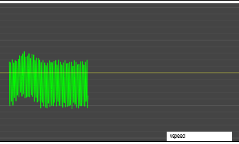

After the initial spawn-in behaviour, with the in-game autopilot pulling the plane into a stable path, we reload the browser to clear our graphs, and then we turn on our autopilot with both "fly level" and "hold altitude" turned on. And then... uh... well, as you can see, while our vertical speed oscillates around zero, which is what we want, it also oscillates by **a lot** around zero, which is _not_ what we want. That would be a really uncomfortable flight. To counteract that, let's do some fixing.

## Fixing our code

### A better altitude hold

In order to reduce our oscillations, we're going to reduce the effect of our update, the closer we are to our target vertical speed, and we could get fancy with all kinds of maths functions, but instead we're going to keep things rather dumb but easily serviceable, by implementing a step-wise reduction: if we're within 100fpm of our target vertical speed (which should be most of the time!), take the update and halve it. And if we're within 20 fpm of our target speed (which should _hopefully_ be most of the time?) we halve it again. Let's add the following code while both the sim and our code are running:

```javascript
...
const FEATURES = {
  DAMPEN_CLOSE_TO_ZERO: true,
};

...

export async function altitudeHold(autopilot, state) {
  ...

  const maxdVS = constrainMap(abs(diff), 0, 100, 0, DEFAULT_MAX_dVS);
  update -= constrainMap(dVS, -maxdVS, maxdVS, -trimStep / 2, trimStep / 2);

  // By making this a "feature" we can toggle it on and off as we please to play around with tweaks:
  if (DAMPEN_CLOSE_TO_ZERO) {
    const aDiff = abs(diff);
    if (aDiff < 100) update /= 2;
    if (aDiff < 20) update /= 2;
  }

  trim.pitch += update
  ...
}
```

If we save, this will hot-reload our code so that it immediately kicks in without us having to interrupt the flight, and we can immediately see the difference that makes, with a brief spike because the behaviour has changed, and then some **drastically** better behaviour (ignoring the second spike, because it's hard to perfectly control the wind in MSFS):

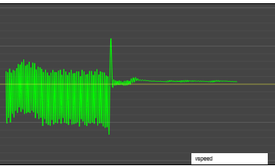

Clearly, we've significantly cut down by how much we're oscillating, which is good! But if you look at the graph our vertical speed is now perpetually "more than zero"... not a lot, but we're definitely drifting, which isn't _quite_ the same as holding altitude... So we probably need to tell our autopilot _which altitude we want to hold_. Something that's surprisingly easy to add:

```javascript
...

const FEATURES = {
  DAMPEN_CLOSE_TO_ZERO: true,
  TARGET_TO_HOLD: true,
};

// Instead of trying to aim for a target VS of zero, let's base our target VS
// on how close we are to a *specific* target altitude to hold:
async function getTargetVS(autopilot, state, maxVS) {
  let targetVS = DEFAULT_TARGET_VS;
  let altDiff = undefined;

  // next feature!
  if (TARGET_TO_HOLD) {
    // Get our hold-altitude from our autopilot mode:
    const targetAltitude = autopilot.modes[ALTITUDE_HOLD];
    if (targetAltitude) {
      // And then if we're above that altitude, set a target VS that's negative,
      // and if we're below that altitude, set a target VS that's positive:
      altDiff = targetAltitude - state.altitude;
      targetVS = constrainMap(altDiff, -200, 200, -maxVS, maxVS);
    }
  }

  return { targetVS, altDiff };
}
```

This will require we massage our browser code a little so we can actually set that altitude in our `autopilot.html`:

```html
<div class="controls">
  ...
  <label>Target altitude: </label>
  <input
    class="altitude"
    type="number"
    min="0"
    max="40000"
    value="4500"
    step="100"
  />
  <button title="altitude hold" class="ALT">ALT</button>
</div>
```

And then we can update our browser's `autopilot.js` to work with that number input field:

```javascript
...

export class Autopilot {
  constructor(owner) {
    ...

    Object.keys(AP_DEFAULT).forEach((key) => {
      const e = document.querySelector(`#autopilot .${key}`);
      e?.addEventListener(`click`, () => {
        e.classList.toggle(`active`);
        let value = e.classList.contains(`active`);
        // Special handling for our altitude mode: instead of a
        // boolean, let's make this our desired altitude in feet:
        if (value) {
          if (key === `ALT`) {
            value = document.querySelector(`#autopilot .altitude`).value ?? 1500;
          }
        }
        server.autopilot.update({ [key]: value });
      });
    });

    // And then we also add an onchange handler to our number
    // field so that if that changes, we let the server know:
    document
      .querySelector(`#autopilot .altitude`)
      ?.addEventListener(`change`, (evt) => {
        server.autopilot.update({ ALT: evt.target.value });
        evt.target.blur();
      });
  }

  // And then we also add some ALT-specific code to our update function:
  update(params) {
    if (!params) params;
    Object.entries(params).forEach(([key, value]) => {
      document
        .querySelector(`#autopilot .${key}`)
        ?.classList.toggle(`active`, !!value);

      // Because if the autopilot's altitude changes, we want to make
      // sure that the page in the browser reflects that new value:
      if (value && key === `ALT`) {
        const altitude = document.querySelector(`#autopilot .altitude`);
        // With one caveat: if our cursor is in the number field, then it's
        // safe to say we're trying to set a (new) number and they autopilot
        // update should not suddenly change the input field value.
        if (!altitude || altitude === document.activeElement) return;
        altitude.value = parseFloat(value).toFixed(1);
      }
    });
  }
}
```

With that, we can save our file, make sure to tell the AP that we want to hold "whatever altitude we're now on", and then watch the result play out in our graphs:

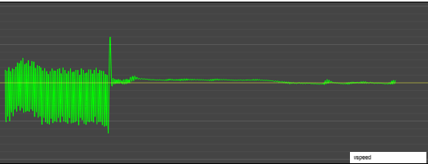

And now we're centered around zero instead of being biased towards a slight drift. But as much as that looks great, how are we doing compared to the in-game AP? Simple enough to find out: let's set the in-game AP to hold altitude and turn off our own autopilot. Will we be able to tell the difference?

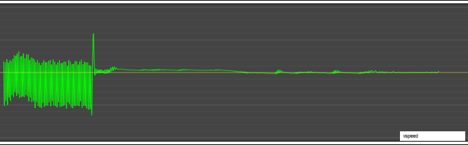

### Changing altitudes

Turns out, we can, but that's a pretty small difference: we've done well! So what about if we change altitudes? Let's have the plane fly at 1500 feet, then change it to 2000 until it's stable, and then make it fly back down to 1500:

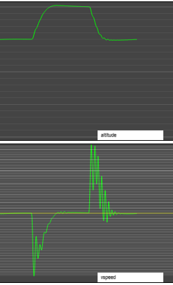

As you can see, that's a bit... jagged. We're changing altitude correctly, but we're also bobbing up and down a lot, so let's smooth that out by, instead of just immediately setting our `targetVS` to the maximum value setting it to "something higher (or lower) than our current VS" until we reach maximum vertical speed:

```javascript
const FEATURES = {
  ...
  SMOOTH_RAMP_UP: true,
};

...

async function getTargetVS(autopilot, state, maxVS) {
  ...

  const targetAltitude = autopilot.modes[ALTITUDE_HOLD];
  if (targetAltitude) {
    altDiff = targetAltitude - currentAltitude;

    if (FEATURES.SMOOTH_RAMP_UP) {
      const direction = sign(altDiff);
      const plateau = 200;

      // If we're more than <plateau> feet away from our target, ramp
      // our target up to maxVS, and keep it there.
      if (abs(altDiff) > plateau) {
        // start ramping up our vertical speed until we're at maxVS
        if (abs(VS) < maxVS) {
          const step = direction * plateau;
          targetVS = constrain(VS + step, -maxVS, maxVS);
        } else {
          targetVS = direction * maxVS;
        }
      }

      // And if we're close to the target, start reducing our target
      // speed such that our target VS is zero at our target altitude.
      else {
        targetVS = constrainMap(altDiff, -plateau, plateau, -maxVS, maxVS);
      }
    }

    // if we're not smooth-ramping, we just target maxVs, same as we did before:
    else {
      targetVS = constrainMap(altDiff, -plateau, plateau, -maxVS, maxVS);
    }
  }

  return { targetVS, altDiff };
}
```

By giving the plane a smaller difference to overcome, we get much smoother transition curves:

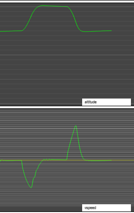

### Tidying up our ALT

So let's just put in three more "fixes" before we move on, mostly because we're here now anyway, and they're very easy to add:

1. skipping truly tiny updates
2. boosting tiny updates if we need to go up, but we're going down, if if we need to go down but we're going up, and
3. making sure we don't trim past +/- 100%

All of these should make intuitive sense, and they're very little work to put in:

```javascript
const FEATURES = {
  ...
  STALL_PROTECTION: true,
  SKIP_TINY_UPDATES: true,
  BOOST_SMALL_CORRECTIONS: true,
  LIMIT_TRIM_TO_100: true,
};

...

export async function altitudeHold(autopilot, state) {
  ...

  const updateMagnitude = update / trimStep;

  // Skip tiny updates if we're already moving in the right direction
  if (FEATURES.SKIP_TINY_UPDATES && sign(targetVS) === sign(VS) && abs(updateMagnitude) < 0.001) return;

  // Boost small updates if we're moving in the wrong direction
  if (FEATURES.BOOST_SMALL_CORRECTIONS && sign(targetVS) !== sign(VS) && abs(updateMagnitude) < 0.01) update *= 2;

  trim.pitch += update;

  if (FEATURES.LIMIT_TRIM_TO_100) trim.pitch = constrain(trim.pitch, -Math.PI / 20, Math.PI / 20);

  autopilot.set("ELEVATOR_TRIM_POSITION", trim.pitch);
}


```

And that's it. Three constants, three lines of code. The effect of these are pretty subtle: the first two make our behaviour around out hold altitude oscillate just a _tiny_ bit less, and the last one prevents us from telling MSFS to trim past what would be realistic values. Which it will happily do if we tell it to, so let's not tell it to!

...buuuuuut there's another problem, and if you guessed "well if our `altitudeHold` has this problem, then `flyLevel` probably has the same problem?", then you're spot on: even though the plane isn't noticeably banking, that doesn't mean we're _actually_ flying straight, it just means we're not noticeably banking. We could still be drifting ever so gently left or right, and any kind of wind can easily blow us in whichever way it likes without our autopilot noticing we're in a turn. Just with a _very_ large turn radius. So let's address that problem, too, by turning our "fly level" code into "fly a specific heading" mode.

### Flying straight, not just level

Similar to our altitude hold fix, let's add a way to indicate that we want to fly a specific _heading_, not just "with the wings seemingly level", because... well, the graph kind of speaks for itself:

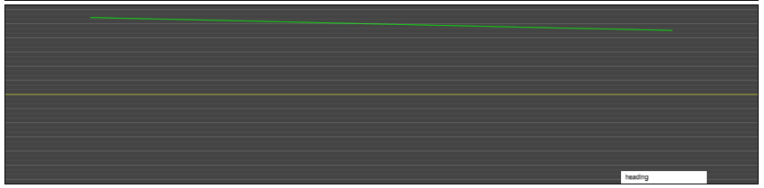

We're turning, just _very_ slowly. So let's fix that by adding some UI and code that lets us hold a specific heading. We'll start with the browser, adding a heading field and button in `autopilot.html`

```html
<div class="controls">
  ...
  <label>Target heading: </label>
  <input class="heading" type="number" min="1" max="360" value="360" step="1" />
  <button title="heading mode" class="HDG">HDG</button>
</div>
```

And the associated update to the browser's `autopilot.js`:

```javascript
export const AP_DEFAULT = {
  MASTER: false,
  LVL: false,
  ALT: false,
  HDG: false,
};

/**
 * ...docs go here...
 */
export class Autopilot {
  /**
   * ...docs go here...
   */
  constructor(owner) {
    ...
      ...
        if (value) {
          ...
          // Just like we did for ALT, we turn HDG from a boolean into a number:
          if (key === `HDG`) {
            value = document.querySelector(`#autopilot .heading`).value ?? 360;
          }
        }
      ...
    ...

    // And then again just like for altitude, we add an onchange handler for heading.
    document
      .querySelector(`#autopilot .heading`)
      ?.addEventListener(`change`, (evt) => {
        const { value } = evt.target;
        server.autopilot.update({ HDG: value });
        evt.target.blur();
      });
  }

  update(params) {
    if (!params) params;
    Object.entries(params).forEach(([key, value]) => {
      ...
      // and then we also add the same input field update logic
      if (value && key === `HDG`) {
        const heading = document.querySelector(`#autopilot .heading`);
        if (!heading || heading === document.activeElement) return;
        heading.value = parseFloat(value).toFixed(1);
      }
    });
  }
}
```

Then a minor update to the server's `autopilot.js` because we want to be able to see where we're going, in-game, even if our autopilot is running outside the game:

```javascript
import { ALTITUDE_HOLD, HEADING_MODE, LEVEL_FLIGHT } from "./utils/constants.js";

export class AutoPilot {
  constructor(...) {
    ...
    this.modes = {
      [LEVEL_FLIGHT]: false,
      [ALTITUDE_HOLD]: false,
      [HEADING_MODE]: false,
    };
    ...
  }

  async processChange(type, oldValue, newValue) {
    ...
    if (type === HEADING_MODE) {
      if (newValue !== false) {
        console.log(`Engaging heading hold at ${newValue} degrees`);
        // When we set a heading, update the "heading bug" in-game:
        this.set("AUTOPILOT_HEADING_LOCK_DIR", newValue);
      }
    }

    this.onChange(this.getParameters());
  }
```

Then, we can update `flyLevel` to take heading into account:

```javascript
...

const FEATURES = {
  FLY_SPECIFIC_HEADING: false,
};

...

export async function flyLevel(autopilot, state) {
  ...
  // Our "how much are we off" information... which we're going to rewrite
  // a little by instead calling a function to do the work for us:
  const turnRate = state.turnRate;
  const { targetBank, maxTurnRate } = getTargetBankAndTurnRate(autopilot, state, maxBank);
  const diff = targetBank - bank;
  ..
}

// And our new function:
function getTargetBankAndTurnRate(autopilot, state, maxBank) {
  const heading = state.heading;
  let targetBank = DEFAULT_TARGET_BANK;
  let maxTurnRate = DEFAULT_MAX_TURN_RATE;

  // If there is an autopilot flight heading set (either because the
  // user set one, or because of the previous waypoint logic) then we
  // set a new target bank, somewhere between zero and the maximum
  // bank angle we want to allow, with the target bank closer to zero
  // the closer we already are to our target heading.
  let flightHeading = FEATURES.FLY_SPECIFIC_HEADING && autopilot.modes[HEADING_MODE];
  if (flightHeading) {
    const hDiff = getCompassDiff(heading, flightHeading);
    targetBank = constrainMap(hDiff, -30, 30, maxBank, -maxBank);
    maxTurnRate = constrainMap(abs(hDiff), 0, 10, 0.02, maxTurnRate);
  }

  return { targetBank, maxTurnRate };
}
```

Now, really all we need to do is just save this and then look at what this does to our heading:

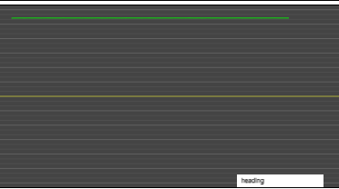

That looks pretty straight to me!

## More testing

In order to test our improvements, we're going to repeat the kind of flight we had before, but instead of just turning on level mode and altitude hold, we'll also turn on heading mode for "whatever heading we're flying when turn things on". Then, we're going to _change_ the heading, and see what happens. In the following graph, we start off flying an altitude of 2000 feet, with a heading of 345 degrees, and then after flying that for a while, we change the intended heading to 270 degrees, and then after a while we change it back to 345 degrees:

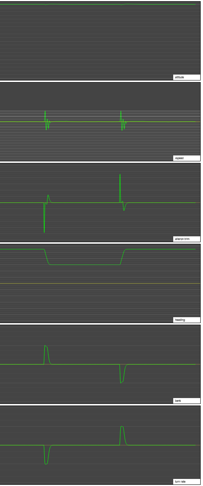

What are we seeing here? On the left we see our altitude behaviour and our aileron trim, and on the right we see our heading and bank behaviour. As you can see, we are flying dead straight until we switch from 345 to 270, at which point the plane banks up to its allowed maximum bank, then gradually banks less and less as we approach our new target heading. At the same time, on the left we can see th1at when we do that, we lose a bit of altitude. Not much, and not enough to put another fix in the code for, but it's an important little detail to be aware of.

### Emergency intervention

Of course, accidents happen, so as one last "test": what happens if we bump the yoke while on autopilot? Let's yank the yoke until the plane beeps, indicating a _serious_ problem, and then letting go again. As it turns out, our AP can't currently deal with that, unable to get the plane back under control.

Although perhaps that's not quite the right description... it gets the plane back under control, it's just... the worst possible kind of control:

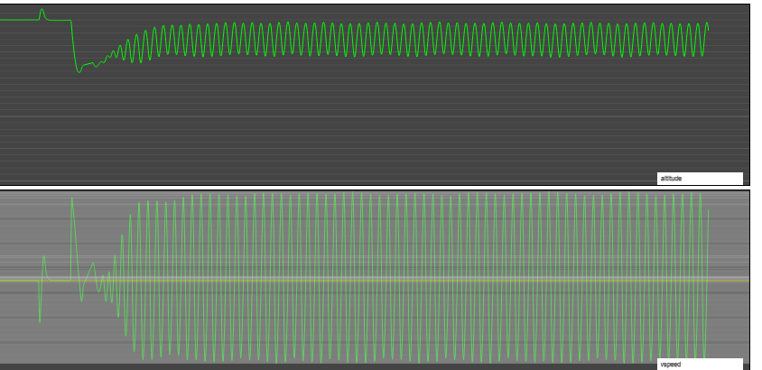

An error that should have leveled back out to a nice stable flat altitude and vertical speed instead ends up reinforcing itself until it finds a new, _very different_, stable outcome that can only be described as "a rollercoaster of death". It's holding the correct altitude _on average_ but it's doing so in what is probably the worst possible way...

So, one more fix: a reasonable altitude transition has the plane's pitch change small amounts over time. Even if we pitch up, we don't need to pitch up a lot to get to a vertical speed of 1000 feet per minute, so we're going to monitor our "pitch delta" and if it exceeds 2 degrees per second (either up or down) that's a good sign something bad is happening and we can override the regular altitude hold algorithm to instead perform an emergency trim correction:

```javascript
...

const FEATURES = {
  ...
  EMERGENCY_PROTECTION: false
};

export async function altitudeHold(autopilot, state) {
  ...

  let { targetVS, altDiff, direction } = await getTargetVS(autopilot, state, maxVS);

  // We'll handle emergencies in two parts.
  if (FEATURES.EMERGENCY_PROTECTION) {
    // First quick check: are we pitching *way* out of control?
		const DELTA_PITCH_LIMIT = constrainMap(speed, 50, 200, 1, 5);
    const dPitchLimit = VS < 0 ? DELTA_PITCH_LIMIT / 2 : DELTA_PITCH_LIMIT;
    const pitchExcess = exceeds(dPitch, dPitchLimit);
    if (pitchExcess !== 0 && sign(direction) !== sign(VS)) {
		  // If we are, add emergency trim, where the more we're pitching per second,
      // the more we trim to counteract that. And while it might look like we might
      // be putting in *huge* corrections, up to a hundred times the size of a
      // regular trimstep, that's exactly what we want: if the plane suddenly
      // and very quickly changes pitch, we want to very quickly correct for
      // that with a huge change in trim setting. We won't need it for very long,
      // but we do need to make it much, much bigger than the step size we use
      // when we adjust the trim in tiny increments during normal AP operation:
      trim.pitch += pitchExcess * trimStep;
      // And then after we apply this emergency trim, we exit the altitude hold
      // function and wait for the next autopilot pass, where we hopefully won't
      // need more emergency intervention, or if we do, at least less drastic.
      return autopilot.set("ELEVATOR_TRIM_POSITION", trim.pitch);
    }

    // Second quick check: even if we're not pitching like crazy,
    // are we moving in the wrong direction way too fast?
    if (direction !== sign(VS) && abs(VS) > 200) {
      // note that we want to pitch up, so to add a positive number we use -VS:
      let factor = -VS / (VS < 0 ? 500 : 1000);
      if (abs(VS) > 2 * maxVS) factor *= 2;
      trim.pitch += factor * trimStep;
      return autopilot.set("ELEVATOR_TRIM_POSITION", trim.pitch);
    }

    // Last quick check: are we descending (possibly *way*) too fast?
    if (VS < -2 * maxVS) {
      trim.pitch += (-VS / 1000) * trimStep;
      return autopilot.set("ELEVATOR_TRIM_POSITION", trim.pitch);
    }
  }

  ...
}

// With an update to our getTargetVS so it can tell us which
// vertical direction we're supposed to move in:
async function getTargetVS(autopilot, state, maxVS) {
  ...

  const { altitude: currentAltitude, verticalSpeed: VS, speed } = state;

  // we'll replace our hardcoded value "200" with a const:
  const plateau = plateau;

  let targetVS = DEFAULT_TARGET_VS;
  let altDiff = undefined;

  // and then we add our direction variable:
  let direction = undefined;

  const targetAltitude = autopilot.modes[ALTITUDE_HOLD];
  if (targetAltitude) {
    altDiff = targetAltitude - currentAltitude;
    // which we then trivially assign:
    direction = sign(altDiff);
    targetVS = constrainMap(altDiff, -plateau, plateau, -maxVS, maxVS);

    ...
  }

  return { targetVS, altDiff, direction };
}

```

Let's see what that does for us if we bump the yoke four times: once pulling the plane up until we see the emergency code kick in, and having it stabilize again, then once pushing the plane down until we see the emergency code to kick in, and having it stabilize. And then we repeat that, for good measure (literally in this case, since we're measuring AP response behaviour):

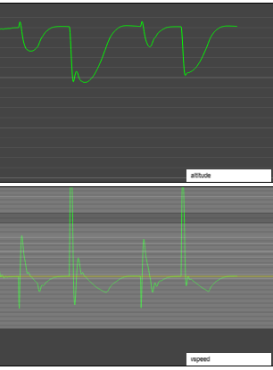

With our emergency intervention in place, we no longer end up in a rollercoaster of death situation, instead returning to our intended altitude. Now, granted, it wouldn't feel nice being inside this plane while it recovers, _but it will recover_ and that's by far the most important result. Also note that if we push the plane down, we better have some altitude between us and the ground, because if this happened at 500 feet above the ground, the AP probably wouldn't have recovered on account of us making an unscheduled, high velocity landing.

So what about our "fly level" code? As it turns out, we're pretty good there already. If we give the yoke a quick left or right turn (again, let's do that twice), then the AP will correct for that, and faster, too (even if it's not perfect):

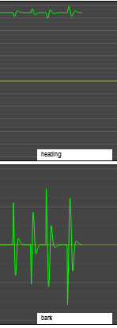

## Flying some test flights in different planes

Now that we have pretty decent control of both the horizontal and the vertical, let's get a few planes up in the air, manually trim them so they fly mostly straight ahead, and then turn on our bespoke, artisanal autopilot and see how the various planes fly.

### The planes

To make sure we're getting a decent result, here's my cross section of test planes in MSFS:


- The [De Havilland DHC-2 "Beaver"](https://en.wikipedia.org/wiki/De%5FHavilland%5FCanada%5FDHC-2%5FBeaver), which we've been testing with so far. The beaver has trim limits of +/- 18.

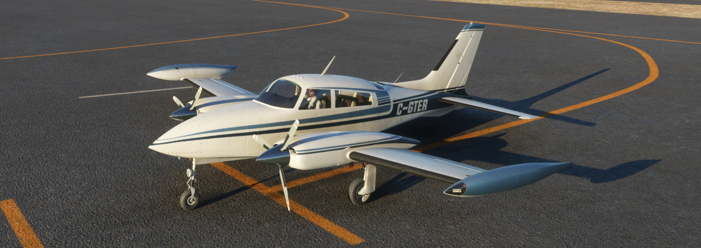

- The [Cessna 310R](https://en.wikipedia.org/wiki/Cessna%5F310), a (very good looking once the gear is up) small twin turbo-prop plane. The 310R is still relatively light, and responds to trim quite quickly. it has trim limits of +/-20.

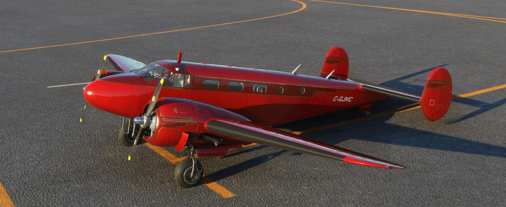

- The [Beechcraft Model 18](https://en.wikipedia.org/wiki/Beechcraft%5FModel%5F18), a gorgeous twin radial engine aeroplane. This plane is a delight to fly, and has trim limits of +/- 30. It's slow to respond, but that might actually be beneficial in our case, because our autopilot only runs once every half second.

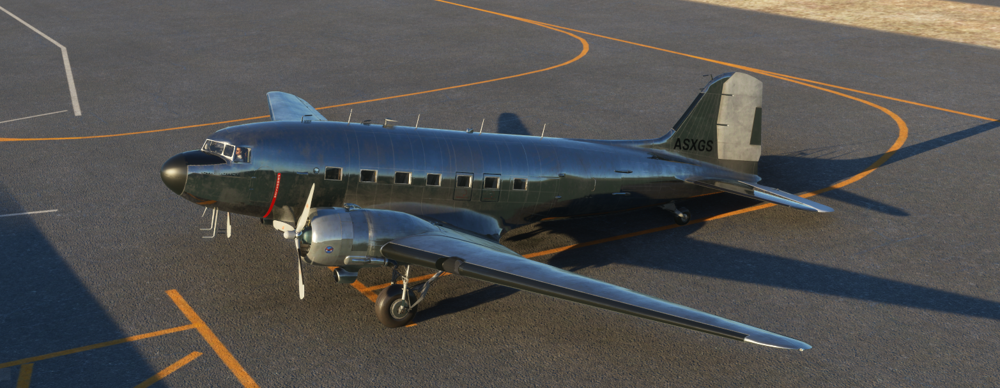

- The [Douglas DC-3](https://en.wikipedia.org/wiki/Douglas%5FDC-3), an almost four times bigger twin radial engine aeroplane. This lumbering beast has trim limits of +/- 12 and will overshoot if you let it. However, it does respond to trim instructions, and it _will_ end up going where we tell it to go. It just takes it a while, and it'll be bouncy.


- And finally, the [Top Rudder Solo 103](https://www.toprudderaircraft.com/product-page/103solo-standard), with trim limits of +/-12. And of course, this type of plane was never meant to have an autopilot. Under no circumstances should you try to add one in real life. No sane person would stick an autopilot in. _So we will_. _Because we can_.

### The flights

We'll be flying all of these in fair weather, starting at an altitude of 1500 feet and flying a heading of 345 degrees. We'll test a heading change from 345 to 270 and back, then an altitude change from 1500 feet to 2500 feet and back down to 1500 feet, and then we'll test those two changes combined, changing heading while also changing altitude.

And let's start with the one that's the least like to succeed!

#### Top Rudder Solo 103

I say least likely, because while flying straight isn't too taxing, and flying a heading isn't too taxing, and flying up or down isn't super hard, doing everything at once _may_ just be a bit too much for an ultralight, so let's see how we do.

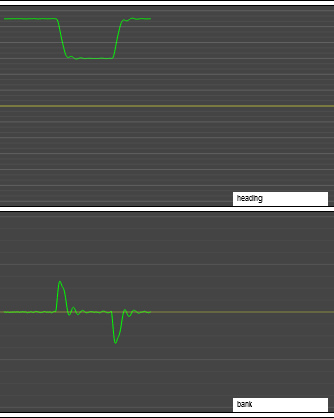

It's bumpy, that's for sure, but then it's bumpy _flying all on its own_ so I'd call that a major win over reality right there. Heading change: check. Altitude change: check. So... what about both at the same time?

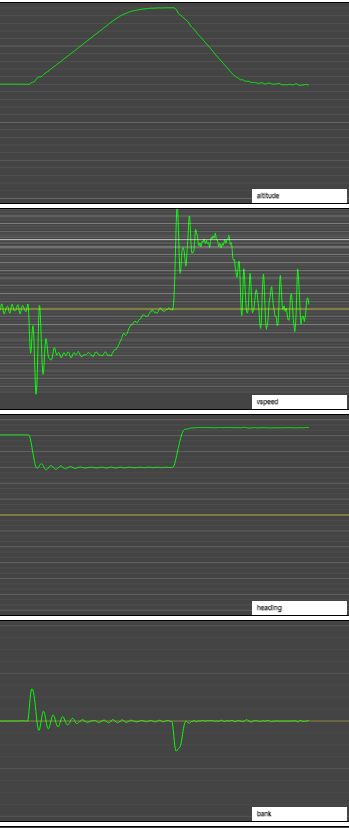

Amazingly, we live! I'm going to call this a great success: _we added an autopilot to an ultralight_.

#### De Havilland DHC-2 "Beaver"

How much better does the Beaver fare? Quite a lot, actually. It can do the 1000 feet climb and descent just fine (which is good: it's an aeroplane, so it'd better) although we can see a bit of an overshoot. Nothing too terrible, but if we were better programmers maybe we could have prevented that. Then again, maybe not, because autopilot programming is far from trivial, so we'll take it!

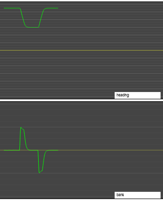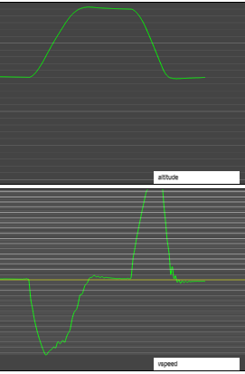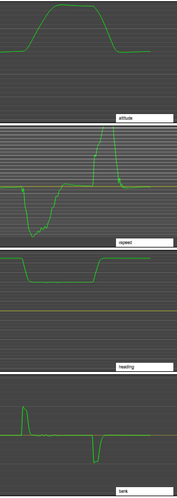

We also see that heading mode works quite well, with only a small overshoot that gets almost immediately corrected for.

#### Cessna 310R

An excellent plane for autopilot code, the 310R goes where we tell it to, when we tell it to, and goes as straight as you can go at 190 knots.

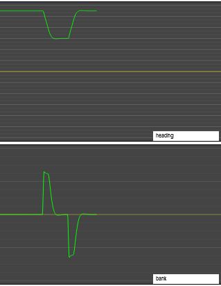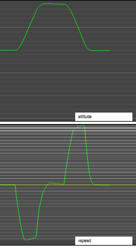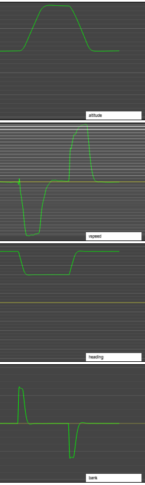

#### Beechcraft Model 18

The model 18 performs surprisingly well, which shouldn't be _too_ surprising given that it has two honking huge engines, and is nice and slow to respond to autopilot instructions.

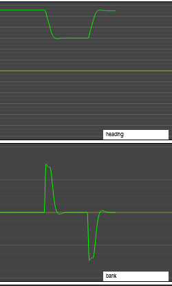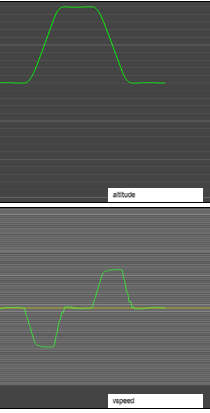

#### Douglas DC-3

Much like the model 18, the DC-3 is a bit "wibbly" (we'd definitely feel it pitching up and down more), but overall even this lumbering behemoth just does what the autopilot asks of it.

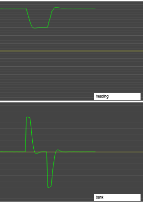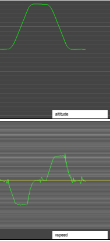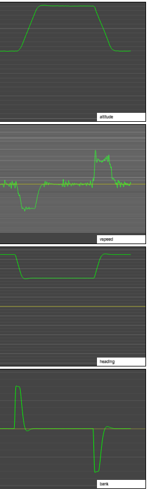

### The results

This is some text that summarizes what we're seeing in the flight results.

# --- TODO: try some other planes, maybe they work now ---

# Part four: "Let's just have JavaScript fly the plane for us"

We have a pretty fancy autopilot, but the best autopilots let you plan your flight path, and then just... fly that for you. So before we call it a day (week? ...month??) let's not be outdone by the real world and make an even more convenient autopilot that lets us put some points on the map (rather than trying to input a flight plan one letter at a time with a jog dial), and then just takes off for you, figuring out what elevation to fly in order to stay a fixed distance above the ground, and landing at whatever is a nearby airport at the end of the flight. All on its own.

## Waypoint navigation

Now that we can fly a specific heading and altitude, and we can switch to new headings and altitudes, the next logical step would be to tell them autopilot to do that automatically, by programming a flight path to follow, with our plane flying towards some waypoint, and then when it gets close, transitioning to flying towards the next waypoint, and so on. Something like this:


Flying towards a point is pretty easy, but transitioning in a way that "feels right" is a bit more work, so there might be a bit more code here than you'd expect. Plus, we want to place, move, and remove points using the map on our web page, but the actual waypoints themselves will live in the autopilot, so there's a bit of work to be done there, too.

As such, we're going to need to break down waypoint logic as a few separate tasks:

1. the server side, which is the authority on which waypoints exist and which one we're flying towards,
   1. which requires having code that models waypoints, and
   2. requires updating to our heading mode to made the plane fly along our flight path.
2. the client side, which lets us place and (re)move waypoints,
   1. which requires some Leaflet code for placing, showing, and moving waypoints as markers, and
   2. some regular JS for synchronizing with the server on waypoint information

### The server side

We'll start with a model for waypoints:

```javascript
// a silly little id function, but we don't need full uuids here
const nextId = (() => {
  let id = 1;
  return () => id++;
})();

export class Waypoint {
  constructor(owner, lat, long, alt = false) {
    this.id = nextId();
    this.owner = owner;
    this.reset();
    this.move(lat, long);
    this.elevate(alt);
  }

  reset() {
    this.completed = false;
    this.active = false;
    this.next = undefined;
  }

  // Set this waypoint's GPS location:
  move(lat, long) {
    this.lat = lat;
    this.long = long;
  }

  // set this waypoint's altitude
  elevate(alt) {
    // are we removing the elevation information by passing something falsey?
    if (!alt) return (this.alt = false);

    // We are not, so much sure the value we got is a sensible number.
    alt = parseFloat(alt);
    if (!isNaN(alt) && alt > 0) this.alt = alt;
  }

  // Since waypoints define a flight path, it's useful to have a reference to "the next waypoint" (if there is one):
  setNext(next) {
    this.next = next;
  }

  // Waypoints can be (de)activated and completed.
  activate() {
    this.active = Date.now();
  }
  deactivate() {
    this.active = false;
  }
  complete() {
    this.completed = true;
  }

  // And since we need to send them to the client, make sure that when this gets turned into JSON,
  // we do *not* include the owner object. The toJSON() function is really useful for that.
  toJSON() {
    const { id, lat, long, alt, active, complete, next } = this;
    return { id, lat, long, alt, active, completed, next: next?.id };
  }
}
```

And that's all we need them to do. Next up, a little waypoint manager:

```javascript
import { KMS_PER_KNOT, HEADING_MODE } from "./constants.js";
import {
  degrees,
  dist,
  getHeadingFromTo,
  getDistanceBetweenPoints,
  pathIntersection,
} from "./utils.js";
import { Waypoint } from "./waypoint.js";

const { abs } = Math;

export class WayPoints {
  constructor(autopilot) {
    this.autopilot = autopilot;
    this.reset();
  }

  reset() {
    this.points = [];
    this.currentWaypoint = undefined;
  }

  // Make sure that if someone asks for all waypoints, they don't get a reference to the actual array.
  getWaypoints() {
    return this.points.slice();
  }

  // Add a waypoint for a specific GPS coordinate
  add(lat, long, alt) {
    const { points } = this;
    const waypoint = new Waypoint(this, lat, long, alt);
    points.push(waypoint);
    // If we don't have a "current" point, this is now it.
    this.currentWaypoint ??= waypoint;
    this.resequence();
    return waypoint;
  }

  // Move a waypoint around
  move(id, lat, long) {
    this.points.find((e) => e.id === id)?.move(lat, long);
  }

  // Change a waypoint's elevation
  elevate(id, alt) {
    this.points.find((e) => e.id === id)?.elevate(alt);
  }

  // Remove a waypoint from the flight path
  remove(id) {
    const { points } = this;
    const pos = points.findIndex((e) => e.id === id);
    if (pos > -1) {
      points.splice(pos, 1)[0];
      if (this.currentWaypoint?.id === id) {
        this.currentWaypoint = this.currentWaypoint.next;
      }
      this.resequence();
    }
  }

  // Make sure all waypoints point to the next one in the flight path.
  resequence() {
    const { points } = this;
    for (let i = points.length - 1; i >= 0; i--) {
      points[i].setNext(points[i + 1]);
    }
  }

  // remove all active/completed flags from all waypoints and mark the first point as our active point.
  resetWaypoints() {
    this.points.forEach((waypoint) => waypoint.reset());
    this.resequence();
    this.currentWaypoint = this.points[0];
  }

  // Move the currently active waypoint to "the next" waypoint. Which might be nothing.
  transition() {
    const { currentWaypoint: c } = this;
    c.complete();
    this.currentWaypoint = this.currentWaypoint.next;
  }

  getHeading(state) {
    // We'll implement this function in a bit since it's the important one.
  }
}
```

We'll come back to the `getHeading` function in a bit, since that's the part that we'll tap into in our heading mode code to determine where to steer the plane, but for now let's close the loop so we can send and receive waypoint information to and from the client, where we see and work with them on our Leaflet map.

First, we update the server's autopilot code, so it can do waypoint things (which is mostly passing things on to the waypoint manager):

```javascript
export class AutoPilot {
  constructor(api, onChange = () => {}, lat = 0, long = 0) {
    ...
    this.waypoints = new WayPoints(this, lat, long);
  }

  // Read and pass-through functions for waypoints:
  getWaypoints() { return this.waypoints.getWaypoints(); }
  addWaypoint(lat, long) { this.waypoints.add(lat, long); }
  moveWaypoint(id, lat, long) { this.waypoints.move(id, lat, long); }
  elevateWaypoint(id, alt) { this.waypoints.elevate(id, alt); }
  removeWaypoint(id) { this.waypoints.remove(id); }
  resetFlight() { this.waypoints.resetWaypoints(); }

  getAutoPilotParameters() {
    const state = {
      MASTER: this.autoPilotEnabled,
      // add the waypoint information to our autopilot parameters:
      waypoints: this.waypoints.getWaypoints(),
    };
    Object.entries(this.modes).forEach(([key, value]) => {
      state[key] = value;
    });
    return state;
  }

  ...
}
```

With an update to our server so that we can actually "talk waypoints" in our autopilot message handling:

```javascript
    ...

    if (action === `autopilot`) {
      // Autopilot messages need to be further unpacked:
      const { action, params } = data;

      if (action === `update`) {
        autopilot.setParameters(params);
      }

      // We add a new action for waypoint handling, with three possible specific instructions:
      if (action === `waypoint`) {
        const { lat, long, alt, move, elevate, id, remove, reset } = data.params;
        if (reset)        { autopilot.resetFlight(); }
        else if (move)    { autopilot.moveWaypoint(id, lat, long); }
        else if (elevate) { autopilot.elevateWaypoint(id, alt); }
        else if (remove)  { autopilot.removeWaypoint(id); }
        else { autopilot.addWaypoint(lat, long, alt); }
      }

      socket.json(`autopilot`, autopilot.getAutoPilotParameters());
    }

    ...
```

So nothing too fancy, mostly just "the bare minimum code necessary to forward data into where it gets handled", and because we added the waypoints to our autopilot parameter set, the client will automatically get them as part of its autopilot interval polling.

### The client side

In fact, let's switch to the client side and update the data handler for that interval poll:

```javascript
export class Autopilot {
  ...

  bootstrap(params) {
    Object.entries(params).forEach(([key, value]) => {
      // if we see the waypoints key, we don't want to send this on as a standard
      // autopilot property, we want to do some special handling instead.
      if (key === `waypoints`) {
        return this.owner.manageWaypoints(value);
      }
      ...
    });
  }

  ...
}
```

With a corresponding update in our `plane.js`:

```javascript
export class Plane {
  constructor(map, location, heading) {
    console.log(`building plane`);
    // set up a waypoint overlay on our Leaflet map
    this.waypoints = new WaypointOverlay(this, map);
    ...
  }

  ...

  // and just forward all the data we get from the autopilot straight to the overlay
  async manageWaypoints(data) { this.waypoints.manage(data); }
  ...
};
```

Which just leaves implementing the code for managing Leaflet markers that represent our waypoints:

```javascript
import { callAutopilot } from "./api.js";
import { Trail } from "./trail.js";

export class WaypointOverlay {
  constructor(autopilot, map) {
    this.autopilot = autopilot;
    this.map = map;
    this.waypoints = [];
    this.setupMapHandling();
  }

  // Set up the event handling for the map: if we click, put a new waypoint on that GPS location.
  setupMapHandling() {
    this.map.on(`click`, (e) => this.add(e));
    // ...we'll be adding some more to this function later!
  }

  // The "manage" function takes all the waypoint information we got from the
  // autopilot and turns it into Leaflet marker add/update or remove instructions.
  manage(waypoints) {
    // Manage each waypoint that's in the list.
    waypoints.forEach((waypoint) => this.manageWaypoint(waypoint));

    // So we need to remove any waypoints from our map?
    if (waypoints.length < this.waypoints.length) {
      const toRemove = this.waypoints.filter(
        (w) => !waypoints.find((e) => e.id === w.id)
      );
      const noAPcall = true;
      toRemove.forEach((waypoint) => this.remove(waypoint));
    }
  }

  // This function gets called for all waypoints that the autopilot says exist.
  manageWaypoint(waypoint) {
    const { waypoints } = this;
    const { id } = waypoint;
    // That means that they're either new points, or updates to points we already know about.
    const known = waypoints.find((e) => e.id === id);
    if (!known) return this.addNewWaypoint(waypoint);
    this.updateKnownWaypoint(known, waypoint);
  }

  // Adding a new waypoint means creating a new marker:
  addNewWaypoint(waypoint) {
    // And remember that if we refresh the page mid-flight, we might get a bunch
    // of waypoints that have already been completed, so take that into account.
    const { id, lat, long, completed } = waypoint;

    // First we create a Leaflet icon, which is a div with custom size and CSS classes.
    const icon = L.divIcon({
      iconSize: [40, 40],
      iconAnchor: [20, 40],
      className: `waypoint-div`,
      html: ``,
    });

     // Then we create a Leaflet marker that uses that icon as its visualisation.
    const marker = (waypoint.marker = L.marker(
      { lat, lng: long },
      { icon, draggable: true }
    ).addTo(this.map));

    // Then we add event listeners: when we click on a marker, we should be able to set its
    // altitude, and if we double-click a marker, it should get removed from the flight path.
    //
    // Leaflet has click and double click handle, but doesn't actually debounce clicks to see
    // if something was a double click. It just fires off spurious clicks *as well*, which isn't
    // great, so we need to run our own debounce code:
    let dblClickTimer = false;

    marker.on(`dblclick`, () => {
      clearTimeout(dblClickTimer);
      dblClickTimer = false;
      this.remove(waypoint);
    });

    marker.on(`click`, () => {
      if (dblClickTimer) return;
      dblClickTimer = setTimeout(() => {
        dblClickTimer = false;
        let value = prompt("Set waypoint altitude:", waypoint.alt);
        this.elevate(waypoint, value);
      }, 500);
    });

    // Next up: if we click-drag a marker, we want the server-side waypoint to update when we let go.
    marker.on(`drag`, (event) => (marker.__drag__latlng = event.latlng));
    marker.on(`dragend`, () => this.move(waypoint));

    // Then, because we want to see the path, not just individual markers, we
    // also build trails between "the new marker" and the previous one.
    const prev = this.waypoints.slice(-1)[0];
    this.waypoints.push(waypoint);
    if (prev) {
      waypoint.prev = prev;
      prev.next = waypoint;
      waypoint.trail = new Trail(this.map, [prev.lat, prev.long], `var(--flight-path-colour)`);
      waypoint.trail.add(lat, long);
    }
  }

  // A helper function for building waypoint-connecting trails
  addNewTrail(lat, long) {
    return new Trail(this.map, [lat, long], `var(--flight-path-colour)`);
  }

  // Updating a known marker means checking if it moved, or changes active/completed states:
  updateKnownWaypoint(known, { lat, long, active, completed }) {
    // First, are we currently dragging this point around? If so, don't
    // do anything to this point yet, because we're not done with it.
    if (known.marker?.__drag__latlng) return;

    // Did its location change?
    if (known.lat !== lat || known.long !== long) {
      known.lat = lat;
      known.long = long;
      known.marker.setLatLng([lat, long]);

      // if it did, we also need to update the trail(s) that connect to it.
      const prev = known.prev;
      if (prev) {
        // we can do this by updating the existing trail, but it's just as easy to just create a new one.
        known.trail?.remove();
        known.trail = this.addNewTrail(prev.lat, prev.long);
        known.trail.add(lat, long);
      }
      const next = known.next;
      if (next) {
        next.trail.remove();
        next.trail = this.addNewTrail(lat, long);
        next.trail.add(next.lat, next.long);
      }
    }

    // Do we need to update its altitude information?
    if (alt) {
      known.alt = alt;
      const div = known.marker.getElement();
      if (div && div.dataset) div.dataset.alt = `${alt}'`;
    }

    const css = known.marker._icon.classList;

    // Are we in the transition radius?
    known.active = active;
    if (active) { classes.add(`active`); } else { classes.remove(`active`); }

    // Or did we complete this waypoint?
    known.completed = completed;
    if (completed) { classes.add(`completed`); } else { classes.remove(`completed`); }
  }

  // the "add a marker" handler for map clicks
  add({ latlng }) {
    // remember, the server is the authority on waypoints, so when we click the map,
    // instead of immediately creating a marker we instead tell the autopilot to create
    // a waypoint. If it does, we'll find that new waypoint when manage() gets called.
    const { lat, lng: long } = latlng;
    callAutopilot(`waypoint`, { lat, long });
  }

  // the "move a marker" handler for marker click-drags
  move({ id, marker }) {
    const { lat, lng: long } = marker.__drag__latlng;
    marker.__drag__latlng = undefined;
    callAutopilot(`waypoint`, { update: true, id, lat, long });
  }

  // the "update the waypoint's elevation" call
  elevate({ id }, alt) {
    callAutopilot(`waypoint`, { elevate: true, id, alt });
  }

  // the "remove a marker" handler for marker clicks. Note that if this is a real
  // map click, we should tell the server that we want it removed, but if this gets
  // called from our own manage(waypoints) function, in response to the server having
  // sent us waypoint information that does not include some waypoints we're still
  // showing, then removing it from the map should *not* also come with a call to
  // the server to remove it. It already doesn't exist!
  remove(waypoint, withAPIcall = false) {
    if (!waypoint.id) {
      waypoint = this.waypoints.find((e) => e.id === waypoint);
    }

    const { id } = waypoint;

    // Send a remove call to the autopilot only if this was a client-initiated removal
    if (withAPIcall) callAutopilot(`waypoint`, { id, remove: true });

    // Removing the mark from our map is pretty easy:
    waypoint.marker.remove();
    waypoint.trail?.remove();

    // But this marker may have been in between to other markers, in which case
    // we need to link up its previous and next marker with a new trail.
    const prev = waypoint.prev;
    const next = waypoint.next;
    if (next) {
      next.trail.remove();
      if (prev) {
        next.trail = this.newTrail(prev.lat, prev.long);
        next.trail.add(next.lat, next.long);
        prev.next = next;
      }
      next.prev = prev;
    } else if (prev) {
      prev.next = undefined;
    }
  }

  // And finally, remember to remove the waypoint from the array:
  const pos = this.waypoints.findIndex((e) => e.id === id);
  this.waypoints.splice(pos, 1);
}
```

And of course, the image we're using for waypoints:


With a smattering of CSS to make our markers look reasonable:

```CSS
:root {
  --flight-path-colour: #0003;
}

.waypoint-div {
  border: none;
  background: transparent;
}

.waypoint-div::before {
  content: attr(data-alt);
  position: relative;
  width: 40px;
  display: inline-block;
  text-align: center;
  bottom: -40px;
  text-shadow: 0px 0px 5px black, 0px 0px 10px black, 0px 0px 15px black;
  color: white;
  font-weight: bold;
}

.waypoint-div img.waypoint-marker {
  z-index: 1 !important;
  opacity: 1;
  width: 100%;
  height: 100%;
  position: relative;
  top: -20px;
}

.waypoint-div.active img.waypoint-marker {
  filter: hue-rotate(145deg) brightness(2);
}

.waypoint-div.completed img.waypoint-marker {
  filter: hue-rotate(-45deg);
  opacity: 1;
  width: 20px !important;
  height: 20px !important;
  position: relative;
  top: 0px;
  left: 10px;
}
```

We can now place a bunch of waypoints by clicking the map, which will send a waypoint creation message to the server, which creates the _actual_ waypoint, which we're then told about because the waypoints are now part of our autopilot information that we send to the client every time the autopilot updates.

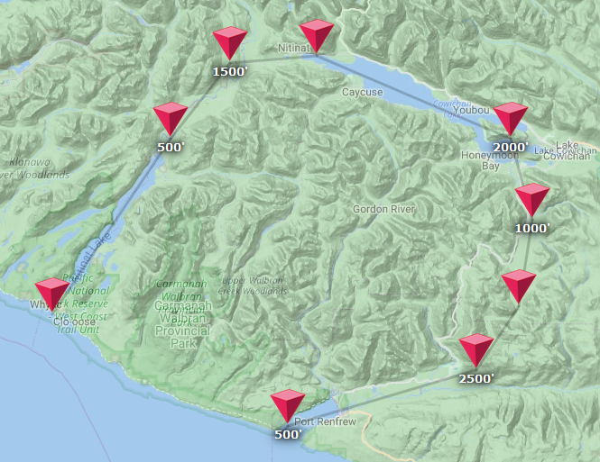

### Flying and transitioning over waypoints

Of course with all this setup we still need to actually make the plane _fly_ using our waypoints, so let's update our server-side autopilot, specifically the `getTargetBankAndTurnRate` function that we use as part of `flyLevel`:

```javascript
function getTargetBankAndTurnRate(autopilot, state, maxBank) {
  const heading = degrees(state.heading);

  let targetBank = DEFAULT_TARGET_BANK;
  let maxTurnRate = DEFAULT_MAX_TURN_RATE;

  // Are we flying using waypoints?
  const { waypoints } = autopilot;
  const waypointHeading = waypoints.getHeading(state);
  if (waypointHeading) {
    autopilot.setTarget(HEADING_MODE, waypointHeading);
  }
  ...

  return { targetBank, maxTurnRate };
}
```

And then, finally, let's fill in that `getHeading` function. In fact, let's first take a little detour to figure out how we even want to do that.

#### Flight path policies

Say we have [a plane, and a bunch of waypoints](https://gist.github.com/Pomax/73dd18907f23362731cdebba7652f0e0/):


If we pretend that the circle is an aeroplane, with the little dot showing its current heading, the question is "what should happen over time?". In fact, let's answer that by starting simpler, with zero waypoints:


Obviously, "what should happen over time?" here is "the plane should just fly in whatever heading it's already going". So far so good! But now we add a waypoint:


What we probably want is for the plane to calculate the angle from itself to that waypoint, and then fly the associated heading, as indicated in green. That heading is going to change over time, because we can't just instantly change course, but it'll get us to our waypoint:


And if the plane is flying quickly, or has a low turning rate, it takes it a bit longer, and will transition over the waypoint at a different angle:


What if we add another waypoint? We probably want the aeroplane to target the first waypoint, and then once it gets there, target the next point. In pseudo-code

```pseudocode
current = 0
target = waypoints[current]
if dist(plane, target) < 20 -> curent = current + 1
```

This gives us the following behaviour:


That might work, and if we try this with more points we get something that kinda feels like a flight path, although it's not great:


We're never actually "on" the flight path, we're always kinda next to it at a different angle. But it gets really problematic with steeper angles and bigger turning circles:


That's basically terrible, this is not flying a flight plan, this is a drunk pilot, and not something we'd want to use. So we're going to have to give up on purely looking at the waypoints themselves. Instead, let's look at the paths between them: we can project the plane's position onto a path, picking the first point if the projection would lie outside the path, and then use that as our target. In pseudocode:

```pseudocode
current = 0

target = ???

if target exists -> plane.target(target)

plane.target = target:
  a = angle to target
  direction = sign of the angle difference between a and plane.heading;
  plane.heading = direction * some value that scales with fast the plane can turn
```

to figure out what the target should be, let's draw some more things. First, if we're not near the flight path, we want the following:


However, when we get close to the flight path, we want to target the point where our circle intersects the line, nearest to the next waypoint:


So if we express that in pseudo-code:

```pseudocode
p1 = waypoints[current]

p2 = waypoints[current + 1]
if p2 exists -> i1 = projection for our plane onto line p1--p2

p3 = waypoints[current + 2]
if p3 exists -> i2 = projection for our plane onto line p2--p3

target = i1
if dist(plane, p2) < radius ->
    current = current + 1
    if i2 exists -> target = i2

if target exists -> plane.target(target)
```

So what happens when we use _that_? Sure, we need to recompute that point every frame, but maths is cheap, so if it looks better, it's probably worth it:


And it is: instead of never actually being on the flight path itself, we're now on the flight path _the majority of the time_. And a "switchback" style flight path is suddenly far less problematic:


Although of course we still need to make sure our turns aren't unrealistically drastic. For instance, the same switch back path with a very-slow-to-turn plane wouldn't be great:


And we also need to pick a good radius, because if it's too small, we'll overshoot (potentially so much that we need to circle back):


And if it's too large, we'll basically smooth our path too much:


So the trick is to pick a good radius based on how fast a plane can make a turn. The faster a plane can turn, the smaller we can make its transition radius, and the slower it turns, the bigger that radius will need to be. So let's switch from pseudo-code to actual code, and let's get to implementing!

```javascript
import { pathIntersection } from "./utils.js";

...

export class WayPoints {
  ...

  getHeading(state) {
    const { modes } = this.autopilot;
    let heading = modes[HEADING_MODE] || degrees(state.heading);

    const { latitude: cy, longitude: cx, speed, declination } = state;
    const { currentWaypoint: p1 } = this;

    // If there's no current waypoint, don't change the heading.
    if (!p1) return heading;

    // If there is, make sure it'll show as active on the client-side map
    const { lat: p1y, long: p1x } = p1;
    const p2 = p1.next;
    p1.activate();

    // Is there a next waypoint? If not, and we're coming up to the current waypoint,
    // complete the flight path by calling the transition() function
    if (!p2) {
      const d1 = getDistanceBetweenPoints(cy, cx, p1y, p1x);
      if (d1 < 0.5) {
        this.transition();
        return;
      }
      // If we did not transition, return the heading that points at p1, corrected for
      // magnetic declination, because otherwise we'll fly in the wrong direction!
      heading = getHeadingFromTo(cy, cx, p1y, p1x);
      return (heading - declination + 360) % 360;
    }

    // If there is a next point, we have a path we can work with.
    const { lat: p2y, long: p2x, next: p3 } = p2;
    p2.activate();

    // our initial target is simply going to be "the current waypoint"
    let target = p1;

    // And then we do some maths: we base our transition radius on how fast the aeroplane's going,
    // under the generally true rule that the faster the plane, the bigger the turning circle.
    const transition_time = 30;
    const transitionRadius = 0.01 * speed * KMS_PER_KNOT * transition_time;

    // Find the intersection point of our "circle" with the path segment between current and next.
    // Note that if that intersection lies outside the segment, it'll return the closes endpoint.
    const i1 = pathIntersection(p1x, p1y, p2x, p2y, cx, cy, transitionRadius);

    // Is there a path segment from the next point to the point after that?
    let i2 = undefined;
    if (p3) {
      const { lat: p3y, long: p3x } = p3;
      i2 = pathIntersection(p2x, p2y, p3x, p3y, cx, cy, transitionRadius);
    }

    // First guess: our target is that first intersection
    if (i1) target = i1;

    // If we're close enough to p2, update our target to i2 and switch the current point to the next one:
    const contained = (p) => {
      if (!p) return false;
      const { x, y } = p;
      return dist(p1.x, p1.y, x, y) <= transitionRadius;
    };

    if (dist(cx, cy, p2x, p2y) < transitionRadius || (contained(i1) && contained(i2))) {
      this.transition();
      if (i2) target = i2;
    }

    // We can now determine what the true heading towards this target is based on GPS coordinates,
    heading = getHeadingFromTo(cy, cx, target.y, target.x);
    // and then return it, corrected for magnetic declination, so it's a proper compass heading.
    return (heading - declination + 360) % 360;
  }
}
```

And then with the code for `pathIntersection`, we should be done:

```javascript
// Find a circle/line intersection, given a line segment, capping the intersection to the segment end points.
function pathIntersection(x1, y1, x2, y2, cx, cy, r) {
  const dx = x2 - x1;
  const dy = y2 - y1;
  const c = { x: cx, y: cy, r };

  const A = dy ** 2 + dx ** 2;
  const A2 = 1 / (2 * A);
  const B = 2 * (-c.x * dx - c.y * dy + x1 * dx + y1 * dy);
  const C =
    c.x ** 2 +
    c.y ** 2 +
    x1 ** 2 +
    y1 ** 2 -
    2 * c.x * x1 -
    2 * c.y * y1 -
    c.r ** 2;
  const D = B * B - 4 * A * C;
  const t1 = (-B + sqrt(D)) * A2;
  const t2 = (-B - sqrt(D)) * A2;

  // You may have noticed that the above code is just solving the
  // quadratic formula, so t1 and/or t2 might be "nothing". If there
  // are no roots, there there's no intersection between the circle
  // and the line *segment*, only the circle and the *line*.
  if (isNaN(t1) && isNaN(t2)) {
    const cx = c.x - x1;
    const cy = c.y - y1;
    let f = constrain((dx * cx + dy * cy) / (dx ** 2 + dy ** 2), 0, 1);
    return { x: x1 + dx * f, y: y1 + dy * f };
  }

  // If we have one root, then that's going to be our solution.
  if (isNaN(t1) || t1 < t2) t1 = t2;

  // cap the interesction if we have to:
  t = constrain(t1, 0, 1);

  // and return the actual intersection as {x,y} point
  return { x: x + dx * t, y: y + dy * t };
}
```

That's a lot of code to do what we sketched out before, so... does this work? Does this let us fly a flight plan?

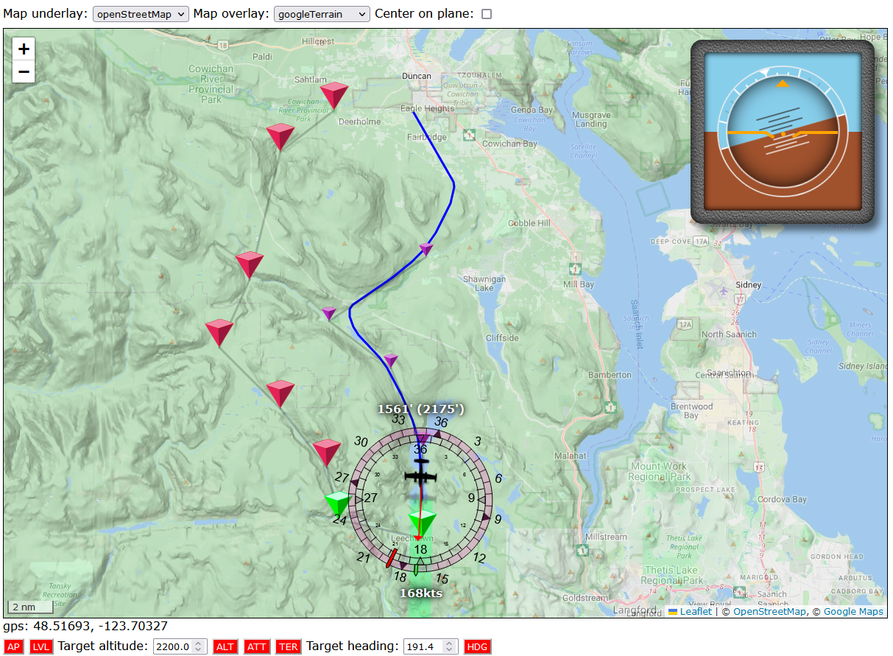

You bet it does.

### Saving and loading flight paths

Before we move on to testing, let's make sure we can _repeat_ flights, otherwise testing is going to be quite the challenge. Thankfully, this is going to be super simple. First, we add some web page UI:

```html
<div id="maps-selectors">
  flight plan:
  <button name="clear">clear</button>
  <button name="reset">reset</button>
  <button name="save">save</button>
  load: <input type="file" name="load" />
</div>
```

With some extra JS added to our waypoint overlay:

```javascript
export class WaypointOverlay {
  ...

  setupMapHandling() {
    this.map.on(`click`, (e) => this.add(e));

    // Clearing the waypoints is a matter of just clicking each waypoint in reverse order:
    document
      .querySelector(`button[name="clear"]`)
      .addEventListener(`click`, () => {
        this.waypoints.reverse().forEach((waypoint) => waypoint.marker.fire(`dblclick`));
        this.waypoints = [];
      });

    // Resetting the path is a matter of telling the autopilot to do that for us:
    document
      .querySelector(`button[name="reset"]`)
      .addEventListener(`click`, () => {
        callAutopilot(`waypoint`, { reset: true });
      });

    // Saving our waypoints is actually fairly easy: we throw everything except the lat/long/alt
    // information away, and then we generate an `<a>` that triggers a file download for that
    // data in JSON format:
    document
      .querySelector(`button[name="save"]`)
      .addEventListener(`click`, () => {
        // Form our "purely lat/long/alt" data:
        const stripped = this.waypoints.map(({ lat, long }) => ({ lat, long }));
        const data = JSON.stringify(stripped, null, 2);

        // Then create our download link:
        const downloadLink = document.createElement(`a`);
        downloadLink.textContent = `download this flightplan`;
        downloadLink.href = `data:text/plain;base64,${btoa(data)}`;
        downloadLink.download = `flightplan.txt`;

        // And then automatically click it to trigger the download.
        console.log(`Saving current flight path.`);
        downloadLink.click();
      });

    // Loading data is even easier: we load the file using the file picker that is built
    // into the browser, then we parse the JSON and tell the autopilot to make waypoints:
    document
      .querySelector(`input[name="load"]`)
      .addEventListener(`change`, (evt) => {
        const file = evt.target.files[0];
        const reader = new FileReader();
        reader.onload = function () {
          try {
            // parse and then run through the list, sending autopilot "create waypoint" calls.
            const data = JSON.parse(reader.result);
            data.forEach(({ lat, long, alt }) => callAutopilot(`waypoint`, { lat, long, alt }));
            console.log(`Loaded flight path from file.`);
          } catch (e) {
            console.error(`Could not parse flight path.`);
          }
        };
        reader.readAsText(file);
      });
  }

  ...
}
```

### Picking the right waypoint

Of course, with saving and loading, we run the risk of loading a flight path that we're "in the middle of", with the plane nowhere near the start of the flight path. Right now, doing so would make the plane turn around so it can start all the way back at the start, which would be a bit silly. In order to deal with this, we update our loading code just a tiny bit, to trigger a new function on the autopilot side:

```javascript
export class WaypointOverlay {
  ...
  setupMapHandling() {
    ...
    document
      .querySelector(`input[name="load"]`)
      .addEventListener(`change`, (evt) => {
        const file = evt.target.files[0];
        const reader = new FileReader();
        reader.onload = function () {
          try {
            const data = JSON.parse(reader.result);
            data.forEach(({ lat, long }) => callAutopilot(`waypoint`, { lat, long }));

            // We add this one extra call:
            callAutopilot(`waypoint`, { revalidate: true })

            console.log(`Loaded flight path from file.`);
          } catch (e) {
            console.error(`Could not parse flight path.`);
          }
        };
        reader.readAsText(file);
      });
  }
}
```

And then we implement that `revalidate` instruction by first making the api server aware of it:

```javascript
if (action === `waypoint`) {
  const { lat, long, alt, move, elevate, id, remove, reset, revalidate } =
    data.params;
  if (revalidate) {
    autopilot.revalidate();
  } else if (reset) {
    autopilot.resetFlight();
  } else if (move) {
    autopilot.moveWaypoint(id, lat, long);
  } else if (elevate) {
    autopilot.elevateWaypoint(id, alt);
  } else if (remove) {
    autopilot.removeWaypoint(id);
  } else {
    autopilot.addWaypoint(lat, long, alt);
  }
}
```

With a pass-through in our `autopilot.js`:

```javascript
  async revalidateFlight() {
    const { PLANE_LATITUDE: lat, PLANE_LONGITUDE: long } = await this.get(`PLANE_LATITUDE`, `PLANE_LONGITUDE`);
    this.waypoints.revalidate(degrees(lat), degrees(long));
  }
```

And then the actual code in our waypoint manager:

```javascript
export class WayPoints {
  ...

  // revalidate the flight path based on the current plane position, marking the nearest waypoint
  // as "the currently active point", and any points prior to it as already completed.
  revalidate(lat, long) {
    // which point are we closest to?
    const { points } = this;
    const nearest = { distance: Number.MAX_SAFE_INTEGER, pos: -1 };
    points.forEach((p, pos) => {
      // reset each waypoint so that it doesn't count as active, nor as compeleted.
      p.reset();
      // then, is our plane closer to this point than any other point we saw so far?
      const d = getDistanceBetweenPoints(lat, long, p.lat, p.long);
      if (d < nearest.distance) {
        nearest.distance = d;
        nearest.pos = pos;
      }
    });

    // Mark all points before the one we're closest to as complete:
    for (let i = 0; i < nearest.pos; i++) points[i].complete();

    // And then make sure every point knows what the next point is,
    // and mark the one that we're closest to as our current waypoint.
    this.resequence();
    this.currentWaypoint = points[nearest.pos];
  }

  ...
}
```

### Testing our code

Now that we can load a flight path, we can load up [this one](https://gist.githubusercontent.com/Pomax/4bee1457ff3f33fdb1bb314908ac271b/raw/537b01ebdc0d3264ae7bfdf357b94bd963d20b3f/vancouver-island-loop.txt), which expects us to start on [runway 27 at Victoria Airport on Vancouver Island](https://www.google.com/maps/place/48%C2%B038'48.0%22N+123%C2%B024'44.4%22W/@48.6466197,-123.4125952,202m/data=!3m1!1e3!4m4!3m3!8m2!3d48.646658!4d-123.41234?entry=ttu), and does a round trip over [Shawnigan Lake](https://www.tourismcowichan.com/explore/about-cowichan/shawnigan-lake/) and [Sooke Lake](https://www.canoevancouverisland.com/canoe-kayak-vancouver-island-directory/sooke-lake/), turns right into the mountains at [Kapoor regional park](https://www.crd.bc.ca/parks-recreation-culture/parks-trails/find-park-trail/kapoor), follows the valley down to the coast, turns over [Port Renfrew](https://www.portrenfrew.com/) into the [San Juan river](<https://en.wikipedia.org/wiki/San_Juan_River_(Vancouver_Island)>) valley and then follows that all the way west to the [Kinsol Tressle](https://www.cvrd.ca/1379/Kinsol-Trestle), where we take a quick detour north towards [Cowichan Station](https://vancouverisland.com/plan-your-trip/regions-and-towns/vancouver-island-bc-islands/cowichan-station/), then back to Victoria Airport, which is in [Sidney](http://www.sidney.ca/), a good hour north of BC's capital of [Victoria](https://www.tourismvictoria.com/).


#### De Havilland DHC-2 "Beaver"

No problems with the Beaver, it turns like a champ.


And comparing the ground profile to the flown altitudes, that's looking pretty tidy.


#### Cessna 310R

The 310R is considerably faster than the Beaver and you can see that for tight turns, like the one over Shawnigan lake, it needs more time to get onto the right path, causing it to kind of "weave between" the waypoints there. However, it's still able to complete the flight, and the flight is still pretty spot on for most of the path.


The altitude profile shows we could probably tighten up our vertical damping but this is entirely acceptable. (The track is shorter, mostly because the 310R flies a lot faster than then Beaver!)


#### Beechcraft Model 18

Quite a bit slower on the turn than the 310R or the Beaver, we can see the twin Beech having the same problems as the 310R. But again, nothing that stops it from flying this plan to completion.


And the altitude graph. A bit more bouncy, but perfectly serviceable.


#### Douglas DC-3

Same story with the DC-3: looks like our waypoint algorithm works just fine!


We do see that the DC-3 is considerably more bouncy than even the twin Beech, but for its size and weight, we'll take it.


## Terrain follow mode

Normally, most planes don't come with a mode that lets them "hug the landscape", but we're not flying real planes, we're flying virtual planes, and hugging the landscape would be pretty sweet to have if we just want to fly around on autopilot and enjoy the view. Conceptually, there's nothing particularly hard about terrain follow:

1. Scan our flight path up to a few nautical miles ahead of us,
2. find the highest point along that path,
3. set the autopilot altitude to something that lets us safely clear that highest point, and
4. keep repeating this check for as long as the autopilot is running the show.

The problem is with point (2) in that list: there is nothing baked into MSFS that lets us "query landscape elevation". We'd instead need to create a dummy object, spawn it into the world, then move it across the landscape and ask MSFS what its x, y, and z coordinates are. That's pretty annoying, and quite a bit of work. However, since the whole selling point of MSFS is that you can fly anywhere on Earth, as an alternative we could also just query some out-of-game resource for elevation data based on GPS coordinates.

Back in the day, Google offered that as a free web API, but they decided to charge quite a bit of money for that starting back in 2018, so that's out. There is also https://www.open-elevation.com, which _is_ free, but because they're not Google they're also frequently down, making them an admirable but highly unreliable resource. Which leaves "writing our own elevation API", which is surprisingly doable. We just need a good source of elevation data. Covering the entire planet. At a high enough resolution.

Enter the Japanese Aerospace eXploration Agency, or [JAXA](https://global.jaxa.jp/), and their freely available ALOS (Advanced Land Observing Satellite) [Digital Surface Model](https://en.wikipedia.org/wiki/Digital_elevation_model) datasets. Specifically, their [30 meter dataset](https://www.eorc.jaxa.jp/ALOS/en/dataset/aw3d30/aw3d30_e.htm), which has elevation data for the entire planet's land surface at a resolution finer than MSFS uses, and can be downloaded for free after signing up for an (again, free) account and agreeing to their [data license](https://earth.jaxa.jp/en/data/policy). One downside: it's 450GB of on-disk data hosted as a 150GB download spread out over hundreds of files. On the upside, we know how to program, so scripting the downloads isn't terribly hard, and a 1TB SSD is $50 these days, so that's unlikely to _really_ be a problem.

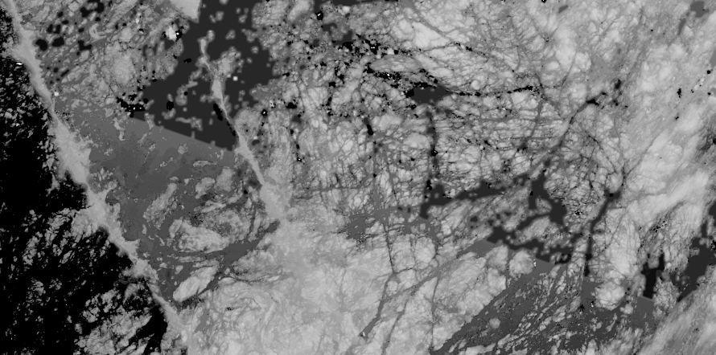

What _will_ be a problem is that the ALOS data uses the GeoTIFF data format: TIFF images with metadata that describes what section of planet they map to, and which mapping you need to use to go from pixel-coordinate to geo-coordinate. The TIFF part is super easy, we can just use the [tiff](https://www.npmjs.com/package/tiff) package to load those in, and ALOS thankfully has its files organized in directories with filenames that indicate which whole-angle GPS bounding box they're for, so finding the file we need to look up any GPS coordinate is also pretty easy... it's finding the pixel in the image that belongs to a _specific_ GPS coordinate that's a little more work.

Of course, [I already did this work so you don't have to](https://stackoverflow.com/questions/47951513#75647596), so let's dive in: what do we need?

### Working with ALOS data

We're going to split our ALOS code up into three parts: a querying object, a tile class, and a really simple caching system.

First, some ALOS constants:

```javascript
import { join, resolve } from "path";
import url from "node:url";
const __dirname = url.fileURLToPath(new URL(".", import.meta.url));

export const SEA_LEVEL = 0;
export const ALOS_VOID_VALUE = -9999;
export const NO_ALOS_DATA_VALUE = 9999;
export const INDEX_FILE = resolve(join(__dirname, `alos-index.json`));
export const CACHE_DIR = resolve(join(__dirname, `cache`));
```

Then, our querying object:

```javascript
import { getDistanceBetweenPoints } from "../api/autopilot/utils/utils.js";
import {
  SEA_LEVEL,
  ALOS_VOID_VALUE,
  NO_ALOS_DATA_VALUE,
} from "./alos-constants.js";
import { ALOSTile } from "./alos-tile.js";

const { floor, ceil, max } = Math;

// JAXA ALOS World 3D (30m) dataset manager
// homepage: https://www.eorc.jaxa.jp/ALOS/en/dataset/aw3d30/aw3d30_e.htm
// data format: https://www.eorc.jaxa.jp/ALOS/en/aw3d30/aw3d30v11_format_e.pdf
// license: https://earth.jaxa.jp/en/data/policy/

export class ALOSInterface {
  constructor(tilesFolder) {
    this.tilesFolder = tilesFolder;
    this.loaded = false;
    this.files = [];
    if (!this.tilesFolder) {
      console.log(
        `No ALOS data folder specified, elevation service will not be available.`
      );
    } else {
      this.findFiles();
      this.loaded = true;
      console.log(`ALOS loaded, using ${this.files.length} tiles.`);
    }
  }

  findFiles(dir = this.tilesFolder) {
    readdirSync(dir, { withFileTypes: true }).forEach((entry) => {
      const fullPath = join(dir, entry.name);
      if (entry.isFile() && fullPath.endsWith(".tif"))
        this.files.push(fullPath);
      if (entry.isDirectory()) this.findFiles(fullPath);
    });
  }

  getTileFor(lat, long) {
    if (!this.loaded) return;

    const [tileName, tilePath] = this.getTileFromFolder(
      this.tilesFolder,
      lat,
      long
    );
    if (!tileName) return;
    return new ALOSTile(tilePath);
  }

  getTileFromFolder(basedir, lat, long) {
    // ALOS tiles are named ALPSMKC30_UyyyWxxx_DSM.tif, where
    // U is either "N" or "S", yyy is the degree of latitude
    // (with leading zeroes if necessary), W is either "E" or
    // "W", and xxx is the degree of longitude (again with
    // leading zeroes if necessary).
    const latDir = lat >= 0 ? "N" : "S";
    const longDir = long >= 0 ? "E" : "W";
    lat = `` + (latDir == "N" ? floor(lat) : ceil(-lat));
    long = `` + (longDir == "E" ? floor(long) : ceil(-long));
    const tileName = `ALPSMLC30_${latDir}${lat.padStart(
      3,
      "0"
    )}${longDir}${long.padStart(3, "0")}_DSM.tif`;

    // find the full path for this file in the list of
    // known files we built in findFiles().
    const fullPath = this.files.find((f) => f.endsWith(tileName));
    if (!fullPath) return [false, false];

    return [tileName, join(basedir, fullPath)];
  }

  // And finally the function we care about the most:
  lookup(lat, long) {
    if (!this.loaded) return NO_ALOS_DATA_VALUE;

    lat = +lat;
    long = +long;
    const tile = this.getTileFor(lat, long);
    if (!tile) console.warn(`no tile for ${lat},${long}...`);
    const elevation = tile?.lookup(lat, long) ?? ALOS_VOID_VALUE;
    return elevation === ALOS_VOID_VALUE ? SEA_LEVEL : elevation;
  }
}
```

And then our tile class:

```javascript
import { existsSync, readFileSync, copyFileSync } from "fs";
import { basename, join } from "path";
import tiff from "tiff";
import { ALOS_VOID_VALUE } from "./alos-constants.js";

const { floor, ceil, max } = Math;

export class ALOSTile {
  constructor(tilePath, coarseLevel = 10) {
    this.tilePath = tilePath;
    this.coarseLevel = coarseLevel;
    this.init(tilePath);
  }

  init(filename) {
    const file = readFileSync(filename);
    const image = tiff.decode(file.buffer);
    const block = (this.block = image[0]);
    const fields = block.fields;
    // See https://stackoverflow.com/questions/47951513#75647596
    let [sx, sy, sz] = fields.get(33550);
    let [px, py, k, gx, gy, gz] = fields.get(33922);
    sy = -sy;
    this.reverse = [-gx / sx, 1 / sx, 0, -gy / sy, 0, 1 / sy];
    this.pixels = block.data;
  }

  // Get an [x, y] pixel coordinate, given a GPS coordinate
  geoToPixel(lat, long) {
    const R = this.reverse;
    return [R[0] + R[1] * long + R[2] * lat, R[3] + R[4] * long + R[5] * lat];
  }

  // Get the elevation for some GPS coordinate
  lookup(lat, long) {
    const [x, y] = this.geoToPixel(lat, long);
    const pos = (x | 0) + (y | 0) * this.block.width;
    let value = this.pixels)[pos];
    // the highest point on earth is ~8848m
    if (value === undefined || value > 8900) value = ALOS_VOID_VALUE;
    return value;
  }
}
```

And now we have a way to query elevations for GPS coordinates, without having to use an external service, or messing around with object spawning in-game. Except... it's not very efficient at the moment. Let's fix that by adding tile caching, as well as "coarse" tiles, where we scale down each time by a factor of ten, but rather than averaging the pixels, we only keep "the brightest ones" so that we get a maximum elevation map for 300x300m rather than 30x30m, effectively making our lookups faster while keeping our plane just as safe:

```javascript
import { join } from "path";
import { mkdir } from "fs/promises";
import { ALOSTile } from "./alos-tile.js";
import { getDistanceBetweenPoints } from "../api/autopilot/utils/utils.js";
import { SEA_LEVEL, ALOS_VOID_VALUE, INDEX_FILE, CACHE_DIR } from "./alos-constants.js";
import { existsSync, readFileSync, readdirSync, writeFileSync } from "fs";

const { floor, ceil, max } = Math;

// Ensure our cache directory exists before we try writing files to it.
await mkdir(CACHE_DIR, { recursive: true });

export class ALOSInterface {
  constructor(tilesFolder) {
    this.tilesFolder = tilesFolder;
    this.loaded = false;
    this.files = [];
    this.cache = {};
    if (!this.tilesFolder) {
      console.log(
        `No ALOS data folder specified, elevation service will not be available.`
      );
    } else {
      this.loadIndex();
      this.loaded = true;
      console.log(`ALOS loaded, using ${this.files.length} tiles.`);
    }
  }

  loadIndex() {
    // To prevent us from having to run through a file tree every single time we
    // start, we build an index file instead, so we can load that directly.
    if (!existsSync(INDEX_FILE)) {
      console.log(`Indexing dataset...`);
      const mark = Date.now();
      this.findFiles();
      const json = JSON.stringify(
        this.files.map((v) => v.replace(this.tilesFolder, ``))
      );
      writeFileSync(INDEX_FILE, json);
      console.log(
        `Dataset indexed in ${((Date.now() - mark) / 1000).toFixed(2)}s (${
          this.files.length
        } tiles found)`
      );
    }
    this.files = JSON.parse(readFileSync(INDEX_FILE));
    console.log(`ALOS loaded, using ${this.files.length} tiles.`);
  }

  ...

  getTileFor(lat, long) {
    if (!this.loaded) return;

    const [tileName, tilePath] = this.getTileFromFolder(this.tilesFolder, lat, long);
    if (!tileName) return;
    // Instead of constantly loading the tile from file, we cache it in memory.
    this.cache[tilePath] ??= new ALOSTile(tilePath);
    return this.cache[tilePath];
  }

  lookup(lat, long, coarse = false) {
    if (!this.loaded) return NO_ALOS_DATA_VALUE;

    lat = +lat;
    long = +long;
    const tile = this.getTileFor(lat, long);
    if (!tile) console.warn(`no tile for ${lat},${long}...`);
    // pass the "coarse" flag along so we perform a more efficient, but lower resolution, lookup.
    const elevation = tile?.lookup(lat, long, coarse) ?? ALOS_VOID_VALUE;
    return elevation === ALOS_VOID_VALUE ? SEA_LEVEL : elevation;
  }
}
```

and our tile update:

```javascript
import tiff from "tiff";
import { basename, join } from "path";
import { ALOS_VOID_VALUE, CACHE_DIR } from "./alos-constants.js";
import { existsSync, readFileSync, copyFileSync } from "fs";

const { floor, ceil, max } = Math;

export class ALOSTile {
  constructor(tilePath, coarseLevel = 10) {
    this.tilePath = tilePath;
    this.coarseLevel = coarseLevel;
    // copy the file itself to our local cache dir for faster loading in the future
    const filename = join(`.`, CACHE_DIR, basename(tilePath));
    if (!existsSync(filename)) copyFileSync(tilePath, filename);
    this.init(filename);
  }

  init(filename) {
    ...
    this.pixels = block.data;
    this.formCoarseTile(block.width, block.height, [sx, sy, gx, gy]);
  }

  formCoarseTile(width, height, [sx, sy, gx, gy]) {
    // form a much smaller, coarse lookup map
    const { coarseLevel, pixels: p } = this;
    this.coarsePixels = [];
    for (let i = 0; i < p.length; i += coarseLevel) {
      this.coarsePixels[i / coarseLevel] = max(...p.slice(i, i + coarseLevel));
    }
    for (let i = 0, w = width / coarseLevel; i < w; i += coarseLevel) {
      let list = [];
      for (let j = 0; j < coarseLevel; j++) list.push(p[i + j * w]);
      this.coarsePixels[i / coarseLevel] = max(...list);
    }
    this.coarsePixels = new Uint16Array(this.coarsePixels);
    const [sxC, syC] = [sx * coarseLevel, sy * coarseLevel];
    this.coarseForward = [gx, sxC, 0, gy, 0, syC];
    this.coarseReverse = [-gx / sxC, 1 / sxC, 0, -gy / syC, 0, 1 / syC];
  }

  geoToPixel(lat, long, coarse = false) {
    const R = coarse ? this.coarseReverse : this.reverse;
    return [R[0] + R[1] * long + R[2] * lat, R[3] + R[4] * long + R[5] * lat];
  }

  lookup(lat, long, coarse = false) {
    const [x, y] = this.geoToPixel(lat, long, coarse);
    const pos = (x | 0) + (y | 0) * this.block.width;
    let value = (coarse ? this.coarsePixels : this.pixels)[pos];
    if (value === undefined || value > 8900) value = ALOS_VOID_VALUE;
    return value;
  }
}
```

We scale down our image data by first picking the brightest (and therefore highest) pixel out of every 10 pixels horizontally, then doing the same to that new data, but vertically. What we're left with is a 100x smaller image that encodes the max elevation over 300x300 meter blocks, rather than the original 30x30 meter blocks.

Which takes care of our original point (2) in our four point list, let's tackle the rest of our points:

### Finishing up

1. we can generate a path from our current location and a point for a miles ahead of us by using "the wrong" math in our ALOS interface, pretending that paths between two GPS coordinates are straight lines, instead of lying on a [great circle](https://en.wikipedia.org/wiki/Great_circle):

   ```javascript
   const COARSE_LEVEL = 10;

   export class ALOSInterface {
     ...

     getTileFor(lat, long) {
       ...
       this.cache[tilePath] ??= new ALOSTile(tilePath, COARSE_LEVEL);
       return this.cache[tilePath];
     }

     ...

     getHighestPointBetween(lat1, long1, lat2, long2, coarse = false) {
       if (!this.loaded) return { lat: 0, long: 0, elevation: NO_ALOS_DATA_VALUE };

       const distance = getDistanceBetweenPoints(lat1, long1, lat2, long2);
       const s = (coarse ? COARSE_LEVEL * 0.3 : 0.03) / distance;
       let maxValue = { elevation: ALOS_VOID_VALUE, lat: lat2, long: long2 };
       for (let i = s, lat, long, elevation; i <= 1; i += s) {
         lat = (1 - i) * lat1 + i * lat2;
         long = (1 - i) * long1 + i * long2;
         elevation = this.lookup(lat, long, coarse);
         if (elevation > maxValue.elevation) maxValue = { elevation, lat, long };
       }
       return maxValue;
     }
   }
   ```

   Which just leaves the question of how to get the GPS coordinate "given our current location, heading, and distance", which is one of those things we can just look up the code for:

   ```javascript
   function getPointAtDistance(lat1, long1, d, heading) {
     const R = 6371; // the average radius of Earth
     lat1 = radians(lat1);
     long1 = radians(long1);
     const angle = radians(heading);
     const lat2 = asin(
       sin(lat1) * cos(d / R) + cos(lat1) * sin(d / R) * cos(angle)
     );
     const dx = cos(d / R) - sin(lat1) * sin(lat2);
     const dy = sin(angle) * sin(d / R) * cos(lat1);
     const long2 = long1 + atan2(dy, dx);
     return { lat: degrees(lat2), long: degrees(long2) };
   }
   ```

2. We already wrote the code for this step!

3. We basically wrote the code for this already, too: we just update the value for `autopilot.modes[ALTITUDE_HOLD]` and the autopilot does the rest.

4. And this isn't even code: the autopilot will just keep running for as long as we don't turn it off.

Now we just need to add "terrain follow" as an autopilot mode (making sure it runs only when vertical hold is engaged):

```javascript
export const LEVEL_FLIGHT = `LVL`;
export const ALTITUDE_HOLD = `ALT`;
export const HEADING_MODE = `HDG`;
export const AUTO_THROTTLE = `ATT`;
export const TERRAIN_FOLLOW = `TER`;
```

With the new mode added to the autopilot code:

```javascript
...
import { ... TERRAIN_FOLLOW } from "./utils/constants.js";
import { followTerrain } from "./terrain-follow.js";

class AutoPilot {
  ...
  constructor() {
    ...
    this.modes = {
      [LEVEL_FLIGHT]: false,
      [ALTITUDE_HOLD]: false,
      [HEADING_MODE]: false,
      [AUTO_THROTTLE]: true,
      [TERRAIN_FOLLOW]: false
    };
    ...
  }

  ...

  getAutoPilotParameters() {
    const state = {
      MASTER: this.autoPilotEnabled,
      // we add the terrain follow "max elevation" information to our autopilot parameters
      elevation: this.modes[TERRAIN_FOLLOW] ? this.elevation : false,
    };
    Object.entries(this.modes).forEach(([key, value]) => (state[key] = value));
    return state;
  }

  ...

  // And when terrain follow is on, follow that terrain!
  async runAutopilot() {
    ...

    if (this.modes[ALTITUDE_HOLD]) {
      if (this.modes[TERRAIN_FOLLOW] !== false && this.alos.loaded) {
        followTerrain(this, state);
      }
      altitudeHold(this, state);
    }

    this.prevState = state;
  }
}
```

And of course, with a new file called `terrain-follow.js`:

```javascript
const { ceil } = Math;
import { degrees, getPointAtDistance } from "./utils/utils.js";
import { ALTITUDE_HOLD, FEET_PER_METER } from "./utils/constants.js";

const ALOS_VOID_VALUE = -9999;

export async function followTerrain(autopilot, state, altitude = 500) {
  const { latitude: lat, longitude: long, trueHeading } = state;
  const distance = 12; // in kilometers
  const { lat: lat2, long: long2 } = getPointAtDistance(
    lat,
    long,
    distance,
    degrees(trueHeading)
  );
  const coarseLookup = true;
  const maxValue = autopilot.alos.getHighestPointBetween(
    lat,
    long,
    lat2,
    long2,
    coarseLookup
  );
  if (maxValue.elevation === ALOS_VOID_VALUE) maxValue.elevation = 0;

  // We'll add these values to our autopilot parameters
  autopilot.elevation = maxValue;
  autopilot.elevation.lat2 = lat2;
  autopilot.elevation.long2 = long2;

  // Rememeber: ALOS data is in meters, but MSFS is in feet.
  // We'll crash really fast if we don't convert units =)
  let targetAltitude = maxValue.elevation * FEET_PER_METER + altitude;

  // We don't want to constantly change altitude, so we use elevation brackets:
  let bracketSize = 100;
  if (targetAltitude > 1000) bracketSize = 200;
  if (targetAltitude > 10000) bracketSize = 500;
  if (targetAltitude > 30000) bracketSize = 1000;
  targetAltitude = ceil(targetAltitude / bracketSize) * bracketSize;

  // Set the ALT value and let the autopilot do the rest
  autopilot.modes[ALTITUDE_HOLD] = targetAltitude;
}
```

Of course this does require so extra code to make sure waypoint elevation and terrain follow altitudes don't clash, so we're going to add an early return in `altitude-hold.js`:

```javascript
function updateAltitudeFromWaypoint(autopilot, state) {
  if (autopilot.modes[TERRAIN_FOLLOW]) return;

  const { waypoints } = autopilot;
  const waypointAltitude = waypoints.getAltitude(state);
  if (waypointAltitude) {
    autopilot.setTarget(ALTITUDE_HOLD, waypointAltitude);
  }
}
```

The last thing we'll do is add a bit of cosmetic code so that we can see the "terrain scan line" on our map while we're flying. First we update our `plane.js`:

```javascript
export class Plane {
  ...

  async setElevationProbe(value) {
    if (this.elevationProbe) this.elevationProbe.remove();
    if (!value) return;
    this.elevationProbe = new Trail(
      this.map,
      [this.state.lat, this.state.long],
      `#4F87`,
      { weight: 30, lineCap: `butt` }
    );
    this.elevationProbe.add(value.lat2, value.long2);
  }

  ...
}
```

And then we call this function in our client-side autopilot code:

```javascript
...

  bootstrap(params) {
    Object.entries(params).forEach(([key, value]) => {
      // draw our elevation scan line on the map
      if (key === `elevation`) return this.owner.setElevationProbe(value);
      ...
    });
  }

...
```

Which will give us the following visualization:

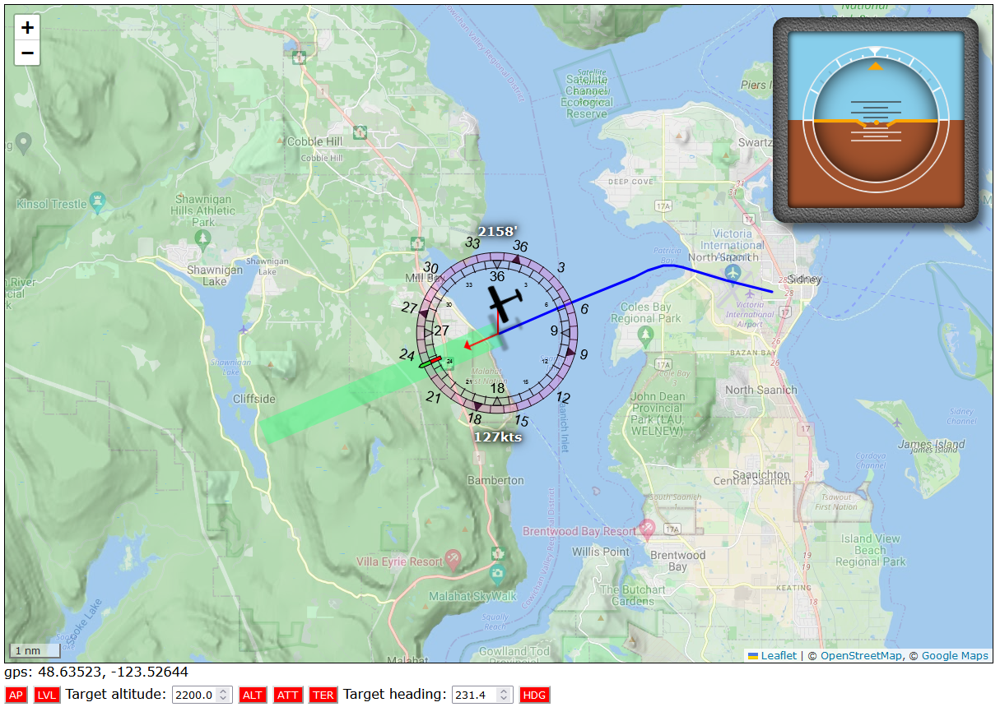

### Testing our code

Let's update our web page again so that we can toggle the auto-throttle and terrain follow modes:

```html
<div id="autopilot" class="controls">
  <link rel="stylesheet" href="/css/autopilot.css" />

  <button class="MASTER">AP</button>
  <button title="level wings" class="LVL">LVL</button>
  <label>Target altitude: </label>
  <input
    class="altitude"
    type="number"
    min="0"
    max="40000"
    value="1500"
    step="100"
  />
  <button title="altitude hold" class="ALT">ALT</button>
  <button class="TER">TER</button>
  <label>Target heading: </label>
  <input class="heading" type="number" min="1" max="360" value="360" step="1" />
  <button class="HDG">HDG</button>
</div>
```

And a minor update to our client-side autopilot JS:

```javascript
export const AP_DEFAULT = {
  MASTER: false,
  LVL: false,
  ALT: false,
  HDG: false,
  ATT: true,
  TER: false,
};
```

Just to make it aware that auto-throttle and terrain follow are things it can now toggle. So, graph time!

#### Top Rudder Solo 103

We're going to skip this one, because we know what's going to happen: terrain follow mode can quite easily see a mountain 12 nautical miles down the line, and go "we need to climb 2200 feet" and then the Top Rudder will go "you got it!" and promptly go into a death spiral. We can have autopilot fun with the Top Rudder, but unfortunately, not the terrain follow kind.

#### De Havilland DHC-2 "Beaver"

We'll be taking off from Victoria Airport on Vancouver Island, which sits at an elevation of about 60 feet, and then simply by heading straight, we'll have quite a bit of terrain to contend with. Let's see what happens!


Honestly, "not a lot" other than the autopilot giving us altitudes to fly that make sure we don't fly straight into a mountain side. The plane's altitude is not quite as "clean" or platformed as a human would fly the plane, but it doesn't have to be, we're not flying, the computer is.

#### Cessna 310R

The story is the same in the 310R, although because it's a lot faster than the Beaver, the elevation probe gives a smoother curve, but again: no mountain side collisions, which is good!


#### Beechcraft Model 18

Flying a tad faster than the 310R but reacting more slowly to control instructions, the altitude profile is even better looking than the 310R's. I love this plane, it is just a delight.


#### Douglas DC-3

Not much to say: it does what it needs to do despite weighing about as much as as half of Vancouver Island.


## Auto takeoff

In fact we can do one more thing if we just want the computer to fly our plane for us, and that's have it handle take-off when our plane's sitting on the ground. This is, barring auto-landing, the hardest thing to implement if we're not building a bespoke autopilot for one specific aeroplane, but we're going to do it anyway, and we're going to succeed, _and_ it's going to be glorious.

There's a few challenges we'll want to tackle, in order:

1. make sure the plane is ready for takeoff, then once ready
2. throttle up and roll down the runway to pick up speed. Ideally in a straight line. Then
3. rotating the plane in order to take off once we're at take-off speed, and then
4. leveling out the plane and switching to the autopilot.

```javascript
export class AutoTakeoff {
  prepped = false;
  takeoffHeading = false;
  takeoffAltitude = false;
  liftoff = false;
  levelOut = false;
  easeElevator = false;

  constructor(autopilot) {
    this.autopilot = autopilot;
    this.api = autopilot.api;
  }

  async run(state) {
    const { api } = this;

    const {
      TOTAL_WEIGHT: totalWeight,
      DESIGN_SPEED_VS1: vs1,
      DESIGN_SPEED_MIN_ROTATION: minRotate,
      NUMBER_OF_ENGINES: engineCount,
      TITLE: title,
    } = await api.get(
      `TOTAL_WEIGHT`,
      `DESIGN_SPEED_VS1`,
      `DESIGN_SPEED_MIN_ROTATION`,
      `NUMBER_OF_ENGINES``TITLE`
    );

    const {
      onGround,
      speed: currentSpeed,
      lift,
      dLift,
      verticalSpeed: vs,
      dVS,
      latitude: lat,
      longitude: long,
      isTailDragger,
    } = state;

    const heading = degrees(state.heading);
    const trueHeading = degrees(state.trueHeading);
    const vs12 = vs1 ** 2;

    if (!this.takeoffAltitude) this.takeoffAltitude = state.altitude;

    // Make sure we've set the aeroplane up for a runway roll.
    if (!this.prepped)
      return this.prepForRoll(
        isTailDragger,
        engineCount,
        state.altitude,
        lat,
        long,
        heading,
        trueHeading
      );

    // As long as we've not lifted off, throttle up to max
    if (!this.liftoff) await this.throttleUp(engineCount);

    // Try to keep us going in a straight line.
    this.autoRudder(
      onGround,
      isTailDragger,
      vs12,
      minRotate,
      currentSpeed,
      lat,
      long,
      heading
    );

    // Is it time to actually take off?
    await this.checkRotation(
      onGround,
      currentSpeed,
      lift,
      dLift,
      vs,
      dVS,
      totalWeight
    );

    // Is it time to hand off flight to the regular auto pilot?
    const altitudeGained = state.altitude - this.takeoffAltitude;
    await this.checkHandoff(
      title,
      isTailDragger,
      totalWeight,
      vs,
      dVS,
      altitudeGained
    );
  }
}
```

With the autopilot loading this class:

```javascript
import { ..., AUTO_TAKEOFF } from "./constants.js";
...

import { AutoTakeoff as ato } from "./auto-takeoff.js";
let AutoTakeoff = ato;

export class AutoPilot {
  constructor(api, onChange = () => {}) {

  }

  reset() {
    this.modes = {
      [LEVEL_FLIGHT]: false,
      [HEADING_MODE]: false,
      [ALTITUDE_HOLD]: false,
      [AUTO_THROTTLE]: true,
      [TERRAIN_FOLLOW]: false,
      [AUTO_TAKEOFF]: false,
    ];
    this.autoTakeoff = false;
  }

  watchForUpdates() {
    ...
    watch(__dirname, `auto-takeoff.js`, (lib) => {
      AutoTakeoff = lib.AutoTakeoff;
      // since this is a class instance, run a copy construction:
      this.autoTakeoff = new AutoTakeoff(this, this.autoTakeoff);
    });
  }

  async processChange(type, oldValue, newValue) {
    if (type === AUTO_TAKEOFF) {
      if (oldValue === false && newValue === true) {
        this.autoTakeoff = new AutoTakeoff(this);
        this.trim = { x: 0, y: 0, z: 0 };
      }
      this.AP_INTERVAL = newValue ? FAST_AUTOPILOT : REGULAR_AUTOPILOT;
    }
    ...
  }

  async runAutopilot() {
    ...
    const state = new State(data, this.prevState);

    if (!this.modes[AUTO_TAKEOFF] && state.speed < 15) {
      // Disengage our autopilot, but preserve all settings
      // in case we want to turn it back on momentarily.
      return;
    }

    // Are we in auto-takeoff?
    if (this.modes[AUTO_TAKEOFF]) this.autoTakeoff.run(state);

    // Do we need to level the wings / fly a specific heading?
    if (this.modes[LEVEL_FLIGHT]) flyLevel(this, state);

    ...
  }
}
```

And another update to `altitude-hold.js`:

```javascript
function updateAltitudeFromWaypoint(autopilot, state) {
  if (autopilot.modes[AUTO_TAKEOFF]) return;
  if (autopilot.modes[TERRAIN_FOLLOW]) return;

  const { waypoints } = autopilot;
  const waypointAltitude = waypoints.getAltitude(state);
  if (waypointAltitude) {
    autopilot.setTarget(ALTITUDE_HOLD, waypointAltitude);
  }
}
```

As well as `fly-level.js`:

```javascript
function updateHeadingFromWaypoint(autopilot, state) {
  if (autopilot.modes[AUTO_TAKEOFF]) return;

  const { waypoints } = autopilot;
  const waypointHeading = waypoints.getHeading(state);
  if (waypointHeading) {
    autopilot.setTarget(HEADING_MODE, waypointHeading);
  }
}
```

And finally in `waypoints.js`:

```javascript
export class WayPoints {
  ...

  getHeading(state) {
    // If we're in auto-takeoff, waypoints should not be active yet
    const { modes } = this.autopilot;
    if (modes[AUTO_TAKEOFF]) return;
    ...
  }
}
```

And with that out of the way, we can run through each step in the auto-takeoff process.

### Preflight checklist

The preflight checks are relatively easy:

- we want to make sure our altimeter is calibrated,
- the parking brake is off,
- flaps get fully retracted (some planes want flaps during takeoff, others don't, and we have no way of looking up which it is, so all planes get to lift off without the help of flaps. Use the runway, that's what it's for.)
- we reset all the trim values so that we start off neutral (again, some planes want trim for takeoff: too bad for them),
- we set the elevator position to 0 (just in case it wasn't),
- we set the fuel mixture somewhere between full rich and 65% depending on whether we're sitting at sea level or 8000 feet, or somewhere in between those two.
- if the plane's a tail dragger, we lock the tail wheel

So, in code:

```javascript
  async prepForRoll(isTailDragger, engineCount, altitude, lat, long, heading, trueHeading) {
    const { api, autopilot } = this;
    console.log(`Prep for roll`);

    // Record our initial heading and location, as well as a location along that heading
    // somewhere in the distance, so that we have a line we can (try to) stick to.
    if (!this.takeoffHeading) {
      this.takeoffHeading = heading;
      this.takeoffCoord = { lat, long };
      this.futureCoord = getPointAtDistance(lat, long, 2, trueHeading);
      autopilot.setTarget(HEADING_MODE, this.takeoffHeading);
    }

    // Ensure our barometric altimeter is calibrated
    api.trigger(`BAROMETRIC`);

    // Is the parking brake engaged? If so, let's take that off.
    const { BRAKE_PARKING_POSITION } = await api.get(`BRAKE_PARKING_POSITION`);
    if (BRAKE_PARKING_POSITION === 1) api.trigger(`PARKING_BRAKES`);

    // We don't have a database of which plane needs how much flaps for takeoff, so we
    // just... don't set flaps. It makes take-off take a bit longer, but then again:
    // use the whole runway, that's literally what it's for.
    let flaps = await api.get(`FLAPS_HANDLE_INDEX:1`);
    flaps = flaps[`FLAPS_HANDLE_INDEX:1`];
    if (flaps !== 0) api.set(`FLAPS_HANDLE_INDEX:1`, 0);

    // Reset all trim values before takeoff.
    api.set(`AILERON_TRIM_PCT`, 0);
    api.set(`ELEVATOR_TRIM_POSITION`, 0);
    api.set(`RUDDER_TRIM_PCT`, 0);

    // Set mixture to something altitude-appropriate and set props to 90%, mostly because we have no
    // way to ask MSFS what the "safe" value for props is, and we don't want the engines to burn out.
    const mixture = constrainMap(altitude, 3000, 8000, 100, 65);
    for (let i = 1; i <= engineCount; i++) {
      api.set(`GENERAL_ENG_MIXTURE_LEVER_POSITION:${i}`, mixture);
      api.set(`GENERAL_ENG_PROPELLER_LEVER_POSITION:${i}`, 90);
    }

    // Lock the tailwheel. If we have one, of course.
    if (isTailDragger) {
      const { TAILWHEEL_LOCK_ON } = await api.get(`TAILWHEEL_LOCK_ON`);
      if (TAILWHEEL_LOCK_ON === 0) api.trigger(`TOGGLE_TAILWHEEL_LOCK`);
    }

    // Force neutral elevator
    await api.set(`ELEVATOR_POSITION`, 0);
    this.prepped = true;
  }
```

With those steps performed, we can start to throttle up and roll down the runway.

### Runway roll

Now, the _easy_ part is slowly throttling the engines up to 100%. The _hard_ part is keeping the plane on the runway: propeller torque as well as small differences in engine outputs on multi-engine aircrafts can _and will_ roll us off the runway if we don't use the pedals to steer us in the right direction. For instance, let's see what happens if we just throttle up the engines without any kind of rudder action:

<table>
<tr><td>
</td><td>
</td>
</tr>
<tr><td>
</td><td>
</td>
</tr>
</table>

It's not good, this is varying degrees of crashing into trees or buildings, so we're definitely going to need to implement an "auto-rudder" of sorts if we want to at least _pretend_ we're sticking to the runway during takeoff.

One thing we notice is the difference between the 310R and the three tail draggers. As you may have guessed, this corresponds to the moment when the tail wheel no longer makes contact with the ground: up until that point we have the benefit of actually being able to (slightly) steer using the rear wheel, with the actual rudder having to do very little, but once it's off the ground we need to briefly work the rudder a lot harder to stop the plane from suddenly veering off.

So our attempt at an auto-rudder will consist of a few phases:

- pre-roll: where we make sure the plane's ready to roll (brakes, flaps, etc) and we record our start position
- initial roll, all wheels on the ground, plenty of control
  - the more out-of-heading we are, the more we steer back towards the center line.
  - if this is not a tail dragger, this phase effectively lasts for the entire roll.
- loss of control when the tail wheel comes off the ground
- Relatively stable control after the initial loss of control

If we're lucky (or we accept "good enough") we can come up with code that can handle all of these phases without knowing "which phase we're in", so we'll make some more observations:

- the faster we're going, the less rudder we need to apply to get the same effect
- the close to the center line we are, the less rudder we need to apply, and
- every plane has rudder characteristics that we could use to finesse the code, but we don't have access to them.

Now, the first two are relatively easy to implement (although we'll need a fair bit of code for step 2, even if it's simple code). It's that last point that's properly annoying. There's just no way to get the information we want, so if we want something that mostly kind of sort of works for mostly all planes, we're going to have run this code a million times for different planes and figure out what "magic constant" works for which plane. And then try to figure out what plane property that we _do_ have access to we can tie that to. To save you that headache, I've done that work for us, but suffice it to say we shouldn't feel good about this solution and ideally, one day, we will come up with something better.

So let's write some code:

```javascript
  async function changeThrottle(api, engineCount = 4, byHowMuch, floor = 0, ceiling = 100) {
    let newThrottle;
    for (let count = 1; count <= engineCount; count++) {
      const simVar = `GENERAL_ENG_THROTTLE_LEVER_POSITION:${count}`;
      const throttle = (await api.get(simVar))[simVar];
      if ((byHowMuch < 0 && throttle > floor) || (byHowMuch > 0 && throttle < ceiling)) {
        newThrottle = throttle + byHowMuch;
        api.set(simVar, newThrottle);
      }
    }
    return newThrottle ?? (byHowMuch < 0 ? floor : ceiling);
  }

  async throttleUp(engineCount) {
    const { api, maxed } = this;
    if (maxed) return;

    const newThrottle = await this.changeThrottle(api, engineCount, 1);
    console.log(`Throttle up to ${newThrottle | 0}%`);
    if (newThrottle === 100) {
      this.maxed = true;
    }
  }

  async autoRudder(onGround, isTailDragger, vs12, minRotate, currentSpeed, lat, long, heading) {
    const { api, takeoffCoord: p1, futureCoord: p2 } = this;

    // If we're actually in the air, we want to ease the rudder back to neutral.
    if (!onGround) {
      const { RUDDER_POSITION: rudder } = await api.get(`RUDDER_POSITION`);
      api.set(`RUDDER_POSITION`, rudder / 2);
      return;
    }

    // If we're still on the ground, get our aeroplane's drift with respect to the center line,
    // using orthogonal projection, https://en.wikipedia.org/wiki/Vector_projection
    // We know the centerline is p1--p2 (the place we started and a point in the distance
    // along the same heading as the runway), and we have a vector from p1 to our current
    // location, so we can project our current location onto the centerline and measure how
    // many feet off the centerline we are:
    const c = { lat, long };
    const abx = p2.long - p1.long;
    const aby = p2.lat - p1.lat;
    const acx = c.long - p1.long;
    const acy = c.lat - p1.lat;
    const coeff = (abx * acx + aby * acy) / (abx * abx + aby * aby);
    const dx = p1.long + abx * coeff;
    const dy = p1.lat + aby * coeff;
    const cross1 = (p2.long - p1.long) * (c.lat - p1.lat);
    const cross2 = (p2.lat - p1.lat) * (c.long - p1.long);
    const left = cross1 - cross2 > 0;
    const distInMeters = 100000 * FEET_PER_METER;
    const drift = (left ? 1 : -1) * dist(long, lat, dx, dy) * distInMeters;

    // Then we turn that distance into an error term that we add the number of degrees off
    // we are. If we need to fly 160 degrees and we're rolling towards 150, that's a 10
    // degree difference, but if we're also quite a few feet off the centerline, we can
    // tell the code we actually need to correct for, say, 12 or 15 degrees, so that we
    // don't just end up parallel to the center line, but actually drive back towards it.
    const limit = constrainMap(currentSpeed, 0, minRotate, 12, 4);
    const driftCorrection = constrainMap(drift, -130, 130, -limit, limit);

    // With that done, get our heading diff, with a drift correction worked in:
    const diff = getCompassDiff(heading, this.takeoffHeading + driftCorrection);

    // get our "magic constant":
    const stallFactor = constrainMap(vs12, 2500, 6000, 0.05, 0.3);

    // Set our "the faster we go, the less rudder we need" factor, which is just a straight
    // line down from 1 at a speed of zero to 0 at our minimum take-off speed, but constrained
    // so that we never go below 0.2, because we always want to be able to add *some* rudder.
    const speedFactor = constrain(1 - (currentSpeed / minRotate) ** 0.5, 0.2, 1);

    // Then the tail wheel: if this is not a tail dragger, only apply half the rudder.
    const tailFactor = isTailDragger ? 1 : 0.5;

    // And then finally we multiply all of those and put our foot down:
    const rudder = diff * stallFactor * speedFactor * tailFactor
    api.set(`RUDDER_POSITION`, rudder);
  }
```

And with that, what do things look like now?

<table>
<tr><td>
</td><td>
</td>
</tr>
<tr><td>
</td><td>
</td>
</tr>
</table>

That looks straight to me! There's a bit of wibbling on the runway by the heavier two, but nothing that keeps them from taking off straight.

So let's implement that whole "taking off" business!

### Rotate/take-off

Once we're at rolling at a good speed, we'll probably want to rotate the aeroplane (i.e. get its nose up) and take off to the skies, but what's a good speed

There are two special speeds that determine when an aeroplane can take off (from amongst a [truly humongous list](https://en.wikipedia.org/wiki/V_speeds) of "V- speeds"):

- `Vr`, or the "rotation speed", which is the speed at which you want to start pulling back on the stick or yoke to get the plane to lift off,and
- `V1`, which is the cutoff speed for aborting a takeoff. If you haven't taken off by the time the plane reaches `V1`, you are taking off, whether you like it or not, because the alternative is a crash. It's the speed at which your plane can no longer safely slow down to a stop simply by throttling and braking, so you're going to keep speeding up and you **_will_** take off, even if you then find a suitable place to perform an emergency landing.

For the purpose of our auto-takeoff we're going to _prefer_ to use `Vr`, but not every plane has a sensible value set for that (for... reasons? I have no idea, some planes have nonsense values like -1), so we'll use the rule "use `Vr` unless that's nonsense, then use `V1`".

```javascript
  async checkRotation(onGround, currentSpeed, lift, dLift, vs, totalWeight) {
    const { api, autopilot } = this;

    let {
      DESIGN_SPEED_MIN_ROTATION: minRotate, // this is our Vr
      DESIGN_TAKEOFF_SPEED: takeoffSpeed,   // this is our V1
    } = await api.get(`DESIGN_SPEED_MIN_ROTATION`, `DESIGN_TAKEOFF_SPEED`);

    // Annoyingly both values are in "feet per second" instead of knots, so let's convert:
    minRotate *= FPS_IN_KNOTS;
    takeoffSpeed *= FPS_IN_KNOTS;
    if (minRotate < 0) minRotate = 1.5 * takeoffSpeed;
    // Just for safety, we'll pick our actual rotation speed as "the one that MSFS
    // suggests should work, but let's add 5 knots, just in case":
    const rotateSpeed = minRotate + 5;

    // So now that we know when to rotate: are we in a rotation situation?
    if (!onGround || currentSpeed > rotateSpeed) {
      const { ELEVATOR_POSITION: elevator } = await api.get(`ELEVATOR_POSITION`);

      // We're still on the ground: start pulling back on the stick/yoke
      if (this.liftoff === false) {
        this.liftoff = Date.now();
        const pullBack = constrainMap(totalWeight, 3500, 14000, 0.05, 2);
        api.set(`ELEVATOR_POSITION`, pullBack);
      }

      // If we're not on the ground anymore, there are two possibilities:
      else {
        // First, if we're climbing too fast, back off on the elevator a bit:
        if (vs > 1000 && elevator > 0) {
          const backoff = constrainMap(vs, 100, 3000, this.easeElevator / 100, this.easeElevator / 10);
          api.set(`ELEVATOR_POSITION`, elevator - backoff);
        }

        // But if we're not climbing fast enough, pull on that stick/yoke a bit more:
        else if (dLift <= 0.2 && lift <= 300 && vs < 200) {
          let touch = constrainMap(totalWeight, 3500, 14000, 0.02, 0.2);
          touch = constrainMap(dLift, 0, 0.1, touch, 0);
          api.set(`ELEVATOR_POSITION`, elevator + touch);
        }

        // Irrespective of which of those two we're in, we want to make sure that the wing leveler
        // is turned on, because we absolutely positively want to fly straight during take-off:
        if (!autopilot.modes[LEVEL_FLIGHT]) autopilot.setTarget(LEVEL_FLIGHT, true);
      }
    }
  }
```

And that's our take off code. The trick is to make sure we pull on the stick/yoke enough to make the plane "rotate" upwards (hence the name), but not so hard that it flies out of control, so we just use small steps, and as long as we're not climbing we just keep doing that. Eventually our pulling back the elevator will overcome gravity.

### Handoff to the autopilot

The final step in the auto-takeoff process is to signal that auto-takeoff is complete, and to turn out the autopilot with the heading we're already flying, and with terrain mode turned on, for the ultimate "one click flight" that starts on the runway instead of in mid-air with an MSFS autopilot set to who knows what (I love it when MSFS spawns you with the AP set to climb 2000 feet per minute).

The code above suggests that there's a signal we can use to determine whether we've completed take-off, namely when we've leveling out the plane and we reach a point where we're no longer vertically accelerating. At that point we can safely switch to the autopilot and have it take over the whole "what altitude do we actually need to fly at?" business:

```javascript
  async checkHandoff(title, isTailDragger, totalWeight, vs, dVS, altitudeGained) {
    const { api, autopilot } = this;

    // If the plane is leveling out, and we're not vertically accelerating, switch to the autopilot!
    if (this.levelOut && dVS <= 0) {
      // Set the elevator trim (scaled for the plane's trim limits) so that the
      // autopilot doesn't start in neutral and we don't suddenly pitch down hard.
      const { ELEVATOR_TRIM_UP_LIMIT: trimLimit } = await api.get(`ELEVATOR_TRIM_UP_LIMIT`);

      // Note that these values are guesses: there does not appear to be anything in MSFS that lets
      // use set the trim value to what it needs to be, the best it can give us is "cruise pitch",
      // which unfortunately does not translate to trim values at all. As such, some planes can
      // absolutely still pitch down hard and crash, like the PAC P-750 XSTOL...
      const trim = trimLimit * constrainMap(totalWeight, 3000, 6500, 0.0003, 0.003);

      // So just to show off how to deal with a problematic plane:
      if (title.toLowerCase().includes(`orbx p-750`)) {
        trim *= 4; // Seriously, it needs four times as much trim as most other planes.
      }

      await api.set("ELEVATOR_TRIM_POSITION", trim);

      // Then reset the elevator since it's not required for the autopilot to do its job:
      await api.set("ELEVATOR_POSITION", 0);

      // And then turn on terrain follow, while turning off auto-takeoff. In order for terrain follow
      // to kick in, we do need an altitude, but that can be any value, since it's going to immediately
      // get overruled by the waypoint or terrain follow code.
      autopilot.setTarget(ALTITUDE_HOLD, 10000);
      autopilot.setTarget(TERRAIN_FOLLOW, true);
      autopilot.setTarget(AUTO_TAKEOFF, false);
    }

    // If the plane is not level yet: mark the plane as leveling out so that the above "what to do
    // while leveling out" code paths kick in:
    const limit = constrainMap(totalWeight, 3000, 6500, 300, 1000);
    if (!this.levelOut && (vs > limit || altitudeGained > 100)) {
      this.levelOut = true;
      console.log(`level out`);
      const { ELEVATOR_POSITION } = await api.get(`ELEVATOR_POSITION`);
      this.easeElevator = ELEVATOR_POSITION;

      // And now that we're leveling off, run through the post-takeoff procedure:
      api.set(`RUDDER_POSITION`, 0);
      api.trigger(`GEAR_UP`);
      // Normally we'd also raise flaps, but we never lowered them, so we're already winning!
    }
  }
```

And... that's it, we implemented auto-takeoff! One-button flying, here we go!

### Testing our code

As always, we'll want to update our web page so that we can actually click that "one click flight" button:

```html
<div class="controls">
  <link rel="stylesheet" href="/css/autopilot.css" />
  <button class="MASTER">AP</button>
  <button title="level wings" class="LVL">LVL</button>
  <label>Target altitude: </label>
  <input
    class="altitude"
    type="number"
    min="0"
    max="40000"
    value="4500"
    step="100"
  />
  <button title="altitude hold" class="ALT">ALT</button>
  <button title="auto throttle" class="ATT">ATT</button>
  <button title="terrain follow" class="TER">TER</button>
  <label>Target heading: </label>
  <input class="heading" type="number" min="1" max="360" value="360" step="1" />
  <button title="heading mode" class="HDG">HDG</button>
  <!-- make the magic happen! -->
  <button title="auto take-off" class="ATO">take off</button>
</div>
```

That's getting crowded, but it's the last thing we're adding. No client-side JS changes, other than updating our list of autopilot strings:

```javascript
export const AP_DEFAULT = {
  MASTER: false,
  LVL: false,
  ALT: false,
  ATT: false,
  TER: false,
  HDG: false,
  ATO: false,
};
```

And with that, we should be able to just spawn planes on a run and... fly.

In fact, we already did! All the graphs for terrain follow that started on the runway started with pressing the auto-takeoff button.

## Auto-landing

Of course, a flight consists of three parts: takeoff, "the flight" and landing, so... before we consider all of this "done", I'd say there's one thing left we should take a crack at. And because we can, let's implement this as a browser experiment (as a demonstration of how we _can_ do things purely client side).

### Browser experiments

Since auto-landing consists of phases, we'll start by defining a little experiment runner class that can "run things until some condition is met" so we can sequence the steps we need to perform, which we'll save under `public/js/experiments/experiment.js`:

```javascript
export class Runner {
  // We'll always pass in our map, and plane
  constructor(map, plane, interval = 1000) {
    this.map = map;
    this.plane = plane;
    this.interval = interval;
    this.reset();
  }

  // Always good to have a reset function
  reset() {
    this.stop();
    this.stopped = false;
  }

  // And a stop function. This will clear any outstanding timers
  // to stop any currently-running code.
  stop() {
    this.timers?.forEach((timerId) => clearInterval(timerId));
    this.timers = [];
    this.stopped = true;
  }

  // This function will repeatedly run `fn` (which must take exactly
  // one argument, `resolve`) until it calls the resolver.
  async run(fn) {
    if (this.stopped) return;

    const plane = this.plane;
    let timerId;

    return new Promise((resolve) => {
      const start = Date.now();

      // We don't pass our own resolve function, instead we pass an
      // augmented function that also cleans up the interval timer.
      const resolveAndClear = (...result) => {
        clearInterval(timerId);
        const pos = this.timers.indexOf(timerId);
        if (pos !== -1) this.timers.splice(pos, 1);
        // The resolver also yields an object { result, duration }
        // for accessing "whatever the function returned" and knowing
        // how long the phase that function implemented took.
        resolve({ duration: Date.now() - start, result });
      };

      // Set up the interval call to the passed function.
      timerId = setInterval(() => {
        // First: skip over this run if we're paused
        const { lastUpdate, paused } = plane;
        if (paused) return;
        // or if the plane data is nonsense
        const { lat, long } = lastUpdate;
        if (lat === undefined || long === undefined) return;
        // Otherwise, run the function
        fn(resolveAndClear);
      }, this.interval);

      this.timers.push(timerId);
    });
  }
}
```

With that we can extend our `index.js` to load up an experiment if the URL tells it to:

```javascript
...

const props = {
  onConnect: async () => {
    ...
    addEventListenerAPI(`MSFS`, () => {
      ...

      plane ??= new Plane(map, Duncan, 130);
      plane.reset();
      plane.waitForInGame();

      // Does the URL contain an "experiment" key=value pair?
      const experiment = URLqueries.get(`experiment`);
      if (experiment) {
        // if so, load that experiment:
        import(`./experiments/${experiment}/index.js`).then(
          ({ Experiment }) => {
            experimentRunner ??= new Experiment(map, plane);
          }
        );
      }
    });
  }
  ...
};

...
```

And then we can define our auto-landing experiment, in `public/js/experiments/auto-lander/index.js`:

```javascript
import { Runner } from "../experiment.js";

export class Experiment extends Runner {
  constructor(map, plane) {
    super(map, plane);

    // Let's add an auto-lander button to the page, so we have something to click:
    const ATL = document.createElement(`button`);
    ATL.textContent = `land`;
    ATL.title = `auto land`;
    ATL.classList.add(`ATL`);
    ATL.addEventListener(`click`, () => autoLand(this, map, plane));
    document.querySelector(`.controls`).appendChild(ATL);
  }
}

async function autoLand(runner, map, plane) {
  console.log(`autoland! we'll be filling this in as we go`);
}
```

And that's our infrastructure handled: if we now load up http://localhost:3000/?experiments=auto-land we should see a new button in our autopilot button list:


And if we click it, we'll see:

```javascript
  autoland! we'll be filling this in as we go
```

So that just leaves filling in that `autoland` function.

### Auto-landing phases

There's a couple of steps and phases that we need to implement, starting with the most obvious one: finding an airport to land at. MSFS has two ways to check for airports, one that just gets every airport in the game, which isn't super useful, and one that gets all airport that are in the current "local reality bubble" (that's literally what the SDK calls it).

<table>
<tr>
<td style="width:33%"></td>
<td style="width:28%"></td>
<td style="width:38%"></td>
</tr>
</table>

Uhh, so... yeah: that can still be a _lot_ of airports, and not every plane can land at every airport (ever tried landing a regular plane on a water runway? Not the best landing), so we'll need a few checks:

1. Find all nearby airports,
2. Reduce that list to, say, 10 airports,
3. Remove any airport that we can't land at,
4. Find all approach points for all runways and check how close we are to each, where an approach point is "a gps coordinate several miles ahead of the runway where we can start our approach". Even if one airport is closer than another, that may not be true for their approach points.
5. Determine a waypoint based path to that approach point (because we need to execute up to a 180 degree turn in order to end up flying in the right heading, and we don't want to do that at the last second).

Once we have a flight plan towards a runway, and we've flown it to the approach, the auto-landing procedure consists of the following phases:

1. The slow-down phase, where we throttle down in order to get to "we should survive landing" speed,
2. The descent phase, where we slowly drop to an altitude from which we'll survive landing,
3. The "short final" phase, where we're basically at the runway and drop the landing gear (if it's retractable) send the plane down towards the ground (this may involve flaring the aircraft at some distance above the ground),
4. The initial touch down, where we engage the brakes
5. The roll-out, where we keep applying brakes and use the rudder to keep us straight on the runway as we slow down, and
6. The end, where the plane has stopped, we can let go of the breaks, retract the flaps, and because we're in a sim, turn off the engine(s).

Note that this is a pretty simplified landing that you'd never fly in real life, or even in-sim if you're flying yourself, but the subtleties of landing are lost on a computer, we need to be explicit about every step, and in order to get auto-landing to work _at all_ we're taking some shortcuts. Refinements and finessing can always come later, if desired.

So, let's write some code

### Finding an approach

First, let's find the approach we'll need in order to land, which as we saw in the previous section means finding an airport, runway, and waypoints to get us lined up:

```javascript
function getNearestApproach(plane, approachDistance, airportCount = 10, icao = undefined) {
  const candidates = [];

  // Just because we can, if we already know the airport we want to land at,
  // we can bypass the "find a nearby airport" part of the approach-finding-code:
  if (icao) {
    const simvar = `AIRPORT:${icao}`;
    const airport = (await getAPI(simvar))[simvar];
    candidates.push(airport);
  } else {
    // If we don't, get all nearby airports. This will give us a list of airport
    // summaries, which isn't much more than their GPS coordinate, name, and ICAO code.
    const { NEARBY_AIRPORTS: nearby } = await getAPI(`NEARBY_AIRPORTS`);

    // We then reduce that to "airportCount" airports, since most will be nowhere near us:
    const { lat, long } = plane.lastUpdate;
    const reduced = nearby
      .map((e) => {
        e.d = getDistanceBetweenPoints(lat, long, e.latitude, e.longitude);
        return e;
      })
      .sort((a, b) => a.d - b.d)
      .slice(0, (airportCount = 10));

    // We can then ask for the full airport details for each of those.
    for await (let airport of reduced) {
      const simvar = `AIRPORT:${airport.icao}`;
      const fullAirport = (await getAPI(simvar))[simvar];
      fullAirport.distance = airport.d;
      candidates.push(fullAirport);
    }
  }

  // Now that we have our shortlist, let's calculate all their approach points.
  candidates.forEach((airport) =>
    computeApproachCoordinates(
      plane,
      airport,
      approachDistance,
      MARGIN_DISTANCE
    )
  );

  // We can then sort on how close we are to each approach point...
  let approaches = candidates
    .map((airport) => airport.runways.map((runway) => runway.approach))
    .flat(Infinity)
    .sort((a, b) => a.distanceToPlane - b.distanceToPlane);

  // And then remove any water landings if we can't land on water!
  const { FLOATS: isFloatPlane } = plane.flightModel.values;
  if (!isFloatPlane)
    approaches = approaches.filter((e) => {
      const surface = e.runway.surface;
      return !surface.includes(`water`);
    });

  // The first element left in the list is our approach!
  return  approaches[0];
}
```

Of course this does rely on that `computeApproachCoordinates` function, for turning runway information into actual approaches:

```javascript
function computeApproachCoordinates(plane, airport, approachDistance) {
  // Get the current plane lat/long
  const { lat: planeLat, long: planeLong } = plane.lastUpdate;

  // Then for each runway at an airport, figure out what the various coordinates
  // we need in order to build an approach path.
  airport.runways.forEach((runway) => {
    const { latitude: lat, longitude: long, length, width, heading } = runway;
    runway.airport = airport;
    let args;

    // Runways in MSFS are encoded as a center point, and a length and width, so
    // we need to do some math to get the runway center end points and four corners.
    args = [lat, long, length / 2000, heading];
    const { lat: latS, long: longS } = getPointAtDistance(...args);
    args = [lat, long, length / 2000, heading + 180];
    const { lat: latE, long: longE } = getPointAtDistance(...args);
    args = [latS, longS, width / 2000, heading + 90];
    const { lat: lat1, long: long1 } = getPointAtDistance(...args);
    args = [latS, longS, width / 2000, heading - 90];
    const { lat: lat2, long: long2 } = getPointAtDistance(...args);
    args = [latE, longE, width / 2000, heading - 90];
    const { lat: lat3, long: long3 } = getPointAtDistance(...args);
    args = [latE, longE, width / 2000, heading + 90];
    const { lat: lat4, long: long4 } = getPointAtDistance(...args);

    // To make our lives easier, let's just save those values, just in case.
    runway.coordinates = [
      [latE, longE],
      [latS, longS],
    ];

    runway.bbox = [
      [lat1, long1],
      [lat2, long2],
      [lat3, long3],
      [lat4, long4],
    ];

    // Then, for each runway we need to figure out our approach points,
    // which will consist of, in reverse order:
    //
    // - the runway end point,
    // - the runway start,
    // - the point several miles out from the start where we start our approach, and
    // - helper points to get us onto the approach, if needed.
    //
    // Runways have two ends, so we need to do this twice for each runway:
    runway.approach.forEach((approach, pos) => {
      const start = runway.coordinates[pos];
      const end = runway.coordinates[1 - pos];

      // First up, our approach point is `approachDistance` away from the start of the runway:
      approach.heading = (heading + (1 - pos) * 180) % 360;
      args = [...start, approachDistance, approach.heading];
      const { lat: alat, long: along } = getPointAtDistance(...args);
      const anchor = [alat, along];

      // To help make getting to the approach easier, add some "easing points",
      // which does require knowing which side of the runway line we're on.
      const a1 = getHeadingFromTo(...anchor, ...end);
      const a2 = getHeadingFromTo(...anchor, planeLat, planeLong);
      const s = sign(getCompassDiff(a2, a1));

      args = [alat, along, MARGIN_DISTANCE, approach.heading + s * 90];
      const { lat: palat1, long: palong1 } = getPointAtDistance(...args);
      args = [palat1, palong1, MARGIN_DISTANCE, approach.heading + s * 180];
      const { lat: palat2, long: palong2 } = getPointAtDistance(...args);

      // We'll save all those points
      approach.coordinates = {
        easingPoints: [
          [palat1, palong1],
          [palat2, palong2],
        ],
        anchor,
        runwayStart: start,
        runwayEnd: end,
      };

      // And record how far we are from this approach
      approach.distanceToPlane = getDistanceBetweenPoints(
        planeLat,
        planeLong,
        alat,
        along
      );

      // With some back-references to the runway and airport, for future ease-of-code.
      approach.airport = airport;
      approach.runway = runway;
    });
  });
}
```

Lots of code, but not a lot of "logic". The bulk is "building points" based on knowing distances and angles. The only thing that's worth looking at is those easing points: what do those do? Well...

### Getting lined up

Consider the following setup:


We have an approach to a runway, and a bunch of places a plane can be, in a bunch of different orientations. What should happen? We could put a single waypoint at the approach point, but things would get weird:


Those are not great: none of them actually get us to the approach. But it gets even worse for the planes near the runway:


So this won't work. We can't land like this. Instead, we need some extra points to help us out. We can offset the approach point from the line to the runway, and guarantee at least the planes past the approach point will get there:


But the airplanes near the runway still need some help because two of them may still work (provided we're not _too_ close to the runway)


But two definitely won't:


So for planes that are closer to the runway than the approach point, we add two more waypoints, moved closed to the runway, parallel to the runway:


And now we have workable approaches: if we're further from the runway than the approach, we set up three waypoints (one easing point, the approach point, and the runway end) and if we're closer to the runway than the approach point, we use three (two easing points, the approach point, and the runway end).

Of course, the other part of getting lined up is "being at the right altitude", but that part is relatively easy: we're simply going to declare that we want to be at 1500 feet above the runway at the start of the approach, and 200 feet above the runway about halfway through the approach, and we'll just set the autopilot `ALT` value according to how close to the approach/runway we are.

So let's add some "getting onto the approach" code. First up, a function that'll actually build the waypoints _as_ autopilot waypoints for this approach:

```javascript
function setApproachPath(
  plane,
  { easingPoints, anchor, runwayStart, runwayEnd }
) {
  const { lat, long } = plane.lastUpdate;
  const distToAirport = getDistanceBetweenPoints(lat, long, ...runwayStart);
  const approachDistance = getDistanceBetweenPoints(...anchor, ...runwayStart);

  // If we're on the wrong side of the approach, add the extra easing waypoints to get us onto the approach flight plan.
  if (distToAirport < approachDistance - MARGIN_DISTANCE) {
    callAutopilot(`waypoint`, {
      lat: easingPoints[1][0],
      long: easingPoints[1][1],
    });
  }

  // Then add the regular easing points.
  callAutopilot(`waypoint`, {
    lat: easingPoints[0][0],
    long: easingPoints[0][1],
  });

  // And then the approach start, and runway end.
  callAutopilot(`waypoint`, { lat: anchor[0], long: anchor[1] });
  callAutopilot(`waypoint`, { lat: runwayEnd[0], long: runwayEnd[1] });
}
```

And then a `getOntoApproach` function to, you know, get us onto the approach:

```javascript
const KMH_PER_KNOT = 1.852;
const KMS_PER_KNOT = KMH_PER_KNOT / 3600;
const TRANSITION_TIME = 30;

function getOntoGlideSlope(plane, approach, approachAltitude) {
  // Set those waypoints
  setApproachPath(plane, approach.coordinates);

  // Then tell the autopilot we need it set to perform waypoint flight.
  callAutopilot({
    MASTER: true,
    LVL: true,
    ALT: approachAltitude, // we will either fly this altitude, or...
    ATT: true,
    TER: true, // ...if terrain follow is on, just do that.
  });

  // Then return a runnable function that checks whether we made it to the approach point:
  return (done) => {
    const { lat, long, speed } = plane.lastUpdate;
    const transitionRadius = speed * KMS_PER_KNOT * TRANSITION_TIME;
    const distToApproach = getDistanceBetweenPoints(
      lat,
      long,
      ...approach.coordinates.anchor
    );
    if (distToApproach < transitionRadius) done();
  };
}
```

And then we can plug that into our currently empty `autoland` function:

```javascript
const APPROACH_DISTANCE = 12; // in kilometers
const LANDING_ALTITUDE_DISTANCE = 6; // in kilometers, marks the point we want to be "at landing approach altitude".
const NUMBER_OF_AIRPORTS = 10;
const AIRPORT_ICAO = undefined; // we can hardcode this (or make it a URL parameter, etc) to explicitly use that airport.
const FEET_PER_METER = 3.28084;

async function autoLand(runner, map, plane) {
  // =============================
  // (1) Find a runway to land at
  // =============================

  const approach = await getNearestApproach(
    plane,
    APPROACH_DISTANCE,
    NUMBER_OF_AIRPORTS,
    AIRPORT_ICAO
  );
  const { airport, runway, coordinates, marking } = approach;
  const { anchor, runwayStart, runwayEnd } = coordinates;

  console.log(`Landing at ${airport.name}`);
  console.log(`Using runway ${marking}`);

  // And draw that runway on the map.
  drawApproach(map, approach);

  // Then we declare a little helper function for setting the autopilot
  // altitude parameter, based on plane location on the approach:
  const setAltitude = () => {
    const { lat, long } = plane.lastUpdate;
    const distanceToRunway = getDistanceBetweenPoints(
      lat,
      long,
      ...runwayStart
    );
    const distanceRatio =
      (distanceToRunway - LANDING_ALTITUDE_DISTANCE) /
      (APPROACH_DISTANCE - LANDING_ALTITUDE_DISTANCE);
    const alt = constrain(
      lerp(distanceRatio, landingAltitude, approachAltitude),
      landingAltitude,
      approachAltitude
    );
    callAutopilot(`update`, { ALT: alt });
  };

  // Get the runway altitude, in feet:
  const aalt = approach.airport.altitude * FEET_PER_METER;

  // Get the airplane's "center of gravity" altitude.
  const cgToGround = CG_TO_GROUND;

  // Then rewrite the runway altitude relative to the airplane's center of gravity.
  const runwayAltitude = aalt + cgToGround;

  // And then set our various decision altitudes:
  let approachAltitude = runwayAltitude + 1500;
  const landingAltitude = runwayAltitude + 200;
  const stallAltitude = runwayAltitude + 30;

  // =============================
  // (2) Get onto the glide slope
  // =============================

  console.log(`Flying towards the start of the approach.`);
  await runner.run(getOntoGlideSlope(plane, approach, approachAltitude));
  console.log(`Approach reached`);

  // Update the approach altitude so we don't force a climb just to force a descent.
  approachAltitude = min(approachAltitude, plane.lastUpdate.alt);
}
```

If we were to run this right now, we'll see something like this:


...if we remembered to implement the approach visualization:

```javascript
import { Trail } from "../../trail.js";

export function drawApproach(map, { runway, coordinates }) {
  const { bbox } = runway;
  const { anchor, runwayStart } = coordinates;

  // Draw the path from the approach point to the runway as a thick blackish line:
  let approachTrail = new Trail(map, anchor, `rgba(0,0,0,0.5)`, undefined, {
    width: 10,
  });
  approachTrail.add(...runwayStart);

  // And outline the runway itself in red:
  let runwayOutline = new Trail(map, bbox[0], `red`, undefined, { width: 2 });
  runwayOutline.add(...bbox[1]);
  runwayOutline.add(...bbox[2]);
  runwayOutline.add(...bbox[3]);
  runwayOutline.add(...bbox[0]);
}
```

So handy. But while flying over the runway is useful in order to understand your landing when you're flying a plane yourself, it's not much use for an auto-lander: we want to get this plane on the ground!

### Landing the plane

So let's implement the next part of our landing procedure:

```javascript
const SAFE_THROTTLE = ???
const DROP_DISTANCE_KM = ?????

async function autoLand(runner, map, plane) {
  ...

  // =========================================
  // (3) Throttle down to "still safe" speeds
  // =========================================

  const pos = SAFE_THROTTLE;
  console.log(`Throttle down to ${pos}%...`);
  await runner.run(throttleTo(plane, engineCount, pos, setAltitude));
  console.log(`Done`);

  // ============================
  // (4) Get to landing distance
  // ============================

  console.log(`Waiting until we get to ${DROP_DISTANCE_KM}km from the runway...`);
  await runner.run(reachRunway(plane, approach, DROP_DISTANCE_KM, setAltitude));
}

function throttleTo(plane, engineCount, position, setAltitude) {
  // turn off the auto-throttle (obviously) and terrain follow if it's on
  callAutopilot(`update`, { ATT: false, TER: false });

  // Then return the function that will keep throttling down until we reach our throttle target.
  return async (done) => {
    setAltitude();
    if ((await targetThrottle(engineCount, position)) === false) done();
  };
}

function reachRunway(plane, { runway, coordinates }, distance, setAltitude) {
  // Note that we measure this relative to the runway end, not the start,
  // because if the distance is small we might overshoot the runway start
  // and then the distance to the runway would start to increase.
  const { runwayEnd } = coordinates;
  const runwayLength = runway.length / 1000;

  // By using the runway end as point of reference, even a distance of zero,
  // or a negative distance, will work.
  return (done) => {
    setAltitude();

    const { lat, long } = plane.lastUpdate;
    const d = getDistanceBetweenPoints(lat, long, ...runwayEnd);
    if (d < runwayLength + distance) done();
  };
}

// And a helper function to set the throttle, or throttles. There can be up to 4 throttle levers.
async function targetThrottle(engineCount = 4, target, step = 1) {
  let updated = false;
  for (let count = 1; count <= engineCount; count++) {
    const throttleVar = `GENERAL_ENG_THROTTLE_LEVER_POSITION:${count}`;
    const throttle = (await getAPI(throttleVar))[throttleVar];
    // Are we not at our target yet for this lever?
    if (abs(throttle - target) >= abs(step)) {
      const diff = target - throttle;
      // If we're less than a step away, ignore the step size
      if (abs(diff) < abs(step)) { setAPI(throttleVar, target); }
      else {
        // Otherwise move the lever up or down by a step.
        if (diff > 0) step = abs(step);
        if (diff < 0) step = -abs(step);
        setAPI(throttleVar, throttle + step);
      }
      updated = true;
    }
  }
  return updated;
}
```

There's two things we need to answer before we can run this code, though: what's a safe throttle position, and what's the right distance from the runway to start the actual landing? Because those depend on the plane we're flying. Unfortunately, as far as I know (although I'd love to be shown otherwise) there is no good way to abstract that information from SimConnect variables and/or current flight information, so.... we hard code them. For example, for the DeHavilland DHC-2 "Beaver", `SAFE_THROTTLE` is 65%, and `DROP_DISTANCE_KM` is 0.5, and for the Cessna 310R, the `SAFE_THROTTLE` is 35%, and the `DROP_DISTANCE` is 0.8... how do we know? I flew those planes, many many times, over a nice flat stretch of Australia where you can just go in a straight line forever while setting the throttle to something and then wait to see what speed that eventually slows you down to. And then cutting the throttle to see how long it takes to hit the ground. Science!

But yeah, it means we're going to need some airplane-specific parameters, which means we might as well make some airplane profiles. We don't _want_ those, but I haven't figured out a way to make auto-landing work without them, so... let's go? We'll make a little `parameters.js` file, and I'm giving you two airplanes but you get to do the rest:

```javascript
export const BEAVER = {
  APPROACH_DISTANCE: 10,
  LANDING_ALTITUDE_DISTANCE: 6,
  CG_TO_GROUND: 1.85,
  SAFE_THROTTLE: 65,
  DROP_DISTANCE_KM: 0.5,
  FLARE_ALTITUDE: 15,
  FLARE_AMOUNT: 0.1,
  RUDDER_FACTOR: 0.025,
  INITIAL_BRAKE_PERCENTAGE: 25,
  ROLLOUT_BRAKE_PERCENTAGE: 10,
};

export const C310R = {
  APPROACH_DISTANCE: 12,
  LANDING_ALTITUDE_DISTANCE: 6,
  CG_TO_GROUND: -0.6057333600272727,
  SAFE_THROTTLE: 35,
  DROP_DISTANCE_KM: 0.8,
  FLARE_ALTITUDE: 15,
  FLARE_AMOUNT: 0,
  RUDDER_FACTOR: 0.1,
  INITIAL_BRAKE_PERCENTAGE: 100,
  ROLLOUT_BRAKE_PERCENTAGE: 100,
};
```

and then we update our autoland code to use those:

```javascript
import { BEAVER, C310R } from "./parameters.js";

// Plane-specific parameters
let APPROACH_DISTANCE;
let LANDING_ALTITUDE_DISTANCE;
let CG_TO_GROUND;
let SAFE_THROTTLE;
let DROP_DISTANCE_KM;
let FLARE_ALTITUDE;
let FLARE_AMOUNT;
let RUDDER_FACTOR;
let INITIAL_BRAKE_VALUE;
let ROLLOUT_BRAKE_VALUE;

// Brakes run on this weird ±2^14 scale, but we like percentages better.
function brake(percentage) {
  const value = map(percentage, 0, 100, -16383, 16383) | 0;
  triggerEvent(`AXIS_LEFT_BRAKE_SET`, value);
  triggerEvent(`AXIS_RIGHT_BRAKE_SET`, value);
}

function assignParameters(plane) {
  const title = plane.flightModel.values.TITLE.toLowerCase()
  let PARAMS;
  if (title.includes(` beaver`)) PARAMS = BEAVER;
  if (title.includes(` 310`)) PARAMS = C310R;

  APPROACH_DISTANCE = PARAMS.APPROACH_DISTANCE;
  LANDING_ALTITUDE_DISTANCE = PARAMS.LANDING_ALTITUDE_DISTANCE;
  CG_TO_GROUND = PARAMS.CG_TO_GROUND;
  SAFE_THROTTLE = PARAMS.SAFE_THROTTLE;
  DROP_DISTANCE_KM = PARAMS.DROP_DISTANCE_KM;
  FLARE_ALTITUDE = PARAMS.FLARE_ALTITUDE;
  FLARE_AMOUNT = PARAMS.FLARE_AMOUNT;
  RUDDER_FACTOR = PARAMS.RUDDER_FACTOR;
  INITIAL_BRAKE_VALUE = percentageToValue(PARAMS.INITIAL_BRAKE_PERCENTAGE);
  ROLLOUT_BRAKE_VALUE = percentageToValue(PARAMS.ROLLOUT_BRAKE_PERCENTAGE);
  NO_BRAKES = percentageToValue(0);
}

async function autoLand(runner, map, plane) {
  assignParameters(plane);

  // =============================
  // (1) Find a runway to land at
  // ============================

  ...
}
```

Disappointing, but at least we know this will work. For the planes we figure out all these parameters for at least. Moving on: the `throttleTo` function is really simple: every time it gets called, we make sure to update the current target altitude, while decreasing the throttle by 1%, until we reach the target throttle percentage. Then we stop running it. Following that, `reachRunway` is just as simple. It also runs the "make sure to update the target altitude" code, and just checks "are we close enough to the runway to start landing?". If so, it stops running. Because at that point it's time for...

#### Getting onto the runway

Landing the plane is really more of a controlled crash: we cut the engine (or rather, throttle, we keep the engine itself running), drop our landing gear, and fully extend the flaps so that we basically end up gliding onto the runway.

```javascript
async function autoLand(runner, map, plane) {
  ...

  // ==============================
  // (5) Perform a stalled landing
  // ==============================

  console.log(`We're doing it!`);
  await runner.run(dropToRunway(plane, engineCount, cgToGround, stallAltitude));
}

function dropToRunway(plane, engineCount, cgToGround, dropAltitude) {
  // Tell the autopilot we want to get super duper close to the runway, altitude wise
  callAutopilot(`update`, { ALT: dropAltitude });

  // Then, pretty important: gear down
  triggerEvent(`GEAR_DOWN`);

  // and full flaps
  setAPI(`FLAPS_HANDLE_INDEX:1`, 10);

  return async (done) => {
    // throttle all the way down down to a glide
    changeThrottle(engineCount, -1, 0, 100);

    // If we're on the ground, turn off the autopilot, and we're done with that phase!
    if (!plane.lastUpdate.airBorn) {
      callAutopilot(`update`, { MASTER: false });
      done();
    }
  };
}
```

Simple enough, although there's one part missing: we need to flare, as in pull up a little just before we hit the ground, so we don't hit the ground with our wheels, pivot over them, remember we don't have a nose wheel, and plow propeller-first into the runway. So:

```javascript
function dropToRunway(plane, engineCount, cgToGround, dropAltitude) {
  ...

  // We only need to flare once, so we use a little boolean flag to check whether we already did this.
  let flared = false;

  return async (done) => {
    changeThrottle(engineCount, -1, 0, 100);

    // Get the "true" altitude above the ground,
    const { PLANE_ALT_ABOVE_GROUND_MINUS_CG: pacg } = await getAPI(`PLANE_ALT_ABOVE_GROUND_MINUS_CG`);
    const distanceToGround = pacg - cgToGround;

    // If we're at or below flare altitude: flare
    if (distanceToGround < FLARE_ALTITUDE && !flared) {
      setAPI(`ELEVATOR_POSITION`, FLARE_AMOUNT);
      flared = true;
    }

    if (!plane.lastUpdate.airBorn) {
      callAutopilot(`update`, { MASTER: false });
      done();
    }
  };
}
```

With that, by the time this function exits we are on the ground, without having kissed the tarmac with our lips, rather than our wheels. Which means it's time for...

#### Braking and steering

Different planes can brake different amounts without things going wrong. If we're in a tail dragger, we can only apply so much brake force before the wheels slow down faster than the plane, and the plane rotates forward and does a nose-over. If we're in a plane with a tricycle gear, though, we have a wheel at the nose that prevents nose-over and we can basically brake as hard as we want, until we've stopped. So:

```javascript
async function autoLand(runner, map, plane) {
  ...

  // =========================
  // (6) Brake to a full stop
  // =========================

  console.log("Braking...");
  await runner.run(startBraking(plane, approach, engineCount));
  await runner.run(rollOut(plane, engineCount));

  console.log(`Landing complete`);
}

function startBraking(plane, approach, engineCount) {
  // hit the brakes, appropriate to our airplane
  brake(INITIAL_BRAKE_VALUE);

  // Then keep braking and throttling down to zero, until the plane's going less than 15kts
  return (done) => {
    targetThrottle(engineCount, 0);

    // We also apply some auto rudder, which we basically stole from our auto-takeoff code, because why not?
    const { lat, long, speed, heading: h1, trueHeading: h2 } = plane.lastUpdate;
    const { runwayStart, runwayEnd } = approach.coordinates;
    const target = pathIntersection(runwayStart[1], runwayStart[0], runwayEnd[1], runwayEnd[0], long, lat, 0.2);
    const declination = getCompassDiff(h1, h2);
    let targetHeading = getHeadingFromTo(lat, long, target.y, target.x);
    targetHeading = (targetHeading + 360 - declination) % 360;
    const headingDiff = getCompassDiff(plane.lastUpdate.heading, targetHeading);
    const diff = constrain(headingDiff, -2, 2);
    const rudder = RUDDER_FACTOR * diff;
    setAPI(`RUDDER_POSITION`, rudder);

    if (speed < 15) done();
  };
}

function rollOut(plane, engineCount) {
  // Flaps up
  setAPI(`FLAPS_HANDLE_INDEX:1`, 0);

  // Ease up on the brakes, if we need to
  brake(ROLLOUT_BRAKE_VALUE);

  // Then keep throttling down to 0
  return (done) => {
    targetThrottle(engineCount, 0);

    const { speed } = plane.lastUpdate;
    if (speed < 1) {
      // Release the brakes...
      brake(0);

      // And kill the engine.
      triggerEvent(`ENGINE_AUTO_SHUTDOWN`);

      // We are officially done!
      done();
    }
  };
}
```

And that's it! We've done everything necessary to achieve fully automated flight!

### Testing the code

Now, testing this code is rather straight forward in that we just fire up MSFS, put a plan on a runway, create a bit of a flight plan, hit "take off" in the browser, and when we reach the last marker, we click "land" (we could automate that, but that's for another day. By you). That does not translate well into pictures, though, so as the final test for all our hard work, let's just capture this one using the medium of video capture.

We'll fly the Beaver from [Dingleburn Station](https://dingleburn.co.nz/) on New Zealand's South Island to [Wānaka](https://en.wikipedia.org/wiki/W%C4%81naka), with auto-takeoff, waypoint navigation, and auto-landing. Enjoy a 20 minute trip across some beautiful New Zealand scenery.

<iframe width="1000" height="400" src="https://www.youtube.com/embed/xIyGfYj66T0" frameborder="0" allow="picture-in-picture" allowfullscreen></iframe>

# Conclusions

Holy crap, we did a lot! Also: this stuff is cool!

We've just been writing a bunch of JS and it's flying aeroplanes in a flight simulator for us. Sure, you could spend an hour programming the in-game autopilot, but unless you're deep into flight sims and you want full realism "all-where every-when", that's not exactly an appealing prospect. And yes, getting to the point where can just hit "go" and enjoy the ride took a bit of work, but now, if we want, we never have to use an in-game autopilot again.

So you might be wondering what else we can do. Here are some thoughts:

1. We could vastly improve auto landing by taking runway length and slope into account, not to mention terrain: not every runway has a nice clear path to it. Good luck landing at [Lukla](https://en.wikipedia.org/wiki/Tenzing-Hillary_Airport), for instance!
2. We could add in a "fly inverted" button so that acrobatic planes can file on autopilot... upside down. This would require a different way of trimming because acrobatic/fighter planes tend to "go where you point them" nearly immediately, and running an autopilot every half second with fairly coarse trim instructions because we're relying on planes to slowly act on those trim instructions would make those type of planes flip and spin out of control rather quickly.
3. We could make the waypoint code more like "path tracking" code, where we don't just define waypoints but make them curve control points that let use create fancy paths through canyons or over landscape features rather than just flying mostly straight lines between them.
4. We could try to replace our blocks of "code guesses" with self-tuning PID controller code so we that we only need to say what what targets we want, and the PID controller figures out what good steps sizes for that are. This is one of those "conceptually, this is simple" because we can replace a whole bunch of code with a PID initialization and then a few lines of update loop, but actually making that work can be the worst time sink you never knew existed. The problem with PID controllers isn't setting them up, it's the full-time job of tweaking them that will make you regret your life decisions.
5. I mean you've see what we can do already, the sky's the limit. Or, you know what: no, it isn't. We're already flying, there are no limits. Get your learn on and write something amazing, and then tell the world about it.

I hope you had fun, and maybe I'll see you in-sim. Send me a screenshot if you see me flying, I might just be testing more code to add to this tutorial! =D

— [Pomax](https://mastodon.social/@TheRealPomax)
