# Flying planes with JavaScript


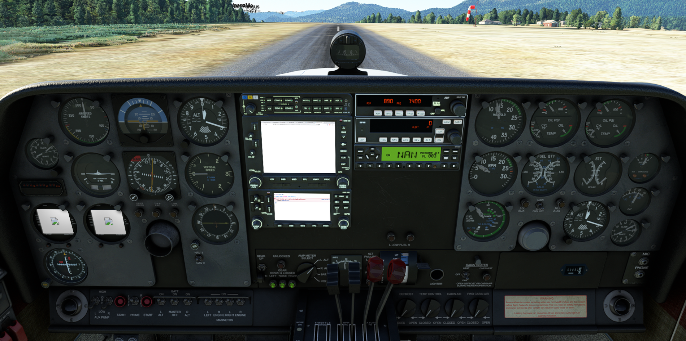


To allay any concerns: this is not about running JavaScript software to control an actual aircraft.

​	**_That would kill people_**.

Instead, we're writing a web page that can control an autopilot running in JS that, in turn, controls a little virtual aeroplane. And by "little" I actually mean "most aeroplanes in [Microsoft Flight Simulator 2020](https://www.flightsimulator.com/)" because as it turns out, MSFS comes with an API that can be used to both query *_and set_* values ranging from anything as simple as cockpit lights to something as complex as spawning a fleet of aircraft and making them fly in formation while making their smoke pattern spell out the works of Chaucer in its original middle English.

While we're not doing that (...today?), we *_are_* going to write an autopilot for planes that don't have one, as well as planes that do have one but that are just a 1950's chore to work with, while also tacking on some functionality that just straight up doesn't exist in modern autopilots. The thing that lets us perform this trick is that MSFS comes with something called [SimConnect](https://docs.flightsimulator.com/html/Programming_Tools/SimConnect/SimConnect_SDK.htm), which is an SDK that lets people write addons for the game using C, C++, or languages with .NET support... and so, of course, folks have been writing connectors to "port" the SimConnect call functionals to officially unsupported languages like Go, Node, Python, etc.

Which means that we could, say, write a web page that allows us to see what's going on in the game. And toggle in-game settings. And --and this is the one that's the most fun-- _fly the plane_ from a web page. And once we're done, it'll be that easy, but the road to get there is going to take a little bit of prep work... some of it tedious, some of it weird, but all of it's going to set us up for just doing absolutely ridiculous things and at the end of it, we'll have a fully functional autopilot _with auto-takeoff and flight planning that's as easy as using google maps_ and whatever's missing, you can probably bolt on yourself!

Before we get there though, let's start at the start. If the idea is to interface with MSFS from a webpage, and webpages use JS, then your first thought might be "Cool, can I write an [express](https://expressjs.com/) server that connects to MSFS?" to which the answer is: yes! There is the [node-simconnect](https://www.npmjs.com/package/node-simconnect) package for [Node](https://nodejs.org), which implements full access to the SimConnect DLL file, but it's very true to the original C++ SDK, meaning it's a bit like "programming C++ in JavaScript". Now, you might like that (I don't know your background) but JS has its own set of conventions that don't really line up with the C++ way of doing things, and because I know my way around programming I created a somewhat more "JavaScripty" API on top of node-simconnect called [msfs-simconnect-api-wrapper](https://www.npmjs.com/package/msfs-simconnect-api-wrapper) (I am *_great_* at naming things) which lets me (and you!) write code that can talk to MSFS in a way that looks and feels much more like standard JavaScript, so... let's use that!

Also, because we want to talk "from the browser to a game", we don't really want to have to rely on HTML GET and POST requests, because they're both slow, and unidirectional: the game will never be able to talk to us unless it's to answer a question we sent it. That's not great, especially not if we want to register event handlers, so instead we'll use [web sockets](https://developer.mozilla.org/en-US/docs/Web/API/WebSockets_API), which let us set up a persistent bidirectional data connection And to make that a trivial task, we'll use the [express-ws](https://github.com/HenningM/express-ws) package to bolt websockets onto our express server: just use `app.ws(....)` on the server in the same way we'd use `app.get(...)` or `app.post()`, with a plain Websocket in the browser, and things _just work_.

If that sounds cool: you can check out the complete project over on the ["Are we flying?"](https://github.com/Pomax/are-we-flying) Github repository, but if you want to actually learn something... let's dive in!

We'll be tackling this whole thing in four parts:

1. The first part will cover the prep work we need to do to set up a working system of MSFS, a SimConnect API server for communicating to and from MSFS, and a web server that hosts a webpage and takes care of communicating to and from the API server.
2. The second part will cover the web page where we're going to visualize everything we can about our flights in MSFS, including graphs that plot the various control values over time, to get a better insight into how an aeroplane responds to control inputs.
3. The third part will cover the thing you came here for: writing our own autopilot (in several stages of complexity) and make our computer fly planes all on its own!
4. The fourth part will cover the thing you didn't realize you came here for: taking everything we've done and turning it into a google maps style autopilot, where we just tap a few places we want to pass over, and then with the plane still sitting on the runway, click "take off" and then enjoy the ride.

And by the time we're done, we'll have something that looks a little bit like this:

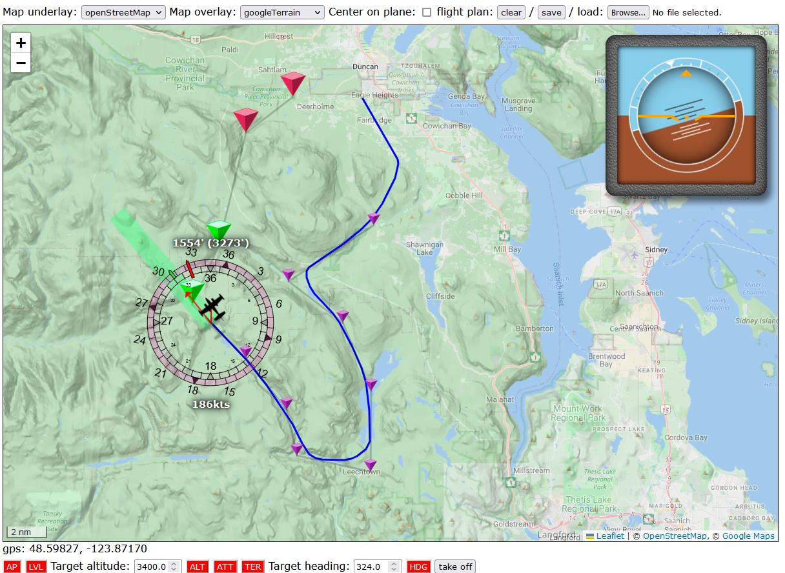

And we'll just be a passenger on a JavaScript-powered flying tour that starts with pressing one button with the plane waiting on the runway. We're going to learn things.

# Table of Contents

- [Part one: The prep work](#part-one-the-prep-work)
  - [Creating an API that talks to MSFS using SimConnect](#creating-an-api-that-talks-to-msfs-using-simconnect)
  - [Creating a web server to connect to our API](#creating-a-web-server-to-connect-to-our-api)
  - [Making a web page](#making-a-web-page)
  - [Implementing the messaging protocol](#implementing-the-messaging-protocol)
    - [Implementing the MSFS interfacing functionality](#implementing-the-msfs-interfacing-functionality)
    - [Updating the web server](#updating-the-web-server)
    - [Updating our web page](#updating-our-web-page)
    - [Adding write protection](#adding-write-protection)
    - [Testing our code](#testing-our-code)
- [Part two: visualizing flights](#part-two-visualizing-flights)
  - [Checking the game data](#checking-the-game-data)
  - [Putting our plane on the map](#putting-our-plane-on-the-map)
  - [Recording our flight path](#recording-our-flight-path)
  - [Rolling the plane](#rolling-the-plane)
  - [Plotting flight data](#plotting-flight-data)
- [Part three: writing an autopilot](#part-three-writing-an-autopilot)
  - [Hot-reloading to make our dev lives easier](#hot-reloading-to-make-our-dev-lives-easier)
  - [How does an autopilot work?](#how-does-an-autopilot-work)
    - [The backbone of our Autopilot code: constrain-mapping](#the-backbone-of-our-autopilot-code-constrain-mapping)
  - [Implementing cruise control](#implementing-cruise-control)
    - [LVL: level mode](#lvl-level-mode)
    - [ALT: altitude hold](#alt-altitude-hold)
    - [Testing our code](#testing-our-code-1)
      - [Adding autopilot buttons to our web page](#adding-autopilot-buttons-to-our-web-page)
      - [De Havilland DHC-2 “Beaver”](#de-havilland-dhc-2-beaver)
      - [Cessna 310R](#cessna-310r)
      - [Beechcraft Model 18](#beechcraft-model-18)
      - [Douglas DC-3](#douglas-dc-3)
      - [Top Rudder Solo 103](#top-rudder-solo-103)
  - [A basic autopilot](#a-basic-autopilot)
    - [HDG: flying a heading](#hdg-flying-a-heading)
    - [ALT: changing altitudes on the fly](#alt-changing-altitudes-on-the-fly)
    - [Testing our code again](#testing-our-code-again)
      - [Top Rudder Solo 103](#top-rudder-solo-103-1)
      - [De Havilland DHC-2 “Beaver”](#de-havilland-dhc-2-beaver-1)
      - [Cessna 310R](#cessna-310r-1)
      - [Beechcraft Model 18](#beechcraft-model-18-1)
      - [Douglas DC-3](#douglas-dc-3-1)
  - [A fancy autopilot](#a-fancy-autopilot)
    - [Auto throttle](#auto-throttle)
    - [Using waypoints](#using-waypoints)
      - [The server side](#the-server-side)
      - [The client side](#the-client-side)
      - [Flying and transitioning over waypoints](#flying-and-transitioning-over-waypoints)
        - [Flight path policies](#flight-path-policies)
      - [Saving and loading flight paths](#saving-and-loading-flight-paths)
      - [Picking the right waypoint](#picking-the-right-waypoint)
    - [Testing our code](#testing-our-code-2)
      - [De Havilland DHC-2 “Beaver”](#de-havilland-dhc-2-beaver-2)
      - [Cessna 310R](#cessna-310r-2)
      - [Beechcraft Model 18](#beechcraft-model-18-2)
      - [Douglas DC-3](#douglas-dc-3-2)
- [Part four: “Let’s just have JavaScript fly the plane for us”](#part-four-lets-just-have-javascript-fly-the-plane-for-us)
  - [Terrain follow mode](#terrain-follow-mode)
    - [Working with ALOS data](#working-with-alos-data)
    - [Finishing up](#finishing-up)
    - [Testing our code](#testing-our-code-3)
      - [Top Rudder Solo 103](#top-rudder-solo-103-2)
      - [De Havilland DHC-2 “Beaver”](#de-havilland-dhc-2-beaver-3)
      - [Cessna 310R](#cessna-310r-3)
      - [Beechcraft Model 18](#beechcraft-model-18-3)
      - [Douglas DC-3](#douglas-dc-3-3)
  - [Auto takeoff](#auto-takeoff)
    - [Preflight checklist](#preflight-checklist)
    - [Runway roll](#runway-roll)
    - [Rotate/take-off](#rotatetake-off)
    - [Handoff to the autopilot](#handoff-to-the-autopilot)
    - [Testing our code](#testing-our-code-4)
  - [Auto-landing](#auto-landing)
    - [Browser experiments](#browser-experiments)
    - [Auto-landing phases](#auto-landing-phases)
    - [Finding an approach](#finding-an-approach)
    - [Getting lined up](#getting-lined-up)
    - [Landing the plane](#landing-the-plane)
      - [Getting onto the runway](#getting-onto-the-runway)
      - [Braking and steering](#braking-and-steering)
    - [Testing the code](#testing-the-code)
- [Conclusions](#conclusions)"


# Part one: The prep work

As mentioned, we're going to have to do a bit of prep work before we can start writing the fun stuff, so let's get this done. We're going to implement three things:

1. An API server that talks directly to MSFS, and accepts web socket connections that can be used by API clients to interact with MSFS,
2. a web server that serves a webpage, and accepts web socket connections from the webpage, which it can forward to the API server, and
3. a web page with some code that connects it to the API (as far as it knows) using a web socket and can show the various aspects of a flight.


In high fidelity image media, we'll be implementing this: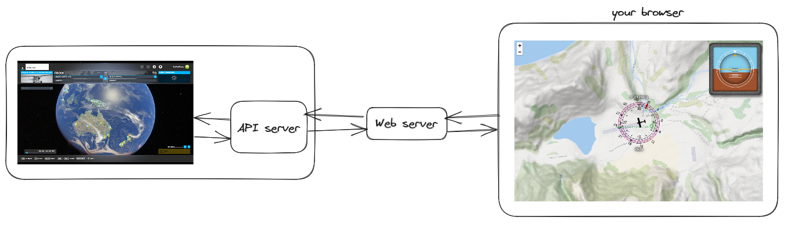

## Creating an API that talks to MSFS using SimConnect

Let's start at the start: we need something that can talk to MSFS, so let's write a quick API server! We'll be using the previously mentioned [msfs-simconnect-api-wrapper](https://github.com/Pomax/msfs-simconnect-api-wrapper) library to manage the actual "talking to MSFS" part, and we'll use [express-ws](https://www.npmjs.com/package/express-ws) to trivially bolt web socket functionality onto [express](https://www.npmjs.com/package/express), so all we need to worry about is writing an extremely minimal server.

And because we'll want some control over what ports things run on, let's first create a file called `.env` in our project root directory with the following content:

```sh
export API_PORT=8080
export WEB_PORT=3000
```

And then we can create an `api-server.js`:

```javascript
// We'll import express, the web socket extension for express, and our MSFS connector:
import express from "express";
import expressWs from "express-ws";
import { MSFS_API } from "msfs-simconnect-api-wrapper";

// We'll load in our environment variables using dotenv, which can add values from
// an .env file into Node's `process` global variable.
import dotenv from "dotenv";
dotenv.config();
const PORT = process.env.API_PORT;

// Next up, our express server, with web socket extension:
const app = express();
expressWs(app);

// Then we create an instance of the MSFS connector
const api = new MSFS_API();

// And finally, a list of connected clients (initially empty, of course) with a broadcast function.
const clients = [];
const broadcast = (action, data) => clients.forEach(socket => socket.json(action, data));

// The only thing this API server will accept is web socket connections, on the root URL:
app.ws("/", function (socket) {
  // When a client connects, save its socket connection to the client list:
  clients.push(socket);

  // And make sure to remove it from the list again when this socket disconnects:
  socket.on("disconnect", () => {
    let pos = clients.findIndex((e) => e === socket);
    if (pos > -1) clients.splice(pos, 1);
  });

  // Then, extend the socket with a convenent "socket.json()" function, similar
  // to the standard express `res.json()` function, but then for web sockets.
  socket.json = (action, data) => socket.send(JSON.stringify({ action, data }));

  // And then we start listening for messages being sent through this connection
  socket.on("message", async (msg) => {
    const { eventName, detail } = JSON.parse(msg.toString("utf-8"));

    // ...we will be adding more code here as needed...
  });

  // Also, if the API is connected to MSFS, let the client know as part of accepting the connection:
  if (api.connected) socket.json(`event`, { eventName: `MSFS` });
});

// We can now start up our server:
app.listen(PORT, () => {
  console.log(`Server listening on http://localhost:${PORT}`);
  // And we can ask the MSFS connector to connect to the game.
  api.connect({
    // We'll let it retry as many times as it needs,
    retries: Infinity,
    // with a 5 second interval between retries,
    retryInterval: 5,
    // and once connected, it should send any client a message
    // that tells it that MSFS is up and running, and the API
    // is connected to it:
    onConnect: () {
      console.log(`Connected to MSFS`);
      broadcast(`event`, { eventName: `MSFS` });
      // Then as last step, we register for the pause/unpause event. We won't need that information
      // right now, but we'll need it to pause and unpause the autopilot code once we add that!
      api.on(SystemEvents.PAUSED, () => broadcast(`event`, { eventName: `PAUSED` }));
      api.on(SystemEvents.UNPAUSED, () => broadcast(`event`, { eventName: `UNPAUSED` }));
    }
  });
});
```

We'll build this out a bit more as we go along, because right now we can establish web socket connections, but not much is going to happen without any code to handle message parsing. For now, though, this'll do nicely: let's try to establish that connection!

## Creating a web server to connect to our API

We already know how to set up a web server, because we literally just wrote one, so let's just do that again! But this time with some static asset hosting (for serving an index page with a stylesheet and JS).

> **"Hold up, why don't we just put this in our API server?"** - you, hopefully

That's a good question: web pages can run just about anywhere, but in order for our API server to work with MSFS in a performant manner, we want to have it run on our own computer. That comes with risks: we don't want other people to be able to just look at their browser's network tab and copy our IP address to then do all kinds of fun things with.

Perhaps I should put "fun" in quotes...

_**Those things tend to not be fun at all.**_

Instead, we only want people to be able to see the IP address of the web server that's serving up our web page, wherever we're running that, so that as far as the web page knows, it's only communicating with its own server. We can then give that server our IP address as a server side secret, and have it connect to our API server on our personal machine, without the web page, and thus anyone looking at the webpage, knowing what our personal IP address is. So while this is an extra step, it's thankfully a pretty small one, but an absolutely necessary one.

So let's write another basic web server:

```javascript
import express from "express";
import expressWs from "express-ws";

// In addition to express-ws, we also want the standard WebSocket object, because this server isn't
// just going to accept web socket connections, it also needs to, itself, connect using a web socket.
import WebSocket from "ws";

import dotenv from "dotenv";
dotenv.config();
const PORT = process.env.WEB_PORT ?? 3000;
const API_PORT = process.env.API_PORT ?? 8000;
const API_SERVER_URL = process.env.API_SERVER ?? `http://localhost:${API_PORT}`;

// The important part for letting web pages talk to our API server:
const webSocketProxy = {
    api: false,
    clients: []
};

// Since we'll be blanket-forwarding data, we don't need a broadcast function that
// taps into socket.json(). Instead, we just straight up "send bytes on as a string".
const proxy = (data) => webSocketProxy.clients.forEach(socket => socket.send(data.toString("utf-8")));

// Then we define our server:
const app = express();
expressWs(app);

// We'll put all our static assets (html, css, js, images, etc) in a directory called "public".
app.use(express.static(`./public`));

// And when people load the root URL, they should be moved over to our index.html instead.
app.get(`/`, (_, res) => res.redirect(`/index.html`));

// Then, our web socket connection handler:
app.ws("/", (socket) => {
  webSocketProxy.clients.push(socket);
  // When a web page sets up a web socket connection, send whatever it sends to us straight on to the API server:
  socket.on(`message`, (bytes) => webSocketProxy.api?.send(bytes.toString("utf-8")));
  // And let them know the connection's "good to go" if the API is already available:
  if (webSocketProxy.api) socket.send(`connected`);
  console.log(`Client socket established.`);
});

// Then we can start up the web server.
app.listen(PORT, () => {
  console.log(`Server listening on http://localhost:${PORT}`);
  // And of course, connect ourselves to the API server:
  setupAPISocket();
});

async function setupSocket() {
  try {
    // Try to establish a web socket connection:
    await fetch(API_SERVER_URL);

    let socket = new WebSocket(API_SERVER_URL.replace(`http`, `ws`));

    socket.on(`open`, () => {
      console.log("API Server socket established");
      webSocketProxy.api = socket;
      webSocketProxy.api.on(`message`, (msg) => proxy(msg));
      proxy(`connected`);
    });

    socket.on(`close`, () => {
      socket.close();
      webSocketProxy.api = undefined;
      proxy(`disconnected`);
      console.log(`going back into wait mode`);
      setupSocket();
    });
  } catch (error) {
    error = JSON.parse(JSON.stringify(error));
    const { code } = error.cause;

    // If we were unable to establish a web socket connection,
    // the API server might just not be running (yet), so retry
    // the connection 5 seconds from now.
    if (code === `ECONNREFUSED`) {
      console.log(`no API server (yet), retrying in 5 seconds`);
      setTimeout(setupSocket, 5000);
    }

    // If a different kind of error occurred, we should probably stop
    // trying to connect, because something unexpected is happening.
    else { console.error(error); }
  }
}
```

## Making a web page

We now have an API server and a web server, which means that last bit we need is a web _page_. We're just going to make this a page that, for now, has no real UI, but _will_ have enough JS in place to talk to the API server (by proxy), in a way that we can verify using the developer tools' "console" tab:

```html
<!DOCTYPE html>
<html>
  <head>
    <meta charset="utf-8" />
    <title>Are we flying?</title>
    <link rel="stylesheet" href="style.css" />
    <script src="index.js" async defer></script>
  </head>
  <body>
    <h1>Are we flying?</h1>
    <ul id="questions">
      <!-- we'll fill this in later -->
    </ul>
    <div id="map">
      <!-- we'll fill this in later, too -->
    </div>
  </body>
</html>
```

This obviously does nothing special other than loading a stylesheet:

```css
/* Don't worry, this won't stay empty foever */
```

And a simple `index.js` that sets up a web socket connection to our web server:

```javascript
let socket;
const noop = () => {};

// Define a function for connecting to the "API serer" (since the web page should not
// need to know or care about the fact that it's not *directly* connected to the API)
function connectAPI(url, { onOpen = noop, onMessage = noop }) {
  // Create a web socket
  socket = new WebSocket(url);
  // Make sure the onopen event handler that we got as function argument gets triggered:
  socket.onopen = () => onOpen(socket);
  // Then, just as before, we extend the socket with a convenient `socket.json()` function:
  socket.json = (action, data) => socket.send(JSON.stringify({ action, data }));
  // And we set up message handling for when the server sends us data:
  socket.onmessage = (evt) => {
    try {
      const { eventName, detail } = JSON.parse(evt.data);
      onMessage(eventName, detail);
    } catch (e) {
      // Remember: JSON.parse *can and will* throw, so always wrap it in a try/catch.
      console.error(`JSON parse error for`, evt.data);
    }
  };
}

// Then we kick everything off by running the above function:
connectAPI(`/`, {
  onOpen: (_socket) => {
    console.log(`Connected to the server with a websocket`);
    socket = _socket;
  }
});
```

## Implementing the messaging protocol

We wrote an API server, as well as a web socket proxy server, and we created a web page that knows how to set up a web socket... so let's close the loop: let's add the bits that actually let us "do things" so we can run this code and verify we can talk to MSFS from our web page, and vice versa.

First, let's update our API server to making sure we can deal with the various things we want to do:

1. get and set in-game values,
2. register as event listener for MSFS events,
3. obviously, also _un_-register as event listener, and finally
4. trigger events in MSFS (because some things happen by setting variables, whereas other things happen by "triggering" them)

### Implementing the MSFS interfacing functionality

So let's fill in our message handing:

```javascript
// We'll set up a very simple named-event tracker
const eventTracker = {};

// And a convenience function for parsing socket messages
const parseMessage = (json) => {
  try {
    return JSON.parse(json.toString("utf-8"));
  } catch (e) {}
  return {};
};

...

app.ws("/", function (socket) {

  ...

  socket.on("message", async (msg) => {
    const { connected } = api;
    if (!connected) return;

    // Unpack our message:
    const { action, data } = parseMessage(msg);
    const { requestID, simvars, eventName, value } = data;

    // We implement a `get` that gets values from the API, and sends the response as an `update` message:
    if (action === `get`) socket.json(`update`, { requestID, simvars: await api.get(...simvars) });

    // And a corresponding `set` that sets values using the API:
    if (action === `set`) Object.entries(simvars).forEach(([key, value]) => api.set(key, value));

    // Plus that odd `trigger` function:
    if (action === `trigger`) api.trigger(eventName, value);

    // MSFS event listening is a little bit more work. We tie it to a `register` call:
    if (action === `register`) {
      // define a new event tracker entry for this event name if we didn't already have one:
      const tracker = (eventTracker[eventName] ??= {
        listeners: [],
        value: undefined,
        off: undefined,
        send: (socket, noCheck = false) => {
          if (noCheck || tracker.value !== undefined) {
            socket.json(`event`, {
              eventName,
              result: tracker.value,
            });
          }
        },
      });

      // then, is this for our own "MSFS" event, which exists to indicate that the API is connected to MSFS?
      if (eventName === `MSFS`) {
        console.log(`sending MSFS event`);
        return socket.json(`event`, { eventName: `MSFS` });
      }

      // If not, quick check: is this client already registered for this event?
      if (tracker.listeners.includes(socket)) {
        console.log(
          `Ignoring ${eventName} registration: client already registered. Current value: ${tracker.value}`
        );
        return tracker.send(socket);
      }

      // They're not, so register the event with the MSFS API and save the corresponding off() function:
      console.log(`adding event listener for ${eventName}`);
      tracker.listeners.push(socket);
      if (!tracker.off) {
        console.log(`registering event listener with the simconnect wrapper`);
        tracker.off = api.on(SystemEvents[eventName], (...result) => {
          tracker.value = result;
          tracker.listeners.forEach((socket) => tracker.send(socket, true));
        });
      }

      // and if this event already has previously cached data, immediately send that out.
      tracker.send(socket);}
    }

    // And of course we can't forget to define a `forget` message.
    if (action === `forget`) {
      eventTracker[eventName].listeners--;
      if (eventTracker[eventName].listeners === 0) {
        console.log(`dropping event listener for ${eventName}`);
        eventTracker[eventName].off();
        delete eventTracker[eventName];
      }
    }
  });
});
```

And that should cover the API server updates! ...Except not quite, because let's consider what happens when there are multiple clients connected to the API.

If we have several people that are all "watching" our flight, then we don't want every single one of their web pages to send `get` requests that go through to MSFS: that's not what SimConnect was designed for, and would either overwhelm the game and lower our framerate, or it would overwhelm Node's event listener pool, and might even crash our API server. Both of those are bad, so what we really want is for the API server to have some kind of query cache with an expiration time that keeps the data up to date, but only runs a single MSFS call even if there are twenty requests for that data in rapid succession.

Let's update the `get` handling based on those needs:

```javascript
import { createHash } from "crypto";
...
const resultCache = {};
...
app.ws("/", function (socket) {
  ...
  socket.on("message", async (msg) => {
    const now = Date.now();

    ...

    if (action === `get`) {
      // Create a key for this collection of simvars by hashing the list of variable names to a single 160 bit number:
      let key = createHash("sha1").update(simvars.join(`,`)).digest("hex");

      // Then create a cache entry (if we don't have one) for this key:
      if (!resultCache[key]) resultCache[key] = { expires: now };

      // Then, (re)fill the entry if its caching timeout has expired:
      if (resultCache[key]?.expires <= now === true) {
        // Set the new expiry for 100ms from now.
        resultCache[key].expires = now + 100;
        // Then make the data for this entry a promise that everyone can await
        resultCache[key].data = new Promise(async (resolve) => {
          try {
            const result = await api.get(...simvars);
            resolve(result);
          } catch (e) {
            console.warn(e);
            resolve({});
          }
        });
      }

      // And then wait for the cache entry's data to be "real data":
      const result = await resultCache[key].data;
      socket.json(`update`, { requestID, simvars: result });
    }
    ...
  }
}
```

That's a ***lot*** more code than before, but at least now if we get two, or five, or twenty clients, all of them get their values from our cache instead of every single one of them sending requests to the game. We use a 100ms cache timeout, which is low enough that we can still get accurate information, but high enough so that twenty calls in rapid succession only have one real call to MSFS, and nineteen cache retrievals instead.

### Updating the web server

The proxy doesn't need any further work, it's already perfect: all it needs to do is sit between the API server and web page, and relay messages, so it doesn't actually care what those messages are, and neither the API server nor the web page should even be aware of its existence.

### Updating our web page

That leaves our the web page javascript. In the previous section where we implemented our client-side API handler, we had a `connectAPI` function that we passed an `onopen` property, but not an `onmessage` property, so let's update that. We'll put all our client-side API related code in its own file called `api.js`, and make that an ES module so that we can import functions from it as needed.

```javascript
let socket;
let connected = false;
const eventHandlers = {};
const messageHandlers = [];
const noop = () => {};
const uuid = () => `${Date.now()}-${`${Math.random()}`.substring(2)}`;

export function isConnected() {
  return connected;
}

export async function connectAPI(url, props) {
  const {
    onOpen = noop,
    onError = noop,
    onClose = noop,
    onMessage = noop,
    onConnect = noop,
    onDisconnect = noop,
  } = props;

  // Can we even call our server? (Because servers can crash!)
  try {
    await fetch(url.replace(`ws`, `http`));
  } catch (e) {
    return onError();
  }

  // If we can, set up our web socket:
  socket = new WebSocket(url);

  // With our .json() function:
  socket.json = (action, data) => socket.send(JSON.stringify({ action, data }));

  // And the onOpen handling:
  socket.onopen = onOpen;

  // The onClose is new, and just "blanks" the socket so that the code that uses it still "works", but doesn't do anything:
  socket.onclose = function () {
    socket = { send: noop, json: noop };
    onClose();
  };

  // And then we fill in our message handler:
  socket.onmessage = ({ data: evtData }) => {
    // First, the "plain test" messages:
    if (evtData === `connected`) {
      connected = true;
      return onConnect();
    } else if (evtData === `disconnected`) {
      connected = false;
      return onDisconnect();
    }

    // Then, our action+data messages. And remember that JSON.parse can
    // and will throw exceptions, so have a try/catch in place:
    try {
      const { action, data } = JSON.parse(evtData);

      // And it's also good to wrap event handling in try/catch blocks,
      // so that any errors that might occur don't crash your program!
      try {
        if (action === `event`) {
          const { eventName, result } = data;
          eventHandlers[eventName]?.forEach((fn) => fn(result));
        } else {
          messageHandlers.forEach(({ handler }) => handler(action, data));
        }
      }
      // notify us of any errors, but keep running.
      catch (e) console.error(`Error trying to handle ${action}:`, e);
    }
    // if JSON parsing failed, write the data to the console so we can debug.
    catch (e) console.error(`JSON parse error for:`, evt.data);
  };

  // If there is a custom message handler function in the props, we also make sure
  // to save it in our list of custom message handlers, so that it will get called
  // with the original action/data pair whenever a message comes in.
  if (onMessage !== noop) messageHandlers.push({ requestID: 1, handler: onMessage });
}
```

That takes care of our connection function, but we also want some way to call `get`, `set`, etc., so we also add the following code:

```javascript
// This function will return a promise, and so is effectively an async function that can be `await`ed
export function get(...simvars) {
  return new Promise((resolve) => {
    // value requests are tied to "request identifiers", since we're not calling
    // a remote function directly, but passing a message requesting some data.
    // In order to know whether a reply is for "this" request, we can check whether
    // the request identifier matches, and if so, we got our result(s).
    const requestID = uuid();

    // create a result handle specifically for this request identifier:
    const handler = (action, data) => {
      if (action === `update` && data.requestID === requestID) {
        // If this is "our" data, we can remove this result handler from the list of handlers.
        const pos = messageHandlers.findIndex((e) => e.requestID === requestID);
        messageHandlers.splice(pos, 1);
        // And then we (asynchronously) return the result
        resolve(data.simvars);
      }
    };

    // Save this request's result handler...
    messageHandlers.push({ requestID, handler });

    // ...and then fire off our GET request to the API server.
    socket.json(`get`, { requestID, simvars });
  });
}

// The "set" function is a lot simpler, because it's a "set and forget" operation:
export function set(propName, value) {
  socket.json(`set`, { simvars: { [propName]: value } });
}

// The same is true for the "trigger" functionality:
export function trigger(eventName, value) {
  socket.json(`trigger`, { eventName, value });
}

// Event listening is basically a standard JS addEventListener call:
export function addEventListener(eventName, handler) {
  // We save our event handler, tied to the event name, and the "on message"
  // behaviour we specified in connectAPI will do the rest for us.
  eventHandlers[eventName] ??= [];
  eventHandlers[eventName].push(handler);
  socket.json(`register`, { eventName });
}

// And similarly, removeEventListener is what you'd expect:
export function removeEventListener(eventName, handler) {
  if (!eventHandlers[eventName]) return;
  const pos = eventHandlers[eventName].indexOf(handler);
  if (pos === -1) return;
  eventHandlers[eventName].splice(pos, 1);
  // And if there are no more event handlers registered, tell
  // the server that we're no longer interested in this event.
  if (eventHandlers[eventName].length === 0) {
    socket.json(`forget`, { eventName });
  }
}
```

And then we update our `index.js` to make use of that module:

```javascript
import * as API from "./api.js";

// Our connection is to the same URL as the webpage lives on, but with
// the "ws" protocol, and without the "index.html" part:
const WEBSOCKET_URL = window.location.toString().replace(`http`, `ws`).replace(`index.html`, ``);

// And we define a little helper function for trying to connect to the API:
function tryConnection() { API.connect(WEBSOPCKET_URL, props); }

// There's a bunch of things that we'll want to hook into:
const props = {
  onOpen: async () => {
    console.log(`Socket to proxy established`);
  },
  onClose: async () => {
    console.log(`Proxy disappeared... starting reconnect loop`);
    setTimeout(tryConnection, 5000);
  },
  onError: async () => {
    console.log(`No proxy server, retrying in 5 seconds`);
    setTimeout(tryConnection, 5000);
  },
  onConnect: async () => {
    console.log(`connected to API server!`);
    API.addEventListener(`MSFS`, () => console.log(`MSFS is up and running!`));
  },
  onDisconnect: async () => {
    console.log(`disconnected from API server`);
  },
};

// Just so we can have some fun, let's expose our client-side API object as a global:
globalThis.MSFS = API;

// And with all that covered, let's go!
tryConnection();
```

### Adding write protection

That just leaves one last thing: making sure everyone can _read_ values, but that only we get to _write_ values. You don't want someone just randomly messing with your flight! In order to do that, we first add a new key to our `.env`  file:

```sh
export API_PORT=8080
export WEB_PORT=3000
export FLIGHT_OWNER_KEY=FOK-12345
```

Super secure! Of course, when we make our web page available, we'll want to make triple-sure that we change this key to something only we know =)

Then, we  update our api server so that we can ask it to authenticate us:

```javascript
...

import dotenv from "dotenv";
dotenv.config();
const { API_PORT: PORT, FLIGHT_OWNER_KEY } = process.env;

...

app.ws("/", function (socket) {
  ...
  socket.on("message", async (msg) => {
    const { connected } = api;
    if (!connected) return;

    const { action, data } = JSON.parse(msg.toString("utf-8"));
    const { requestID, simvars, eventName, value } = data;
    const { __has_write_access: hasWriteAccess } = socket;

    if (action === `authenticate`) {
      // Did this client provide the correct flight owner key?
      if (data.flight_owner_key !== FLIGHT_OWNER_KEY) return;
      // If they did, mark them as having write access.
      socket.__has_write_access = true;
    }}

    ...

    // Does this client have write access? If not, ignore any "set" requests.
    if (action === `set` && hasWriteAccess) {
      Object.entries(simvars).forEach(([key, value]) => api.set(key, value));
    }

    // Same here: is this client allowed to trigger things in-game?
    if (action === `trigger` && hasWriteAccess) {
      console.log(`Triggering sim event ${eventName}`);
      api.trigger(eventName, value);
    }

    ...
  });
}
```

We then add a route to our webserver that exposes this value _if it is set in the `.env` file_, which will be true while we're running everything on one computer, but not when we eventually run our web server somewhere on the internet, so that locally we can expose this flight owner key, but when hosting things "for real", we don't:

```javascript
...
app.use(express.static(`../public`));
app.get(`/`, (_, res) => res.redirect(`/index.html`));
app.get(`/fok`, (_, res) => res.send(process.env.FLIGHT_OWNER_KEY));
...
```

We can now look up the flight owner key using http://localhost:3000/fok and if there is one set, we'll get it, and if there isn't, that'll be an empty page.

That just leaves updating our `index.js` to make sure it sends the authentication call:

```javascript
...
connectAPI(`/`, {
  onopen: async (_socket) => {
    console.log(`Connected to the server with a websocket`);
    socket = _socket;
    const flightOwnerKey = localStorage.getItem(`flight-owner-key`) ?? await fetch(`./fok`).then(t => t.text()));
    if (flightOwnerKey) socket.json(`authenticate`, { flight_owner_key: flightOwnerKey})
  }
});
```

This code will check to see if we saved a flight owner key into our browser's [localStorage](https://developer.mozilla.org/en-US/docs/Web/API/Window/localStorage), and if it can't find one, it'll try our `/fok` route to see if there's a value there that it can use. If there is, we send an  `authenticate` message with our key in order to unlock write access.

Now, the astute may have noticed that this isn't really secure, because someone could just listen to our web socket communication and get the key that way: they'd be right. In order to combat that we want encrypted communication, and we could either do that by explicitly setting up express as an `https` server with explicit code that points to an SSL certificate, or we could place our server behind something like [Apache](https://httpd.apache.org/), [NGINX](https://www.nginx.com/), or [Caddy](https://caddyserver.com/), and have those act as reverse proxies to take care of the `https` part without us having to modify our own code. I would recommend the latter.

So, with all that, we have our full loop:

1. we can start up MSFS,
2. we can start up our API server,
3. we can start up our web server,
4. we can load up http://localhost:3000 in the browser, and
5. we can get values from MSFS (without authenticating) and set values in MSFS (but only after authenticating)

### Testing our code

With all of our steps covered, we now have a webpage that connects to the API server (by proxy), and if we open our developer tools and we select the "console" tab, we can verify that our web page can talk to MSFS, and vice versa. For instance, if we want to know some of our plane properties, we could call this:

```javascript
» await MSFS.get(
  `CATEGORY`,
  `DESIGN_CRUISE_ALT`,
  `DESIGN_TAKEOFF_SPEED`,
  `ENGINE_TYPE`,
  `IS_TAIL_DRAGGER`,
  `NUMBER_OF_ENGINES`,
  `TITLE`,
  `TOTAL_WEIGHT`,
  `TYPICAL_DESCENT_RATE`,
  `WING_SPAN`,
);
```

And we should get all the relevant info. For instance, if we started a flight in the De Havilland DHC-2 "Beaver", we might get the following response:

```javascript
« ▼ Object {
  "CATEGORY": "Airplane",
  "DESIGN_CRUISE_ALT": 5000,
  "DESIGN_TAKEOFF_SPEED": 65,
  "ENGINE_TYPE": 0,
  "IS_TAIL_DRAGGER": 1,
  "NUMBER_OF_ENGINES": 1,
  "TITLE": "Blackbird Simulations DHC-2 Beaver Wheels N93E",
  "TOTAL_WEIGHT": 3954.932373046875,
  "TYPICAL_DESCENT_RATE": 16.66666666666665,
  "WING_SPAN": 48
}
```

Of course, none of these things have units, but that's what the [SimConnect documentation](https://docs.flightsimulator.com/html/Programming_Tools/SimVars/Simulation_Variables.htm) is for: the Beaver is designed to cruise at 5000 feet, take off at 65 knots, it has a two wheels up front and a little wibble wheel at the back (i.e. it's a "tail dragger"), it has one engine, which is a piston propeller (which we know by looking up the enum for engine type); it weighs 3955 pounds, has a wing span of 48 feet, and has a typical descent rate of 16.667 feet per second.

And of course, we can also ask for information that's relevant to our flight _right now_ rather than just asking about the plane in general:

```javascript
» await window.MSFS.get(
  `AIRSPEED_INDICATED`,
  `ELEVATOR_TRIM_PCT`,
  `PLANE_ALT_ABOVE_GROUND`,
  `PLANE_ALTITUDE`,
  `PLANE_BANK_DEGREES`,
  `PLANE_HEADING_DEGREES_GYRO`,
  `PLANE_LONGITUDE`,
  `PLANE_LATITUDE`,
  `VERTICAL_SPEED`,
);
```

This might give us something like:

```javascript
« ▼ Object {
  "AIRSPEED_INDICATED": 139.7057647705078,
  "ELEVATOR_TRIM_PCT": -0.33069596466810336,
  "PLANE_ALT_ABOVE_GROUND": 573.1917558285606,
  "PLANE_ALTITUDE": 996.7162778193412,
  "PLANE_BANK_DEGREES": -0.001284847042605199,
  "PLANE_HEADING_DEGREES_GYRO": 4.539803629684118,
  "PLANE_LONGITUDE": -2.1609759665698802,
  "PLANE_LATITUDE": 0.8514234731618152,
  "VERTICAL_SPEED": 0.3496674597263333
}
```

This tells us our plane is flying over Vancouver Island at GPS coordinates -123.814803 longitude, 48.782971 latitude (both values reported in degrees radians by MSFS, not decimal degrees), with an air speed of about 140 knots (which is around 260kmh/161mph), flying at an altitude of almost 1000 feet (305m) above sea level, but really only about 573 feet (174m) above the ground. We can see that we're flying fairly straight (our "bank" angle is basically 0), with a heading of 260 degrees on the compass (given in radians again), and we can see that we're flying fairly straight in the vertical sense, too: the plane is currently moving up at about a third of a foot per second (so about 4", or 10cm, per second), which is well within "flying straight" limits.

We can trigger events, too:

```javascript
» await MSFS.get(`TAILWHEEL_LOCK_ON`);
» MSFS.trigger(`TOGGLE_TAILWHEEL_LOCK`);
» await MSFS.get(`TAILWHEEL_LOCK_ON`);
```

Which should result in:

```javascript
« ▼ Object {
  "TAILWHEEL_LOCK_ON": 0
}
« undefined
« ▼ Object {
  "TAILWHEEL_LOCK_ON": 1
}
```

And of course, we can listen for events. For example, we can write this:

```javascript
» MSFS.on(`CRASHED`, () => console.log(`...we crashed!`))
```

And now if we point our plane towards the ground and just let gravity do the rest, eventually our flight will come to an abrupt stop (provided we have crash damage turned on, of course). The MSFS screen will go black, and we'll get a little dialog telling us that we crashed... but if we look at the dev tools console for our web page, we'll also see this little gem:

```javascript
...we crashed!
```

Which means our crash event listener worked. So this is promising, we have a full loop, time to actually _use_ this for something!

# Part two: visualizing flights

Before we try to automate flight by writing an autopilot, it helps if we can know what "a flight" is, in that it'd be good to know what our plane is doing and how it's responding to control inputs. So before we get to the best part three, part two is going to be about building out our web page so that we get some insight into our plane's behaviour.

## Checking the game data

We know when we're connected to MSFS, so let's write a few functions that let us cascade through the various stages of the game before we get to "actually controlling a plane". Let's start with what we want that to look like:

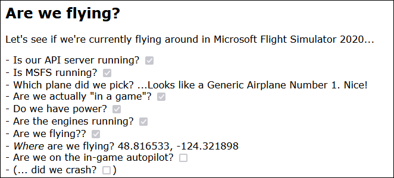

Nothing particularly fancy (although we can pretty much use any amount of CSS to turn it _into_ something fancy), but it lets us see where in the process of firing up MSFS, clicking through to the world map, and starting a flight we are. So let's update our HTML file to include these questions, and then we can update our JS to start answering them:

```html
<h1>Is Pomax flying?</h1>
<p>Let's see if Pomax is currently flying around in Microsoft Flight Simulator 2020...</p>
<ul>
  <li>Can we even tell? (is the API server running?) <input type="checkbox" disabled class="server-up"></li>
  <li>Is MSFS running? <input type="checkbox" disabled class="msfs-running"></li>
  <li>Which plane did we pick? <span class="specific-plane">... nothing yet?</span></li>
  <li>Are we actually "in a game"? <input type="checkbox" disabled class="in-game"></li>
  <li>Are the engines running? <input type="checkbox" disabled class="engines-running"></li>
  <li>Are we flying?? <input type="checkbox" disabled class="in-the-air"></li>
  <li>Are we on autopilot? <input type="checkbox" disabled class="using-ap"></li>
  <li>(... did we crash? <input type="checkbox" disabled class="plane-crashed">)</li>
</ul>
```

Excellent: boring, but serviceable, so let's move on to the JS side!

First let's write a little convenience file called `questions.js` that we're going to use to (un)check these questions:

```javascript
// A simple helper function to (un)check a checkbox
function setCheckbox(qs, val) {
  const checkbox = questions.querySelector(qs);
  if (val) checkbox.setAttribute(`checked`, `checked`);
  else checkbox.removeAttribute(`checked`);
}

// And then our (static) questions class that we're going to use to toggle all those boxes.
export const Questions = {
  serverUp(val) {
    setCheckbox(`.server-up`, val);
  },

  msfsRunning(val) {
    setCheckbox(`.msfs-running`, val);
  },

  inGame(val) {
    setCheckbox(`.in-game`, val);
  },

  modelLoaded(modelName) {
    let model = `...nothing yet?`;
    let article = `a`;
    // gotta be linguistically correct: if our aeroplane name starts with a vowel, we need to use "an", not "a":
    if ([`a`, `i`, `u`, `e`, `o`].includes(modelName.substring(0, 1).toLowerCase())) {
      article += `n`;
    }
    if (modelName) model = `...Looks like ${article} ${modelName}. Nice!`;
    questions.querySelector(`.specific-plane`).textContent = model;
  },

  enginesRunning(val) {
    setCheckbox(`.engines-running`, val);
  },

  inTheAir(val) {
    setCheckbox(`.in-the-air`, val);
  },

  usingAutoPilot(val) {
    setCheckbox(`.using-ap`, val);
  },

  planeCrashed(val) {
    setCheckbox(`.plane-crashed`, val);
  },

  resetQuestions() {
    this.inGame(false);
    this.enginesRunning(false);
    this.inTheAir(false);
    this.usingAutoPilot(false);
    this.planeCrashed(false);
    // you may notice we don't reset the model: it'll automatically update when we pick a new plane.
  },
};
```

Cool! Of course, this does nothing yet, so let's plug it into our `index.js` so that we can run through our sequence of "where in the game we are". Specifically, we're going to update our connection `props` that we use for starting our web socket connection:

```javascript
import { Questions } from "./questions.js";
import { Plane } from "./plane.js";

let plane;

const props = {
  ...
  onConnect: async () => {
    console.log(`connected to API server`);
    Questions.serverUp(true);
    addEventListenerAPI(`MSFS`, () => {
      Questions.msfsRunning(true);
      // Create a plane if we don't have one yet
      plane ??= new Plane();
      // And make sure it gets reset, whether we just built it or not.
      plane.reset();
    });
  },
  onDisconnect: async () => {
    console.log(`disconnected from API server`);
    Questions.serverUp(false);
    Questions.msfsRunning(false);
  },
};

...

connectAPI(`/`, props);
```

That's the first few questions answered, but... what's that `plane` variable? In short: it's where we're going to continue our code. We don't want a giant spaghetti mess of code, we want nicely contained code that's easy to maintain, so if MSFS is running, we build a `Plane` and then we track everything flight related in there, instead.

...in fact, let's define our plane right now!

```javascript
import { Questions } from "./questions.js";
import { getAPI, addEventListenerAPI }from "./api.js";

const DUNCAN_AIRPORT = [48.756669, -123.711434];
const INITIAL_RUNWAY_HEADING = 150;
const degrees = (v) => 180 * v / Math.PI;

const POLLING_PROPS = [
  "AILERON_TRIM_PCT",
  "AIRSPEED_TRUE",
  "AUTOPILOT_MASTER",
  "AUTOPILOT_HEADING_LOCK_DIR",
  "CRASH_FLAG",
  "CRASH_SEQUENCE",
  "ELEVATOR_TRIM_POSITION",
  "GPS_GROUND_TRUE_TRACK",
  "GROUND_ALTITUDE",
  "AUTOPILOT_HEADING_LOCK_DIR",
  "INDICATED_ALTITUDE",
  "PLANE_ALT_ABOVE_GROUND",
  "PLANE_BANK_DEGREES",
  "PLANE_HEADING_DEGREES_MAGNETIC",
  "PLANE_HEADING_DEGREES_TRUE",
  "PLANE_LATITUDE",
  "PLANE_LONGITUDE",
  "PLANE_PITCH_DEGREES",
  "SIM_ON_GROUND",
  "STATIC_CG_TO_GROUND",
  "TURN_INDICATOR_RATE",
  "VERTICAL_SPEED",
];

// We need some states so we can track where in the question list we are:
const WAIT_FOR_GAME = Symbol(`wait for in game`);
const WAIT_FOR_MODEL = Symbol(`wait for model`);
const WAIT_FOR_ENGINES = Symbol(`wait for engines`);
const POLLING_GAME = Symbol(`polling game`);

export class Plane {
  constructor() {
    console.log(`building a plane`);
    // we'll assume the location of our plane until we get that information from MSFS.
    this.state = {}
    this.lastUpdated = {
        crashed: false,
        lat: DUNCAN_AIRPORT[0],
        long: DUNCAN_AIRPORT[1]
    };
    this.sequencer = new Sequence(
        WAIT_FOR_GAME,
        WAIT_FOR_MODEL,
        WAIT_FOR_ENGINES,
        POLLING_GAME
    );
    this.eventsRegistered = false;
    this.waitForInGame();
  }

  reset() {
    this.sequencer.reset();
    this.eventsRegistered = false;
    clearEventListenersAPI();
  }

  // This function registers for the MSFS "SIM" event, and if it gets it, it knows we're in game.
  async waitForInGame() {
    this.sequencer.start();
    console.log(`wait for in-game`);

    const waitForSim = async ([state]) => {
      console.log(`wait for sim:`, state);
      if (state === 1) {
        Questions.resetPlayer();
        Questions.inGame(true);
        // of course once we're in game, we'll want to know which plane we're flying.
        this.waitForModel();
      }
    };

    addEventListenerAPI(`SIM`, waitForSim);
    addEventListenerAPI(`PAUSED`, () => (this.paused = true));
    addEventListenerAPI(`UNPAUSED`, () => (this.paused = false));
  }

  // This function creates a "Flight Model", which is a class that aggregates some 40+ values
  // all relating to the flight model, like its category, trim limits, ideal cruise speed, etc.
  async waitForModel() {
    const { sequencer } = this;
    if (sequencer.state !== WAIT_FOR_GAME) return;
    sequencer.next();

    console.log(`loading model`);
    const model = (this.flightModel = new FlightModel());
    const { title, lat, long, engineCount } = await model.bootstrap();
    Questions.modelLoaded(model.values.TITLE);

    // Once we have our aeroplane, we can put it on the map and then start waiting for the engines to be running:
    this.lastUpdate.lat = lat;
    this.lastUpdate.long = long;
    const once = true;
    this.update(once);
    this.waitForEngines(engineCount);
  }

  async waitForEngines(engineCount) {
    const { sequencer } = this;
    if (sequencer.state !== WAIT_FOR_MODEL && sequencer.state !== WAIT_FOR_ENGINES) return;
    sequencer.next();

    const results = await getAPI(...[
      `ENG_COMBUSTION:1`,
      `ENG_COMBUSTION:2`,
      `ENG_COMBUSTION:3`,
      `ENG_COMBUSTION:4`,
    ]);

    // There is no convenient event for this, so we'll just check this once per second.
    const checkEngines = async() => {
      const results = await getAPI(...engines);
      // We consider the engines to be running if any of them are running.
      for (let i=1; i<=engineCount; i++) {
        if (results[`ENG_COMBUSION:${i}`]) {
	        console.log(`engines are running`);
	        Questions.enginesRunning(true);
	        return this.startPolling();
        }
      }
      setTimeout(checkEngines, 1000);
    };

    checkEngines();
  }

  // Once the engines are running, we can start polling the game for actual flight data.
  async startPolling() {
    const { sequencer } = this;
    if (sequencer.state !== WAIT_FOR_ENGINES) return;
    sequencer.next();

    this.update();
  }

  // Every time we get an update to the game data, we update our state, our vector, and our orientation
  async update(once = false) {
    if (!once && this.sequencer.state !== POLLING_GAME) return;

    // make sure we can't call this function when it's already being called:
    if (!once && this.locked_for_updates) return;
    this.locked_for_updates = true;

    // Get all the values we want to show:
    const data = await getAPI(...POLLING_PROPS);
    if (data === null) return;

    // Update our current state, and update the web page:
    this.setState(data);
    this.updatePage(data);

    // Then schedule the next update call one second from now.
    if (!once) {
      setTimeout(() => {
        this.locked_for_updates = false;
        this.update();
      }, 1000);
    }
  }

  // our "set state" function basically transforms all the game data into values and units we can use.
  async setState(data) {
    if (data.TITLE === undefined) return;

    if (this.state.title !== data.TITLE) {
	  // Update our plane, because thanks to dev tools and add-ons, people can just switch planes mid-flight:
      Questions.modelLoaded(data.TITLE);
    }

    // start our current state object:
    this.state = {
      title: data.TITLE,
      cg: data.STATIC_CG_TO_GROUND,
    };

    // A lot of values are in radians, and are easier to work with as degrees.
    Object.assign(this.state, {
      lat: degrees(data.PLANE_LATITUDE),
      long: degrees(data.PLANE_LONGITUDE),
      airBorn: data.SIM_ON_GROUND === 0 || this.state.alt > this.state.galt + 30,
      alt: data.INDICATED_ALTITUDE,
      aTrim: data.AILERON_TRIM_PCT,
      ap_maser: data.AUTOPILOT_MASTER === 1,
      crashed: !(data.CRASH_FLAG === 0 && data.CRASH_SEQUENCE === 0),
      bank: degrees(data.PLANE_BANK_DEGREES),
      bug: data.AUTOPILOT_HEADING_LOCK_DIR,
      galt: data.GROUND_ALTITUDE,
      heading: degrees(data.PLANE_HEADING_DEGREES_MAGNETIC),
      palt: data.PLANE_ALT_ABOVE_GROUND - this.state.cg,
      pitch: degrees(data.PLANE_PITCH_DEGREES),
      speed: data.AIRSPEED_TRUE,
      trim: data.ELEVATOR_TRIM_POSITION,
      trueHeading: degrees(data.PLANE_HEADING_DEGREES_TRUE),
      turnRate: degrees(data.TURN_INDICATOR_RATE),
      vspeed: data.VERTICAL_SPEED,
      yaw: degrees(data.PLANE_HEADING_DEGREES_MAGNETIC - data.GPS_GROUND_TRUE_TRACK),
    });

    // check to see if we need to "uncrash" the plane:
    const crashed = this.state.crashed;
    if (this.lastUpdate.crashed !== crashed) {
      Questions.planeCrashed(crashed);
    }
  }

  // Our "update page" function won't do much yet, but this is where all the good stuff's going to happen.
  async updatePage(data) {
    if (paused) return;
    const now = Date.now();

    // For now, the only thing we do is answer two questions:
    const { ap_master, airBorn, speed } = this.state;
    Questions.inTheAir(airBorn && speed > 0);
    Questions.usingAutoPilot(ap_master);

    // And then we save this state so we can reference it during the next update call.
    this.lastUpdate = Object.assign({ time: now }, this.state);
  }
}
```

Whew, that's a lot of code. And we're not even done!  We also need that flight model class:

```javascript
import { getAPI } from "./api.js";

// We use this object to store a whole bunch of static properties, as well as the plane's start position.
// The code in the repo stores about 50 properties, but there are loads more that we could add.
const flightModelValues = [
   ...
  `NUMBER_OF_ENGINES`,
  ...
  `PLANE_LATITUDE`,
  `PLANE_LONGITUDE`,
   ...
  `TITLE`,
  ...
];

export class FlightModel {
  constructor(api) { this.api = api;}

  async bootstrap() {
    const values = (this.values = await getAPI(...flightModelValues));
    return {
      lat: this.values.LATITUDE,
      long: this.values.LONGITUDE,
      title: this.values.TITLE,
      engineCount: this.values.NUMBER_OF_ENGINES
    };
  }
}
```

That's decidedly less code than `plane.js` at least. Now, we still only implemented the code that lets us answer the question list, but that's hardly the only thing we'll want to see on our page. Let's add something that let's us actually _see_ something on our webpage.

## Putting our plane on the map

With access to this vast trove of flight information, we still need to do something with all that data, so let's set up a [Leaflet](https://leafletjs.com/) map that we can put our plane on, so we can see what's happening in-sim. Step one: some HTML to make that work:

```html
<div id="maps-selectors">
  Map underlay: <select class="map-layer-1"></select>
  Map overlay: <select class="map-layer-2"></select>
  <label for="center-map">Center map on plane:</label>
  <input id="center-map" type="checkbox" checked="checked">
</div>

<div id="viz">
  <div id="map" style="width: 1200px; height: 800px"></div>
  <p>GPS location: <span class="lat">0</span>, <span class="long">0</span></p>
</div>
```

And then we'll define a `map.js` that we can import and takes care of setting up the map for us:

```javascript
import { waitFor } from "./utils.js";
import { Duncan } from "./locations.js";

const DUNCAN_AIRPORT = [48.756669, -123.711434];

// Leaflet creates a global "L" object to work with, so use that to tie into the <div id="map"></div> we have sitting
// in our index.html. However, because independent page scripts can't be imported, we need to wait for it to be available:
const L = await waitFor(async() => window.L);

// With our "L" object available, ler's make a map, centered on Duncan airport:
export const map = L.map("map").setView(DUNCAN_AIRPORT, 15);

// Of course, this map won't show anything yet: it needs a map tile source. So let's define a whole slew of those!
const openStreetMap = L.tileLayer(
  `https://tile.openstreetmap.org/{z}/{x}/{y}.png`, {
    maxZoom: 19,
    attribution: `© <a href="http://www.openstreetmap.org/copyright">OpenStreetMap</a>` }
);

const googleStreets = L.tileLayer(
  `http://{s}.google.com/vt/lyrs=m&x={x}&y={y}&z={z}`, {
    maxZoom: 20,
    subdomains: ["mt0", "mt1", "mt2", "mt3"],
    attribution: `© <a href="https://www.google.com/intl/en-GB_ALL/permissions/geoguidelines/">Google Maps</a>` }
);

const googleHybrid = L.tileLayer(
  `http://{s}.google.com/vt/lyrs=s,h&x={x}&y={y}&z={z}`, {
    maxZoom: 20,
    subdomains: ["mt0", "mt1", "mt2", "mt3"],
    attribution: `© <a href="https://www.google.com/intl/en-GB_ALL/permissions/geoguidelines/">Google Maps</a>` }
);

const googleSat = L.tileLayer(
  `http://{s}.google.com/vt/lyrs=s&x={x}&y={y}&z={z}`, {
    maxZoom: 20,
    subdomains: ["mt0", "mt1", "mt2", "mt3"],
    attribution: `© <a href="https://www.google.com/intl/en-GB_ALL/permissions/geoguidelines/">Google Maps</a>` }
);

const googleTerrain = L.tileLayer(
  `http://{s}.google.com/vt/lyrs=p&x={x}&y={y}&z={z}`, {
    maxZoom: 20,
    subdomains: ["mt0", "mt1", "mt2", "mt3"],
    attribution: `© <a href="https://www.google.com/intl/en-GB_ALL/permissions/geoguidelines/">Google Maps</a>` }
);

// We'll be showing two maps at the same time, one as base layer, and one as transparant overlay:
const mapLayers = { openStreetMap, googleStreets, googleHybrid, googleSat, googleTerrain };
const activeLayers = [openStreetMap, googleTerrain];

function update() {
  Object.values(mapLayers).forEach((layer) => layer.removeFrom(map));
  const [base, overlay] = activeLayers;
  base.setOpacity(1);
  base.addTo(map);
  overlay?.setOpacity(0.5);
  overlay?.addTo(map);
}

// And because we want to be able to change those, hook into the page HTML:
[1, 2].forEach((layer) => {
  const select = document.querySelector(`.map-layer-${layer}`);

  // Add all the layers to this select element, making sure to preselect
  // the OSM and Google terrain maps in the first and second select element:
  Object.entries(mapLayers).forEach(([name, map]) => {
    const opt = document.createElement(`option`);
    opt.textContent = name;
    opt.value = name;
    if (layer === 1 && name === `openStreetMap`) opt.selected = `selected`;
    if (layer === 2 && name === `googleTerrain`) opt.selected = `selected`;
    select.append(opt);
  });

  // then, if we pick a new layer, apply that:
  select.addEventListener(`change`, (evt) => {
    activeLayers[layer - 1] = mapLayers[evt.target.value];
    update();
  });
});

// With all that done, we also hook into the "center the map on our plane" checkbox,
// with some logic so that if we click-drag the map, we uncheck that box.
const centerBtn = document.getElementById(`center-map`);
centerBtn.checked = true;
map.on('dragstart', () => (document.getElementById(`center-map`).checked = false);

// Finally, run our initial map setup and export the things other files will need.
update();
export { centerBtn, map };
```

With a brief explanation of that `waitFor` function:

```javascript
// Return a promise that doesn't resolve until `fn()` returns a truthy value
export function waitFor(fn, timeout = 5000, retries = 100) {
  return new Promise((resolve, reject) => {
    (async function run() {
      if (--retries === 0) reject(new Error(`max retries reached`));
      try {
        const data = await fn();
        if (!data) return setTimeout(run, timeout, retries);
        resolve(data);
      } catch (e) { reject(e); }
    })();
  });
}
```

And a change to our `index.js` for loading things in:

```javascript
import { map } from "./map.js";
...
```

Which gives us something that looks a little like this:

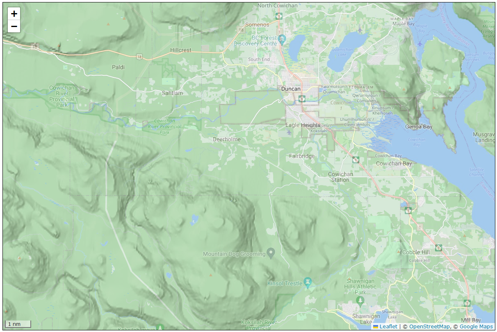

Which is pretty good, but it's lacking a certain someth- oh right our plane. Let's update our `plane.js` so that this map can actually show our plane flying around.

```javascript
import { waitFor } from "./utils.js";

...

const L = await waitFor(async () => window.L);

...

export class Plane {
  constructor(map, location, heading) {
    console.log(`building a plane`);
    this.state = {}
    this.lastUpdated = {
        crashed: false,
        heading: heading,
        lat: location[0],
        long: location[1],
    };
    this.sequencer = new Sequence(
        WAIT_FOR_GAME,
        WAIT_FOR_MODEL,
        WAIT_FOR_ENGINES,
        POLLING_GAME
    );
    this.eventsRegistered = false;
    this.addPlaneIconToMap(map, location, heading);
    this.waitForInGame();
  }

  ...

  // To add the plane to the map, we create a Leaflet icon, which lets us define
  // custom HTML, and then we create and add a Leaflet marker to the map.
  async addPlaneIconToMap() {
    const { lat, long, heading } = this.state;
    const props = {
      icon: L.divIcon({
        iconSize: [73 / 2, 50 / 2],
        iconAnchor: [73 / 4, 50 / 4],
        popupAnchor: [10, 10],
        className: `map-pin`,
        html: MapMarker.getHTML(heading),
      }),
    };
    this.marker = L.marker(location, props).addTo(map);
    this.planeIcon = document.querySelector(`#plane-icon`);
  }
}
```

We have a plane marker, "in theory", but there's nothing in this code that actually tells us what our marker looks like, because we've hidden it behind `MapMarker.getHTML(heading)`. So... _fine_, what does that look like (and can we finally start seeing all of this come together)?

```javascript
import { defaultPlane } from "./airplane-src.js";

const content = await fetch("map-marker.html").then((res) => res.text());
const div = document.createElement(`div`);
div.innerHTML = content;
const MapMarker = div.children[0];
MapMarker.querySelectorAll(`img`).forEach(
  (img) => (img.src = `planes/${defaultPlane}`)
);

MapMarker.getHTML = (initialHeading) => {
  MapMarker.style.setProperty(`--heading`, initialHeading);
  return MapMarker.outerHTML;
};

export { MapMarker };
```

Yep, `MapMarker` is really just a front for a templating instruction that loads the markup from `map-marker.html` ... so what does _that_ look like? Like this:

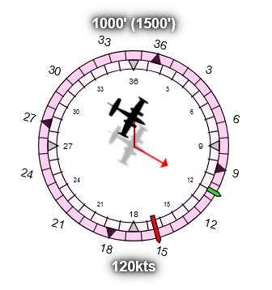

Oh yeah: we're getting fancy. We're not using a simple little pin, we're cramming as much MSFS information into our marker as we can:

- Up top we have the current altitude above the ground in feet, with the altitude relative to sea level in parentheses.
- Down below, the speed in knots.
- In the center, we have the plane itself, offset vertically based on its altitude.
- Below it, on the ground, we have the same plane but blurred and made translucent so it looks like a ground shadow.
- Also below the plane we have an altitude line connecting the plane to its GPS position on the map,
- as well as a line indicating both the current heading and speed of the plane.
- The outer compass ring represents the magnetic compass as we'd see it inside the plane,
- and the an inner compass ring represents the "true" north, based on GPS.
- The outer ring has a red "heading bug" that points in the direction that the plane should be going according to the autopilot,
- as well a green "current heading" marker so we don't have to guess our heading based on the speed line.

How do we build that? With HTML and SVG:

```html
<div id="plane-icon">
  <div class="bounds">
    <link rel="stylesheet" href="css/map-marker.css" />

    <div class="basics">
      
      
      <hr class="alt-line" />
      <hr class="speedo" />
      <hr class="speedarrow" />
      <div class="speed label">0kts</div>
      <div class="alt label">0' (500')</div>
    </div>

    <svg class="compass" viewBox="0 0 200 200">
      <g transform="scale(0.9)">
        <g class="box">
          <path d="M0 100 L 200 100" />
          <path d="M100 0 L 100 200" />
          <rect x="0" y="0" width="200" height="200" stroke="black" fill="none"/>
        </g>

        <g transform="translate(0,0) scale(0.92)">
          <g class="inner ring">
            <path d="M 175 100 H 185" style="--d: 170" />
            <path d="M 175 100 H 185" style="--d: 160" />
            <path d="M 175 100 H 185" style="--d: 150" />
            <path d="M 175 100 H 185" style="--d: 140" />
            <path d="M 175 100 H 185" style="--d: 130" />
            <path d="M 175 100 H 185" style="--d: 120" />
            <path d="M 175 100 H 185" style="--d: 110" />
            <path d="M 175 100 H 185" style="--d: 100" />
            <path d="M 185 100 V 95 L 175 100 L 185 105 Z" style="--d: 90" fill="#0003" />
            <path d="M 175 100 H 185" style="--d: 80" />
            <path d="M 175 100 H 185" style="--d: 70" />
            <path d="M 175 100 H 185" style="--d: 60" />
            <path d="M 175 100 H 185" style="--d: 50" />
            <path d="M 175 100 H 185" style="--d: 40" />
            <path d="M 175 100 H 185" style="--d: 30" />
            <path d="M 175 100 H 185" style="--d: 20" />
            <path d="M 175 100 H 185" style="--d: 10" />
            <path d="M 185 100 V 95 L 175 100 L 185 105 Z" style="--d: 0" fill="#0003" />
            <path d="M 175 100 H 185" style="--d: -10" />
            <path d="M 175 100 H 185" style="--d: -20" />
            <path d="M 175 100 H 185" style="--d: -30" />
            <path d="M 175 100 H 185" style="--d: -40" />
            <path d="M 175 100 H 185" style="--d: -50" />
            <path d="M 175 100 H 185" style="--d: -60" />
            <path d="M 175 100 H 185" style="--d: -70" />
            <path d="M 175 100 H 185" style="--d: -80" />
            <path d="M 185 100 V 95 L 175 100 L 185 105 Z" style="--d: -90" fill="#0003" />
            <path d="M 175 100 H 185" style="--d: -100" />
            <path d="M 175 100 H 185" style="--d: -110" />
            <path d="M 175 100 H 185" style="--d: -120" />
            <path d="M 175 100 H 185" style="--d: -130" />
            <path d="M 175 100 H 185" style="--d: -140" />
            <path d="M 175 100 H 185" style="--d: -150" />
            <path d="M 175 100 H 185" style="--d: -160" />
            <path d="M 175 100 H 185" style="--d: -170" />
            <path d="M 185 100 V 95 L 175 100 L 185 105 Z" style="--d: -180" fill="#0003" />

            <text text-anchor="middle" fill="black" x="100" y="39">36</text>
            <text text-anchor="middle" fill="black" x="134" y="46" class="small">3</text>
            <text text-anchor="middle" fill="black" x="158" y="69" class="small">6</text>
            <text text-anchor="middle" fill="black" x="167" y="103">9</text>
            <text text-anchor="middle" fill="black" x="156" y="136" class="small">12</text>
            <text text-anchor="middle" fill="black" x="133" y="160" class="small">15</text>
            <text text-anchor="middle" fill="black" x="100" y="171">18</text>
            <text text-anchor="middle" fill="black" x="67" y="160" class="small">21</text>
            <text text-anchor="middle" fill="black" x="44" y="136" class="small">24</text>
            <text text-anchor="middle" fill="black" x="35" y="103">27</text>
            <text text-anchor="middle" fill="black" x="43" y="69" class="small">30</text>
            <text text-anchor="middle" fill="black" x="67" y="46" class="small">33</text>

            <circle cx="50%" cy="50%" r="80" fill="none" stroke="#F5C1" stroke-width="10" />
          </g>

          <g class="outer ring">
            <path d="M 185 100 H 195" style="--d: 170" />
            <path d="M 185 100 H 195" style="--d: 160" />
            <path d="M 185 100 H 195" style="--d: 150" />
            <path d="M 185 100 H 195" style="--d: 140" />
            <path d="M 185 100 H 195" style="--d: 130" />
            <path d="M 185 100 H 195" style="--d: 120" />
            <path d="M 185 100 H 195" style="--d: 110" />
            <path d="M 185 100 H 195" style="--d: 100" />
            <path d="M 185 100 V 95 L 195 100 L 185 105 Z" style="--d: 90" />
            <path d="M 185 100 H 195" style="--d: 80" />
            <path d="M 185 100 H 195" style="--d: 70" />
            <path d="M 185 100 H 195" style="--d: 60" />
            <path d="M 185 100 H 195" style="--d: 50" />
            <path d="M 185 100 H 195" style="--d: 40" />
            <path d="M 185 100 H 195" style="--d: 30" />
            <path d="M 185 100 H 195" style="--d: 20" />
            <path d="M 185 100 H 195" style="--d: 10" />
            <path d="M 185 100 V 95 L 195 100 L 185 105 Z" style="--d: 0" />
            <path d="M 185 100 H 195" style="--d: -10" />
            <path d="M 185 100 H 195" style="--d: -20" />
            <path d="M 185 100 H 195" style="--d: -30" />
            <path d="M 185 100 H 195" style="--d: -40" />
            <path d="M 185 100 H 195" style="--d: -50" />
            <path d="M 185 100 H 195" style="--d: -60" />
            <path d="M 185 100 H 195" style="--d: -70" />
            <path d="M 185 100 H 195" style="--d: -80" />
            <path d="M 185 100 V 95 L 195 100 L 185 105 Z" style="--d: -90" />
            <path d="M 185 100 H 195" style="--d: -100" />
            <path d="M 185 100 H 195" style="--d: -110" />
            <path d="M 185 100 H 195" style="--d: -120" />
            <path d="M 185 100 H 195" style="--d: -130" />
            <path d="M 185 100 H 195" style="--d: -140" />
            <path d="M 185 100 H 195" style="--d: -150" />
            <path d="M 185 100 H 195" style="--d: -160" />
            <path d="M 185 100 H 195" style="--d: -170" />
            <path d="M 185 100 V 95 L 195 100 L 185 105 Z" style="--d: -180" />

            <text text-anchor="middle" fill="black" x="100" y="0">36</text>
            <text text-anchor="middle" fill="black" x="153" y="12">3</text>
            <text text-anchor="middle" fill="black" x="192" y="52">6</text>
            <text text-anchor="middle" fill="black" x="205" y="104">9</text>
            <text text-anchor="middle" fill="black" x="194" y="159">12</text>
            <text text-anchor="middle" fill="black" x="154" y="198">15</text>
            <text text-anchor="middle" fill="black" x="100" y="210">18</text>
            <text text-anchor="middle" fill="black" x="48" y="198">21</text>
            <text text-anchor="middle" fill="black" x="5" y="158">24</text>
            <text text-anchor="middle" fill="black" x="-7" y="104">27</text>
            <text text-anchor="middle" fill="black" x="5" y="52">30</text>
            <text text-anchor="middle" fill="black" x="45" y="11">33</text>

            <circle cx="50%" cy="50%" r="90" fill="none" stroke="#F5C4" stroke-width="10" />
          </g>

          <g class="ring" style="transform: scale(0.9)">
            <circle cx="50%" cy="50%" r="105" fill="none" stroke="black" stroke-width="1" />
            <circle cx="50%" cy="50%" r="85" fill="none" stroke="black" stroke-width="1" />
            <circle cx="50%" cy="50%" r="95" fill="none" stroke="black" stroke-width="1" />
          </g>

          <g class="outer">
            <path class="heading-bug" d="M 172 98 L 197 98 L 200 100 L 197 102 L 172 102 Z" />
            <path class="heading" d="M 185 98 L 197 98 L 200 100 L 197 102 L 185 102 Z" />
          </g>
        </g>
      </g>
    </svg>
  </div>
</div>
```

With a whole bunch of CSS that makes things really easy to control: all the different aspects of this marker are controlled using a few CSS variables:

```css
#plane-icon {
  --speed: 120;       /* our airspeed in knots, without a unit */
  --altitude: 1500;   /* our altitude in feet, without a unit */
  --sqrt-alt: 39;     /* In order to show altitude on the map, we'll be using the square root of our altitude */
  --heading: 150;     /* our magnetic compass heading in degrees, without a unit */
  --heading-bug: 220; /* our "heading bug" compass angle in degrees, without a unit */
  --north: 15.8;      /* the compass deviation from true north in degrees, without a unit */
}

#plane-icon {
  --alt-em: calc(var(--sqrt-alt) / 20);
  --f: 250;
  --dim: calc(var(--f) * 1px);
  --font-size: calc(var(--dim) / 17);

  font-family: Arial;
  font-size: var(--font-size);
  position: relative;
  top: 11px;
  left: 16px;
}

#plane-icon .bounds {
  position: absolute;
  width: var(--dim);
  height: var(--dim);
  top: calc(var(--dim) / -2);
  left: calc(var(--dim) / -2);
}

/* If we've crashed, show a big old pirate X in the spot we crashed at, instead of the flight marker */
#plane-icon.crashed {
  background-image: url(images/crashed.png);
  width: 30px;
  height: 30px;
  background-size: 100% 100%;
  position: absolute;
  left: 2px;
  top: -3px;
}

#plane-icon.crashed * {
  display: none !important;
}

@keyframes pulsing {
  0% {
    opacity: 0;
  }
  100% {
    opacity: 1;
  }
}

/* If the game is paused, show our plane fading in and out */
#plane-icon.paused .basics {
  animation: 2s linear infinite alternate pulsing;
}

#plane-icon .basics img {
  position: absolute;
  display: inline-block;
  z-index: 10;
  --w: calc(var(--dim) / 5);
  width: var(--w);
  height: var(--w);
  --to: 10px;
  top: calc(var(--dim) / 2 - var(--w) / 2 + var(--to));
  left: calc(var(--dim) / 2 - var(--w) / 2);
  /* rotate the plane icon so that it points in the right direction */
  transform-origin: calc(50%) calc(50% - var(--to));
  --rot: rotate(calc(1deg * var(--heading) + 1deg * var(--north)));
  transform: translate(0, calc(-1em * var(--alt-em))) var(--rot);
}

/* Since we're drawing our plane at a specific height, also draw the "shadow" on the "ground" */
#plane-icon .basics img.shadow {
  position: absolute;
  /* the higher our plane, the more blurry we make the shadow */
  filter: blur(calc(0.5px * var(--alt-em))) opacity(0.3);
  transform: var(--rot);
}

#plane-icon .basics hr {
  position: absolute;
  top: 50%;
  left: 50%;
  margin: 0;
  padding: 0;
  transform-origin: 1px 1px;
  transform: rotate(-90deg);
  border: 1px solid red;
}

#plane-icon .basics .alt-line {
  width: calc(1em * var(--alt-em));
}

#plane-icon .basics .speedo,
#plane-icon .basics .speedarrow {
  --w: calc(1em * var(--speed) / 50);
  width: var(--w);
  --rot: calc(1deg * var(--heading) + 1deg * var(--north));
  transform: rotate(calc(-90deg + var(--rot)));
}

#plane-icon .basics .speedarrow {
  --b: 5px;
  --r: calc(var(--b) * 1.5);
  border: var(--b) solid red;
  border-left-color: transparent;
  border-top-color: transparent;
  width: 0;
  transform-origin: 0 0;
  transform: rotate(calc(var(--rot) - 90deg))
    translate(calc(var(--w) - var(--r)), 0) rotate(-45deg);
}

#plane-icon .basics .label {
  position: absolute;
  color: white;
  width: 100%;
  font-weight: bold;
  text-align: center;
  text-shadow: 0px 0px 5px black, 0px 0px 10px black, 0px 0px 15px black;
}

#plane-icon .basics .alt { top: -4%; }
#plane-icon .basics .speed { top: 96%; }

/* SVG rules */

#plane-icon svg.compass {
  font-family: Arial;
  font-size: 12px;
}

#plane-icon svg.compass g.box { display: none; }
#plane-icon svg.compass path { transform-origin: 50% 50%; }
#plane-icon svg.compass text.small { font-size: 80%; }
#plane-icon svg.compass g path { stroke: black; }
#plane-icon svg.compass g.ring path { transform: rotate(calc(var(--d) * 1deg)); }
#plane-icon svg.compass g { transform-origin: 50% 50%; }
#plane-icon svg.compass g.inner { font-size: 70%; }
#plane-icon svg.compass g.outer { transform: rotate(calc(var(--north) * 1deg)); }

#plane-icon svg.compass g path.heading {
  stroke: black;
  fill: #3d3;
  transform: rotate(calc((var(--heading) * 1deg) - 90deg));
}

#plane-icon svg.compass g path.heading-bug {
  stroke: black;
  fill: red;
  transform: rotate(calc(var(--heading-bug) * 1deg - 90deg));
}
```

We can update these variables on the JS side, based on the values we get from MSFS, and things will just "look right". Yay, web stack!

```javascript
import { getAirplaneSrc } from "./airplane-src.js";

...

export class Plane {

  ...

  // When we set our state,
  async setState(data) {
    if (data.TITLE === undefined) return;

    if (this.state.title !== data.TITLE) {
      Questions.modelLoaded(data.TITLE);
      // pick the right aeroplane to show in our marker:
      const pic = getAirplaneSrc(data.TITLE);
      [...this.planeIcon.querySelectorAll(`img`)].forEach((img) => (img.src = `planes/${pic}`));
    }

    ...
  }

  // Then let's update our "update page" function so that it updates our plane on the map!
  async updatePage(data) {
    if (paused) return;

    const now = Date.now();
    const { lat, long, airBorn, speed, alt, palt, heading, trueHeading, ap, bug } = this.state;
    const latLong = [lat, long];
    const { planeIcon } = this;
    const css = planeIcon.style;

    // Do some checkbox logic:
    Questions.inTheAir(airBorn && speed > 0);
    Questions.usingAutoPilot(ap_master);

    // Then update our GPS coordinate on the page,
    document.getElementById(`lat`).textContent = lat.toFixed(5);
    document.getElementById(`long`).textContent = long.toFixed(5);
    // center the map on that coordinate (if that box is checked!),
    if (centerBtn.checked) this.map.setView(latLong);
    // and put our marker at our current GPS coordinate, of course.
    this.marker.setLatLng(latLong);

    // Then we update the various aspects of our plane marker by setting our CSS variables:
    css.setProperty(`--altitude`, max(palt, 0));
    css.setProperty(`--sqrt-alt`, sqrt(max(palt, 0)));
    css.setProperty(`--speed`, speed | 0);
    css.setProperty(`--north`, trueHeading - heading);
    css.setProperty(`--heading`, heading);
    css.setProperty(`--heading-bug`, bug);

    // And save our state so we have it available for the next call.
    this.lastUpdate = { time: now, ...this.state };
  }
}
```

And the final bit of the puzzle, `airplane-src.js`, for which we're going to want to create a directory called `planes` inside our `public` directory, so that we can fill it with plane icons, like these:

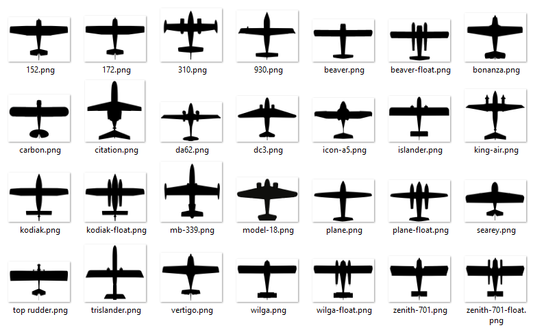

And then with some tactical JS we can swap the correct icon in based on the plane we're flying:

```javascript
export const defaultPlane = `plane.png`;

export function getAirplaneSrc(title = ``) {
  let pic = defaultPlane;
  let plane = title.toLowerCase();

  // let's find our plane!
  if (plane.includes(` 152`)) pic = `152.png`;
  else if (plane.includes(` 310`)) pic = `310.png`;
  else if (plane.includes(` beaver`)) pic = `beaver.png`;
  else if (plane.includes(` kodiak`)) pic = `kodiak.png`;
  else if .....you get the idea...

  // And a quick check: is this the float plane variant?
  if (plane.includes(`amphibian`) || plane.includes(`float`)) {
    pic = pic.replace(`.png`, `-float.png`);
  }

  // Done, return the appropriate icon. Or just `plane.png` if we don't have this plane in our list.
  return pic;
}
```

And that'll do it. Let's fire up MSFS, load a plane into the world, and let's see what that looks like!

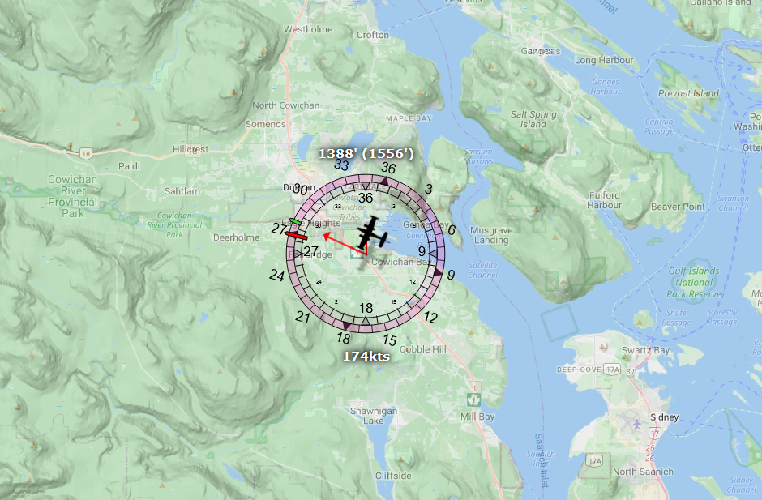

It looks spectacular, and we can see ourselves flying around on the map on our webpage!


> **"That looks cool! But hold up... why are there _two_ compasses?"** - you, hopefully (again)


Yeah, so, here's a fun thing about our planet: you'd think magnetic lines run north to south, like those pictures of metal filings around a magnet... which they would, if the Earth was a bar-magnet-sized magnet. Instead, it's _absolutely huge_ and a highly imperfect magnet, so a picture of the magnetic field plotted on a map looks more like this:

<figure style="width: 80%; margin: auto;">
    <a href="https://en.wikipedia.org/wiki/File:World_Magnetic_Declination_2015.pdf">
      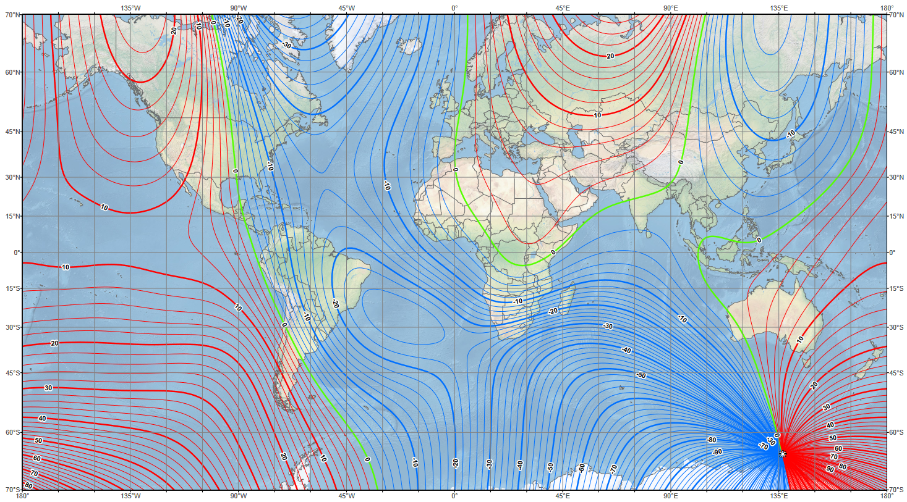
    </a>
    <figcaption style="text-align:center">A map of the magnetic declination on planet Earth</figcaption>
</figure>

The green lines are where a compass will actually point north, but everywhere else on the planet your compass will be off by various degrees. For example,  it's only a touch off in Belgium, but at the south tip of the border between Alaska and Canada, your compass will be a pointing a whopping 20 degrees away from true north. When you're flying a plane, you better be aware of that, and you better know which of your instruments use compass heading, and which of them use true heading, or you might not get to where you thought you were going.

## Recording our flight path

Seeing ourselves flying around on the map is pretty great, but we can only see "where we are", instead of seeing where we've been so far. As it turns out, Leaflet supports drawing polygons, so let's also add some "flight tracking" to our web page (not in the least because it's something that will be pretty important for debugging autopilot code later!).

First, we create a little `trail.js` class because you know how this works by now, new code gets its own module:

```javascript
export class Trail {
  constructor(map, pair, color, opts={}) {
    this.map = map;
    this.line = undefined;
    this.color = color ?? `blue`;
    this.opts = opts;
    this.coords = [];
    if (pair) this.add(...pair);
  }

  add(lat, long) {
    if (!lat && !long) return;

    const { coords } = this;
    const pair = [lat, long];
    coords.push(pair);

    // if we have fewer than 2 points, we can't draw a trail yet.
    const l = coords.length;
    if (l < 2) return;

    // if we have exactly 2 points, we create the trail polyon
    if (l === 2) {
      this.line = L.polyline([...coords], { className: `flight-trail`, color: this.color, ...this.opts });
      return this.line.addTo(this.map);
    }

    // otherwise, we simply append this position to the trail.
    this.line.addLatLng(pair);
  }

  remove() {
    this.line?.remove();
  }
}
```

Really all this does is wrap some of the functionality so that we can just create a `Trail` instance, and add points to it and it'll do the right thing. For instance, it's not going to do anything until there are two points to draw a line with. That's not code we want to constantly have to remember we need to write.

So with that class set up, let's update `plane.js` some more:

```javascript
import { Trail } from "./trail.js";

...

export class Plane {
  ...

  // A little helper function for tracking "the current trail", because we
  // can restart flights as much as we want. Voluntarily, or because we crashed...
  startNewTrail(location) {
    this.trail = new Trail(this.map, location);
  }

  ...

  async waitForModel() {
    ...
    const model = (this.flightModel = new FlightModel());
    const { title, lat, long, engineCount } = await model.bootstrap();
    this.lastUpdate.lat = lat;
    this.lastUpdate.long = long;
    this.startNewTrail([lat, long]);
    ...
  }

  ...

  // And update our "update page" function so that when we start a new trail when we skip across the world.
  async updatePage(data) {
    ...

    document.getElementById(`lat`).textContent = lat.toFixed(5);
    document.getElementById(`long`).textContent = long.toFixed(5);
    this.map.setView([lat, long]);

    // We do this based on "impossible distance". If we spawn in on a new location, or we teleport
    // (by using Flow Pro or the developer tools, for example), or we use slew mode: start a new trail.
    const moved = dist(this.lastUpdate.lat, this.lastUpdate.long, lat, long);

    // 1 knot is 1.852 km/h, or 0.0005 km/s, which is 0.000005 degrees of arc per second.
    // the "speed" is in (true) knots, so if we move more than speed * 0.000005 degrees,
    // we know we teleported. Or the game's glitching. So to humour glitches, we'll
    // double that to speed * 0.00001 and use that as cutoff value:
    if (moved > speed * 0.0001) this.startNewTrail(latLong);

    ...
}
```

Relatively little code, but a profound improvement:

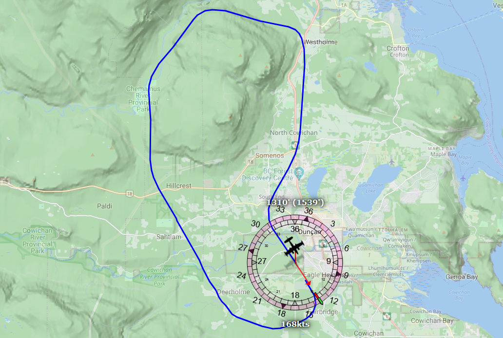

Alright, now we've got things we can post to Instagram!

## Rolling the plane

There's one thing our fancy marker isn't showing though, which is the current roll and pitch, which would be really nice to be able to see at a glance. So... let's build an [attitude indicator](https://en.wikipedia.org/wiki/Attitude_indicator), also sometimes called an "artificial horizon":

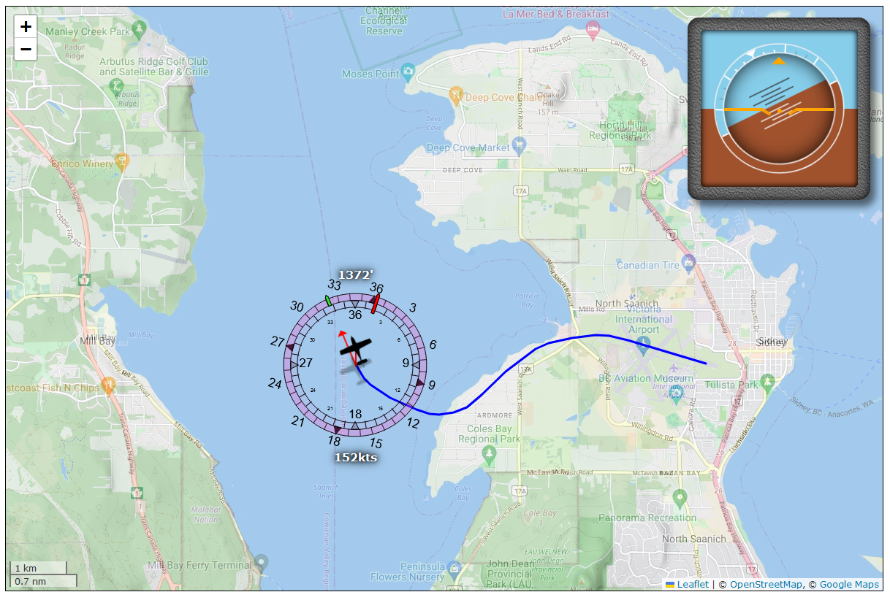

Much like our regular marker, we're just going the HTML, SVG, and CSS route, and update CSS variables based on bank angle and pitch. This one's a little easier than the map marker file at least:

```html
<div id="attitude">
  <div class="frame">
    <link rel="stylesheet" href="/css/attitude.css">

    <div class="inner-shadow"></div>
    <div class="sky"></div>
    <div class="ground"></div>

    <div class="scales">
      <hr>
      <hr class="minor small"> <hr class="minor small">
      <hr>
      <hr class="small"><hr class="small">
      <hr>
      <hr class="small"><hr class="small">
      <hr>
      <hr class="minor small"><hr class="minor small">
      <hr>
      <hr>
      <div class="center-mark"></div>
      <div class="sky"></div>
      <div class="ground"></div>
    </div>

    <div class="box">
      <div class="bug"></div>
      <div class="gyro">
        <div class="sky">
          <hr class="pitch-marker small">
          <hr class="pitch-marker">
          <hr class="pitch-marker small">
          <hr class="pitch-marker">
        </div>
        <div class="ground">
          <hr class="pitch-marker small">
          <hr class="pitch-marker">
          <hr class="pitch-marker small">
          <hr class="pitch-marker">
        </div>
        <div class="box-shadow"></div>
      </div>
    </div>

    <div class="bird"><hr><hr><hr><hr><hr></div>
  </div>
</div>
```

Although the CSS is doing all the heavy lifting, so it's pretty elaborate:

```css
#attitude {
  --bank: 0;
  --pitch: 0;

  --safety-pad: -5%;
  --frame-pad: 7%;
  --box-pad: 5%;
  --active-pad: 10%;
  --dial-space: 3px;

  position: absolute;
  z-index: 1000;
  left: calc(1200px - 250px - 1.5em);
  width: 250px;
  height: 250px;
  margin: 1em;
  background: #444;
  background-image: url(images/gray-textured-pattern-background-1488751952b8R.jpg);
  background-size: 120% 130%;
  box-shadow: 0 0 13px 0 inset black, 7px 9px 10px 0px #0008;
  border-radius: 1em;
}
#attitude .frame {
  position: absolute;
  top: var(--frame-pad);
  left: var(--frame-pad);
  right: var(--frame-pad);
  bottom: var(--frame-pad);
}
#attitude .frame .inner-shadow {
  position: absolute;
  z-index: 5;
  width: 100%;
  height: 100%;
  box-shadow: 0 0 7px 1px inset black;
  border-radius: 0.3em;
}
#attitude .sky {
  background: skyblue;
  position: absolute;
  top: 0;
  bottom: 50%;
  left: 0;
  right: 0;
  border-radius: 0.3em 0.3em 0 0;
}
#attitude .ground {
  background: sienna;
  position: absolute;
  top: 50%;
  bottom: 0;
  left: 0;
  right: 0;
  border-radius: 0 0 0.3em 0.3em;
}
#attitude .scales {
  --pad: calc(var(--frame-pad) + var(--dial-space));
  position: absolute;
  z-index: 1;
  top: var(--pad);
  right: var(--pad);
  left: var(--pad);
  bottom: var(--pad);
  border-radius: 100%;
  overflow: hidden;
  border: 2px solid #eee;
  transform-origin: 50% 50%;
  transform: rotate(calc(1deg * var(--bank)));
}
#attitude .scales .sky {
  top: var(--safety-pad);
  left: var(--safety-pad);
  right: var(--safety-pad);
}
#attitude .scales .ground {
  bottom: var(--safety-pad);
  left: var(--safety-pad);
  right: var(--safety-pad);
}
#attitude .scales hr {
  --angle: 0deg;
  position: absolute;
  z-index: 2;
  top: 50%;
  left: -5%;
  right: 50%;
  border: 1px solid #fff;
  transform-origin: 100% 0;
  transform: rotate(calc(90deg + var(--angle)));
}
#attitude .scales .center-mark {
  --size: 7px;
  position: absolute;
  z-index: 5;
  top: -5%;
  left: calc(50% - var(--size) - 1px);
  right: calc(50% + var(--size) + 1px);
  width: 0;
  height: 0;
  border: var(--size) solid white;
  border-right-color: transparent;
  border-top-color: transparent;
  transform: rotate(-45deg);
}
#attitude .scales hr.small {
  left: 0%;
  right: 50%;
}
#attitude .scales hr.minor {
  border-color: #0002;
}

#attitude .scales hr:nth-child(1) { --angle: 60deg; }
#attitude .scales hr:nth-child(2) { --angle: 50deg; }
#attitude .scales hr:nth-child(3) { --angle: 40deg; }
#attitude .scales hr:nth-child(4) { --angle: 30deg; }
#attitude .scales hr:nth-child(5) { --angle: 20deg; }
#attitude .scales hr:nth-child(6) { --angle: 10deg; }
#attitude .scales hr:nth-child(7) { --angle: 0deg; }
#attitude .scales hr:nth-child(8) { --angle: -10deg; }
#attitude .scales hr:nth-child(9) { --angle: -20deg; }
#attitude .scales hr:nth-child(10) { --angle: -30deg; }
#attitude .scales hr:nth-child(11) { --angle: -40deg; }
#attitude .scales hr:nth-child(12) { --angle: -50deg; }
#attitude .scales hr:nth-child(13) { --angle: -60deg; }
#attitude .scales hr:nth-child(14) { --angle: -90deg; top: 45%; left: -5%; right: -5%; }

#attitude .box {
  border-radius: 100%;
  position: absolute;
  top: var(--box-pad);
  bottom: var(--box-pad);
  left: var(--box-pad);
  right: var(--box-pad);
  overflow: hidden;
}
#attitude .box .gyro {
  border-radius: 100%;
  position: absolute;
  z-index: 3;
  --step: calc(1px + 1%);
  top: var(--active-pad);
  left: var(--active-pad);
  right: var(--active-pad);
  bottom: var(--active-pad);
  overflow: hidden;
  transform-origin: center center;
  transform: rotate(calc(1deg * var(--bank)));
  border: 2px solid #eee;
}
#attitude .box .gyro .sky {
  position: absolute;
  top: 0;
  bottom: calc(48% + calc(1% * var(--pitch)));
  left: 0;
  right: 0;
}
#attitude .box .bug {
  --size: 7px;
  position: absolute;
  z-index: 4;
  top: 15%;
  left: calc(50% - var(--size));
  right: calc(50% + var(--size));
  width: 0;
  height: 0;
  border: var(--size) solid orange;
  border-left-color: transparent;
  border-bottom-color: transparent;
  transform: rotate(-45deg);
}
#attitude .box .gyro .pitch-marker {
  position: absolute;
  border: 1px solid #333a;
  left: 30%;
  right: 30%;
}
#attitude .box .gyro .pitch-marker.small {
  left: 40%;
  right: 40%;
}

#attitude .box .gyro .sky .pitch-marker:nth-of-type(1) { bottom: calc(var(--step) * -2); }
#attitude .box .gyro .sky .pitch-marker:nth-of-type(2) { bottom: calc(var(--step) * 1.5); }
#attitude .box .gyro .sky .pitch-marker:nth-of-type(3) { bottom: calc(var(--step) * 5); }
#attitude .box .gyro .sky .pitch-marker:nth-of-type(4) { bottom: calc(var(--step) * 9); }

#attitude .box .gyro .ground .pitch-marker {
  border-color: #fffa;
}
#attitude .box .gyro .ground {
  position: absolute;
  top: calc(52% - calc(1% * var(--pitch)));
  bottom: 0%;
  left: 0;
  right: 0;
}

#attitude .box .gyro .ground .pitch-marker:nth-of-type(1) { top: calc(var(--step) * -1); }
#attitude .box .gyro .ground .pitch-marker:nth-of-type(2) { top: calc(var(--step) * 2); }
#attitude .box .gyro .ground .pitch-marker:nth-of-type(3) { top: calc(var(--step) * 5); }
#attitude .box .gyro .ground .pitch-marker:nth-of-type(4) { top: calc(var(--step) * 8); }

#attitude .box .gyro .box-shadow {
  position: absolute;
  z-index: 3;
  width: 100%;
  height: 100%;
  border-radius: 100%;
  box-shadow: 0 0 25px -2px black inset;
}
#attitude .bird hr {
  position: absolute;
  z-index: 5;
  border: 2px solid orange;
  top: 46%;
}
#attitude .bird hr:nth-of-type(1) {
  left: 15%;
  right: 60%;
}
#attitude .bird hr:nth-of-type(2) {
  left: 39%;
  right: 55%;
  transform-origin: 0 100%;
  transform: rotate(30deg);
}
#attitude .bird hr:nth-of-type(3) {
  top: 45%;
  left: 50%;
  right: 50%;
  bottom: 55%;
  margin: 5% 0 0 -2px;
  border-width: 3px;
  border-radius: 100%;
}
#attitude .bird hr:nth-of-type(4) {
  left: 55%;
  right: 39%;
  transform-origin: 100% 0;
  transform: rotate(-30deg);
}
#attitude .bird hr:nth-of-type(5) {
  left: 61%;
  right: 15%;
}
```

And then we update `plane.js` to set these new CSS variables as part of the `updatePage` function:

```javascript
  async updatePage(data) {
    if (paused) return;

    ...

    const attitude = document.getElementById(`attitude`);
    attitude.style.setProperty(`--pitch`, pitch);
    attitude.style.setProperty(`--bank`, bank);

    ...
  }
```

And done, that's our attitude indicator hooked up.


## Plotting flight data

Before we consider our page work done, though, let's add one more thing: science.

If we want to understand what our plane is doing, especially if we want to understand what our plane is doing in response to input changes (be those human or auto pilot in nature), we need some way to see what happens over time, which means we want graphs. And if we need graphs, we need some code that'll do that graphing for us!

There's quite a few ways to get some nice charts on a page, so instead of running you through the code that this project uses, let's just say that you are spoiled for choice and the choice of whether to use an off-the-shelf library or rolling your own code is entirely up to you. In this specific case, I rolled us some custom code that you can find on the repo under `public/js/dashboard/`, mostly because I wanted something that generates plain SVG that I can just copy-paste from dev tools into a new file, save that as `.svg` and then be able to load it into any SVG viewer/editor. Something that's particularly useful for autopilot debugging.

What matters most is that we can tell the code that we want to plot several graphs, and that each graph has some initial x and y interval that we can grow as needed (`x` representing time and `y` representing "whatever makes sense for the value we're plotting", since heading angle, speed in knots, altitude in feet, etc. all have rather different ranges), which we do with an initial setup:

```javascript
export function initCharts() {
  const colors = {
    background: `#444`,
    plot: `#0F0F`,
    minor: `#9994`,
    major: `#EEE4`,
    axis: `#FF0F`,
  };

  const chartables = {
    ground: {
      addLabel: true,
      min: 0,
      startMax: 500,
      colors,
      axes: {
        minor: { interval: 100, },
        major: { interval: 1000, strokeWidth: 2 },
      },
    },
    altitude: {
      min: 0,
      startMax: 500,
      ...
    },
    ...
  };

  return new Chart(chartables, colors);
}
```

After which we update our `updatePage` functions:

```javascript
...
const trimToDegree = (v) => (v / (Math.PI / 10)) * 90;
...
export class Plane {
  ...

  async function updatePage(data) {
    ...

    // We're basically taking *everything* out of our current state now
    const {
      airBorn, speed, alt, galt, palt, vspeed,
        lat, long, bank, pitch, trim, aTrim,
        heading, trueHeading, turnRate, bug
    } = this.state;

    ...

    // Because whatever we're not using to draw things on the map, we're using
    // to plot as flight data using our graphing solution:
    charts.update({
      ground: galt,
      altitude: alt,
      vspeed: vspeed * 60,
      dvs: ((vspeed - this.lastUpdate.vspeed) * 60) / (now - this.lastUpdate.time),
      speed: speed,
      pitch: pitch,
      trim: trimToDegree(trim),
      heading: heading - 180,
      bank: bank,
      dbank: (bank - this.lastUpdate.bank) / (now - this.lastUpdate.time),
      "turn rate": turnRate,
      "aileron trim": aTrim * 100,
    });

    this.lastUpdate = { time: now, ...this.state };
  }
}
```

And now we can see what our plane is doing over time:

<figure style="width: 50%; margin: auto; margin-bottom: 1em; overflow: hidden;" >
  <a href="charts.png" target="_blank">
    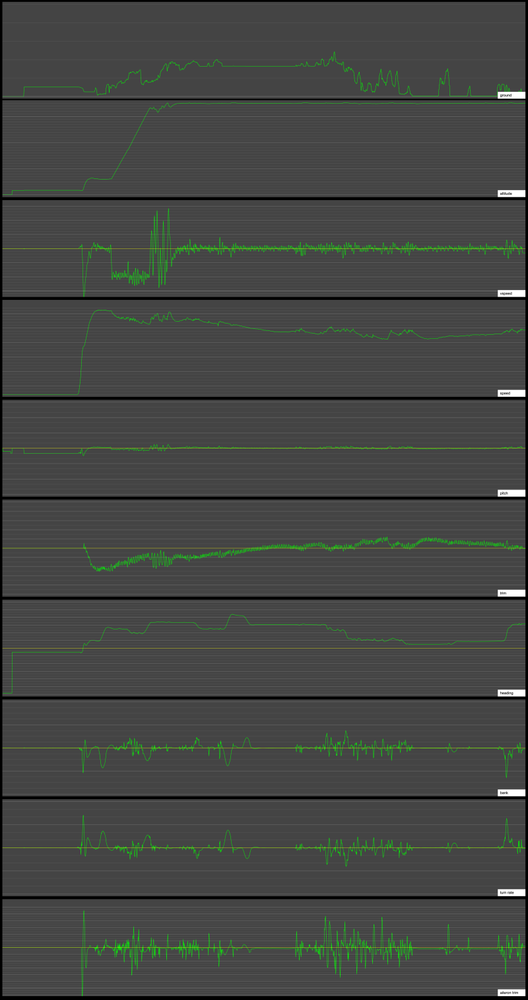
  </a>
  <figcaption style="font-style: italic; text-align: center;">All the data</figcaption>
</figure>
And with that, we're _finally_ ready to start writing our autopilot code, confident in the knowledge that we can see what effect our code will have on our plane, and that we can effectively analyze and debug anything we do in the next part.


# Part three: writing an autopilot

It's time. Let's write that autopilot.

And while we could do this in the browser, we're going to be adding the main code to our API server, rather than our web page. Don't get me wrong: we *totally could* write our autopilot in client-side JS, but we'd much rather not have to deal with the delay of network requests from the webpage (even if web sockets are must faster than GET/POST requests), and we definitely don't want to accidentally turn off the autopilot just because we closed a tab... we might be flying a virtual plane, but it'd be nice to keep it in the air instead of just plummeting out of the sky when we accidentally close our browser!

So, we're going to accept autopilot *instructions* from our web page, and then make those instructions trigger autopilot *logic* over on the API server's side. To help with this, we're going to create an `Autopilot` class that will house all the logic, and we'll update our API server's web socket code so that we can send and receive autopilot messages.

Let's do that in reverse, since the API server update isn't all too big:

```javascript
import { AutoPilot } from "./autopilot/autopilot.js";
...

// Set up our API and Autopilot:
const api = new MSFS_API();
const autopilot = new AutoPilot(api, async (params) => broadcast(`autopilot`, params));

...

// Then update our websocket handler
app.ws("/", function (socket) {
  ...
  socket.on("message", async (msg) => {
    const { action, data } = JSON.parse(msg.toString("utf-8"));
    ...
    if (action === `autopilot`) {
      // Autopilot messages need to be further unpacked:
      const { action, params } = data;

      // Autopilot instructions will use the "update" action:
      if (action === `update`) {
        await autopilot.setParameters(params);
      }

      // and regardless of what instruction was issued, always respond with "the current autopilot parameters"
      broadcast(`autopilot`, autopilot.getAutoPilotParameters());
    }
  });
  ...
});

app.listen(PORT, () => {
  ...
    onConnect: () => {
      console.log(`Connected to MSFS`);
      // Since we now have an autopilot, we should also remember to pause it when the game's paused:
      api.on(SystemEvents.PAUSED, () => autopilot.setPaused(true));
      api.on(SystemEvents.UNPAUSED, () => autopilot.setPaused(false));
      // And when we switch from "not in game" to "in game", reset the autopilot.
      api.on(SystemEvents.SIM, (inGame) => { if (inGame === 1) { autopilot.reset(); }});
      ...
    },
  ...
});
```

Nothing too special, just a few tiny changes: we create an autopilot instance with an onChange handler so that any time the autopilot's parameters change (either because we told it to, or because the autopilot changed it own parameters) all clients will be notified of those changes. And then we add some code so that clients can send a web socket message with a payload that looks like:

```javascript
{
  action: "autopilot",
  data: {
    action: "update",
    params: {
      ...
    }
  }
}
```

where the `params` object will contain key/value pairs for things like setting the altitude we want to fly, our heading, whether to auto-level the wings, etc.

Moving on to the `Autopilot` class:

```javascript
import { State } from "./state.js";

const DEFAULT_AP_INTERVAL = 500; // in milliseconds

export class AutoPilot {
  constructor(api, onChange = () => {}) {
    this.api = api;
    this.onChange = onChange;
    this.AP_INTERVAL = REGULAR_AUTOPILOT;
    this.reset();
  }

  reset() {
    this.paused = false;
    this.crashed = false;
    this.prevState = new State();
    this.autoPilotEnabled = false;
    this.modes = {
      // We'll be filling this with all the various autopilot modes later
    };
    this.onChange(this.getAutoPilotParameters);
  }

  // we want to make sure we don't run when the game is paused.
  setPaused(value) {
    this.paused = value;
  }

  run() {
    // We don't actually care whether the autopilot runs on an exact interval, since our AP won't be running
    // every frame, but more like every several thousand frames. A regular old timeout works just fine.
    setTimeout(() => this.runAutopilot(), this.AP_INTERVAL);
  }

  // Mostly for convenience, we wrap the API's get, set, and trigger functions
  async get(...names) { return this.api.get(...names); }
  async set(name, value) { this.api.set(name, value); }
  async trigger(name, value) { this.api.trigger(name, value); }

  // Then the function that lets clients know what the current autopilot state is:
  getAutoPilotParameters() {
    const state = { MASTER: this.autoPilotEnabled };
    Object.entries(this.modes).forEach(([key, value]) => (state[key] = value));
    return state;
  }

  // And the "set" equivalent of that "get":
  async setParameters(params) {
    // Is the AP getting turned on?
    if (params.MASTER !== undefined) {
      this.autoPilotEnabled = params.MASTER;
      if (this.autoPilotEnabled) {
        // When we turn on our own autopilot, we want to make make sure that the in-game autopilot
        // gets turned off if it's running. Thing will go super wrong with two competing autopilots!
        const { AUTOPILOT_MASTER: master } = await this.get(`AUTOPILOT_MASTER`);
        if (master === 1) this.trigger(`AP_MASTER`);
        // And, of course, start running our autopilot.
        this.run();
      }
    }
    // All other parameters get "normal" treatment, but make sure we don't send out
    // parameter updates for every single change. We'll send a single change update
    // once all parameters have been updated:
    Object.entries(params).forEach(([key, value]) => this.setTarget(key, value, false));
    this.onChange(this.getAutoPilotParameters())
  }

  // Flip a value from true to false (or vice versa)
  toggle(type) {
    const { modes } = this;
    if (modes[type] === undefined) return;
    this.setTarget(type, !modes[type]);
  }

  // Set a parameter to a specific value:
  setTarget(type, value, handleChange=true) {
    const { modes } = this;
    if (modes[type] === undefined) return;
    const prev = modes[type];
    modes[type] = value;
    if(handleChange) this.processChange(type, prev, value);
  }

  // After a parameter has been updated, we get some control over "what happens now".
  async processChange(type, oldValue, newValue) {
    // ...And we'll be filling this in more over the course of implementing our autopilot...
    this.onChange(this.getAutoPilotParameters());
  }

  // Of course, we can't forget the most important function:
  async runAutopilot() {
    // This is our master autopilot entry point, grabbing the current
    // state from MSFS, and forwarding it to the relevant AP handlers.

    // But not if we're turned off.
    if (!this.autoPilotEnabled) return;

    // If the autopilot is turned on, then regardless of whether there will be errors due to MSFS
    // glitching, or the DLL-handling glitching, or values somehow having gone missing etc. we still
    // want to make sure to schedule the next run call:
    this.run();

    // Note that if the autopilot is paused, we halt execution of this function *after* scheduling
    // the next call. That way, the game getting paused doesn't halt the autopilot code loop.
    if (this.paused) return;

    // In order to do the job an autopilot needs to do, we're going to need to know the plane's current parameters.
    const data = await this.getCurrentData();

    // We then pack that information as an easy-to-use data structure (which also takes care of automatically
    // initializing "delta" values, i.e. how much things changed over time, as well as converting certain values
    // from hard-to-use units to easy-to-use units)
    const state = new State(data, this.prevState);

    // ...We'll be filling this in more over the course of implementing our autopilot, too...

    this.prevState = state;
  }

  async getCurrentData() {
    // We'll go over what all of these do as we build out our autopilot
    return this.get(
      `AILERON_TRIM_PCT`,
      `AIRSPEED_TRUE`,
      `ELEVATOR_TRIM_DOWN_LIMIT`,
      `ELEVATOR_TRIM_POSITION`,
      `ELEVATOR_TRIM_UP_LIMIT`,
      `INDICATED_ALTITUDE`,
      `IS_TAIL_DRAGGER`,
      `PLANE_ALT_ABOVE_GROUND_MINUS_CG`,
      `PLANE_BANK_DEGREES`,
      `PLANE_HEADING_DEGREES_MAGNETIC`,
      `PLANE_HEADING_DEGREES_TRUE`,
      `PLANE_LATITUDE`,
      `PLANE_LONGITUDE`,
      `SIM_ON_GROUND`,
      `TURN_INDICATOR_RATE`,
      `VERTICAL_SPEED`
    );
  }
}
```

There's two things to note about this code: first, there's a `modes` variable that we'll be using the regulate our autopilot. As we build out our autopilot, we'll be adding entries to this list in order to control different aspects of the aeroplane's behaviour.

Second, that `State` class is worth looking at. In order to make our life a little easier we use a special data object that we can pass the "raw" MSFS SimConnect values to, and have it turn that into the kind of numbers we can easily work with, taking care of unit version, tracking deltas over time, and all that lovely stuff:

```javascript
const TAU = 2 * Math.PI;
const degrees = (v)  => (360 * v) / TAU;

export class State {
  // Basic flight data
  onGround = true;
  altitude = 0;
  speed = 0;
  lift = 0;

  // Basic nagivation data
  latitude = 0;
  longitude = 0;
  heading = 0; // based on the magnetic compass
  trueHeading = 0; // based on GPS

  // Extended flight data
  bankAngle = 0;
  turnRate = 0;
  verticalSpeed = 0;
  pitchTrim = 0;
  pitchTrimLimit = [10, -10];
  aileronTrim = 0;

  // Value deltas ("per second"). These are automatically set if there is a previous state.
  dSpeed = 0;
  dLift = 0;
  dBank = 0;
  dTurn = 0;
  dHeading = 0;
  dV = 0;
  dVS = 0;

  // Is this a tail dragger, which matters for takeoff and landing?
  isTailDragger = false;

  // Timestamp for this state. This value is automatically set.
  callTime = 0;

  // derived values if there is a previous state
  constructor(data = {}, previous) {
    this.onGround = data.SIM_ON_GROUND ?? this.onGround;
    this.altitude = data.INDICATED_ALTITUDE ?? this.altitude;
    this.speed = data.AIRSPEED_TRUE ?? this.speed;
    this.lift = data.PLANE_ALT_ABOVE_GROUND_MINUS_CG ?? this.lift;

    // we want lat/long in decimal degrees, not radians.
    this.latitude = degrees(data.PLANE_LATITUDE ?? this.latitude);
    this.longitude = degrees(data.PLANE_LONGITUDE ?? this.longitude);

    // heading stays radians, for maths purposes
    this.heading = data.PLANE_HEADING_DEGREES_MAGNETIC ?? this.heading;
    this.trueHeading = data.PLANE_HEADING_DEGREES_TRUE ?? this.trueHeading;

    // but magnetic declination is in decimal degrees.
    this.declination = degrees(this.trueHeading - this.heading)

    this.bankAngle = data.PLANE_BANK_DEGREES ?? this.bankAngle;
    this.turnRate = data.TURN_INDICATOR_RATE ?? this.turnRate;

    // VS is in feet per second, and we want feet per minute.
    this.verticalSpeed = 60 * (data.VERTICAL_SPEED ?? this.verticalSpeed);

    this.pitchTrim = data.ELEVATOR_TRIM_POSITION ?? this.pitchTrim;
    this.pitchTrimLimit = [data.ELEVATOR_TRIM_UP_LIMIT ?? 10, data.ELEVATOR_TRIM_DOWN_LIMIT ?? -10];
    this.aileronTrim = data.AILERON_TRIM_PCT ?? this.aileronTrim;

    this.isTailDragger = data.IS_TAIL_DRAGGER ?? this.isTailDragger;

    this.callTime = Date.now();
    if (previous) {
      const interval = (this.callTime - previous.callTime) / 1000;
      // Derive all our deltas "per second"
      this.dSpeed = (this.speed - previous.speed) / interval;
      this.dLift = (this.lift - previous.lift) / interval;
      this.dBank = (this.bankAngle - previous.bankAngle) / interval;
      this.dTurn = (this.turnRate - previous.turnRate) / interval;
      this.dHeading = (this.heading - previous.heading) / interval;
      this.dV = (this.speed - previous.speed) / interval;
      this.dVS = (this.verticalSpeed - previous.verticalSpeed) / interval;
    }
  }
}
```

So that takes care of the initial code, let's figure out how to write actual autopilot code, and specifically, how an autopilot even operates.\

## Hot-reloading to make our dev lives easier

Since we'll be updating our autopilot code quite a bit over the course of the rest of this tutorial, let's make our lives a little easier and before we go on, make sure that any changes we make to our files just automatically "kick in" immediately rather than us having to restart everything. This is actually relatively easy to do:

```javascript
import fs from "fs";
import path from "path";

export function addReloadWatcher(dir, filename, loadHandler) {
  const filepath = path.join(dir, filename);
  // check this file for changes every second.
  fs.watchFile(filepath, { interval: 1000 }, () => {
    // Import this file as an ES module, with a "cache busting" URL. This is an explicit memory leak,
    // but we're not going to be watching files in production, and you definitely have enough RAM for
    // what we're doing here =)
    import(`file:///${filepath}?ts=${Date.now()}`).then((lib) => {
      console.log(`RELOADING ${filepath}`);
      loadHandler(lib);
    });
  });
}
```

And then we can add make our autopilot code add reload watchers for the files we're going to be writing:

```javascript
import { addReloadWatcher } from "./reload-watcher.js";

// Make sure we know which directory this module lives in, since we want to watch file locations:
import url from "url";
const __dirname = url.fileURLToPath(new URL(".", import.meta.url));

...

// Since we want to be able to reload the State object, we change it from "a direct import" const
// to a mutable variable that we can reassign any time the state.js file is updated:
import { State as st } from "./state.js";
let State = st;

export class AutoPilot {
  constructor(api, onChange = () => {}) {
    this.api = api;
    this.onChange = onChange;
    this.AP_INTERVAL = REGULAR_AUTOPILOT;
    this.reset();
    this.watchForUpdates();
  }

  ...

  watchForUpdates() {
    // start watching for changes to state.js, and every time it updates, update our `State` variable:
    addReloadWatcher(__dirname, `/state.js`, (lib) => (State = lib.State));
  }

  ...
}
```


## How does an autopilot work?

At its core, an autopilot is a system that lets a plane fly "in a straight line". However, there are two kinds of "straight line" we need to think about, because we're not driving on a road, or gliding through water, we're flying through the air:

1. we can fly in a straight line without turning left or right, and
2. we can fly in a straight line without moving up or down.

The first of these is achieved using, in autopilot parlance, a **wing leveler**, often found as the label `LVL` on autopilot controls, and the second of these is achieved using **altitude hold**, often found as `ALT` on autopilot controls. You can see where the names come from: the first keeps the plane's wings level, keeping us pointing in (roughly) the same compass direction, while the second keeps the plane (roughly) at some fixed altitude.

More fully featured autopilots extend these two modes by adding **altitude set and hold**, which runs altitude hold "at a *_specific_* altitude", with additional logic to get us from one altitude to another if we need to change, as well as by adding **heading mode**, which effectively runs level mode "for a *_specific_* compass direction", with additional logic to get us from pointing in one direction to pointing in another.

We start by observing that we *_could_* try to take all our aeroplane's flight data, then run a bunch of maths on the numbers we get in order to predict when we need to perform which operations in order to make sure that our plane does the right thing in the future, but this will be a losing proposition: the weather, air density changes, random updrafts, terrain-induced wind, the ground effect etc. are all going to interfere with any predictions we'd make.

Instead, we're going to implement our autopilot as a *_reactionary_* system: it looks at what the current flight data is, and then puts in small corrections that'll push us away from the wrong direction, and we repeat that process over and over and over, every time looking at the new flight data, and then saying which new corrections to make. The trick to getting an autopilot working based on this approach is that if we can do this in a way that makes the corrections smaller and smaller every time we run, we will converge on the desired flight path, barely having to correct anything after a while. The plane will just be flying the way we want it to.

Of course, a real autopilot does this kind of monitoring and correcting on a continuous basis. Something we don't really have the luxury of doing by using JavaScript: in order not to overload both Node.js and MSFS, and in order for us to be able to look at any log data flying by when we need to do console log debugging, let's pick go with running our autopilot twice per second. And despite how coarse that sounds, we'll be able to make our autopilot work at this interval length. And the main reason we'll be able to do that is because the following function:

### The backbone of our Autopilot code: constrain-mapping

Before we do anything else, let's first look at what is probably _the_ single most important function in our autopilot: `constrainMap`. This function takes a value, relative to some interval `[a,b]`, and maps it to the corresponding value in a different interval `[c,d]`, such that `a` maps to `c`, `b` maps to `d`, and anything in between `a` and `b` is some new value between `c` and `d`. This is nothing special, that's just numerical mapping, but the critical part here is that in addition to the standard mapping, we also make sure that any value less than `a` _still maps to `c`_ and any value greater than `b` _still maps to `d`_:

<figure style="width: 80%; margin: auto; margin-bottom: 1em;">
  <a href="constrain_map.png" target="_blank">
    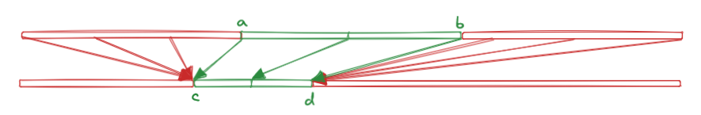
  </a>
  <figcaption style="font-style: italic; text-align: center;">Mapping interval [a,b] to [c,d]<br></figcaption>
</figure>

That last part is critically important: if we're going to write an autopilot, we want to be able to effect proportional changes, but we want to "cap" those changes to some minimum and maximum value because just yanking the plane in some direction so hard that it stalls is the opposite of useful.

As such, let's implement `map` and `constrain` functions, and then compose them as `constrainMap`:

```javascript
// map a value relative to some range [a,b] to a new range [c,d]
function map(v, a, b, c, d) {
  const sourceInterval = b - a;
  if (sourceInterval === 0) return (c + d) / 2;
  const targetInterval = d - c;
  return c + (v - a) * targetInterval / sourceInterval;
}

// cap a number so that it's always in the range [min, max]
function constrain(v, min, max) {
  if (min > max) return constrain(v, max, min);
  return v > max ? max : v < min ? min : v;
}

// map a value from some range [a,b] to a new range [c,d], constrained to that new range [c,d]
function constrainMap(v, a, b, c, d) {
  return constrain(map(v, a, b, c, d), c, d);
}
```

We're going to rely on this function _a lot_, so now that we know what it does, and how it does it, let's move on to actual autopilot code.

## Implementing cruise control

Through the years different kinds of autopilots have been used, ranging from simple "cruise control" style systems that just keep the plane flying level, to full on auto-takeoff and auto-landing systems for modern commercial jet liners with fully automated navigation, with the pilot basically there to program the plane and taxi it to and from the runway, only still needed during flight in case they need to take over when things go wrong.

So let's start with the simplest of those systems: the autopilot equivalent of cruise control, which requires we implement some wing leveling code, and altitude hold.

### LVL: level mode

Implementing level mode is probably the easiest of all autopilot functions, where we're going to simply check "is the plane tilting left or right?" and if so, we move the **aileron trim**—a value that "biases" the plane to tilt left or right by adjusting the wing surfaces that tilt the plane—in the opposite direction. As long we do that a little bit at a time, and we do that for long enough, we'll eventually have the plane flying level.

So let's write some code. First, we'll define a constants file for housing things like autopilot modes:

```javascript
export const LEVEL_FLIGHT = `LVL`;
```

And then we use that, as well as a `trim` vector for tracking how much we need to trim by, in our autopilot:

```javascript
import { LEVEL_FLIGHT } from "./utils/constants.js";
import { flyLevel as fl } from "./fly-level.js";
let flyLevel = fl;

...

export class Autopilot {
  constructor(...) {
    ...
    this.modes = {
      [LEVEL_FLIGHT]: false,
    }
    this.trim = { x: 0, y: 0, z: 0 };
    ...
  }

  watchForUpdates() {
    ...
    // Since we'll be updating the fly-level file a few times, we'll hot-reload-watch it.
    addReloadWatcher(__dirname, `fly-level.js` (lib) => (flyLevel = lib.flyLevel));
  }

  async processChange(type, oldValue, newValue) {
    if (type === LEVEL_FLIGHT && newValue === true) {
        console.log(`Engaging level mode`);
        // Since we'll be increading and decreasing the aileron trim, we
        // want to make sure that we do that starting at whatever the user
        // had set it to, rather than starting at zero:
        const { AILERON_TRIM_PCT: x } = await this.get("AILERON_TRIM_PCT");
        this.trim.x = x;
      }
    }
    this.onChange(this.getAutoPilotParameters());
  }

  async runAutopilot() {
    ...
    const state = new State(data, this.prevState);

    // Do we need to level the wings?
    if (this.modes[LEVEL_FLIGHT]) flyLevel(this, state);

    this.prevState = state;
  }
}
```

And our "fly level" function in its own file:

```javascript
import { constrainMap, radians } from "./utils.js";

const MAX_D_BANK = radians(1);
const DEFAULT_TARGET_BANK = 0;
const SMALL_STEP = radians(1);
const BIG_STEP = 2 * SMALL_STEP;

export async function flyLevel(autopilot, state) {
  const { trim } = autopilot;

  // Get our current bank/roll information:
  const bank = degrees(state.bankAngle);
  const maxBank = constrainMap(state.speed, 50, 200, 10, 30);
  const dBank = state.dBank;
  const maxdBank = MAX_D_BANK;

  // How big should our corrections be, at most?
  const step = constrainMap(state.speed, 50, 150, SMALL_STEP, BIG_STEP);
  const s1 = step;
  const s2 = step / 2;

  // Get the current "how much are we off" information:
  const targetBank = DEFAULT_TARGET_BANK;
  const diff = targetBank - bank;

  // Correct our trim using values that are based on how much out-of-level we are. The bigger, the more we trim:
  let update = 0;
  update -= constrainMap(diff, -maxBank, maxBank, -s1, s1);
  update += constrainMap(dBank, -maxdBank, maxdBank, -s2, s2);

  if (!isNaN(update)) trim.x += update;
  autopilot.set("AILERON_TRIM_PCT", trim.x);
}
```

And done. Very little "real" code beyond just getting the values we need, and then setting our trim. But... what does this actually do?

- First off, we added a trim vector to our autopilot, so that we can use its `x` component for our left/right trimming here.
- Then, because some planes have explicit aileron trim controls, we want to make sure we don't "overwrite" any existing trim setting when we engage the autopilot, so we make sure to copy over the trim value into `trim.x` when the user toggles level flight on.
- We then implement our wing leveling code by solving two problems at the same time:
  1. we want to get to a situation where our **bank angle** (the angle of the wings with respect to level flight) is zero, and
  2. we want to get to a situation where our **bank acceleration** (how fast the bank angle changes per second) is also zero.

So we start by actually getting our current bank and bank acceleration values, and defining our maximum allowed values and then:

1. We correct our bank: if we're banking a lot, we want to correct a lot, and if we're banking a little, we want to correct just a little, but we always want to correct by at least a tiny amount. Which is exactly what we wrote `constrainMap` to do for us.
2. Then, we correct our bank acceleration by trimming opposite to the direction we're accelerating in. This will undo some of our bank correction, but as long as we use a smaller step size the code will "prioritize" zeroing our bank angle over our bank acceleration.
3. Finally, we update our trim, and then we wait for the autopilot to trigger this function again during the next run, letting us run through the same procedure, but with (hopefully!) slightly less wrong values. Provided that this function runs enough times, we'll converge on level flight, and that's exactly what we want.

### ALT: altitude hold

Next up: making the plane hold its vertical position. This requires updating the "elevator trim" (also known as pitch trim) rather than our aileron trim, by looking at the plane's vertical speed. That is, we're going to look at how fast the plane is moving up or down through the air, and then we try to correct for that by pitching the plane a little in the direction that counteracts that movement.

Let's add a new constant:

```javascript
export const LEVEL_FLIGHT = `LVL`;
export const ALTITUDE_HOLD = `ALT`;
```

And then add a new mode to our autopilot:

```javascript
import { LEVEL_FLIGHT, VERTICAL_HOLD } from "./utils/constants.js";

...

import { altitudeHold as ah } from "./altitude-hold.js";
let altitudeHold = ah;

export class Autopilot {
  constructor(...) {
    ...
    this.modes = {
      [LEVEL_FLIGHT]: false,
      [ALTITUDE_HOLD]: false,
    }
    ...
  }

  watchForUpdates() {
    ...
    // We'll watch this file for changes, too:
    addReloadWatcher(__dirname, `altitude-hold.js` (lib) => (altitudeHold = lib.altitudeHold));
  }

  async processChange(type, oldValue, newValue) {
    if (type === LEVEL_FLIGHT && newValue === true) {
        console.log(`Engaging level mode`);
        const { AILERON_TRIM_PCT: x } = await this.get("AILERON_TRIM_PCT");
        this.trim.x = x;
      }
    }
    if (type === ALTITUDE_HOLD) {
      console.log(`Engaging altitude hold at ${newValue} feet`);
      // Just like before, we want to start our automated trim relative
      // to whatever trim the user already set, not relative to zero.
      const { ELEVATOR_TRIM_POSITION: y } = await this.get("ELEVATOR_TRIM_POSITION");
      this.trim.y = y;
    }
    this.onChange(this.getAutoPilotParameters());
  }

  async runAutopilot() {
    ...
    const state = new State(data, this.prevState);

    if (this.modes[LEVEL_FLIGHT]) flyLevel(this, state);
    if (this.modes[ALTITUDE_HOLD]) altitudeHold(this, state);

    this.prevState = state;
  }
}
```

With a new file for our `altitudeHold` function:

```javascript
import { ALTITUDE_HOLD } from "./utils/constants.js";
import { radians, constrainMap, exceeds } from "./utils/utils.js";

const { abs } = Math;
const DEFAULT_MAX_dVS = 100;
const SMALL_TRIM = radians(0.001);
const LARGE_TRIM = radians(0.035);

export async function altitudeHold(autopilot, state) {
  // Each plane has different min/max pitch trim values, so how big should our trim steps be?
  const { trim } = autopilot;
  let trimLimit = state.pitchTrimLimit[0];
  trimLimit = trimLimit === 0 ? 10 : trimLimit;
  const small = constrainMap(trimLimit, 5, 20, SMALL_TRIM, LARGE_TRIM);
  const trimStep = 10 * small;

  // What are our vertical speed parameters?
  const { verticalSpeed: VS, dVS } = state;

  // What *should* they be in order to maintain our intended altitude?
  const targetAltitude = autopilot.modes[ALTITUDE_HOLD];
  const altDiff = targetAltitude - state.altitude;
  const maxVS = 1000;
  const targetVS = constrainMap(altDiff, -200, 200, -maxVS, maxVS);
  const diff = targetVS - VS;

  // Just like before: update the trim to nudge us towards the correct vertical speed:
  trim.y += constrainMap(diff, -maxVS, maxVS, -trimStep, trimStep);

  // And if we accelerating too much, counter-act that a little:
  const maxdVS = constrainMap(abs(diff), 0, 100, 0, DEFAULT_MAX_dVS);
  const dVSovershoot = exceeds(dVS, maxdVS);
  trim.y -= constrainMap(dVSovershoot, -maxdVS, maxdVS, -trimStep, trimStep);

  // Finally, apply this new trim:
  autopilot.set("ELEVATOR_TRIM_POSITION", trim.y);
}
```

Let's go over this code, too.

- Again because we added a trim vector to our autopilot, we can use its `y` component for our up/down trimming.
- And again, because some planes have explicit aileron trim controls, we want to make sure we don't "overwrite" any existing trim setting when we engage the autopilot, so we make sure to copy over the trim value into `trim.y` when the user turns altitude hold on.
- This time, we implement our altitude hold solving three problems at the same time :
  1. We want to get to a situation where our **vertical speed** (how much we're flying up or down) is zero, and
  2. we want that happen when the **difference between our current altitude and our hold altitude** is zero. And,
  3. we want to get to a situation where our **vertical acceleration** is also zero.

We can combine the first two by translating the difference between our current altitude and hold altitude into a target vertical speed: obviously when we're _at_ our hold altitude, we want the vertical speed to be zero; if the difference is positive, then we need to fly up, and so we want a positive vertical speed, and if the difference is negative, the opposite is true and we want a negative speed.

As such, we use the "universally safe vertical speed" of 1000 feet per minute as our maximum allowed vertical speed, and then we constrain-map our target vertical speed based on the altitude difference, `targetVS = constrainMap(altDiff, -200, 200, -maxVS, maxVS);`.

The only "cheating" is those `SMALL_TRIM` and `LARGE_TRIM` values, which aren't really based on the flight model: there just isn't really anything in the flight model that we can use to determine how big our trim step should be, so I just flew around MSFS for several days using different aeroplanes to find values that seemed reasonable in relation to the trim limits that we _do_ have access to. That's not ideal, but it's good enough.

### Testing our code

So let's do some testing! Let's get a few planes up in the air, manually trim them so they fly mostly straight ahead, and then turn on our own bespoke artisanal LVL mode! For this test, and every test we'll be doing for all the other modes we'll be implementing, we'll be using a cross section of the various planes in MSFS:

- The [De Havilland DHC-2 "Beaver"](https://en.wikipedia.org/wiki/De_Havilland_Canada_DHC-2_Beaver), a fun little piston engine bush plane.
- The [Cessna 310R](https://en.wikipedia.org/wiki/Cessna_310), a (very good looking) small twin turbo-prop plane.
- The [Beechcraft Model 18](https://en.wikipedia.org/wiki/Beechcraft_Model_18), a large twin radial engine aeroplane.
- The [Douglas DC-3](https://en.wikipedia.org/wiki/Douglas_DC-3), an almost four times bigger twin radial engine aeroplane.
- The [Top Rudder Solo 103](https://www.toprudderaircraft.com/product-page/103solo-standard), an ultralight that no sane person would stick an autopilot in. So we will. Because we can.

#### Adding autopilot buttons to our web page

Before we can test this code, we'll need a way to actually trigger both the autopilot, as well as the different autopilot modes, so let's write a quick bit of UI for our web page:

```html
<div id="autopilot" class="controls">
  <link rel="stylesheet" href="/css/autopilot.css" />

  <button class="MASTER">AP</button>
  <button title="level wings" class="LVL">LVL</button>
  <label>Target altitude: </label>
  <input class="altitude" type="number" min="0" max="40000" value="1500" step="100">
  <button title="altitude hold" class="ALT">ALT</button>
</div>
```

With some super simple CSS:

```CSS
#autopilot {
  margin: 0.5em 0;
}

#autopilot input[type="number"] {
  width: 5em;
}

#autopilot button.active {
  background: red;
  color: white;
}
```

And a bit of client-side JS for controlling the server-side autopilot through our web page:

```javascript
import { getAutoPilotParameters, callAutopilot } from "./api.js";

export const AP_DEFAULT = {
  MASTER: false,
  LVL: false,
  ALT: false,
};

export class Autopilot {
  constructor(owner) {
    console.log(`linking up autopilot controls`);
    this.owner = owner;

    // Bind click-handling to all the autopilot elements:
    Object.keys(AP_DEFAULT).forEach((key) => {
      const e = document.querySelector(`#autopilot .${key}`);
      e.addEventListener(`click`, () => {
        e.classList.toggle(`active`);
        let value = e.classList.contains(`active`);
        if (value) {
          // An if in an if looks a bit weird, but we're going to add more options here, later.
          if (key === `ALT`) value = document.querySelector(`#autopilot .altitude`).value ?? 1500;
        }
        callAutopilot(`update`, { [key]: value });
      });
    });

    // Add a change handler to the altitude input field:
    document
      .querySelector(`#autopilot .altitude`)
      .addEventListener(`change`, (evt) => {
        const { value } = evt.target;
        callAutopilot(`update`, { ALT: value });
        evt.target.blur();
      });

    // And then start checking autopilot parameters every second.
    setInterval(async () => this.bootstrap(await getAutoPilotParameters()), 1000);
  }

  // Take the current autopilot values, and update our webpage to reflect those.
  bootstrap(params) {
    Object.entries(params).forEach(([key, value]) => {
      // Mark buttons as active or not, depending on their AP state.
      const e = document.querySelector(`#autopilot .${key}`);
      if (!e) return;
      const fn = !!value ? `add` : `remove`;
      e.classList[fn](`active`);

      // And set the altitude input element value to whatever the autopilot says it should be is:
      if (value && key === `ALT`) {
        const altitude = document.querySelector(`#autopilot .altitude`);
  		  // Make sure that when we're focussed on the altitude field, we don't keep overwriting
	    	// its content with "the current value from the autopilot" when we get AP parameter updates.
        if (altitude === document.activeElement) return;
        altitude.value = parseFloat(value).toFixed(1);
      }
    });
  }

  // If the autopilot is not currently engaged, we set the altitude input from the plane's current altitude.
  setCurrentAltitude(altitude) {
    if (!document.querySelector(`.ALT.active`)) {
      document.querySelector(`#autopilot .altitude`).value = altitude;
    }
  }
}
```

With a tiny tweak to `plane.js` to call that `setCurrentAltitude` function while we're flying:

```javascript
  async updatePage(data) {
    ...

    const { airBorn, speed, ..... } = this.state;
    this.autopilot.setCurrentAltitude(alt);

    ...
  }
```

And of course, this also requires making sure our client-side API code can send and receive autopilot parameter data:

```javascript
let currentAutopilotParameters = false;

export function callAutopilot(action, params = false) {
  socket.json(`autopilot`, { action, params });
}

export async function connectAPI(...) {
  ...
     ...
        // we had this one before
        if (action === `event`) {
          const { eventName, result } = data;
          eventHandlers[eventName]?.forEach((fn) => fn(eventName, result));
        }

        // and we're adding this new action handler for autopilot work:
        else if (action === `autopilot`) {
          // when the server sends us updated AP parameters, cache them.
          currentAutopilotParameters = data;
        }

        else {
     ...
  ...
}

...

// We make our "get parameters" function use the cache we declared above:
export function getAutoPilotParameters() {
  return new Promise((resolve) => {
    // Return the last-known AP parameters, if we have any:
    if (currentAutopilotParameters !== false) {
      return resolve(currentAutopilotParameters);
    }

    // Or, if they're not cached already, get the server to send us the
    // current AP parameters, so they can get cached.
    const timer = setInterval(() => {
      if (currentAutopilotParameters !== false) {
        resolve(currentAutopilotParameters);
        clearInterval(timer);
      }
    }, 100);
  });
}
```

And with that we can get to testing,  by getting our planes up in the air, manually trimming them to "mostly straight", and then clicking the `LVL` and `VSH` buttons on our webpage, then clicking the `AP` button to have our autopilot take over.

#### De Havilland DHC-2 "Beaver"

The beaver is a very light, nimble little plane, and with trim limits of +/-18 it's quite easy to tr-

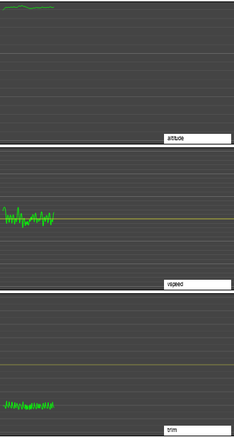

Okay wait, let's put one more thing into our code, because we're oscillating around zero quite hard and that's just unnecessary. Let's open our `altitude-hold.js` and make a minor adjustment:

```javascript
export async function altitudeHold(autopilot, state) {
  ...

  // Use a separate variable to track our corrections instead of directly updating trim.y:
  let update = 0;

  // Add the trim based on altitude difference:
  update += constrainMap(diff, -maxVS, maxVS, -trimStep, trimStep);

  // And the trim based on vertical acceleration:
  const maxdVS = constrainMap(abs(diff), 0, 100, 0, DEFAULT_MAX_dVS);
  const dVSovershoot = exceeds(dVS, maxdVS);
  update -= constrainMap(dVSovershoot, -maxdVS, maxdVS, -trimStep, trimStep);

  // And then scale the effect of our nudge so that the closer we are to our target, the less we actually
  // adjust the trim. This is essentially a "damping" to prevent oscillating, where we over-correct, then
  // over-correct the other way in response, then over-correct in response to THAT, and so on and so on.
  if (abs(diff) < 100) update /= 2;
  if (abs(diff) < 20) update /= 2;

  // Finally, update our trim vector and apply it to the plane:
  if (!isNaN(update)) trim.y += update;
  autopilot.set("ELEVATOR_TRIM_POSITION", trim.y);
}
```

There. It's not fancy or clever, but it should dampen the effect of our trim if we're close to our intended hold altitude.

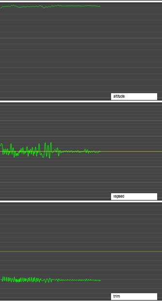

There we go. That makes much more sense. You can see where we swapped out the original code to the "with damping" code, and the difference is profound. The altitude curve is much flatter, and the vertical speed graph, which tells us how much we're constantly correcting, is much closer to zero. So let's try some more planes!

#### Cessna 310R

The 310R is still relatively light, and responds to trim quite quickly. it has trim limits of +/-20, and our code makes it fly straighter than an arrow. Because arrows fall out of the sky. And our plane just keeps going.

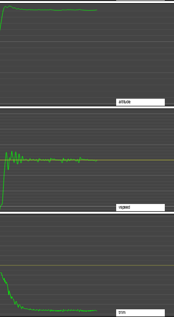

#### Beechcraft Model 18

This plane is a delight to fly, and has trim limits of +/- 30. It's slow to respond, but that actually helps us in this case because our autopilot only runs once every half second.

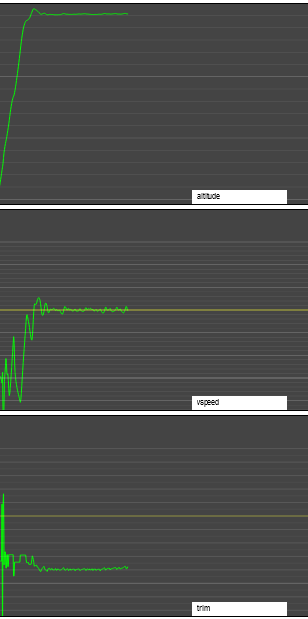

#### Douglas DC-3

This lumbering beast has trim limits of +/- 12 and will overshoot if you let it. However, it does respond to trim instructions, and it _will_ end up going where we tell it to go. It just takes it a while, and it'll be bouncy.

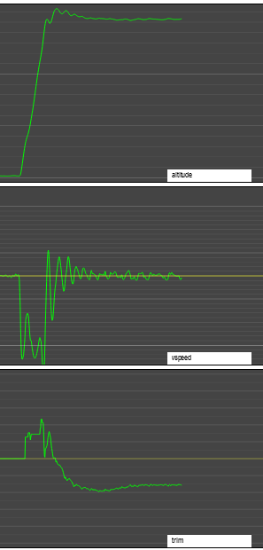

#### Top Rudder Solo 103

This ultralight has +/-12 trim, but of course, this type of plane was never meant to have an autopilot. Under no circumstances should you try to add one in real life. But this is a video game, so let's see what happens if we add one anyway!

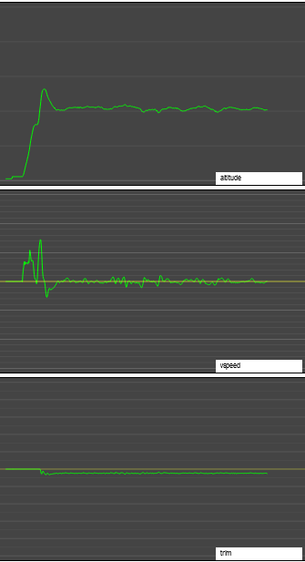

What happens is that we've just bolted cruise control onto an ultralight. Madness! Glorious madness. This plane was never meant to fly this stable, and I'm here for it. And if you made it this far into the tutorial, you are too, probably. But.... we can do better. Or rather, we can do more.

## A basic autopilot

An autopilot that can only do cruise control isn't really all that useful: sure, it lightens the load on the pilot, but we don't just want to say "fly straight", we want to at least be able to say "fly that way, at this altitude" and then change both of those as needed throughout the flight. And as it turns out, with the work that we've already done implement level flight and altitude hold, adding a heading mode and altitude transitioning is surprisingly easy.

### HDG: flying a heading

You may recall that our wing leveling code had a `targetBank` that was set to zero. So what if we just... not set it to zero? What if, instead, we set it to a value proportional with how far off we are from some specific compass heading?

First, let's extend our autopilot so it knows about this new mode:

```javascript
export const LEVEL_FLIGHT = `LVL`;
export const ALTITUDE_HOLD = `ALT`;
export const HEADING_MODE = `HDG`;
```

With a small update to our Autopilot that also sets a little visual indicator in-game:

```javascript
import { LEVEL_FLIGHT, HEADING_MODE, ALTITUDE_HOLD } from "./utils/constants.js";
import { flyLevel } from "./fly-level.js";

...

export class Autopilot {
  constructor(...) {
    ...
    this.modes = {
      [LEVEL_FLIGHT]: false,
      [HEADING_MODE]: false,
      [ALTITUDE_HOLD]: false,
    }
    ...
  }

  ...

  async processChange(type, oldValue, newValue) {
    if (type === HEADING_MODE) {
      if (newValue !== false) {
        console.log(`Engaging heading hold at ${newValue} degrees`);
        // let's update the heading bug in MSFS so that we can see which heading the plane is meant to fly:
        this.set("AUTOPILOT_HEADING_LOCK_DIR", newValue);
      }
    }
    ...
  }
}
```

Then, let's write a little helper function that turns a heading into a target bank, with an associated maximum turn rate:

```javascript
import { getCompassDiff } from "./utils.js";

export async function flyLevel(autopilot, state) {
  ...
}

function getTargetBankAndTurnRate(autopilot, state, maxBank) {
  const heading = degrees(state.heading);
  let targetBank = DEFAULT_TARGET_BANK;
  let maxTurnRate = DEFAULT_MAX_TURN_RATE;

  // If there is an autopilot flight heading set then we set a new
  // target bank, somewhere between zero and the maximum bank angle
  // we want to allow, with the target bank closer to zero the closer
  // we already are to our target heading.
  let flightHeading = autopilot.modes[HEADING_MODE];
  if (flightHeading) {
    const hDiff = getCompassDiff(heading, flightHeading);
    targetBank = constrainMap(hDiff, -30, 30, maxBank, -maxBank);
    maxTurnRate = constrainMap(abs(hDiff), 0, 10, 0.02, maxTurnRate);
  }

  return { targetBank, maxTurnRate };
}
```

And then we use that function instead of setting our `targetBank` and `maxTurnRate` directly as part of our "fly level" function:

```javascript
export async function flyLevel(autopilot, state) {
  const { trim } = autopilot;

  ...

  // How big our corrections are going to be:
  ...
  const s5 = step / 5;

  // Our "how much are we off" information:
  const turnRate = degrees(state.turnRate);
  const { targetBank, maxTurnRate } = getTargetBankAndTurnRate(autopilot, state, maxBank);;
  const diff = targetBank - bank;

  let update = 0;
  update -= constrainMap(diff, -maxBank, maxBank, -s1, s1);
  update += constrainMap(dBank, -maxdBank, maxdBank, -s2, s2);

  // Since we're adding turning to the mix, make sure to counteract "turning too fast":
  const overshoot = exceeds(turnRate, maxTurnRate);
  if (overshoot !== 0) update -= constrainMap(overshoot, -maxTurnRate, maxTurnRate, -s5, s5);

  if (!isNaN(update)) trim.x += update;
  autopilot.set("AILERON_TRIM_PCT", trim.x);
}
```

And that's it, that's all we have to do. We can now specify a heading, and the plane will turn to face that direction.

The only complicated bit is that `getCompassDiff` function, because arithmetic with compass angles is a bit tricky: the numbers "wrap around" from 360 inclusive to 0 exclusive, so the difference between 350° and 10° is 20°, but the difference between 10° and 350° is -20°, not 340°. And while 270° + 90° is 360°, 270° + 90.01° is 0.01°:

```javascript
function getCompassDiff(current, target) {
  if (target < current) target += 360;
  const diff = (target - current + 360) % 360;
  return diff <= 180 ? diff : -(360 - diff);
}
```

And with that, there really isn't anything else to say. Except maybe for those magic numbers: you'll note that the turn rate gets capped at 30 degrees, which is the universal "aeroplanes must be able to turn this bank many degrees safely". Of course, for ultralights, that might not apply, but we'll see how well it goes.

### ALT: changing altitudes on the fly

With heading mode implemented, let's also update our altitude hold code to become altitude "set-and-hold" instead. Meaning that instead of telling our autopilot to hold the altitude we were at when we turned on ALT mode, we're now going to simply give it new altitudes and then hope it knows how to get there all on its own.

First, we'll... err... do nothing? We don't need any new constants or updates to our `autopilot.js` code, or in fact _any_ new code: we already wrote all the code we needed by translating our altitude difference into a vertical speed.

Job done, how easy was that?!

### Testing our code again

Let's do some new testing: we'll spawn our planes at cruise altitude, manually trim them to fly straight at around 240 degrees on the compass, then turn on altitude hold at 1000 feet above where they spawned and change their heading by 90 degrees at the same time, then once they get to the desired heading and altitude, we'll set the values back to 1000 feet lower and -90 degrees,  and see how they fare.

Of course we'll need to update our web page so we can actually set a heading:

```html
<div id="autopilot" class="controls">
  <link rel="stylesheet" href="/css/autopilot.css" />

  <button class="MASTER">AP</button>
  <button title="level wings" class="LVL">LVL</button>
  <label>Target altitude: </label>
  <input class="altitude" type="number" min="0" max="40000" value="1500" step="100">
  <button title="altitude hold" class="ALT">ALT</button>
  <label>Target heading: </label>
  <input class="heading" type="number" min="1" max="360" value="360" step="1">
  <button class="HDG">HDG</button>
</div>
```

With an update to our client-side autopilot JS as well:

```javascript
import { getAutoPilotParameters, callAutopilot } from "./api.js";

export const AP_DEFAULT = {
  MASTER: false,
  LVL: false,
  ALT: false,
  HDG: false,
};

export class Autopilot {
  constructor(owner) {
    this.owner = owner;

    // Since heading needs an input field, let's add it here:
    Object.keys(AP_DEFAULT).forEach((key) => {
      const e = document.querySelector(`#autopilot .${key}`);
      e.addEventListener(`click`, () => {
        e.classList.toggle(`active`);
        let value = e.classList.contains(`active`);
        if (value) {
          // Add the heading mode to the if-block for getting values from input elements:
          if (key === `ALT`) value = document.querySelector(`#autopilot .altitude`).value ?? 1500;
          if (key === `HDG`) value = document.querySelector(`#autopilot .heading`).value ?? 360;
        }
        callAutopilot(`update`, { [key]: value });
      });
    });

    document
      .querySelector(`#autopilot .altitude`)
      .addEventListener(`change`, (evt) => {
        const { value } = evt.target;
        callAutopilot(`update`, { ALT: value });
        evt.target.blur();
      });

    // Then, as for altitude, so too for heading:
    document
      .querySelector(`#autopilot .heading`)
      .addEventListener(`change`, (evt) => {
        const { value } = evt.target;
        callAutopilot(`update`, { HDG: value });
        evt.target.blur();
      });

    setInterval(async () => this.bootstrap(await getAutoPilotParameters()), 1000);
  }

  bootstrap(params) {
    Object.entries(params).forEach(([key, value]) => {
      const e = document.querySelector(`#autopilot .${key}`);
      const fn = !!value ? `add` : `remove`;
      e.classList[fn](`active`);

      if (value && key === `ALT`) {
        const altitude = document.querySelector(`#autopilot .altitude`);
        if (altitude === document.activeElement) return;
        altitude.value = value;
      }

      // And the same here:
      if (value && key === `HDG`) {
        const heading = document.querySelector(`#autopilot .heading`);
        if (heading === document.activeElement) return;
        heading.value = value;
      }
    });
  }
}
```

And done, we should be good to go, let's start our tests with the probably-least-likely-to-work:

#### Top Rudder Solo 103

I say least likely, because while flying straight isn't too taxing, and flying a heading isn't too taxing, and flying up or down isn't super hard, doing everything at once _may_ just be a bit too much for an ultralight, so let's see ho-

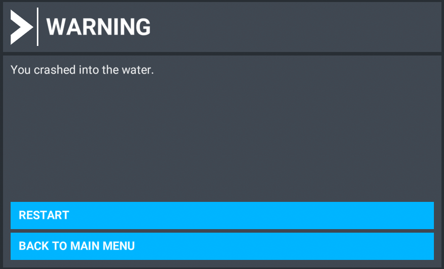

Oh.... okay, that did not end well. What happened?

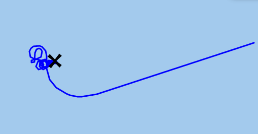

Ahh.... right. When you're flying an ultralight, maybe don't try to ascend by 1000 feet. Let's make an exception here and use 200 feet differences instead.

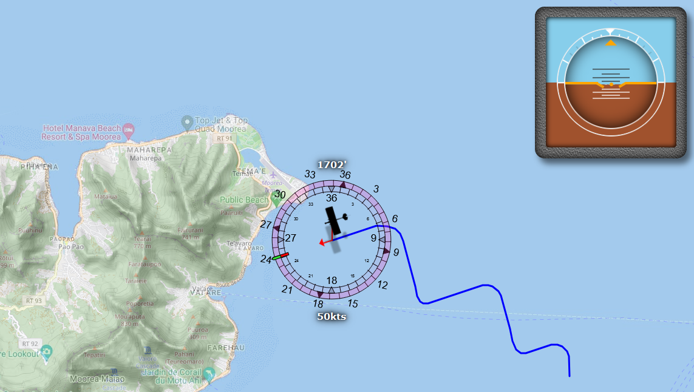

Oh look, we lived!

<div>
  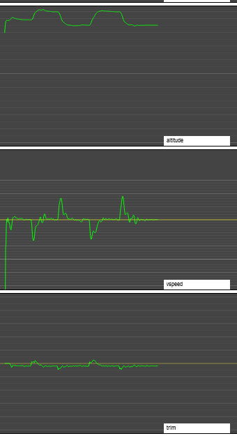
  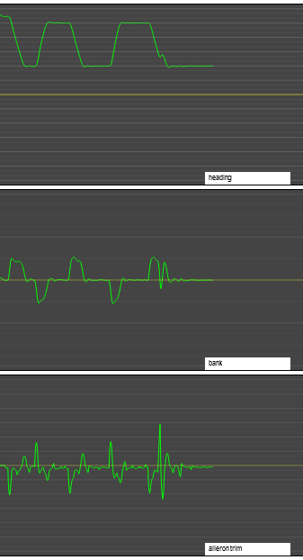
</div>

Much better. 200 feet is quite doable for the Top Rudder, and you can see the heading transitioning quite well, too. And tell me this isn't the best way to enjoy Tahiti.


#### De Havilland DHC-2 "Beaver"

How much better does the Beaver fare? Quite a lot, actually. It can do the 1000 feet climb and descent just fine (which is good: it's an aeroplane, so it'd better) although we can see a bit of an overshoot. Nothing too terrible, but if we were better programmers maybe we could have prevented that. Then again, maybe not, because autopilot programming is far from trivial, so we'll take it!

<div>
  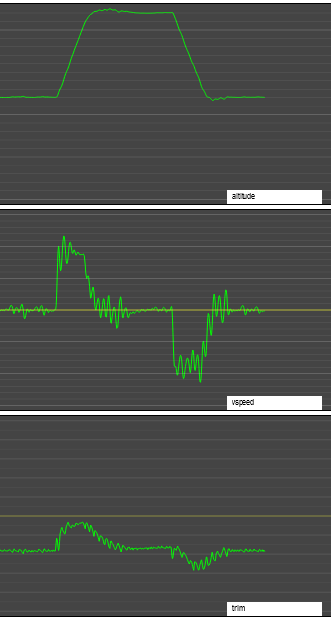
  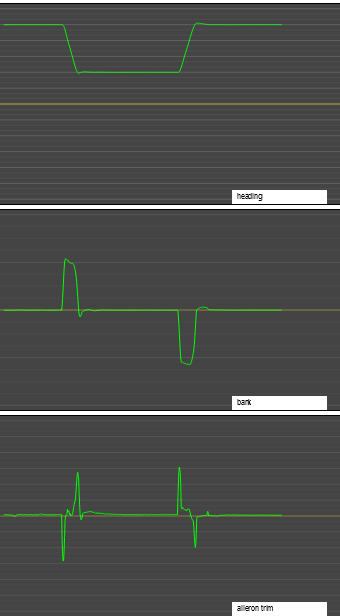
</div>

We also see that heading mode works quite well, with only a small overshoot that gets almost immediately corrected for.

#### Cessna 310R

The best plane for autopilot code, the 310R goes where we tell it to, when we tell it to, and goes as straight as straight goes.

<div>
  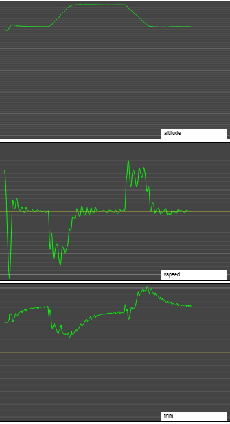
  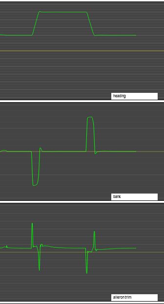
</div>

#### Beechcraft Model 18

The model 18 performs surprisingly well, which shouldn't be too surprising given that it has honking huge engines, and is nice and slow to respond to autopilot instructions.

<div>
  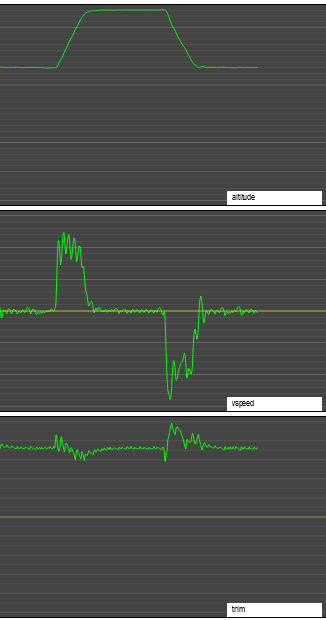
  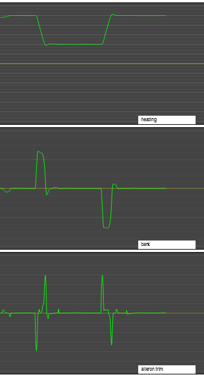
</div>


#### Douglas DC-3

Much like the model 18, the DC-3 is a bit "wibbly" (we'd definitely feel it pitching up and down more), but overall even this lumbering behemoth just does what the autopilot asks of it.

<div>
  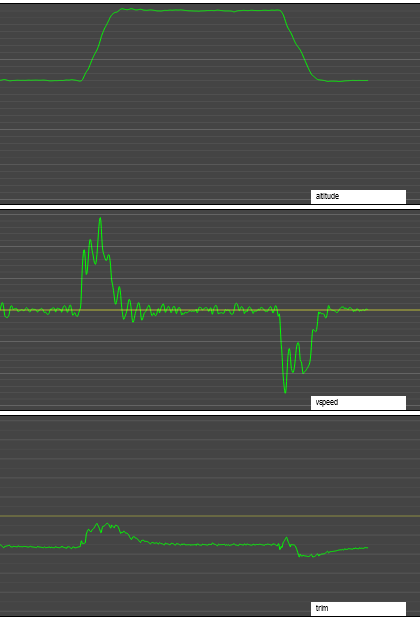
  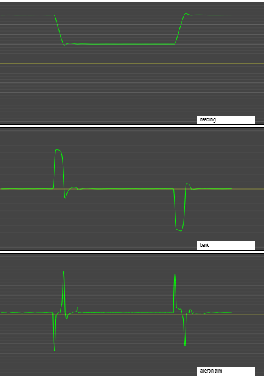
</div>


## A fancy autopilot

But what if we want to get fancier? Let's add two different kinds of fancy: first, an auto-throttle so that we fly at the optimal speed in level flight, and then "terrain follow" mode, where we tell the autopilot to automatically adjust our altitude setting so we're a safe distance from the ground, rather than flying a fixed altitude.

### Auto throttle

First we'll tackle the easy one: auto-throttling to make sure our plane doesn't fly with maxed out engines the entire flight. where "the entire flight" means "until the engines catch fire and we crash, ending our flight"...

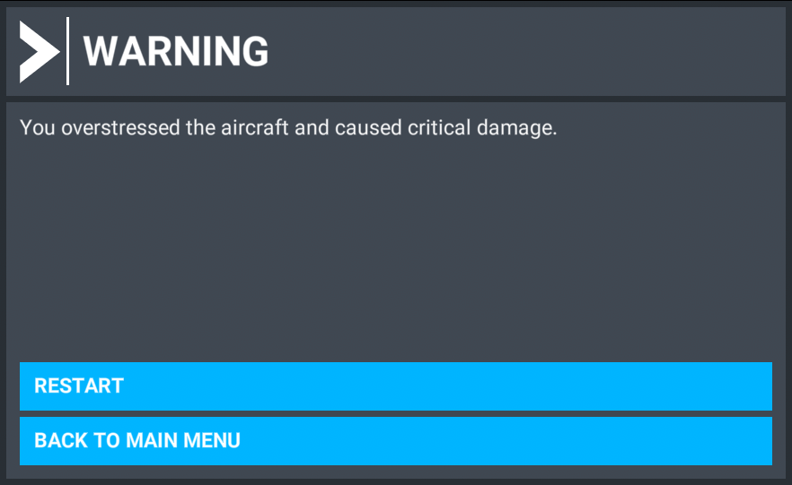

Broadly speaking there are three parts to auto throttling:

1. what to do in level flight.
2. what to do when we're climbing, and
3. what do do when we're descending.

Each of these has plane-specific constraints, based on speed:

1. Cruise is controlled by the plane's known "optimal cruise speed", known as `Vc`.
2. Climb rate is controlled by the plane's known "optimal climb speed", known as `Vy`, meaning that the climb rate is based on how fast the plane can go, not a predefined vertical speed value.
3. Descent is controlled by the plane's "never exceed" speed, known as `Vne`. When descending, we can rapidly pick up speed, and if the plane ends up going faster than `Vne` we might end up damaging the plane. Or straight up ripping it apart mid-flight. Which isn't great.

MSFS exposes `Vy` and `Vc`, but we don't have direct access to `Vne` and so we're going to make the executive decision to simply not exceed `Vc` during descent. That's probably more conservative that we need to be, but having an aeroplane that stays in one piece is probably worth being a little conservative over. We then stub a little function for auto throttling:

```javascript
async function autoThrottle(state, api, altDiff, targetVS) {
  // async, because we'll be using our API, but for now let's not "do" anything yet.
  return targetVs;
}
```

Then we tie that into a `getTargetVS` function:

```javascript
async function getTargetVS(autopilot, state, maxVS) {
  ...

  let targetVS = DEFAULT_TARGET_VS;
  const targetAltitude = autopilot.modes[ALTITUDE_HOLD];
  if (targetAltitude) {
    const altDiff = targetAltitude - state.altitude;
    targetVS = constrainMap(altDiff, -200, 200, -maxVS, maxVS);

    // If we are, then we also want to boost our ability to control
    // vertical speed, by using a (naive) auto-throttle procedure.
    if (autopilot.modes[AUTO_THROTTLE]) {
      targetVS = await autoThrottle(state, autopilot.api, altDiff, targetVS);
    }
  }

  // Safety: if we're playing with the throttle, then we'll want an extra rule:
  // if we're close to our stall speed, and we need to climb, *climb less fast*.
  // A simple rule, but quite an important one.
  if (targetVS > 0) {
    const { DESIGN_SPEED_CLIMB: dsc, DESIGN_SPEED_VS1: dsvs1 } =
      await autopilot.api.get(`DESIGN_SPEED_CLIMB`, `DESIGN_SPEED_VS1`);
    targetVS = constrainMap(state.speed, dsvs1, dsc, targetVS / 2, targetVS);
  }

  return targetVS;
}
```

Which we'll make the `altitudeHold` function tap into:

```javascript
export async function altitudeHold(autopilot, state) {
  ...

  // What are our VS parameters?
  const { verticalSpeed: VS, dVS } = state;
  const maxVS = 1000;
  const targetVS = await getTargetVS(autopilot, state, maxVS);
  const diff = targetVS - VS;

  ...
}
```

And, unsurprisingly, we need a new autopilot mode:

```javascript
export const LEVEL_FLIGHT = `LVL`;
export const ALTITUDE_HOLD = `ALT`;
export const HEADING_MODE = `HDG`;
export const AUTO_THROTTLE = `ATT`;

// and a constant we're going to need: how many feet per second is 1 knot?
export const KNOT_IN_FPS = 1.68781;
```

With an update to our autopilot class... but this time with auto throttle marked as "we want this on by default" rather than it being disabled by default:

```javascript
import { LEVEL_FLIGHT, ALTITUDE_HOLD, HEADING_MODE, AUTO_THROTTLE,  } from "./utils/constants.js";
...
export class Autopilot {
  constructor(...) {
    ...
    this.modes = {
      [LEVEL_FLIGHT]: false,
      [ALTITUDE_HOLD]: false,
      [HEADING_MODE]: false,
      [AUTO_THROTTLE]: true, // we want this turned on unless the user chooses to turns it off.
    };
    ...
  }
  ...
}
```

That covers all the "boiler plate", time to implement our actual auto-throttling:

```javascript
const { round } = Math;
const ATT_PROPERTIES = [
  `DESIGN_SPEED_CLIMB`,
  `DESIGN_SPEED_VC`,
  `NUMBER_OF_ENGINES`,
];

async function autoThrottle(state, api, altDiff, targetVS) {
  const { verticalSpeed: VS } = state;
  const speed = round(state.speed);

  // Get our safety values:
  const {
    DESIGN_SPEED_CLIMB: sc,
    DESIGN_SPEED_VC: vc,
    NUMBER_OF_ENGINES: engineCount,
  } = await api.get(...ATT_PROPERTIES);

  // Some of which we want in knots, not feet per second...
  const cruiseSpeed = round(vc / KNOT_IN_FPS);
  const climbSpeed = round(sc / KNOT_IN_FPS);

  const throttleStep = 0.2;
  const tinyStep = throttleStep / 10;
  const ALT_LIMIT = 50;
  const BRACKET = 2;

  const adjustment = constrainMap(abs(altDiff), 0, ALT_LIMIT, tinyStep, throttleStep);
  const change = (v) => changeThrottle(api, engineCount, v);

  // "Case 1": are we at or near cruise altitude, with a VS that isn't getting "boosted" if we can throttle?
  if (abs(altDiff) < ALT_LIMIT) {
    console.log(`at/near cruise altitude`);
    if (speed < cruiseSpeed - BRACKET && VS < 15) {
      console.log(`throttle up from ${speed} to cruise speed (${cruiseSpeed})`);
      change(constrainMap(cruiseSpeed - speed, 0, 10, adjustment, throttleStep));
    }
    if (speed > cruiseSpeed + BRACKET && VS > -15) {
      console.log(`throttle down from ${speed} to cruise speed (${cruiseSpeed})`);
      change(-constrainMap(speed - cruiseSpeed, 0, 10, adjustment, throttleStep));
    }
  }

  // "Case 2": if we're not, and we need to climb, throttle the plane up to optimal climb speed.
  else if (altDiff > ALT_LIMIT) {
    console.log(`altDiff > ${ALT_LIMIT}`);
    if (speed < climbSpeed) {
      console.log(`throttle up from ${speed} to climb speed (${climbSpeed})`);
      change(adjustment);
    } else if (VS < 0.8 * targetVS) {
      console.log(`throttle up to increase VS from ${VS} to ${targetVS}`);
      change(adjustment);
    }
  }

  // "Case 3": if we're not, then we need to descend. Throttle to maintain a safe speed.
  else if (altDiff < -ALT_LIMIT) {
    console.log(`altDiff < -${ALT_LIMIT}`);
    if (speed > cruiseSpeed + BRACKET) {
      console.log(`throttle down from ${speed} to cruise speed (${cruiseSpeed})`);
      change(-adjustment);
    } else if (speed < cruiseSpeed - BRACKET) {
      console.log(`throttle up from ${speed} to cruise speed (${cruiseSpeed})`);
      change(adjustment / 2);
    }
    // Also, as this represents a potentially dangerous situation, we return a smaller target to slow the descent.
    return constrainMap(speed, climbSpeed - 20, climbSpeed, 0, targetVS);
  }

  return targetVS;
}
```

We see each of our three cases as distinct blocks

1. In level flight, or near enough to it, we throttle up or down depending on whether we're flying at a speed lower or higher than our aeroplane's `Vc`. However, in order not to interfere too much with vertical/altitude hold, we don't throttle when the plane's already moving in the same direction that throttling would (i.e. throttling up will make the plane rise, and throttling down will make the plane drop, so only throttle up if we're not already going up, and conversely, don't throttle down if we're already descending). We also throttle according to how much of a difference there is, so that the closer to our target we are, the less we disturb the aeroplane's vertical travel.
2. When we need to climb, we want "all the power". We're going to throttle up to make sure we can maintain our rated climb speed, as well as when we can't even make 80% of the requested vertical speed.
3. Finally, when we need to descend we want to pack off on the power to make sure we don't exceed our "never exceed" speed, even if we're pretending that value is the same as our cruise speed. However, because we know cruise speed is quite a bit less than "never exceed" speed, we also have an extra bit that throttles us back up to cruise speed, should we drop below that.

Finally, there's one extra bit that we can add that's going to almost never be relevant unless we're in jumbo jets: overspeed protection. This is a warning system in jets that we're running too hot and we need to cool our jets, so:

```javascript
const { round } = Math;
const ATT_PROPERTIES = [
  ...
  `OVERSPEED_WARNING`
];

async function autoThrottle(state, api, altDiff, targetVS) {
  const { verticalSpeed: VS } = state;
  const speed = round(state.speed);

  const {
    ...
    OVERSPEED_WARNING: overSpeed,
  } = await api.get(...ATT_PROPERTIES);

  ...

  // If the over-speed warning is going off, drastically reduce speed
  // (although over-speeding is mostly a jumbo jet issue).
  if (overSpeed === 1) {
    console.log(`!!! over-speed !!!`);
    change(-5 * throttleStep);
  }

  return targetVS;
}
```

Nothing complicated here: read the warning light, if it's on, reduce throttle a whole bunch.

With that, we should at least not break up mid-flight due to power stress, so let's take advantage of that and make the plane fly at "not just one fixed altitude" all the time: now that we should be able to change altitudes safely, let's add a bit of a "tourist mode" to our autopilot!

### Using waypoints

The goal here is to set up something like this:

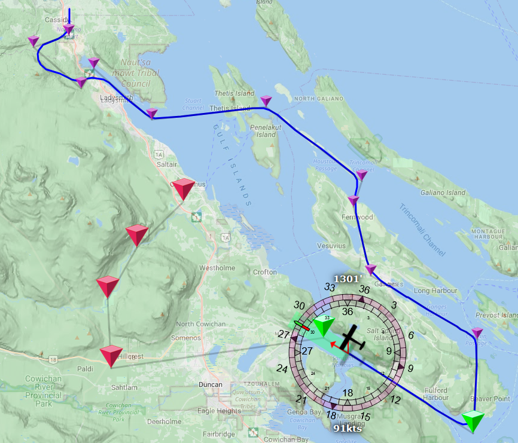

With our plane flying towards a waypoint, and then when it gets close, transitioning to the next waypoint's heading. Flying towards a point is pretty easy, but transitioning in a way that "feels right" is a bit more work, so there might be a bit more code here than you'd expect. Plus, we want to place, move, and remove points using the map on our web page, but the actual waypoints themselves will live in the autopilot, so there's a bit of work to be done there, too.

As such, we're going to need to break down waypoint logic as a few separate tasks:

1. the server side, which is the authority on which waypoints exist and which one we're flying towards,
   1. which requires having code that models waypoints, and
   2. requires updating to our heading mode to made the plane fly along our flight path.
2. the client side, which lets us place and (re)move waypoints,
   1. which requires some Leaflet code for placing, showing, and moving waypoints as markers, and
   2. some regular JS for synchronizing with the server on waypoint information

#### The server side

We'll start with a model for waypoints:

```javascript
// a silly little id function, but we don't need full uuids here
const nextId = (() => { let id = 1; return () => id++; })();

export class Waypoint {
  constructor(owner, lat, long, alt = false) {
    this.id = nextId();
    this.owner = owner;
    this.reset();
    this.move(lat, long);
    this.elevate(alt);
  }

  reset() {
    this.completed = false;
    this.active = false;
    this.next = undefined;
  }

  // Set this waypoint's GPS location:
  move(lat, long) {
    this.lat = lat;
    this.long = long;
  }

  // set this waypoint's altitude
  elevate(alt) {
    // are we removing the elevation information by passing something falsey?
    if (!alt) return (this.alt = false);

    // We are not, so much sure the value we got is a sensible number.
    alt = parseFloat(alt);
    if (!isNaN(alt) && alt > 0) this.alt = alt;
  }


  // Since waypoints define a flight path, it's useful to have a reference to "the next waypoint" (if there is one):
  setNext(next) { this.next = next; }

  // Waypoints can be (de)activated and completed.
  activate() { this.active = Date.now(); }
  deactivate() { this.active = false; }
  complete() { this.completed = true; }

  // And since we need to send them to the client, make sure that when this gets turned into JSON,
  // we do *not* include the owner object. The toJSON() function is really useful for that.
  toJSON() {
    const { id, lat, long, alt, active, complete, next } = this;
    return { id, lat, long, alt, active, completed, next: next?.id };
  }
}

```

And that's all we need them to do. Next up, a little waypoint manager:

```javascript
import { KMS_PER_KNOT, HEADING_MODE } from "./constants.js";
import {
  degrees,
  dist,
  getHeadingFromTo,
  getDistanceBetweenPoints,
  pathIntersection
} from "./utils.js";
import { Waypoint } from "./waypoint.js";

const { abs } = Math;

export class WayPoints {
  constructor(autopilot) {
    this.autopilot = autopilot;
    this.reset();
  }

  reset() {
    this.points = [];
    this.currentWaypoint = undefined;
  }

  // Make sure that if someone asks for all waypoints, they don't get a reference to the actual array.
  getWaypoints() {
    return this.points.slice();
  }

  // Add a waypoint for a specific GPS coordinate
  add(lat, long, alt) {
    const { points } = this;
    const waypoint = new Waypoint(this, lat, long, alt);
    points.push(waypoint);
    // If we don't have a "current" point, this is now it.
    this.currentWaypoint ??= waypoint;
    this.resequence();
    return waypoint;
  }

  // Move a waypoint around
  move(id, lat, long) {
  	this.points.find((e) => e.id === id)?.move(lat, long);
  }

  // Change a waypoint's elevation
  elevate(id, alt) {
    this.points.find((e) => e.id === id)?.elevate(alt);
  }

  // Remove a waypoint from the flight path
  remove(id) {
    const { points } = this;
    const pos = points.findIndex((e) => e.id === id);
    if (pos > -1) {
      points.splice(pos, 1)[0];
      if (this.currentWaypoint?.id === id) {
        this.currentWaypoint = this.currentWaypoint.next;
      }
      this.resequence();
    }
  }

  // Make sure all waypoints point to the next one in the flight path.
  resequence() {
    const { points } = this;
    for (let i = points.length - 1; i >= 0; i--) {
      points[i].setNext(points[i + 1]);
    }
  }

  // remove all active/completed flags from all waypoints and mark the first point as our active point.
  resetWaypoints() {
    this.points.forEach((waypoint) => waypoint.reset());
    this.resequence();
    this.currentWaypoint = this.points[0];
  }

  // Move the currently active waypoint to "the next" waypoint. Which might be nothing.
  transition() {
    const { currentWaypoint: c } = this;
    c.complete();
    this.currentWaypoint = this.currentWaypoint.next;
  }

  getHeading(state) {
    // We'll implement this function in a bit since it's the important one.
  }
}
```

We'll come back to the `getHeading` function in a bit, since that's the part that we'll tap into in our heading mode code to determine where to steer the plane, but for now let's close the loop so we can send and receive waypoint information to and from the client, where we see and work with them on our Leaflet map.

First, we update the server's autopilot code, so it can do waypoint things (which is mostly passing things on to the waypoint manager):

```javascript
export class AutoPilot {
  constructor(api, onChange = () => {}, lat = 0, long = 0) {
    ...
    this.waypoints = new WayPoints(this, lat, long);
  }

  // Read and pass-through functions for waypoints:
  getWaypoints() { return this.waypoints.getWaypoints(); }
  addWaypoint(lat, long) { this.waypoints.add(lat, long); }
  moveWaypoint(id, lat, long) { this.waypoints.move(id, lat, long); }
  elevateWaypoint(id, alt) { this.waypoints.elevate(id, alt); }
  removeWaypoint(id) { this.waypoints.remove(id); }
  resetFlight() { this.waypoints.resetWaypoints(); }

  getAutoPilotParameters() {
    const state = {
      MASTER: this.autoPilotEnabled,
      // add the waypoint information to our autopilot parameters:
      waypoints: this.waypoints.getWaypoints(),
    };
    Object.entries(this.modes).forEach(([key, value]) => {
      state[key] = value;
    });
    return state;
  }

  ...
}
```

With an update to our server so that we can actually "talk waypoints" in our autopilot message handling:

```javascript
    ...

    if (action === `autopilot`) {
      // Autopilot messages need to be further unpacked:
      const { action, params } = data;

      if (action === `update`) {
        autopilot.setParameters(params);
      }

      // We add a new action for waypoint handling, with three possible specific instructions:
      if (action === `waypoint`) {
        const { lat, long, alt, move, elevate, id, remove, reset } = data.params;
        if (reset)        { autopilot.resetFlight(); }
        else if (move)    { autopilot.moveWaypoint(id, lat, long); }
        else if (elevate) { autopilot.elevateWaypoint(id, alt); }
        else if (remove)  { autopilot.removeWaypoint(id); }
        else { autopilot.addWaypoint(lat, long, alt); }
      }

      socket.json(`autopilot`, autopilot.getAutoPilotParameters());
    }

    ...
```

So nothing too fancy, mostly just "the bare minimum code necessary to forward data into where it gets handled", and because we added the waypoints to our autopilot parameter set, the client will automatically get them as part of its autopilot interval polling.

#### The client side

In fact, let's switch to the client side and update the data handler for that interval poll:

```javascript
export class Autopilot {
  ...

  bootstrap(params) {
    Object.entries(params).forEach(([key, value]) => {
      // if we see the waypoints key, we don't want to send this on as a standard
      // autopilot property, we want to do some special handling instead.
      if (key === `waypoints`) {
        return this.owner.manageWaypoints(value);
      }
      ...
    });
  }

  ...
}
```

With a corresponding update in our `plane.js`:

```javascript
export class Plane {
  constructor(map, location, heading) {
    console.log(`building plane`);
    // set up a waypoint overlay on our Leaflet map
    this.waypoints = new WaypointOverlay(this, map);
    ...
  }

  ...

  // and just forward all the data we get from the autopilot straight to the overlay
  async manageWaypoints(data) { this.waypoints.manage(data); }
  ...
};
```

Which just leaves implementing the code for managing Leaflet markers that represent our waypoints:

```javascript
import { callAutopilot } from "./api.js";
import { Trail } from "./trail.js";

export class WaypointOverlay {
  constructor(autopilot, map) {
    this.autopilot = autopilot;
    this.map = map;
    this.waypoints = [];
    this.setupMapHandling();
  }

  // Set up the event handling for the map: if we click, put a new waypoint on that GPS location.
  setupMapHandling() {
    this.map.on(`click`, (e) => this.add(e));
    // ...we'll be adding some more to this function later!
  }

  // The "manage" function takes all the waypoint information we got from the
  // autopilot and turns it into Leaflet marker add/update or remove instructions.
  manage(waypoints) {
    // Manage each waypoint that's in the list.
    waypoints.forEach((waypoint) => this.manageWaypoint(waypoint));

    // So we need to remove any waypoints from our map?
    if (waypoints.length < this.waypoints.length) {
      const toRemove = this.waypoints.filter(
        (w) => !waypoints.find((e) => e.id === w.id)
      );
      const noAPcall = true;
      toRemove.forEach((waypoint) => this.remove(waypoint));
    }
  }

  // This function gets called for all waypoints that the autopilot says exist.
  manageWaypoint(waypoint) {
    const { waypoints } = this;
    const { id } = waypoint;
    // That means that they're either new points, or updates to points we already know about.
    const known = waypoints.find((e) => e.id === id);
    if (!known) return this.addNewWaypoint(waypoint);
    this.updateKnownWaypoint(known, waypoint);
  }

  // Adding a new waypoint means creating a new marker:
  addNewWaypoint(waypoint) {
    // And remember that if we refresh the page mid-flight, we might get a bunch
    // of waypoints that have already been completed, so take that into account.
    const { id, lat, long, completed } = waypoint;

    // First we create a Leaflet icon, which is a div with custom size and CSS classes.
    const icon = L.divIcon({
      iconSize: [40, 40],
      iconAnchor: [20, 40],
      className: `waypoint-div`,
      html: ``,
    });

     // Then we create a Leaflet marker that uses that icon as its visualisation.
    const marker = (waypoint.marker = L.marker(
      { lat, lng: long },
      { icon, draggable: true }
    ).addTo(this.map));

    // Then we add event listeners: when we click on a marker, we should be able to set its
    // altitude, and if we double-click a marker, it should get removed from the flight path.
    //
    // Leaflet has click and double click handle, but doesn't actually debounce clicks to see
    // if something was a double click. It just fires off spurious clicks *as well*, which isn't
    // great, so we need to run our own debounce code:
    let dblClickTimer = false;

    marker.on(`dblclick`, () => {
      clearTimeout(dblClickTimer);
      dblClickTimer = false;
      this.remove(waypoint);
    });

    marker.on(`click`, () => {
      if (dblClickTimer) return;
      dblClickTimer = setTimeout(() => {
        dblClickTimer = false;
        let value = prompt("Set waypoint altitude:", waypoint.alt);
        this.elevate(waypoint, value);
      }, 500);
    });

    // Next up: if we click-drag a marker, we want the server-side waypoint to update when we let go.
    marker.on(`drag`, (event) => (marker.__drag__latlng = event.latlng));
    marker.on(`dragend`, () => this.move(waypoint));

    // Then, because we want to see the path, not just individual markers, we
    // also build trails between "the new marker" and the previous one.
    const prev = this.waypoints.slice(-1)[0];
    this.waypoints.push(waypoint);
    if (prev) {
      waypoint.prev = prev;
      prev.next = waypoint;
      waypoint.trail = new Trail(this.map, [prev.lat, prev.long], `var(--flight-path-colour)`);
      waypoint.trail.add(lat, long);
    }
  }

  // A helper function for building waypoint-connecting trails
  addNewTrail(lat, long) {
    return new Trail(this.map, [lat, long], `var(--flight-path-colour)`);
  }

  // Updating a known marker means checking if it moved, or changes active/completed states:
  updateKnownWaypoint(known, { lat, long, active, completed }) {
    // First, are we currently dragging this point around? If so, don't
    // do anything to this point yet, because we're not done with it.
    if (known.marker?.__drag__latlng) return;

    // Did its location change?
    if (known.lat !== lat || known.long !== long) {
      known.lat = lat;
      known.long = long;
      known.marker.setLatLng([lat, long]);

      // if it did, we also need to update the trail(s) that connect to it.
      const prev = known.prev;
      if (prev) {
        // we can do this by updating the existing trail, but it's just as easy to just create a new one.
        known.trail?.remove();
        known.trail = this.addNewTrail(prev.lat, prev.long);
        known.trail.add(lat, long);
      }
      const next = known.next;
      if (next) {
        next.trail.remove();
        next.trail = this.addNewTrail(lat, long);
        next.trail.add(next.lat, next.long);
      }
    }

    // Do we need to update its altitude information?
    if (alt) {
      known.alt = alt;
      const div = known.marker.getElement();
      if (div && div.dataset) div.dataset.alt = `${alt}'`;
    }

    const css = known.marker._icon.classList;

    // Are we in the transition radius?
    known.active = active;
    if (active) { classes.add(`active`); } else { classes.remove(`active`); }

    // Or did we complete this waypoint?
    known.completed = completed;
    if (completed) { classes.add(`completed`); } else { classes.remove(`completed`); }
  }

  // the "add a marker" handler for map clicks
  add({ latlng }) {
    // remember, the server is the authority on waypoints, so when we click the map,
    // instead of immediately creating a marker we instead tell the autopilot to create
    // a waypoint. If it does, we'll find that new waypoint when manage() gets called.
    const { lat, lng: long } = latlng;
    callAutopilot(`waypoint`, { lat, long });
  }

  // the "move a marker" handler for marker click-drags
  move({ id, marker }) {
    const { lat, lng: long } = marker.__drag__latlng;
    marker.__drag__latlng = undefined;
    callAutopilot(`waypoint`, { update: true, id, lat, long });
  }

  // the "update the waypoint's elevation" call
  elevate({ id }, alt) {
    callAutopilot(`waypoint`, { elevate: true, id, alt });
  }

  // the "remove a marker" handler for marker clicks. Note that if this is a real
  // map click, we should tell the server that we want it removed, but if this gets
  // called from our own manage(waypoints) function, in response to the server having
  // sent us waypoint information that does not include some waypoints we're still
  // showing, then removing it from the map should *not* also come with a call to
  // the server to remove it. It already doesn't exist!
  remove(waypoint, withAPIcall = false) {
    if (!waypoint.id) {
      waypoint = this.waypoints.find((e) => e.id === waypoint);
    }

    const { id } = waypoint;

    // Send a remove call to the autopilot only if this was a client-initiated removal
    if (withAPIcall) callAutopilot(`waypoint`, { id, remove: true });

    // Removing the mark from our map is pretty easy:
    waypoint.marker.remove();
    waypoint.trail?.remove();

    // But this marker may have been in between to other markers, in which case
    // we need to link up its previous and next marker with a new trail.
    const prev = waypoint.prev;
    const next = waypoint.next;
    if (next) {
      next.trail.remove();
      if (prev) {
        next.trail = this.newTrail(prev.lat, prev.long);
        next.trail.add(next.lat, next.long);
        prev.next = next;
      }
      next.prev = prev;
    } else if (prev) {
      prev.next = undefined;
    }
  }

  // And finally, remember to remove the waypoint from the array:
  const pos = this.waypoints.findIndex((e) => e.id === id);
  this.waypoints.splice(pos, 1);
}
```

And of course, the image we're using for waypoints:


With a smattering of CSS to make our markers look reasonable:

```CSS
:root {
  --flight-path-colour: #0003;
}

.waypoint-div {
  border: none;
  background: transparent;
}

.waypoint-div::before {
  content: attr(data-alt);
  position: relative;
  width: 40px;
  display: inline-block;
  text-align: center;
  bottom: -40px;
  text-shadow: 0px 0px 5px black, 0px 0px 10px black, 0px 0px 15px black;
  color: white;
  font-weight: bold;
}

.waypoint-div img.waypoint-marker {
  z-index: 1 !important;
  opacity: 1;
  width: 100%;
  height: 100%;
  position: relative;
  top: -20px;
}

.waypoint-div.active img.waypoint-marker {
  filter: hue-rotate(145deg) brightness(2);
}

.waypoint-div.completed img.waypoint-marker {
  filter: hue-rotate(-45deg);
  opacity: 1;
  width: 20px !important;
  height: 20px !important;
  position: relative;
  top: 0px;
  left: 10px;
}
```

We can now place a bunch of waypoints by clicking the map, which will send a waypoint creation message to the server, which creates the _actual_ waypoint, which we're then told about because the waypoints are now part of our autopilot information that we send to the client every time the autopilot updates.

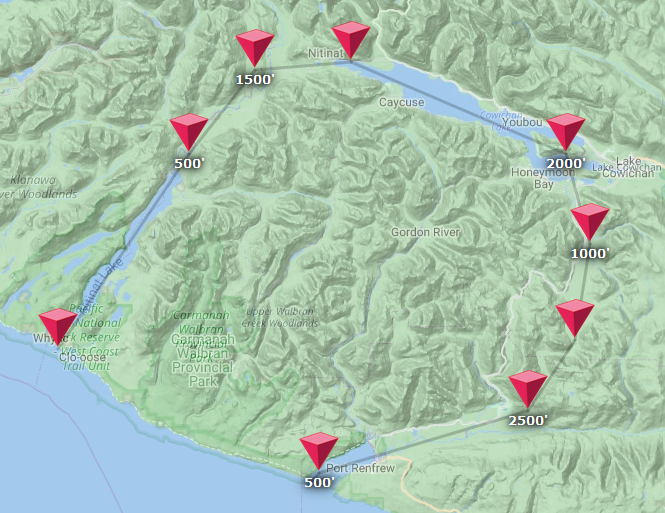

#### Flying and transitioning over waypoints

Of course with all this setup we still need to actually make the plane _fly_ using our waypoints, so let's update our server-side autopilot, specifically the `getTargetBankAndTurnRate` function that we use as part of `flyLevel`:

```javascript
function getTargetBankAndTurnRate(autopilot, state, maxBank) {
  const heading = degrees(state.heading);

  let targetBank = DEFAULT_TARGET_BANK;
  let maxTurnRate = DEFAULT_MAX_TURN_RATE;

  // Are we flying using waypoints?
  const { waypoints } = autopilot;
  const waypointHeading = waypoints.getHeading(state);
  if (waypointHeading) {
    autopilot.setTarget(HEADING_MODE, waypointHeading);
  }
  ...

  return { targetBank, maxTurnRate };
}
```

And then, finally, let's fill in that `getHeading` function. In fact, let's first take a little detour to figure out how we even want to do that.

##### Flight path policies

Say we have [a plane, and a bunch of waypoints](https://gist.github.com/Pomax/73dd18907f23362731cdebba7652f0e0/):

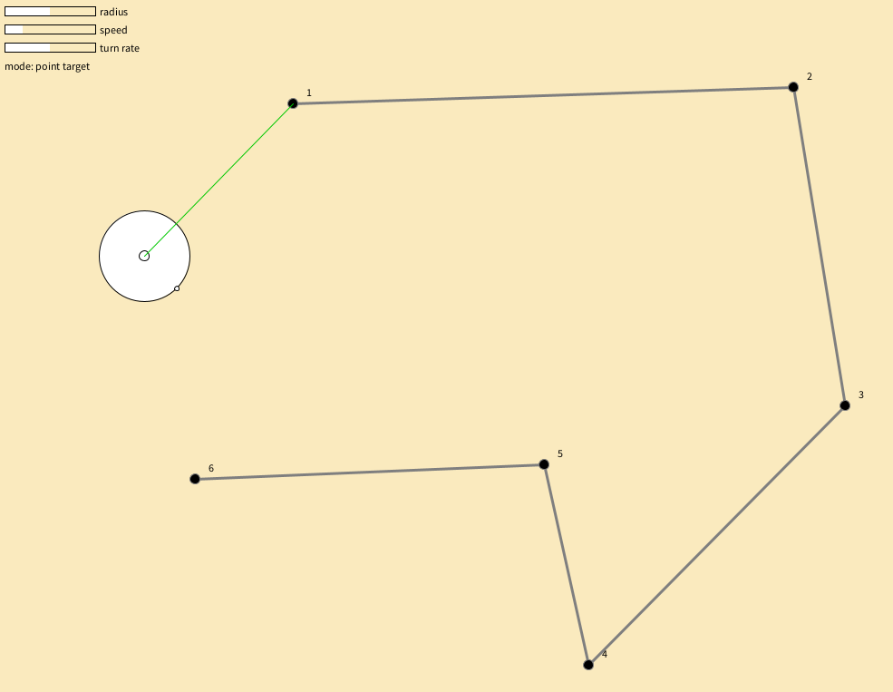

If we pretend that the circle is an aeroplane, with the little dot showing its current heading, the question is "what should happen over time?". In fact, let's answer that by starting simpler, with zero waypoints:


Obviously, "what should happen over time?" here is "the plane should just fly in whatever heading it's already going". So far so good! But now we add a waypoint:

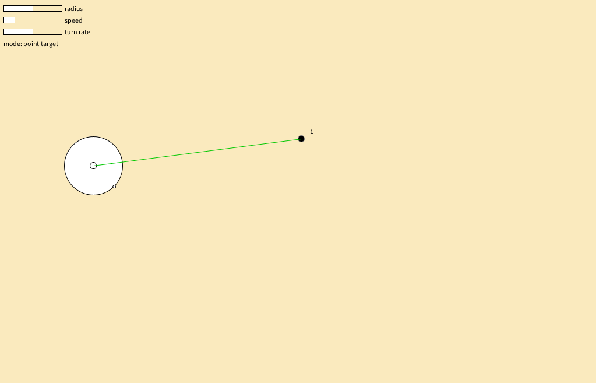

What we probably want is for the plane to calculate the angle from itself to that waypoint, and then fly the associated heading, as indicated in green. That heading is going to change over time, because we can't just instantly change course, but it'll get us to our waypoint:

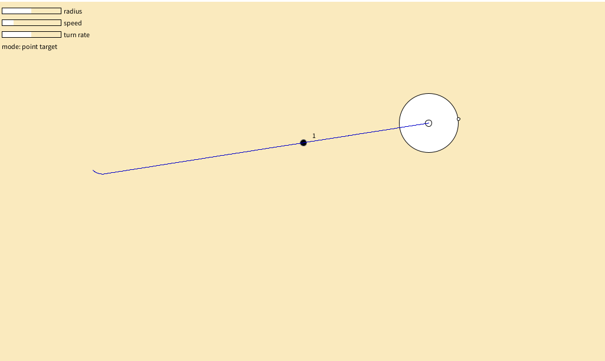

And if the plane is flying quickly, or has a low turning rate, it takes it a bit longer, and will transition over the waypoint at a different angle:

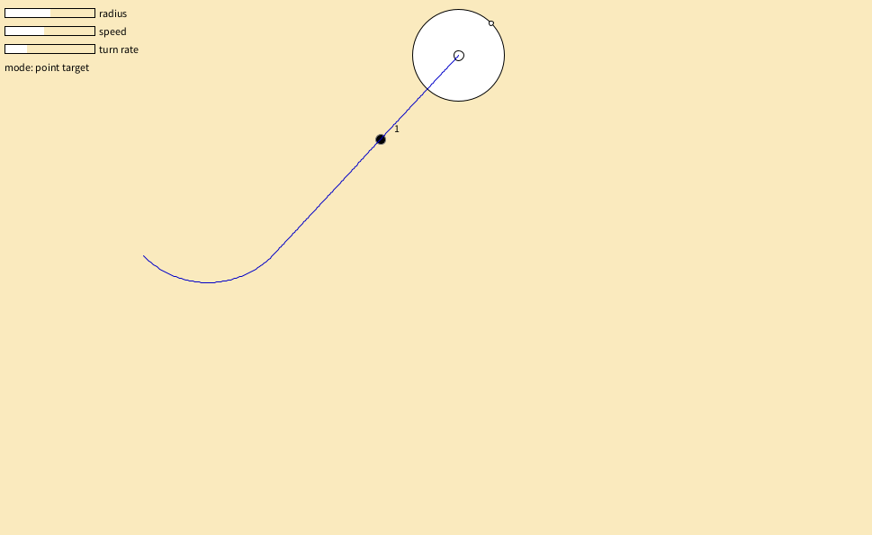

What if we add another waypoint? We probably want the aeroplane to target the first waypoint, and then once it gets there, target the next point. In pseudo-code

```pseudocode
current = 0
target = waypoints[current]
if dist(plane, target) < 20 -> curent = current + 1
```

This gives us the following behaviour:

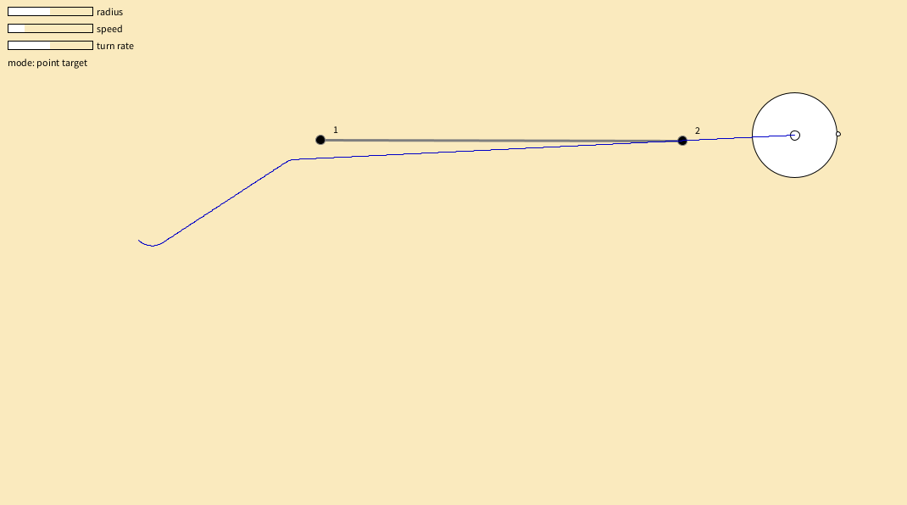

That might work, and if we try this with more points we get something that kinda feels like a flight path, although it's not great:

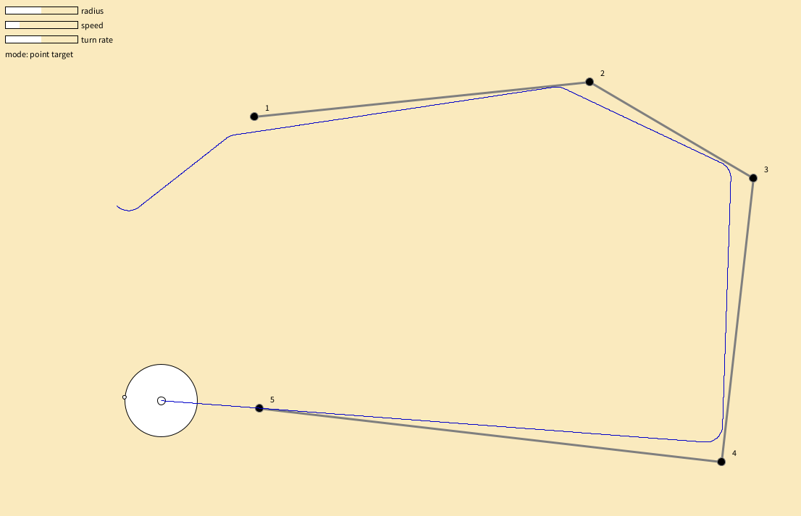

We're never actually "on" the flight path, we're always kinda next to it at a different angle. But it gets really problematic with steeper angles and bigger turning circles:

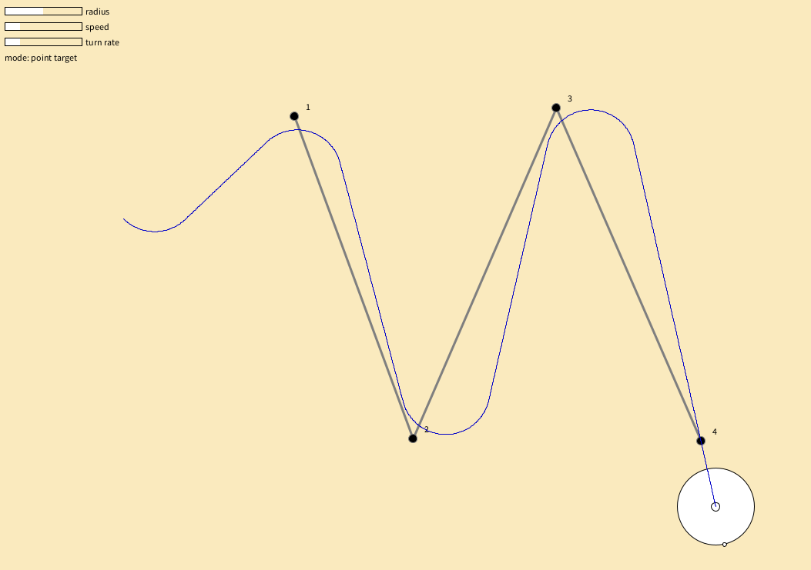

That's basically terrible, this is not flying a flight plan, this is a drunk pilot, and not something we'd want to use. So we're going to have to give up on purely looking at the waypoints themselves. Instead, let's look at the paths between them: we can project the plane's position onto a path, picking the first point if the projection would lie outside the path, and then use that as our target. In pseudocode:

```pseudocode
current = 0

target = ???

if target exists -> plane.target(target)

plane.target = target:
  a = angle to target
  direction = sign of the angle difference between a and plane.heading;
  plane.heading = direction * some value that scales with fast the plane can turn
```

to figure out what the target should be, let's draw some more things. First, if we're not near the flight path, we want the following:

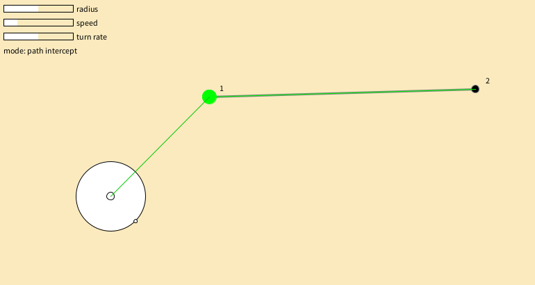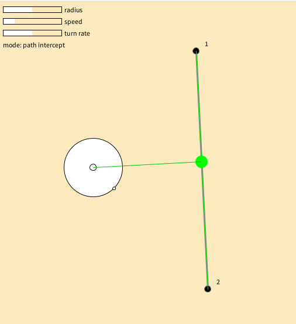


However, when we get close to the flight path, we want to target the point where our circle intersects the line, nearest to the next waypoint:

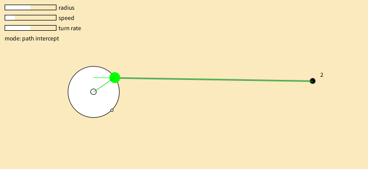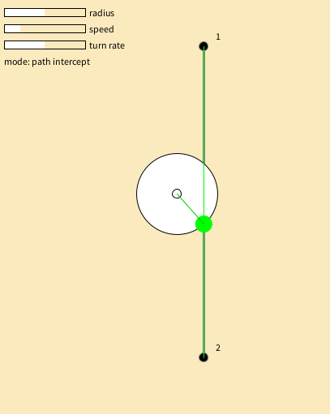

So if we express that in pseudo-code:

```pseudocode
p1 = waypoints[current]

p2 = waypoints[current + 1]
if p2 exists -> i1 = projection for our plane onto line p1--p2

p3 = waypoints[current + 2]
if p3 exists -> i2 = projection for our plane onto line p2--p3

target = i1
if dist(plane, p2) < radius ->
    current = current + 1
    if i2 exists -> target = i2

if target exists -> plane.target(target)
```

So what happens when we use _that_? Sure, we need to recompute that point every frame, but maths is cheap, so if it looks better, it's probably worth it:

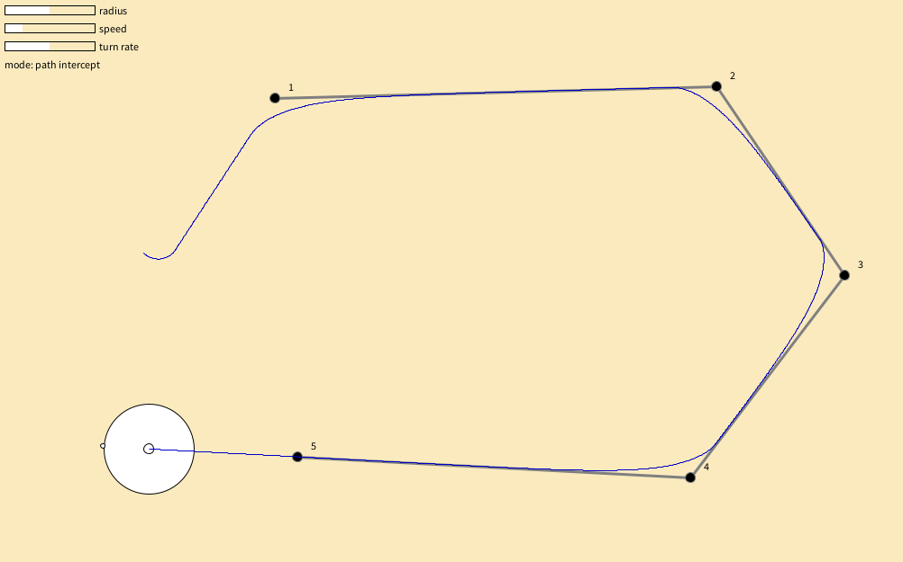

And it is: instead of never actually being on the flight path itself, we're now on the flight path _the majority of the time_. And a "switchback" style flight path is suddenly far less problematic:

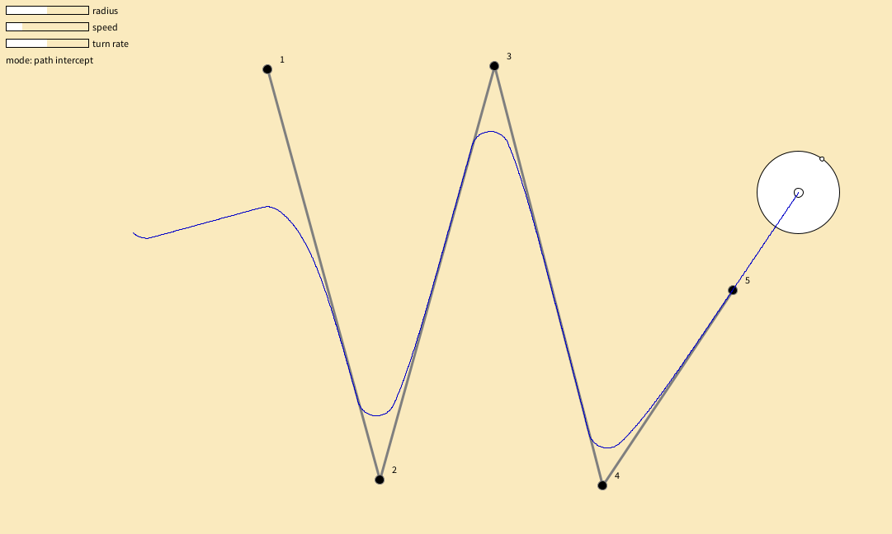

Although of course we still need to make sure our turns aren't unrealistically drastic. For instance, the same switch back path with a very-slow-to-turn plane wouldn't be great:

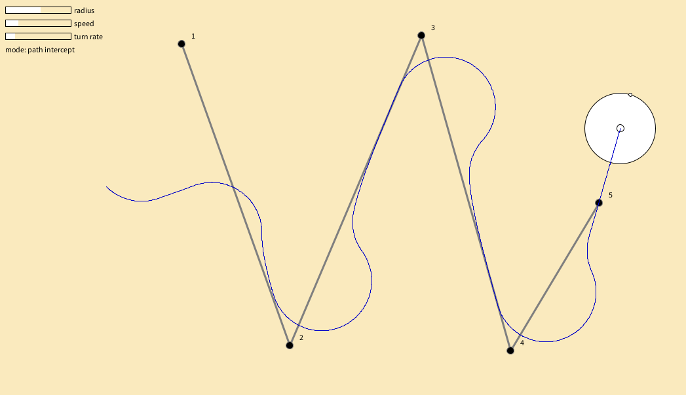

And we also need to pick a good radius, because if it's too small, we'll overshoot (potentially so much that we need to circle back):

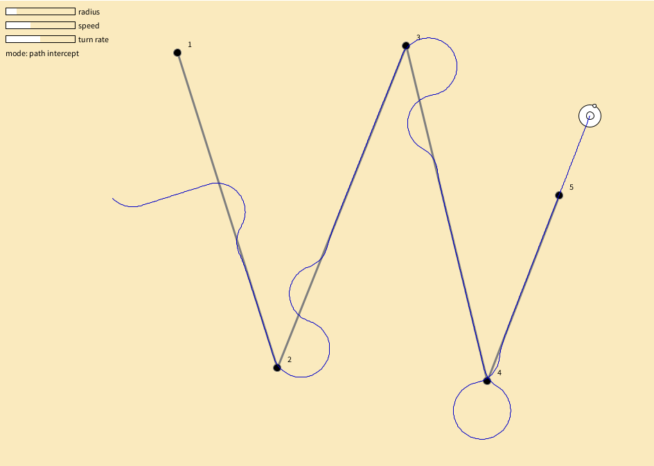

And if it's too large, we'll basically smooth our path too much:

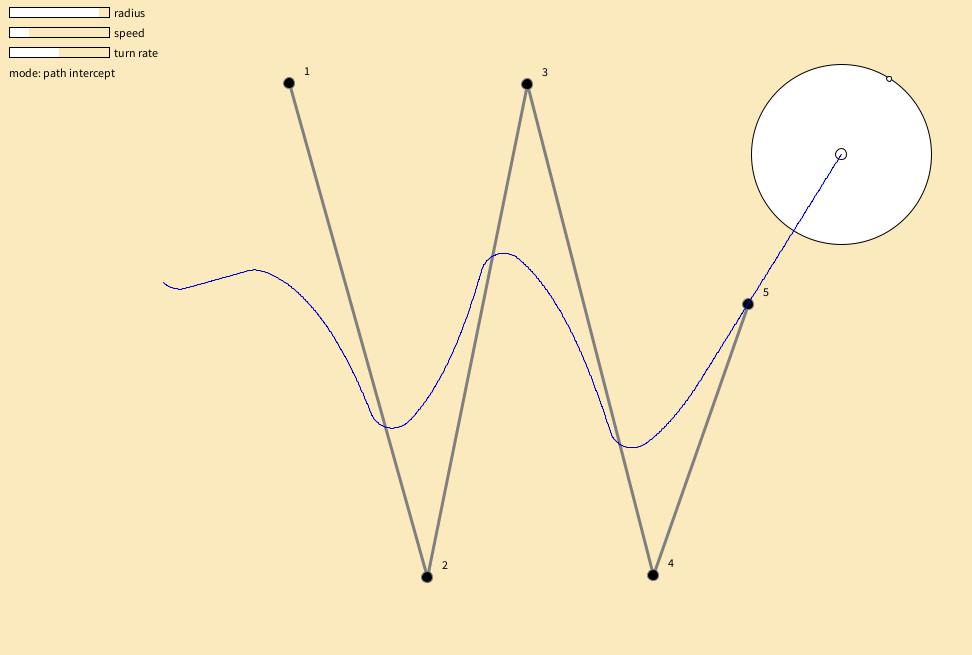

So the trick is to pick a good radius based on how fast a plane can make a turn. The faster a plane can turn, the smaller we can make its transition radius, and the slower it turns, the bigger that radius will need to be. So let's switch from pseudo-code to actual code, and let's get to implementing!

```javascript
import { pathIntersection } from "./utils.js";

...

export class WayPoints {
  ...

  getHeading(state) {
    const { modes } = this.autopilot;
    let heading = modes[HEADING_MODE] || degrees(state.heading);

    const { latitude: cy, longitude: cx, speed, declination } = state;
    const { currentWaypoint: p1 } = this;

    // If there's no current waypoint, don't change the heading.
    if (!p1) return heading;

    // If there is, make sure it'll show as active on the client-side map
    const { lat: p1y, long: p1x } = p1;
    const p2 = p1.next;
    p1.activate();

    // Is there a next waypoint? If not, and we're coming up to the current waypoint,
    // complete the flight path by calling the transition() function
    if (!p2) {
      const d1 = getDistanceBetweenPoints(cy, cx, p1y, p1x);
      if (d1 < 0.5) {
        this.transition();
        return;
      }
      // If we did not transition, return the heading that points at p1, corrected for
      // magnetic declination, because otherwise we'll fly in the wrong direction!
      heading = getHeadingFromTo(cy, cx, p1y, p1x);
      return (heading - declination + 360) % 360;
    }

    // If there is a next point, we have a path we can work with.
    const { lat: p2y, long: p2x, next: p3 } = p2;
    p2.activate();

    // our initial target is simply going to be "the current waypoint"
    let target = p1;

    // And then we do some maths: we base our transition radius on how fast the aeroplane's going,
    // under the generally true rule that the faster the plane, the bigger the turning circle.
    const transition_time = 30;
    const transitionRadius = 0.01 * speed * KMS_PER_KNOT * transition_time;

    // Find the intersection point of our "circle" with the path segment between current and next.
    // Note that if that intersection lies outside the segment, it'll return the closes endpoint.
    const i1 = pathIntersection(p1x, p1y, p2x, p2y, cx, cy, transitionRadius);

    // Is there a path segment from the next point to the point after that?
    let i2 = undefined;
    if (p3) {
      const { lat: p3y, long: p3x } = p3;
      i2 = pathIntersection(p2x, p2y, p3x, p3y, cx, cy, transitionRadius);
    }

    // First guess: our target is that first intersection
    if (i1) target = i1;

    // If we're close enough to p2, update our target to i2 and switch the current point to the next one:
    const contained = (p) => {
      if (!p) return false;
      const { x, y } = p;
      return dist(p1.x, p1.y, x, y) <= transitionRadius;
    };

    if (dist(cx, cy, p2x, p2y) < transitionRadius || (contained(i1) && contained(i2))) {
      this.transition();
      if (i2) target = i2;
    }

    // We can now determine what the true heading towards this target is based on GPS coordinates,
    heading = getHeadingFromTo(cy, cx, target.y, target.x);
    // and then return it, corrected for magnetic declination, so it's a proper compass heading.
    return (heading - declination + 360) % 360;
  }
}
```

And then with the code for `pathIntersection`, we should be done:

```javascript
// Find a circle/line intersection, given a line segment, capping the intersection to the segment end points.
function pathIntersection(x1, y1, x2, y2, cx, cy, r) {
  const dx = x2 - x1;
  const dy = y2 - y1;
  const c = { x: cx, y: cy, r };

  const A = dy ** 2 + dx ** 2;
  const A2 = 1 / (2*A);
  const B = 2 * (-c.x * dx - c.y * dy + x1 * dx + y1 * dy);
  const C = c.x ** 2 + c.y ** 2 + x1 ** 2 + y1 ** 2 - 2 * c.x * x1 - 2 * c.y * y1 - c.r ** 2;
  const D = B * B - 4 * A * C;
  const t1 = (-B + sqrt(D)) * A2;
  const t2 = (-B - sqrt(D)) * A2;

  // You may have noticed that the above code is just solving the
  // quadratic formula, so t1 and/or t2 might be "nothing". If there
  // are no roots, there there's no intersection between the circle
  // and the line *segment*, only the circle and the *line*.
  if (isNaN(t1) && isNaN(t2)) {
    const cx = c.x - x1;
    const cy = c.y - y1;
    let f = constrain((dx * cx + dy * cy) / (dx ** 2 + dy ** 2), 0, 1);
    return { x: x1 + dx * f, y: y1 + dy * f };
  }

  // If we have one root, then that's going to be our solution.
  if (isNaN(t1) || t1 < t2) t1 = t2;

  // cap the interesction if we have to:
  t = constrain(t1, 0, 1);

  // and return the actual intersection as {x,y} point
  return { x: x + dx * t, y: y + dy * t };
}
```

That's a lot of code to do what we sketched out before, so... does this work? Does this let us fly a flight plan?

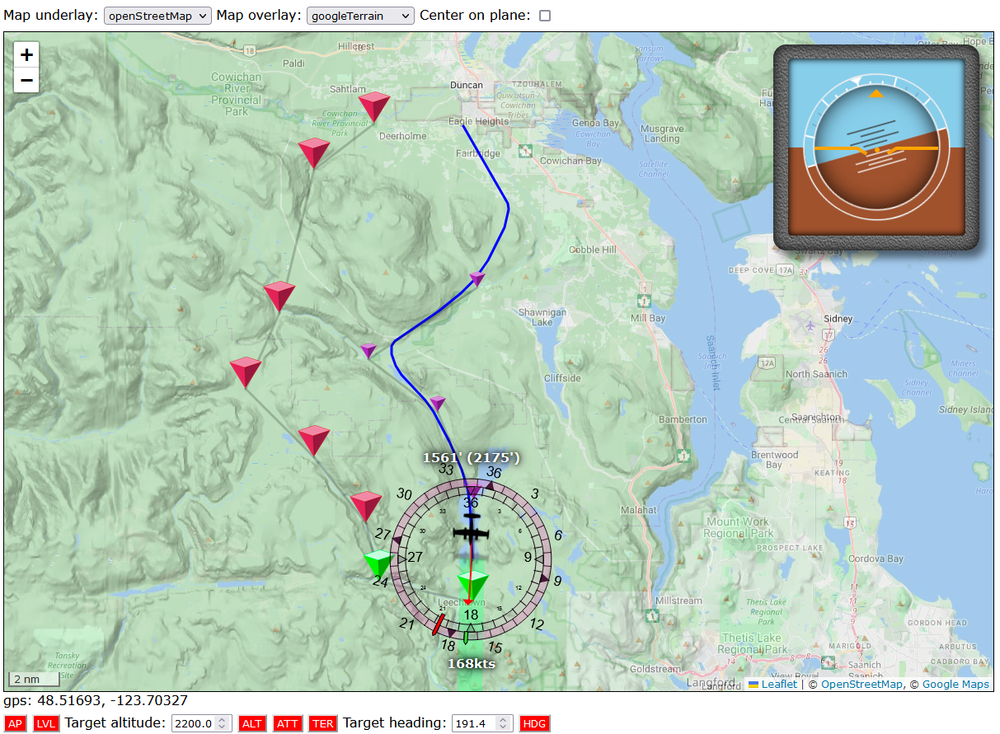

You bet it does.

#### Saving and loading flight paths

Before we move on to testing, let's make sure we can _repeat_ flights, otherwise testing is going to be quite the challenge. Thankfully, this is going to be super simple. First, we add some web page UI:

```html
<div id="maps-selectors">
  flight plan:
  <button name="clear">clear</button>
  <button name="reset">reset</button>
  <button name="save">save</button>
  load: <input type="file" name="load">
</div>
```

With some extra JS added to our waypoint overlay:

```javascript
export class WaypointOverlay {
  ...

  setupMapHandling() {
    this.map.on(`click`, (e) => this.add(e));

    // Clearing the waypoints is a matter of just clicking each waypoint in reverse order:
    document
      .querySelector(`button[name="clear"]`)
      .addEventListener(`click`, () => {
        this.waypoints.reverse().forEach((waypoint) => waypoint.marker.fire(`dblclick`));
        this.waypoints = [];
      });

    // Resetting the path is a matter of telling the autopilot to do that for us:
    document
      .querySelector(`button[name="reset"]`)
      .addEventListener(`click`, () => {
        callAutopilot(`waypoint`, { reset: true });
      });

    // Saving our waypoints is actually fairly easy: we throw everything except the lat/long/alt
    // information away, and then we generate an `<a>` that triggers a file download for that
    // data in JSON format:
    document
      .querySelector(`button[name="save"]`)
      .addEventListener(`click`, () => {
        // Form our "purely lat/long/alt" data:
        const stripped = this.waypoints.map(({ lat, long }) => ({ lat, long }));
        const data = JSON.stringify(stripped, null, 2);

        // Then create our download link:
        const downloadLink = document.createElement(`a`);
        downloadLink.textContent = `download this flightplan`;
        downloadLink.href = `data:text/plain;base64,${btoa(data)}`;
        downloadLink.download = `flightplan.txt`;

        // And then automatically click it to trigger the download.
        console.log(`Saving current flight path.`);
        downloadLink.click();
      });

    // Loading data is even easier: we load the file using the file picker that is built
    // into the browser, then we parse the JSON and tell the autopilot to make waypoints:
    document
      .querySelector(`input[name="load"]`)
      .addEventListener(`change`, (evt) => {
        const file = evt.target.files[0];
        const reader = new FileReader();
        reader.onload = function () {
          try {
            // parse and then run through the list, sending autopilot "create waypoint" calls.
            const data = JSON.parse(reader.result);
            data.forEach(({ lat, long, alt }) => callAutopilot(`waypoint`, { lat, long, alt }));
            console.log(`Loaded flight path from file.`);
          } catch (e) {
            console.error(`Could not parse flight path.`);
          }
        };
        reader.readAsText(file);
      });
  }

  ...
}
```

#### Picking the right waypoint

Of course, with saving and loading, we run the risk of loading a flight path that we're "in the middle of", with the plane nowhere near the start of the flight path. Right now, doing so would make the plane turn around so it can start all the way back at the start, which would be a bit silly. In order to deal with this, we update our loading code just a tiny bit, to trigger a new function on the autopilot side:

```javascript
export class WaypointOverlay {
  ...
  setupMapHandling() {
    ...
    document
      .querySelector(`input[name="load"]`)
      .addEventListener(`change`, (evt) => {
        const file = evt.target.files[0];
        const reader = new FileReader();
        reader.onload = function () {
          try {
            const data = JSON.parse(reader.result);
            data.forEach(({ lat, long }) => callAutopilot(`waypoint`, { lat, long }));

            // We add this one extra call:
            callAutopilot(`waypoint`, { revalidate: true })

            console.log(`Loaded flight path from file.`);
          } catch (e) {
            console.error(`Could not parse flight path.`);
          }
        };
        reader.readAsText(file);
      });
  }
}
```

And then we implement that `revalidate` instruction by first making the api server aware of it:

```javascript
if (action === `waypoint`) {
  const { lat, long, alt, move, elevate, id, remove, reset, revalidate } = data.params;
  if (revalidate)   { autopilot.revalidate(); }
  else if (reset)   { autopilot.resetFlight(); }
  else if (move)    { autopilot.moveWaypoint(id, lat, long); }
  else if (elevate) { autopilot.elevateWaypoint(id, alt); }
  else if (remove)  { autopilot.removeWaypoint(id); }
  else { autopilot.addWaypoint(lat, long, alt); }
}
```

With a pass-through in our `autopilot.js`:

```javascript
  async revalidateFlight() {
    const { PLANE_LATITUDE: lat, PLANE_LONGITUDE: long } = await this.get(`PLANE_LATITUDE`, `PLANE_LONGITUDE`);
    this.waypoints.revalidate(degrees(lat), degrees(long));
  }
```

And then the actual code in our waypoint manager:

```javascript
export class WayPoints {
  ...

  // revalidate the flight path based on the current plane position, marking the nearest waypoint
  // as "the currently active point", and any points prior to it as already completed.
  revalidate(lat, long) {
    // which point are we closest to?
    const { points } = this;
    const nearest = { distance: Number.MAX_SAFE_INTEGER, pos: -1 };
    points.forEach((p, pos) => {
      // reset each waypoint so that it doesn't count as active, nor as compeleted.
      p.reset();
      // then, is our plane closer to this point than any other point we saw so far?
      const d = getDistanceBetweenPoints(lat, long, p.lat, p.long);
      if (d < nearest.distance) {
        nearest.distance = d;
        nearest.pos = pos;
      }
    });

    // Mark all points before the one we're closest to as complete:
    for (let i = 0; i < nearest.pos; i++) points[i].complete();

    // And then make sure every point knows what the next point is,
    // and mark the one that we're closest to as our current waypoint.
    this.resequence();
    this.currentWaypoint = points[nearest.pos];
  }

  ...
}
```


### Testing our code

Now that we can load a flight path, we can load up [this one](https://gist.githubusercontent.com/Pomax/4bee1457ff3f33fdb1bb314908ac271b/raw/537b01ebdc0d3264ae7bfdf357b94bd963d20b3f/vancouver-island-loop.txt), which expects us to start on [runway 27 at Victoria Airport on Vancouver Island](https://www.google.com/maps/place/48%C2%B038'48.0%22N+123%C2%B024'44.4%22W/@48.6466197,-123.4125952,202m/data=!3m1!1e3!4m4!3m3!8m2!3d48.646658!4d-123.41234?entry=ttu), and does a round trip over [Shawnigan Lake](https://www.tourismcowichan.com/explore/about-cowichan/shawnigan-lake/) and [Sooke Lake](https://www.canoevancouverisland.com/canoe-kayak-vancouver-island-directory/sooke-lake/), turns right into the mountains at [Kapoor regional park](https://www.crd.bc.ca/parks-recreation-culture/parks-trails/find-park-trail/kapoor), follows the valley down to the coast, turns over [Port Renfrew](https://www.portrenfrew.com/) into the [San Juan river](https://en.wikipedia.org/wiki/San_Juan_River_(Vancouver_Island)) valley and then follows that all the way west to the [Kinsol Tressle](https://www.cvrd.ca/1379/Kinsol-Trestle), where we take a quick detour north towards [Cowichan Station](https://vancouverisland.com/plan-your-trip/regions-and-towns/vancouver-island-bc-islands/cowichan-station/), then back to Victoria Airport, which is in [Sidney](http://www.sidney.ca/), a good hour north of BC's capital of [Victoria](https://www.tourismvictoria.com/).

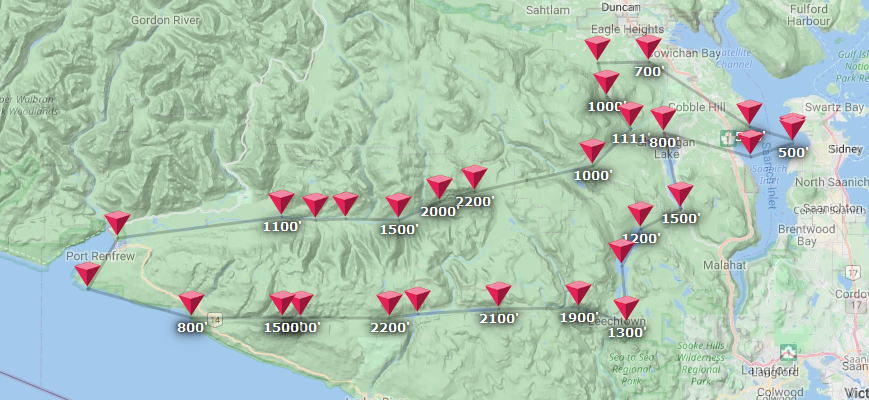

#### De Havilland DHC-2 "Beaver"

No problems with the Beaver, it turns like a champ.

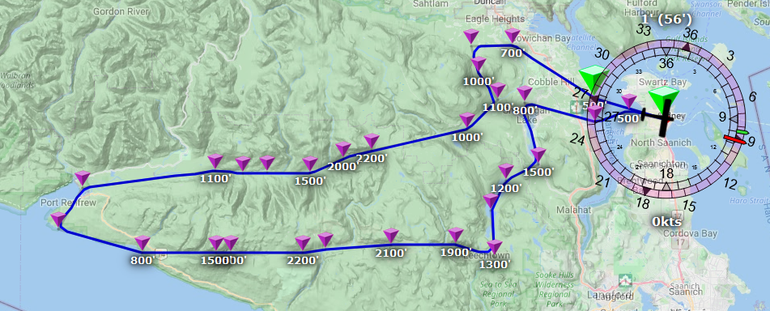

And comparing the ground profile to the flown altitudes, that's looking pretty tidy.

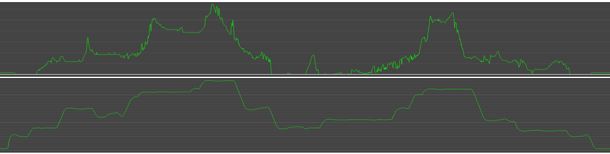

#### Cessna 310R

The 310R is considerably faster than the Beaver and you can see that for tight turns, like the one over Shawnigan lake, it needs more time to get onto the right path, causing it to kind of "weave between" the waypoints there. However, it's still able to complete the flight, and the flight is still pretty spot on for most of the path.

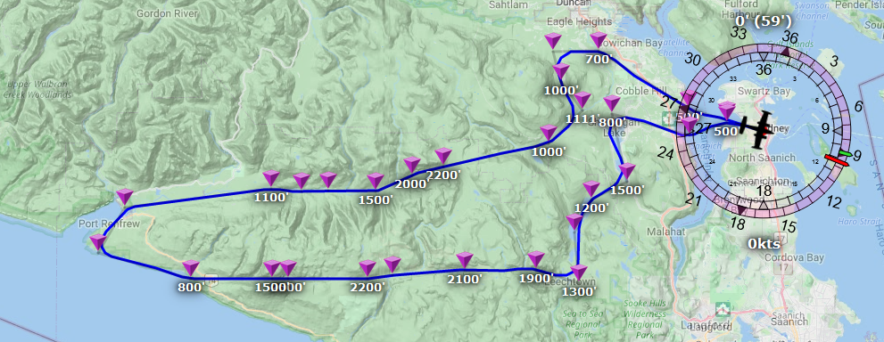

The altitude profile shows we could probably tighten up our vertical damping but this is entirely acceptable. (The track is shorter, mostly because the 310R flies a lot faster than then Beaver!)

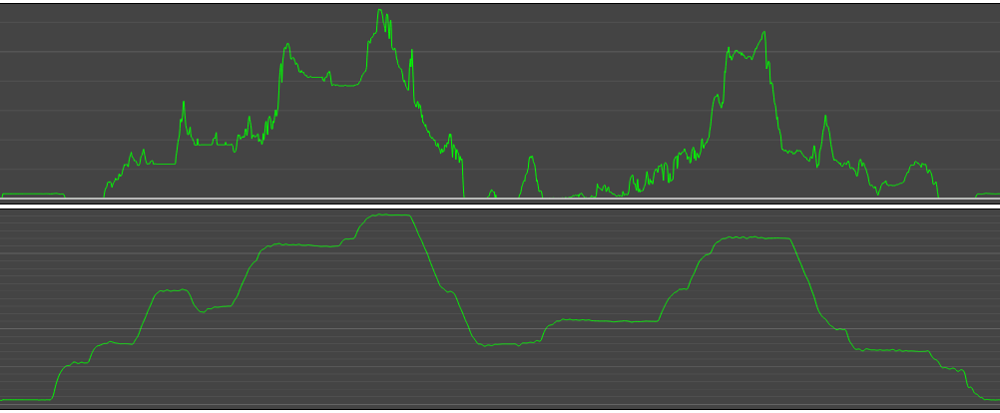

#### Beechcraft Model 18

Quite a bit slower on the turn than the 310R or the Beaver, we can see the twin Beech having the same problems as the 310R. But again, nothing that stops it from flying this plan to completion.

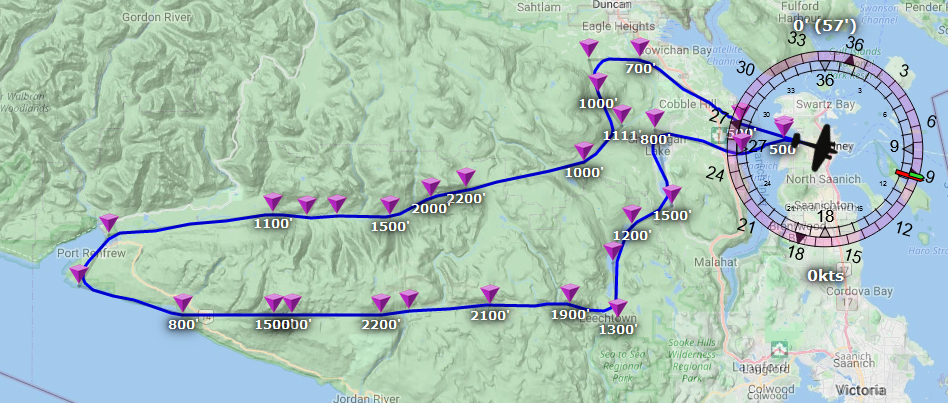

And the altitude graph. A bit more bouncy, but perfectly serviceable.


#### Douglas DC-3

Same story with the DC-3: looks like our waypoint algorithm works just fine!

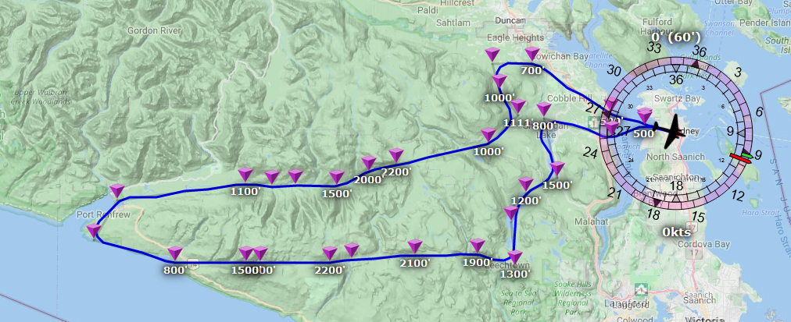

We do see that the DC-3 is considerably more bouncy than even the twin Beech, but for its size and weight, we'll take it.

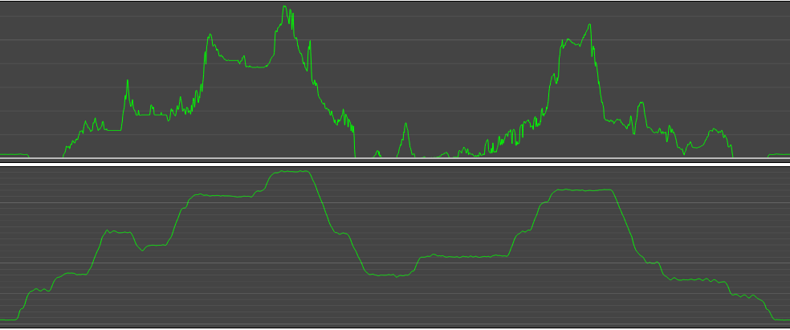


# Part four: "Let's just have JavaScript fly the plane for us"

We have a pretty fancy autopilot, but the best autopilots let you plan your flight path, and then just... fly that for you. So before we call it a day (week? ...month??) let's not be outdone by the real world and make an even more convenient autopilot that lets us put some points on the map (rather than trying to input a flight plan one letter at a time with a jog dial), and then just takes off for you, figuring out what elevation to fly in order to stay a fixed distance above the ground, and landing at whatever is a nearby airport at the end of the flight. All on its own.

## Terrain follow mode

Normally, most planes don't come with a mode that lets them "hug the landscape", but we're not flying real planes, we're flying virtual planes, and hugging the landscape would be pretty sweet to have if we just want to fly around on autopilot and enjoy the view. Conceptually, there's nothing particularly hard about terrain follow:

1. Scan our flight path up to a few nautical miles ahead of us,
2. find the highest point along that path,
3. set the autopilot altitude to something that lets us safely clear that highest point, and
4. keep repeating this check for as long as the autopilot is running the show.

The problem is with point (2) in that list: there is nothing baked into MSFS that lets us "query landscape elevation". We'd instead need to create a dummy object, spawn it into the world, then move it across the landscape and ask MSFS what its x, y, and z coordinates are. That's pretty annoying, and quite a bit of work. However, since the whole selling point of MSFS is that you can fly anywhere on Earth, as an alternative we could also just query some out-of-game resource for elevation data based on GPS coordinates.

Back in the day, Google offered that as a free web API, but they decided to charge quite a bit of money for that starting back in 2018, so that's out. There is also https://www.open-elevation.com, which _is_ free, but because they're not Google they're also frequently down, making them an admirable but highly unreliable resource. Which leaves "writing our own elevation API", which is surprisingly doable. We just need a good source of elevation data. Covering the entire planet. At a high enough resolution.

Enter the Japanese Aerospace eXploration Agency, or [JAXA](https://global.jaxa.jp/), and their freely available ALOS (Advanced Land Observing Satellite) [Digital Elevation Model](https://en.wikipedia.org/wiki/Digital_elevation_model) datasets. Specifically, their [30 meter dataset](https://www.eorc.jaxa.jp/ALOS/en/dataset/aw3d30/aw3d30_e.htm), which has elevation data for the entire planet's land surface at a resolution finer than MSFS uses, and can be downloaded for free after signing up for an (again, free) account and agreeing to their [data license](https://earth.jaxa.jp/en/data/policy). One downside: it's 450GB of on-disk data hosted as a 150GB download spread out over hundreds of files. On the upside, we know how to program, so scripting the downloads isn't terribly hard, and a 1TB SSD is $50 these days, so that's unlikely to _really_ be a problem.

What _will_ be a problem is that the ALOS data uses the GeoTIFF data format: TIFF images with metadata that describes what section of planet they map to, and which mapping you need to use to go from pixel-coordinate to geo-coordinate. The TIFF part is super easy, we can just use the [tiff](https://www.npmjs.com/package/tiff) package to load those in, and ALOS thankfully has its files organized in directories with filenames that indicate which whole-angle GPS bounding box they're for, so finding the file we need to look up any GPS coordinate is also pretty easy...  it's finding the pixel in the image that belongs to a _specific_ GPS coordinate that's a little more work.

Of course, [I already did this work so you don't have to](https://stackoverflow.com/questions/47951513#75647596), so let's dive in: what do we need?

### Working with ALOS data

We're going to split our ALOS code up into three parts: a querying object, a tile class, and a really simple caching system.

First, some ALOS constants:

```javascript
import { join, resolve } from "path";
import url from "url";
const __dirname = url.fileURLToPath(new URL(".", import.meta.url));

export const SEA_LEVEL = 0;
export const ALOS_VOID_VALUE = -9999;
export const NO_ALOS_DATA_VALUE = 9999;
export const INDEX_FILE = resolve(join(__dirname, `alos-index.json`));
export const CACHE_DIR = resolve(join(__dirname, `cache`));
```

Then, our querying object:

```javascript
import { getDistanceBetweenPoints } from "../api/autopilot/utils/utils.js";
import { SEA_LEVEL, ALOS_VOID_VALUE, NO_ALOS_DATA_VALUE } from "./alos-constants.js";
import { ALOSTile } from "./alos-tile.js";

const { floor, ceil, max } = Math;

// JAXA ALOS World 3D (30m) dataset manager
// homepage: https://www.eorc.jaxa.jp/ALOS/en/dataset/aw3d30/aw3d30_e.htm
// data format: https://www.eorc.jaxa.jp/ALOS/en/aw3d30/aw3d30v11_format_e.pdf
// license: https://earth.jaxa.jp/en/data/policy/

export class ALOSInterface {
  constructor(tilesFolder) {
    this.tilesFolder = tilesFolder;
    this.loaded = false;
    this.files = [];
    if (!this.tilesFolder) {
      console.log(`No ALOS data folder specified, elevation service will not be available.`);
    } else {
      this.findFiles();
      this.loaded = true;
	    console.log(`ALOS loaded, using ${this.files.length} tiles.`);
    }
  }

  findFiles(dir = this.tilesFolder) {
    readdirSync(dir, { withFileTypes: true }).forEach((entry) => {
      const fullPath = join(dir, entry.name);
      if (entry.isFile() && fullPath.endsWith(".tif")) this.files.push(fullPath);
      if (entry.isDirectory()) this.findFiles(fullPath);
    });
  }

  getTileFor(lat, long) {
    if (!this.loaded) return;

    const [tileName, tilePath] = this.getTileFromFolder(this.tilesFolder, lat, long);
    if (!tileName) return;
    return new ALOSTile(tilePath);
  }

  getTileFromFolder(basedir, lat, long) {
    // ALOS tiles are named ALPSMKC30_UyyyWxxx_DSM.tif, where
    // U is either "N" or "S", yyy is the degree of latitude
    // (with leading zeroes if necessary), W is either "E" or
    // "W", and xxx is the degree of longitude (again with
    // leading zeroes if necessary).
    const latDir = lat >= 0 ? "N" : "S";
    const longDir = long >= 0 ? "E" : "W";
    lat = `` + (latDir == "N" ? floor(lat) : ceil(-lat));
    long = `` + (longDir == "E" ? floor(long) : ceil(-long));
    const tileName = `ALPSMLC30_${latDir}${lat.padStart(3, "0")}${longDir}${long.padStart(3, "0")}_DSM.tif`;

    // find the full path for this file in the list of
    // known files we built in findFiles().
    const fullPath = this.files.find((f) => f.endsWith(tileName));
    if (!fullPath) return [false, false];

    return [tileName, join(basedir, fullPath)];
  }

  // And finally the function we care about the most:
  lookup(lat, long) {
    if (!this.loaded) return NO_ALOS_DATA_VALUE;

    lat = +lat;
    long = +long;
    const tile = this.getTileFor(lat, long);
    if (!tile) console.warn(`no tile for ${lat},${long}...`);
    const elevation = tile?.lookup(lat, long) ?? ALOS_VOID_VALUE;
    return elevation === ALOS_VOID_VALUE ? SEA_LEVEL : elevation;
  }
}
```

And then our tile class:

```javascript
import { existsSync, readFileSync, copyFileSync } from "fs";
import { basename, join } from "path";
import tiff from "tiff";
import { ALOS_VOID_VALUE } from "./alos-constants.js";

const { floor, ceil, max } = Math;

export class ALOSTile {
  constructor(tilePath, coarseLevel = 10) {
    this.tilePath = tilePath;
    this.coarseLevel = coarseLevel;
    this.init(tilePath);
  }

  init(filename) {
    const file = readFileSync(filename);
    const image = tiff.decode(file.buffer);
    const block = (this.block = image[0]);
    const fields = block.fields;
    // See https://stackoverflow.com/questions/47951513#75647596
    let [sx, sy, sz] = fields.get(33550);
    let [px, py, k, gx, gy, gz] = fields.get(33922);
    sy = -sy;
    this.reverse = [-gx / sx, 1 / sx, 0, -gy / sy, 0, 1 / sy];
    this.pixels = block.data;
  }

  // Get an [x, y] pixel coordinate, given a GPS coordinate
  geoToPixel(lat, long) {
    const R = this.reverse;
    return [R[0] + R[1] * long + R[2] * lat, R[3] + R[4] * long + R[5] * lat];
  }

  // Get the elevation for some GPS coordinate
  lookup(lat, long) {
    const [x, y] = this.geoToPixel(lat, long);
    const pos = (x | 0) + (y | 0) * this.block.width;
    let value = this.pixels)[pos];
    // the highest point on earth is ~8848m
    if (value === undefined || value > 8900) value = ALOS_VOID_VALUE;
    return value;
  }
}
```

And now we have a way to query elevations for GPS coordinates, without having to use an external service, or messing around with object spawning in-game. Except... it's not very efficient at the moment. Let's fix that by adding tile caching, as well as "coarse" tiles, where we scale down each time by a factor of ten, but rather than averaging the pixels, we only keep "the brightest ones" so that we get a maximum elevation map for 300x300m rather than 30x30m, effectively making our lookups faster while keeping our plane just as safe:

```javascript
import { join } from "path";
import { mkdir } from "fs/promises";
import { ALOSTile } from "./alos-tile.js";
import { getDistanceBetweenPoints } from "../api/autopilot/utils/utils.js";
import { SEA_LEVEL, ALOS_VOID_VALUE, INDEX_FILE, CACHE_DIR } from "./alos-constants.js";
import { existsSync, readFileSync, readdirSync, writeFileSync } from "fs";

const { floor, ceil, max } = Math;

// Ensure our cache directory exists before we try writing files to it.
await mkdir(CACHE_DIR, { recursive: true });

export class ALOSInterface {
  constructor(tilesFolder) {
    this.tilesFolder = tilesFolder;
    this.loaded = false;
    this.files = [];
    this.cache = {};
    if (!this.tilesFolder) {
      console.log(
        `No ALOS data folder specified, elevation service will not be available.`
      );
    } else {
      this.loadIndex();
      this.loaded = true;
      console.log(`ALOS loaded, using ${this.files.length} tiles.`);
    }
  }

  loadIndex() {
    // To prevent us from having to run through a file tree every single time we
    // start, we build an index file instead, so we can load that directly.
    if (!existsSync(INDEX_FILE)) {
      console.log(`Indexing dataset...`);
      const mark = Date.now();
      this.findFiles();
      const json = JSON.stringify(
        this.files.map((v) => v.replace(this.tilesFolder, ``))
      );
      writeFileSync(INDEX_FILE, json);
      console.log(
        `Dataset indexed in ${((Date.now() - mark) / 1000).toFixed(2)}s (${
          this.files.length
        } tiles found)`
      );
    }
    this.files = JSON.parse(readFileSync(INDEX_FILE));
    console.log(`ALOS loaded, using ${this.files.length} tiles.`);
  }

  ...

  getTileFor(lat, long) {
    if (!this.loaded) return;

    const [tileName, tilePath] = this.getTileFromFolder(this.tilesFolder, lat, long);
    if (!tileName) return;
    // Instead of constantly loading the tile from file, we cache it in memory.
    this.cache[tilePath] ??= new ALOSTile(tilePath);
    return this.cache[tilePath];
  }

  lookup(lat, long, coarse = false) {
    if (!this.loaded) return NO_ALOS_DATA_VALUE;

    lat = +lat;
    long = +long;
    const tile = this.getTileFor(lat, long);
    if (!tile) console.warn(`no tile for ${lat},${long}...`);
    // pass the "coarse" flag along so we perform a more efficient, but lower resolution, lookup.
    const elevation = tile?.lookup(lat, long, coarse) ?? ALOS_VOID_VALUE;
    return elevation === ALOS_VOID_VALUE ? SEA_LEVEL : elevation;
  }
}
```

and our tile update:

```javascript
import tiff from "tiff";
import { basename, join } from "path";
import { ALOS_VOID_VALUE, CACHE_DIR } from "./alos-constants.js";
import { existsSync, readFileSync, copyFileSync } from "fs";

const { floor, ceil, max } = Math;

export class ALOSTile {
  constructor(tilePath, coarseLevel = 10) {
    this.tilePath = tilePath;
    this.coarseLevel = coarseLevel;
    // copy the file itself to our local cache dir for faster loading in the future
    const filename = join(`.`, CACHE_DIR, basename(tilePath));
    if (!existsSync(filename)) copyFileSync(tilePath, filename);
    this.init(filename);
  }

  init(filename) {
    ...
    this.pixels = block.data;
    this.formCoarseTile(block.width, block.height, [sx, sy, gx, gy]);
  }

  formCoarseTile(width, height, [sx, sy, gx, gy]) {
    // form a much smaller, coarse lookup map
    const { coarseLevel, pixels: p } = this;
    this.coarsePixels = [];
    for (let i = 0; i < p.length; i += coarseLevel) {
      this.coarsePixels[i / coarseLevel] = max(...p.slice(i, i + coarseLevel));
    }
    for (let i = 0, w = width / coarseLevel; i < w; i += coarseLevel) {
      let list = [];
      for (let j = 0; j < coarseLevel; j++) list.push(p[i + j * w]);
      this.coarsePixels[i / coarseLevel] = max(...list);
    }
    this.coarsePixels = new Uint16Array(this.coarsePixels);
    const [sxC, syC] = [sx * coarseLevel, sy * coarseLevel];
    this.coarseForward = [gx, sxC, 0, gy, 0, syC];
    this.coarseReverse = [-gx / sxC, 1 / sxC, 0, -gy / syC, 0, 1 / syC];
  }

  geoToPixel(lat, long, coarse = false) {
    const R = coarse ? this.coarseReverse : this.reverse;
    return [R[0] + R[1] * long + R[2] * lat, R[3] + R[4] * long + R[5] * lat];
  }

  lookup(lat, long, coarse = false) {
    const [x, y] = this.geoToPixel(lat, long, coarse);
    const pos = (x | 0) + (y | 0) * this.block.width;
    let value = (coarse ? this.coarsePixels : this.pixels)[pos];
    if (value === undefined || value > 8900) value = ALOS_VOID_VALUE;
    return value;
  }
}
```

We scale down our image data by first picking the brightest (and therefore highest) pixel out of every 10 pixels horizontally, then doing the same to that new data, but vertically. What we're left with is a 100x smaller image that encodes the max elevation over 300x300 meter blocks, rather than the original 30x30 meter blocks.

Which takes care of our original point (2) in our four point list, let's tackle the rest of our points:

### Finishing up

1. we can generate a path from our current location and a point for a miles ahead of us by using "the wrong" math in our ALOS interface, pretending that paths between two GPS coordinates are straight lines, instead of lying on a [great circle](https://en.wikipedia.org/wiki/Great_circle):

   ``` javascript
   const COARSE_LEVEL = 10;

   export class ALOSInterface {
     ...

     getTileFor(lat, long) {
       ...
       this.cache[tilePath] ??= new ALOSTile(tilePath, COARSE_LEVEL);
       return this.cache[tilePath];
     }

     ...

     getHighestPointBetween(lat1, long1, lat2, long2, coarse = false) {
       if (!this.loaded) return { lat: 0, long: 0, elevation: NO_ALOS_DATA_VALUE };

       const distance = getDistanceBetweenPoints(lat1, long1, lat2, long2);
       const s = (coarse ? COARSE_LEVEL * 0.3 : 0.03) / distance;
       let maxValue = { elevation: ALOS_VOID_VALUE, lat: lat2, long: long2 };
       for (let i = s, lat, long, elevation; i <= 1; i += s) {
         lat = (1 - i) * lat1 + i * lat2;
         long = (1 - i) * long1 + i * long2;
         elevation = this.lookup(lat, long, coarse);
         if (elevation > maxValue.elevation) maxValue = { elevation, lat, long };
       }
       return maxValue;
     }
   }
   ```

   Which just leaves the question of how to get the GPS coordinate "given our current location, heading, and distance", which is one of those things we can just look up the code for:

   ```javascript
   function getPointAtDistance(lat1, long1, d, heading) {
     const R = 6371; // the average radius of Earth
     lat1 = radians(lat1);
     long1 = radians(long1);
     const angle = radians(heading);
     const lat2 = asin(sin(lat1) * cos(d / R) + cos(lat1) * sin(d / R) * cos(angle));
     const dx = cos(d / R) - sin(lat1) * sin(lat2);
     const dy = sin(angle) * sin(d / R) * cos(lat1);
     const long2 = long1 + atan2(dy, dx);
     return { lat: degrees(lat2), long: degrees(long2) };
   }
   ```

2. We already wrote the code for this step!

3. We basically wrote the code for this already, too: we just update the value for `autopilot.modes[ALTITUDE_HOLD]` and the autopilot does the rest.

4. And this isn't even code: the autopilot will just keep running for as long as we don't turn it off.

Now we just need to add "terrain follow" as an autopilot mode (making sure it runs only when vertical hold is engaged):

```javascript
export const LEVEL_FLIGHT = `LVL`;
export const ALTITUDE_HOLD = `ALT`;
export const HEADING_MODE = `HDG`;
export const AUTO_THROTTLE = `ATT`;
export const TERRAIN_FOLLOW = `TER`;
```

With the new mode added to the autopilot code:

```javascript
...
import { ... TERRAIN_FOLLOW } from "./utils/constants.js";
import { followTerrain } from "./terrain-follow.js";

class AutoPilot {
  ...
  constructor() {
    ...
    this.modes = {
      [LEVEL_FLIGHT]: false,
      [ALTITUDE_HOLD]: false,
      [HEADING_MODE]: false,
      [AUTO_THROTTLE]: true,
      [TERRAIN_FOLLOW]: false
    };
    ...
  }

  ...

  getAutoPilotParameters() {
    const state = {
      MASTER: this.autoPilotEnabled,
      // we add the terrain follow "max elevation" information to our autopilot parameters
      elevation: this.modes[TERRAIN_FOLLOW] ? this.elevation : false,
    };
    Object.entries(this.modes).forEach(([key, value]) => (state[key] = value));
    return state;
  }

  ...

  // And when terrain follow is on, follow that terrain!
  async runAutopilot() {
    ...

    if (this.modes[ALTITUDE_HOLD]) {
      if (this.modes[TERRAIN_FOLLOW] !== false && this.alos.loaded) {
        followTerrain(this, state);
      }
      altitudeHold(this, state);
    }

    this.prevState = state;
  }
}
```

And of course, with a new file called `terrain-follow.js`:

```javascript
const { ceil } = Math;
import { degrees, getPointAtDistance } from "./utils/utils.js";
import { ALTITUDE_HOLD, FEET_PER_METER } from "./utils/constants.js";

const ALOS_VOID_VALUE = -9999;

export async function followTerrain(autopilot, state, altitude = 500) {
  const { latitude: lat, longitude: long, trueHeading } = state;
  const distance = 12; // in kilometers
  const { lat: lat2, long: long2 } = getPointAtDistance(lat, long, distance, degrees(trueHeading));
  const coarseLookup = true;
  const maxValue = autopilot.alos.getHighestPointBetween(lat, long, lat2, long2, coarseLookup);
  if (maxValue.elevation === ALOS_VOID_VALUE) maxValue.elevation = 0;

  // We'll add these values to our autopilot parameters
  autopilot.elevation = maxValue;
  autopilot.elevation.lat2 = lat2;
  autopilot.elevation.long2 = long2;

  // Rememeber: ALOS data is in meters, but MSFS is in feet.
  // We'll crash really fast if we don't convert units =)
  let targetAltitude = maxValue.elevation * FEET_PER_METER + altitude;

  // We don't want to constantly change altitude, so we use elevation brackets:
  let bracketSize = 100;
  if (targetAltitude > 1000) bracketSize = 200;
  if (targetAltitude > 10000) bracketSize = 500;
  if (targetAltitude > 30000) bracketSize = 1000;
  targetAltitude = ceil(targetAltitude / bracketSize) * bracketSize;

  // Set the ALT value and let the autopilot do the rest
  autopilot.modes[ALTITUDE_HOLD] = targetAltitude;
}
```

Of course this does require so extra code to make sure waypoint elevation and terrain follow altitudes don't clash, so we're going to add an early return in `altitude-hold.js`:

```javascript
function updateAltitudeFromWaypoint(autopilot, state) {
  if (autopilot.modes[TERRAIN_FOLLOW]) return;

  const { waypoints } = autopilot;
  const waypointAltitude = waypoints.getAltitude(state);
  if (waypointAltitude) {
    autopilot.setTarget(ALTITUDE_HOLD, waypointAltitude);
  }
}
```

The last thing we'll do is add a bit of cosmetic code so that we can see the "terrain scan line" on our map while we're flying. First we update our `plane.js`:

```javascript
export class Plane {
  ...

  async setElevationProbe(value) {
    if (this.elevationProbe) this.elevationProbe.remove();
    if (!value) return;
    this.elevationProbe = new Trail(
      this.map,
      [this.state.lat, this.state.long],
      `#4F87`,
      { weight: 30, lineCap: `butt` }
    );
    this.elevationProbe.add(value.lat2, value.long2);
  }

  ...
}
```

And then we call this function in our client-side autopilot code:

```javascript
...

  bootstrap(params) {
    Object.entries(params).forEach(([key, value]) => {
      // draw our elevation scan line on the map
      if (key === `elevation`) return this.owner.setElevationProbe(value);
      ...
    });
  }

...
```

Which will give us the following visualization:

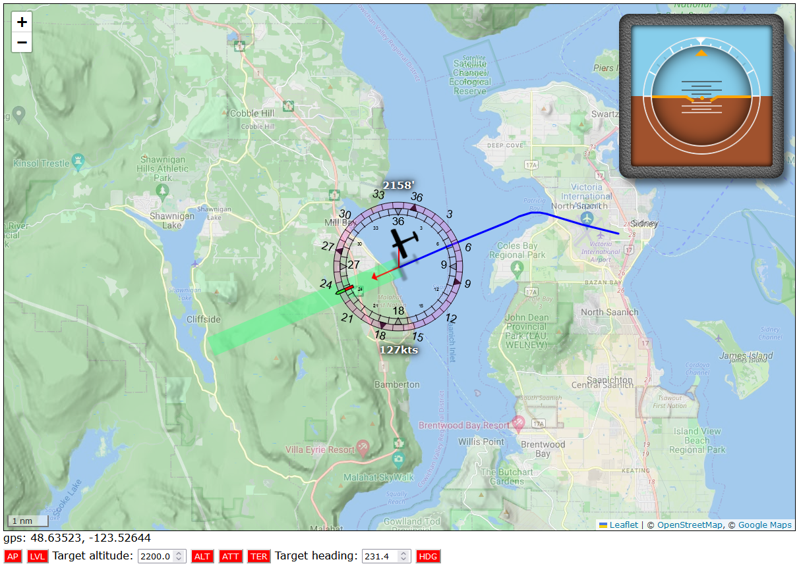

### Testing our code

Let's update our web page again so that we can toggle the auto-throttle and terrain follow modes:

```html
<div id="autopilot" class="controls">
  <link rel="stylesheet" href="/css/autopilot.css" />

  <button class="MASTER">AP</button>
  <button title="level wings" class="LVL">LVL</button>
  <label>Target altitude: </label>
  <input class="altitude" type="number" min="0" max="40000" value="1500" step="100">
  <button title="altitude hold" class="ALT">ALT</button>
  <button class="TER">TER</button>
  <label>Target heading: </label>
  <input class="heading" type="number" min="1" max="360" value="360" step="1">
  <button class="HDG">HDG</button>
</div>
```

And a minor update to our client-side autopilot JS:

```javascript
export const AP_DEFAULT = {
  MASTER: false,
  LVL: false,
  ALT: false,
  HDG: false,
  ATT: true,
  TER: false,
};
```

Just to make it aware that auto-throttle and terrain follow are things it can now toggle. So, graph time!

#### Top Rudder Solo 103

We're going to skip this one, because we know what's going to happen: terrain follow mode can quite easily see a mountain 12 nautical miles down the line, and go "we need to climb 2200 feet" and then the Top Rudder will go "you got it!" and promptly go into a death spiral. We can have autopilot fun with the Top Rudder, but unfortunately, not the terrain follow kind.

#### De Havilland DHC-2 "Beaver"

We'll be taking off from Victoria Airport on Vancouver Island, which sits at an elevation of about 60 feet, and then simply by heading straight, we'll have quite a bit of terrain to contend with. Let's see what happens!


Honestly, "not a lot" other than the autopilot giving us altitudes to fly that make sure we don't fly straight into a mountain side. The plane's altitude is not quite as "clean" or platformed as a human would fly the plane, but it doesn't have to be, we're not flying, the computer is.

#### Cessna 310R

The story is the same in the 310R, although because it's a lot faster than the Beaver, the elevation probe gives a smoother curve, but again: no mountain side collisions, which is good!

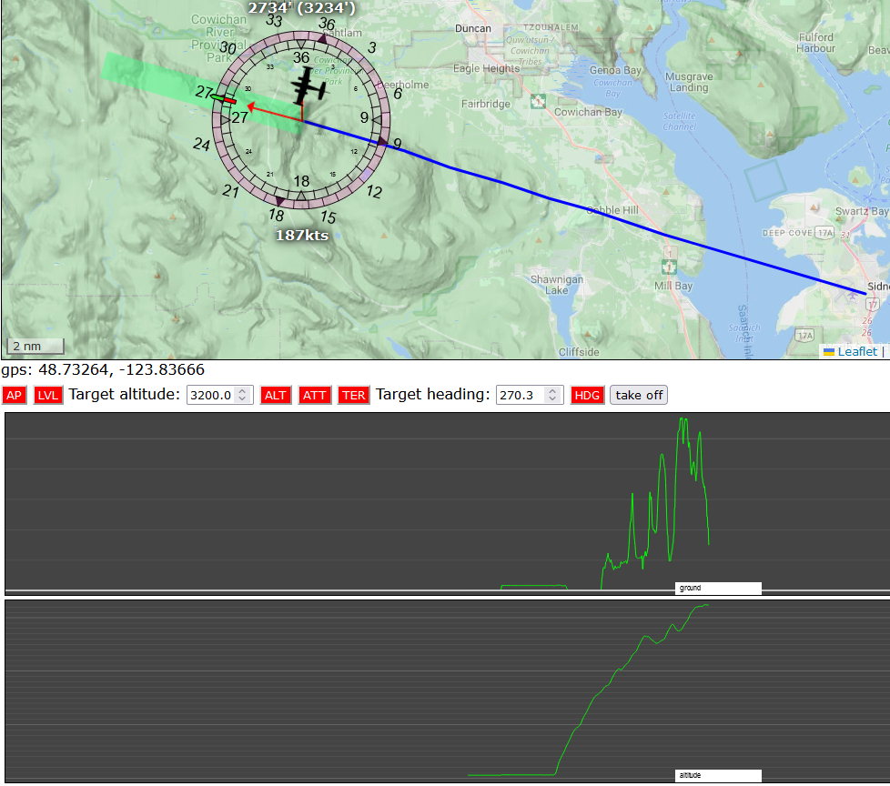

#### Beechcraft Model 18

Flying a tad faster than the 310R but reacting more slowly to control instructions, the altitude profile is even better looking than the 310R's. I love this plane, it is just a delight.


#### Douglas DC-3

Not much to say: it does what it needs to do despite weighing about as much as as half of Vancouver Island.

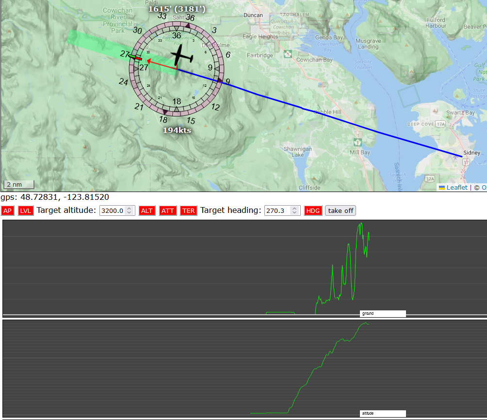


## Auto takeoff

In fact we can do one more thing if we just want the computer to fly our plane for us, and that's have it handle take-off when our plane's sitting on the ground. This is, barring auto-landing, the hardest thing to implement if we're not building a bespoke autopilot for one specific aeroplane, but we're going to do it anyway, and we're going to succeed, *and* it's going to be glorious.

There's a few challenges we'll want to tackle, in order:

1. make sure the plane is ready for takeoff, then once ready
2. throttle up and roll down the runway to pick up speed. Ideally in a straight line. Then
3. rotating the plane in order to take off once we're at take-off speed, and then
4. leveling out the plane and switching to the autopilot.

```javascript
export class AutoTakeoff {
  prepped = false;
  takeoffHeading = false;
  takeoffAltitude = false;
  liftoff = false;
  levelOut = false;
  easeElevator = false;

  constructor(autopilot) {
    this.autopilot = autopilot;
    this.api = autopilot.api;
  }

  async run(state) {
    const { api } = this;

    const {
      TOTAL_WEIGHT: totalWeight,
      DESIGN_SPEED_VS1: vs1,
      DESIGN_SPEED_MIN_ROTATION: minRotate,
      NUMBER_OF_ENGINES: engineCount,
      TITLE: title,
    } = await api.get(
      `TOTAL_WEIGHT`,
      `DESIGN_SPEED_VS1`,
      `DESIGN_SPEED_MIN_ROTATION`,
      `NUMBER_OF_ENGINES`
      `TITLE`,
    );

    const {
      onGround,
      speed: currentSpeed,
      lift,
      dLift,
      verticalSpeed: vs,
      dVS,
      latitude: lat,
      longitude: long,
      isTailDragger } = state;

    const heading = degrees(state.heading);
    const trueHeading = degrees(state.trueHeading);
    const vs12 = vs1 ** 2;

    if (!this.takeoffAltitude) this.takeoffAltitude = state.altitude;

    // Make sure we've set the aeroplane up for a runway roll.
    if (!this.prepped) return this.prepForRoll(isTailDragger, engineCount, state.altitude, lat, long, heading, trueHeading);

    // As long as we've not lifted off, throttle up to max
    if (!this.liftoff) await this.throttleUp(engineCount);

    // Try to keep us going in a straight line.
    this.autoRudder(onGround, isTailDragger, vs12, minRotate, currentSpeed, lat, long, heading);

    // Is it time to actually take off?
    await this.checkRotation(onGround, currentSpeed, lift, dLift, vs, dVS, totalWeight);

    // Is it time to hand off flight to the regular auto pilot?
    const altitudeGained = state.altitude - this.takeoffAltitude;
    await this.checkHandoff(title, isTailDragger, totalWeight, vs, dVS, altitudeGained);
  }
}
```

With the autopilot loading this class:

```javascript
import { ..., AUTO_TAKEOFF } from "./constants.js";
...

import { AutoTakeoff as ato } from "./auto-takeoff.js";
let AutoTakeoff = ato;

export class AutoPilot {
  constructor(api, onChange = () => {}) {

  }

  reset() {
    this.modes = {
      [LEVEL_FLIGHT]: false,
      [HEADING_MODE]: false,
      [ALTITUDE_HOLD]: false,
      [AUTO_THROTTLE]: true,
      [TERRAIN_FOLLOW]: false,
      [AUTO_TAKEOFF]: false,
    ];
    this.autoTakeoff = false;
  }

  watchForUpdates() {
    ...
    addReloadWatcher(__dirname, `auto-takeoff.js`, (lib) => {
      AutoTakeoff = lib.AutoTakeoff;
      // since this is a class instance, run a copy construction:
      this.autoTakeoff = new AutoTakeoff(this, this.autoTakeoff);
    });
  }

  async processChange(type, oldValue, newValue) {
    if (type === AUTO_TAKEOFF) {
      if (oldValue === false && newValue === true) {
        this.autoTakeoff = new AutoTakeoff(this);
        this.trim = { x: 0, y: 0, z: 0 };
      }
      this.AP_INTERVAL = newValue ? FAST_AUTOPILOT : REGULAR_AUTOPILOT;
    }
    ...
  }

  async runAutopilot() {
    ...
    const state = new State(data, this.prevState);

    if (!this.modes[AUTO_TAKEOFF] && state.speed < 15) {
      // Disengage our autopilot, but preserve all settings
      // in case we want to turn it back on momentarily.
      return;
    }

    // Are we in auto-takeoff?
    if (this.modes[AUTO_TAKEOFF]) this.autoTakeoff.run(state);

    // Do we need to level the wings / fly a specific heading?
    if (this.modes[LEVEL_FLIGHT]) flyLevel(this, state);

    ...
  }
}
```

And another update to `altitude-hold.js`:

```javascript
function updateAltitudeFromWaypoint(autopilot, state) {
  if (autopilot.modes[AUTO_TAKEOFF]) return;
  if (autopilot.modes[TERRAIN_FOLLOW]) return;

  const { waypoints } = autopilot;
  const waypointAltitude = waypoints.getAltitude(state);
  if (waypointAltitude) {
    autopilot.setTarget(ALTITUDE_HOLD, waypointAltitude);
  }
}
```

As well as `fly-level.js`:

```javascript
function updateHeadingFromWaypoint(autopilot, state) {
  if (autopilot.modes[AUTO_TAKEOFF]) return;

  const { waypoints } = autopilot;
  const waypointHeading = waypoints.getHeading(state);
  if (waypointHeading) {
    autopilot.setTarget(HEADING_MODE, waypointHeading);
  }
}
```

And finally in `waypoints.js`:

```javascript
export class WayPoints {
  ...

  getHeading(state) {
    // If we're in auto-takeoff, waypoints should not be active yet
    const { modes } = this.autopilot;
    if (modes[AUTO_TAKEOFF]) return;
    ...
  }
}
```

And with that out of the way, we can run through each step in the auto-takeoff process.

### Preflight checklist

The preflight checks are relatively easy:

- we want to make sure our altimeter is calibrated,
- the parking brake is off,
- flaps get fully retracted (some planes want flaps during takeoff, others don't, and we have no way of looking up which it is, so all planes get to lift off without the help of flaps. Use the runway, that's what it's for.)
- we reset all the trim values so that we start off neutral (again, some planes want trim for takeoff: too bad for them),
- we set the elevator position to 0 (just in case it wasn't),
- we set the fuel mixture somewhere between full rich and 65% depending on whether we're sitting at sea level or 8000 feet, or somewhere in between those two.
- if the plane's a tail dragger, we lock the tail wheel

So, in code:

```javascript
  async prepForRoll(isTailDragger, engineCount, altitude, lat, long, heading, trueHeading) {
    const { api, autopilot } = this;
    console.log(`Prep for roll`);

    // Record our initial heading and location, as well as a location along that heading
    // somewhere in the distance, so that we have a line we can (try to) stick to.
    if (!this.takeoffHeading) {
      this.takeoffHeading = heading;
      this.takeoffCoord = { lat, long };
      this.futureCoord = getPointAtDistance(lat, long, 2, trueHeading);
      autopilot.setTarget(HEADING_MODE, this.takeoffHeading);
    }

    // Ensure our barometric altimeter is calibrated
    api.trigger(`BAROMETRIC`);

    // Is the parking brake engaged? If so, let's take that off.
    const { BRAKE_PARKING_POSITION } = await api.get(`BRAKE_PARKING_POSITION`);
    if (BRAKE_PARKING_POSITION === 1) api.trigger(`PARKING_BRAKES`);

    // We don't have a database of which plane needs how much flaps for takeoff, so we
    // just... don't set flaps. It makes take-off take a bit longer, but then again:
    // use the whole runway, that's literally what it's for.
    let flaps = await api.get(`FLAPS_HANDLE_INDEX:1`);
    flaps = flaps[`FLAPS_HANDLE_INDEX:1`];
    if (flaps !== 0) api.set(`FLAPS_HANDLE_INDEX:1`, 0);

    // Reset all trim values before takeoff.
    api.set(`AILERON_TRIM_PCT`, 0);
    api.set(`ELEVATOR_TRIM_POSITION`, 0);
    api.set(`RUDDER_TRIM_PCT`, 0);

    // Set mixture to something altitude-appropriate and set props to 90%, mostly because we have no
    // way to ask MSFS what the "safe" value for props is, and we don't want the engines to burn out.
    const mixture = constrainMap(altitude, 3000, 8000, 100, 65);
    for (let i = 1; i <= engineCount; i++) {
      api.set(`GENERAL_ENG_MIXTURE_LEVER_POSITION:${i}`, mixture);
      api.set(`GENERAL_ENG_PROPELLER_LEVER_POSITION:${i}`, 90);
    }

    // Lock the tailwheel. If we have one, of course.
    if (isTailDragger) {
      const { TAILWHEEL_LOCK_ON } = await api.get(`TAILWHEEL_LOCK_ON`);
      if (TAILWHEEL_LOCK_ON === 0) api.trigger(`TOGGLE_TAILWHEEL_LOCK`);
    }

    // Force neutral elevator
    await api.set(`ELEVATOR_POSITION`, 0);
    this.prepped = true;
  }
```

With those steps performed, we can start to throttle up and roll down the runway.

### Runway roll

Now, the _easy_ part is slowly throttling the engines up to 100%. The _hard_ part is keeping the plane on the runway: propeller torque as well as small differences in engine outputs on multi-engine aircrafts can *and will* roll us off the runway if we don't use the pedals to steer us in the right direction. For instance, let's see what happens if we just throttle up the engines without any kind of rudder action:

<table>
<tr><td>
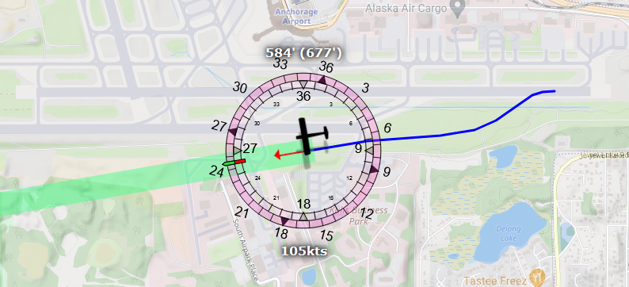</td><td>
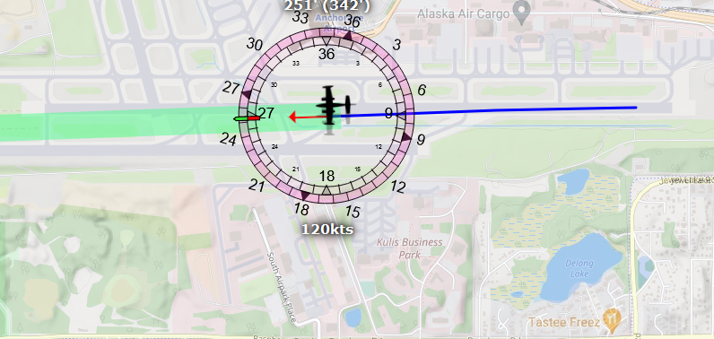</td>
</tr>
<tr><td>
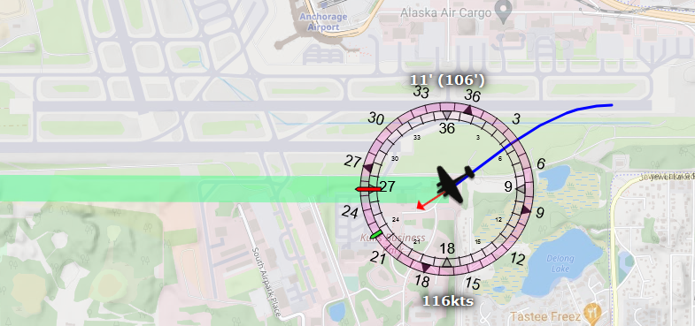</td><td>
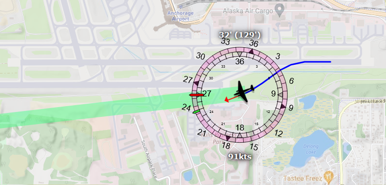</td>
</tr>
</table>


It's not good, this is varying degrees of crashing into trees or buildings, so we're definitely going to need to implement an "auto-rudder" of sorts if we want to at least _pretend_ we're sticking to the runway during takeoff.

One thing we notice is the difference between the 310R and the three tail draggers. As you may have guessed, this corresponds to the moment when the tail wheel no longer makes contact with the ground: up until that point we have the benefit of actually being able to (slightly) steer using the rear wheel, with the actual rudder having to do very little, but once it's off the ground we need to briefly work the rudder a lot harder to stop the plane from suddenly veering off.

So our attempt at an auto-rudder will consist of a few phases:

- pre-roll: where we make sure the plane's ready to roll (brakes, flaps, etc) and we record our start position
- initial roll, all wheels on the ground, plenty of control
  - the more out-of-heading we are, the more we steer back towards the center line.
  - if this is not a tail dragger, this phase effectively lasts for the entire roll.
- loss of control when the tail wheel comes off the ground
- Relatively stable control after the initial loss of control

If we're lucky (or we accept "good enough") we can come up with code that can handle all of these phases without knowing "which phase we're in", so we'll make some more observations:

- the faster we're going, the less rudder we need to apply to get the same effect
- the close to the center line we are, the less rudder we need to  apply,  and
- every plane has rudder characteristics that we could use to finesse the code, but we don't have access to them.

Now, the first two are relatively easy to implement (although we'll need a fair bit of code for step 2, even if it's simple code). It's that last point that's properly annoying. There's just no way to get the information we want, so if we want something that mostly kind of sort of works for mostly all planes, we're going to have run this code a million times for different planes and figure out what "magic constant" works for which plane. And then try to figure out what plane property that we _do_ have access to we can tie that to. To save you that headache, I've done that work for us, but suffice it to say we shouldn't feel good about this solution and ideally, one day, we will come up with something better.

So let's write some code:

```javascript
  async function changeThrottle(api, engineCount = 4, byHowMuch, floor = 0, ceiling = 100) {
    let newThrottle;
    for (let count = 1; count <= engineCount; count++) {
      const simVar = `GENERAL_ENG_THROTTLE_LEVER_POSITION:${count}`;
      const throttle = (await api.get(simVar))[simVar];
      if ((byHowMuch < 0 && throttle > floor) || (byHowMuch > 0 && throttle < ceiling)) {
        newThrottle = throttle + byHowMuch;
        api.set(simVar, newThrottle);
      }
    }
    return newThrottle ?? (byHowMuch < 0 ? floor : ceiling);
  }

  async throttleUp(engineCount) {
    const { api, maxed } = this;
    if (maxed) return;

    const newThrottle = await this.changeThrottle(api, engineCount, 1);
    console.log(`Throttle up to ${newThrottle | 0}%`);
    if (newThrottle === 100) {
      this.maxed = true;
    }
  }

  async autoRudder(onGround, isTailDragger, vs12, minRotate, currentSpeed, lat, long, heading) {
    const { api, takeoffCoord: p1, futureCoord: p2 } = this;

    // If we're actually in the air, we want to ease the rudder back to neutral.
    if (!onGround) {
      const { RUDDER_POSITION: rudder } = await api.get(`RUDDER_POSITION`);
      api.set(`RUDDER_POSITION`, rudder / 2);
      return;
    }

    // If we're still on the ground, get our aeroplane's drift with respect to the center line,
    // using orthogonal projection, https://en.wikipedia.org/wiki/Vector_projection
    // We know the centerline is p1--p2 (the place we started and a point in the distance
    // along the same heading as the runway), and we have a vector from p1 to our current
    // location, so we can project our current location onto the centerline and measure how
    // many feet off the centerline we are:
    const c = { lat, long };
    const abx = p2.long - p1.long;
    const aby = p2.lat - p1.lat;
    const acx = c.long - p1.long;
    const acy = c.lat - p1.lat;
    const coeff = (abx * acx + aby * acy) / (abx * abx + aby * aby);
    const dx = p1.long + abx * coeff;
    const dy = p1.lat + aby * coeff;
    const cross1 = (p2.long - p1.long) * (c.lat - p1.lat);
    const cross2 = (p2.lat - p1.lat) * (c.long - p1.long);
    const left = cross1 - cross2 > 0;
    const distInMeters = 100000 * FEET_PER_METER;
    const drift = (left ? 1 : -1) * dist(long, lat, dx, dy) * distInMeters;

    // Then we turn that distance into an error term that we add the number of degrees off
    // we are. If we need to fly 160 degrees and we're rolling towards 150, that's a 10
    // degree difference, but if we're also quite a few feet off the centerline, we can
    // tell the code we actually need to correct for, say, 12 or 15 degrees, so that we
    // don't just end up parallel to the center line, but actually drive back towards it.
    const limit = constrainMap(currentSpeed, 0, minRotate, 12, 4);
    const driftCorrection = constrainMap(drift, -130, 130, -limit, limit);

    // With that done, get our heading diff, with a drift correction worked in:
    const diff = getCompassDiff(heading, this.takeoffHeading + driftCorrection);

    // get our "magic constant":
    const stallFactor = constrainMap(vs12, 2500, 6000, 0.05, 0.3);

    // Set our "the faster we go, the less rudder we need" factor, which is just a straight
    // line down from 1 at a speed of zero to 0 at our minimum take-off speed, but constrained
    // so that we never go below 0.2, because we always want to be able to add *some* rudder.
    const speedFactor = constrain(1 - (currentSpeed / minRotate) ** 0.5, 0.2, 1);

    // Then the tail wheel: if this is not a tail dragger, only apply half the rudder.
    const tailFactor = isTailDragger ? 1 : 0.5;

    // And then finally we multiply all of those and put our foot down:
    const rudder = diff * stallFactor * speedFactor * tailFactor
    api.set(`RUDDER_POSITION`, rudder);
  }
```

And with that, what do things look like now?

<table>
<tr><td>
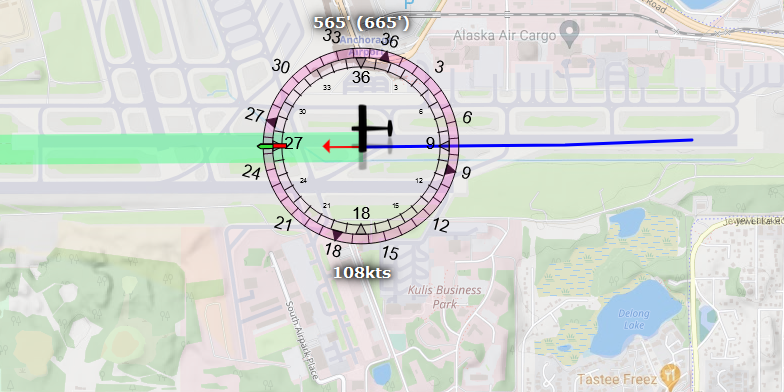</td><td>
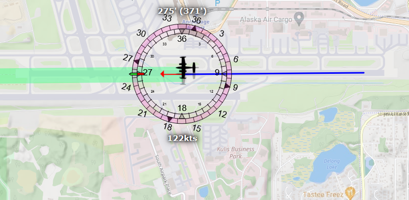</td>
</tr>
<tr><td>
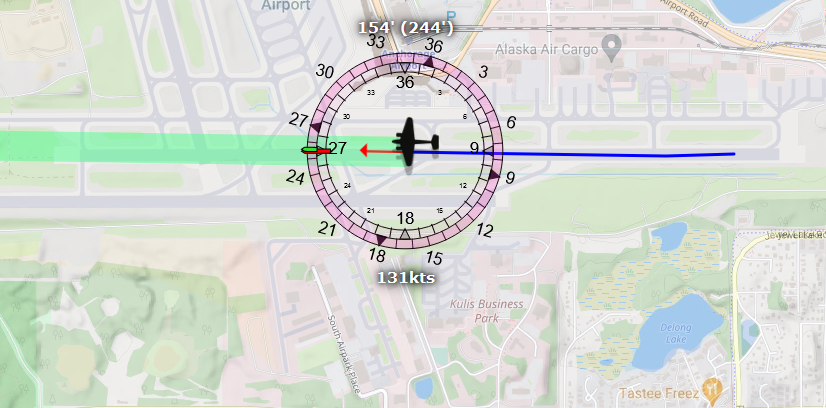</td><td>
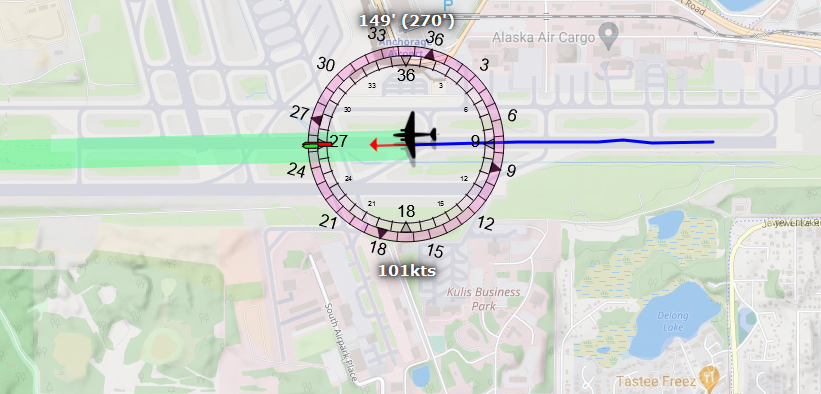</td>
</tr>
</table>


That looks straight to me! There's a bit of wibbling on the runway by the heavier two, but nothing that keeps them from taking off straight.

So let's implement that whole "taking off" business!

### Rotate/take-off

Once we're at rolling at a good speed, we'll probably want to rotate the aeroplane (i.e. get its nose up) and take off to the skies, but what's a good speed

There are two special speeds that determine when an aeroplane can take off (from amongst a [truly humongous list](https://en.wikipedia.org/wiki/V_speeds) of "V- speeds"):

- `Vr`, or the "rotation speed", which is the speed at which you want to start pulling back on the stick or yoke to get the plane to lift off,and
- `V1`, which is the cutoff speed for aborting a takeoff. If you haven't taken off by the time the plane reaches `V1`, you are taking off, whether you like it or not, because the alternative is a crash. It's the speed at which your plane can no longer safely slow down to a stop simply by throttling and braking, so you're going to keep speeding up and you ***will*** take off, even if you then find a suitable place to perform an emergency landing.

For the purpose of our auto-takeoff we're going to _prefer_ to use `Vr`, but not every plane has a sensible value set for that (for... reasons? I have no idea, some planes have nonsense values like -1), so we'll use the rule "use `Vr` unless that's nonsense, then use `V1`".

```javascript
  async checkRotation(onGround, currentSpeed, lift, dLift, vs, totalWeight) {
    const { api, autopilot } = this;

    let {
      DESIGN_SPEED_MIN_ROTATION: minRotate, // this is our Vr
      DESIGN_TAKEOFF_SPEED: takeoffSpeed,   // this is our V1
    } = await api.get(`DESIGN_SPEED_MIN_ROTATION`, `DESIGN_TAKEOFF_SPEED`);

    // Annoyingly both values are in "feet per second" instead of knots, so let's convert:
    minRotate *= FPS_IN_KNOTS;
    takeoffSpeed *= FPS_IN_KNOTS;
    if (minRotate < 0) minRotate = 1.5 * takeoffSpeed;
    // Just for safety, we'll pick our actual rotation speed as "the one that MSFS
    // suggests should work, but let's add 5 knots, just in case":
    const rotateSpeed = minRotate + 5;

    // So now that we know when to rotate: are we in a rotation situation?
    if (!onGround || currentSpeed > rotateSpeed) {
      const { ELEVATOR_POSITION: elevator } = await api.get(`ELEVATOR_POSITION`);

      // We're still on the ground: start pulling back on the stick/yoke
      if (this.liftoff === false) {
        this.liftoff = Date.now();
        const pullBack = constrainMap(totalWeight, 3500, 14000, 0.05, 2);
        api.set(`ELEVATOR_POSITION`, pullBack);
      }

      // If we're not on the ground anymore, there are two possibilities:
      else {
        // First, if we're climbing too fast, back off on the elevator a bit:
        if (vs > 1000 && elevator > 0) {
          const backoff = constrainMap(vs, 100, 3000, this.easeElevator / 100, this.easeElevator / 10);
          api.set(`ELEVATOR_POSITION`, elevator - backoff);
        }

        // But if we're not climbing fast enough, pull on that stick/yoke a bit more:
        else if (dLift <= 0.2 && lift <= 300 && vs < 200) {
          let touch = constrainMap(totalWeight, 3500, 14000, 0.02, 0.2);
          touch = constrainMap(dLift, 0, 0.1, touch, 0);
          api.set(`ELEVATOR_POSITION`, elevator + touch);
        }

        // Irrespective of which of those two we're in, we want to make sure that the wing leveler
        // is turned on, because we absolutely positively want to fly straight during take-off:
        if (!autopilot.modes[LEVEL_FLIGHT]) autopilot.setTarget(LEVEL_FLIGHT, true);
      }
    }
  }
```

And that's our take off code. The trick is to make sure we pull on the stick/yoke enough to make the plane "rotate" upwards (hence the name), but not so hard that it flies out of control, so we just use small steps, and as long as we're not climbing we just keep doing that. Eventually our pulling back the elevator will overcome gravity.

### Handoff to the autopilot

The final step in the auto-takeoff process is to signal that auto-takeoff is complete, and to turn out the autopilot with the heading we're already flying, and with terrain mode turned on, for the ultimate "one click flight" that starts on the runway instead of in mid-air with an MSFS autopilot set to who knows what (I love it when MSFS spawns you with the AP set to climb 2000 feet per minute).

The code above suggests that there's a signal we can use to determine whether we've completed take-off, namely when we've leveling out the plane and we reach a point where we're no longer vertically accelerating. At that point we can safely switch to the autopilot and have it take over the whole "what altitude do we actually need to fly at?" business:

```javascript
  async checkHandoff(title, isTailDragger, totalWeight, vs, dVS, altitudeGained) {
    const { api, autopilot } = this;

    // If the plane is leveling out, and we're not vertically accelerating, switch to the autopilot!
    if (this.levelOut && dVS <= 0) {
      // Set the elevator trim (scaled for the plane's trim limits) so that the
      // autopilot doesn't start in neutral and we don't suddenly pitch down hard.
      const { ELEVATOR_TRIM_UP_LIMIT: trimLimit } = await api.get(`ELEVATOR_TRIM_UP_LIMIT`);

      // Note that these values are guesses: there does not appear to be anything in MSFS that lets
      // use set the trim value to what it needs to be, the best it can give us is "cruise pitch",
      // which unfortunately does not translate to trim values at all. As such, some planes can
      // absolutely still pitch down hard and crash, like the PAC P-750 XSTOL...
      const trim = trimLimit * constrainMap(totalWeight, 3000, 6500, 0.0003, 0.003);

      // So just to show off how to deal with a problematic plane:
      if (title.toLowerCase().includes(`orbx p-750`)) {
        trim *= 4; // Seriously, it needs four times as much trim as most other planes.
      }

      await api.set("ELEVATOR_TRIM_POSITION", trim);

      // Then reset the elevator since it's not required for the autopilot to do its job:
      await api.set("ELEVATOR_POSITION", 0);

      // And then turn on terrain follow, while turning off auto-takeoff. In order for terrain follow
      // to kick in, we do need an altitude, but that can be any value, since it's going to immediately
      // get overruled by the waypoint or terrain follow code.
      autopilot.setTarget(ALTITUDE_HOLD, 10000);
      autopilot.setTarget(TERRAIN_FOLLOW, true);
      autopilot.setTarget(AUTO_TAKEOFF, false);
    }

    // If the plane is not level yet: mark the plane as leveling out so that the above "what to do
    // while leveling out" code paths kick in:
    const limit = constrainMap(totalWeight, 3000, 6500, 300, 1000);
    if (!this.levelOut && (vs > limit || altitudeGained > 100)) {
      this.levelOut = true;
      console.log(`level out`);
      const { ELEVATOR_POSITION } = await api.get(`ELEVATOR_POSITION`);
      this.easeElevator = ELEVATOR_POSITION;

      // And now that we're leveling off, run through the post-takeoff procedure:
      api.set(`RUDDER_POSITION`, 0);
      api.trigger(`GEAR_UP`);
      // Normally we'd also raise flaps, but we never lowered them, so we're already winning!
    }
  }
```

And... that's it, we implemented auto-takeoff! One-button flying, here we go!

### Testing our code

As always, we'll want to update our web page so that we can actually click that "one click flight" button:

```html
<div class="controls">
  <link rel="stylesheet" href="/css/autopilot.css" />
  <button class="MASTER">AP</button>
  <button title="level wings" class="LVL">LVL</button>
  <label>Target altitude: </label>
  <input class="altitude" type="number" min="0" max="40000" value="4500" step="100">
  <button title="altitude hold" class="ALT">ALT</button>
  <button title="auto throttle" class="ATT">ATT</button>
  <button title="terrain follow" class="TER">TER</button>
  <label>Target heading: </label>
  <input class="heading" type="number" min="1" max="360" value="360" step="1">
  <button title="heading mode" class="HDG">HDG</button>
  <!-- make the magic happen! -->
  <button title="auto take-off" class="ATO">take off</button>
</div>
```

That's getting crowded, but it's the last thing we're adding. No client-side JS changes, other than updating our list of autopilot strings:

``` javascript
export const AP_DEFAULT = {
  MASTER: false,
  LVL: false,
  ALT: false,
  ATT: false,
  TER: false,
  HDG: false,
  ATO: false,
};
```

And with that, we should be able to just spawn planes on a run and... fly.

In fact, we already did! All the graphs for terrain follow that started on the runway started with pressing the auto-takeoff button.

## Auto-landing

Of course, a flight consists of three parts: takeoff, "the flight" and landing, so... before we consider all of this "done", I'd say there's one thing left we should take a crack at. And because we can, let's implement this as a browser experiment (as a demonstration of how we _can_ do things purely client side).

### Browser experiments

Since auto-landing consists of phases, we'll start by defining a little experiment runner class that can "run things until some condition is met" so we can sequence the steps we need to perform, which we'll save under `public/js/experiments/experiment.js`:

```javascript
export class Runner {
  // We'll always pass in our map, and plane
  constructor(map, plane, interval = 1000) {
    this.map = map;
    this.plane = plane;
    this.interval = interval;
    this.reset();
  }

  // Always good to have a reset function
  reset() {
    this.stop();
    this.stopped = false;
  }

  // And a stop function. This will clear any outstanding timers
  // to stop any currently-running code.
  stop() {
    this.timers?.forEach((timerId) => clearInterval(timerId));
    this.timers = [];
    this.stopped = true;
  }

  // This function will repeatedly run `fn` (which must take exactly
  // one argument, `resolve`) until it calls the resolver.
  async run(fn) {
    if (this.stopped) return;

    const plane = this.plane;
    let timerId;

    return new Promise((resolve) => {
      const start = Date.now();

      // We don't pass our own resolve function, instead we pass an
      // augmented function that also cleans up the interval timer.
      const resolveAndClear = (...result) => {
        clearInterval(timerId);
        const pos = this.timers.indexOf(timerId);
        if (pos !== -1) this.timers.splice(pos, 1);
        // The resolver also yields an object { result, duration }
        // for accessing "whatever the function returned" and knowing
        // how long the phase that function implemented took.
        resolve({ duration: Date.now() - start, result });
      };

      // Set up the interval call to the passed function.
      timerId = setInterval(() => {
        // First: skip over this run if we're paused
        const { lastUpdate, paused } = plane;
        if (paused) return;
        // or if the plane data is nonsense
        const { lat, long } = lastUpdate;
        if (lat === undefined || long === undefined) return;
        // Otherwise, run the function
        fn(resolveAndClear);
      }, this.interval);

      this.timers.push(timerId);
    });
  }
}
```

With that we can extend our `index.js` to load up an experiment if the URL tells it to:

```javascript
...

const props = {
  onConnect: async () => {
    ...
    addEventListenerAPI(`MSFS`, () => {
      ...

      plane ??= new Plane(map, Duncan, 130);
      plane.reset();
      plane.waitForInGame();

      // Does the URL contain an "experiment" key=value pair?
      const experiment = URLqueries.get(`experiment`);
      if (experiment) {
        // if so, load that experiment:
        import(`./experiments/${experiment}/index.js`).then(
          ({ Experiment }) => {
            experimentRunner ??= new Experiment(map, plane);
          }
        );
      }
    });
  }
  ...
};

...
```

And then we can define our auto-landing experiment, in `public/js/experiments/auto-lander/index.js`:

```javascript
import { Runner } from "../experiment.js";

export class Experiment extends Runner {
  constructor(map, plane) {
    super(map, plane);

    // Let's add an auto-lander button to the page, so we have something to click:
    const ATL = document.createElement(`button`);
    ATL.textContent = `land`;
    ATL.title = `auto land`;
    ATL.classList.add(`ATL`);
    ATL.addEventListener(`click`, () => autoLand(this, map, plane));
    document.querySelector(`.controls`).appendChild(ATL);
  }
}

async function autoLand(runner, map, plane) {
  console.log(`autoland! we'll be filling this in as we go`);
}
```

And that's our infrastructure handled: if we now load up http://localhost:3000/?experiments=auto-land we should see a new button in our autopilot button list:


And if we click it, we'll see:

```javascript
  autoland! we'll be filling this in as we go
```

So that just leaves filling in that `autoland` function.

### Auto-landing phases

There's a couple of steps and phases that we need to implement, starting with the most obvious one: finding an airport to land at. MSFS has two ways to check for airports, one that just gets every airport in the game, which isn't super useful, and one that gets all airport that are in the current "local reality bubble" (that's literally what the SDK calls it).

<table>
<tr>
<td style="width:33%"></td>
<td style="width:28%">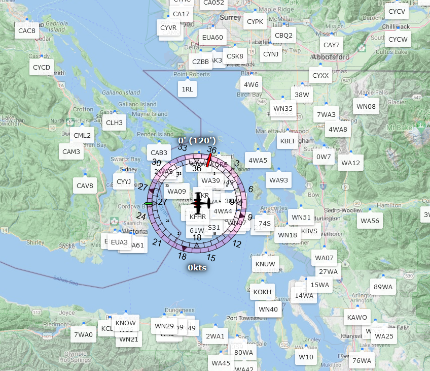</td>
<td style="width:38%">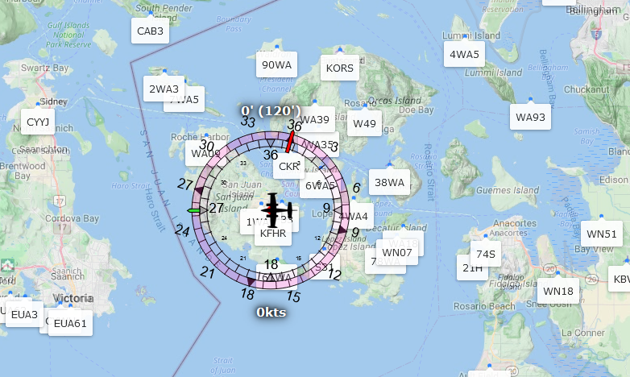</td>
</tr>
</table>

Uhh, so... yeah: that can still be a _lot_ of airports, and not every plane can land at every airport (ever tried landing a regular plane on a water runway? Not the best landing), so we'll need a few checks:

1. Find all nearby airports,
2. Reduce that list to, say, 10 airports,
3. Remove any airport that we can't land at,
4. Find all approach points for all runways and check how close we are to each, where an approach point is "a gps coordinate several miles ahead of the runway where we can start our approach". Even if one airport is closer than another, that may not be true for their approach points.
5. Determine a waypoint based path to that approach point (because we need to execute up to a 180 degree turn in order to end up flying in the right heading, and we don't want to do that at the last second).

Once we have a flight plan towards a runway, and we've flown it to the approach, the auto-landing procedure consists of the following phases:

1. The slow-down phase, where we throttle down in order to get to "we should survive landing" speed,
2. The descent phase, where we slowly drop to an altitude from which we'll survive landing,
3. The "short final" phase, where we're basically at the runway and drop the landing gear (if it's retractable) send the plane down towards the ground (this may involve flaring the aircraft at some distance above the ground),
4. The initial touch down, where we engage the brakes
5. The roll-out, where we keep applying brakes and use the rudder to keep us straight on the runway as we slow down, and
6. The end, where the plane has stopped, we can let go of the breaks, retract the flaps, and because we're in a sim, turn off the engine(s).

Note that this is a pretty simplified landing that you'd never fly in real life, or even in-sim if you're flying yourself, but the subtleties of landing are lost on a computer, we need to be explicit about every step, and in order to get auto-landing to work _at all_ we're taking some shortcuts. Refinements and finessing can always come later, if desired.

So, let's write some code

### Finding an approach

First, let's find the approach we'll need in order to land, which as we saw in the previous section means finding an airport, runway, and waypoints to get us lined up:

```javascript
function getNearestApproach(plane, approachDistance, airportCount = 10, icao = undefined) {
  const candidates = [];

  // Just because we can, if we already know the airport we want to land at,
  // we can bypass the "find a nearby airport" part of the approach-finding-code:
  if (icao) {
    const simvar = `AIRPORT:${icao}`;
    const airport = (await getAPI(simvar))[simvar];
    candidates.push(airport);
  } else {
    // If we don't, get all nearby airports. This will give us a list of airport
    // summaries, which isn't much more than their GPS coordinate, name, and ICAO code.
    const { NEARBY_AIRPORTS: nearby } = await getAPI(`NEARBY_AIRPORTS`);

    // We then reduce that to "airportCount" airports, since most will be nowhere near us:
    const { lat, long } = plane.lastUpdate;
    const reduced = nearby
      .map((e) => {
        e.d = getDistanceBetweenPoints(lat, long, e.latitude, e.longitude);
        return e;
      })
      .sort((a, b) => a.d - b.d)
      .slice(0, (airportCount = 10));

    // We can then ask for the full airport details for each of those.
    for await (let airport of reduced) {
      const simvar = `AIRPORT:${airport.icao}`;
      const fullAirport = (await getAPI(simvar))[simvar];
      fullAirport.distance = airport.d;
      candidates.push(fullAirport);
    }
  }

  // Now that we have our shortlist, let's calculate all their approach points.
  candidates.forEach((airport) =>
    computeApproachCoordinates(
      plane,
      airport,
      approachDistance,
      MARGIN_DISTANCE
    )
  );

  // We can then sort on how close we are to each approach point...
  let approaches = candidates
    .map((airport) => airport.runways.map((runway) => runway.approach))
    .flat(Infinity)
    .sort((a, b) => a.distanceToPlane - b.distanceToPlane);

  // And then remove any water landings if we can't land on water!
  const { FLOATS: isFloatPlane } = plane.flightModel.values;
  if (!isFloatPlane)
    approaches = approaches.filter((e) => {
      const surface = e.runway.surface;
      return !surface.includes(`water`);
    });

  // The first element left in the list is our approach!
  return  approaches[0];
}
```

Of course this does rely on that `computeApproachCoordinates` function, for turning runway information into actual approaches:

```javascript
function computeApproachCoordinates(plane, airport, approachDistance) {
  // Get the current plane lat/long
  const { lat: planeLat, long: planeLong } = plane.lastUpdate;

  // Then for each runway at an airport, figure out what the various coordinates
  // we need in order to build an approach path.
  airport.runways.forEach((runway) => {
    const { latitude: lat, longitude: long, length, width, heading } = runway;
    runway.airport = airport;
    let args;

    // Runways in MSFS are encoded as a center point, and a length and width, so
    // we need to do some math to get the runway center end points and four corners.
    args = [lat, long, length / 2000, heading];
    const { lat: latS, long: longS } = getPointAtDistance(...args);
    args = [lat, long, length / 2000, heading + 180];
    const { lat: latE, long: longE } = getPointAtDistance(...args);
    args = [latS, longS, width / 2000, heading + 90];
    const { lat: lat1, long: long1 } = getPointAtDistance(...args);
    args = [latS, longS, width / 2000, heading - 90];
    const { lat: lat2, long: long2 } = getPointAtDistance(...args);
    args = [latE, longE, width / 2000, heading - 90];
    const { lat: lat3, long: long3 } = getPointAtDistance(...args);
    args = [latE, longE, width / 2000, heading + 90];
    const { lat: lat4, long: long4 } = getPointAtDistance(...args);

    // To make our lives easier, let's just save those values, just in case.
    runway.coordinates = [
      [latE, longE],
      [latS, longS],
    ];

    runway.bbox = [
      [lat1, long1],
      [lat2, long2],
      [lat3, long3],
      [lat4, long4],
    ];

    // Then, for each runway we need to figure out our approach points,
    // which will consist of, in reverse order:
    //
    // - the runway end point,
    // - the runway start,
    // - the point several miles out from the start where we start our approach, and
    // - helper points to get us onto the approach, if needed.
    //
    // Runways have two ends, so we need to do this twice for each runway:
    runway.approach.forEach((approach, pos) => {
      const start = runway.coordinates[pos];
      const end = runway.coordinates[1 - pos];

      // First up, our approach point is `approachDistance` away from the start of the runway:
      approach.heading = (heading + (1 - pos) * 180) % 360;
      args = [...start, approachDistance, approach.heading];
      const { lat: alat, long: along } = getPointAtDistance(...args);
      const anchor = [alat, along];

      // To help make getting to the approach easier, add some "easing points",
      // which does require knowing which side of the runway line we're on.
      const a1 = getHeadingFromTo(...anchor, ...end);
      const a2 = getHeadingFromTo(...anchor, planeLat, planeLong);
      const s = sign(getCompassDiff(a2, a1));

      args = [alat, along, MARGIN_DISTANCE, approach.heading + s * 90];
      const { lat: palat1, long: palong1 } = getPointAtDistance(...args);
      args = [palat1, palong1, MARGIN_DISTANCE, approach.heading + s * 180];
      const { lat: palat2, long: palong2 } = getPointAtDistance(...args);

      // We'll save all those points
      approach.coordinates = {
        easingPoints: [[palat1, palong1], [palat2, palong2]],
        anchor,
        runwayStart: start,
        runwayEnd: end,
      };

      // And record how far we are from this approach
      approach.distanceToPlane = getDistanceBetweenPoints(planeLat, planeLong, alat, along);

      // With some back-references to the runway and airport, for future ease-of-code.
      approach.airport = airport;
      approach.runway = runway;
    });
  });
}
```

Lots of code, but not a lot of "logic". The bulk is "building points" based on knowing distances and angles. The only thing that's worth looking at is those easing points: what do those do? Well...

### Getting lined up

Consider the following setup:

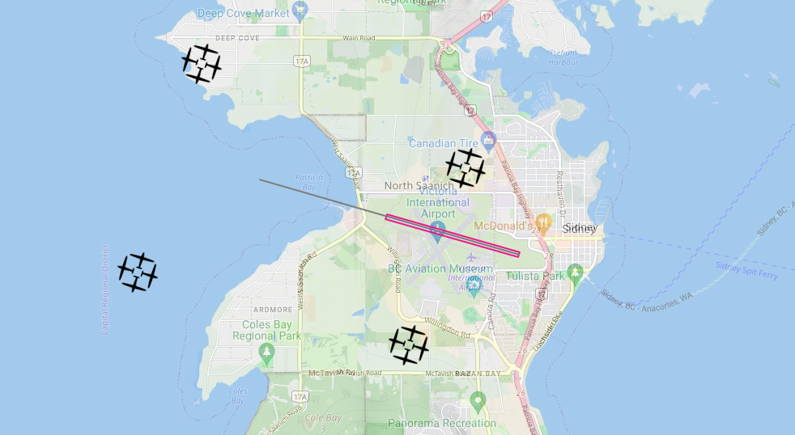

We have an approach to a runway, and a bunch of places a plane can be, in a bunch of different orientations. What should happen? We could put a single waypoint at the approach point, but things would get weird:

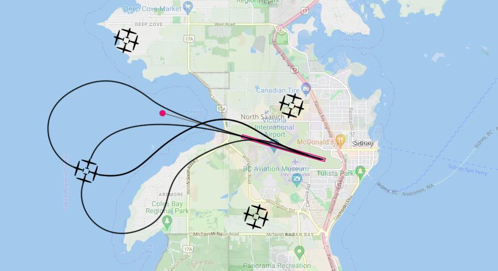

Those are not great: none of them actually get us to the approach. But it gets even worse for the planes near the runway:

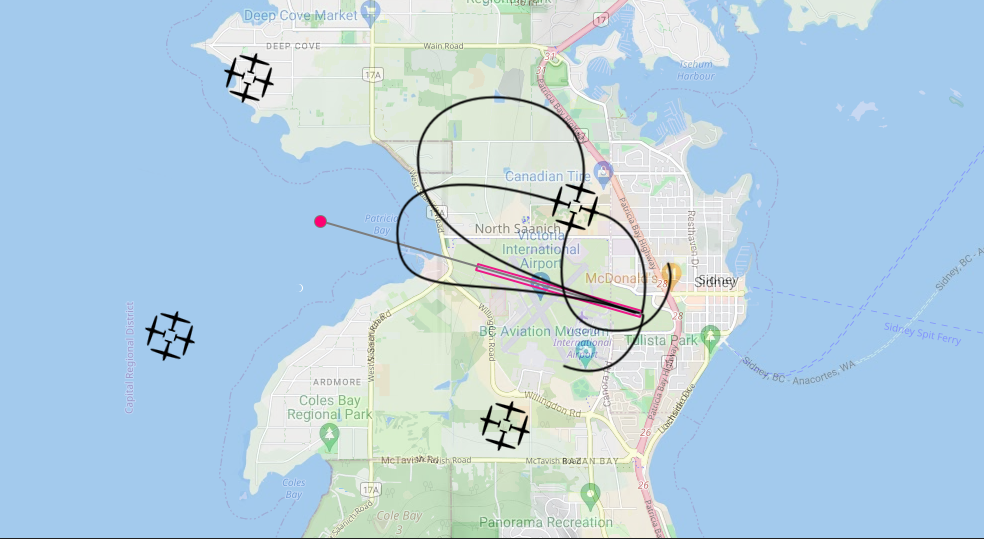

So this won't work. We can't land like this. Instead, we need some extra points to help us out. We can offset the approach point from the line to the runway, and guarantee at least the planes past the approach point will get there:

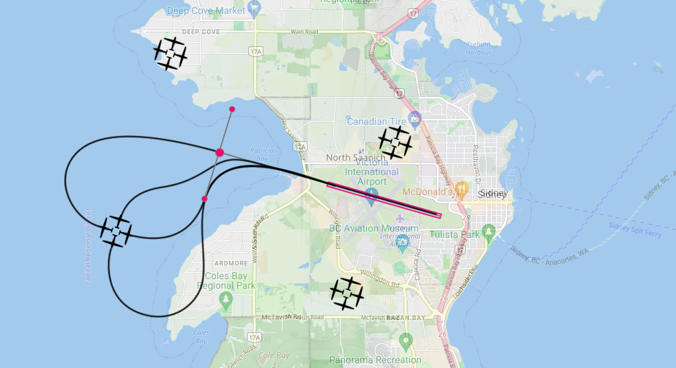

But the airplanes near the runway still need some help because two of them may still work (provided we're not _too_ close to the runway)

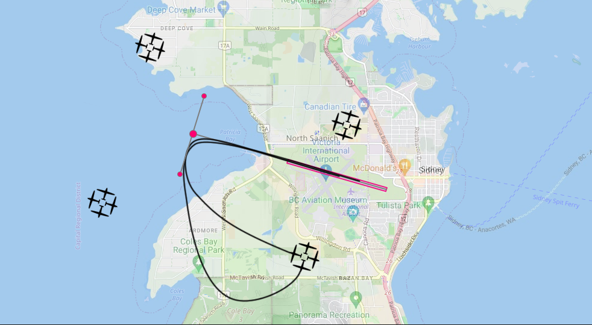

But two definitely won't:

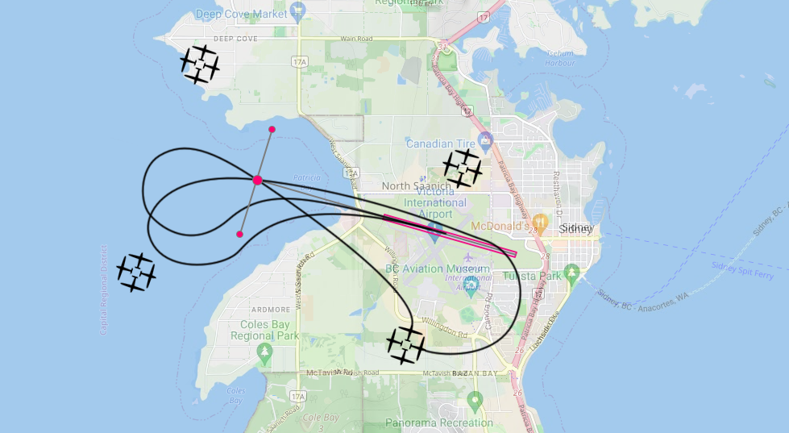

So for planes that are closer to the runway than the approach point, we add two more waypoints, moved closed to the runway, parallel to the runway:

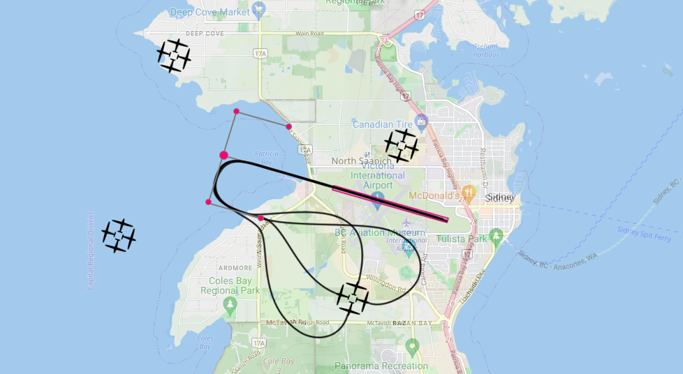

And now we have workable approaches: if we're further from the runway than the approach, we set up three waypoints (one easing point, the approach point, and the runway end) and if we're closer to the runway than the approach point, we use three (two easing points, the approach point, and the runway end).

Of course, the other part of getting lined up is "being at the right altitude", but that part is relatively easy: we're simply going to declare that we want to be at 1500 feet above the runway at the start of the approach, and 200 feet above the runway about halfway through the approach, and we'll just set the autopilot `ALT` value according to how close to the approach/runway we are.

So let's add some "getting onto the approach" code. First up, a function that'll actually build the waypoints _as_ autopilot waypoints for this approach:

```javascript
function setApproachPath(plane, { easingPoints, anchor, runwayStart, runwayEnd }) {
  const { lat, long } = plane.lastUpdate;
  const distToAirport = getDistanceBetweenPoints(lat, long, ...runwayStart);
  const approachDistance = getDistanceBetweenPoints(...anchor, ...runwayStart);

  // If we're on the wrong side of the approach, add the extra easing waypoints to get us onto the approach flight plan.
  if (distToAirport < approachDistance - MARGIN_DISTANCE) {
    callAutopilot(`waypoint`, { lat: easingPoints[1][0], long: easingPoints[1][1] });
  }

  // Then add the regular easing points.
  callAutopilot(`waypoint`, { lat: easingPoints[0][0], long: easingPoints[0][1] });

  // And then the approach start, and runway end.
  callAutopilot(`waypoint`, { lat: anchor[0], long: anchor[1] });
  callAutopilot(`waypoint`, { lat: runwayEnd[0], long: runwayEnd[1] });
}
```

And then a `getOntoApproach` function to, you know, get us onto the approach:

```javascript
const KMH_PER_KNOT = 1.852;
const KMS_PER_KNOT = KMH_PER_KNOT / 3600;
const TRANSITION_TIME = 30;

function getOntoGlideSlope(plane, approach, approachAltitude) {
  // Set those waypoints
  setApproachPath(plane, approach.coordinates);

  // Then tell the autopilot we need it set to perform waypoint flight.
  callAutopilot({
    MASTER: true,
    LVL: true,
    ALT: approachAltitude,  // we will either fly this altitude, or...
    ATT: true,
    TER: true,              // ...if terrain follow is on, just do that.
  });

  // Then return a runnable function that checks whether we made it to the approach point:
  return (done) => {
    const { lat, long, speed } = plane.lastUpdate;
    const transitionRadius = speed * KMS_PER_KNOT * TRANSITION_TIME;
    const distToApproach = getDistanceBetweenPoints(lat, long, ...approach.coordinates.anchor);
    if (distToApproach < transitionRadius) done();
  };
}
```

And then we can plug that into our currently empty  `autoland` function:

```javascript
const APPROACH_DISTANCE = 12; // in kilometers
const LANDING_ALTITUDE_DISTANCE = 6; // in kilometers, marks the point we want to be "at landing approach altitude".
const NUMBER_OF_AIRPORTS = 10;
const AIRPORT_ICAO = undefined; // we can hardcode this (or make it a URL parameter, etc) to explicitly use that airport.
const FEET_PER_METER = 3.28084;

async function autoLand(runner, map, plane) {

  // =============================
  // (1) Find a runway to land at
  // =============================

  const approach = await getNearestApproach(plane, APPROACH_DISTANCE, NUMBER_OF_AIRPORTS, AIRPORT_ICAO);
  const { airport, runway, coordinates, marking } = approach;
  const { anchor, runwayStart, runwayEnd } = coordinates;

  console.log(`Landing at ${airport.name}`);
  console.log(`Using runway ${marking}`);

  // And draw that runway on the map.
  drawApproach(map, approach);

  // Then we declare a little helper function for setting the autopilot
  // altitude parameter, based on plane location on the approach:
  const setAltitude = () => {
    const { lat, long } = plane.lastUpdate;
    const distanceToRunway = getDistanceBetweenPoints(lat, long, ...runwayStart);
    const distanceRatio = (distanceToRunway - LANDING_ALTITUDE_DISTANCE) / (APPROACH_DISTANCE - LANDING_ALTITUDE_DISTANCE);
    const alt = constrain(lerp(distanceRatio, landingAltitude, approachAltitude), landingAltitude, approachAltitude);
    callAutopilot(`update`, { ALT: alt });
  };

  // Get the runway altitude, in feet:
  const aalt = approach.airport.altitude * FEET_PER_METER;

  // Get the airplane's "center of gravity" altitude.
  const cgToGround = CG_TO_GROUND;

  // Then rewrite the runway altitude relative to the airplane's center of gravity.
  const runwayAltitude = aalt + cgToGround;

  // And then set our various decision altitudes:
  let approachAltitude = runwayAltitude + 1500;
  const landingAltitude = runwayAltitude + 200;
  const stallAltitude = runwayAltitude + 30;

  // =============================
  // (2) Get onto the glide slope
  // =============================

  console.log(`Flying towards the start of the approach.`);
  await runner.run(getOntoGlideSlope(plane, approach, approachAltitude));
  console.log(`Approach reached`);

  // Update the approach altitude so we don't force a climb just to force a descent.
  approachAltitude = min(approachAltitude, plane.lastUpdate.alt);
}
```

If we were to run this right now,  we'll see something like this:

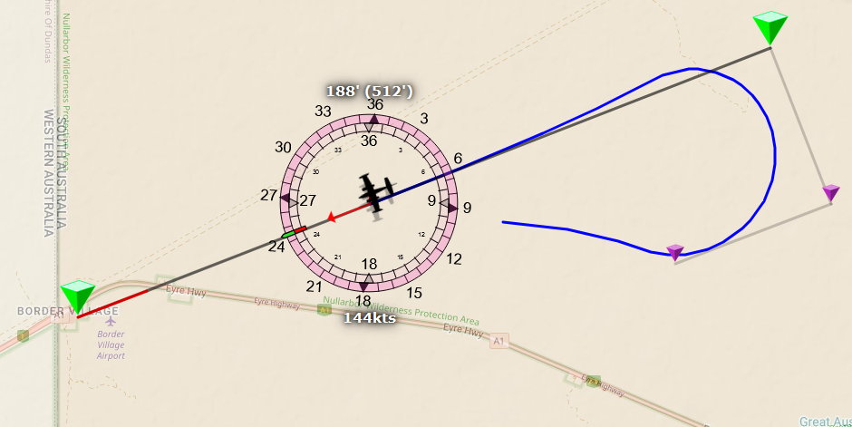

...if we remembered to implement the approach visualization:

```javascript
import { Trail } from "../../trail.js";

export function drawApproach(map, { runway, coordinates }) {
  const { bbox } = runway;
  const { anchor, runwayStart } = coordinates;

  // Draw the path from the approach point to the runway as a thick blackish line:
  let approachTrail = new Trail(map, anchor, `rgba(0,0,0,0.5)`, undefined, { width: 10 });
  approachTrail.add(...runwayStart);

  // And outline the runway itself in red:
  let runwayOutline = new Trail(map, bbox[0], `red`, undefined, { width: 2 });
  runwayOutline.add(...bbox[1]);
  runwayOutline.add(...bbox[2]);
  runwayOutline.add(...bbox[3]);
  runwayOutline.add(...bbox[0]);
}
```

So handy. But while flying over the runway is useful in order to understand your landing when you're flying a plane yourself, it's not much use for an auto-lander: we want to get this plane on the ground!

### Landing the plane

So let's implement the next part of our landing procedure:

```javascript
const SAFE_THROTTLE = ???
const DROP_DISTANCE_KM = ?????

async function autoLand(runner, map, plane) {
  ...

  // =========================================
  // (3) Throttle down to "still safe" speeds
  // =========================================

  const pos = SAFE_THROTTLE;
  console.log(`Throttle down to ${pos}%...`);
  await runner.run(throttleTo(plane, engineCount, pos, setAltitude));
  console.log(`Done`);

  // ============================
  // (4) Get to landing distance
  // ============================

  console.log(`Waiting until we get to ${DROP_DISTANCE_KM}km from the runway...`);
  await runner.run(reachRunway(plane, approach, DROP_DISTANCE_KM, setAltitude));
}

function throttleTo(plane, engineCount, position, setAltitude) {
  // turn off the auto-throttle (obviously) and terrain follow if it's on
  callAutopilot(`update`, { ATT: false, TER: false });

  // Then return the function that will keep throttling down until we reach our throttle target.
  return async (done) => {
    setAltitude();
    if ((await targetThrottle(engineCount, position)) === false) done();
  };
}

function reachRunway(plane, { runway, coordinates }, distance, setAltitude) {
  // Note that we measure this relative to the runway end, not the start,
  // because if the distance is small we might overshoot the runway start
  // and then the distance to the runway would start to increase.
  const { runwayEnd } = coordinates;
  const runwayLength = runway.length / 1000;

  // By using the runway end as point of reference, even a distance of zero,
  // or a negative distance, will work.
  return (done) => {
    setAltitude();

    const { lat, long } = plane.lastUpdate;
    const d = getDistanceBetweenPoints(lat, long, ...runwayEnd);
    if (d < runwayLength + distance) done();
  };
}

// And a helper function to set the throttle, or throttles. There can be up to 4 throttle levers.
async function targetThrottle(engineCount = 4, target, step = 1) {
  let updated = false;
  for (let count = 1; count <= engineCount; count++) {
    const throttleVar = `GENERAL_ENG_THROTTLE_LEVER_POSITION:${count}`;
    const throttle = (await getAPI(throttleVar))[throttleVar];
    // Are we not at our target yet for this lever?
    if (abs(throttle - target) >= abs(step)) {
      const diff = target - throttle;
      // If we're less than a step away, ignore the step size
      if (abs(diff) < abs(step)) { setAPI(throttleVar, target); }
      else {
        // Otherwise move the lever up or down by a step.
        if (diff > 0) step = abs(step);
        if (diff < 0) step = -abs(step);
        setAPI(throttleVar, throttle + step);
      }
      updated = true;
    }
  }
  return updated;
}
```

There's two things we need to answer before we can run this code, though: what's a safe throttle position, and what's the right distance from the runway to start the actual landing? Because those depend on the plane we're flying. Unfortunately, as far as I know (although I'd love to be shown otherwise) there is no good way to abstract that information from SimConnect variables and/or current flight information, so.... we hard code them. For example, for the DeHavilland DHC-2 "Beaver", `SAFE_THROTTLE` is 65%, and `DROP_DISTANCE_KM` is 0.5, and for the Cessna 310R, the `SAFE_THROTTLE` is 35%, and the `DROP_DISTANCE` is 0.8... how do we know? I flew those planes, many many times, over a nice flat stretch of Australia where you can just go in a straight line forever while setting the throttle to something and then wait to see what speed that eventually slows you down to. And then cutting the throttle to see how long it takes to hit the ground. Science!

But yeah, it means we're going to need some airplane-specific parameters, which means we might as well make some airplane profiles. We don't _want_ those, but I haven't figured out a way to make auto-landing work without them, so...  let's go? We'll make a little `parameters.js` file, and I'm giving you two airplanes but you get to do the rest:

```javascript
export const BEAVER = {
  APPROACH_DISTANCE: 10,
  LANDING_ALTITUDE_DISTANCE: 6,
  CG_TO_GROUND: 1.85,
  SAFE_THROTTLE: 65,
  DROP_DISTANCE_KM: 0.5,
  FLARE_ALTITUDE: 15,
  FLARE_AMOUNT: 0.1,
  RUDDER_FACTOR: 0.025,
  INITIAL_BRAKE_PERCENTAGE: 25,
  ROLLOUT_BRAKE_PERCENTAGE: 10,
};

export const C310R = {
  APPROACH_DISTANCE: 12,
  LANDING_ALTITUDE_DISTANCE: 6,
  CG_TO_GROUND: -0.6057333600272727,
  SAFE_THROTTLE: 35,
  DROP_DISTANCE_KM: 0.8,
  FLARE_ALTITUDE: 15,
  FLARE_AMOUNT: 0,
  RUDDER_FACTOR: 0.1,
  INITIAL_BRAKE_PERCENTAGE: 100,
  ROLLOUT_BRAKE_PERCENTAGE: 100,
};
```

and then we update our autoland code to use those:

```javascript
import { BEAVER, C310R } from "./parameters.js";

// Plane-specific parameters
let APPROACH_DISTANCE;
let LANDING_ALTITUDE_DISTANCE;
let CG_TO_GROUND;
let SAFE_THROTTLE;
let DROP_DISTANCE_KM;
let FLARE_ALTITUDE;
let FLARE_AMOUNT;
let RUDDER_FACTOR;
let INITIAL_BRAKE_VALUE;
let ROLLOUT_BRAKE_VALUE;

// Brakes run on this weird ±2^14 scale, but we like percentages better.
function brake(percentage) {
  const value = map(percentage, 0, 100, -16383, 16383) | 0;
  triggerEvent(`AXIS_LEFT_BRAKE_SET`, value);
  triggerEvent(`AXIS_RIGHT_BRAKE_SET`, value);
}

function assignParameters(plane) {
  const title = plane.flightModel.values.TITLE.toLowerCase()
  let PARAMS;
  if (title.includes(` beaver`)) PARAMS = BEAVER;
  if (title.includes(` 310`)) PARAMS = C310R;

  APPROACH_DISTANCE = PARAMS.APPROACH_DISTANCE;
  LANDING_ALTITUDE_DISTANCE = PARAMS.LANDING_ALTITUDE_DISTANCE;
  CG_TO_GROUND = PARAMS.CG_TO_GROUND;
  SAFE_THROTTLE = PARAMS.SAFE_THROTTLE;
  DROP_DISTANCE_KM = PARAMS.DROP_DISTANCE_KM;
  FLARE_ALTITUDE = PARAMS.FLARE_ALTITUDE;
  FLARE_AMOUNT = PARAMS.FLARE_AMOUNT;
  RUDDER_FACTOR = PARAMS.RUDDER_FACTOR;
  INITIAL_BRAKE_VALUE = percentageToValue(PARAMS.INITIAL_BRAKE_PERCENTAGE);
  ROLLOUT_BRAKE_VALUE = percentageToValue(PARAMS.ROLLOUT_BRAKE_PERCENTAGE);
  NO_BRAKES = percentageToValue(0);
}

async function autoLand(runner, map, plane) {
  assignParameters(plane);

  // =============================
  // (1) Find a runway to land at
  // ============================

  ...
}
```

Disappointing, but at least we know this will work. For the planes we figure out all these parameters for at least. Moving on: the `throttleTo` function is really simple: every time it gets called, we make sure to update the current target altitude, while decreasing the throttle by 1%, until we reach the target throttle percentage. Then we stop running it. Following that, `reachRunway` is just as simple. It also runs the "make sure to update the target altitude" code, and just checks "are we close enough to the runway to start landing?". If so, it stops running. Because at that point it's time for...

#### Getting onto the runway

Landing the plane is really more of a controlled crash: we cut the engine (or rather, throttle, we keep the engine itself running), drop our landing gear, and fully extend the flaps so that we basically end up gliding onto the runway.

```javascript
async function autoLand(runner, map, plane) {
  ...

  // ==============================
  // (5) Perform a stalled landing
  // ==============================

  console.log(`We're doing it!`);
  await runner.run(dropToRunway(plane, engineCount, cgToGround, stallAltitude));
}

function dropToRunway(plane, engineCount, cgToGround, dropAltitude) {
  // Tell the autopilot we want to get super duper close to the runway, altitude wise
  callAutopilot(`update`, { ALT: dropAltitude });

  // Then, pretty important: gear down
  triggerEvent(`GEAR_DOWN`);

  // and full flaps
  setAPI(`FLAPS_HANDLE_INDEX:1`, 10);

  return async (done) => {
    // throttle all the way down down to a glide
    changeThrottle(engineCount, -1, 0, 100);

    // If we're on the ground, turn off the autopilot, and we're done with that phase!
    if (!plane.lastUpdate.airBorn) {
      callAutopilot(`update`, { MASTER: false });
      done();
    }
  };
}
```

Simple enough, although there's one part missing: we need to flare, as in pull up a little just before we hit the ground, so we don't hit the ground with our wheels, pivot over them, remember we don't have a nose wheel, and plow propeller-first into the runway. So:

```javascript
function dropToRunway(plane, engineCount, cgToGround, dropAltitude) {
  ...

  // We only need to flare once, so we use a little boolean flag to check whether we already did this.
  let flared = false;

  return async (done) => {
    changeThrottle(engineCount, -1, 0, 100);

    // Get the "true" altitude above the ground,
    const { PLANE_ALT_ABOVE_GROUND_MINUS_CG: pacg } = await getAPI(`PLANE_ALT_ABOVE_GROUND_MINUS_CG`);
    const distanceToGround = pacg - cgToGround;

    // If we're at or below flare altitude: flare
    if (distanceToGround < FLARE_ALTITUDE && !flared) {
      setAPI(`ELEVATOR_POSITION`, FLARE_AMOUNT);
      flared = true;
    }

    if (!plane.lastUpdate.airBorn) {
      callAutopilot(`update`, { MASTER: false });
      done();
    }
  };
}
```

With that, by the time this function exits we are on the ground, without having kissed the tarmac with our lips, rather than our wheels. Which means it's time for...

#### Braking and steering

Different planes can brake different amounts without things going wrong. If we're in a tail dragger, we can only apply so much brake force before the wheels slow down faster than the plane, and the plane rotates forward and does a nose-over. If we're in a plane with a tricycle gear, though, we have a wheel at the nose that prevents nose-over and we can basically brake as hard as we want, until we've stopped. So:

```javascript
async function autoLand(runner, map, plane) {
  ...

  // =========================
  // (6) Brake to a full stop
  // =========================

  console.log("Braking...");
  await runner.run(startBraking(plane, approach, engineCount));
  await runner.run(rollOut(plane, engineCount));

  console.log(`Landing complete`);
}

function startBraking(plane, approach, engineCount) {
  // hit the brakes, appropriate to our airplane
  brake(INITIAL_BRAKE_VALUE);

  // Then keep braking and throttling down to zero, until the plane's going less than 15kts
  return (done) => {
    targetThrottle(engineCount, 0);

    // We also apply some auto rudder, which we basically stole from our auto-takeoff code, because why not?
    const { lat, long, speed, heading: h1, trueHeading: h2 } = plane.lastUpdate;
    const { runwayStart, runwayEnd } = approach.coordinates;
    const target = pathIntersection(runwayStart[1], runwayStart[0], runwayEnd[1], runwayEnd[0], long, lat, 0.2);
    const declination = getCompassDiff(h1, h2);
    let targetHeading = getHeadingFromTo(lat, long, target.y, target.x);
    targetHeading = (targetHeading + 360 - declination) % 360;
    const headingDiff = getCompassDiff(plane.lastUpdate.heading, targetHeading);
    const diff = constrain(headingDiff, -2, 2);
    const rudder = RUDDER_FACTOR * diff;
    setAPI(`RUDDER_POSITION`, rudder);

    if (speed < 15) done();
  };
}

function rollOut(plane, engineCount) {
  // Flaps up
  setAPI(`FLAPS_HANDLE_INDEX:1`, 0);

  // Ease up on the brakes, if we need to
  brake(ROLLOUT_BRAKE_VALUE);

  // Then keep throttling down to 0
  return (done) => {
    targetThrottle(engineCount, 0);

    const { speed } = plane.lastUpdate;
    if (speed < 1) {
      // Release the brakes...
      brake(0);

      // And kill the engine.
      triggerEvent(`ENGINE_AUTO_SHUTDOWN`);

      // We are officially done!
      done();
    }
  };
}
```

And that's it! We've done everything necessary to achieve fully automated flight!

### Testing the code

Now, testing this code is rather straight forward in that we just fire up MSFS, put a plan on a runway, create a bit of a flight plan, hit "take off" in the browser, and when we reach the last marker, we click "land" (we could automate that, but that's for another day. By you). That does not translate well into pictures, though, so as the final test for all our hard work, let's just capture this one using the medium of video capture.

We'll fly the Beaver from [Dingleburn Station](https://dingleburn.co.nz/) on New Zealand's South Island to [Wānaka](https://en.wikipedia.org/wiki/W%C4%81naka), with auto-takeoff, waypoint navigation, and auto-landing. Enjoy a 20 minute trip across some beautiful New Zealand scenery.

<iframe width="1000" height="400" src="https://www.youtube.com/embed/xIyGfYj66T0" frameborder="0" allow="picture-in-picture" allowfullscreen></iframe>


# Conclusions

Holy crap, we did a lot! Also: this stuff is cool!

We've just been writing a bunch of JS and it's flying aeroplanes in a flight simulator for us. Sure, you could spend an hour programming the in-game autopilot, but unless you're deep into flight sims and you want full realism "all-where every-when", that's not exactly an appealing prospect. And yes, getting to the point where can just hit "go" and enjoy the ride took a bit of work, but now, if we want, we never have to use an in-game autopilot again.

So you might be wondering what else we can do. Here are some thoughts:

1. We could vastly improve auto landing by taking runway length and slope into account, not to mention terrain: not every runway has a nice clear path to it. Good luck landing at [Lukla](https://en.wikipedia.org/wiki/Tenzing-Hillary_Airport), for instance!
2. We could add in a "fly inverted" button so that acrobatic planes can file on autopilot... upside down. This would require a different way of trimming because acrobatic/fighter planes tend to "go where you point them" nearly immediately, and running an autopilot every half second with fairly coarse trim instructions because we're relying on planes to slowly act on those trim instructions would make those type of planes flip and spin out of control rather quickly.
3. We could make the waypoint code more like "path tracking" code, where we don't just define waypoints but make them curve control points that let use create fancy paths through canyons or over landscape features rather than just flying mostly straight lines between them.
4. We could try to replace our blocks of "code guesses" with self-tuning PID controller code so we that we only need to say what what targets we want, and the PID controller figures out what good steps sizes for that are. This is one of those "conceptually, this is simple" because we can replace a whole bunch of code with a PID initialization and then a few lines of update loop, but actually making that work can be the worst time sink you never knew existed. The problem with PID controllers isn't setting them up, it's the full-time job of tweaking them that will make you regret your life decisions.
5. I mean you've see what we can do already, the sky's the limit. Or, you know what: no, it isn't. We're already flying, there are no limits. Get your learn on and write something amazing, and then tell the world about it.

I hope you had fun, and maybe I'll see you in-sim. Send me a screenshot if you see me flying, I might just be testing more code to add to this tutorial! =D

— [Pomax](https://mastodon.social/@TheRealPomax)
