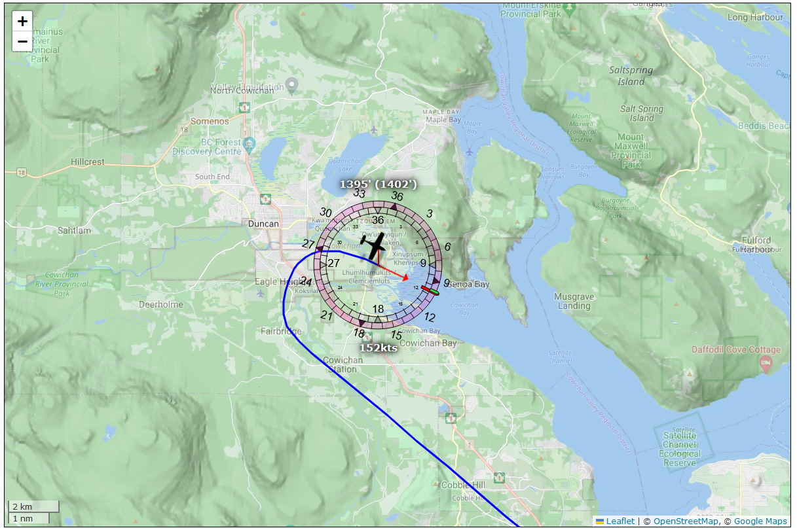
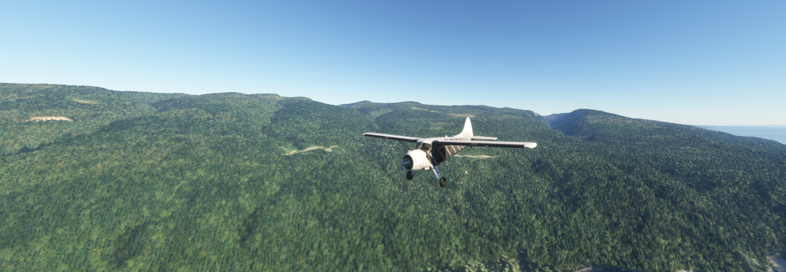
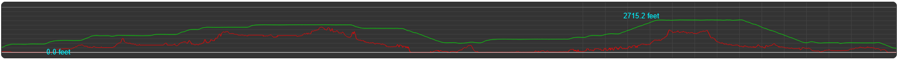

<section id="nav-menu">

</section>


# Flying planes with JavaScript
{:.no_toc}


To allay any concerns: this is not about running JavaScript software to control an actual aircraft.

**_That would kill people_**.

Instead, we're writing a web page that can control an autopilot running in JS that, in turn, controls a little virtual aeroplane. And by "little" I actually mean "most aeroplanes in [Microsoft Flight Simulator 2020](https://www.flightsimulator.com/)" because as it turns out, MSFS comes with an API that can be used to both query _*and set*_ values ranging from anything as simple as cockpit lights to something as complex as spawning a fleet of aircraft and making them fly in formation while making their smoke pattern spell out the works of Chaucer in its original middle English.

While we're not doing that (...today?), we _*are*_ going to write an autopilot for planes that don't have one, as well as planes that do have one but that are just a 1950's chore to work with, while also tacking on some functionality that just straight up doesn't exist in modern autopilots. The thing that lets us perform this trick is that MSFS comes with something called [SimConnect](https://docs.flightsimulator.com/html/Programming_Tools/SimConnect/SimConnect_SDK.htm), which is an SDK that lets people write addons for the game using C, C++, or languages with .NET support... and so, of course, folks have been writing connectors to "port" the SimConnect function calls to officially unsupported languages like Go, Node, Python, etc.

Which means that we could, say, write a web page that allows us to see what's going on in the game. And toggle in-game settings. And --and this is the one that's the most fun-- _fly the plane_ from a web page. And once we're done "it'll be that easy" but the road to get there is going to take a little bit of prep work... some of it tedious, some of it weird, but all of it's going to set us up for just doing absolutely ridiculous things and at the end of it, we'll have a fully functional autopilot _with auto-takeoff and flight planning that's as easy as using google maps_ and whatever's missing, you can probably bolt on yourself!

Before we get there though, let's start at the start. If the idea is to interface with MSFS from a webpage, and webpages use JS, then your first thought might be "Cool, can I write an [express](https://expressjs.com/) server that connects to MSFS?" to which the answer is: yes! There is the [node-simconnect](https://www.npmjs.com/package/node-simconnect) package for [Node](https://nodejs.org), which implements full access to the SimConnect DLL file, but it's very true to the original C++ SDK, meaning it's a bit like "programming C++ in JavaScript". Now, you might like that (I don't know your background) but JS has its own set of conventions that don't really line up with the C++ way of doing things, and because I know my way around programming and I like writing JS, I created a somewhat more "JavaScripty" API on top of node-simconnect called [msfs-simconnect-api-wrapper](https://www.npmjs.com/package/msfs-simconnect-api-wrapper) (I am _*great*_ at naming things) which lets me (and you!) write code that can talk to MSFS in a way that looks and feels much more like standard JavaScript, so... let's use that!

Also, because we want to talk "from the browser to a game", we don't really want to have to rely on HTML GET and POST requests, because they're both slow, and unidirectional: the game will never be able to talk to us unless it's to answer a question we sent it. That's not great, especially not if we want to register event handlers, so instead we'll use [web sockets](https://developer.mozilla.org/en-US/docs/Web/API/WebSockets_API), which let us set up a persistent bidirectional data connection And to make that a trivial task, we're going to use a library called ["socketless"](https://github.com/Pomax/socketless), which lets us write client/server code as if everything is just local code, and it magically makes things work over the network.

If that sounds cool: you can check out the complete project over on the ["Are we flying?"](https://github.com/Pomax/are-we-flying) Github repository, and you can just clone that and run the project with a simple `run.bat`, but if you want to actually learn something... let's dive in!

## The structure of this "tutorial"

We'll be tackling this whole thing in six parts:

1. In the first part we'll cover the prep work we need to do in order to set up a working combination of MSFS, a SimConnect API server for communicating to and from MSFS, and a web server that hosts a webpage and takes care of communicating to and from the API server.
2. In the the second part we'll cover the "web page pages", where we're going to visualize everything we can visualize relating to our flights in MSFS, including graphs that plot the various control values over time (altitude, speed, heading, trim values, etc.) to get a better insight into how our aeroplane(s) responds to control inputs.
3. In the third part we'll cover the thing you came here for: writing our own autopilot (in several stages of complexity) and making our computer fly planes all on its own!
4. In the fourth part, we're going to cover the "flight path" part of a modern autopilot, but rather than programming specific radio beacons and airports, we're going the google maps route, where you just place markers on the map and then the plane flies the path through those markers.
5. Part five is dedicated to running test flights and rewriting some of our code based on the flight behaviour of a variety of in-game planes ranging from ultra light to commercial jet airliners.
6. In the sixth part, we're going to cover the thing you didn't even realize you came here for: literally making JavaScript fly our plane for us, where we spawn a plane on the runway, click "take off" in the browser and have the plane just... start flying in MSFS with us along for the ride, following our flight path with automatic elevation detection, and then when we click "land", having the autopilot find a nearby airport, figure out an approach, and then land the plane for us. _Because we can_.

And along the way we're going to learn a few developer tricks like hot reloading ES modules, mocking SimConnect, and other such fun things.

By the time we're done, we'll have a web page that looks a little bit like this:


While the in game view looking like this:


or this:


If that sounds (and looks) good to you, then read on!


# Table of Contents
{:.no_toc}

* table of contents goes here
{:toc}

# Part 1: The prep work

As mentioned, we're going to have to do a bit of prep work before we can start writing the fun stuff, so let's get this done. We're going to implement three things:

1. An API server that talks directly to MSFS, and accepts web socket connections that can be used by API clients to interact with MSFS,
2. a web server that serves a webpage, and accepts web socket connections from the webpage, which it can forward to the API server, and
3. a web page with some code that connects it to the API (as far as it knows) using a web socket and can show the various aspects of a flight.

In high fidelity image media, we'll be implementing this:


And as mentioned, to make our lives a little easier we're going to be using the [socketless](https://www.npmjs.com/package/socketless) library to take care of the actual client/server management, so we can just focus on writing the code that's going to let us show a user interface based on talking to MSFS. The nice thing about this library is that it does some magic that lets clients and servers call functions on each other "without knowing there's a network". If the server has a function called `test` then the client can just call `const testResult = await this.server.test()` and done, as far as the client knows, the server is just a local variable. Similarly, if the client has a function called `test` then server can call that with a `const testResult = await this.clients[...].test()` and again, as far as the server knows it's just working with a local variable.

## Setting up our project

Let's start by creating a new dir somewher called `are-we-flying` and initialising it as a Node project:

```bash
> mkdir are-we-flying
> cd are-we-flying
are-we-flying> npm init -y
```

after which we can install the dependencies that we'll need: [dotenv](https://www.npmjs.com/package/dotenv), [open](https://www.npmjs.com/package/open), [socketless](https://www.npmjs.com/package/socketless), and [msfs-simconnect-api-wrapper](https://www.npmjs.com/package/msfs-simconnect-api-wrapper).

```bash
> npm i dotenv open socketless msfs-simconnect-api-wrapper
```

Then, we want to make sure to tell Node that we we'll be writing normal, modern JS with JS modules, rather than Node's legacy module system: open `package.json` and add the key/value pair `"type": "module"` .

## An .env file

Next up, we'll create a file called `.env` that will house a few variables that we want to be using across all our code:

```env
WEB_PORT=3000
API_PORT=8080
```

Nothing fancy, just two port numbers for now.

## A "socketless" API, and web servers

Before we look at the "real" code we want to write, let's quickly run through the "boilerplate" code we need to run our API server, which we'll put in `api-server.js`:

```js
// First we load our .env file:
import url from "node:url";
const __dirname = url.fileURLToPath(new URL(".", import.meta.url));
import dotenv from "dotenv";
dotenv.config({ path: `${__dirname}/.env` });

// And get our API server's port from that environment:
const { API_PORT } = process.env;

// Then we set up socketless so it can do its thing:
import { createServer } from "socketless";
import { ServerClass } from "./src/classes/index.js";

// Where "its thing" is creating an API server instance:
const { webserver } = createServer(ServerClass);

// Which we then run like you would any other Node server.
webserver.listen(API_PORT, () => {
  console.log(`Server listening on http://localhost:${API_PORT}`);
});
```

And that's all the code we need to set up a server (ignoring the actualy `ServerClass`, which we'll look at in a bit). So next up is the code required to run the "web server" part of our above diagram, which we'll put in `web-server.js`:

```js
// We start the same was as above:
import url from "node:url";
const __dirname = url.fileURLToPath(new URL(".", import.meta.url));
import dotenv from "dotenv";
dotenv.config({ path: `${__dirname}/.env` });

// Instead of "just a server" our web server will act as a client
// to our API server, but as web server for browsers that try to
// connect. As such we need to know both the port for our API server
// as well as what port we should use for our own server:
const { API_PORT, WEB_PORT } = process.env;

// Then we set up a socketless client with "browser connection" functionality:
import { ClientClass } from "./src/classes/index.js";
import { createWebClient } from "socketless";

// Clients need to know which URL to find the server at:
const serverURL = `http://localhost:${API_PORT}`;

// And web clients need to know which directory/folder to serve static content from:
const dir = `${__dirname}/public`;

// Which means we can now create our "web-enabled client":
const { clientWebServer } = createWebClient(ClientClass, serverURL, dir);

// And then we run its web server the same way we ran the API server:
clientWebServer.listen(WEB_PORT, () => {
  console.log(`Server listening on http://localhost:${WEB_PORT}`);

  // With an extra bit that automatically opens a browser for us:
  if (process.argv.includes(`--browser`)) {
    import("open").then(({ default: open }) => {
      open(`http://localhost:${WEB_PORT}`);
    });
  }
});
```

So a tiny bit more code, but that's all we need to do in terms of setting up our "API server ↔ client ↔ browser" constellation. The `socketless` library takes care of all of that so we can focus on actually implementing the code we _care_ about. And on that note, let's look at that code because we have two classes to implement:

1. the server class, which will be our interface between MSFS and our clients, and
1. the client class, which will be our interface between the server and the browser.

### But first, some testing!

Before we implement those though, let's verify that the code we wrote even works by implementing some tiny client and server classes with just enough code to show connections and function calls to work. Let's create a `src/classes/index.js` with "dummy" client and server classes:

```js
// Our client class will announce its own connection, as well as browser connections:
export class ClientClass {
  // nothing special going on here, just a console log
  onConnect() {
    console.log(`[client] We connected to the server!`);
  }
  // and nothing special going on here either, just more console log
  onBrowserConnect() {
    console.log(`[client] A browser connected!`);
  }
}

// Our server class will also announce that it got client connections:
export class ServerClass {
  // still nothing special going on here...
  onConnect(client) {
    console.log(`[server] A client connected!`);
  }
  // ...but we do add a little test function that clients can call:
  async test() {
    console.log(`[server] test!`);
    return "success!";
  }
}
```

Then, to add the browser into the mix, we'll also create a quick `public/index.html` file:

```html
<!DOCTYPE html>
<html lang="en-GB">
  <head>
    <meta charset="utf-8" />
    <title>Let's test our connections!</title>
    <script src="js/index.js" type="module" async></script>
  </head>
  <body>
    <!-- we only need to look at the developer tools "console" tab for now -->
  </body>
</html>
```

And then a bare minimum amount of browser JS in `public/js/index.js`:

```javascript
// We don't need to put a "socketless.js" in our public dir,
// this is a "magic import" that works when we're connected
// to a socketless web server:
import { createBrowserClient } from "../socketless.js";

// Then we set up our browser client to announce its connections:
class BrowserClient {
  async init() {
    console.log(`[browser] We're connected to our web client!`);

    // And then as part of startup, we'll call the server's
    // test function, just to confirm that works:
    console.log(`Calling test:`, await this.server.test());
  }
}

// Then the only thing left to do in the browser is to create a browser client instance:
createBrowserClient(BrowserClient);
```

And that's it, we just implemented a full server + client + browser constellation!

So let's run `node api-server.js` in a terminal, and `node web-server.js --browser` in another. Doing so will show us the following text in the server terminal:

```
...> node api-server.js
Server listening on http://localhost:8080
[server] A client connected!
[server] test!
```

And will show us the following in the client terminal:

```
...> node web-server.js --browser
Server listening on http://localhost:3000
Opening a browser...
[client] We connected to the server!
[client] A browser connected!
```

And, because the `--browser` flag opened a browser, if we look at the browser's developer tools' `console` tab, we see:

```
[browser] We're connected to our web client!                            index.js:9:17
Calling test: success!
```

Awesome, we have a complete API server + web server + browser thin client and "things just work™", we didn't have to write a single line of websocket or remote function calling code!

## Our API server

Let's finish up the basics.

Our server is where we "talk to MSFS", and any functions that we expose on the server class will end up being a function that, as far as clients know, is just part of their local `this.server` object, so we'll want to make sure to keep things that should not be directly accessible to clients either out of the serverclass (i.e. declare and initialize them in module scope instead) or mark them as private using the `#` character, so that they can't be called by anyone else.

With that in mind, let's write a _real_ server clas, in its own `src/classes/server/server.js` file instead, so we're not mixing client and server code:

```js
// Load the environment:
import url from "node:url";
const __dirname = url.fileURLToPath(new URL(".", import.meta.url));
import dotenv from "dotenv";
dotenv.config({ path: `${__dirname}/../../../.env` });

// And get the "how frequentlu to poll" from theÏ environment.
const POLLING_INTERVAL = process.env.POLLING_INTERVAL ?? 2500;

// Then, an import for a setTimeout that ignores throws:
import { runLater } from "../../utils/utils.js";

// And two helper functions for setting up the API connection:
import { connectServerToAPI, registerWithAPI } from "./helpers.js";

// Plus a helper that we can expose as `this.api` for clients to work with:
import { APIRouter } from "./routers/api-router.js";

// And then the most important import: the MSFS connector
import { MSFS_API } from "msfs-simconnect-api-wrapper";

// In order to prevent clients from directly accessing the MSFS
// connector, we're going to make it a global (to our module):
let api = false;

// Next up, our server class:
export class ServerClass {
  async init() {
    const { clients } = this;

    // set up the API variable - note that because this is a global,
    // clients can't directly access the API. However, we'll be setting
    // up some API routing to make that a non-issue in a bit.
    api = new MSFS_API();

    // Set up call handling for API calls: this will be explained after we
    // finish writing this class. We bind it as `this.api` so that any
    // client will be able to call `this.server.api...` and have things work.
    this.api = new APIRouter(api);

    // Then wait for MSFS to come online
    connectServerToAPI(api, async () => {
      console.log(`Connected to MSFS.`);

      registerWithAPI(clients, api);
      clients.forEach((client) => client.onMSFS(true));

      // And when it's online and we're connected, start polling for when we're "in game".
      (async function poll() {
        // We'll look at what actually goes here once we have everything in place.
        // For now, we just schedule a poll
        runLater(poll, POLLING_INTERVAL);
      })();
    });
  }

  /**
   * Then a minimum amount of code for When a client connects to us,
   * and MSFS is already connected.
   */
  async onConnect(client) {
    if (api?.connected) client.onMSFS(true);
  }
}
```

So let's look at those secondary imports: first, the simplest one, in `src/utils/utils.js`:

```js
export function runLater(fn, timeoutInMillis) {
  // this is literally just setTimeout, but with a try/catch so
  // that if the function we're running throws an error, we
  // completely ignore that instead of crashing the server.
  setTimeout(() => {
    try {
      fn();
    } catch (e) {
      console.error(e);
    }
  }, timeoutInMillis);
}
```

Then those helper functions for working with the API in `src/classes/server/helpers.js`

```javascript
// We'll grab the list of system events from the MSFS connector, so we can register for a few events:
import { SystemEvents } from "msfs-simconnect-api-wrapper";

// Then mostly for organizational purposes ("to keep the code clean")
// we house the actually MSFS API connection properties here.
export function connectServerToAPI(api, onConnect) {
  api.connect({
    autoReconnect: true,
    retries: Infinity,
    retryInterval: 5,
    onConnect,
    onRetry: (_, s) =>
      console.log(`Can't connect to MSFS, retrying in ${s} seconds`),
  });
}

// And since this is basically a "run once" thing we also house the code
// that registers for pause and crash events here.
export function registerWithAPI(clients, api) {
  console.log(`Registering API server to the general sim events.`);

  api.on(SystemEvents.PAUSED, () => {
    clients.forEach((client) => client.pause());
  });

  api.on(SystemEvents.UNPAUSED, () => {
    clients.forEach((client) => client.unpause());
  });

  api.on(SystemEvents.CRASHED, () => {
    clients.forEach((client) => client.crashed());
  });

  api.on(SystemEvents.CRASH_RESET, () => {
    clients.forEach((client) => client.crashReset());
  });
}
```

Which leaves the code that lets clients call API functions through the server

### The API Router

The `APIRouter` code lets clients interface "directly" with MSFS through the SimConnect driver, with five main functions that we can expose to clients:

- register: register as event listener for one of the (few) "subscription" based MSFS event.
- forget: the opposite of register.
- get: a way to get the current value(s) for SimConnect variable(s).
- set: a way to set variable(s) to specific value(s).
- trigger: a way to trigger one of the (_many_) sim events.

So let's look at how we expose those to the client in a file that we'll call `src/classes/routes/api-router.js`:

```js
// Obviously we'll need to load the list of events if we're going to let clients register for events:
import { SystemEvents } from "msfs-simconnect-api-wrapper";

const eventTracker = {};

// And in order to cache GET requests, we're going to hash requests based on
// the varname collection we get passed, which we'll do by hashing.
import { createHash } from "node:crypto";

const resultCache = {};

// Since there is only one API instance, we can cache that
// at the module level, just like in the server class.
let api;

export class APIRouter {
  // And then we bind that variable using the constructor:
  constructor(_api) {
    api = _api;
  }

  // Then, when clients call this.server.register(...), we:
  async register(client, ...eventNames) {
    if (!api.connected) return;
    eventNames.forEach((eventName) => this.#registerEvent(client, eventName));
  }

  // With a private function for registering events on the API:
  #registerEvent(client, eventName) {
    const tracker = (eventTracker[eventName] ??= { listeners: [] });

    // One that can response to custom "api server only" event requests:
    if (eventName === `MSFS`) {
      return client.onMSFS(api.connected);
    }

    // And has additional logic for making sure a client doesn't "double-register":
    if (tracker.listeners.includes(client)) {
      console.log(
        `Ignoring ${eventName} registration: client already registered. Current value: ${tracker.value}`
      );
      return false;
    }

    // When a client registers for a sim event like "SIM" or "FLIGHT_LOADED",
    // we assume we can call them back with event information on function
    // names like onSim and onFlightLoaded:
    const eventHandlerName =
      `on` +
      eventName
        .split(`_`)
        .map((v) => v[0].toUpperCase() + v.substring(1).toLowerCase())
        .join(``);

    // So: ask the API to register for this event, with an appropriate
    // bit of code to handle "what to do when SimConnect flags this event".
    if (!tracker.off) {
      tracker.off = api.on(SystemEvents[eventName], (...result) => {
        tracker.value = result;
        tracker.listeners.forEach((client) =>
          client[eventHandlerName](tracker.value)
        );
      });
    }
  }

  // And when clients call this.server.forget(...), we do the opposite:
  async forget(client, eventName) {
    if (!api.connected) return;
    const pos = eventTracker[eventName].listeners.findIndex(
      (c) => c === client
    );
    if (pos === -1) return;
    eventTracker[eventName].listeners.splice(pos, 1);
    if (eventTracker[eventName].listeners.length === 0) {
      eventTracker[eventName].off();
    }
  }

  // And when clients call this.server.get(...), we cache the set of simvars
  // that are being requested, so we don't ask SimConnect for the same data
  // several times, if several clients want the same information at the same time.
  async get(client, ...simVarNames) {
    if (!api.connected) return {};
    const now = Date.now();
    const key = createHash("sha1").update(simVarNames.join(`,`)).digest("hex");
    // assign a new expiry, if there is no cached entry already:
    resultCache[key] ??= { expires: now };
    // did our cached entry "expire"? (which, if we just made it, won't be the case of course)
    if (resultCache[key]?.expires <= now === true) {
      resultCache[key].expires = now + 100; // ms
      // we cache a promise, rather than data, so we can "await"
      resultCache[key].data = new Promise(async (resolve) => {
        try {
          resolve(await api.get(...simVarNames));
        } catch (e) {
          // Also make sure to never crash the server if there's a problem with a simvar:
          console.warn(e);
          resolve({});
        }
      });
    }
    // And then we await the cache entry's data before responding. If this is a
    // request for data that was previously cached already, then this will pretty
    // much resolve instantly. Otherwise, it'll resolve once we get data from the API.
    return await resultCache[key].data;
  }

  // when clients call this.server.set(...), we forward that to the API:
  async set(client, simVars) {
    if (!api.connected) return false;

    if (typeof simVars !== `object`)
      throw new Error(`api.set input must be an object.`);

    // But we make sure to handle each setter separately, so we can
    // report any and all errors, without breaking the entire call.
    const errors = [];
    const entries = Object.entries(simVars);
    entries.forEach(([key, value]) => {
      try {
        api.set(key, value);
      } catch (e) {
        errors.push(e.message);
      }
    });
    return errors.length ? errors : true;
  }

  // And for triggers, we forward those too, but we only allow single triggers per call.Ï
  async trigger(client, eventName, value) {
    if (!api.connected) return false;
    api.trigger(eventName, value);
  }
}
```

Phew. That was a lot of code! But hopefully, it all made sense. Because we still have to look at our client class... which is going to be a _lot_ less code =)

## Our browser-connection-accepting client

In addition to our API server, we're going to need a client that is also a web server, so that we can connect a browser and actually, you know, _use_ all of this. This means we'll have to define a client class such that `socketless` can take care of the rest. Thankfully, this is super easy: our client doesn't need to "do" anything other than make sure that values make it from the server to the browser, and vice versa, so we're going to essentially be writing a state-manager, where the client takes signals from the server and turns them into updates to its `this.state` variable, and then `socketless` will take care of the tedious "making sure the browser gets that" parts. So: client class time! (which we put in its own `src/classes/client.js`)

```js
import { runLater } from "../../utils/utils.js";

// when we lose the connection to the server, this will be our reconnection interval:
const RECONNECT_TIMEOUT_IN_MS = 5000;

// A timeer variable for when we need to (re)try (re)connecting.
let reconnection;

/**
 * Our client class
 */
export class ClientClass {
  /**
   * When our client starts up, start a "reconnect 5 seconds
   * from now" attempt, cleaned up when we connect.
   */
  init() {
    this.#resetState();
    runLater(() => this.#tryReconnect(), RECONNECT_TIMEOUT_IN_MS);
  }

  /**
   * A private function that sets our state to a "starting default" state.
   */
  async #resetState() {
    // "setState" is a magic function that comes with socketless, and will
    // automatically lead to a browser sync, if there's a browser connected.
    this.setState({
      crashed: false,
      flying: false,
      MSFS: false,
      serverConnection: false,
      paused: true,
    });
  }

  /**
   * A private function that lets us reconnect to the server
   * in case it disappears and comes back online.
   */
  async #tryReconnect() {
    if (this.server) {
      clearTimeout(reconnection);
      return console.log(`reconnected`);
    }
    console.log(`trying to reconnect to the server...`);
    this.#resetState();
    this.reconnect(); // <- this is also a magic socketless function
    reconnection = setTimeout(
      () => this.#tryReconnect(),
      RECONNECT_TIMEOUT_IN_MS
    );
  }


  /**
   * The main role of our client is to encode a state that can be
   * automatically communicated to the browser. As such, really
   * the only thing we're doing si setting up a state, and then
   * updating that based on server signals.
   */
  async onConnect() {
    clearTimeout(reconnection);
    console.log(`client connected to server`);
    this.setState({
      serverConnection: true,
    });
    await this.server.api.register(`MSFS`);
  }

  /**
   * If we become disconnected from the server, go into a
   * "holding pattern" where we check whether the server
   * is back every few seconds.
   */
  async onDisconnect() {
    // First, since we obviously don't have a server anymore,
    // we won't be informed about whether or not we're still
    // flying, or really anything about the flight at all, so
    // record that we're not flying (anymore).
    this.setState({
      flying: false,
      MSFS: false,
      serverConnection: false,
    });
    // Then start the reconnect cycle
    this.#tryReconnect();
  }

  // Record that a connection has been established. Since the state
  // gets automatically synced at the browser, this means the browser
  // can also see that `this.state.connected` is true.
  async onBrowserConnect(browser) {
    this.setState({ browserConnected: true });
  }

  // And the opposite when the browser disconnects, of course:
  async onBrowserDisconnect(browser) {
    this.setState({ browserConnected: false });
  }

  // Then a set of self-explanatory functions based on events:
  async onMSFS(value) { this.setState({ MSFS: value }); }
  async pause() { this.setState({ paused: true }); }
  async unpause() { this.setState({ paused: false }); }
  async crashed() { this.setState({ crashed: true }); }
  async crashReset() { this.setState({ crashed: false }); }
}
```

With that, let's move on to the browser.

## The browser code

In order for the browser to be able to "do something", we'll use the `index.html` we made earlier without any modifications, but we'll update `index.js`:

```js
import { createBrowserClient } from "../socketless.js";

// Let's import a class that's *actually* going to do all the work...
import { Plane } from "./js/plane.js";

// And then we update our browser client, whose sole responsibility
// is to hand off state updates to our new "Plane" object:
class BrowserClient {
  async init() {
    this.plane = new Plane(this.server);
  }

  async update(prevState) {
    // set a class on the HTML body based on our connection state...
    document.body.classList.toggle(`connected`, this.state.serverConnection);

    // And then, ather than "doing anything" here, we just pass the current
    // state on to the Plane. All we do in this file is wait for the next update.
    this.plane.updateState(this.state);
  }
}

createBrowserClient(BrowserClient);
```

So that just leaves looking at our `Plane` code, which will minimal for now, andwe'll put in `public/js/plane.js`:

```js
// We'll be building this out throughout this document, but this
// will be our main entry point when it comes to what the browser
// shows in terms of both visualisation and interactivity.
export class Plane {
  constructor(server) {
    this.server = server;
    this.lastUpdate = {
      lat: 0,
      long: 0,
      flying: false,
      crashed: false,
    };
  }

  async updateState(state) {
    this.state = state;
    const now = Date.now();

    // ...nothing here yet, but we'll be filling this out in soon enough!

    this.lastUpdate = { time: now, ...state };
  }
}
```

And that's it. There's nothing "meaningful" in our plane class yet, but for the moment we're done: we've set up a complete API server, web server, and browser system.

## Adding "permission control"

That just leaves one last thing: making sure that only "we" get to talk to MSFS directly. We don't want people to just spam MSFS with API requests or even set values or trigger MSFS event and mess with our flight, or worse!

In order to do that, we first add three new keys to our `.env` file to act as a security key:

```sh
export API_PORT=8080
export WEB_PORT=3000
export FLIGHT_OWNER_KEY="dXNlcm5hbWVwYXNzd29yZA=="
export FLIGHT_OWNER_USERNAME=username
export FLIGHT_OWNER_PASSWORD=passwerd
```

Just a [base64](https://en.wikipedia.org/wiki/Base64) conversion of the string concatenation `"username" + "password"`... super secure! Of course, when we make our web page available, we'll want to make triple-sure that we change this key to something a little more secret-appropriate =)

Then, let's update our `server.js` class with a function that clients can call in order to authenticate:

```js
...

const { FLIGHT_OWNER_KEY } = process.env;

...

export class ServerClass {
  #authenticatedClients = [];

  async init() {
    const { clients } = this;

    api = new MSFS_API();

    // Set up call routing so that clients can call this.server.api.[...]
    // in order to talk directly to the API, but only allow this for
    // authenticated clients, rather than everyone:
    this.api = this.lock(
      new APIRouter(api),
      (client) => this.#authenticatedClients.includes(client)
    );

    connectServerToAPI(api, async () => {
      ...
    });
  }

  ..

  /**
   * An almost trivially simple authentication function:
   */
  async authenticate(client, username, password) {
    // This should go without saying, but: don't do this in real
    // code. Use a proper, secure login solution, instead =)
    const hash = btoa(username + password);
    if (hash !== FLIGHT_OWNER_KEY) return false;
    console.log(`authenticated client ${client.id}`);
    this.#authenticatedClients.push(client);
    return true;
  }
}

```

With that, we can now make clients (and by extension, browsers) authenticate by having them call `this.server.authenticate(...)`, so let's make that work by updating our `client.js` so it loads that key (if it has access to it) and calls the authentication function:

```js
// Load in our environment variables now we have
import url from "node:url";
const __dirname = url.fileURLToPath(new URL(".", import.meta.url));
import dotenv from "dotenv";
dotenv.config({ path: `${__dirname}/../../../.env` });

// Do we have a flight owner key that we need to authenticate with?
let username, password;
if (process.argv.includes(`--owner`)) {
  username = process.env.FLIGHT_OWNER_USERNAME;
  password = process.env.FLIGHT_OWNER_PASSWORD;
}

...

export class ClientClass {
  ...

  // The only update will be to our "onConnect", where we're
  // going to immediately try to authenticate with the server:
  async onConnect() {
    clearTimeout(reconnection);
    console.log(`client connected to server`);
    this.setState({
      // authenticate with the server, using our stored username and password:
      authenticated: await this.server.authenticate(username, password),
      serverConnection: true,
    });

    // Since API access is now restricted, make sure we only call it
    // when we know (or think we know) that we won't be rejected.
    if (this.state.authenticated) {
      await this.server.api.register(`MSFS`);
    }
  }

  ...
}
```

And that's our "authentication" added, so we have all the parts in place:

1. we can start up MSFS,
2. we can start up our API server using `node api-server.js`,
3. we can start up our web server using `node web-server.js --owner --browser`
4. we can have the browser open http://localhost:3000, and then
5. we can use a UI that's based on the current client state, with the option to get values from MSFS as well as set values and trigger events in MSFS as needed using the developer tools console.

## Testing our code

So, let's run this code and _actually_ talk to MSFS. First, let's make sure we have direct access to our browser client by updating our `index.js`:

```js
...

// Let's get a direct reference to our client so we can do some testing using our developer tools:
window.browserClient = createBrowserClient(BrowserClient);
```

As you can see the `createBrowserClient` returns the actual instance it builds. There's rarely a reason to capture that, but it can be _very_ useful for testing, like now!

Let's fire up MSFS and load up a plane on on a runway somewhere, run our API server, run our client with the `--browser` flag, and then let's open the developer tools in the browser and get to the "console" tab. While there, let's ask MSFS for some things:

```javascript
» await browserClient.server.api.get(
  `CATEGORY`,
  `DESIGN_CRUISE_ALT`,
  `DESIGN_TAKEOFF_SPEED`,
  `ENGINE_TYPE`,
  `IS_TAIL_DRAGGER`,
  `NUMBER_OF_ENGINES`,
  `TITLE`,
  `TOTAL_WEIGHT`,
  `TYPICAL_DESCENT_RATE`,
  `WING_SPAN`,
);
```

If we had loaded up a De Havilland DHC-2 "Beaver", we might get the following response:

```javascript
« ▼ Object {
  "CATEGORY": "Airplane",
  "DESIGN_CRUISE_ALT": 5000,
  "DESIGN_TAKEOFF_SPEED": 65,
  "ENGINE_TYPE": 0,
  "IS_TAIL_DRAGGER": 1,
  "NUMBER_OF_ENGINES": 1,
  "TITLE": "Blackbird Simulations DHC-2 Beaver Wheels N93E",
  "TOTAL_WEIGHT": 3954.932373046875,
  "TYPICAL_DESCENT_RATE": 16.66666666666665,
  "WING_SPAN": 48
}
```

Of course, none of these things have units, but that's what the [SimConnect documentation](https://docs.flightsimulator.com/html/Programming_Tools/SimVars/Simulation_Variables.htm) is for: the Beaver is designed to cruise at 5000 feet, take off at 65 knots, it has a two wheels up front and a little wibble wheel at the back (i.e. it's a "tail dragger"), it has one engine, which is a piston propeller (which we know by looking up the enum for engine type); it weighs 3955 pounds, has a wing span of 48 feet, and has a typical descent rate of 16.667 feet per second.

And of course, we can also ask for information that's relevant to our flight _right now_ rather than just asking about the plane in general. Say we actually took off and are cruising along, we can run:

```javascript
» await browserClient.server.api.get(
  `AIRSPEED_INDICATED`,
  `ELEVATOR_TRIM_PCT`,
  `PLANE_ALT_ABOVE_GROUND`,
  `PLANE_ALTITUDE`,
  `PLANE_BANK_DEGREES`,
  `PLANE_HEADING_DEGREES_MAGNETIC`,
  `PLANE_LONGITUDE`,
  `PLANE_LATITUDE`,
  `VERTICAL_SPEED`,
);
```

And this might give us something like:

```javascript
« ▼ Object {
  "AIRSPEED_INDICATED": 139.7057647705078,
  "ELEVATOR_TRIM_PCT": -0.33069596466810336,
  "PLANE_ALT_ABOVE_GROUND": 573.1917558285606,
  "PLANE_ALTITUDE": 996.7162778193412,
  "PLANE_BANK_DEGREES": -0.001284847042605199,
  "PLANE_HEADING_DEGREES_MAGNETIC": 4.539803629684118,
  "PLANE_LONGITUDE": -2.1609759665698802,
  "PLANE_LATITUDE": 0.8514234731618152,
  "VERTICAL_SPEED": 0.3496674597263333
}
```

This tells us our plane is flying over Vancouver Island at GPS coordinates -123.814803 longitude, 48.782971 latitude (both values reported in degrees radians by MSFS, not decimal degrees), with an air speed of about 140 knots (which is around 260kmh/161mph), flying at an altitude of almost 1000 feet (305m) above sea level, but really only about 573 feet (174m) above the ground. We can see that we're flying fairly straight (our "bank" angle is basically 0), with a heading of 260 degrees on the compass (given in radians again), and we can see that we're flying fairly straight in the vertical sense, too: the plane is currently moving up at about a third of a foot per second (so about 4", or 10cm, per second), which is well within "flying straight" limits.

We can trigger events, too:

```javascript
» await browserClient.server.api.get(`TAILWHEEL_LOCK_ON`);
» browserClient.server.api.trigger(`TOGGLE_TAILWHEEL_LOCK`);
» await browserClient.server.api.get(`TAILWHEEL_LOCK_ON`);
```

Which should result in:

```javascript
« ▼ Object {
  "TAILWHEEL_LOCK_ON": 0
}
« undefined
« ▼ Object {
  "TAILWHEEL_LOCK_ON": 1
}
```

And of course, we can listen for events. For example, we can write this:

```javascript
» browserClient.server.api.on(`CRASHED`, () => console.log(`...we crashed!`))
```

And now if we point our plane towards the ground and just let gravity do the rest (don't worry, it's just pixels, it's perfectly safe), eventually our flight will come to an abrupt stop, the MSFS screen will go black, and we'll get a little dialog telling us that we crashed... but if we look at the dev tools console for our web page, we'll also see this little gem:

```javascript
...we crashed!
```

Which means our crash event listener worked. So this is promising, we have a full loop!

## Hot-reloading to make our dev lives easier

Now, being able to write code is all well and good, but we're going to be _working on that code_ a lot, so it'd be nice if we don't constantly have to stop and restart the server for every line we change, and instead just have code changes kick in automatically when we save files. And while there isn't anything baked into JS to make that happen, with a bit of smart programming we can take advantage of filesystem watching, as we well as how `import` works, to make this happen for us. Anyway

We can, for instance, write a function that will selectively watch a single file for changes, and if it sees any, load the new code in, and then trigger an event handler for "whoever might need it" with the newly loaded code:

```javascript
// We'll be using Node's own file watch mechanism for this:
import { watchFile } from "node:fs";

// With some helpers for making sure we know where our files and modules live:
import { __root } from "./constants.js";
import { rootRelative } from "./utils.js";

export async function watch(basePath, modulePath, onChange) {
  const filePath = basePath + modulePath;
  const moduleURL = `file:///${filePath}`;

  // Step 1: don't run file-watching in production. Obviously.
  if (process.env.NODE_ENV === `production`) {
    return import(moduleURL);
  }

  // Next, get the current callstack, so we can report on
  // that when a file change warrants an update.
  const callStack = new Error().stack
    .split(`\n`)
    .slice(2)
    .map((v) => {
      return v
        .trim()
        .replace(`file:///${__root}`, `./`)
        .replace(/^at /, `  in `)
        .replace(/new (\S+)/, `$1.constructor`);
    })
    .join(`\n`)
    .replace(/\.constructor \(([^)]+)\)(.|[\n\r])*/, `.constructor ($1)`);

  // If we're not running in production, check this file for changes every second:
  watchFile(filePath, { interval: 1000 }, async () => {
    console.log(`Reloading module ${rootRelative(filePath)} at ${Date.now()}`);

    try {
      // If there was a change, re-import this file as an ES module, with a "cache busting" URL
      // that includes the current time stamp. Modules are cached based on their exact URL,
      // so adding a query argument that we can vary means we can "reimport" the code:
      const module = await import(`${moduleURL}?ts=${Date.now()}`);

      // Then we log the stack so we know where this reload was set up in our code:
      console.log(callStack);

      // To confirm to ourselves that a module was fully loaded as a "new module" we check
      // whether it has a `LOAD_TIME` constant that it set during load, and log what that
      // value is. Because it should be very close to our reload time.
      if (module.LOAD_TIME)
        console.log(`  Module-indicated load time is ${module.LOAD_TIME}`);

      // And then we run whatever code needs to run now that the module's been reloaded.
      onChange(module);
    } catch (e) {
      // Never crash the server just because someone saved a file with a typo.
      console.error(`\nWatcher could not load module: ${filePath}`);
      console.error(callStack);
      console.error(e);
    }
  });

  // Then, as part of the call, run an immediate load with a timestamp, so we're cache-busting.
  return import(`${moduleURL}?ts=${Date.now()}`);
}
```

With the extra imported bits, from `src/utils/constants.js`:

```javascript
// Get the directory that this file lives in:
import url from "node:url";
const __dirname = url.fileURLToPath(new URL(".", import.meta.url));

// And then use that to figure out what the project root dir is:
import { join, resolve, sep, win32, posix } from "node:path";
export const __root = (resolve(join(__dirname, `..`, `..`)) + sep).split(win32.sep).join(posix.sep);
```

and `src/utils/utils.js`:

```javascript
import { win32, posix } from "node:path";

// Get a file's path relative to the project root directory
export function rootRelative(filepath) {
  return filepath.split(win32.sep).join(posix.sep).replace(__root, `./`);
}
```

The thing that makes this work is usually considered a memory leak: modules are cached based on their URL, and URL query arguments count towards URL "uniqueness", so by loading the module using a URL ending in `...?ts=${Date.now()}` we effectively load a separate, new module, thus bypassing the module caching mechanism.

That sounds great, but because there is no mechanism for "unloading" modules is modern JS, every save-and-reload will effectively cause a new file to be loaded in, without the old file getting unloaded, so we're going to slowly fill up our memory... which would be a problem if our files weren't tiny compared to how much memory modern computers (or even cell phones for that matter), have. So this is going to be a non-issue, but it's still good to know about, and an _excellent_ idea to make sure it doesn't kick in for production code.

A more practical problem, though, is that we can no longer "just import something from a module", because imports are considered constants, with `import { x } from Y` being equivalent to declarig a `const x = ...`, so we can't "reimport" onto the same variable name. That would be a runtime error.

Instead, we need to be a little more clever about how we import code: we can use a top-level `await` to make the watcher load the module we want, and assign that to a mutable variable:

```javascript
// Get the url for "this script", since that's what relative imports will be relative to:
import url from "node:url";
const __dirname = url.fileURLToPath(new URL(".", import.meta.url));

// Then import our watcher:
import { watch } from "./reload-watcher.js";

// Then, as mentioned above, we load our import as a mutable variable instead of "as an import":
let { Something } = await watch(__dirname, `some-module.js`, (lib) => {
  Something = lib.Something;
});
```

And while that's a bit more code, and requires an `await` (which is easy to forget!) now every time we edit `some-module.js` and save it, the watcher will reload that code for us and our `Something` variable will get updated. So that solved half of the reloading problem. The other half is making sure that if our module exports a class, that _instances_ of that class get updated, too, by taking advantage of how prototype inheritance works in JS.

Since objects don't have their type "baked in", but simply follow a chain of prototype objects, we can change one of those prototype objects and basically change the identity of the object itself. Normally, this would be a bad idea(tm) but in this specific case, it's exactly what we need to make sure that instances of any hot-reloadable classes we use get updated as part of the reload process:

```javascript
// We can set up our reload watcher to update not just the
// variable for our class, but also instances of that class:
let { Something } = await watch(__dirname, `some-module.js`, (lib) => {
  // Update our class binding:
  Something = lib.Something;

  // And then update our class instance's prototype. This only works because
  // by the time this code runs, the "instance" variable will exist.
  if (instance) {
    Object.setPrototypeOf(instance, Something.prototype);
    // This swaps the old prototype for the new code, while leaving any
    // of the instance's own properties unaffected. Something that will be
    // particularly useful for changing autopilot code *while* we're flying!
  }
});

let instance = new Something();
```

# Part 2: visualizing flights

Before we try to automate flight by writing an autopilot, it helps if we can know what "a flight" is. I mean, you and I know what a flight is, but computers not so much, especially when they can't even see your game, so let's figure out what information we need our code to know about before we can ask it to do the things we might want it to do.

## Checking the game data: what do we want to know?

There are two kinds of information that we'll want our code to know about: "static" information like the name of the plane we're flying, whether it has a tail wheel, how much it weighs, etc. and "dynamic information" like what lat/long the plane is current at, how fast it's going, what its current pitch angle is, etc.

We can compile a list of properties that we're likely going to need in order to write our autopilot, and then request all those values from MSFS at a regular interval using SimConnect, so that we can then forward that information to our autopilot code, as well as all clients, and consequently, any connected browser.

### Getting game state data

So let's write some code that lets us relatively easily work with flight models and flight data. We'll create a `src/utils/flight-values.js` file, and then start with the list flight model values we'll want:

```js
export const FLIGHT_MODEL = [
  `CATEGORY`,
  `DESIGN_CRUISE_ALT`,
  `DESIGN_SPEED_CLIMB`,
  `DESIGN_SPEED_MIN_ROTATION`,
  `DESIGN_SPEED_VC`,
  `DESIGN_SPEED_VS0`,
  `DESIGN_SPEED_VS1`,
  `DESIGN_TAKEOFF_SPEED`,
  `ELEVATOR_TRIM_DOWN_LIMIT`,
  `ELEVATOR_TRIM_UP_LIMIT`,
  `ENGINE_TYPE`,
  `INCIDENCE_ALPHA`,
  `IS_GEAR_FLOATS`,
  `IS_GEAR_RETRACTABLE`,
  `IS_TAIL_DRAGGER`,
  `NUMBER_OF_ENGINES`,
  `PLANE_LATITUDE`,
  `PLANE_LONGITUDE`,
  `STALL_ALPHA`,
  `STATIC_CG_TO_GROUND`,
  `TITLE`,
  `TOTAL_WEIGHT`,
  `TYPICAL_DESCENT_RATE`,
  `WING_AREA`,
  `WING_SPAN`,
];

export const ENGINE_TYPES = [
  `piston`,
  `jet`,
  `none`,
  `helo(Bell) turbine`,
  `unsupported`,
  `turboprop`,
];
```

Do we need all that data? Surprisingly: yes! Almost all of these will let us either bootstrap our autopilot parameters, or will let us show things we're interested in on our web page.

Next up, our "things we want to know while we're actually flying" data:

```js
export const FLIGHT_DATA = [
  `AILERON_POSITION`,
  `AILERON_TRIM_PCT`,
  `AIRSPEED_INDICATED`,
  `AIRSPEED_TRUE`,
  `AUTOPILOT_HEADING_LOCK_DIR`,
  `AUTOPILOT_MASTER`,
  `CAMERA_STATE`,
  `CAMERA_SUBSTATE`,
  `CRASH_FLAG`,
  `CRASH_SEQUENCE`,
  `ELECTRICAL_AVIONICS_BUS_VOLTAGE`,
  `ELECTRICAL_TOTAL_LOAD_AMPS`,
  `ELEVATOR_POSITION`,
  `ELEVATOR_TRIM_PCT`,
  `ELEVATOR_TRIM_POSITION`,
  `ENG_COMBUSTION:1`,
  `ENG_COMBUSTION:2`,
  `ENG_COMBUSTION:3`,
  `ENG_COMBUSTION:4`,
  `GEAR_POSITION:1`,
  `GEAR_SPEED_EXCEEDED`,
  `GROUND_ALTITUDE`,
  `INDICATED_ALTITUDE`,
  `OVERSPEED_WARNING`,
  `PLANE_ALT_ABOVE_GROUND_MINUS_CG`,
  `PLANE_ALT_ABOVE_GROUND`,
  `PLANE_BANK_DEGREES`,
  `PLANE_HEADING_DEGREES_MAGNETIC`,
  `PLANE_HEADING_DEGREES_TRUE`,
  `PLANE_LATITUDE`,
  `PLANE_LONGITUDE`,
  `PLANE_PITCH_DEGREES`,
  `RUDDER_POSITION`,
  `RUDDER_TRIM_PCT`,
  `SIM_ON_GROUND`,
  `TURN_INDICATOR_RATE`,
  `VERTICAL_SPEED`,
];
```

This also looks like a lot of data, but we really do need every single one of these values if we're going to implement an autopilot.

### Converting SimConnect values

But: this does leave us with a problem: SimConnect isn't really all that fussy about making sure every single value uses a unit that makes sense, or that collections of variables all use the same unit, so we're in a situation where something like `PLANE_BANK_DEGREES`, which you would expect to be a number in degrees, is actually a number in radians. And `AIRSPEED_TRUE` is in knots, so surely `DESIGN_SPEED_CLIMB` is in knots, too, right? Nope, that's in feet per second. Which means `DESIGN_SPEED_VS1` is in feet per second, too? Haha, no, that one _is_ in knots, but "knots indicated", so not a real speed, but what the dial in the cockpit shows on the speed gauge. Oh, and: boolean values aren't true or false, they're 1 or 0.

It's all a bit of a mess, so let's write some code to take of all this nonsense and make sure values are in units we can rely on, because if we don't it's just going to be a huge headache:

```js
// These are all degree values that are actually stored as radians.
export const DEGREE_VALUES = [
  `PLANE_LATITUDE`,
  `PLANE_LONGITUDE`,
  `PLANE_BANK_DEGREES`,
  `PLANE_HEADING_DEGREES_MAGNETIC`,
  `PLANE_HEADING_DEGREES_TRUE`,
  `PLANE_PITCH_DEGREES`,
  `STALL_ALPHA`,
  `TURN_INDICATOR_RATE`,
];

// These are all boolean values that are stored as a number.
export const BOOLEAN_VALUES = [
  `AUTOPILOT_MASTER`,
  `ENG_COMBUSTION:1`,
  `ENG_COMBUSTION:2`,
  `ENG_COMBUSTION:3`,
  `ENG_COMBUSTION:4`,
  `IS_GEAR_FLOATS`,
  `IS_GEAR_RETRACTABLE`,
  `IS_TAIL_DRAGGER`,
  `GEAR_POSITION:1`,
  `GEAR_SPEED_EXCEEDED`,
  `OVERSPEED_WARNING`,
  `SIM_ON_GROUND`,
];

// These are percentages, but stored as "percent divided by 100"
export const PERCENT_VALUES = [
  `AILERON_POSITION`,
  `AILERON_TRIM_PCT`,
  `ELEVATOR_POSITION`,
  `ELEVATOR_TRIM_PCT`,
  `RUDDER_POSITION`,
  `RUDDER_TRIM_PCT`,
];

// In game, vertical speed is shown feet per minute,
// but SimConnect reports it as feet per second...
export const FPM_VALUES = [`VERTICAL_SPEED`];

// Plane altitude is in feet, so why is ground altitude in meters?
export const MTF_VALUES = [`GROUND_ALTITUDE`];

// And finally, please just turn all of these into
// values in knots instead of feet per second...
export const KNOT_VALUES = [
  `DESIGN_SPEED_MIN_ROTATION`,
  `DESIGN_SPEED_CLIMB`,
  `DESIGN_SPEED_VC`,
];
```

We can pair this with a function that runs through a bunch of rewrites for each of the categories, to give us values to work with that actually make sense:

```js
import { FEET_PER_METER, FPS_IN_KNOTS } from "./constants.js";
import { exists } from "./utils.js";

const noop = () => {};

export function convertValues(data) {
  // Convert values to the units they're supposed to be:
  BOOLEAN_VALUES.forEach((p) => exists(data[p]) ? (data[p] = !!data[p]) : noop);
  DEGREE_VALUES.forEach((p) => exists(data[p]) ? (data[p] *= 180 / Math.PI) : noop);
  PERCENT_VALUES.forEach((p) => (exists(data[p]) ? (data[p] *= 100) : noop));
  FPM_VALUES.forEach((p) => exists(data[p]) ? (data[p] *= 60) : noop);
  KNOT_VALUES.forEach((p) => exists(data[p]) ? (data[p] *= FPS_IN_KNOTS) : noop);
  MTF_VALUES.forEach((p) => exists(data[p]) ? (data[p] *= FEET_PER_METER) : noop);
  if (exists(data.ENGINE_TYPE)) data.ENGINE_TYPE = ENGINE_TYPES[data.ENGINE_TYPE];
}
```

In this code, the contants that we import have the values 364000, 3.28084, and 1/1.68781, respectively, and the `exists` function is just a tiny function that checks whether a value is either `undefined` or `null`, because we want to overwrite a value if it exist, rather than if it doesn't exist, and there is no opposite of the `??=` operator.

Which leaves one more thing: calming all those words down a little, because working with `PLANE_ALT_ABOVE_GROUND_MINUS_CG` or `AUTOPILOT_HEADING_LOCK_DIR` is something we _could_ do, but it would be a heck of a lot nicer if those things had normal names that followed standard JS naming conventions.

So let's write _even more utility code_ to take care of that for us:

```js
export const NAME_MAPPING = {
  AILERON_POSITION: `aileron`,
  AILERON_TRIM_PCT: `aileronTrim`,
  AIRSPEED_INDICATED: `speed`,
  AIRSPEED_TRUE: `trueSpeed`,
  AUTOPILOT_HEADING_LOCK_DIR: `headingBug`,
  AUTOPILOT_MASTER: `MASTER`,
  CAMERA_STATE: `camera`,
  CAMERA_SUBSTATE: `cameraSub`,
  CATEGORY: `category`,
  CRASH_FLAG: `crashed`,
  CRASH_SEQUENCE: `crashSequence`,
  DESIGN_CRUISE_ALT: `cruiseAlt`,
  DESIGN_SPEED_CLIMB: `climbSpeed`,
  DESIGN_SPEED_MIN_ROTATION: `minRotation`,
  DESIGN_SPEED_VC: `cruiseSpeed`,
  DESIGN_SPEED_VS0: `vs0`,
  DESIGN_SPEED_VS1: `vs1`,
  DESIGN_TAKEOFF_SPEED: `takeoffSpeed`,
  ELECTRICAL_AVIONICS_BUS_VOLTAGE: `busVoltage`,
  ELECTRICAL_TOTAL_LOAD_AMPS: `ampLoad`,
  ELEVATOR_POSITION: `elevator`,
  ELEVATOR_TRIM_DOWN_LIMIT: `trimDownLimit`,
  ELEVATOR_TRIM_PCT: `pitchTrim`,
  ELEVATOR_TRIM_POSITION: `trimPosition`,
  ELEVATOR_TRIM_UP_LIMIT: `trimUpLimit`,
  ENGINE_TYPE: `engineType`,
  "GEAR_POSITION:1": `isGearDown`,
  GEAR_SPEED_EXCEEDED: `gearSpeedExceeded`,
  GROUND_ALTITUDE: `groundAlt`,
  INDICATED_ALTITUDE: `alt`,
  IS_GEAR_FLOATS: `isFloatPlane`,
  IS_GEAR_RETRACTABLE: `hasRetractibleGear`,
  IS_TAIL_DRAGGER: `isTailDragger`,
  NUMBER_OF_ENGINES: `engineCount`,
  OVERSPEED_WARNING: `overSpeed`,
  PLANE_ALT_ABOVE_GROUND_MINUS_CG: `lift`,
  PLANE_ALT_ABOVE_GROUND: `altAboveGround`,
  PLANE_BANK_DEGREES: `bank`,
  PLANE_HEADING_DEGREES_MAGNETIC: `heading`,
  PLANE_HEADING_DEGREES_TRUE: `trueHeading`,
  PLANE_LATITUDE: `lat`,
  PLANE_LONGITUDE: `long`,
  PLANE_PITCH_DEGREES: `pitch`,
  RUDDER_POSITION: `rudder`,
  RUDDER_TRIM_PCT: `rudderTrim`,
  SIM_ON_GROUND: `onGround`,
  STATIC_CG_TO_GROUND: `cg`,
  STALL_ALPHA: `stallAlpha`,
  TITLE: `title`,
  TOTAL_WEIGHT: `weight`,
  TURN_INDICATOR_RATE: `turnRate`,
  TYPICAL_DESCENT_RATE: `descentRate`,
  VERTICAL_SPEED: `VS`,
  WING_AREA: `wingArea`,
  WING_SPAN: `wingSpan`,
};

export function renameData(data) {
  Object.entries(data).forEach(([simName, value]) => {
    const jsName = NAME_MAPPING[simName];

    if (jsName === undefined) return;
    if (!exists(data[simName])) return;

    data[jsName] = value;
    delete data[simName];
  });
}
```

And that's us nearly here. However, SimConnect typically only serves up "values" and if we're going to write an autopilot, we generally also care the _change_ in certain values over time. For instance, just knowing our current vertical speed doesn't tell us whether we're ascending or descending, and just knowing that we're turning at 3 degrees per second  _right now_ doesn't tell us anything about whether we're about to spiral out of control or whether we're about to stop turning entirely.

So we need a little bit of extra code to track the "delta" values for some of the flight properties we listed earlier:

```js
// Our list of "first derivatives", i.e. our deltas
export const DERIVATIVES = [
  `bank`,
  `heading`,
  `lift`,
  `pitch`,
  `speed`,
  `trueHeading`,
  `trueSpeed`,
  `turnRate`,
  `VS`,
];

// And our single "second derivative":
export const SECOND_DERIVATIVES = [`VS`];

// And then an update to the `rebind` function:
export function renameData(data, previousValues) {
  // Whether or not we have previous values for delta computation,
  // just preallocate the values we _might_ need for that.
  const d = {};
  const now = Date.now();
  const before = previousValues?.__date_time ?? now;
  const dt = (now - before) / 1000; // delta per second seconds

  // Then perform the name mapping, but with extra code for getting
  // our "delta" values, which we'll add into a `.d` property.
  Object.entries(data).forEach(([simName, value]) => {
    const jsName = NAME_MAPPING[simName];

    if (jsName === undefined) return;
    if (!exists(data[simName])) return;

    data[jsName] = value;
    delete data[simName];

    // Do we need to compute derivatives?
    if (previousValues && DERIVATIVES.includes(jsName)) {
      const previous = previousValues[jsName];
      if (typeof previous !== `number`) return;
      const current = data[jsName];
      d[jsName] = (current - previous) / dt;

      // ...do we need to compute *second* derivatives?
      if (SECOND_DERIVATIVES.includes(jsName)) {
        d.d ??= {};
        const previousDelta = previousValues.d?.[jsName] ?? 0;
        d.d[jsName] = d[jsName] - previousDelta;
      }
    }
  });

  // If we did delta computation work, save the result:
  if (previousValues) {
    data.__date_time = now;
    data.d = d;
  }
}
```

Well that only took forever...

### Our `FlightInformation` object

And we still need to write the actual code that actually pulls this data from SimConnect to keep us up to date. Thankfully, with all the above work completed, that part is nowhere near as much work. First, we write a `FlightInformation` object to wrap all those values and functions:

```js
import {
  FLIGHT_MODEL,
  FLIGHT_DATA,
  convertValues,
  renameData,
} from "./flight-values.js";

let api;

export class FlightInformation {
  constructor(_api) {
    api = _api;
    this.reset();
  }

  reset() {
    this.model = false;
    this.data = false;
    this.general = {
      flying: false,
      inGame: false,
      moving: false,
      planeActive: false,
    };
  }

  // We'll have three update functions. Two for the two types
  // of data, and then this one, which is a unified "call both":
  async update() {
    try {
      if (!api.connected) throw new Error(`API not connected`);
      await Promise.all([this.updateModel(), this.updateFlight()]);
    } catch (e) {
      console.warn(e);
    }
    return this;
  }

  // Then our "update the model" code:
  async updateModel() {
    const data = await api.get(...FLIGHT_MODEL);
    if (!data) return (this.flightModel = false);

    // Make sure to run our quality-of-life functions:
    convertValues(data);
    renameData(data);

    // Create a convenience value for trimming
    data.pitchTrimLimit = [data.trimUpLimit ?? 10, data.trimDownLimit ?? -10];
    return (this.model = data);
  }

  // And our "update the current flight information" code:
  async updateFlight() {
    const data = await api.get(...FLIGHT_DATA);
    if (!data) return (this.data = false);
    // Make sure to run our quality-of-life functions here, too:
    convertValues(data);
    renameData(data, this.data);

    // Create a convenience value for "are any engines running?",
    // which would otherwise require checking four separate variables:
    data.enginesRunning = [1, 2, 3, 4].reduce(
      (t, num) => t || data[`ENG_COMBUSTION:${num}`],
      false
    );

    // Create a convenience value for "is the plane powered on?",
    // which would otherwise require checking two variables:
    data.hasPower = data.ampLoad !== 0 || data.busVoltage !== 0;

    // And create a convenience value for compass correction:
    data.declination = data.trueHeading - data.heading;

    // Then update our general flight values and return;
    this.setGeneralProperties(data);
    return (this.data = data);
  }

  // The general properties are mostly there so we don't have to
  // constantly derive them on the client side:
  setGeneralProperties(data) {
    const { onGround, hasPower, enginesRunning, speed, camera } = data;
    const inGame = 2 <= camera && camera < 9;
    const flying = inGame ? !onGround : false;
    const moving = inGame ? speed > 0 : false;
    const planeActive = inGame ? hasPower || enginesRunning : false;
    Object.assign(this.general, { flying, inGame, planeActive, moving });
  }
}
```

And then, as last step, we now need to make the server actually use this object, and make sure that clients can receive it. So, on the server side:

```js
...

// Import our hot-reloader
import { watch } from "../../utils/reload-watcher.js";

// Import our fancy new class, in a way that lets us hot-reload it:
let flightInformation;
let { FlightInformation } = await watch(
  __dirname,
  `../../utils/flight-information.js`,
  (module) => {
    FlightInformation = module.FlightInformation;
    if (flightInformation) {
      Object.setPrototypeOf(flightInformation, FlightInformation.prototype);
    }
  }
);

class Server {
  ...

  async init() {
    ...
    connectServerToAPI(api, async () => {
      console.log(`Connected to MSFS.`);

      // Set up a flight information object for pulling
      // model and flight data from SimConnect:
      flightInformation = new FlightInformation(api);

      registerWithAPI(clients, api, autopilot);
      clients.forEach((client) => client.onMSFS(true));

      (async function poll() {
        // And make sure to pass this into our game check.
        checkGameState(clients, flightInformation);
        runLater(poll, POLLING_INTERVAL);
      })();
    });
  }


  async onConnect(client) {
    if (api?.connected) client.onMSFS(true);
    // When clients connect, immediately send them the most up to date
    // flight information, if the flightInformation object has been
    // initialized, of course.
    if (flightInformation) {
      client.setFlightInformation(flightInformation);
    }
  }
}
```

With the `flightInformation` added to the `checkGameState` function we created earlier in the helpers file:

```javascript
// get the most up to date game state and send that over to our clients:
export async function checkGameState(clients, flightInformation) {
  await flightInformation.update();
  clients.forEach((client) => client.setFlightInformation(flightInformation));
}
```

And then we add the `setFlightInformation` function to the client class, to close the loop:

```js
...

export class ClientClass {
  ...

  // our base state now includes the flightinformation properties:
  #resetState() {
    this.setState({
      ...
      flightInformation: {}
    });
  }

  ...

  async setFlightInformation(flightInformation) {
    // Just straight-up copy all the flight information state
    // values, which will then automatically update any browser
    // that's connected, as well.
    this.setState({ flightInformation });
  }
}
```

Well that only took forever, but we can finally get back to _&lt;checks notes&gt;_ ticking a few HTML checkboxes?

## Showing the game data

We know when we're connected to MSFS, so let's write a few functions that let us cascade through the various stages of the game before we get to "actually controlling a plane". Let's start with what we want that to look like:


Nothing particularly fancy (although we can pretty much use any amount of CSS to turn it _into_ something fancy), but it lets us see where in the process of firing up MSFS, clicking through to the world map, and starting a flight we are. So let's update our HTML file to include these questions, and then we can update our JS to start answering them:

```html
<link rel="stylesheet" href="css/questions.css" />
<li>
  Is our API server running? <input type="checkbox" disabled class="server-online" />
</li>
<li>
  Is MSFS running? <input type="checkbox" disabled class="msfs-running" />
</li>
<li>
  Which plane did we pick? <span class="specific-plane">... nothing yet?</span>
</li>
<li>
  Are we actually "in a game"? <input type="checkbox" disabled class="in-game" />
</li>
<li>
  Do we have power? <input type="checkbox" disabled class="powered-up" />
</li>
<li>
  Are the engines running? <input type="checkbox" disabled class="engines-running" />
</li>
<li>
  Are we flying?? <input type="checkbox" disabled class="in-the-air" />
</li>
<li>
  <em>Where</em> are we flying?
  <a href="." class="gmaps-link">
    <span class="latitude">-</span>,
    <span class="longitude">-</span>
  </a>
</li>
<li>
  Are we on the in-game autopilot? <input type="checkbox" disabled class="using-ap" />
</li>
<li>
  (... did we crash? <input type="checkbox" disabled class="plane-crashed" />)
</li>
```

Excellent: boring, but serviceable, so let's add a parent for that in our `index.html`:

```html
<!doctype html>
<html lang="en-GB">
  <head>
    <meta charset="utf-8" />
    <title>Let's test our connections!</title>
    <script src="js/index.js" type="module" async></script>
  </head>
  <body>
    <h1>Are we flying?</h1>
    <p>
      Let's see if we're currently flying around in Microsoft Flight Simulator 2020...
    </p>
    <ul>
    <ul id="questions" data-description="Templated from questions.html"></ul>
  </body>
</html>
```

And create a little CSS file in `public/css/questions/css`:

```css
#questions {
  list-style: none;
  margin: 1em;
  padding: 0;
  text-indent: 0;
}
#questions li { display: block; }
#questions li:before { content: "-"; }
```

Then let's move on to the JS side! First let's write a little convenience file called `questions.js` that we're going to use to (un)check these questions, based on the fact that we have access to the web client's state:

```javascript
const content = await fetch("questions.html").then((res) => res.text());
const questions = document.getElementById(`questions`);
questions.innerHTML = content;

// The query selectors for our elements:
const qss = [
  `server-online`,
  `msfs-running`,
  `in-game`,
  `powered-up`,
  `engines-running`,
  `in-the-air`,
  `using-ap`,
  `plane-crashed`,
  `specific-plane`,
  `gmaps-link`,
  `latitude`,
  `longitude`,
];

// A bit of house-keeping
const vowels = [`a`, `i`, `u`, `e`, `o`, `A`, `I`, `U`, `E`, `O`];

function titleCase(s) {
  return s.substring(0, 1).toUpperCase() + s.substring(1).toLowerCase();
}

function reCase(e) {
  return e
    .split(`-`)
    .map((s, p) => (p === 0 ? s : titleCase(s)))
    .join(``);
}

// Let's create an object that's { serverOnline: span, msfsRunning: span, ... }
// because that'll make it easier to set text and check checkboxes:
const elements = Object.fromEntries(
  qss.map((e) => {
    const propName = reCase(e);
    return [propName, document.querySelector(`.${e}`)];
  })
);

// And then our questions helper: we're simply going to set every checkbox
// based on what's in the current state, only spending a little more time
// on the plane model, and mostly because we want the right "a" vs. "an"
// depending on whether the title starts with a vowel or not:
export const Questions = {
  update(state) {
    const {
      general,
      model: flightModel,
      data: flightData,
    } = state.flightInformation;
    elements.serverOnline.checked = !!state.serverConnection;
    elements.msfsRunning.checked = state.MSFS;
    elements.inGame.checked = general?.inGame;
    elements.poweredUp.checked = flightData?.hasPower;
    elements.enginesRunning.checked = flightData?.enginesRunning;
    elements.inTheAir.checked = general?.flying;
    elements.usingAp.checked = flightData?.MASTER;
    elements.planeCrashed.checked = state.crashed;
    // And we'll do these two separately because they're a bit more than just a check mark:
    this.whereAreWeFlying(flightData);
    this.modelLoaded(flightModel?.title);
  },

  whereAreWeFlying(flightData) {
    const lat = flightData?.lat?.toFixed(6);
    const long = flightData?.long?.toFixed(6);
    elements.gmapsLink.href = `https://www.google.com/maps/place/${lat}+${long}/@${lat},${long},13z`;
    elements.latitude.textContent = lat ?? `-`;
    elements.longitude.textContent = long ?? `-`;
  },

  modelLoaded(modelName) {
    let model = `(...nothing yet?)`;
    if (modelName) {
      let article = `a`;
      if (vowels.includes(modelName.substring(0, 1))) article += `n`;
      model = `...Looks like ${article} ${modelName}. Nice!`;
    }
    elements.specificPlane.textContent = model;
  },
};
```

Cool! Of course, this does nothing yet, so let's plug it into our `plane.js` so that we can run through our sequence of "where in the game we are" as part of the update call:

```javascript
...
import { Questions } from "./questions.js";

export class Plane {
  ...

  async updateState(state) {
    this.state = state;
    const now = Date.now();

    // Update our questions:
    Questions.update(state);

    this.lastUpdate = { time: now, ...state };
  }
}
```

And that's the "game state" read-back sorted out! Easy-peasy!

### Trying our question list out

So: let's tick some HTML checkboxes!

- Start MSFS,
- then up the server with `node api-server.js` and our client with `node web-server.js --browser` ,
- then look at what happens in the browser as MSFS finished starting up.
- Load up a plane on a runway somewhere, and see what happens.
- Load up a plane mid-flight and see what the checkboxes do! And of course,
- look at what happens when you shut down MSFS, and what happens when you shut down the API server _before_ you shut down the web client.

So, on the one hand: _that was a LOT of work just to check some boxes_! But the upside is that with all of that work out of the way, we're done in terms of "making sure we have up to date information to work with": all we need to do is call our flight information `update` function on the server side, and hook into our Plane's `updateState` function on the browser side from now on, and that's going to make things like running autopilot code and showing flight visualizations a lot easier.

And speaking of visualizations...

## Putting our plane on the map

Even with all that work done, we've still only implemented page code that lets us answer a bunch of questions, but that's hardly the only thing we'll want to see on our page. Let's add something that let's us actually see something _cool_ on our webpage: let's set up a [Leaflet](https://leafletjs.com/) map that we can put our plane on, so we can see ourselves flying around on a map.

Step one: update our `index.html` to make that work, including downloading Leaflet and putting it in `public/js/leaflet`. We _could_ run it from CDN, using something like this:

```html
    <link rel="stylesheet" href="https://cdnjs.cloudflare.com/ajax/libs/leaflet/1.9.4/leaflet.min.css" async />
    <script src="https://cdnjs.cloudflare.com/ajax/libs/leaflet/1.9.4/leaflet.min.js" defer async></script>
```

And I encourage you to give that a try, but if we do, Leaflet takes "forever" to load, as opposed to loading near instantly if we save and use a local copy, so: download the .js and .css files from the above CDN links, and put them in our own leaflet dir, and then lets add them to our `index.html` as:

```html
<!DOCTYPE html>
<html lang="en-GB">
  <head>
    <meta charset="utf-8" />
    <title>Let's test our connections!</title>
    <!-- we'll load Leaflet from CDN -->
    <link rel="stylesheet" href="js/leaflet/leaflet.min.css" async />
    <script src="js/leaflet/leaflet.min.js" defer async></script>
    <!-- and then our own script -->
    <script src="js/index.js" type="module" async></script>
  </head>
  <body>
    <h1>Are we flying?</h1>
    <p>
      Let's see if we're currently flying around in Microsoft Flight Simulator
      2020...
    </p>
    <ul id="questions" data-description="Templated from questions.html"></ul>
    <div id="visualization">
      <!-- Then we'll hook Leaflet into the following div: -->
      <div id="map" style="width: 1200px; height: 800px"></div>
    </div>
  </body>
</html>
```

And then let's write a `public/js/map.js` that we can import to take care of the map for us:

```javascript
import { waitFor } from "./utils.js";

export const DUNCAN_AIRPORT = [48.7566, -123.71134];

// Leaflet creates a global "L" object to work with, so use that to tie into the <div id="map"></div> we have sitting
// in our index.html. However, because independent page scripts can't be imported, we need to wait for it to be available:
const L = await waitFor(async () => window.L);

// With our "L" object available, let's make a map, centered on Duncan airport:
export const map = L.map("map").setView(DUNCAN_AIRPORT, 15);

// Of course, this won't *show* anything: we still need an actual map tile layer:
L.tileLayer(`https://tile.openstreetmap.org/{z}/{x}/{y}.png`, {
  maxZoom: 19,
  attribution: `© <a href="http://www.openstreetmap.org/copyright">OpenStreetMap</a>`,
}).addTo(map);
```

With a quick look at that `waitFor` function in `public/js/utils.js`:

```javascript
// Return a promise that doesn't resolve until `fn()` returns a truthy value, or we run out of retries.
export function waitFor(fn, timeout = 5000, retries = 100) {
  return new Promise((resolve, reject) => {
    (async function run() {
      if (--retries === 0) reject(new Error(`max retries reached`));
      try {
        const data = await fn();
        if (!data) return setTimeout(run, timeout, retries);
        resolve(data);
      } catch (e) {
        reject(e);
      }
    })();
  });
}
```

We use this because we don't want to do any map work until Leaflet's been loaded in, and as an external third party library, we have no idea when that might be, and the HTML stack does not have anything simple built in to check whether non-import scripts have finished loading. So this will have to do.

With that, though, we can update our `plane.js` to load our map code:

```javascript
import { map as defaultMap } from "./map.js"

...

export class Plane {
  constructor(server, map = defaultMap) {
    this.server = server;
    this.map = map;
    ...
  }
}
```

And presto! Now our browser page actually has more than just text:


Which is pretty good, but it's lacking something... our plane!


Let's make a quick little plane icon and put that on the map, at the correct latitude and longitude, pointing in the right direction. We'll start by making a `public/map-marker.html` file and putting some code in there:

```html
<div id="plane-icon">
  <div class="bounds">
    <link rel="stylesheet" href="css/map-marker.css" />

    <div class="basics">
      <!-- One normal plane: -->
      
      <!-- And a plane shadow, because seeing a shadow on a map makes a *huge* difference: -->
      
    </div>
  </div>
</div>
```

With that `plane.png` being a simple little non-existent plane silhouette:


And then we add a bit of CSS here, because while we _could_ rotate our plane and shadow using JavaScript, that's a bit silly when CSS comes with `tranform: rotate(...)` built in. All we need to do is make sure that the CSS variable `--heading` is some plain number in degrees (which we can, because that's one of our flight data values), and then CSS can do the rest. So:

```css
#plane-icon {
  /* --heading will be unitless, with a corresponding --degrees that's a "real" value */
  --heading: 0;
  --degrees: calc(1deg * var(--heading));

  /* --altitude will be unitless, with a corresponding --alt-em that's a "real" value */
  --altitude: 0;
  --alt-em: calc(sqrt(var(--altitude)) / 20);
}

#plane-icon .basics {
  /*
    we want to overlay the plane and its shadow, so mark this element relative
    and then mark the contained plane and shadow as absolute, so they end up on
    top of each other.
  */
  position: relative;
}

#plane-icon .basics img {
  position: absolute;
  transform-origin: center center;
}

#plane-icon .basics img.shadow {
  /* the higher we're flying, the more blurred our shadow should be: */
  --shadow-blur-size: calc(1px * var(--alt-em) / 2);
  filter: blur(var(--shadow-blur-size)) opacity(0.3);
  /* we only need to rotate the shadow, so it's pointing in the right direction: */
  transform: rotate(var(--degrees));
}

#plane-icon .basics img.plane {
  /* but we rotate *and* move the real plane icon up, based on how high it's flying: */
  --elevation-offset: calc(-1em * var(--alt-em)) position: absolute;
  /* and transforms are applied right-to-left, so this rotates first, then translates: */
  transform: translate(0, var(--elevation-offset)) rotate(var(--degrees));
}
```

Which just leaves adding this icon to our map. First, a little map helper file in `public/js/map-marker.js`:

```javascript
// Load our .html "partial"
const content = await fetch("map-marker.html").then((res) => res.text());
const div = document.createElement(`div`);
div.innerHTML = content;
const MapMarker = div.children[0];

// Then create a little helper function that gets the HTML we need to
// feed to Leaflet in order for it to put our icon on the map "as an
// icon that it can move", with some initial heading:
MapMarker.getHTML = (initialHeading = 0) => {
  MapMarker.style.setProperty(`--heading`, initialHeading);
  return MapMarker.outerHTML;
};

// And then just export that.
export { MapMarker };
```

And then we can update our `plane.js`:

```js
import { Questions } from "./questions.js";
import { map as defaultMap, DUNCAN_AIRPORT } from "./map.js";
import { MapMarker } from "./map-marker.js";

const { abs } = Math;

export class Plane {
  constructor(server, map = defaultMap, location = DUNCAN_AIRPORT, heading = 135) {
    ...
    this.addPlaneIconToMap(map, location, heading);
  }

  /**
   * We'll use Leaflet's "icon" functionality to add our plane:
   */
  async addPlaneIconToMap(map, location, heading) {
    const props = {
      icon: L.divIcon({
        iconSize: [36, 25],
        iconAnchor: [36 / 2, 25 / 2],
        className: `map-pin`,
        // We our little plane icon's HTML, with the initial heading baked in:
        html: MapMarker.getHTML(heading),
      }),
    };
    // Then we turn that into a Leaflet map marker:
    this.marker = L.marker(location, props).addTo(map);
    // And then we cache the resulting page element so we can use it later, too:
    this.planeIcon = document.querySelector(`#plane-icon`);
  }

  /**
   * We've seen this function before!
   */
  async updateState(state) {
    this.state = state;
    const now = Date.now();
    Questions.update(state);

    // Keep our map up to date:
    this.updateMap(state.flightInformation);

    this.lastUpdate = { time: now, ...state };
  }

  /**
   * A dedicated function for updating the map!
   */
  async updateMap({ data: flightData }) {
    if (!flightData) return;

    const { map, marker, planeIcon } = this;
    const { lat, long } = flightData;

    // Do we have a GPS coordinate? (And not the 0,0 off the West coast
    // of Africa that you get while you're not in game?)
    if (lat === undefined || long === undefined) return;
    if (abs(lat) < 0.1 && abs(long) < 0.1) return;

    // Update our plane's position on the Leaflet map:
    marker.setLatLng([lat, long]);

    // And make sure the map stays centered on our plane,
    // so we don't "fly off the screen":
    map.setView([lat, long]);

    // And then set our CSS variables so that the browser "does the rest":
    this.updateMarker(planeIcon.style, flightData);
  }

  /**
   * A dedicated function for updating the marker, which right now means
   * updating the CSS variables we're using to show our plane and shadow.
   */
  updateMarker(css, { heading, lift }) {
    // Point the plane and shadow in the right direction:
    css.setProperty(`--heading`, heading);

    // And then also place the plane itself higher than
    // the shadow on the ground (if we're in the air):
    css.setProperty(`--altitude`, max(lift, 0));
  }
}
```

And through the magic of "the original web stack" we suddenly have a visualization that shows our plane somewhere in the air, and its shadow on the ground:


Nice!

That is to say, it's nicer than not having a plane on the map, but this doesn't really tell us much, does it? How high are we flying? What's our airspeed? Which actual heading in degrees are we flying? I think we're going to need some more HTML. And some SVG. And probably some CSS variables. And a smattering of JS.

### Improving our visualization

Let's start by considering what we might want to visualize. We basically want all the information you'd get in a cockpit, but presented in marker form, so let's go for the traditional navigation marker: a compass, with information arranged in and around that. What if we had a nice compass ring around our plane, with heading indication, current speed, and current altitude (both above the ground and "as far as the barometer can tell"). What about something like... this?


Oh yeah: we're getting fancy. We're not using a simple little pin with a text bubble, we're cramming as much MSFS information into our marker as we can:

- Up top we have the current altitude above the ground in feet, with the altitude relative to sea level in parentheses.
- Down below, the speed in knots.
- In the center, we have the plane itself, offset vertically based on its altitude, with a picture that looks like the in-game plane.
- Below it, on the ground, we have the same plane but blurred and made translucent so it looks like a ground shadow.
- Also below the plane we have an altitude line connecting the plane to its GPS position on the map,
- as well as a line indicating both the current heading and speed of the plane.
- The outer compass ring represents the magnetic compass as we see it inside the plane,
- and the an inner compass ring represents the "true" north, based on GPS.
- The outer ring has a red "heading bug" that points in the direction that the plane should be going according to the autopilot,
- as well a green "current heading" marker so we don't have to guess our heading based on the speed line.

How do we build that? With HTML and SVG:

```html
<div id="plane-icon">
  <div class="bounds">
    <link rel="stylesheet" href="css/map-marker.css" />

    <div class="basics">
      
      
      <hr class="alt-line" />
      <hr class="speedo" />
      <hr class="speedarrow" />
      <div class="speed label">0kts</div>
      <div class="alt label">0' (500')</div>
    </div>

    <svg class="compass" viewBox="0 0 200 200">
      <g transform="scale(0.9)">
        <g class="box">
          <path d="M0 100 L 200 100" />
          <path d="M100 0 L 100 200" />
          <rect
            x="0"
            y="0"
            width="200"
            height="200"
            stroke="black"
            fill="none"
          />
        </g>

        <g transform="translate(0,0) scale(0.92)">
          <g class="inner ring">
            <!-- and then a whoooole bunch of SVG path and text elements -->
          </g>
          <g class="outer ring">
            <!-- and then even more SVG path and text elements -->
          </g>
          <!-- and even more SVG O_o! -->
        </g>
    </svg>
  </div>
</div>
```

Now, I'm skipping over the SVG code here mostly because it's just a _lot_ of SVG for all those little lines in the compass rings, and really all you need is to copy-paste the code [here](https://github.com/Pomax/are-we-flying/blob/main/public/map-marker.html) to keep following along. What's more important is the updates we make to our CSS:

```css
#plane-icon {
  --speed: 120;       /* our airspeed in knots, without a unit */
  --altitude: 1500;   /* our altitude in feet, without a unit */
  --heading: 150;     /* our magnetic compass heading in degrees, without a unit */
  --heading-bug: 220; /* our "heading bug" compass indicator angle in degrees, without a unit */
  --north: 15.8;      /* the compass deviation from true north in degrees, without a unit */

  --degrees: calc(1deg * var(--heading));
  --alt-em: calc(sqrt(var(--altitude)) / 20);

  /* and a bit of value magic that scales the text based on the size of the marker */
  --f: 250;
  --dim: calc(var(--f) * 1px);
  --font-size: calc(var(--dim) / 17);

  /* And we definitely want a sans-serif font for immediate legibility */
  font-family: Arial;
  font-size: var(--font-size);
}

/*
 And then a whole bunch of CSS that makes use of those variables
*/
```

Again, if you want to follow along grab the CSS [here](https://github.com/Pomax/are-we-flying/blob/main/public/css/map-marker.css), but the important part is those new CSS variables, which we can update on the JS side based on the values we get from MSFS:

```javascript
...

import { getAirplaneSrc } from "./airplane-src.js";
const { abs, sqrt } = Math;

export class Plane {

  ...

  /**
   * Our map update function is a little bigger now:
   */
  async updateMap({ model: flightModel, data: flightData, general }) {
    if (!flightData) return;
    ...
    map.setView([lat, long]);

    // And set some classes that let us show pause/crash states:
    const { paused, crashed } = general;
    planeIcon.classList.toggle(`paused`, !!paused);
    planeIcon.classList.toggle(`crashed`, !!crashed);

    // Also, make sure we're using the right silhouette image:
    const pic = getAirplaneSrc(flightModel.title);
    [...planeIcon.querySelectorAll(`img`)].forEach(
      (img) => (img.src = `planes/${pic}`)
    );

    // Then update the marker's CSS variables and various text bits:
    this.updateMarker(planeIcon, flightData);
  }

  /**
   * Our marker update function is also little bigger now:
   */
  updateMarker(planeIcon, flightData) {
    const css = planeIcon.style;

    const { alt, headingBug, groundAlt, lift } = flightData;
    const { heading, speed, trueHeading } = flightData;

    css.setProperty(`--altitude`, lift | 0);
    css.setProperty(`--sqrt-alt`, sqrt(lift) | 0);
    css.setProperty(`--speed`, speed | 0);
    css.setProperty(`--north`, trueHeading - heading);
    css.setProperty(`--heading`, heading);
    css.setProperty(`--heading-bug`, headingBug);

    const altitudeText = (groundAlt | 0) === 0 ? `${alt | 0}'` : `${lift | 0}' (${alt | 0}')`;
    planeIcon.querySelector(`.alt`).textContent = altitudeText;
    planeIcon.querySelector(`.speed`).textContent = `${speed | 0}kts`;
  }
}
```

And the final bit of the puzzle, `airplane-src.js`, for which we're going to want to create a directory called `public/planes` so that we can fill it with plane icons, like these:


And then we can swap the correct icon in, based on the plane we're flying:

```javascript
export const defaultPlane = `plane.png`;

export function getAirplaneSrc(title = ``) {
  let pic = defaultPlane;
  let plane = title.toLowerCase();

  // let's find our plane!
  if (plane.includes(` 152`)) pic = `152.png`;
  else if (plane.includes(` 310`)) pic = `310.png`;
  else if (plane.includes(` beaver`)) pic = `beaver.png`;
  else if (plane.includes(` kodiak`)) pic = `kodiak.png`;
  else if .....you get the idea...

  // And a quick check: is this the float plane variant?
  if (plane.includes(`amphibian`) || plane.includes(`float`)) {
    pic = pic.replace(`.png`, `-float.png`);
  }

  // Done, return the appropriate icon. Or just `plane.png` if we don't have this plane in our list.
  return pic;
}
```

And that'll do it. Let's fire up MSFS, load a plane into the world, and let's see what that looks like!


That's looking pretty good!

**“Oh, yeah that looks cool! But hold up... why are there _two_ compasses?”** —you, hopefully (again)

Yeah, so, here's a fun thing about our planet: you'd think magnetic lines run north to south, like those pictures of metal filings around a magnet... which they would, if the Earth was a bar-magnet-sized magnet. Instead, it's an _absolutely huge_ and highly imperfect magnet, so if we look at a picture of "how wrong a magnet wrt true north/south anywhere on the planet", things look like this:

<figure style="width: 80%; margin: auto;">
    <a href="https://en.wikipedia.org/wiki/File:World_Magnetic_Declination_2015.pdf">
      
    </a>
    <figcaption style="text-align:center">A map of the magnetic declination on planet Earth</figcaption>
</figure>


The green lines are where a compass will _actually_ point north, but everywhere else on the planet your compass will be off by various degrees. For example, it's only a tiny bit off if you're in Belgium, but at the south tip of the border between Alaska and Canada, your compass will be a pointing a whopping 20 degrees away from true north. When you're flying a plane, you'd better be aware of that, and you better know which of your instruments use compass heading, and which of them use true heading, or you might not get to where you thought you were going.

### Seeing the terrain

So... this looks good, but we're missing one thing: terrain. Maps might be flat, but the world isn't, and when we're flying we'd like to know where the hills and mountains are so we can either avoid them, or plan accordingly. So let's add a terrain layer to our map by updating our `maps.js`:

```javascript
import { waitFor } from "./utils.js";

export const DUNCAN_AIRPORT = [48.7566, -123.71134];

// Leaflet creates a global "L" object to work with, so use that to tie into the <div id="map"></div> we have sitting
// in our index.html. However, because independent page scripts can't be imported, we need to wait for it to be available:
const L = await waitFor(async () => window.L);

// With our "L" object available, let's make a map, centered on Duncan airport:
export const map = L.map("map").setView(DUNCAN_AIRPORT, 15);

// Let's make our layers a little more "data driven" by first defining a list of sources:
const sources = [
  {
    name: `openStreetMap`,
    url: `https://tile.openstreetmap.org/{z}/{x}/{y}.png`,
    maxZoom: 19,
    attribution: {
      url: `http://www.openstreetmap.org/copyright`,
      label: `OpenStreetMap`,
    },
  },
  {
    name: `googleTerrain`,
    url: `http://{s}.google.com/vt/lyrs=p&x={x}&y={y}&z={z}`,
    subdomains: ["mt0", "mt1", "mt2", "mt3"],
    maxZoom: 20,
    attribution: {
      url: `https://www.google.com/permissions/geoguidelines`,
      label: `Google Maps`,
    },
  },
];

// and then converting those to map layers:
const mapLayers = Object.fromEntries(
  sources.map((e) => [
    e.name,
    L.tileLayer(e.url, {
      subdomains: e.subdomains ?? [],
      maxZoom: e.maxZoom,
      attribution: `© <a href="${e.attribution.url}">${e.attribution.label}</a>`,
    }),
  ])
);

// We'll keep the openstreetmap layer as base layer:
mapLayers.openStreetMap.setOpacity(1);
mapLayers.openStreetMap.addTo(map);

// And then we'll add the terrain layer as 50% opacity overlay:
mapLayers.googleTerrain.setOpacity(0.5);
mapLayers.googleTerrain.addTo(map);
```

And now our map looks **_amazing_**:


### Adding scale to our map

One last thing: we have no idea what the scale of this map is, so normally that involves telling Leaflet to add the standard scale legend, but Leaflet only knows about standard miles, and kilometers, which is not super useful when you're flying and everything's measured in nautical miles. So I guess we're writing our own scale code by creating a little Leaflet plugin called `public/js/leaflet/nautical.js`:

```javascript
// Based on https://github.com/PowerPan/leaflet.nauticscale/blob/master/dist/leaflet.nauticscale.js
import { waitFor } from "../utils.js";

// We first need to wait for Leaflet...
const L = await waitFor(async () => window.L);

// Then we can define a new Leaflet control that extends the base Leaflet scale visualization:
L.Control.ScaleNautical = L.Control.Scale.extend({
  options: { nautical: false },
  _addScales: function (options, className, container) {
    L.Control.Scale.prototype._addScales.call(
      this,
      options,
      className,
      container
    );
    L.setOptions(options);
    if (this.options.nautical)
      this._nScale = L.DomUtil.create("div", className, container);
  },
  _updateScales: function (maxMeters) {
    L.Control.Scale.prototype._updateScales.call(this, maxMeters);
    if (this.options.nautical && maxMeters) {
      this._updateNautical(maxMeters);
    }
  },
  _updateNautical: function (maxMeters) {
    const scale = this._nScale;
    const maxNauticalMiles = maxMeters / 1852;
    let nauticalMiles;
    if (maxMeters >= 1852) {
      nauticalMiles = L.Control.Scale.prototype._getRoundNum.call(
        this,
        maxNauticalMiles
      );
    } else {
      nauticalMiles = maxNauticalMiles.toFixed(maxNauticalMiles > 0.1 ? 1 : 0);
    }
    const scaleWidth = (
      this.options.maxWidth *
      (nauticalMiles / maxNauticalMiles)
    ).toFixed(0);
    scale.style.width = `${scaleWidth - 10}px`;
    scale.textContent = `${nauticalMiles} nm`;
  },
});

L.control.scaleNautical = (options) => new L.Control.ScaleNautical(options);

export function setMapScale(
  map,
  metric = true,
  imperial = false,
  nautical = true
) {
  L.control.scaleNautical({ metric, imperial, nautical }).addTo(map);
}
```

How this code works isn't super important, but what it does when we use it, is: if we update our `maps.js` file as follows:

```javascript
import { waitFor } from "./utils.js";
import { setMapScale } from "./leaflet/nautical.js";

...

// add our scale
setMapScale(map);
```

And we refresh our browser, we now have a handy-dandy scale marker in the lower left corner:


And now we know how long it'll take us to get places, because as dumb as knots and miles may seem, their relation is extremely simple: a speed of 1 knot means you're going 1 nautical mile per hour. If we're going at 120 knots, then we'll cover 120 nautical miles an hour, or 1 nautical mile every thirty seconds.

## Recording our flight path

Seeing ourselves flying around on the map is pretty great, but right now we can only see "where we are", instead of seeing where we've come from. As it turns out, Leaflet supports drawing polygons, so let's also add some "flight tracking" to our web page (not in the least because it's something that will be pretty important for debugging autopilot code later!).

First, we create a little `public/js/trail.js` class because you know how this works by now, new code gets its own file:

```javascript
export class Trail {
  // The constructor isn't particularly interesting...
  constructor(map, pair, color, opts = {}) {
    this.coords = [];
    this.map = map;
    if (pair) this.add(...pair);
    this.color = color ?? `blue`;
    this.opts = opts;
    this.line = undefined;
  }

  // but the "add" function is, because it's the code that actually
  // draws our trail onto the map once we have 2 coordinates, and
  // then updates it by adding points to the trail during flight.
  add(lat, long) {
    if (!lat && !long) return;

    const { coords } = this;
    const pair = [lat, long];
    coords.push(pair);

    // If we have fewer than 2 points, we can't draw a trail yet!
    const l = coords.length;
    if (l < 2) return;

    // If we have exactly 2 points, we create the trail polyon
    // and add it to the map:
    if (l === 2) {
      this.line = L.polyline([...coords], {
        className: `flight-trail`,
        color: this.color,
        ...this.opts,
      });
      return this.line.addTo(this.map);
    }

    // And if we have more than 2 points, all we need to do is
    // add the new point to the polygon that Leafet's working with.
    this.line.addLatLng(pair);
  }
}
```

Really all this does is wrap some of the administrative functionality for tracking position over time, so that we can just create a `Trail` instance, and add points to it and it'll do the right thing. For instance, it's not going to do anything until there are two points to draw a line with. That's not code we want to constantly have to remember we need to write.

So with that class set up, let's update `plane.js` some more:

```javascript
import { Trail } from "./trail.js";
import { getDistanceBetweenPoints } from "./utils.js";

...

export class Plane {
  ...

  /**
   * A little helper function for tracking "the current trail", because we
   * can restart flights as much as we want (voluntarily, or because we
   * crashed) and those new flights should all get their own trail:
   */
  startNewTrail(location) {
    this.trail = new Trail(this.map, location);
  }

  /**
   * We're well-acquainted with this function by now:
   */
  async updateState(state) {
    this.state = state;
    const now = Date.now();
    Questions.update(state);

    // Check if we started a new flight because that requires
    // immediately building a new flight trail:
    try {
       const { flying: wasFlying } = this.lastUpdate.flightInformation.general;
      const { flying } = this.state.flightInformation.general;
      const startedFlying = !wasFlying && flying;
      if (startedFlying) this.startNewTrail();
    } catch (e) {
      // this will fail if we don't have lastUpdate yet, and that's fine.
    }

    // And then update our map.
    this.updateMap(state.flightInformation);

    this.lastUpdate = { time: now, ...state };
  }

  async updateMap({ model: flightModel, data: flightData, general }) {
    if (!flightData) return;

    const { map, marker, planeIcon } = this;
    const { lat, long } = flightData;
    if (lat === undefined || long === undefined) return;
    if (abs(lat) < 0.1 && abs(long) < 0.1) return;

    try {
      // First off: did we teleport? E.g. did the plane's position change
      // impossibly fast, due to restarting a flight, or by using the
      // "teleport" function in Parallel 42's "Flow" add-on, etc? Because
      // if so, we need to start a new trail.
      const { lat: lat2, long: long2 } = this.lastUpdate.flightInformation.data;
      const d = getDistanceBetweenPoints(lat, long, lat2, long2);
      const kmps = (speed ?? 0) / 1944;

      // We'll call ourselves "teleported" if we moved at a speed of over
      // 5 kilometers per second (3.1 miles per second), which is roughly
      // equivalent to mach 14.5, which is a little over half the orbital
      // speed of the international space station.
      const teleported = this.lastUpdate.flightData && d > 5 * kmps;
      if (teleported) this.startNewTrail([lat, long]);
    } catch (e) {
      // this will als fail if we don't have lastUpdate yet, and that's still fine.
    }

    // With all that done, we can add the current position to our current trail:
    if (!this.trail) this.startNewTrail([lat, long]);
    this.trail.add(lat, long);

    ...
  }

   ...
}
```

With the `getDistanceBetweenPoints` in utils:

```javascript
const { sin, cos, atan2, sqrt } = Math;

...

export function radians(deg) {
  return (deg / 180) * PI;
}

export function degrees(rad) {
  return (rad / PI) * 180;
}

export function getDistanceBetweenPoints(lat1, long1, lat2, long2, R = 6371) {
  // see https://stackoverflow.com/a/365853/740553

  lat1 = parseFloat(lat1);
  long1 = parseFloat(long1);
  lat2 = parseFloat(lat2); // do we still need parseFloat here?
  long2 = parseFloat(long2);

  const dLat = radians(lat2 - lat1);
  const dLong = radians(long2 - long1);
  lat1 = radians(lat1);
  lat2 = radians(lat2);

  const a =
    sin(dLat / 2) * sin(dLat / 2) +
    sin(dLong / 2) * sin(dLong / 2) * cos(lat1) * cos(lat2);
  const c = 2 * atan2(sqrt(a), sqrt(1 - a));
  return R * c;
}
```


A reasonably small bit of extra code, for a profound improvement:



Now we don't just know where we are, also also where we've been!

## Planes with attitude

There's one thing our fancy marker isn't showing though, which is the current roll and pitch, which would be really nice to be able to see. So... let's build an [attitude indicator](https://en.wikipedia.org/wiki/Attitude_indicator), also sometimes called an "artificial horizon":


This is a way to visualize whether the plane is pitching up, down, or is flying level, as well as showing whether we're turning left, right, or flying straight. It's a critical part of the cockpit, and it would be very nice if we could see one at all times, too. So just like before, let's whip up a bit of HTML, SVG, CSS, and JS to make that happen.

First an update to `index.html` so that there's a place for the attitude indictor:

```html
<div id="visualization">
  <div id="map" style="width: 1200px; height: 800px"></div>
  <div id="attitude" data-description="Templated from attitude.html"></div>
</div>
```

And then the attitude indicator itself. Thankfully, this will be considerably less code than the airplane marker, so let's create a `public/attitude.html`:

```html
<div id="attitude">
  <div class="frame">
    <link rel="stylesheet" href="/css/attitude.css" />

    <div class="inner-shadow"></div>
    <div class="sky"></div>
    <div class="ground"></div>

    <div class="scales">
      <hr />
      <hr class="minor small" />
      <hr class="minor small" />
      <hr />
      <hr class="small" />
      <hr class="small" />
      <hr />
      <hr class="small" />
      <hr class="small" />
      <hr />
      <hr class="minor small" />
      <hr class="minor small" />
      <hr />
      <hr />
      <div class="center-mark"></div>
      <div class="sky"></div>
      <div class="ground"></div>
    </div>

    <div class="box">
      <div class="bug"></div>
      <div class="gyro">
        <div class="sky">
          <hr class="pitch-marker small" />
          <hr class="pitch-marker" />
          <hr class="pitch-marker small" />
          <hr class="pitch-marker" />
        </div>
        <div class="ground">
          <hr class="pitch-marker small" />
          <hr class="pitch-marker" />
          <hr class="pitch-marker small" />
          <hr class="pitch-marker" />
        </div>
        <div class="box-shadow"></div>
      </div>
    </div>

    <div class="bird">
      <hr/><hr/><hr/><hr/><hr/>
    </div>
  </div>
</div>
```

With... okay, quite a _lot_ of CSS, so have a look [here](https://github.com/Pomax/are-we-flying/blob/main/public/css/attitude.css) if you're following along, I'll just highlight the important part here, which is (of course) the CSS variables section:

```css
#attitude {
  --bank: 0;
  --pitch: 0;
  --safety-pad: -5%;
  --frame-pad: 7%;
  --box-pad: 5%;
  --active-pad: 10%;
  --dial-space: 3px;
  ...
}

...

#attitude .box .gyro .sky {
  position: absolute;
  top: 0;
  bottom: calc(48% + calc(1% * var(--pitch)));
  left: 0;
  right: 0;
}

...
```

And then we create a little `public/js/attitude.js` file to help us inject and update that:

```javascript
const content = await fetch("attitude.html").then((res) => res.text());
const attitude = document.getElementById(`attitude`);
attitude.innerHTML = content;

export const Attitude = {
  setPitchBank(pitch, bank) {
    attitude.style.setProperty(`--pitch`, pitch);
    attitude.style.setProperty(`--bank`, bank);
  },
};
```

Barely anything to it. Now we just import that and then call the `setPitchBank` function during the update cycle in our `plane.js`:

```javascript
import { Attitude } from "./attitude.js";
...
export class Plane {
  ...
  /**
   * Yet again, we're back in updateState
   */
  async updateState(state) {
    ...

    // Update the attitude indicator:
    if (state.flightInformation.data) {
      const { pitch, bank } = state.flightInformation.data;
      Attitude.setPitchBank(pitch, bank);
    }

    this.lastUpdate = { time: now, ...state };
  }
}
```

And done, that's our attitude indicator hooked up.

## Doing science: plotting our flight telemetry

Before we consider our page work done, though, let's add one more thing: science.

<figure>
  
  <figcaption>Look at all that science!</figcaption>
</figure>
If we want to understand what our plane is doing, especially if we want to understand what our plane is doing in response to input changes (whether those are by a human or auto pilot), we need some way to see what happens over time. Which means we want graphs. Lots of graphs. And if we need graphs, we need some code that'll do that graphing for us!

There's quite a few ways to get some nice charts on a page, so instead of running you through the code that this project uses, let's just say that you are spoiled for choice and the choice of whether to use an off-the-shelf library or rolling your own code is entirely up to you. In this specific case, I rolled us some custom code that you can find on the repo under `public/js/dashboard/`, mostly because I wanted something that generates plain SVG that I can just copy-paste from dev tools into a new file, save that as `.svg` and then be able to load it into any SVG viewer/editor. Something that's particularly useful for autopilot debugging.

What matters most is that we can tell the code that we want to plot several graphs, and that each graph has some initial x and y interval that we can grow as needed (`x` representing time and `y` representing "whatever makes sense for the value we're plotting", since heading angle, speed in knots, altitude in feet, etc. all have rather different ranges), which we do with an initial setup:

```javascript
export function initCharts() {
  const config = {
    // the basics
    ground: { unit: `feet`, positive: true, fixed: 1, max: 1500, filled: true },
    altitude: { unit: `feet`, positive: true, fixed: 1 },
    speed: { unit: `knots`, positive: true, fixed: 2 },
    dV: { unit: `knots/s`, fixed: 2 },

    // elevator related values
    VS: { unit: `fpm`, fixed: 1, limits: [1000, -1000] },
    dVS: { unit: `fpm/s`, fixed: 2 },
    pitch: { unit: `degrees`, fixed: 1 },
    dPitch: { unit: `deg/s`, fixed: 2, limits: [1, -1] },

    // aileron related values
    heading: {
      unit: `degrees`,
      positive: true,
      min: 0,
      max: 360,
      discontinuous: true,
      fixed: 0,
    },
    bank: { unit: `degrees`, fixed: 2, limits: [30, -30] },
    dBank: { unit: `deg/s`, fixed: 4 },
    turnRate: { label: `turn rate`, unit: `deg/s`, fixed: 2 },
    rudder: { label: `rudder`, unit: `%`, fixed: 2 },

    // trim settings
    pitchTrim: { label: `pitch trim`, unit: `%`, fixed: 3 },
    aileronTrim: { label: `aileron trim`, unit: `%`, fixed: 3 },
    rudderTrim: { label: `rudder trim`, unit: `%`, fixed: 3 },
  };

  return new Chart(config);
}
```

After which we update our `plane.js` to use this charting solution:

```javascript
import { initCharts } from "./dashboard/charts.js";

...

export class Plane {
  constructor(server, map = defaultMap, location = Duncan, heading = 135) {
    ...
    // Set up our chart solution, which will inject some elements
    // into the page that will do the relevant drawing for us:
    this.charts = initCharts();
  }

  async updateState(state) {
    this.state = state;
    const now = Date.now();

    ...

    const flightData = state.flightInformation.data;
    if (flightData) {
      // Update the attitude indicator:
      const { pitch, bank } = state.flightInformation.data;
      Attitude.setPitchBank(pitch, bank);

      // Update our science
      this.updateChart(flightData);
    }

    this.lastUpdate = { time: now, ...state };
  }


  /**
   * And then in the updateChart function we simply pick our
   * values, and tell the charting solution to plot them.
   */
  updateChart(flightData) {
    const { alt, bank, groundAlt, pitch, speed, heading, rudder } = flightData;
    const { VS, pitchTrim, aileronTrim, turnRate, rudderTrim } = flightData;
    const nullDelta = { VS: 0, pitch: 0, bank: 0 };
    const { VS: dVS, pitch: dPitch, bank: dBank, speed: dV } = flightData.d ?? nullDelta;
    this.charts.update({
      ground: groundAlt, altitude: alt, speed, dV, // basics
      VS, dVS, pitch, dPitch,                      // elevator
      heading, bank, dBank, turnRate, rudder,      // ailleron
      pitchTrim, aileronTrim, rudderTrim,          // trim
    });
  }
}
```

With an update to `index.html` so that there's a science div to put all our graphs into:

```html
    ...
    <div id="visualization">
      <div id="map" style="width: 1200px; height: 800px"></div>
      <div id="attitude" data-description="Templated from attitude.html"></div>
    </div>
    <div id="science" class="pane">
      <!-- all the data!  -->
    </div>
  </body>
</html>
```

And now we can see what our plane is doing over time, which means we're ready to get down to what you started reading this page for!

<figure>
  
  <figcaption>That's some big science...</figcaption>
</figure>

...Now that we're some 15,000 words down the page...

_So let's finally do this._

# Part 3: writing an autopilot

It's time. Let's write that autopilot you came here for.

And while we could do this in the browser, we're going to be adding the main code to our API server, rather than our web page. Don't get me wrong: we _totally could_ write our autopilot in client-side JS, but we'd much rather not have to deal with the delay of network requests from the webpage (even if web sockets are must faster than GET/POST requests), and we definitely don't want to accidentally turn off the autopilot just because we closed a tab... we might be flying a virtual plane, but it'd be nice to keep it in the air instead of just plummeting out of the sky when we accidentally close our browser!

## The code basics

In order to run an auto pilot, we're going to need to set up some code that actually "runs" the auto pilot, and then expose some of that functionality over the network, which requires (unsurprisingly) some new files, and some updates to old files.

### The server side of our autopilot

Let's start with the autopilot code itself, but without any specific piloting logic implemented quite yet, since we'll be doing that in stages as we run through this chapter. We'll start by creating a  `src/autopilot/autopilot.js`, which will be something that we'll never expose to clients directly, so we can write "normal" code:

```javascript
import url from "node:url";
const __dirname = url.fileURLToPath(new URL(".", import.meta.url));

const AUTOPILOT_INTERVAL = 500;

export class AutoPilot {
  constructor(api, onChange = () => {}) {
    this.api = api;
    this.onChange = async (update) => {
      onChange(update ?? (await this.getParameters()));
    };
    this.reset();
  }

  reset(flightInformation, flightInfoUpdateHandler) {
    console.log(`resetting autopilot`);
    this.flightInformation = flightInformation;
    this.flightInfoUpdateHandler = flightInfoUpdateHandler;
    this.paused = false;
    this.modes = {
      // This is going to be our "switch panel", where
      // we say which modes are on or off, and for modes
      // with numerical values, what those values are.

      // For now, we're only adding a single switch:
      // the master switch.
      MASTER: false,
    };
    this.onChange(this.getParameters);
  }

  get autoPilotEnabled() {
    return this.modes.MASTER;
  }

  disable() {
    this.setParameters({ MASTER: false });
  }

  setPaused(value) {
    this.paused = value;
  }

  async getParameters() {
    return { ...this.modes };
  }

  async setParameters(params) {
    const { api, modes } = this;
    const wasEnabled = modes.MASTER;
		Object.entries(params).forEach(([key, value]) => {
      this.setTarget(key, value);
    });

    // notify clients of all the changes that just occurred:
    this.onChange();

    // Then, MSFS might not actually be running...
    if (!this.api.connected) return;

    // but if it is, and we just turned our own autopilot on, then we'll
    // want to make sure to turn off the in-game autopilot (if it's on),
    // before we start to run our own code, so that it doesn't interfere:
    if (!wasEnabled && modes.MASTER) {
      const { AUTOPILOT_MASTER: gameAP } = await api.get(`AUTOPILOT_MASTER`);
      if (gameAP === 1) api.trigger(`AP_MASTER`);
      // now we can safely run our own autopilot code.
      this.runAutopilot();
    }
  }

  async setTarget(key, value) {
    const { modes } = this;
    // We'll be building this out as we implement more and
    // more autopilot features, but for now we just "blindly"
    // update values. But, only if they exist in our list of
    // modes: we're not going to let clients just set arbitrary
    // key/value pairs!
    if (modes[key] !== undefined) {
			modes[key] = value;
    }
  }

  async runAutopilot() {
    const { api, modes, paused } = this;

    // Sanity check: *should* this code run?
    if (!api.connected) return;
    if (!modes.MASTER) return;

    // If the autopilot is enabled, even if there are errors due to
    // MSFS glitching, or the DLL handling glitching, or values somehow
    // having gone missing, or our own code throwing errors that we
    // need to fix, etc. etc: schedule the next call, and hopefully
    // things work by then.
    runLater(() => this.runAutopilot(), this.AP_INTERVAL);

    // If the game is paused, then don't run the autopilot code, but
    // only for "this call". Maybe by the next call the game won't be
    // paused anymore.
    if (paused) return;

    // And remember: *never* allow code to crash the server:
    try {
      await this.run();
      this.onChange();
    } catch (e) {
      console.error(e);
    }
  }

  async run() {
    // This is where things will actually happen, rather than
    // putting that code inside `runAutopilot`, because this will
    // eventually be a substantial amount of code.

    // For now, all we do is update the flight information. And
    // you might be thinking "well why not just update only the
    // flight data, the model isn't going to change mid-flight?"
    // but if so: you never turned on the MSFS developer tools,
    // which comes with an aircraft selector so you *can* change
    // the model mid-flight =)
    this.flightInfoUpdateHandler(await this.flightInformation.update());
  }
}
```

So this does nothing yet, except run the autopilot loop when the autopilot gets enabled, but it's enough code that want to at least test this to see if we can turn the AP on and off, which means we'll need to update a few more files before we can do our testing, starting with our `server.js`:

```javascript
...

// we'll make the autopilot hot-reloadable:
let autopilot = false;
let { AutoPilot } = await watch(
  __dirname,
  `../../autopilot/autopilot.js`,
  (module) => {
    AutoPilot = module.AutoPilot;
    if (autopilot) Object.setPrototypeOf(autopilot, AutoPilot.prototype);
  }
);

// And we're not going to expose the autopilot itself to clients,
// instead we're wrapping it so we can control who gets to call it,
// similar to what we did with the API:
import { AutopilotRouter } from "./routers/autopilot-router.js";

...

export class ServerClass {
  init() {
    const { clients } = this;

    // Set up the off-class autopilot instance, with a callback that
    // lets the autopilot broadcast its settings whenever they change.
    autopilot = new AutoPilot(api, (params) =>
      clients.forEach((client) => client.onAutoPilot(params));
    );

    // And set up call routing for the autopilot in the same way as we
    // did for the API: only authenticated clients are allowed to mess
    // with the AP settings =)
    this.autopilot = this.lock(
      new AutopilotRouter(autopilot),
      (client) => this.#authenticatedClients.includes(client)
    );

    connectServerToAPI(api, async () => {
      console.log(`Connected to MSFS.`);
      flightInformation = new FlightInformation(api);

      // Since we want to pause the autopilot when the game pauses,
      // we add the autopilot to our event registration:
      registerWithAPI(clients, api, autopilot);

      clients.forEach((client) => client.onMSFS(true));
      (async function poll() {
        // And we add the autopilot to our game state check, because
        // when the autopilot kicks in, it becomes responsible for polling
        // the game for data (much) faster than the regular server poll.
        checkGameState(autopilot, clients, flightInformation);
        runLater(poll, POLLING_INTERVAL);
      })();
    });
  }

  // When clients connect, we immediately send them the current autopilot
  // state. If the autopilot's been initialized, of course.
  async onConnect(client) {
    ...
    if (autopilot) {
      client.onAutoPilot(await autopilot.getParameters());
    }
  }
}
```

With the associated (tiny) autopilot router in `src/classes/server/routers/autopilot-router.js`:

```javascript
// clients will be able to access functions in this router, so we
// want to make sure the autopilot is not directly accessible:
let autopilot;

export class AutopilotRouter {
  constructor(_autopilot) {
    autopilot = _autopilot;
  }

  // This is the only thing we want to expose to clients:
  // a way for them to change AP settings.
  async update(client, params) {
    autopilot.setParameters(params);
  }
}
```

With a change to `checkGameState` now that we have an autopilot:

```js
export async function checkGameState(autopilot, clients, flightInformation) {
  // If the autopilot is running, it will be updating the flight
  // information more frequently than the server would otherwise do,
  // so don't update it here if the AP code is running.
  if (!autopilot || !autopilot.autoPilotEnabled) {
    await flightInformation.update();
    clients.forEach((client) => client.setFlightInformation(flightInformation));
  }

  // Is there's a state change from "not in game" to "in game"?
  const wasInGame = inGame;
  inGame = flightInformation.general.inGame;

  if (wasInGame && !inGame) {
    console.log(`left the game, disabling autopilot`);
    autopilot.disable();
  } else if (!wasInGame && inGame) {
    console.log(`new game started, resetting autopilot`);
    autopilot.reset(flightInformation, (data) =>
      clients.forEach((client) => client.setFlightInformation(data))
    );
  }
}
```

And of course, since our server code is calling `client.onAutoPilot(params)` we better make sure that exists in our `client.js`:

```javascript
...
export class ClientClass {
  ...
  async onAutoPilot(params) {
    this.setState({ autopilot: params });
  }
  ...
}
```

And `socketless` will do the rest to make sure that the browser get that state update, too.

#### Ignoring slew mode

Even MSFS knows that "flying somewhere just to get there" because you want to fly over some scenery that doesn't have an airstrip nearby, or lining up a plane for some manoeuvre can be incredibly tedious, and so pressing `y` in game will hard-pause the flight and allow you to reposition the plane using wasd and the numpad, as well as using F1 through F4 to set the plane's elevation. That's super useful, but we don't want the autopilot to keep running when we're using that, so let's bake in some "slew mode awareness", starting with our `flight-values.js`:

```javascript
...

export const FLIGHT_DATA = [
  ...
  `IS_SLEW_ACTIVE`,
  ...
];

...

export const BOOLEAN_VALUES = [
  ...
  `IS_SLEW_ACTIVE`,
  ...
];

...

export const NAME_MAPPING = {
  ...
  IS_SLEW_ACTIVE: `slewMode`,
  ...
];

...
```

With that in place, we can skip the autopilot run at each iteration for as long as `slewMode` is true:

```javascript
...
export class AutoPilot {
  ...

  async run() {
    this.flightInfoUpdateHandler(await this.flightInformation.update());

    // Should we skip this round?
    if (flightInformation.data.slewMode) return;
  }
}
```

### The client-side of our autopilot

Of course, we want to be able to control this autopilot from the browser, so we'll need an update to our browser code so that we can actually turn the autopilot on and off (even if that, right now, does nothing other than toggle a boolean value).

First, let's create a little `public/autopilot.html` file:

```html
<div class="controls">
  <link rel="stylesheet" href="/css/autopilot.css" />
  <button class="MASTER">AP</button>
  <!-- we're going to add *so* many options here, later on! -->
</div>
```

Which we'll tie into our `index.html`:

```html
<!doctype html>
<html lang="en-GB">
  <head>
    ...
  </head>
  <body>
    ...
    <div id="autopilot" data-description="Templated from autopilot.html"></div>
  </body>
</html>
```

Then we'll create a `public/css/autopilot.css` so we can see when our button has been pressed or not:

```css
#autopilot button.active {
  background: red;
  color: white;
}
```

And then, we'll create a `public/js/autopilot.js` to load in this "partial" and hook up all the buttons... err... button. All the button.

```javascript
// We've seen this pattern before:
const content = await fetch("autopilot.html").then((res) => res.text());
const autopilot = document.getElementById(`autopilot`);
autopilot.innerHTML = content;

// just in case we start a client before we start a server,
// make sure that we have default value to work with:
export const AP_OPTIONS = {
  MASTER: false,
};

export class Autopilot {
  constructor(owner) {
    console.log(`Hooking up the autopilot controls`);
    this.owner = owner;
    const server = (this.server = owner.server);
    // We're going to add more buttons later, so we'll write some code
    // that "does that for us" sp we add options to AP_OPTIONS without
    // having to write new code for every option we add.
    Object.keys(AP_OPTIONS).forEach((key) => {
      const e = document.querySelector(`#autopilot .${key}`);
      e.addEventListener(`click`, () => {
        // We check to see if "this button" is active. If it is, then we
        // want to turn it off, and if it isn't, we want to turn it on.
        const value = e.classList.contains(`active`);
        server.autopilot.update({ [key]: !value });
      });
    });
  }

  // And we'll need a function that, when we're passed the server's
  // current autopilot settings, makes sure all the buttons (all one of
  // them right now) are shown correctly:
  update(flightData, params) {
    if (!params) return;
		// Again, we do this with code that "does that for us":
    Object.entries(params).forEach(([key, value]) => {
      const e = document.querySelector(`#autopilot .${key}`);
      e?.classList.toggle(`active`, !!value);
    });
  }
}
```

And then finally, of course, we load that in with the rest of our code in `plane.js`:

```javascript
import { Autopilot } from "./autopilot.js";

...

export class Plane {
  constructor(server, map = defaultMap, location = Duncan, heading = 135) {
    ...
    this.autopilot = new Autopilot(this);
  }

  // Another bit of code for our updateState: updating the autopilot UI.
  async updateState(state) {
    this.state = state;
    const now = Date.now();

    ...
    const flightData = state.flightInformation.data;
    ...

    // Super straight-forward:
    const { autopilot: params } = state;
    this.autopilot.update(flightData, params);

    this.lastUpdate = { time: now, ...state };
  }
}
```

Which means, we should now be able to test that we have a working "click button, enable/disable autopilot" setup.

### Testing our "autopilot" code

Let's confirm everything works.

- start our API server with `node api-server`,
- start our client web server with `node web-server --owner --browser`,
- we won't need to start MSFS for this one, as nothing we're doing relies on having the game running (yet!)
- our browser should open and we should see our page with the new autopilot button:<br>

- and if we click it, we should see it turn red, because it now has an `active` class:<br>

The important thing to realize is that the button doesn't turn red "when we clicked it" because we didn't write any code that adds an `active` class when we click a button. Instead _a lot more_ happens:

1. we press the AP master button,
2. _that does not update anything on the page_ and instead calls `server.autopilot.update({ MASTER: true })`,
3. which makes the server-side autopilot code update its `MASTER` value,
4. which then triggers an autopilot "settings have changed" broadcast,
5. which calls our client's `onAutoPilot` with the new settings,
6. which we use to update our client's `state.autopilot` value,
7. which automatically gets copied over to the browser,
8. which forwards the state to our `Plane` code
9. which passes it on to the `autopilot.update()` function,
10. and _that_, finally, sets an `active` class on the button we pressed because it sees a `MASTER` property with value `true`.

And that all happened so fast that as far as you can tell, you just clicked a button and it changed color to show that it's active: that's a good sign! It looks like we'll be able to control our autopilot through the browser without things feeling sluggish or laggy.

So let's start adding some buttons that actually control our airplane. Which of course requires also writing the server-side code that does the controlling. Which requires knowing a bit about how an autopilot makes a plane do the things it needs to do.

## So how does an autopilot actually work?

At its core, an autopilot is a system that lets a plane fly "where we want it to fly", with the most basic form of automated flight being making the plane fly in a straight line. However, there are two kinds of "straight line" we need to think about, because we're not driving a car on a road, or gliding a boat through water, we're flying through the air:

1. we can fly in a straight line without turning left or right, and
2. we can fly in a straight line without moving up or down.

The first of these is achieved using, in autopilot parlance, a **wing leveler**, often found as the label `LVL` on autopilot controls, and the second of these is achieved using **altitude hold**, often found as `ALT` on autopilot controls. You can see where the names come from: the first keeps the plane's wings level, keeping us pointing in (roughly) one compass direction, while the second keeps the plane (roughly) at some fixed altitude.

More fully featured autopilots extend these two modes by adding **heading mode**, which effectively runs the wing leveler such that we fly "a _*specific*_ compass direction", with additional logic to get us from pointing in one direction to pointing in another, and by adding **altitude set and hold**, which runs altitude hold "at a _*specific*_ altitude", with additional logic to get us from one altitude to another.

We start by observing that we _*could*_ try to take all our aeroplane's flight data, then run a bunch of maths on the numbers we get in order to predict when we need to perform which operations in order to make sure that our plane does the right thing in the future, but this will be a losing proposition: the weather, air density changes, random updrafts, terrain-induced wind, the tendency to "pull" in some direction, etc. are all going to interfere with any predictions we'd make.

So instead, we're going to implement our autopilot as a _*reactionary*_ system: it looks at what the current flight data is, what the flight data _should_ be if we were already flying the way the AP is set, and then puts in single, small corrections that'll push us away from the wrong direction. We repeat that process over and over and over, every time looking at the new flight data, and then saying which corrections to make. The trick to getting an autopilot working based on this approach is that if we can do this in a way that makes the corrections smaller and smaller every time we run, we will converge on the desired flight path, barely having to correct anything after a while. The plane will just be flying the way we want it to.

Of course, a real autopilot does this kind of monitoring and correcting on a near-continuous basis. Something we don't really have the luxury of doing by using JavaScript: in order not to overload both Node.js and MSFS, and in order for us to be able to look at the flight log when we need to do console log debugging, we're going to run our autopilot only twice per second. And that may sound dangerously low, but it's actually plenty fast.

So how do we determine the size of corrections we need to put in? Enter the constrained mapping function:

### The backbone of our autopilot code: constrain-mapping

Before we do anything else, let's first look at what is probably _the_ single most important function in our autopilot: `constrainMap`. This function takes a value, relative to some interval `[a,b]`, and maps it to the corresponding value in a different interval `[c,d]`, such that `a` maps to `c`, `b` maps to `d`, and anything in between `a` and `b` is some new value between `c` and `d`. This is nothing special, that's just numerical mapping, but the critical part here is that in addition to the standard mapping, we also make sure that any value less than `a` _still maps to `c`_ and any value greater than `b` _still maps to `d`_:

<figure style="width: 80%; margin: auto; margin-bottom: 1em;">
  
  <figcaption style="font-style: italic; text-align: center;">Mapping interval [a,b] to [c,d]<br></figcaption>
</figure>


That last part is critically important: if we're going to write an autopilot, we want to be able to effect proportional changes, but we want to "cap" those changes to some minimum and maximum value because just yanking the plane in some direction so hard that it stalls is the opposite of useful.

As such, let's implement `map` and `constrain` functions (unfortunately missing from the standard Math library), and then compose them as `constrainMap` in our `src/utils/utils.js` file:

```javascript
// map a value relative to some range [a,b] to a new range [c,d]
function map(v, a, b, c, d) {
  const sourceInterval = b - a;
  if (sourceInterval === 0) return (c + d) / 2;
  const targetInterval = d - c;
  return c + ((v - a) * targetInterval) / sourceInterval;
}

// cap a number so that it's always in the range [min, max]
function constrain(v, min, max) {
  if (min > max) return constrain(v, max, min);
  return v > max ? max : v < min ? min : v;
}

// map a value from some range [a,b] to a new range [c,d], constrained to that new range [c,d]
function constrainMap(v, a, b, c, d) {
  return constrain(map(v, a, b, c, d), c, d);
}
```

We're going to rely on this function _a lot_, so now that we know what it does, and how it does it, let's move on to actual autopilot code.

## Implementing cruise control

Let's start with the simplest bit of the autopilot: "cruise control", which consists of just a wing leveler so we don't turn left or right, and an altitude hold so we don't fly up or down.

### LVL: level mode


Implementing level mode is probably the easiest of all autopilot functions: we're going to simply check "is the plane tilting left or right?" and if so, we move the **aileron trim**—a value that "biases" the plane to tilt left or right by adjusting the wing surfaces that tilt the plane—in the opposite direction. As long we do that a little bit at a time, and we do that for long enough, we'll eventually have the plane flying level.

Let's create an `api/autopilot/fly-level.js` file with some scaffolding:

```javascript
import { radians, constrainMap } from "../utils/utils.js";

// Some initial constants: we want to level the wings, so we
// want a bank angle of zero degrees:
const DEFAULT_TARGET_BANK = 0;

// And we want to make sure not to turn more than 30 degrees (the
// universal "safe bank angle") when we're correcting the plane.
const DEFAULT_MAX_BANK = 30;

// And, importantly, we also don't want our bank to change by
// more than 3 degrees per second, or we might accellerate past
// zero or our max bank angle too fast.
const DEFAULT_MAX_TURN_RATE = 3;

// Now, we have no "additional features" yet, since this is going
// to be our first pass at writing the wing leveler, but we'll be
// adding a bunch of refinements later on, as we revisit this code,
// so we're going to tie those to "feature flags" that we can easily
// turn on or off to see the difference in-flight.
const FEATURES = {};

// Then, our actual "fly level" function, which  we're going to keep very "dumb":
// each time we call it, it gets to make a recommendation, without any kind of
// history tracking or future predictions. This keeps the code simple, and allows
// us to hot-reload the code without ever messing up some kind of "data tracking".
export async function flyLevel(autopilot, state) {
  // in order to make this work, we'll extend the autopilot with a "trim vector"
  // that lets us update pitch, roll, and yaw trim values on an ongoing basis.
  const { trim, api } = autopilot;

  // Get our current bank/roll information:
  const { data: flightData, model: flightModel } = state;
  const { bank, speed } = flightData;
  const { bank: dBank } = flightData.d ?? { bank: 0 };

  // Then, since we're running this over and over, how big should
  // our corrections be at most this iteration? The faster we're going,
  // the bigger a correction we're going to allow:
  const step = constrainMap(speed, 50, 150, radians(1), radians(5));

  // Then, let's figure out "how much are we off by". Right now our
  // target bank angle is zero, but eventually that value is going to
  // be a number that may change every iteration.
  const targetBank = DEFAULT_TARGET_BANK;
  const diff = targetBank - bank;

  // Then, we determine a trim update, based on how much we're off by.
  // Negative updates will correct us to the left, positive updates
  // will correct us to the right.
  let update = 0;

  // As our main correction, we're looking directly at our bank difference:
  // the more we're banking, the more we correct, although if we're banking
  // more than "max bank", correct based off the max bank value instead.
  // Also, we'll restrict how much that max bank is based on how fast we're
  // going. Because a hard bank at low speeds is a good way to crash a plane.
  const maxBank = constrainMap(speed, 50, 200, 10, DEFAULT_MAX_BANK);
  update -= constrainMap(diff, -maxBank, maxBank, -step, step);

  // With our main correction determined, we may want to "undo" some of that
  // correction in order not to jerk the plane around. We are, after all,
  // technically still in that plane and we'd like to not get sick =)
  const maxDBank = DEFAULT_MAX_TURN_RATE;
  update += constrainMap(dBank, -4 * maxDBank, 4 * maxDBank, -2 * step, 2 * step);

  // Then add our update to our trim value, and set the trim in MSFS:
  trim.roll += update;
  api.set(`AILERON_TRIM_PCT`, trim.roll);
}
```

If we remove all the comments, we just implemented a wing leveler in about 20 lines of code. That's pretty good! ...but let's run through it in text rather than just code anyway, so we understand what's happening here:

We implement our wing leveling code by solving two problems at the same time:

1. we want to get to a situation where our **bank angle** (the angle of the wings with respect to level flight) is zero, and
2. we want to get to a situation where our **bank acceleration** (how fast the bank angle changes per second) is also zero.

Those two are at odds with each other, and so we want to prioritize getting the bank angle to zero over getting the bank acceleration to zero, so we start by getting our current bank and bank acceleration values, and defining our maximum allowed values for those. Then:

1. We correct our bank in our first `update -= ...`: if we're banking a lot, we want to correct a lot, and if we're banking a little, we want to correct just a little, and if we're perfectly level, we don't want to correct at all. Which is exactly what we wrote `constrainMap` to do for us.
2. Then, we correct our bank acceleration in the next `update += ...`, by trimming in the opposite direction of our bank acceleration. This will undo some of our bank correction, but as long as we use a smaller step size for acceleration than for the main bank correction, the code will "prioritize" zeroing our bank angle over our bank acceleration. We do, however, allow for a much larger correction that would normally be necessary, in order to deal with momentary "way too much" values caused by wind, bumping the yoke/stick, etc.
3. Finally, we update our trim (both in our code and in MSFS) and then we wait for the autopilot to retrigger this function during the next run, letting us run through the same procedure, but with (hopefully!) slightly less wrong values. Provided that this function runs enough times, we'll converge on level flight, and that's exactly what we want.

Of course, this does require that `radians` exists, so let's quickly add that to our `utils.js`:

```javascript
export function radians(deg) {
  return (deg / 180) * PI;
}

export function degrees(rad) {
  return (rad / PI) * 180;
}
```

#### Adding a LVL switch

Of course, we do still need to update the autopilot code so that we can turn this feature on and off. First, we'll define a constants file for housing things like autopilot modes in `autopilot/utils/constants.js`:

```javascript
export const LEVEL_FLIGHT = `LVL`;
```

Big change, very exiting.

Then, we update the `autopilot.js` code to make use of this new constant, and we'll add that `trim` vector for tracking how much we need to trim in each direction:

```javascript
import url from "node:url";
const __dirname = url.fileURLToPath(new URL(".", import.meta.url));
import { watch } from "./reload-watcher.js";

// Import our new constant...
import { LEVEL_FLIGHT } from "../utils/constants.js";

// and import the "fly level" code using our hot-reloading technique
let { flyLevel } = await watch(__dirname, `fly-level.js`, (lib) => (flyLevel = lib.flyLevel));

export class Autopilot {
  ...
  async reset(flightInformation, flightInfoUpdateHandler) {
    ...
    this.modes = {
      MASTER: false,
      [LEVEL_FLIGHT]: false,
    };
    this.resetTrim();
    ...
  }

  resetTrim() {
    this.trim = {
      pitch: 0,
      roll: 0,
      yaw: 0,
    };
  }

  async setTarget(key, value) {
    ...

    // Now that we can turn the wing leveler on and off,
    // we'll want to make sure that when we turn it on,
    // we copy over the in-game trim setting into our
    // trim vector. Pretty important!
    if (key === LEVEL_FLIGHT && value === true) {
      trim.roll = this.flightInformation?.data.aileronTrim ?? 0;
      console.log(`Engaging wing leveler. Initial trim:`, trim.roll);
    }
  }

  // Finally, actual autopilot functionality!
  async run() {
    const { modes, flightInformation } = this;

    // Get the most up to date flight information:
    this.flightInfoUpdateHandler(await flightInformation.update());

    // Then run a single iteration of the wing leveler:
    if (modes[LEVEL_FLIGHT]) flyLevel(this, flightInformation);
  }
}
```

Then, let's make sure the browser can flip that switch, too, in our `public/js/autopilot.js`:

```javascript
// This is the only thing we need to change:
export const AP_OPTIONS = {
  MASTER: false,
  LVL: false,
};
```

And in our HTML "partial":

```html
<div class="controls">
  <link rel="stylesheet" href="/css/autopilot.css" />
  <button class="MASTER">AP</button>
  <button class="LVL">LVL</button>
</div>
```

And that's it, we have a switch for turning our wing leveler on and off!

Now, we could test this immediately, but we've only implemented half of a minimal autopilot solution, and it's going to be hard to test a wing leveler if the plane is flying to the moon, or dropping into the ocean, so let's first implement the other half before we do some actual, honest to goodness, in-game testing.

### ALT: altitude hold


Next up: making the plane hold its vertical position. This requires updating the "pitch trim" (also known as elevator trim) rather than our aileron trim, by looking at the plane's vertical speed and trying to keep it at zero. That is, we're going to look at how fast the plane is moving up or down through the air, and then we're going to try to get that value down to zero by pitching the plane a little in whichever direction counteracts the vertical movement.

Let's add a new constant to our `constants.js` file:

```javascript
export const LEVEL_FLIGHT = `LVL`;
export const ALTITUDE_HOLD = `ALT`;
```

And then let's add this new mode to our autopilot, too:

```javascript
import { LEVEL_FLIGHT, ALTITUDE_HOLD } from "./utils/constants.js";

...

// We'll be doing some hot-reload-watching here too:
let { altitudeHold } = await watch(__dirname, `altitude-hold.js`, (lib) => (altitudeHold = lib.altitudeHold));

export class Autopilot {
  ...

  async reset(flightInformation, flightInfoUpdateHandler) {
    ...
    this.modes = {
      MASTER: false,
      [LEVEL_FLIGHT]: false,
      [ALTITUDE_HOLD]: false,
    };
    ...
  }

  setTarget(key, value) {
    ...
    // Again, we copy over the existing trim.
    if (key === ALTITUDE_HOLD && value === true) {
      trim.pitch = this.flightInformation?.data.pitchTrim ?? 0;
      console.log(`Engaging altitude hold. Initial trim:`, trim.pitch);
    }
  }


  // Now with two functions!
  async run() {
    const { modes, flightInformation } = this;
		this.flightInfoUpdateHandler(await flightInformation.update());
    // Then run a single iteration of the wing leveler and altitude holder:
    if (modes[LEVEL_FLIGHT]) flyLevel(this, flightInformation);
    if (modes[ALTITUDE_HOLD]) altitudeHold(this, flightInformation);
  }
}
```

And then of course the `altitudeHold` function itself, which we'll put in  `autopilot/altitude-hold.js`:

```javascript
import { constrainMap } from "../utils/utils.js";
const { abs } = Math;

// Our default vertical speed target, if we want to hold our current
// altitude, is obviously zero.
const DEFAULT_TARGET_VS = 0;

// Also, we don't want our vertical speed to exceed 1000 feet per
// minute, although depending on what's happening that might change.
const DEFAULT_MAX_VS = 1000;

// And in order to make sure that in trying to reach that target
// from whatever our current vertical speed is, we limit by
// how much the vertical speed's allowed to change per iteration.
const DEFAULT_MAX_dVS = 100;

// Similar to the flyLevel code, we have no features yet, but we'll
// be adding those as we go, so we can quickly and easily compare
// how our code behaves when we turn a feature on or off.
const FEATURES = {};

// Then, our actual "hold altitude" function, which we're going to
// keep as dumb" as the "fly level" code: each time we call it, it
// gets to make a recommendation, without any kind of history tracking
// or future predictions. This keeps the code simple, and allows us
// to hot-reload the code.
export async function altitudeHold(autopilot, flightInformation) {
  // Each plane has different min/max pitch trim values, so
  // let's find out what our current plane's values are:
  const { api, trim } = autopilot;
  const { data: flightData, model: flightModel } = flightInformation;

  // What are our vertical speed values?
  const { VS } = flightData;
  const { VS: dVS } = flightData.d ?? { VS: 0 };
  const { pitchTrimLimit } = flightModel;

  // How big should our trim steps be?
  let trimLimit = pitchTrimLimit[0];
  trimLimit = trimLimit === 0 ? 10 : trimLimit;
  let trimStep = trimLimit / 10_000;

  // And what should those parameters be instead, if want to maintain our altitude?
  const { targetVS } = getTargetVS();
  const diff = targetVS - VS;

  // Just like in the flyLevel code, we first determine an update
  // to our trim, and then apply that only once we're done figuring out
  // all the increments and decrements that should involve:
  let update = 0;

  // Set our update to trim towards the correct vertical speed:
  const maxVS = DEFAULT_MAX_VS;
  update += constrainMap(diff, -maxVS, maxVS, -trimStep, trimStep);

  // And if we're accelerating too much, counter-act that a little:
  const maxdVS = constrainMap(abs(diff), 0, 100, 0, DEFAULT_MAX_dVS);
  update -= constrainMap(dVS, -4 * maxdVS, 4 * maxdVS, -2 * trimStep, 2 * trimStep);

  // Finally, apply the new trim value:
  trim.pitch += update;
  api.set(`ELEVATOR_TRIM_POSITION`, trim.pitch);
}

// This function determines what our target vertical speed should
// be in order to reach our desired stable flight. For now, this
// function simply sets the target VS to zero, but that's going to
// change almost immediate after we test this code, because we'll
// discover that you can't really "hold an altitude" if you don't
// actually write down what altitude you should be holding =)
function getTargetVS() {
  // So: we'll be putting some more code here *very* soon.
  return { targetVS: DEFAULT_TARGET_VS };
}
```

So that's a little more code than `flyLevel`, but not much more, still being less than 30 lines of code if we remove comments. So, let's go over this code, too.

- Again, because we added a trim vector to our autopilot, we can use its `pitch` component for our up/down trimming.
- And again, because some planes have explicit aileron trim controls, we want to make sure we don't "overwrite" any existing trim setting when we engage the autopilot, so we make sure to copy over the trim value into `trim.pitch` when the user turns altitude hold on.
- Again, we implement our altitude hold as solving two problems at the same time :
  1. We want to get to a situation where our **vertical speed** (how much we're flying up or down) is zero, and
  2. we want to get to a situation where our **vertical acceleration** is also zero.

Just like before we prioritize the former by giving the latter a smaller step, and we're good to go, and just like before we'll allow for a much larger correction based on vertical acceleration than we'd normally need, because even during regular flight a pocket of low density air will do a number on our altitude hold.

### Testing our code

Now that we have a working "fly level" and "hold altitude" implementation, let's see how we're doing! And spoilers: we're going to discover we forgot something pretty important that'll impact both how level we're flying, and how well we're holding our altitude. We're going to write some more code, but first let's do some science and actually see what happens with the code we wrote above in place.

We'll update our `public/js/autopilot.js` to include the new mode:

```javascript
// This is the only thing we need to change:
export const AP_OPTIONS = {
  MASTER: false,
  LVL: false,
  ALT: false,
};
```

And we'll update our HTML partial to include the ALT switch:

```html
<div class="controls">
  <link rel="stylesheet" href="/css/autopilot.css" />
  <button class="MASTER">AP</button>
  <button class="LVL">LVL</button>
  <button class="ALT">ALT</button>
</div>
```

Then, in order to see how well our code works, we'll be flying around a bit in The [De Havilland DHC-2 "Beaver"](https://en.wikipedia.org/wiki/De%5FHavilland%5FCanada%5FDHC-2%5FBeaver), a fun little piston engine bush plane:


And our order of operations will be to spawn the plane at cruise altitude in above the middle of the pacific ocean in fair weather, have it stabilize itself on the in-game autopilot as a substitute for manually trimming the plane, and then switch to our own autopilot (which will turn off the in-game one) to see how well that holds up. And then we're going to compare our "before" and "after" graphs to see what we can learn.

See if you can tell when we switched from the in-game autopilot to our own autopilot in the following science:


So yeah, this should be relatively obvious: our autopilot is more aggressive than the in-game one, which means it won't be as smooth of a ride, but the more important thing to notice is that our VS is not centered around zero, and our bank angle isn't either, even if it's hard to tell. We've left our in-game autopilot altitude of 1500 and ended up at about 1560 feet over the course of our own autopilot being active in these graphs, and we've also drifted to the left, starting at a heading of 341 degrees but slowly turning towards 338 by the end of the graph.

## Improving our code

If you look at the graph, our vertical speed is now perpetually "not actually zero"... it's not off by a lot, but we're definitely drifting, which isn't _quite_ the same as holding altitude. And the same is true for our wing leveler: we're flying very nearly straight, but not _quite_ straight. The obvious reason for this is that we can't actually guarantee "straight" without some reference points: we don't know what heading to fly, or which specific altitude to hold, so if there's persistent wind, we're going to get blown off course and we won't even know.

This also has an extremely obvious solution: let's make our autopilot capable of flying in a specific direction, at a specific altitude. And that's going to be surprisingly easy!

Let's start with our altitude hold: if we could just tell it _which_ altitude to hold, that'd solve half the problem. And as it turns out, we can do this pretty easily with some pretty simple math: check the difference between the altitude we're at, and the one we're supposed to _be_ at, and then pick a target VS that will help us cross that vertical distance. And while we're at it, let's also fix that aggressive trimming by reducing the amount we update by when we get close to our target:

```javascript
...

// Two feature flags!
const FEATURES = {
  DAMPEN_CLOSE_TO_ZERO: true,
  TARGET_TO_HOLD: true,
};

const { abs } = Math;

export async function altitudeHold(autopilot, flightInformation) {
  ...
  const { VS, alt } = flightData;
  ...
  // we'll move this value up
  const maxVS = DEFAULT_MAX_VS;
  const { targetVS } = await getTargetVS(maxVS, alt);

  ...

  // And our first new feature! If we're close to our target, dampen
  // the corrections, so we don't over/undershoot the target too much.
  if (FEATURES.DAMPEN_CLOSE_TO_ZERO) {
    const aDiff = abs(diff);
    if (aDiff < 100) update /= 2;
    if (aDiff < 20) update /= 2;
  }

  // And then we apply the new trim value:
  trim.pitch += update;
  api.set(`ELEVATOR_TRIM_POSITION`, trim.pitch);
}

// Then for our second feature...
async function getTargetVS(maxVS, alt) {
  let targetVS = DEFAULT_TARGET_VS;
  let altDiff = undefined;

  if (TARGET_TO_HOLD) {
    // Get our hold-altitude from our autopilot mode:
    const targetAltitude = autopilot.modes[ALTITUDE_HOLD];
    if (targetAltitude) {
      // And then if we're above that altitude, set a target VS that's negative,
      // and if we're below that altitude, set a target VS that's positive:
      altDiff = targetAltitude - state.altitude;
      targetVS = constrainMap(altDiff, -200, 200, -maxVS, maxVS);
    }
  }

  return { targetVS, altDiff };
}
```

This will require us to massage our browser code a little, so that we can actually set an altitude in our `autopilot.html` rather than only having an on/off button:

```html
<div class="controls">
  ...
  <label>Target altitude: </label>
  <input
    class="altitude"
    type="number"
    min="0"
    max="40000"
    value="4500"
    step="100"
  />
  <button title="altitude hold" class="ALT">ALT</button>
</div>
```

And then we can update our browser's `autopilot.js` to work with that input field:

```javascript
...

export class Autopilot {
  constructor(owner) {
    ...

    Object.keys(AP_DEFAULT).forEach((key) => {
      const e = document.querySelector(`#autopilot .${key}`);
      e?.addEventListener(`click`, () => {
        e.classList.toggle(`active`);
        let value = !e.classList.contains(`active`);
        // Special handling for our altitude mode: instead of a
        // boolean, let's make this our desired altitude in feet:
        if (value) {
          if (key === `ALT`) {
            value = document.querySelector(`#autopilot .altitude`).value ?? 1500;
          }
        }
        server.autopilot.update({ [key]: value });
      });
    });

    // We'll also add a change handler to our number field
    // so that if that changes, we can let the server know:
    document
      .querySelector(`#autopilot .altitude`)
      ?.addEventListener(`change`, (evt) => {
        server.autopilot.update({ ALT: evt.target.value });
        evt.target.blur();
      });
  }

  // And then we also add some ALT-specific code to our update function:
  update(flightData, params) {
    if (!params) params;

    const altitude = document.querySelector(`#autopilot .altitude`);

    Object.entries(params).forEach(([key, value]) => {
      const e = document.querySelector(`#autopilot .${key}`);
      e?.classList.toggle(`active`, !!value);

      // Because if the autopilot's altitude value changes without us having
      // done so, (e.g. the autopilot is running an automated flight) then we
      // want to make sure that the browser reflects that new value:
      if (value && key === `ALT`) {
        // With one caveat: if our cursor is in the number field, then it's
        // safe to say we're trying to set a (new) number, and the autopilot
        // update should not suddenly change the input field value.
        if (!altitude || altitude === document.activeElement) return;
        altitude.value = parseFloat(value).toFixed(1);
      }
    });

    // And if we're not locked into flying a specific altitude, copy over
    // the current values so that when we click the button, we're just
    // telling the plane to "keep going" instead of immediately pushing
    // an altitude change through:
    if (!params[`ALT`]) altitude.value = round(flightData.alt);
  }
}
```

So let's save all that and then first set both our new `DAMPEN_CLOSE_TO_ZERO` and `TARGET_TO_HOLD` features to `false`,  so that we're still flying "the same way we did before". Then, after we've established that we're autopiloting just as aggressively (because nothing changed in terms of the code running yet), we change them to `true`, and save, to see the immediately result...


We see that our VS is now actually centered around zero, so we're _actually_ holding altitude, with a calmer moment-to-moment dVS, too, meaning that when we do change VS, it's less abrupt and we're less likely to get airsick.

And for the eagle eyed: we're also no longer drifting left, our bank angle has a slight bias to the right to keep us going steady and the aileron trimming is _far_ calmer. Because I ran this with the `fly-level.js` file updated in the same way as our altitude hold code: let's add `DAMPEN_CLOSE_TO_ZERO` and `FLY_SPECIFIC_HEADING` to our wing leveler:

### Flying straight, not just level

We'll start with the browser, adding a heading field and button in `autopilot.html`

```html
<div class="controls">
  ...
  <label>Target heading: </label>
  <input class="heading" type="number" min="1" max="360" value="360" step="1" />
  <button title="heading mode" class="HDG">HDG</button>
</div>
```

And the associated update to the browser's `autopilot.js`:

```javascript
...

const { round } = Math;

export const AP_DEFAULT = {
  MASTER: false,
  LVL: false,
  ALT: false,
  HDG: false,
};

export class Autopilot {
  constructor(owner) {
    ...
    if (value) {
      ...
      // Just like we did for ALT, we turn HDG from a boolean into a number:
      if (key === `HDG`) {
        value = document.querySelector(`#autopilot .heading`).value ?? 360;
      }
    }
    ...

    // And we add an onchange handler for the heading input field:
    document
      .querySelector(`#autopilot .heading`)
      ?.addEventListener(`change`, (evt) => {
        const { value } = evt.target;
        server.autopilot.update({ HDG: value });
        evt.target.blur();
      });
  }

  // And then we also add some ALT-specific code to our update function:
  update(flightData, params) {
    if (!params) params;

    const altitude = document.querySelector(`#autopilot .altitude`);
    const heading = document.querySelector(`#autopilot .heading`);

    Object.entries(params).forEach(([key, value]) => {
      const e = document.querySelector(`#autopilot .${key}`);
      e?.classList.toggle(`active`, !!value);

      if (value && key === `ALT`) {
        if (!altitude || altitude === document.activeElement) return;
        altitude.value = parseFloat(value).toFixed(1);
      }

      // Then we also add the same input field update logic so that we don't
      // change the field's value while the user's already typing something.
      if (value && key === `HDG`) {
        if (!heading || heading === document.activeElement) return;
        heading.value = parseFloat(value).toFixed(1);
      }
    });

    // And if HDG is not active, we want to keep the input field in sync, too:
    if (!params[`ALT`]) altitude.value = round(flightData.alt);
    if (!params[`HDG`]) heading.value = round(flightData.heading);
  }
}
```

Then a minor update to the server's `autopilot.js` code:

```javascript
import { ALTITUDE_HOLD, HEADING_MODE, LEVEL_FLIGHT } from "./utils/constants.js";

export class AutoPilot {
  constructor(...) {
    ...
    this.modes = {
      [LEVEL_FLIGHT]: false,
      [ALTITUDE_HOLD]: false,
      // We're using a new constant here mostly "because words".
      // While hold an altitude makes sense whether we have a number
      // or not, "flying level" doesn't imply a number, whereas
      // "flying a heading" does, so let's just add a mode:
      [HEADING_MODE]: false,
    };
    ...
  }

  async setTarget(key, value) {
    ...
    if (type === HEADING_MODE) {
      if (value !== false) {
        console.log(`Engaging heading hold at ${value} degrees`);
        // When we set a heading, update the "heading bug" in-game:
        this.set("AUTOPILOT_HEADING_LOCK_DIR", value);
      }
    }
  }
```

With the `HEADING_MODE` constant added to our `constants.js`:

```javascript
...
export const HEADING_MODE = `HDG`;
```

Then, we can update `fly-level.js` to take heading and dampening-close-to-zero into account:

```javascript
import { HEADING_MODE } from "../utils/constants.js";
import { radians, constrainMap, getCompassDiff } from "../utils/utils.js";
const { abs } = Math;

...

const FEATURES = {
  // The main feature
  FLY_SPECIFIC_HEADING: true,
  // And our additional features
  DAMPEN_CLOSE_TO_ZERO: true,
};

...

export async function flyLevel(autopilot, state) {
  ...
  // Our "how much are we off" information, which we're going to rewrite
  // a little by instead calling a function to do the work for us:
  const { targetBank } = getTargetBankAndTurnRate(autopilot, heading);
  const diff = targetBank - bank;
  ...

  // New feature! If we're close to our target, dampen the
  // corrections, so we don't over/undershoot the target too much.
  if (FEATURES.DAMPEN_CLOSE_TO_ZERO) {
    const aDiff = abs(diff);
    if (aDiff < 2) update /= 2;
  }

  trim.roll += update;
  api.set(`AILERON_TRIM_PCT`, trim.roll);
}

// And our new function:
function getTargetBankAndTurnRate(autopilot, heading, maxBank) {
  const { modes } = autopilot;

  let targetBank = DEFAULT_TARGET_BANK;
  let maxDBank = DEFAULT_MAX_D_BANK;

  // If there is an autopilot flight heading set (either because the
  // user set one, or because of the previous waypoint logic) then we
  // set a new target bank, somewhere between zero and the maximum
  // bank angle we want to allow, with the target bank closer to zero
  // the closer we already are to our target heading.
  let targetHeading = FEATURES.FLY_SPECIFIC_HEADING && modes[HEADING_MODE];
  let headingDiff;
  if (targetHeading) {
    headingDiff = getCompassDiff(heading, targetHeading);
    targetBank = constrainMap(headingDiff, -30, 30, maxBank, -maxBank);
    maxDBank = constrainMap(abs(headingDiff), 0, 10, 0, maxDBank);
  }

  return { targetBank, maxDBank, targetHeading, headingDiff };
}
```

With a new helper function in our `utils.js` for getting the signed difference between two compass directions:

```javascript
export function getCompassDiff(current, target, direction = 1) {
  const diff = current > 180 ? current - 360 : current;
  target = target - diff;
  const result = target < 180 ? target : target - 360;
  if (direction > 0) return result;
  return target < 180 ? 360 - target : target - 360;
}
```

And we're done, our wing leveler can now actually fly a heading and maintain that heading indefinitely!

## Improving altitude hold and heading mode

Technically, we also just implemented "change logic", because if we can set an altitude or heading, then we can also change those numbers and the plane will go "okay well that's not what we're doing here, let me put in corrections until we're at that altitude/flying that heading". But if we do that, we see that the transitions aren't exactly smooth. If we change our altitude, and we look at the VS curve...


That's definitely choppy. Things get worse though, if we try to change our heading:


The heading change isn't super smooth either, but what's worse is that when we bank we're going to drop (because that's how physics works, we've traded lift for torque), and in order to compensate the autopilot will change the plane's pitch, but then when we come out of our turn, that extra VS pushes us up, then the autopilot tries to correct for that, but it's a bit too much, so we end up undershooting, then the autopilot tries to correct for a VS that's already larger than it can cope with, so it adds as much as it can, and we overshoot. And now we're in a situation where we're _technically_ in a "stable flight" configuration, but my goodness _would it ever be uncomfortable_:


We might not be crashing, but we're also not really "flying" anymore, we're on a nightmare rollercoaster of death. So let's fix that.

### Emergency altitude intervention

Let's fix our altitude hold code so that we can get out of the above situation, by adding some emergency trimming to stabilize our vertical speed, and some code to "snap" to our target heading instead of oscillating around that for a (short, but noticable) time. Time for more features!

```javascript
// We're going to make our maximum rate of change
// for vertical speed a little more permissive:
const DEFAULT_MAX_dVS = 200;

// And then we'll add our new feature flag:
const FEATURES = {
  ...
  EMERGENCY_PROTECTION: true,
};

export async function altitudeHold(autopilot, flightInformation) {
  ...

  // A slight update to our dVS logic: allow it to fully counteract the VS update
  const maxdVS = constrainMap(abs(diff), 0, 100, 0, DEFAULT_MAX_dVS);
  update += constrainMap(dVS, -maxdVS, maxdVS, trimStep, -trimStep);

  ...

  // And the feature itself: an emergency trimming override for when we're
  // ascending or descending too fast, or if the rate of change in our
  // vertical speed indicates that we might get in that situation soon.
  if (FEATURES.EMERGENCY_PROTECTION) {
    // Do we need to intervene? If so, throw away the update we just computed.
    const VS_EMERGENCY = VS < -DEFAULT_MAX_VS || VS > DEFAULT_MAX_VS;
    const DVS_EMERGENCY = dVS < -DEFAULT_MAX_dVS || dVS > DEFAULT_MAX_dVS;
    if (VS_EMERGENCY || DVS_EMERGENCY) {
      update = 0;
    }
    // And instead run much larger corrections by constraining from a much
    // larger input interval to a much larger output interval. Let's go with
    // four times bigger, but you can experiment with this value yourself!
    const f = 4;
    const fMaxVS = f * maxVS;
    const fMaxdVS = f * MaxdVS;
    const fStep = f * trimStep;
    // Are we exceeding our "permissible" vertical speed?
    if (VS_EMERGENCY) {
      console.log(`VS emergency! (${VS}/${maxVS})`);
      update += constrainMap(VS, -fMaxVS, fMaxVS, fStep, -fStep);
    }
    // What about the rate of change of our vertical speed?
    if (DVS_EMERGENCY) {
      console.log(`VS delta emergency! (${dVS}/${maxdVS})`);
      update += constrainMap(dVS, -fMaxdVS, fMaxdVS, fStep, -fStep);
    }
  }

  trim.pitch += update;
  api.set(`ELEVATOR_TRIM_POSITION`, trim.pitch);
}
```

And this seems to have tamed our rollercoaster well enough:


Putting it through its paces by running four 100 degree turns shows that we're still not turning "perfectly level", but that's fine, at least we manage to make a turn and end up pointing in the right direction, at the right altitude after coming out of our turn, instead of things going horribly wrong.

In fact, let's intentionally make things go horribly wrong by yanking on the stick and making the plane rocket upwards, as well as push down to induce a nose dive. Do we stabilize to a safe situation again?


We do! Sure, it won't be comfortable, and it'll be scary as heck, but we can just ride it out, instead of either getting stuck in a nightmare ride or our plane crashing.

### Snapping to a new heading

Another thing we'll want to "fix" (in quotes because it's not super terrible right now, but definitely a bit weird) is that when you change from one heading to another, we overshoot the new heading by a few degrees, and it takes a little while for the plane to correct for that overshoot. At which point it might overshoot _again_ by a degree or so, before finally making it to pointing the heading we wanted. That's... annoying. The reason for this is that we're correcting based on a difference in bank angle, without regard for the difference in heading, so by the time we get to our target heading, the bank angle only just realized it should be 0 and the plane needs some time to fully catch up.

So let's add a `SNAP_TO_HEADING` feature to our `fly-level.js` that checks how close we actually are to our target heading, and if we're close, very close, or _super_ close, boosts the update we need to force the bank angle to undershoot  a little, thus counteracting the overshoot:

```javascript
const FEATURES = {
  ...
  SNAP_TO_HEADING: true,
};

// "snap to heading" settings
const BUMP_FACTOR = 1.8;

export async function flyLevel(autopilot, state) {
  ...

  let update = 0;

  // We use a new variable for the bank update, so we can boost that as needed:
  let bankDiff = constrainMap(diff, -maxBank, maxBank, -step, step);

  // And then we add three rounds of boosting based on how
  // close to our intended target heading we are.
  if (FEATURES.SNAP_TO_HEADING) {
    const aHeadingDiff = abs(headingDiff);
    // We're going to run the snapping logic for as long as we're half
    // a degree off of our intended target heading:
    if (aHeadingDiff > 0.5 && aHeadingDiff < 5) {
      // And the way we make sure we snap is with some step-wise bumping:
      const bump = BUMP_FACTOR;
      bankDiff *= bump;
      if (aHeadingDiff < 2) {
        bankDiff *= bump;
        if (aHeadingDiff < 1) {
          bankDiff *= bump;
        }
      }
    }
    // This may be counteracted by DAMPEN_CLOSE_TO_ZERO, but that won't
    // kick in until dBank has been taken into account, so we're not
    // necessarily always going to undo there was we're doing here.
  }

  update -= bankDiff;

  ...
}

// And let's add 2 letters to our target finding function to help us out, too:
function getTargetBankAndTurnRate(autopilot, heading, maxBank) {
  ...
  if (targetHeading) {
    // instead of targeting "the actual heading", we're going to target
    // a heading midway between "here" and "the real target". This changes
    // our targeting behaviour from a linear function into a quadratic
    // easing function. Nice!
    headingDiff = getCompassDiff(heading, targetHeading) / 2;
    ...
  }
  ...
}
```

 Let's look at the difference this makes, by temporarily changing the charting config for our `heading` value from "always show the full 0 through 360 degrees" to "dynamically zoom the graph as needed" (similar to how vertical speed gets plotted). First, changing course from 250 degrees to 300 degrees and back with `SNAP_TO_HEADING` turned off vs. with `SNAP_TO_HEADING` turned on:


Much better. The first two turns with our original code take "forever" to actually stabilize, overshooting, then again, and then _again_, whereas with snapping turned on we get to our target heading and then as the name implies we "snap to that heading" and now that's the direction we're going.

## Edge-case testing

Now that we have pretty decent control of both the horizontal and the vertical, let's see what happens when we throw this code at some fun edge cases: planes that don't quite follow the same recipe as most other planes. Like....


The [Top Rudder Solo 103](https://www.toprudderaircraft.com/product-page/103solo-standard) - this type of plane was never meant to have an autopilot. Under no circumstances should you try to add one in real life. Not that you could if you wanted to, Which no sane person would want. So we will. _Because we can_.

That said, this is the least likely plane to succeed, mostly because it flies so close to its stall speed: when the stars align it'll do 60 knots, but 50 is more typical, at 30 knots there's a good chance that you'll fall out of the sky when you even so much as thinking about tipping the wings because you're on the edge of no longer having enough lift to maintain altitude, and at 25 knots it's just a brick. Not a problem under normal operation, but when we slap on an autopilot... let's just say things might get exciting!

So, let's see what happens when we start a flight and turn on our autopilot. We'll first see if it can hold an altitude, then set it to climb, see if it can do that, and then set it to descend, and see if it can do that.


...We... uh... yeah, we may need to do something about that. Things start out alright, where we're holding altitude perfectly fine, but once we start to climb, things start to go wrong, fast. See that "speed" graph? That's showing us that as we're climbing, we're losing speed. Nothing unusual about that, but we're losing _a lot_ of speed. So much so, in fact, that we drop below the safe climbing speed of 30 knots, all the way down to below stall speed at 21 knots. And then it's basically game over.

So let's add "making sure we have enough speed to stay in the air" to our emergency handling in `altitude-hold.js`:

```javascript
...
export async function altitudeHold(autopilot, flightInformation) {
  const { api, trim } = autopilot;
  const { data: flightData, model: flightModel } = flightInformation;

  // we're going to need our current speed, and the plane's climb and cruise speeds:
  const { VS, alt, pitch, speed } = flightData;
  const { VS: dVS, pitch: dPitch } = flightData.d ?? { VS: 0, pitch: 0 };
  const { pitchTrimLimit, climbSpeed, cruiseSpeed } = flightModel;

  let trimLimit = pitchTrimLimit[0];
  trimLimit = trimLimit === 0 ? 10 : trimLimit;
  let trimStep = trimLimit / 10_000;

  const maxVS = DEFAULT_MAX_VS;
  // then we pass those on to the function that calculates our target VS
  const { targetVS, targetAlt, altDiff } = getTargetVS(autopilot, maxVS, alt, speed, climbSpeed, cruiseSpeed);

  ...
}

function getTargetVS(autopilot, maxVS, alt, speed, climbSpeed, cruiseSpeed) {
  ...

  if (FEATURES.EMERGENCY_PROTECTION) {
    // Are we getting dangerously slow during a climb?
    const threshold = climbSpeed + 10;
    if (targetVS > 0 && speed < threshold) {
      console.log(`Speed emergency! (${speed}/${threshold})`);
      // If we're at climbSpeed, which is the absolute slowest we can go
      // if we want to safely climb, just stop climbing entirely. Otherwise,
      // interpolate between "don't climb" and half the original target VS
      // at our theshold speed.
      targetVS = constrainMap(speed, climbSpeed, threshold, 0, targetVS/2);
    }
  }

  return { targetVS, targetAlt, altDiff };
}
```

This code should be fairly self-explanatory (given the code comments): SimConnect gives us various design speeds, include the "safe climb speed" (V<sub>Y</sub>), cruise speed (V<sub>C</sub>), and stall speeds (V<sub>S<sub>0</sub></sub> for stall speed when set up to land, and V<sub>S<sub>1</sub></sub> for stall speed during regular flight) so we can use those to determine whether we've slowed down too much. We don't actually want the plane below the climb speed (so we can ignore the stall speeds) so we can check whether we've dropped below "10 knots above the climb speed" (10 knots above, because if our speed's already dropping, it's goin got keep dropping while we try to correct for it, so we need that safety byffer), and if so we fairly aggressively reduce the target vertical speed calculated so far, to the point where if our speed ends up at climb speed, we just set it to zero. This might mean we climb a _lot_ slower than we otherwise would, but on the upside we're going to _keep_ climbing instead of dropping out of the sky!

So we're no longer at risk of the death spiral we were getting in before. In fact, we can now "comfortably" climb from 1500 feet up to 6000 feet, and back down to 1500, and then back up to 6000 etc. etc:


...insofar as flying up to that altitude can be called comfortable when piloting an ultralight, or course... I hope we're wearing thermal pants! And can I just point out: **we added an autopilot to an ultralight**. That alone would be an amazing bit of open source to run alongside your game! And we're only getting started!

Buuuuut just out of curiosity, what if we change altitude and heading at the same time? Let's try a 500 foot climb with a 90 degree turn at the same time, and then a 500 foot descent with another 90 degree turn. Place your bets on what will happen... will we live?


We will! It's certainly not confidence inspiring, it doesn't look like a thing we'll ever _actually_ want to do, and even if we do, we'll probably want our hands on the stick despite having an "autopilot", but: we'll live! Excellent!

(You may also notice that we seem to be far most stable going down than going up: turns out actually having enough air flowing over your control surfaces makes an aircraft easier to work with... who knew!)

So let's try another edge-case. A normal plane, but one that doesn't have aileron trim. How do we deal with that?

## Planes without aileron trim

Not all planes have aileron trim, instead relying on setting a rudder trim to keep the plane straight, and the stick to do all the maneuvering, which means that our autopilot isn't much use. We'd be able to maintain an altitude, since virtually all planes have pitch trim, but that alone won't keep us in the air. You'd think that was something you could ask SimConnect about, but while there is an `AILERON_TRIM_DISABLED` variable, that only tells you whether it's _disabled_, and does not tell you whether there _is_ one or not. Instead, we're left having to just "compile a list of planes, as we find them", so... find, let's do that, even though it's quite dumb:

```javascript
export class FlightInformation {
  ...

  // Then our "update the model" code:
  async updateModel() {
    const data = await api.get(...FLIGHT_MODEL);
    if (!data) return (this.flightModel = false);

    // Make sure to run our quality-of-life functions:
    convertValues(data);
    renameData(data);

    // Does this plane have aileron trim?
    const noAileron = [`Turbo Arrow`];
    data.hasAileronTrim = !noAileron.some(t =>
      data.title.toLowerCase().includes(t.toLowerCase())
    );

    // Create a convenience value for trimming
    data.pitchTrimLimit = [data.trimUpLimit ?? 10, data.trimDownLimit ?? -10];
    return (this.model = data);
  }

  ...
}
```

We can now tap into the flight model's `hasAileronTrim` value to see whether we can just trim, or whether we need to level the plane by "attaching some strings to the steering wheel" in our `fly-level.js`:

```javascript
...
export async function flyLevel(autopilot, state) {
  const { trim, api } = autopilot;
  const { data: flightData, model: flightModel } = state;

  // Flight data
  const { bank, speed, heading, turnRate } = flightData;
  const { bank: dBank } = flightData.d ?? { bank: 0 };

  // Model data
  const { hasAileronTrim, weight } = flightModel;
  const useStickInstead = hasAileronTrim === false;

  // Our original step, based on the assumption that we're working
  // with trim, is now a "let" rather than a "const":
  let step = constrainMap(speed, 20, 150, radians(0.1), radians(5));

  // Because we'll need to change it if we're "trimming" on the stick:
  let aileron = 0;
  if (useStickInstead) {
    step = constrainMap(weight, 1000, 6000, 1, 3);
    aileron = flightData.aileron / 100; // make sure aileron is in the range [-1,1]
  }

  const maxBank = constrainMap(speed, 50, 200, 10, DEFAULT_MAX_BANK);
  const { targetBank, maxDBank, targetHeading, headingDiff } =
    // ...and we'll need this function to know whether we're on stick or not, too.
    getTargetBankAndTurnRate(autopilot, heading, maxBank, useStickInstead);

  ...

  // And of course, we now need to either update the aileron trim
  // or just "the aileron", so: which one are we working with?
  if (useStickInstead) {
    const position = aileron + update / 100;
    // Even though the aileron value is reported as percentage, when
    // *setting* the aileron you need to map that to [-16384,+16384],
    // and it has to be a clean integer value or it'll crash SimConnect
    // Oh, and a positive aileron value corresponds to a negative here.
    // Because of course it does.
    api.trigger("AILERON_SET", (-16383 * position) | 0);
  } else {
    trim.roll += update;
    api.set("AILERON_TRIM_PCT", trim.roll);
  }
}

function getTargetBankAndTurnRate(autopilot, heading, maxBank, useStickInstead) {
  ...

  if (targetHeading) {
    headingDiff = getCompassDiff(heading, targetHeading);
    // if we're flying on stick, we use a sliding target, where we always
    // target half the distance to our real target. This will converge on
    // the real target as we progress through the turn, but it lets us
    // not overshoot (much) by taking slower to make the turn, especially
    // as we get close to our target.
    if (useStickInstead) headingDiff /= 2;
    targetBank = constrainMap(headingDiff, -30, 30, maxBank, -maxBank);
    maxDBank = constrainMap(abs(headingDiff), 0, 10, 0, maxDBank);
  }

  return { targetBank, maxDBank, targetHeading, headingDiff };
}
```

We're partially "guessing" here, with an alternative step size based on "flying a bunch of planes and seeing what works". The heading also isn't held as strictly as the trim-based approach, but at least now we can _fly_ planes without aileron trim, even if it's going to be less precise. In fact, we're probably going to drift, but again: we'll take it. At least things "work".


Let's use Just Flight's [PA28 Piper Turbo Arrow III](https://www.justflight.com/product/pa-28r-turbo-arrow-iii-iv-microsoft-flight-simulator) to demonstrate the effect of this code, setting it to a heading of 250 degrees, switching to 300, and then back to 250. It can't strictly hold those, but it's "close enough to probably be fine if we have a flight path", which we'll tackle in part 4.


The Piper settles a few degrees off from the actual heading it needs to fly (actually flying 253, 303, and 253) but given how few planes are "broken" in this way, we're going to call that good enough. We could test a few more planes that don't have aileron trim, and if they're all off in the same way, we can always just "cheat" by updating `getTargetBankAndTurnRate` so that it uses a heading that's 3 degrees less than what we specified or something. But that's more of an "if there's a plane we like to fly with this specific problem" rather than something that's worth tackling now.

What other edge-cases might we have?

## Controlling acrobatic planes

Say we want to have some fun in our stunt plane, but it's a boring flight to the practice "grounds" so we just turn on our autopilot to get us there.


Will our current autopilot code actually get us there? As it turns out, no. No it won't:


That's a hard crash. And adding our plane to the list of "trim on stick" planes won't help either: the problem here is that these planes fly fundamentally differently from "regular" planes, with near-instant response to control inputs, and our autopilot simply can't run fast enough to keep up. We can't really speed up our autopilot (I mean, we can probably speed it up _a bit_, but we're definitely not going to run it every frame: we only have so much CPU available, and MSFS famously wants all of it), but what we _can_ do is make our autopilot give these kinds of planes much smaller corrections. This will make us turn slower, but on the upside: it makes the plane turn slower rather than immediately trying to do a roll.

Let's add an `isAcrobatic` flag to our flight model, in `flight-information.js`, and reorganize it since we're now working with multiple lists:

```javascript
...

// Yay, more hard-coded lists!
const noAileron = [`Turbo Arrow`].map(v => v.toLowerCase());
const acrobatic = [`Pitts`].map(v => v.toLowerCase());

export class FlightInformation {
  ...
    // Then our "update the model" code:
  async updateModel() {
    ...
    const title = data.title.toLowerCase();
    data.hasAileronTrim = !noAileron.some((t) =>title.includes(t));
    data.isAcrobatic = acrobatic.some((t) => title.includes(t));
    ...
  }
  ...
}
```

And presto, we now have an `isAcrobatic` flag that we can check in our `fly-level.js` code:

```javascript
...
export async function flyLevel(autopilot, state) {
  ...
  const { hasAileronTrim, weight, isAcrobatic } = flightModel;
  ...

  // Let's pass that value into our target finding function
  const { targetBank, maxDBank, targetHeading, headingDiff } =
    getTargetBankAndTurnRate(autopilot, heading, maxBank, isAcrobatic);
  const aHeadingDiff = abs(headingDiff);
  const diff = targetBank - bank;

  // And of course, use it to drastically reduce the step size,
  // until we're very close to our target, then only moderately
  // reduce the step size.
  if (isAcrobatic) {
    step = constrainMap(aHeadingDiff, 0, 10, step / 5, step / 20);
  }
  ...
}

// Remember how we made the heading a quadratic easing function?
// We're going to undo that for acrobatic planes, otherwise it
// will take them waaaay too long to cover the last few degrees
function getTargetBankAndTurnRate(autopilot, heading, maxBank, isAcrobatic) {
  ...
    headingDiff = getCompassDiff(heading, targetHeading);
    if (!isAcrobatic) headingDiff /= 2;
  ...
}

```

There. Let's see what that did for us:


Looking pretty great!

So, let's try one more edge-case: planes that cruise very close to their "never exceed" (V<sub>NE</sub>) speed limit.

## Auto-throttling

Say we're flying a bear:


This is the Daher Kodiak 100. It's fast! It's famous! It's also relatively easy to fly, but it has a really weird design quirk in MSFS... see if you can spot it:


If we look at its supposed cruise speed as reported by MSFS, it likes to fly at 174 knots. And if we look at our cockpit dash, it says we're going to die at 180 knots. That's... not a lot of leeway between "merrily cruising along" and "tearing a two million dollar plane apart in mid-air". So let's start a flight at 1500 feet, at its cruise speed of 174 knots, and climb up to its "intended" cruise altitude of 12000, and then... come back down to 1500 feet. And you can probably guess where this is going.


Going up: not a problem! With a cruise speed of 174 bit a minimum safe climb speed of 101 knots, the Kodiak has power _to spare_. We never even drop below 120 knots during our climb. And then we try to descend.


The first few thousand feet: not a problem!

But all the while our speed is slowly creeping up, and after a little over 4000 feet of descent, at an altitude of 7860.7 feet, we're going too fast for the plane to handle and...


Game over.

So how do we deal with this edge-case? If you remember when we needed emergency measures to deal with the plane being told to climb faster than its engine could sustain, our solution then was to decrease the target VS. However, a second option would have been to just throttle up so that the plane has the power it needs, with a reduced target VS only once we're maxed out on the throttle.

Conversely, we can throttle _down_ if we're descending and we're seeing the plane go faster than its intended cruise speed. So let's write some "auto throttle" code  to help us keep our Kodiak 100 in one piece, starting with a new value to our `constants.js`:

```javascript
...
const AUTO_THROTTLE = `ATT`;
```

And then let's make a `src/autopilot/auto-throttle.js` file and get to work:

```javascript
import { ALTITUDE_HOLD, AUTO_THROTTLE } from "../utils/constants.js";
import { constrainMap } from "../utils/utils.js";

const { abs } = Math;

export function autoThrottle(autopilot, flightInformation) {
  const { api, modes } = autopilot;
	const { data: flightData, model: flightModel } = flightInformation;

  // We'll need to know our current altitude and speed...
  const { alt, speed } = flightData;
  const { speed: dV } = flightData.d;

  // As well as knowing how many engines we're working with,
  // and what the plane's intended cruise speed is:
  const { engineCount, cruiseSpeed } = flightModel;

  const targetAlt = modes[ALTITUDE_HOLD];
  const targetSpeed = cruiseSpeed;
  const diff = abs(speed - targetSpeed);

  // An accelleration threshold that we use to determine
  // if we should (still) speed up or down:
  const threshold = constrainMap(diff, 0, 10, 0.01, 0.2);

  // A factor for "how much our altitude difference matters":
  const altFactor = constrainMap(targetAlt - alt, 0, 100, 0, 0.25);

  // And our throttling step size, which is both dependent on
  // how far off our speed is from the target...
  let step = constrainMap(diff, 0, 50, 1, 5);

  // As well as how light the plane is, because the amount of
  // throttle we need for a lumbering hulk will be way more
  // than we need for a little and nimble little plane.
  step = constrainMap(weight, 1000, 6000, step/5, step);

  // Also we want to make sure that while we can throttle
  // up to 100%, we never throttle down past 25%. Because
  // we don't want the engines to cut out on us.
  const throttle = amount => {
    changeThrottle(api, engineCount, amount, 25, 100);
  }

  // 1) are we in a throttle-up situation?
  if (targetSpeed - speed > 2) {
    console.log(`throttle up`);
    if (dV <= threshold) {
      throttle(step);
    }
    // do we need to climb? then throttle up a bit more
    if (alt < targetAlt - 50) {
      console.log(`climbimg`);
      throttle(altFactor * step);
    }
    // are we speeding up more than desired?
    if (dV > threshold) {
      throttle(step / 4);
    }
  }

  // 2) are we in a throttle-down situation?
  if (speed - targetSpeed > 2) {
    console.log(`throttle down`);
    if (dV >= -3 * threshold) {
      console.log(`dV range good, throttling down`);
      throttle(-step);
    }
    // do we need to descend? then throttle down a bit more
    if (alt > targetAlt + 50) {
      console.log(`descending`);
      throttle(-altFactor * step);
    }
    // Are we slowing down more than desired?
    if (dV < -3 * threshold) {
      console.log(`dV too low, throttling up`);
      throttle(step / 4);
    }
  }
}

/**
 * To make life easier we make the "change the throttle" functionality
 * its own function, where we update all engines by the amount indicated,
 * and then poll the first engine to see what the *actual* new value is.
 */
async function changeThrottle(api, engineCount = 4, byHowMuch, floor = 0, ceiling = 100) {
  let newThrottle;
  for (let count = 1; count <= engineCount; count++) {
    const simVar = `GENERAL_ENG_THROTTLE_LEVER_POSITION:${count}`;
    const throttle = (await api.get(simVar))[simVar];
    if ((byHowMuch < 0 && throttle > floor) || (byHowMuch > 0 && throttle < ceiling)) {
      newThrottle = constrain(throttle + byHowMuch, floor, ceiling);
      api.set(simVar, newThrottle);
    }
  }
  const simVar = `GENERAL_ENG_THROTTLE_LEVER_POSITION:1`;
  newThrottle = (await api.get(simVar))[simVar];
  return newThrottle;
}
```

Effectively: "try to maintain cruise speed". And with that in place, what does our Kodiak do when told to go from 12000 feet down to 1500 feet?


And once more: we live. You can see the auto-throttle keeping our speed around 174 knots (we go over a bit, we go under a bit) through pretty much the entire descent. And with that, we've exhausted the list of edge cases to look at. Which means our autopilot is done! Which means we can finally get down to writing the _real_ autopilot! ..._Wait, what?_
# Part 4: Google maps for planes

So far we've been looking at what we _call_ an autopilot, but is it? Can we just get in the plane, and then tell it to pilot itself? In the real world: no, absolutely not, for very good reasons. But we're not dealing with the real world, we're dealing with a video game that we have near enough full control over, so why would we stop at "what you can do in the real world" when we can make things _so_ much cooler by adding in the bits you won't get in real life? We now have the basics in place for making the plane go where we want it to go, so let's create a UI that lets use _tell it_ where we want it to go, starting _and ending_ on a runway. Because now we're ready to tackle the  _really_ interesting parts:

- creating a waypoint-based navigation system where you just put markers on the map to form a flight path, and have the plane figure out how to fly that path,
- adding terrain awareness so we don't even need to care about setting the correct altitudes for each waypoint,
- adding auto-takeoff so we can start the plane on the runway, hit "take off!" and then have the plane just... do that, and finally,
- adding auto-landing, so that at the end of the flight, the plane just finds a nearby airport, figures out the approach, and then lands itself.

If that sounds like too much work: it might be. And no one would blame you if you stopped here. But if that sounds _amazing_... we're not at the bottom of this page yet, let's implement some crazy shit!

## Intermission: Mocking an MSFS

Not all the work we're doing here strictly speaking "requires" MSFS: if we had something that could pretend to be MSFS and feed us SimConnect data that is identical to MSFS then that would let us do some dev work with a "game" that we can tailor to suit whatever work we want to do, so before we start doing that work, let's mock ourselves a little MSFS, which requires:

- Mocking the list of SimConnect variables we work with,
- mocking a plane that works with those variables (basically creating the world's worst flight simulator), and
- mocking a simconnect API so that calls go to our mocked variables.

So let's do that! First, let's create a `src/classes/server/mocks` directory, and then create a file called `fake-flight-data.js`:

```javascript
import { radians } from "../../../utils/utils.js";

/**
 * Our starting point will be 1500 feet above runway 27
 * at Victoria Airport on Vancouver Island, BC, Canada.
 */
const altitude = 1500;
const static_cg_height = 5;
const speed = 142;
const declination = 15.883026056332483;
const heading = 270;
const lat = 48.646548831015394;
const long = -123.41169834136964;
const trimLimit = 18;

/**
 * All the values that our FlightInformation object needs:
 */
const data = {
  AILERON_POSITION: 0,
  AILERON_TRIM_PCT: 0,
  AIRSPEED_INDICATED: speed * 0.95,
  AIRSPEED_TRUE: speed,
  AUTOPILOT_HEADING_LOCK_DIR: heading,
  AUTOPILOT_MASTER: 0,
  BRAKE_PARKING_POSITION: 0,
  CAMERA_STATE: 2, // cockpit view
  CAMERA_SUBSTATE: 2, // unlocked view
  CATEGORY: 2,
  CRASH_FLAG: 0,
  CRASH_SEQUENCE: 0,
  DESIGN_CRUISE_ALT: 12000,
  DESIGN_SPEED_CLIMB: 100,
  DESIGN_SPEED_MIN_ROTATION: 100,
  DESIGN_SPEED_VC: 245,
  DESIGN_SPEED_VS0: 60,
  DESIGN_SPEED_VS1: 70,
  DESIGN_TAKEOFF_SPEED: 100,
  ELECTRICAL_AVIONICS_BUS_VOLTAGE: 480,
  ELECTRICAL_TOTAL_LOAD_AMPS: -148.123,
  ELEVATOR_POSITION: 0,
  ELEVATOR_TRIM_DOWN_LIMIT: trimLimit,
  ELEVATOR_TRIM_PCT: 0,
  ELEVATOR_TRIM_POSITION: 0,
  ELEVATOR_TRIM_UP_LIMIT: trimLimit,
  ENG_COMBUSTION: 1, // note that we removed the :<num> suffix
  ENGINE_TYPE: 1,
  GEAR_HANDLE_POSITION: 0,
  GEAR_POSITION: 1, // note that we removed the :<num> suffix
  GEAR_SPEED_EXCEEDED: 0,
  GENERAL_ENG_THROTTLE_LEVER_POSITION: 95,
  GROUND_ALTITUDE: 0,
  INCIDENCE_ALPHA: 0,
  INDICATED_ALTITUDE: altitude,
  IS_GEAR_FLOATS: 0,
  IS_GEAR_RETRACTABLE: 1,
  IS_TAIL_DRAGGER: 0,
  MAGVAR: declination,
  NUMBER_OF_ENGINES: 1,
  OVERSPEED_WARNING: 0,
  PLANE_ALT_ABOVE_GROUND_MINUS_CG: altitude - static_cg_height,
  PLANE_ALT_ABOVE_GROUND: altitude,
  PLANE_BANK_DEGREES: 0,
  PLANE_HEADING_DEGREES_MAGNETIC: radians(heading),
  PLANE_HEADING_DEGREES_TRUE: radians(heading + declination),
  PLANE_LATITUDE: radians(lat),
  PLANE_LONGITUDE: radians(long),
  PLANE_PITCH_DEGREES: 0,
  RUDDER_POSITION: 0,
  RUDDER_TRIM_PCT: 0,
  SIM_ON_GROUND: 0,
  STALL_ALPHA: 0,
  STATIC_CG_TO_GROUND: static_cg_height,
  TAILWHEEL_LOCK_ON: 0,
  TITLE: `pretty terrible testing plane`,
  TOTAL_WEIGHT: 3000,
  TURN_INDICATOR_RATE: 0,
  TYPICAL_DESCENT_RATE: 80,
  VERTICAL_SPEED: 0,
  WING_AREA: 250,
  WING_SPAN: 50,
};

/**
 * And as our export, a function that returns a *copy*
 * of the above data, so that we can reset to it if
 * we need to.
 */
export function getInitialState() {
  return Object.assign({}, data);
}
```

Not much to it: since we're mocking the actual SimConnect variables, there's no conversion or renaming etc. Just the pure, original variables.

Next up, a `mock-api.hs`:

```javascript
import { watch } from "../../../utils/reload-watcher.js";
import { runLater } from "../../../utils/utils.js";

let plane;
let { MockPlane } = await watch(
  import.meta.dirname,
  "./mock-plane.js",
  (lib) => {
    MockPlane = lib.MockPlane;
    if (plane) Object.setPrototypeOf(plane, MockPlane.prototype);
  }
);

export class MOCK_API {
  constructor() {
    console.log(`
      ==========================================
      =                                        =
      =        !!! USING MOCKED API !!!        =
      =                                        =
      ==========================================
    `);
    this.reset();
  }

  reset(notice) {
    if (notice) console.log(notice);
    plane ??= new MockPlane();
    plane.reset();
    this.plane = plane;
    this.connected = true;
    this.started = false;
    const { autopilot } = this;
    if (autopilot) {
      autopilot.disable();
      this.setAutopilot(autopilot);
    }
  }

  async setAutopilot(autopilot) {
    if (this.started) return;
    this.autopilot = autopilot;
    this.started = true;
    // Start running a flight 10 seconds after start-up:
    runLater(
      () => autopilot.setParameters({ MASTER: true, LVL: true, ALT: 1500, HDG: 270 }),
      10000,
      `--- Starting autopilot in 10 seconds ---`,
      // With a count-down so you know when things will happen:
      () => {
        for (let i = 1; i < 10; i++) {
          const msg = `${10 - i}...`;
          setTimeout(() => console.log(msg), 1000 * i);
        }
      }
    );
  }

  // And then our API mocking: "get" and "set" go to our plane,
  // the rest we're simply going to completely ignore.
  async get(...props) {
    const response = {};
    props.forEach((name) => {
      response[name] = plane.data[name.replace(/:.*/, ``)];
    });
    return response;
  }

  async set(name, value) {
    plane.set(name.replace(/:.*/, ``), value);
  }

  async connect(options) {
    // Always pretend we're connected
    options?.onConnect?.();
  }

  async trigger() {
    // do nothing.
  }

  async on() {
    // also do nothing.
  };
}
```

And that leaves our `mock-plane.js`:

```javascript
import * as geomag from "geomag";
import { getInitialState } from "./fake-flight-data.js";
import { convertValues, renameData } from "../../../utils/flight-values.js";
import {
  FEET_PER_METER,
  ONE_KTS_IN_KMS,
  FPS_PER_KNOT,
  ENV_PATH
} from "../../../utils/constants.js";
import {
  constrainMap,
  degrees,
  getCompassDiff,
  getPointAtDistance,
  lerp,
  radians,
  runLater,
} from "../../../utils/utils.js";

import dotenv from "dotenv";
dotenv.config({ path: ENV_PATH });
const { DATA_FOLDER } = process.env;
import { ALOSInterface } from "../../../elevation/alos-interface.js";
const alos = new ALOSInterface(DATA_FOLDER);

const { abs, sign, tan, PI } = Math;
const UPDATE_FREQUENCY = 450;

/**
 * World's. Worst. Flight Sim.
 */
export class MockPlane {
  constructor() {
    this.reset();
    this.playbackRate = 1;
    this.run();
  }

  reset() {
    this.data = getInitialState();
  }

  /**
   * Make time pass for this plane.
   */
  run(previousCallTime = Date.now()) {
    let callTime = Date.now();
    const ms = callTime - previousCallTime;
    if (ms > 10) {
      this.update(ms);
    } else {
      callTime = previousCallTime;
    }
    runLater(() => this.run(callTime), UPDATE_FREQUENCY);
  }

  /**
   * Set all heading-related values when the plane's heading updates.
   */
  setHeading(
    deg,
    lat = degrees(this.data.PLANE_LATITUDE),
    long = degrees(this.data.PLANE_LONGITUDE),
    alt = this.data.INDICATED_ALTITUDE / (1000 * FEET_PER_METER)
  ) {
    const { data } = this;
    const declination = geomag.field(lat, long, alt).declination;
    data.MAGVAR = radians(declination);
    deg = (deg + 360) % 360;
    data.PLANE_HEADING_DEGREES_MAGNETIC = radians(deg);
    data.PLANE_HEADING_DEGREES_TRUE = radians(deg + declination);
  }

  /**
   * Set all altitude-related values when the plane's altitude updates.
   */
  setAltitude(feet, groundAlt) {
    const { data } = this;
    data.INDICATED_ALTITUDE = feet;
    data.PLANE_ALT_ABOVE_GROUND = feet - groundAlt * FEET_PER_METER;
    data.PLANE_ALT_ABOVE_GROUND_MINUS_CG =
      data.PLANE_ALT_ABOVE_GROUND - data.STATIC_CG_TO_GROUND;
  }

  /**
   * This function basically runs the world's worst flight
   * simulator: we're not even going to bother with a flight
   * model and computing forces, even though we're trying to
   * work with a trim-based autopilot, we're just going to
   * constrainMap and interpolate our way to victory.
   */
  update(ms) {
    // If the interval is too long, "do nothing",
    // so we don't teleport around when the OS decides
    // to throttle or suspend a process.
    if (ms > 5 * UPDATE_FREQUENCY) return;

    // allow "fast forward"
    const interval = (ms / 1000) * this.playbackRate;

    // First, use the code we already wrote to data-fy the flight.
    const { data } = this;
    const converted = Object.assign({}, data);
    convertValues(converted);
    renameData(converted, this.previousValues);
    this.previousValues = converted;

    // Update the current altitude by turning the current elevator
    // trim position into a target pitch and vertical speed, and then
    // applying a partial change so that the plane "takes a while to
    // get there" because otherwise our autopilot won't work =)
    const { pitchTrim, lat, long } = converted;
    const p = sign(pitchTrim) * (abs(pitchTrim) / 100) ** 1.2;
    const pitchAngle = constrainMap(p, -1, 1, -3, 3);
    data.PLANE_PITCH_DEGREES = radians(pitchAngle);

    // Okay fine, there's *one* bit of real math: converting
    // the plane's pitch into a vertical speed, since we know
    // how fast we're going, and thus how many feet per second
    // we're covering, and thus how many vertical feet that
    // works out to. This is, of course, *completely wrong*
    // compared to the real world, but: this is a mock.
    // We don't *need* realistic, we just need good enough.
    const newVS =
      tan(-data.PLANE_PITCH_DEGREES) *
      FPS_PER_KNOT *
      data.AIRSPEED_TRUE *
      60 *
      5;
    data.VERTICAL_SPEED = lerp(0.15, data.VERTICAL_SPEED, newVS);

    // Then update our current speed, based on the throttle lever,
    // with a loss (or gain) offset based on the current vertical
    // speed, so the autothrottle/targetVS code has something to
    // work with.
    const throttle = data.GENERAL_ENG_THROTTLE_LEVER_POSITION;
    const vsOffset = constrainMap(newVS, -16, 16, -10, 10);
    const speed = constrainMap(throttle, 0, 100, 0, 150) - vsOffset;
    data.AIRSPEED_TRUE = lerp(0.8, data.AIRSPEED_TRUE, speed);
    data.AIRSPEED_INDICATED = 0.95 * data.AIRSPEED_TRUE;

    // Update the current bank and turn rate by turning the current
    // aileron trim position into a values that we then "lerp to" so
    // that the change is gradual.
    const { aileronTrim } = converted;
    const newBankDegrees = constrainMap(aileronTrim, -100, 100, 180, -180);
    const newBank = 100 * radians(newBankDegrees);
    data.PLANE_BANK_DEGREES = lerp(0.9, data.PLANE_BANK_DEGREES, newBank);
    let turnRate = aileronTrim * 30;
    data.TURN_INDICATOR_RATE = lerp(0.9, data.TURN_INDICATOR_RATE, turnRate);

    // Update heading, taking into account that the slower we go, the
    // faster we can turn, and the faster we go, the slower we can turn:
    const { heading, headingBug } = converted;
    const speedFactor = constrainMap(speed, 100, 150, 4, 1);
    let updatedHeading = heading + speedFactor * turnRate * interval;
    if (updatedHeading === heading && heading !== headingBug) {
      const update = constrainMap(getCompassDiff(headingBug, heading), -3/2, 3/2, 3/2, -3/2);
      updatedHeading = heading + update;
    }
    this.setHeading(updatedHeading, lat, long);

    // Update our altitude values...
    const { alt } = converted;
    const newAltitude = alt + data.VERTICAL_SPEED * interval;
    const groundAlt = (data.GROUND_ALTITUDE = alos.lookup(lat, long));
    this.setAltitude(newAltitude, groundAlt * FEET_PER_METER);

    // And update our GPS position.
    const d = data.AIRSPEED_TRUE * ONE_KTS_IN_KMS * interval;
    const h = degrees(data.PLANE_HEADING_DEGREES_TRUE);
    const { lat: lat2, long: long2 } = getPointAtDistance(lat, long, d, h);
    data.PLANE_LATITUDE = radians(lat2);
    data.PLANE_LONGITUDE = radians(long2);
  }

  /**
   * We accept all of four variables, one each so that
   * ATT, ALT, and LVL modes work, and then one for updating
   * the heading bug, because we use that in the browser.
   */
  set(name, value) {
    const { data } = this;
    if (name === `GENERAL_ENG_THROTTLE_LEVER_POSITION`) {
      if (value < 0.01) value = 0;
      data.GENERAL_ENG_THROTTLE_LEVER_POSITION = value;
    }
    if (name === `ELEVATOR_TRIM_POSITION`) {
      data.ELEVATOR_TRIM_POSITION = value;
      data.ELEVATOR_TRIM_PCT = constrainMap(value, -PI / 2, PI / 2, 1, -1);
    }
    if (name === `AILERON_TRIM_PCT`) {
      data.AILERON_TRIM_PCT = value / 100;
    }
    if (name === `AUTOPILOT_HEADING_LOCK_DIR`) {
      data.AUTOPILOT_HEADING_LOCK_DIR = value;
    }
  }
}
```

So how do we run this? Let's update our `src/classes/server/server.js` to look for a `--mock` runtime argument and then use this mock rather than trying to use the real SimConnect API:

```javascript
...

// In order to prevent clients from directly accessing the MSFS
// connector, we're going to make it a global (to our module):
let api = false;

import { MOCK_API } from "./mocks/mock-api.js";
const USE_MOCK = process.argv.includes(`--mock`);

// Next up, our server class:
export class ServerClass {
  ...

  async init() {
    const { clients } = this;

    // set up the API variable - note that because this is a global,
    // clients can't directly access the API. However, we'll be setting
    // up some API routing to make that a non-issue in a bit.
    api = USE_MOCK ? new MOCK_API() : new MSFS_API();

    this.api = ...
    autopilot = ...
    this.autopilot = ...

    if (USE_MOCK) {
      // Explicitly bind the autopilot if we're running a mock,
      // because the mock is going to have to turn it on without
      // any sort of user involvement.
      api.setAutopilot(autopilot);
      // And allow clients to call this.server.mock.reset(),
      this.mock = {
        reset: (client) => api.reset(`Resetting the mock flight`),
        setPlaybackRate: (client, v) => api.plane.setPlaybackRate(v),
      };
    }

    connectServerToAPI(api, async () => {
      ...
    });
  }

  ...
}
```

And done: if we now run `node api-server --mock`, we see the following:

```

      ==========================================
      =                                        =
      =        !!! USING MOCKED API !!!        =
      =                                        =
      ==========================================

resetting autopilot
--- Starting autopilot in 10 seconds ---
Connected to MSFS.
Registering API server to the general sim events.
new game started, resetting autopilot
resetting autopilot
Server listening on http://localhost:8080
9...
8...
7...
6...
5...
4...
3...
2...
1...
Engaging autopilot
Engaging heading hold at 270 degrees
Engaging wing leveler. Initial trim: 0
Engaging altitude hold at 1500 feet. Initial trim: 0
```

And firing up `node web-server.js --owner --browser` will show us that a flight's happening. As far as it knows, it's visualizing MSFS:


## Adding waypoint navigation

Our goal is going to be able to give the autopilot a bunch of coordinates and then make it fly our plane towards waypoints, and then when it gets close, transition to flying towards the next waypoint, and so on, until we run out of waypoints. Something like this:


Flying towards a point is pretty easy, but transitioning in a way that "feels right" is a bit more work, so there might be a bit more code here than you'd expect. Plus, we want to place, move, and remove points using the map on our web page, but the actual waypoints themselves will live server-side, so there's a bit of work to be done there, too.

As such, we're going to need to break down waypoint logic as a few separate tasks:

1. the server side will  be our authority on which waypoints exist and which one we're flying towards, which:
   1. requires having code that models individual waypoints,
   2. requires having a waypoint manager, and
   3. requires updating our heading and altitude hold modes to made the plane fly get their target heading and altitude from the waypoint manager.
2. the client side is our UI for placing, editing, and removing waypoints, which:
   1. requires code for showing waypoints as map markers, and
   2. Requires code for placing and editing waypoints.

This will be a little "trickier" in that the client will need to main a list of waypoints _in parallel_ to the server's list of waypoints, which we need to keep in sync with the list of waypoints we get as part of our regular server update. And of course, the client is _just_ a UI, so if we -say- place a point, we don't: we instead send an instruction to create a new waypoint to the server, and then on the next server update we'll see that waypoint in the updated listed of waypoints. So it's going to be a bit more code than you might have thought this would be.

So let's get started!

### The server side

We'll model waypoints pretty plainly in their own `src/autopilot/waypoints/waypoint.js`, after a quick think about what we want our waypoints to model:

1. they need a lat/long GPS position, obviously,
2. they need an optional elevation,
3. they need a way to indicate whether we've passed them or not, so we can show that in our UI
4. they need a way to indicate whether they are "our current waypoint", so we can show that in our UI
5. they need to know what "the next waypoint" is, so we can show that in our UI, and
6. they need to know their distance from the previous waypoint, so we can show that in our UI

And that last one seems obvious: it's the first one in whatever list of waypoints we end up coding, but

Similarly, we'll need ways to set and update all those values. So... let's put all that in:

```javascript
import {
  getDistanceBetweenPoints,
  getHeadingFromTo,
} from "../../utils/utils.js";
import { KM_PER_NM } from "../../utils/constants.js";

export class Waypoint {
  // We'll use a silly little id function, because
  // we don't need uuids, we just need something
  // that we can use to order and find waypoints.
  static nextId = (() => {
    let id = 1;
    return () => id++;
  })();

  // The following functions should be pretty self-explanatory:

  constructor(lat, long, alt = false) {
    this.id = Waypoint.nextId();
    this.reset();
    this.setPosition(lat, long);
    this.setElevation(alt);
  }

  reset() {
    this.active = false;
    this.completed = false;
    this.distance = 0;
    this.next = undefined;
  }

  setPosition(lat, long) {
    this.lat = lat;
    this.long = long;
  }

  setElevation(alt) {
    alt = parseFloat(alt);
    this.alt = !isNaN(alt) && alt > 0 ? alt : false;
  }

  activate() {
    this.active = Date.now();
  }

  deactivate() {
    this.active = false;
  }

  /**
   * When we complete a waypoint, we automatically
   * return "the next one" so code can keep going.
   */
  complete() {
    this.deactivate();
    this.completed = true;
    return this.next;
  }

  /**
   * When we set a "next" waypoint, we want to set
   * the heading towards that next waypoint, and
   * we want that next waypoint to record how far
   * away from us it is, so that users can see how
   * long a leg will be (in nautical miles).
   */
  setNext(nextWaypoint) {
    this.next = nextWaypoint;
    if (this.next) {
      this.heading = getHeadingFromTo(
        this.lat,
        this.long,
        this.next.lat,
        this.next.long
      );
      this.next.distance =
        getDistanceBetweenPoints(
          this.lat,
          this.long,
          this.next.lat,
          this.next.long
        ) / KM_PER_NM;
    }
  }

  /**
   * When objects are converted to JSON through a
   * JSON.stringify call, this function (if it exists)
   * gets called as a "preprocessing" step, as part of
   * standard JavaScript execution rules.
   */
  toJSON() {
    // this is useful because we need to make sure that our
    // "next" property is just the id for that waypoint,
    // not the actual waypoint.
    const props = Object.assign({}, this);
    props.next = props.next?.id;
    return props;
  }
}
```

That should cover what we need them to do. Next up, a waypoint manager, housed in its own `waypoint-manager.js` file:

```javascript
import {
  getDistanceBetweenPoints,
  getHeadingFromTo,
} from "../../utils/utils.js";
import { Waypoint } from "./waypoint.js";
import { ALTITUDE_HOLD, HEADING_MODE } from "../../utils/constants.js";

export class WayPointManager {
  constructor(autopilot) {
    this.autopilot = autopilot;
    this.reset();
  }

  reset() {
    this.points = [];
    this.currentWaypoint = undefined;
    this.repeating = false;
    this.autopilot.onChange();
  }

  /**
   * Make sure that if someone asks for all waypoints, they
   * don't get a direct reference to the array we're using.
   */
  getWaypoints() {
    return this.points.slice();
  }

  /**
   * Should we restart at the beginning once we finish the
   * last waypoint or not?
   */
  toggleRepeating() {
    this.repeating = !this.repeating;
    this.resequence();
  }

  /**
   * Add a waypoint, where lat/long is required, but altitude
   * is entirely optional.
   */
  add(lat, long, alt = false) {
    const { points } = this;
    const waypoint = new Waypoint(lat, long, alt);
    points.push(waypoint);
    // If we don't have a "current" point yet, this is now it.
    if (!this.currentWaypoint) {
      this.currentWaypoint = waypoint;
      this.currentWaypoint.activate();
    }
    this.resequence();
  }

  /**
   * Allow waypoints to be repositioned.
   */
  setWaypointPosition(id, lat, long) {
    this.points.find((e) => e.id === id)?.setPosition(lat, long);
    this.resequence();
  }

  /**
   * And allow waypoints to have their elevation changed.
   */
  setWaypointElevation(id, alt) {
    this.points.find((e) => e.id === id)?.setElevation(alt);
    this.resequence();
  }

  /**
   * remove a waypoint and resequence.
   */
  remove(id) {
    const { points } = this;
    const pos = points.findIndex((e) => e.id === id);
    if (pos === -1) return;
    points.splice(pos, 1)[0];
    if (this.currentWaypoint?.id === id) {
      this.currentWaypoint = this.currentWaypoint.next;
      this.currentWaypoint?.activate();
    }
    this.resequence();
  }

  /**
   * Duplicate a waypoint, and put it *after* the one
   * that's being duplicated, so that dragging the
   * duplicate doesn't affect the prior flight path.
   */
  duplicate(id) {
    const { points } = this;
    const pos = points.findIndex((e) => e.id === id);
    if (pos === -1) return;
    // create a copy right next to the original point
    const waypoint = points[pos];
    const { lat, long, alt } = waypoint;
    const copy = new Waypoint(lat, long, alt);
    points.splice(pos, 0, copy);
    this.resequence();
  }

  /**
   * Make a waypoint our current waypoint.
   */
  target(id) {
    const { points } = this;
    const pos = points.findIndex((e) => e.id === id);
    if (pos === -1) return;
    this.currentWaypoint = points[pos];
    // make sure all points prior to this one are now
    // marked as complete, with this one active, and
    // any subsequent points fully reset.
    points.forEach((p, i) => {
      p.reset();
      if (i < pos) p.complete();
      else if (i === pos) {
        p.activate();
        this.currentWaypoint = p;
      }
    });
    this.resequence();
  }

  /**
   * Make sure each waypoint knows what "their next waypoint"
   * is, then notify all clients of this resequence.
   */
  resequence() {
    const { points } = this;
    points.forEach((p, i) => {
      p.id = i + 1;
      p.setNext(points[i + 1]);
    });
    if (this.repeating) points.at(-1).setNext(points[0]);
    // push the update to clients
    this.autopilot.onChange();
  }

  /**
   * Remove all active/completed flags from all waypoints
   * and mark the first point as our active point.
   */
  resetWaypoints() {
    this.points.forEach((waypoint) => waypoint.reset());
    this.currentWaypoint = this.points[0];
    this.currentWaypoint?.activate();
    this.resequence();
  }

  /**
   * Have our waypoint manager update the autopilot's
   * heading mode, if we're not flying in the right
   * direction at the moment. Then return our heading.
   */
  getHeading({ autopilot, heading, lat, long, declination }) {
    const { modes } = autopilot;
    let { currentWaypoint: p1 } = this;

    // If we don't have a waypoint, and the autopilot doesn't
    // have anything set, then our current heading becomes our
    // autopilot heading parameter.
    if (!p1) {
      if (!modes[HEADING_MODE]) {
        autopilot.setParameters({
          [HEADING_MODE]: heading,
        });
      }
    }

    // If we do have a waypoint, then set the autopilot to
    // the heading we need to fly in order to fly "through"
    // our waypoint.
    else {
      const newHeading = getHeadingFromTo(lat, long, p1.lat, p1.long);
      // round the heading to 2 decimal places..
      const hdg = parseFloat(((360 + newHeading - declination) % 360).toFixed(2));

      // ...and if that's not the heading we're already flying,
      // update the autopilot!
      if (modes[HEADING_MODE] !== hdg) {
        autopilot.setParameters({
          [HEADING_MODE]: hdg,
        });
      }

      // Also make sure to check whether we're now close enough to
      // our waypoint that we need to transition to the next one:
      this.checkTransition(lat, long, p1);
    }

    return modes[HEADING_MODE];
  }

  /**
   * Check whether we should transition to the next waypoint
   * based on the plane's current GPS coordinate. Note that
   * this is not a good transition policy, but we'll revisit
   * this code in the next subsection to make it much better.
   */
  checkTransition(lat, long, point, radiusInKM = 1) {
    const d = getDistanceBetweenPoints(lat, long, point.lat, point.long);
    if (d < radiusInKM) {
      return this.transition();
    }
  }

  /**
   * do the thing!
   */
  transition() {
    const { points } = this;
    this.currentWaypoint.deactivate();
    this.currentWaypoint = this.currentWaypoint.complete();
    if (this.currentWaypoint === points[0]) this.resetWaypoints();
    this.currentWaypoint?.activate();
    return true;
  }

  /**
   * Check if we need to set the autopilot's altitude hold
   * value to something new, and then return our hold alt:
   */
  getAltitude(autopilot, alt) {
    const { modes } = autopilot;
    const { currentWaypoint: p1 } = this;

    // If we don't have a waypoint, then our current heading
    // becomes our current autopilot heading parameter.
    if (!p1) {
      if (!modes[ALTITUDE_HOLD]) {
        autopilot.setParameters({
          [ALTITUDE_HOLD]: alt,
        });
      }
    }

    // If we do have a waypoint, then set the autopilot to the
    // altitude we need to fly in order to fly at a safe level
    else {
      alt = p1.alt;

      // Do we have a next waypoint? And does it have
      // greater elevation than this one? If so, use that.
      const p2 = p1.next;
      if (p2 && !!p2.alt && p2.alt > p1.alt) {
        alt = p2.alt;
      }

      // Update the autopilot altitude parameter,
      // if we have a different value here.
      if (alt && modes[ALTITUDE_HOLD] !== alt) {
        autopilot.setParameters({ [ALTITUDE_HOLD]: alt });
      }
    }
    return modes[ALTITUDE_HOLD];
  }
}
```

That looks like a lot of code, but most of it's pretty "boilerplate" in that we want this class to be able to do a few things, and each has an obvious implementation that mostly just makes the code take up more lines. The parts that are actually _interesting_ are the `getHeading` and `getAltitude` functions, which don't just "get" things, they actually update the autopilot to the appropriate heading and altitude respectively, and then return that new value. Both use fairly "naïve" approaches: `getHeading` simply returns the heading towards the next waypoint (which is a _terrible_ flight policy, as we'll see in a bit) and `getAltitude` returns either our current waypoint's elevation, or the next elevation's, depending on which is higher. Picking the highest (hopefully) prevents us from flying into a hill side.

This does mean we have a new functions in our `utils.js` file for getting the heading from one point to another:

```javascript
...

/**
 * Determine the heading from a point 1 to a point 2, using airplane
 * heading (a degree value between 0 and 360).
 */
export function getHeadingFromTo(lat1, long1, lat2, long2, declination = 0) {
  lat1 = radians(parseFloat(lat1));
  long1 = radians(parseFloat(long1));
  lat2 = radians(parseFloat(lat2));
  long2 = radians(parseFloat(long2));
  const dLon = long2 - long1;
  const x = cos(lat1) * sin(lat2) - sin(lat1) * cos(lat2) * cos(dLon);
  const y = cos(lat2) * sin(dLon);
  return (degrees(atan2(y, x)) - declination + 360) % 360;
}
```

So just a few steps left. First, we need to add a waypoint manager instance to our `src/autopilot/autopilot.js`:

```javascript
// We're not hot-reloading this one, but we could. The reason we don't
// is because we've pretty much covered everything we needed to already.
// There's one thing we'll be adding a bit later, but we don't need
// hot reloading for that.
import { WayPointManager } from "./waypoints/waypoint-manager.js";

...

export class AutoPilot {
  // Add the manager in our constructor...
  constructor(api, onChange = () => {}) {
    ...
    this.waypoints = new WayPointManager(this);
  }

  // ...and then add the waypoint list to our autopilot parameter object:Ï
  async getParameters() {
    return {
      ...this.modes,
      waypoints: this.getWaypoints(),
    };
  }

  ...
}
```

Then, we'll need to update our `fly-level.js` and `altitude-hold.js` so they actually _use_ the waypoint manager to get the heading and altitude we should be flying. Respectively:

```javascript
...

function getTargetBankAndTurnRate(...) {
  ...
  let targetHeading = autopilot.waypoints.getHeading(autopilot, heading, lat, long);
  ...
}
```

and

```javascript
...

function getTargetVS(...) {
  ...
  if (...) {
    targetAlt = autopilot.waypoints.getAltitude(autopilot, alt)
    ...
  }
  ...
}
```

And finally, we need to update our autopilot router, so that clients call things like `this.server.autopilot.addWaypoint(...)`:

```javascript
let autopilot;

export class AutopilotRouter {
  constructor(_autopilot) { autopilot = _autopilot; }
  update(client, params) { autopilot.setParameters(params); }
  resetTrim(client) { autopilot.resetTrim(); }
  // Our new "routes":
  getWaypoints(client) { return autopilot.waypoints.getWaypoints(); }
  addWaypoint(client, lat, long) { autopilot.waypoints.addWaypoint(lat, long); }
  setWaypointPosition(client, id, lat, long) { autopilot.waypoints.setWaypointPosition(id, lat, long); }
  setWaypointElevation(client, id, alt) { autopilot.waypoints.setWaypointElevation(id, alt); }
  removeWaypoint(client, id) { autopilot.waypoints.remove(id); }
  duplicateWaypoint(client, id) { autopilot.waypoints.duplicate(id); }
  targetWaypoint(client, id) { autopilot.waypoints.target(id); }
  resetWaypoints(client) { autopilot.waypoints.resetWaypoints(); }
  clearWaypoints(client) { autopilot.waypoints.reset(); }
  toggleRepeating(client, value) { autopilot.waypoints.toggleRepeating(value); }
}
```

And speaking of clients, that was the last of the server-side work, so let's update our client code and get to testing.

### The client side

In order to work with waypoints, we'll want the client-side equivalent of a waypoint manager, but since it won't be "really" managing waypoints, let's call it a waypoint overlay instead. It'll be mirroring server-side waypoints on our map, so that feels an appropriate name.

Let's first update our `public/js/plane.js`:

```javascript
import { WaypointOverlay } from "./waypoint-overlay.js";

...

export class Plane {
  // Step 1: bind a client-side waypoint manager
  constructor(server, map = defaultMap, location = DUNCAN_AIRPORT, heading = 135) {
    ...
    this.waypointOverlay = new WaypointOverlay(this);
  }

  // Step 2: give it the server-side waypoint data
  //         and let it sort out the rest!
  async updateState(state) {
    ...
    const { autopilot: params } = state;
    this.autopilot.update(flightData, params);
    this.waypointOverlay.manage(params.waypoints);
    ...
  }
};
```

And then it would help if we had an implementation for that waypoint overlay in `public/waypoint-overlay.js`:

```javascript
import { Trail } from "./trail.js";

export class WaypointOverlay {
  constructor(plane) {
    this.plane = plane;
    this.server = plane.server;
    this.map = plane.map;
    this.waypoints = [];
    this.addEventHandling();
  }

  addEventHandling() {
    const { map, server } = this;
    // Set up the event handling for clicking the map:
    map.on(`click`, ({ latlng }) => {
      const { lat, lng } = latlng;
      server.autopilot.addWaypoint(lat, lng);
    });

    // ...We're going to add a bunch more here very soon...
  }

  /**
   * Look at each waypoint and determine whether it's
   * a new point, or one we already know about.
   */
  manage(waypoints = [], repeating) {
    waypoints.forEach((waypoint, pos) =>
      this.manageWaypoint(waypoint, pos + 1)
    );

    // Additionally, if we received fewer waypoints from the
    // server than we have locally, one or more got removed,
    // and we'll have to remove those from our list, then
    // visually hook everything up to look right again.
    if (waypoints.length < this.waypoints.length) {
      this.waypoints
        .filter((w) => !waypoints.find((e) => e.id === w.id))
        .forEach(({ id }) => this.removeWaypoint(id));
      this.resequence(repeating);
    }
  }

  /**
   * Is this a new waypoint that we need to put on the map, or is
   * this a previously known waypoint that we need to update?
   */
  manageWaypoint(waypoint, number) {
    const { waypoints } = this;
    const { id } = waypoint;
    const known = waypoints.find((e) => e.id === id);
    if (!known) return this.addWaypoint(waypoint, number);
    this.updateWaypoint(known, waypoint, number);
  }

  /**
   * Create a local waypoint based on a remote waypoint at the server
   */
  addWaypoint(waypoint, number) {
    // Unpack and reassemble, because state content is immutable,
    // but we want to tack new properties onto waypoints here.
    // If we forget to do this, we'll get runtime errors!
    waypoint = Object.assign({}, waypoint);
    const { id, lat, long, completed, active } = waypoint;

    const waypointClass = `waypoint-marker${completed ? ` completed` : ``}${
      active ? ` active` : ``
    }`;

    // First we create a Leaflet icon:
    const icon = L.divIcon({
      iconSize: [40, 40],
      iconAnchor: [20, 40],
      className: `waypoint-div`,
      html: `
        <div class="${waypointClass}">
          <div class="pre"></div>
          
          <div class="post"></div>
        </div>
      `,
    });

    // Then we create a Leaflet marker that uses that icon as its visualisation:
    const marker = (waypoint.marker = L.marker(
      { lat, lng: long },
      { icon, draggable: true }
    ).addTo(this.map));

    // We we set a human-friendly label
    this.setWaypointLabel(waypoint, number);

    // Next, if we click-drag a marker, we want to send the positional
    // change to the server once we let go.
    marker.on(`drag`, (event) => (marker.__drag__latlng = event.latlng));
    marker.on(`dragend`, () => {
      const { lat, lng: long } = marker.__drag__latlng;
      marker.__drag__latlng = undefined;
      this.server.autopilot.setWaypointPosition(id, lat, long);
    });

    // Then, because we want to see the flight path, not just individual markers,
    // we also build trails between "the new marker" and the previous one.
    const prev = this.waypoints.at(-1);
    this.waypoints.push(waypoint);
    if (prev) {
      waypoint.prev = prev;
      prev.next = waypoint;
      waypoint.trail = this.addNewTrail(prev.lat, prev.long, lat, long);
    }
  }

  /**
   * Check if we need to update a local waypoint based on it
   * having changed at the server.
   */
  updateWaypoint(waypoint, fromServer) {
    const { id, lat, long, alt, active, completed } = fromServer;

    // First, are we currently dragging this point around? If so, don't
    // do anything to this point yet, because we're not done with it.
    if (waypoint.marker?.__drag__latlng) return;

    // Did its location change?
    if (waypoint.lat !== lat || waypoint.long !== long) {
      waypoint.lat = lat;
      waypoint.long = long;
      waypoint.marker.setLatLng([lat, long]);

      // if it did, we also need to update the trail(s) that connect to it.
      const prev = waypoint.prev;
      if (prev) {
        waypoint.trail?.remove();
        waypoint.trail = this.addNewTrail(prev.lat, prev.long, lat, long);
      }
      const next = waypoint.next;
      if (next) {
        next.trail?.remove();
        next.trail = this.addNewTrail(lat, long, next.lat, next.long);
      }
    }

    // Do we need to update its altitude information?
    const div = waypoint.marker.getElement();
    if (div && div.dataset) {
      if (alt) {
        div.dataset.alt = `${alt}'`;
      } else {
        delete div.dataset.alt;
      }
    }
    waypoint.alt = alt;

    // What about the waypoint "state" classes?
    const classes = div.classList;
    waypoint.active = active;
    classes.toggle(`active`, !!active);
    waypoint.completed = completed;
    classes.toggle(`completed`, !!completed);
  }

  /**
   * Set a human-friendly label on a waypoint
   */
  setWaypointLabel(waypoint, number) {
    waypoint.marker
      .getElement()
      .querySelector(`.pre`)
       // We'll show the waypoint's number (starting at 1, not 0) as
       // well as the distance to this waypoint from the previous one.
      .textContent = `waypoint ${number} (${waypoint.distance.toFixed(1)} NM)`;
  }

  /**
   * remove a point locally (because it no longer exists at the server)
   */
  removeWaypoint(id) {
    const pos = this.waypoints.findIndex((e) => e.id === id);
    if (pos === -1) return;
    const waypoint = this.waypoints.splice(pos, 1)[0];
    waypoint.marker.remove();
    waypoint.trail?.remove();
    waypoint.next?.trail?.remove();
  }

  /**
   * Make sure that cosmetically, the first waypoint is labeled
   * as waypoint 1, the next is waypoint 2, etc, irrespective of
   * the waypoint's internal id number.
   */
  resequence(repeating) {
    this.waypoints.forEach((waypoint, pos) => {
      if (pos > 0) {
        const { lat, long } = waypoint;
        const prev = (waypoint.prev = this.waypoints[pos - 1]);
        waypoint.trail?.remove();
        waypoint.trail = this.addNewTrail(prev.lat, prev.long, lat, long);
      }
      this.setWaypointLabel(waypoint, pos + 1);
    });
  }

  /**
   * A little helper for "drawing lines" between waypoints. By using
   * separate lines, we can more easily update "just the two that need
   * to be redone" when a point gets moved around, rather than having
   * to rebuild the entire flight path's polygon.
   */
  addNewTrail(lat, long, lat2, long2) {
    const trail = new Trail(this.map, [lat, long], `var(--flight-path-colour)`);
    trail.add(lat2, long2);
    return trail;
  }
}
```

We'll be using the following image for our marker:


And we'll use a smattering of CSS to make the various waypoint states look differently, in  our `public/css/map-marker.css` file:

```CSS
#map {
  --flight-path-colour: grey;
}

...

.waypoint-div {
  &::before {
    content: attr(data-alt);
    position: relative;
    width: 40px;
    display: inline-block;
    text-align: center;
    bottom: -40px;
    text-shadow:
      0px 0px 5px black,
      0px 0px 10px black,
      0px 0px 15px black;
    color: white;
    font-weight: bold;
  }

  &.active .waypoint-marker img {
    filter: hue-rotate(145deg) brightness(2);
  }

  & .waypoint-marker {
    & .pre {
      display: block;
      position: absolute;
      width: auto;
      white-space: nowrap;
      background: white;
      border: 1px solid lightgrey;
      border-radius: 5px;
      padding: 0 4px;
      top: calc(1em - 100%);
      left: -40%;
    }
    & img {
      width: 40px !important;
      height: 40px !important;
      position: relative;
      top: -20px;
      left: 0;
    }
  }

  &.completed .waypoint-marker {
    & .pre {
      top: calc(1em - 50%);
      left: -40%;
    }
    & img {
      width: 20px !important;
      height: 20px !important;
      filter: hue-rotate(-45deg);
      opacity: 1;
      top: 0px;
      left: 10px;
    }
  }
}
```

And with that, we should be ready to do some testing!

### Testing waypoint placement

If we rerun our server with `node api-server.js --mock` and our client with `node web-server.js --owner --browser` , we can now run our "simulation" and place a bunch of waypoints by clicking the map, which will send a waypoint creation message to the server, which creates the _actual_ waypoint, which we're then told about because the waypoints are now part of the autopilot information that gets sent to the client every time the autopilot updates, and the plane will do something!


...but it's a bit janky: the map keeps snapping to the plane, which makes placing points harder than it needs to be because we need to zoom out so we can place points, and then when we try to move them around the map keeps changing on us, not to mention that the plane is using an extremely poor waypoint policy that we can't actually use in-game:


Note that, at no point during this flight, are we actually properly on the flight path itself... And of course: while we can move points around, we don't have a way to edit or remove them yet. Nor a way to mark a sequence of waypoints as repeating... let's improve things a bit!

## Quality of life improvements

### Don't snap the map

When placing or moving waypoints, it would be _Extremely Useful <sup>(tm)</sup>_ if the map didn't constantly snap to our plane. If you recall, the reason it does that is because we have a `map.setView()` call in our `plane.js` that explicitly keeps the map in lock-step with our plane, so let's add a flag in the code, and a checkbox to our page, and tie those two together.

First, we'll edit our `index.html`:

```html
<!doctype html>
<html lang="en-GB">
  <head>
    ...
    <link rel="stylesheet" href="css/index.css" async />
  </head>
  <body>
    ...
    <div id="map-controls">
      <fieldset>
        <label for="center-on-plane">Center map on plane</label>
        <input id="center-on-plane" type="checkbox" checked="checked" />
      </fieldset>
    </div>
    <div id="visualization">
      ...
    </div>
    ...
  </body>
</html>
```

With a tiny `public/css/index.css`:

```css
fieldset {
  display: inline-block;
  margin: 0;
  padding: 0.25em 0.5em;
  border: 1px solid black;
  border-radius: 0.5em;
}

label[for] {
  cursor: pointer;
}

button.active {
  background: red;
  color: white;
}
```

And if that last rule looks familiar: it used to live in our `autopilot.css` file, but we want it to apply page-wide now (so let's remove it from our autopilot CSS file). Then, we want to hook this page element into our `plane.js` code:

```javascript
...

export class Plane {
  constructor(server, map = defaultMap, location = DUNCAN_AIRPORT, heading = 135) {
    ...
    this.setupControls(map);
  }

  setupControls(map) {
    this.centerMapOnPlane = true;

    // Link our checkbox to our new "centerMapOnPlane" flag
    const btn = (this.centerButton = document.getElementById(`center-on-plane`));
    btn.addEventListener(`change`, ({ target }) => (this.centerMapOnPlane = !!target.checked));

    // Then: if we drag the map around, turn off auto-centering
    map.on(`drag`, () => { if (btn.checked) btn.click(); });

    // And if we load the page without the checkbox checked
    // (e.g. we reload the page), get it checked.
    if (!btn.checked) btn.click();
  }

  ...

  // And of course: control the centering using our new flag!
  async updateMap({ model: flightModel, data: flightData, general }) {
    ...
    if (this.centerMapOnPlane) map.setView([lat, long]);
    ...
  }

...
}
```

And we're done, if we reload our page and drag the map around, we no longer auto-center on our plane until we tick that checkbox again (or click its associated label, which counts as ticking the checkbox).

### Toggle label visualization

Things can get a bit hard to see with a large flightpath with lots of labels, so let's add a tiny bit more HTML and CSS to toggle waypoint labels. We'll add a checkbox to our `index.html` similar to what we just did for centering the map on the plane:

```html
    <div id="map-controls">
      <fieldset>
        <label for="center-on-plane">Center map on plane</label>
        <input id="center-on-plane" type="checkbox" checked="checked" />
      </fieldset>
      <fieldset>
        <label for="show-labels">Show waypoint labels</label>
        <input id="show-labels" type="checkbox" checked />
      </fieldset>
    </div>
```

And then we'll update our `index.css`, with a bit of clever CSS that toggles visibility of our waypoint labels based on whether or not our checkbox is checked or unchecked:

```css
body {
  &:has(#show-labels:not(:checked)) {
    #map .waypoint-div .waypoint-marker {
      & .pre, & .post {
        display: none;
      }
    }
  }
}
```

What we've done here is created a conditional bit of CSS for `#map .waypoint-div .waypoint-marker` that will only kick in when `#show-labels:not(:checked)` is true _anywhere on the page_. This kind of CSS only works in browsers that support `:has`, but as of 2024 that's "all of them" so that's handy: no classes that need to be set, and no JavaScript needed.


In fact, let's take that one step further by also adding an option that lets us scale our markers down:

```html
    <div id="map-controls">
      <fieldset>
        <label for="center-on-plane">Center map on plane</label>
        <input id="center-on-plane" type="checkbox" checked="checked" />
      </fieldset>
      <fieldset>
        <label for="show-labels">Show waypoint labels</label>
        <input id="show-labels" type="checkbox" checked />
      </fieldset>
      <fieldset>
        <label for="tiny-waypoints">Tiny waypoints</label>
        <input id="tiny-waypoints" type="checkbox" />
      </fieldset>
  </div>
```

And an extra CSS rule for waypoint images:

```css

body {
  &:has(#show-labels:not(:checked)) {
    ...
  }

  &:has(#tiny-waypoints:checked) {
    #map .waypoint-div .waypoint-marker {
      & img {
        transform: translate(0, 10px) scale(0.4);
      }
    }
  }
}
```

And now we can toggle between full size waypoints and mini waypoints, which is super useful when we're zoomed out, looking at a large path with lots of waypoints:


### Waypoint management buttons

Next up: some buttons for waypoint management things:

1. a "patrol" button for turning a flightpath into a repeating path,
2. a "reset" button to reset the flight path to "not flown yet", and
3. a "clear" button to remove all waypoints.

Much like before, let's start with the HTML:

```html
<!doctype html>
<html lang="en-GB">
  <head>
    ...
  </head>
  <body>
    ...
    <div id="map-controls">
      ...
      <fieldset>
        <button class="reset">reset waypoints</button>
        <button class="clear">clear waypoints</button>
      </fieldset>
    </div>
    ...
  </body>
</html>
```

And then we update our `waypoint-overlay.js` since these are waypoint-related controls:

```javascript
...
export class WaypointOverlay {
  constructor(plane) {
    ...
    this.addEventHandling();
  }

  addEventHandling() {
    ...

    document
      .querySelector(`#map-controls .reset`)
      .addEventListener(`click`, () => {
        // We won't ask for confirmation to reset the flight path for
        // reasons that will become clear in the next improvement.
        server.autopilot.resetWaypoints();
      });

    document
      .querySelector(`#map-controls .clear`)
      .addEventListener(`click`, () => {
        // But we *do* verify that this wasn't an accidental click!
        if (confirm(`Are you sure you want to clear all waypoints?`)) {
          server.autopilot.clearWaypoints();
        }
      });
  }

  ...
}
```

Sorted. Next up:

### Repeating the flight path

Let's also add in a button that toggles the flight path from being "just this path" to "and when you get to the end, start at the start again". First up, our page code:

```html
<!doctype html>
<html lang="en-GB">
  <head>
    ...
  </head>
  <body>
    ...
    <div id="map-controls">
      ...
      <fieldset>
        <button class="patrol">patrol</button>
        <button class="reset">reset waypoints</button>
        <button class="clear">clear waypoints</button>
      </fieldset>
    </div>
    ...
  </body>
</html>
```

because we're basically turning the flight path into a patrol route =)

Next, our `waypoint-overlay.js` to add the click handler:

```javascript
...

export class WaypointOverlay {
  ...

  addEventHandling() {
    ...

    document
      .querySelector(`#map-controls .patrol`)
      .addEventListener(`click`, () => {
        server.autopilot.toggleRepeating();
      });
  }

  // But we're not done: we now also need some extra code that
  // can show the flight path as closed or not, by adding an
  // extra trail from end to start...

  manage(waypoints = [], repeating) {
    // Since we could start the web UI when a flight already
    // in progress, make sure to class our button appropriately:
    document
      .querySelector(`#map-controls .patrol`)
      .classList.toggle(`active`, repeating);

    // And make sure to add the trail that "closes" the flight path, or removes it,
    // based on the repeating state and whether we already have it or not.
    this.updateClosingTrail(repeating);

    ...
  }

  ...

  /**
   * And then we also make sure  call that function when a waypoint moves,
   * and that waypoint is either the first or last point
   * in our list:
   */
  updateWaypoint(waypoint, fromServer) {
    ...
    if (waypoint.lat !== lat || waypoint.long !== long) {
      ...

      // Did we move the first or last waypoint?
      const pos = this.waypoints.findIndex((e) => e.id === id);
      if (pos === 0 || pos === this.waypoints.length - 1) {
        // If we did, update our "wraparound" line.
        this.updateClosingTrail();
      }
    }
    ...
  }

  ...

  /**
   * We also extend the resequence function signature to
   * include the repeat flag:
   */
  resequence(repeating) {
    ...
    // and then use that to call a new function:
    this.updateClosingTrail(repeating);
  }

  /**
   * Which makes sure that we have a trail connecting the first
   * and last waypoint, if we need to repeat the flightpath.
   * Note that we also call this when we *move* the first or
   * last point, so we indiscriminantly remove the trail first,
   * then selectively add it back in.
   */
  updateClosingTrail(repeating) {
    const { waypoints } = this;
    if (waypoints.length < 2) return;

    if (this.closingTrail) {
      this.closingTrail.remove();
      this.closingTrail = undefined;
    }

    if (repeating && !this.closingTrail) {
      const first = waypoints[0];
      const last = waypoints.at(-1);
      this.closingTrail = this.addNewTrail(
        first.lat,
        first.long,
        last.lat,
        last.long
      );
    }
  }
}
```

And now we can "open" or "close" a flight path!

### Adding a waypoint edit modal

Finally, we're still missing something that lets us edit a waypoint. We can click-drag them to move them on the map but we still need UI for:

1. changing the elevation,
2. duplicating a waypoint,
3. making a waypoint the current target, and
4. removing a waypoint.

So let's make a little modal that then let's make sure we can also edit and/or remove waypoints, by adding some code that gives us an edit modal when we click on waypoints. And edit to our `waypoint-overlay.js`:

```javascript
...
import { showWaypointModal } from "./waypoint-modal.js";

export class WaypointOverlay {
  ...
  addWaypoint(waypoint) {
    ...
    // Add a "show dialog" action when we click a waypoint marker:
    marker.on(`click`, () => showWaypointModal(this.server, waypoint));
    ...
  }
  ...
}
```

And then we write a bunch of fairly straight-forward JS in a new `waypoint-modal.js`:

```javascript
/**
 * Show a full-page modal for editing waypoint properties.
 */
export function showWaypointModal(server, waypoint) {
  const { id, alt, lat, long, active, completed } = waypoint;

  // Previously we used `fetch` to template HTML into our page,
  // but since we're not just permanently adding this modal and
  // instead want to remove it from the page when we're done,
  // let's use a template string instead:
  const modal = document.createElement(`div`);
  modal.close = () => modal.remove();
  modal.classList.add(`modal`);
  modal.innerHTML = `
      <dialog class="content" open>
        <h3>Waypoint ${id}</h3>
        <h4>${lat.toFixed(6)}, ${long.toFixed(6)}</h4>
        <fieldset>
          <label>Elevation:</label>
          <input type="number" class="altitude" value="${
            alt ? alt : ``
          }" placeholder="feet above sea level"/>
        </fieldset>
        <fieldset>
          <label>Options:</label>
					<button class="duplicate">duplicate</button>
					<button class="target">fly</button>
					<button class="remove">remove</button>
        </fieldset>
      </dialog>
    `;

  // Add the modal to the page and get the elevation input field:
  document.body.appendChild(modal);
  const input = modal.querySelector(`input.altitude`);

  // Dismiss the modal and commit the elevation change
  // if we click outside the dialog box:
  modal.addEventListener(`click`, (evt) => {
    const { target } = evt;
    if (target === modal) {
      evt.preventDefault();
      evt.stopPropagation();
      const alt = parseFloat(input.value);
      modal.close();
      if (!isNaN(alt) && alt > 0) {
        server.autopilot.setWaypointElevation(id, alt);
      } else if (input.value.trim() === ``) {
        server.autopilot.setWaypointElevation(id, false);
      }
    }
  });

  // Also add key-based dismissal:
  // - `Esc` cancels the modal without doing anything
  // - `Enter` applies and closes.
  const controller = new AbortController();
  document.addEventListener(
    `keydown`,
    ({ key }) => {
      if (key === `Escape`) {
        modal.close();
        controller.abort();
      }
      if (key === `Enter`) {
        modal.click();
        controller.abort();
      }
    },
    { signal: controller.signal }
  );

  // Then we hook up our "duplicate" button:
  const duplicate = modal.querySelector(`button.duplicate`);
  duplicate.addEventListener(`click`, () => {
    server.autopilot.duplicateWaypoint(id);
    modal.close();
  });

  // And our "This is now our target" button:
  const target = modal.querySelector(`button.target`);
  target.addEventListener(`click`, () => {
    server.autopilot.targetWaypoint(id);
    modal.close();
  });

  // And our "remove waypoint" button:
  const remove = modal.querySelector(`button.remove`);
  remove.addEventListener(`click`, () => {
    server.autopilot.removeWaypoint(id);
    modal.close();
  });

  // And finally, auto-select the elevation text when
  // the modal opens so you can immediately change it
  // by just typing (or immediately tab to the buttons)
  input.addEventListener(`focus`, () => input.select());
  input.focus();
}

```

With some CSS to make that modal look sensible, in `index.css`:

```css
div.modal {
  width: 100%;
  position: fixed;
  display: flex;
  top: 0;
  right: 0;
  bottom: 0;
  left: 0;
  background: #0009;
  z-index: 1000;
  justify-content: center;
  align-items: center;

  & dialog.content {
    background: white;
    border: none;
    border-radius: 0.5em;
    padding: 0 2em 1em 2em;
    box-shadow: 3px 3px 14px #000;

    & h3 {
      font-family: sans-serif;
    }

    & fieldset {
      border: none;
      padding: 0;
      display: block;

      & + fieldset {
        margin-top: 1em;
      }
    }
  }
}
```

And now when we click on a waypoint, we get this:


And that's our quality of life improvements covered, how about we make this "plane" fly our flight path already!

## How to fly a flight path

As we saw before, our naïve approach of flying waypoints is... not great. Even though we have waypoints, it turns out that just flying towards individual points without regard for the path between those points is a pretty terrible way to fly "a path".  So (probably unsurprisingly) we need a bit more than just "fly towards a point, and when we get there, fly towards the next point" if we want proper flight path following. So let's have a bit of a think about how we can improve our flight path logic.

Let's start with the use case we already have: flying a flight path with a single waypoint. This is what we already implemented: if there's a single point, then that's our target, and that's what we fly towards. So far so good, our plane can already do this!


But what do we want to have happens when we add a second point?


Now we have conflicting priorities: on the one hand, the idea behind the flight path is that we fly from waypoint to waypoint, while sticking to the path, but we're not on the path yet: do we first fly towards the next waypoint, or do we first "get on the path"? And if we've figured that out, what if we have a third point, creating a "real" flight path with a transition from one leg of the journey to the next:


When do we transition? If we transition "when we pass the waypoint" we'll be overshooting the next leg by a lot. If we transition too early, we might miss the waypoint we actually wanted to see.

### Flight path policies

Let's investigate some options by writing a graphics program that flies a little plane around.

<graphics-element title="A flight path tester" src="./graphics/flight-path-base.js">
  <source title="our airplane class" src="./graphics/airplane.js" />
</graphics-element>

This shows the policy we already implemented, with a reduced plane radius: we switch to the next waypoint when we're 10 pixels away from our current one, and as we know, that's a pretty terrible policy, and leads to the plane flying something that looks nothing like our intended flight path.

Clearly, what we want is at least _some_ form of "getting onto the line that joins waypoints", so let's see what we can do here: if the plane isn't on the flight path, we can calculate the projection of the airplane onto our flight path using some [basic linear algebra](https://stackoverflow.com/a/1079478/740553) and then fly towards that point. This will take us closer and closer to the flight path until we're less than our plane's radius away, at which point we stop targeting the plane's projection and instead target the intersection point between the flightpath, and the circle around our plane. This also takes care of transitions: if we're close enough to the next waypoint, the circle around our plane will also already be intersecting the next flight path, so we just keeping following the line/circle intersection":

```javascript
// Get our current waypoint
const p1 = points[current];
if (!p1) return;

// Are we flying "a leg"?
const p2 = points[current + 1];

// If we're not...
if (!p2) {
  // ...and we're close enough to p1 to "transtion" (to nothing,
  // since there's no next waypoint), switch...
  if (dist(airplane.x, airplane.y, p1.x, p1.y) < airplane.r) {
    current++;
  }
  // ...and return p1 as "this is our target"
  return p1;
}

// If we *are* flying a leg, project our plane onto the flightpath
// and target that, or if our "circle" overlaps the flight path,
// target the intersection of the flight path line and our circle:
const target = airplane.project(p1.x, p1.y, p2.x, p2.y, airplane.r);

// And if we're close enough to p2, transition.
if (dist(airplane.x, airplane.y, p2.x, p2.y) < airplane.r) {
  current++;
}

return target;
```

So let's see what that does when we slot this new targeting code in the above graphics:

<graphics-element title="A flight path testing program" src="./graphics/flight-path-base.js">
  <source title="our airplane class" src="./graphics/airplane.js" />
  <source title="our new targeting policy" src="./graphics/project.js" />
</graphics-element>

This at least looks a bit better, but it can take quite a while for the plane to be properly aligned with the flight path, and it would be nicer if we could make that happen quicker.

We can sort of fake that by giving our plane a smaller radius: the smaller we make it, the closer our target point on the flight path will be to our plane, but then we also run the risk of overshooting our transitions again... play around with the radius slider in the following graphic to see what happens:

<graphics-element title="Intercepting the flight path" src="./graphics/flight-path-base.js">
  <source src="./graphics/airplane.js" />
  <source src="./graphics/dynamic-project.js" />
</graphics-element>

Of course, we can be clever and give the plane _two_ radii instead of just one:
- one that represents our transition radius, and
- one that represents our on-path target radius:

```javascript
...

const target = airplane.project(p1.x, p1.y, p2.x, p2.y, onPathRadius);

if (dist(airplane.x, airplane.y, p2.x, p2.y) < airplane.r) {
  current++;
}

return target;
```

Which has the following effect:

<graphics-element title="Dynamic flight path interception" src="./graphics/flight-path-base.js">
  <source src="./graphics/airplane.js" />
  <source src="./graphics/dual-project.js" />
</graphics-element>

This is again better, but if you look at what happens at the transitions with angles less than 90 degrees, our outer circle intersects the next leg of our flight path _before_ the plane reaches the next waypoint, so what if we transition early?

Instead of just projecting our plane onto the current leg, we'll also project the plane onto the _next_ leg, and if the distance from our plane to that second projection is less than our plane's outer radius, we transition, while still using our inner radius for finding a point on the flight path to target:

```javascript
function checkTransition(p) {
  if (dist(airplane.x, airplane.y, p.x, p.y) < airplane.r) {
    current++;
    return true;
  }
  return false;
}

let target, p1, p2, p3, intersection;

p1 = points[current];
if (!p1) return;

p2 = points[current + 1];
if (!p2) {
  checkTransition(p1)
  return p1;
}

// find our target based on the "inner radius"
target = airplane.project(p1.x, p1.y, p2.x, p2.y, innerRadius);

// And now let's also check whether we're close enough to the
// next leg (if there is one) so that we can transition early:
p3 = points[current + 2];

if (p3) {
  intersection = airplane.project(p2.x, p2.y, p3.x, p3.y);
  if (intersection && checkTransition(intersection)) {
    target = intersection;
  }
} else checkTransition(p2);

return target;
```

Let's switch our targeting code to this, and see what happens:

<graphics-element title="Early transitioning" src="./graphics/flight-path-base.js">
  <source src="./graphics/airplane.js" />
  <source src="./graphics/path-intersection.js" />
</graphics-element>

And that's... honestly, pretty good! Of course, the challenge is now to figure out which radii to use in order for this to work with "real" planes in MSFS, so let's change the way we determine what the inner radius is. Instead of hardcoding it, let's express it as a percentage of the outer circle, and then let's base our outer circle on the plane's speed:

<graphics-element title="Early transitioning" src="./graphics/flight-path-base.js">
  <source src="./graphics/airplane.js" />
  <source src="./graphics/controlled.js" />
</graphics-element>

But can we do better? What if we instead borrow a page out of our autopilot book so far, and treat the intersection on the flightpath as an initial target that we then "move a little" so that it's past the flightpath, so that if we're far away from the flight path, it's also far away (on the other side of the path), and if we're on the flight path, it's also on the flight path. Does that notably improve things?

```javascript
...

// Our initial target is based on our outer circle stays the same...
target = airplane.project(p1.x, p1.y, p2.x, p2.y, airplane.r * ratio_r);

// ...but let's also get the projection of our plane "if our
// circle radius was zero", i.e. get the point projection:
const fp = airplane.project(p1.x, p1.y, p2.x, p2.y, 0);

// And then let's get the vector from our plane to that projection...
const dx = fp.x - airplane.x;
const dy = fp.y - airplane.y;
line(airplane.x, airplane.y, airplane.x + dx, airplane.y + dy);

// ...and move our target by that vector:
line(target.x, target.y, target.x + dx, target.y + dy);
point(target.x + dx, target.y + dy);
target = new Point(target.x + dx, target.y + dy);

...
```

How did we do?

<graphics-element title="Early transitioning" src="./graphics/flight-path-base.js">
  <source src="./graphics/airplane.js" />
  <source src="./graphics/bumped.js" />
</graphics-element>

It's actually hard to tell: if we overlay the graphs we see that we get onto the flight path just a _tiny_ bit earlier in the very last turn, but not fast enough to justify the extra work.

So let's update the `getHeading` function in our `waypoint-manager.js` file to use our "projective" flight pathing:

```javascript
import {
  getDistanceBetweenPoints,
  getHeadingFromTo,
  pathIntersection,
} from "../../utils/utils.js";

...

export class WayPointManager {
  ...
  getHeading(autopilot, lat, long, declination, speed) {
    const { modes } = autopilot;
    const { points, currentWaypoint } = this;
    const p1 = currentWaypoint;
    let target;

    // Do we need to do anything?
    if (!p1) return;

    // we'll go with a radius based on X seconds at our current speed:
    const seconds = 60;
    const radiusInKM = speed * ONE_KTS_IN_KMS * seconds;
    const radiusInArcDeg = radiusInKM * KM_PER_ARC_DEGREE;

    // Do we only have a single point?
    const p2 = p1.next
    if (!p2) {
      this.checkTransition(lat, long, p1.lat, p1.long, radiusInKM);
      target = p1;
    }

    // We have two or more points, so let's keep going!
    else {
      target = projectCircleOnLine(long, lat, radiusInArcDeg, p1.long, p1.lat, p2.long, p2.lat);

      // Did this projection technically fall outside of the
      // line segment p1--p2, and we constrained it to p1?
      const { constrained } = target;

      // Because projectCircleOnLine works with x and y values,
      // we need to turn those back into lat/long:
      target = { lat: target.y, long: target.x };

      // If this was an unconstrained projection, let's apply our "vector offset":
      if (!constrained) {
        let fp = projectCircleOnLine(long, lat, 0, p1.long, p1.lat, p2.long, p2.lat);
        fp = { lat: fp.y, long: fp.x };
        target.lat += fp.lat - lat;
        target.long += fp.long - long;
      }

      // Then, do we have three or more points?
      const p3 = p2.next;
      if (!p3) {
        this.checkTransition(lat, long, p2.lat, p2.long, radiusInKM);
      }

      // We do: let's keep going!
      else {
        const intersection = projectCircleOnLine(long, lat, radiusInArcDeg, p2.long, p2.lat, p3.long, p3.lat);
        if (this.checkTransition(lat, long, intersection.y, intersection.x, radiusInKM)) {
          target = { lat: intersection.y, long: intersection.x };
        }
      }
    }

    // We now know which GPS coordinate to target, so let's compute
    // which heading that equates to, and whether that means we need
    // to update our autopilot heading parameter:
    const newHeading = getHeadingFromTo(lat, long, target.lat, target.long);
    const hdg = parseFloat(((360 + newHeading - declination) % 360).toFixed(2));
    if (modes[HEADING_MODE] !== hdg) {
      autopilot.setParameters({
        [HEADING_MODE]: hdg,
      });
    }

    // And then return this heading to fly-level.
    return modes[HEADING_MODE];
  }

  /**
   * After updating getHeading, we also need to update our "check
   * transition" function, based on radial distance:
   */
  checkTransition(lat, long, lat2, long2, radiusInKM) {
    const { currentWaypoint } = this;
    const d = getDistanceBetweenPoints(lat, long, lat2, long2);
    // Are we close enough to transition to the next point?
    if (d < radiusInKM) {
      currentWaypoint.deactivate();
      this.currentWaypoint = currentWaypoint?.complete();
      // Do we need to wrap-around after transitioning?
      if (!this.currentWaypoint && this.repeating) {
        this.resetWaypoints();
      }
      this.currentWaypoint?.activate();
      return true;
    }
    return false;
  }

  ...
}
```

Of course, we do need to add that new constant to our `constants.js`:

```javascript
...
export const KM_PER_ARC_DEGREE = 0.01; // note: on a great circle.
```

And update our `utils.js` to include that new `pathIntersection` function, too:

```javascript
...

// Find a circle/line intersection, given a line segment,
// and constraining the intersection to the segment.
export function projectCircleOnLine(px, py, r, x1, y1, x2, y2) {
  const dx = x2 - x1;
  const dy = y2 - y1;

  const A = dy ** 2 + dx ** 2;
  const A2 = 1 / (2 * A);
  const B = 2 * (-px * dx - py * dy + x1 * dx + y1 * dy);
  const C =
    px ** 2 +
    py ** 2 +
    x1 ** 2 +
    y1 ** 2 -
    2 * px * x1 -
    2 * py * y1 -
    r ** 2;
  const D = B * B - 4 * A * C;

  // At this point, we've computed the intersection of a circle
  // and an (infinitely long) line, so there will be (at most)
  // two intersection points.
  const t1 = (-B + sqrt(D)) * A2;
  const t2 = (-B - sqrt(D)) * A2;

  // You may have noticed that the above code is just solving the
  // quadratic formula, so t1 and/or t2 might be "nothing". If there
  // are no roots, then there's no intersection between the circle
  // and the line, and we perform a plain point projection:
  if (isNaN(t1) && isNaN(t2)) {
    const cx = px - x1;
    const cy = py - y1;
    let f = constrain((dx * cx + dy * cy) / (dx ** 2 + dy ** 2), 0, 1);
    return { x: x1 + dx * f, y: y1 + dy * f };
  }

  // If we have one root, then that is, by definition, our only
  // solution, and if there are two solutions, then we want the
  // one that is closest to the start of the line segment:
  if (isNaN(t1) || t1 < t2) t1 = t2;

  // However, we're *still* working with the intersection of our
  // circle and an infinitely long line, so now we get to force
  // the projection to lie on our line segment:
  const t = constrain(t1, 0, 1);

  // And finally, we can return the intersection as {x,y} point.
  return { x: x1 + dx * t, y: y1 + dy * t, constrained: t !== t1 };
}
```

That's a lot of code to do what we sketched out before, so... does this work?


With our mock plane, well enough to barely even see our plane's flightpath on top of the path polygon... What if we use a slightly more aggressive flight path?


Not quite as good... Because our mock plane is pretty terrible at turning compared to the in-game planes, we're seeing it overshoot a bit, as well as have difficulties with the short initial leg of the journey, but what we're seeing by running our mock is promising, which means we can swap over to testing this "for real", or rather, "in game" =)

But before we do, let's make sure we can fly the same flight path with lots of different planes...

## Saving and loading flight plans

Before we move on to testing, let's make sure we can actually have different planes fly the same flight path, across multiple game sessions, otherwise testing is going to be quite the challenge. Thankfully, this is going to be super simple. First, we add some save and load buttons to our `index.html`:

```html
  ...
    <div id="map-controls">
      ...
      <fieldset>
        flight plan:
        <button class="save">save</button>
        load: <input type="file" class="load" />
      </fieldset>
      <fieldset>
        <button class="patrol">patrol</button>
        <button class="revalidate">revalidate</button>
        <button class="reset">reset waypoints</button>
        <button class="clear">clear waypoints</button>
      </fieldset>
    </div>
  ...
```

With just enough CSS to hide the filename that file input elements insist on showing you when you've pick a file (and which is, annoyingly, not something you just just... remove) in our `index.css:

```css
fieldset {
  border: 1px solid black;
  border-radius: 0.5em;
  margin: 0;
  padding: 0.25em 0.5em;
  display: inline-block;

  input[type="file"] {
    color: transparent;
    width: 6em;
  }
}
...
```

And some extra JS added to our waypoint overlay event handling function that will turn our list of waypoints into a JSON document that you can save, and can read in those documents in order to recreate a flight path:

```javascript
...
export class WaypointOverlay {
  constructor(server, map) {
    this.server = server;
    this.map = map;
    this.waypoints = [];
    this.addEventHandling(map);
  }

  addEventHandling() {
    ...

    document
      .querySelector(`#map-controls .revalidate`)
      .addEventListener(`click`, () => {
        const { lat, long } = this.plane?.state.flightInformation?.data || {};
        server.autopilot.revalidate(lat, long);
      });

    // Saving our waypoints is actually fairly easy: we throw everything except the lat/long/alt
    // information away, and then we generate an `<a>` that triggers a file download for that
    // data in JSON format:
    document.querySelector(`button.save`).addEventListener(`click`, () => {
      // We only need the latitude, longitude, and elevation for each waypoint:
      const simplify = ({ lat, long, alt }) => ({ lat, long, alt });
      const simplified = this.waypoints.map(simplify);
      const data = JSON.stringify(simplified, null, 2);

      // Then create a download link:
      const downloadLink = document.createElement(`a`);
      downloadLink.textContent = `download this flightplan`;
      downloadLink.href = `data:text/plain;base64,${btoa(data)}`;
      // And ask the user what to call this file:
      const defaultFilename = `flightplan.json`;
      let filename = prompt(`Name this path:`, defaultFilename);
      if (!filename.endsWith(`.json`)) filename += `.json`;
      downloadLink.download = btoa(filename);
      // Then click the link to trigger a download:
      downloadLink.click();
    });

    // Loading data is even easier: we load the file using the file picker that is built
    // into the browser, then we parse the JSON and tell the autopilot to make waypoints:
    document.querySelector(`input.load`).addEventListener(`change`, (evt) => {
      const file = evt.target.files[0];
      const reader = new FileReader();
      reader.onload = () => {
        const response = reader.result;
        try {
          const data = JSON.parse(response);
          server.autopilot.clearWaypoints();
          data.forEach(({ lat, long, alt }) =>
            server.autopilot.addWaypoint(lat, long, alt)
          );
          // Are we already flying? If so, we don't want to fly all the way back to the
          // start of the flight plan: target the nearest point on it, instead.
          if (!plane.state.flightInformation?.data.onGround) {
            const { lat, long } = this.plane?.state.flightInformation?.data || {};
            server.autopilot.revalidate(lat, long);
          }
        } catch (e) {
          console.error(`An error occurred while parsing the flight path data.`)
          console.error(e);
          console.log(`file data:`, response);
        }
      };
      reader.readAsText(file);
    });
  }

  ...
}
```

Which leaves adding the `revalidate` function to our `waypoint-manager.js`, so that when we load up a flight path, we can find the point on that flight path that the plane is currently closest to, mark the entire path leading up to that point as "completed", and marking everything past it as "still pending":

```javascript
...

export class WayPointManager {
  ...

  /**
   * revalidate the flight path based on the current plane position,
   * marking the nearest waypoint as "the currently active point", and
   * any points prior to it as already completed.
   */
  revalidate(lat, long) {
    // which point are we closest to?
    const { points } = this;
    let nearest = { pos: 0 };
    if (lat !== undefined && long !== undefined) {
      nearest = { distance: Number.MAX_SAFE_INTEGER, pos: -1 };
      points.forEach((p, pos) => {
        p.reset();
        const d = getDistanceBetweenPoints(lat, long, p.lat, p.long);
        if (d < nearest.distance) {
          nearest.distance = d;
          nearest.pos = pos;
        }
      });
    }

    // Mark all points before the one we're closest to as complete:
    for (let i = 0; i < nearest.pos; i++) points[i].complete();

    // And then make sure every point knows what the next point is,
    // and mark the one that we're closest to as our current waypoint.
    this.currentWaypoint = points[nearest.pos];
    this.currentWaypoint.activate();
    this.resequence();

    // and push the update to clients
    this.autopilot.onChange();
  }
}

```

And then of course we need to expose that through the `autopilot-router.js` too:

```javascript
...
export class AutopilotRouter {
  ...
  revalidate(client, lat, long) {
    autopilot.waypoints.revalidate(lat, long);
  }
}
```

And with that, saving and loading's sorted, although we want to add one more button to our page now that we can load up an entire flight plan: an "arm" button.

### "Get ready to fly this path"

When we load a flight plan, it would be super useful if we could "prime" the autopilot so that when we turn it on, we don't then also have to enabled every single feature manually. This should be a quick fix in our `autopilot.html`:

```html
  ...
  <button class="MASTER">AP</button>
  <button class="arm-all">(arm all)</button>
  ...
```

and our `public/js/autopilot.js`:

```javascript
...
export class Autopilot {
  constructor(owner) {
    ...

    domAP.querySelector(`.arm-all`).addEventListener(`click`, () => {
      Object.entries(AP_OPTIONS).forEach(([key, value]) => {
        if (key === `MASTER`) return;
        if (!value) {
          domAP.querySelector(`.${key}`).click();
        }
      });
    });
  }
```

Done, one button now presses every other button, if they're not already pressed. Now we can load a flight path, click "arm all", so that when we're ready to start flying our flight path, we only have to turn on the autopilot with everything else already set correctly.


Which means it's time to test things properly by loading up some planes and flying a plan!

# Part 5: Testing and refining our code

Now that we can load a flight path, we can load up [this one](https://gist.githubusercontent.com/Pomax/4bee1457ff3f33fdb1bb314908ac271b/raw/537b01ebdc0d3264ae7bfdf357b94bd963d20b3f/vancouver-island-loop.txt), which expects us to start on [runway 27 at Victoria Airport on Vancouver Island](https://www.google.com/maps/place/48%C2%B038'48.0%22N+123%C2%B024'44.4%22W/@48.6466197,-123.4125952,202m/data=!3m1!1e3!4m4!3m3!8m2!3d48.646658!4d-123.41234?entry=ttu), taking us on a round trip of East Vancouver Island by flying us over [Shawnigan Lake](https://www.tourismcowichan.com/explore/about-cowichan/shawnigan-lake/) and [Sooke Lake](https://www.canoevancouverisland.com/canoe-kayak-vancouver-island-directory/sooke-lake/), turning right into the mountains at [Kapoor regional park](https://www.crd.bc.ca/parks-recreation-culture/parks-trails/find-park-trail/kapoor), following the valley down to the coast, turning over [Port Renfrew](https://www.portrenfrew.com/) into the [San Juan river](<https://en.wikipedia.org/wiki/San_Juan_River_(Vancouver_Island)>) valley and then following that all the way west to the [Kinsol Tressle](https://www.cvrd.ca/1379/Kinsol-Trestle), where we take a quick detour north towards [Cowichan Station](https://vancouverisland.com/plan-your-trip/regions-and-towns/vancouver-island-bc-islands/cowichan-station/), then back to Victoria Airport (which is actually in [Sidney](http://www.sidney.ca/), a good hour north of BC's capital of [Victoria](https://www.tourismvictoria.com/)):


And I don't know about you, but that looks a lot like "Zero", the ghost dog from "The Nightmare Before Christmas" to me, so this is now the ghost dog tour. Let's fly some planes!

## Initial test flights

### De Havilland DHC-2 "Beaver"


We'll start the beaver on the runway, load our flight plan, arm the autopilot, then pilot our plane manually for _just_ long enough to get airborne, and then we'll turn on the autopilot and let it run the rest of the flight while we sit back, make a coffee, maybe grab some snacks, and enjoy the view:


Except not for long: looking at the first few turns, it's obvious we need to refine out heading mode code a little, because we're already overshooting our transitions at low speeds:


Which means we'll _really_ overshoot our transitions at high speeds. In fact, let's try a faster plane to see how wrong things go...

### Cessna 310R

The 310R is considerably faster than the Beaver, with a cruise speed that's almost double that of the Beaver, so how do we-


Oh, okay. We can't even make the first real turn. What happened?


Ah. We plotted a course around a little 1200' hill, and thanks to our transition logic and turn behaviour, rather than going _around_ it, we tried to go _through_ it. Earth vs. Plane: Earth wins. One obvious thing we can change is the transition time: a full minute is far too long when we're going fast, but let's also have a look at our banking behaviour:


This shows a max bank that's only half of what we wanted our plane to do, so it might be time to tweak some values in `fly-level.js`:

```javascript
// First off, the counter-steering that we've got going on will
// effectively ensure we never actually get the speed we list here.
// As such, we can bump this from 30 to 40, to increase the max
// bank that planes exhibit:
const DEFAULT_MAX_BANK = 40;

// Next, in order to allow planes to change their rate of turn
// faster, we bump this up from 3 to 5. This might introduce some
// oscillation when we get hit from the side by a good old gust
// of wind, but we'll take "being wibbly" over "being dead":
const DEFAULT_MAX_D_BANK = 5;

...

// Then, we change the trim step size based on the plane's
// own flight model:
export async function flyLevel(autopilot, state) {
  ...
  const { hasAileronTrim, weight, isAcrobatic, vs1, cruiseSpeed} = flightModel;
  ...
  // If we're near stall speed, any amount of turn may kill us...
  // And if we're near cruise speed, we can turn quite a bit:
  let step = constrainMap(speed, vs1, cruiseSpeed, radians(0.1), radians(5));
  ...
  // And then we'll want the same kind of logic for getting
  // a target heading, which means passing vs1 and cruiseSpeed
  // on to the waypoint manager's getHeading function:
  const { targetBank, maxDBank, targetHeading, headingDiff } =
    getTargetBankAndTurnRate(..., vs1, cruiseSpeed);
  ...
}

// New function arguments: stall and cruise speed.
function getTargetBankAndTurnRate(..., vs1, cruiseSpeed) {
  ...
  // Which we forward to the waypoint manager:
  let targetHeading = autopilot.waypoints.getHeading(..., vs1, cruiseSpeed);
  let headingDiff;
  if (targetHeading) {
    ...
    // And then let's not restrict our rate of bank until we're 2 degrees,
    // from our target heading, rather than 10 degrees. And let's also make
    // sure to allow for *some* change in rate of bank at 0.
    maxDBank = constrainMap(abs(headingDiff), 0, 2, maxDBank/10, maxDBank);
  }

  return { targetBank, targetHeading, headingDiff };
}
```

Which leaves the fix in our `waypoint-manager.js` for the `getHeading` function, where we want the transition distance to be based on time, but the _amount_ of time we need should be based on what speed we're currently flying at, because that determines how fast we can turn:

```javascript
...

export class WayPointManager {
  ...
  // In order to set a "sensible" transition distance, we need to know our
  // stall and cruise speeds, since those determine how fast we can turn.
  getHeading(autopilot, lat, long, declination, speed, vs1, cruiseSpeed) {
    ...
    // Let's set our transtion to a full minute if we're near stall
    // speed, but half that if we're going at cruise speed:
    const seconds = constrainMap(speed, vs1, cruiseSpeed, 60, 30);
    ...
  }
  ...
}
```


Hmm. Well, we didn't crash, but I struggle to call this "better". In fact, let's see what happens when try this with a plane that has a roughly similar cruise speed but doesn't have aileron trim...

### Piper Turbo Arrow III

Things aren't looking too hot for our heading mode already, what if fly the same route on the stick?


Yeah... so... look at our plane's attitude: we're about to fall out of the sky.

II'm gonna go with "we need to rewrite our heading mode" because this just feels pretty under-performant. The map suggests we're not turning as fast as we should So: what if we start over, and write a heading mode that turns the plane not based on bank angle, but based on turn rate?

## Updating our heading mode

Let's replace the code we had for stick-based trimming with this:

```javascript
export async function flyLevel(autopilot, state) {
  ...
  // we'll be updating our code to target turnRate
  const { lat, long, declination, bank, speed, heading, turnRate } = flightData;
  ...
  const aHeadingDiff = abs(headingDiff);
  const diff = targetBank - bank;

  // Then, if we're flying on the stick, we target a turn rate that lets
  // cover the heading difference at a resonable speed.
  if (useStickInstead) {
    const targetTurnRate = constrainMap(headingDiff, -20, 20, -3, 3);
    const turnDiff = targetTurnRate - turnRate;

    // But we do need to boost stick changes the closer to zero
    // we get, because otherwise ramp-up and ramp-down takes too long:
    let proportion = constrainMap(turnDiff, -3, 3, -1, 1);
    proportion = sign(proportion) * abs(proportion);

    // And we may want to base the "max stick deflection" value on
    // flight model properties, but for now this will do. The maximum
    // deflection of the stick is +/- 2**14, but giving a plane that
    // much stick generally makes it do a barrel roll, so let's not,
    // and instead set our max deflection to 1/5th of that.
    const maxStick = -16384 / 5;
    const newAileron = proportion * maxStick;

    // Then we "early exit" after setting the new stick value.
    return api.trigger("AILERON_SET", newAileron | 0);
  }

  ...
}
```

How does that perform?


...feels like we might want to replace our original bank-based heading code with this turn rate based heading code. What if we just make _every_ plane use this? Let's throw away all the heading mode code we wrote before, because science told us it wasn't all that great, and let's use the following code for all planes, instead:

```javascript
import { constrainMap, getCompassDiff } from "../utils/utils.js";

const { abs, sign } = Math;
const FEATURES = {
  FLY_SPECIFIC_HEADING: true,
};

// Our updated "fly leve" function
export async function flyLevel(autopilot, state) {
  const { api } = autopilot;
  const { data: flightData, model: flightModel } = state;
  const { turnRate } = flightData;
  const parameters = Object.assign({ autopilot }, flightModel, flightData);
  const { headingDiff } = getTargetHeading(parameters);

  const targetTurnRate = constrainMap(headingDiff, -20, 20, -3, 3);
  const turnDiff = targetTurnRate - turnRate;

  let proportion = constrainMap(turnDiff, -3, 3, -1, 1);
  proportion = sign(proportion) * abs(proportion);

  const maxStick = -16384 / 5;
  const newAileron = proportion * maxStick;
  api.trigger("AILERON_SET", newAileron | 0);
}

// And our updated heading function
function getTargetHeading(parameters) {
  const { autopilot, heading, speed, vs1, cruiseSpeed } = parameters;
  let targetHeading = heading;
  let headingDiff = 0;
  if (FEATURES.FLY_SPECIFIC_HEADING) {
    targetHeading = autopilot.waypoints.getHeading(parameters);
    headingDiff = getCompassDiff(heading, targetHeading);
    const half = headingDiff / 2;
    headingDiff = constrainMap(speed, vs1, cruiseSpeed, half, headingDiff);
  }
  return { targetHeading, headingDiff };
}

```

...and then let's see what the 310R does for us.

### Cessna 310R, take 2


Amazing! But the map doesn't tell the whole story, because if we look at the game (which was the whole point of course), the plane's wobbling again, with lots of tiny back and forth corrections. So let's smooth those out by not just setting "the new stick" in one go, but instead using a value "between the old and new stick position", based on how big the difference between the two is: barely any difference? Bias towards the current stick value. Big difference? Bias towards the new value:

```javascript
export async function flyLevel(autopilot, state) {
  ...
  const { aileron, turnRate } = flightData;
  const currentAileron = (aileron / 100) * -16384;

  ...

  const maxStick = -16384 / 5;
  const newAileron = proportion * maxStick;

  // Get the difference in stick position
  const aileronDiff = abs(currentAileron - newAileron);

  // turn that into a "how much old vs. new" ratio, raised to a power in order
  // to turn the normally linear constrainMap result into a result that stays
  // near 1 much longer, so that we mix in much less of the new stick position
  // if the difference is a small amount.
  const aileronDiff = abs(currentAileron - newAileron);
  const ratio = constrainMap(aileronDiff, 0, abs(maxStick), 1, 0) ** 0.5;
  const mixed = lerp(ratio, currentAileron, newAileron);

  api.trigger("AILERON_SET", mixed | 0);
}
```

You may have noticed that `... ** 0.5`, which is pretty important: it lets us turn a nice, linear constrain mapping into a non-linear mapping:


On the left is the usual constrain map behaviour, but that `... ** 0.5` takes the square root of the result, which means our ratio will favour being "near 1", which means our mixing ratio will favour our current stick position more, the close to "no difference" we get, which means we jostle the stick less if we're near our target turn rate. Now, if we look at how the plane flies in-game, we can confirm that indeed looks better, but let's look at our graphs: what's the difference between flying without that mixing ration, flying with a linear ratio, and flying with a non-linear ration?


As it turns out, we made one thing better by making another thing worse: we've reduced the frequency of our wobbling, but we've increased the _amount_ of wobble. So what we really want is some way to control how much we're "allowed" to deflect the stick, in a way that we start with a safe (far too) low maximum, and bump that up if we're not turning fast enough (based on our turn rate), until we are. With, of course, a little bit of code that pushes it back down when we're flying the heading we're supposed to.

And wouldn't you know it, we have a handy place to put that value: our now unused `trim.roll`. No code changes required for that at least. Then, we need some new code to let us "grow" and "shrink" the maximum allowed deflection:

```javascript
...

export async function flyLevel(autopilot, state) {
  const { trim, api } = autopilot;
  const { data: flightData, model: flightModel } = state;

  // Get our turn rate...
  const { turnRate } = flightData;
  const aTurnRate = abs(turnRate);

  // ...and our target heading...
  const parameters = Object.assign({ autopilot }, flightModel, flightData);
  const { headingDiff } = getTargetHeading(parameters);
  const aHeadingDiff = abs(headingDiff);

  // ...so that we can get our target turn rate.
  const targetTurnRate = constrainMap(headingDiff, -20, 20, -3, 3);
  const turnDiff = targetTurnRate - turnRate;
  const aTurnDiff = abs(turnDiff);

  // And we'll use those to increase the maximum allowed deflection
  // if it turns out the current maximum is insufficient for getting
  // the plane to turn fast enough to cover the heading change it
  // needs to cover.
  if (aHeadingDiff > 1) {
    const threshold = constrainMap(aTurnDiff, 0, 3, 0, 1);
    const regularTurn = aTurnRate < threshold;
    const hardTurn = aHeadingDiff > 30 && aTurnRate < 2.5;
    const wrongWay = sign(turnRate) !== sign(headingDiff);
    if (regularTurn || hardTurn || wrongWay) {
      updateMaxDeflection(trim, aHeadingDiff);
    }
  }

  // Conversely, we also want to decrease the maximum allowed stick
  // if we're flying nice and straight along our heading, so that
  // we end up slowly easing back towards neutral.
  else updateMaxDeflection(trim, -10);

  // And then we'll use the same code we used before our "mixing".
  let proportion = constrainMap(turnDiff, -3, 3, -1, 1);
  proportion = sign(proportion) * abs(proportion);

  // Rather than some fixed amount, we now get our maximum
  // deflection from the roll "trim" vector.
  const maxStick = -trim.roll;
  const newAileron = proportion * maxStick;
  api.trigger("AILERON_SET", newAileron | 0);
}

...

// And a little helper function that lets us change the
// maximum stick deflection allowed per autopilot iteration.
function updateMaxDeflection(trim, byHowMuch) {
  let { roll: value } = trim;
  // We don't actually want to ever allow full stick, max out at "half that":
  const maxValue = 2**13;
  value = constrain(value + byHowMuch, 0, maxValue) | 0;
  if (value !== trim.roll) {
    trim.roll = value;
    const prefix = byHowMuch > 0 ? `In` : `De`;
    console.log(`${prefix}creased aileronMaxStick to ${value}`);
  }
}

```

And that should be a lot better, let's try this again:

### Cessna 310R, take 3

Let's run a take-off with this new code, where we prime the autopilot before we start, and then turn it on the moment the wheels come off the ground, without interfering with the stick afterwards:


Not bad, but the map alludes to something that's _super_ obvious in-game: because we start with a maximum allowed deflection of 0, the plane doesn't actually succeed at turning for a while, so "this works" but it's a nervous first few seconds that we can avoid by starting with a better trim value. We have a few options, none of them perfect, so let's go with this: the more inertial mass a plane has, i.e. the more it weighs, the more energy it needs to change course. Likewise, the larger the wings and ailerons are, the more a plane will be able to turn at the same aileron angle. So let's combine those into "weight over wing area" and use that value to set an initial trim that's very low for planes with a very low weight, very high wing area, or both, and is much higher for planes with a lot of weight, a small wing area, or both. Looking at a few planes, that gives the following table of data:

| plane | &nbsp;&nbsp;weight<br><span style="border-top:1px solid black;">wing area</span> |
| ---|---|
| Top Rudder 103 Solo | 3.5 |
| Pitts Special S1 | 9.6 |
| Gee Bee R3 Special | 13.2 |
| Piper Turbo Arrow III | 14.5 |
| DeHavilland DHC-2 Beaver | 15.8 |
| Beechcraft Model 18 | 18.8 |
| Daher Kodiak 100 | 21.5 |
| Cessna 310R    | 23 |
| Douglas DC-3    | 23.9 |
| Daher TMB 930   | 30.5 |
| Beechcraft King Air 350i | 41.22 |
| Boeing 747-8    | 126.5 |

This makes an intuitive kind of sense: the lighter planes are at or near the top, the heavier planes are at or near the bottom, but we also see that even though the Beaver and the D18 are wildly different weight classes, their weight over wing area is pretty similar, and so we'd expect them to need a similar amount of max aileron deflection during flight.

So let's add the code that sets up our initial deflection value:


```javascript
...
export class Autopilot {
  ...

  resetTrim() {
    // 1: Figure out a sensible "start value" for working the
    // aileron, based on the plane's weight to wing area ratio.
    const { weight, wingArea } = this.flightInformation?.model ?? {
      weight: 0,
      wingArea: 1,
    };
    const wpa = weight / wingArea;
    const initialRollValue = constrainMap(wpa, 4, 25, 0, 5000);
    console.log(
      `initial roll value for ${title}: ${initialRollValue} (${weight}/${wingArea} ≈ ${wpa|0} psf)`
    );

    // 2: "zero out" the trim vector, but not the aileron:
    this.trim = {
      pitch: 0,
      roll: initialRollValue,
      yaw: 0,
    };
  }

  ...

  async setTarget(key, value) {
    ...

    // And 3: we need to remember to *remove* the code we
    // wrote that saves the current aileron trim to trim.roll!

    // if (key === LEVEL_FLIGHT && value === true) {
    //  we don't want any "trim.roll = roll" here anymore
    // }
    ...
  }
  ...
}
```

If we run this with the 310R, we see the following notice in the server logs:

```
new game started, resetting autopilot
resetting autopilot
initial roll value for Milviz 310R CGTER: 3000 (4496/186.395 ≈ 24 psf)
```

And we see the following flight path behaviour at takeoff ("*Cessna 310R, take 4*"?):


Much nicer!

## Rerunning our test flights

### Cessna 310R, take 4

Okay, yes: this is just the previous take, but now we're looking at the whole flight. And the plane, of course:


Very nice. So, what about that flight path?


And it's looking good! Much better than before!

### DeHavilland DHC-2 Beaver

Which means it's Beaver time! ...that's not a thing. Is it? It could be thing... anyway. It's Beaver time.



And even the Beaver flies better now:


### Piper Turbo Arrow III

We already did some limited testing with this plane, but not a full flight, so... let's fly!


Looking pretty, but how did we do?


We did very well indeed. The turbo arrow wants a bit more initial aileron trim (ramping to about 6800 on the turns) but we end up turning pretty soon after takeoff and we just fly parallel to the runway for a bit.

### Beechcraft Model 18


Let's fly a leisure cruise.


Overall, pretty good, but there's an interesting overshoot happening at the left-most transition, caused by having a transition radius based on a fixed amount of time. Instead, since we're now "trimming" on turn rate, what we really want is to see how many degrees we'll need to cover, and thus how many seconds that's going to take, given a maximum turn rate of 3 degrees per second.

Let's modify the `getHeading` in our `waypoint-manager.js` just a tiny bit:

```javascript
...
export class WaypointManager {
  ...
  getHeading({...}) {
    const { modes } = autopilot;

    // Get all our points up front, because we'll need all of them to
    // determine how many seconds we're going to need for a transition:
    let { currentWaypoint: p1 } = this;
    let p2 = p1?.next;
    let p3 = p2?.next;

    // So: how many seconds will we need for the upcoming transition
    // given a turn rate of 3 degrees per second?
    let seconds = 10;
    if (p1 && p2 && p3) {
      const aHeadingDiff = abs(getCompassDiff(p1.heading, p2.heading));
      seconds = aHeadingDiff / 3;
      seconds = constrainMap(speed, vs1, cruiseSpeed, seconds/10, seconds);
    }
    const radiusInKM = speed * ONE_KTS_IN_KMS * seconds;

    let target;
    let targets = [];
    ...
  }
  ...
}
```

And if we draw our transition radius on the map with a quick Leaflet `Circle`, that's quite a difference:


That's a considerably longer transition time, so we should have a much better turn now:


... wait, what happened? The turn starts nice and early with a good path into the turn, but then it gets what looks like a kink in the path, and then we overshoot the next transition with a tiny radius?

What happened is that as we transition from flying along the coast to flying towards Port Renfrew, we switched our current waypoint from Botanical Beach to Port Renfrew, and suddenly our radius started getting computed based on the path into the valley, rather than up to Port Renfrew. We don't want that: we want to base our transition radius on "the point we're nearest", rather than "the current active waypoint" because those might not be the same point!

So: let's make that change in our `waypoint-manager.js`:

```javascript
...

const { abs, max } = Math;

// We'll put a lower limit on how late we can start
// a turn: even if the transition is barely a turn,
// start turning in when we're 20 seconds away, at
// the latest.
const MIN_RADIUS_IN_SECONDS = 20;

...

export class WaypointManager {
  ...

  /**
   * Then we update our getHeading function so that it pulls the
   * transition radius from a function that calculates it:
   */
  getHeading({...}) {
    const { modes } = autopilot;
    let { currentWaypoint: p1 } = this;
    const radiusInKM = this.getTransitionRadius(lat, long, speed, vs1, cruiseSpeed, p1);
    ...
  }

  /**
   * And then we declare that function: it needs to figure out how
   * many "seconds long" our transition radius needs to be, bearing
   * in mind that if we're coming out of a transition, we need to
   * work with the *previous* set of waypoints, not the new set of
   * waypoints.
   */
  getTransitionRadius(lat, long, speed, vs1, cruiseSpeed, p1) {
    const { points } = this;
    const minRadiusInKM = MIN_RADIUS_IN_SECONDS * speed * ONE_KTS_IN_KMS;
    let p2 = p1?.next;
    if (!p2) return minRadiusInKM;

    // Are we closer to p1 than p2?
    const d1 = getDistanceBetweenPoints(lat, long, p1.lat, p1.long);
    const d2 = getDistanceBetweenPoints(lat, long, p2.lat, p2.long);
    if (d1 < d2) {
      const prevPos = points.findIndex((e) => e === p1) - 1;
      if (prevPos > -1) {
        p1 = points[prevPos];
        p2 = p1.next;
      }
    }

    // Once we've figured that out, see if we have three
    // waypoints to work with, or there won't be a "transition":
    const p3 = p2?.next;
    const minRadiusInKM = MIN_RADIUS_IN_SECONDS * speed * ONE_KTS_IN_KMS;
    if (!p1 || !p2 || !p3) return minRadiusInKM;

    // If we have three points, see what the heading difference is,
    // and then turn that into a second amount based on a turn rate
    // of 3 degrees per second, then turn that into an actual distance
    // value based on our current air speed:
    const aHeadingDiff = abs(getCompassDiff(p1.heading, p2.heading));
    let seconds = aHeadingDiff / 3;
    seconds = constrainMap(speed, vs1, cruiseSpeed, seconds / 10, seconds);
    const radiusInKM = seconds * speed * ONE_KTS_IN_KMS;
    return max(minRadiusInKM, radiusInKM);
  }

  ...
}
```

Alright, what does this do for our transition radius throughout the flight?


We see a small radius as we transition over a gentle turn, with that radius persisting until we're closer to the next point, at which point our transition radius switches to the much larger one, because the turn needs to cover far more degrees. Then, once we're turning we maintain that large radius even after the flight plan has transitioned to the next waypoint, and we don't switch to the next, smaller, radius until we're closer to our next point than the one we transitioned over. Leading a much better flight path behaviour:


### Daher Kodiak 100


This is the plane that we ended up needing to write the auto-throttle code for, so how does it fare?


That'll do.

### Top Rudder Solo 103

So... how about we fly some of the other "edge-case" planes we looked at before? Like: what happens when we, say, try the Top Rudder ultralight again?


This is either going to go wrong pretty quickly, or it's going to be _amazing_


But first, let's adjust our lower bound for the initial maximum deflection, because "zero" was clearly too low. Even this ultralight wants more than that, so let's set it to 1500 and retry.


Much better. So.. time to sit back for an hour? This one's going to take a while!


Or not?


Looks like we might need some extra help to make the top rudder less... wibbly. And this is a special enough plane that it feels okay to add a dedicated, hard coded fix in our `fly-level.js`:

```javascript
export async function flyLevel(autopilot, state) {
  const { trim, api } = autopilot;
  const { data: flightData, model: flightModel } = state;
  const { weight, wingArea } = flightModel;
  const wpa = weight / wingArea;

  ...

  // We'll add a special affordance for ultralights, where we don't
  // want a lower maximum turn rate. 2 degrees per second instead of 2.
  const maxTurn = wpa < 5 ? 2 : 3;
  const targetTurnRate = constrainMap(headingDiff, -20, 20, -maxTurn, maxTurn);

  ...

  if (aHeadingDiff > 1) {
    ...
  }
  // And we also want the maximum deflection to drop a lot faster:
  else updateMaxDeflection(trim, wpa < 5? -50 : -10);

    ...
}

// And a change to our update function, so that ultralights can't get "the full stick":
function updateMaxDeflection(wpa, trim, byHowMuch) {
  let { roll: value } = trim;
  // Change the max value to only 4096 for ultralights, with 8192 for regular planes:
  const maxValue = 2 ** (wpa < 5 ? 12 : 13);
  value = constrain(value + byHowMuch, 0, maxValue) | 0;
  ...
}
```

Which gives us:


Much better. And if you look at our altitude, whereas we were barely keeping 1200' before because of all the wobbling, this update keeps us at the intended 1400', which is rather necessary as this part of the flight path takes us over a hill that's just a few feet shy of 1400'!

Mind you, wind gusts and up- and downdrafts will still "punch us" off-course, but at least we should be able to recover from those reasonably well. So, back to flying the rest of the flight. The two hour flight. See you in a bit...


Overall, pretty good! The little "lump" just behind the plane in this picture is from having gotten blown off course, which we knew was going to be a possibility. Bottom line: don't walk away from your plane, an autopilot might still kill you, especially when the plane was never designed to use one =)

In fact, let's try some more of our edge cases. What about acrobatic planes?

### Pitts Special S-1S

Let's jump back into our stunting plane!


Whereas previously these were... twitchy, the new code made them much more behaved. It's almost like flying a regular plane!


In fact, what about a plane that's even _more_ twitchy, normally?

### Gee Bee R3 Special

Let's goooooo


It's like flying a bullet. This is going to be amazing!

#### [[ IMAGE SHOULD GO HERE ]]

...or not? As it turns out, allowing the max aileron to go all the way down to zero, nor is allowing it to go all the way up to 50% of the physical stick tolerances, so we're going to need some extra rules for _properly_ twitchy planes if we want to keep them in the air. On the `autopilot.js` side we make the code "acrobatics-aware":

```javascript
  resetTrim() {
    // We want to further reduce the stick values that acrobatic planes get, so: get that flag:
    const { isAcrobatic, weight, wingArea, title } = this.flightInformation?.model ?? {
      isAcrobatic: true,
      weight: 0,
      wingArea: 1,
      title: `unknown`,
    };

    // Then make sure acrobatic planes start at "just above zero" rather than "quite a lot above zero":
    const wpa = weight / wingArea;
    let initialRollValue = 300;
    if (!isAcrobatic) {
      initialRollValue = constrainMap(wpa, 4, 20, 1500, 5000);
    }

    this.trim = {
      pitch: 0,
      roll: initialRollValue,
      yaw: 0,
    };
  }
```

And then we add some acrobatics-awareness to our `fly-level.js`:

```javascript
...

export async function flyLevel(autopilot, state) {
  ...

  // Again: let's get that flag:
  const { weight, wingArea, isAcrobatic } = flightModel;
  const wpa = weight / wingArea;

  // And then: does this qualify as a twitchy plane?
  const isTwitchy = isAcrobatic || wpa < 5;

  ...

  // If this is an acrobatic plane, it gets a tiny step,
  // and we forward the isAcrobatic flag on, so we can
  // set the lower and upper limit for our deflection:
  if (aHeadingDiff > 1) {
    ...
    if (regularTurn || hardTurn || wrongWay) {
      const howMuch = isAcrobatic ? 10 : 50;
      updateMaxDeflection(trim, howMuch, isTwitchy);
    }
  }

  else {
    // likewise, we make sure to step *down* a lot when we're
    // flying an acrobatic plane, too:
    const howMuch = isTwitchy ? -50 : -10;
    updateMaxDeflection(trim, howMuch, isTwitchy);
  }

  ...
}

// We use the isAcrobatic flag to set the same upper limit as
// for ultralights, and then we bump up the lower limit from 0 to 300:
function updateMaxDeflection(trim, byHowMuch, isTwitchy) {
  let { roll: value } = trim;
  const maxValue = 2 ** (isTwitchy ? 12 : 13);
  value = constrain(value + byHowMuch, 300, maxValue) | 0;
  if (value !== trim.roll) {
    trim.roll = value;
    const prefix = byHowMuch > 0 ? `In` : `De`;
    console.log(`${prefix}creased aileronMaxStick to ${value}`);
  }
}
```

That should hopefully do it, so... did it?


Looks like it. Of course, that does mean we now need to also retest the Pitts Special S-1S, since that's also has its `isAcrobatic` flight model flag set...

### Pitts Special S-1S, take 2


Looks like we're still good.

## ...But can we fly upside-down?

Think about it. They're acrobatic planes. They fly upside down at airshows all the time. Can we just... make them do that? On autopilot?? Obviously, step one is to just yank the throttle hard left or right a few times to get our plane in an inverted orientation and seeing what happens:


What happens is that things work... but only ever so briefly.

Despite being a stunt plane, the forces acting on it really want to push it back into a "wheels down" orientation, so we're going to have to write a bit more code that prevents the plane from righting itself, based on how much we're tipping over. Our ideal bank angle when going straight is zero (we know it's almost never _actually_ zero, but we're tweaking an upside-down autopilot at this point, so let's just go with the simplest approach), and we don't want the plane to bank any more than 30 degrees on either side of that, no matter how steep a turn we need to make. And, of course, our altitude hold doesn't understand "upside down" so it'll trim us into the ground.

So let's sort this all out, starting with adding an `upsideDown` flag to our flight information:

```javascript
...

export class FlightInformation {
  ...

  // And our "update the current flight information" code:
  async updateFlight() {
    ...

    // Are we upside down?
    data.upsideDown = abs(data.bank) > 90;

    // Did we flip orientations between now an the previous iteration?
    data.flipped = this.data.upsideDown !== data.upsideDown;

    this.setGeneralProperties(data);
    return (this.data = data);
  }

  ...
}
```

And now the rest of our code can hook into that flag to do the right thing when we're flying inverted, like our `altitude-hold.js`:

```javascript
...

export async function altitudeHold(autopilot, flightInformation) {
  const { api, trim } = autopilot;
  const { data: flightData, model: flightModel } = flightInformation;

  // get the upsideDown flag:
  const { VS, alt, pitch, speed, bank, upsideDown } = flightData;

  ...

  // And then set our trim step, but invert it if we're flying upside
  // down, and double it because we'll need to more aggressively trim
  // while the plane is upside-down.
  let trimStep = trimLimit / 10_000;
  if (upsideDown) trimStep = -2 * trimStep;

  ...
}
```

And, of course, our `fly-level.js`:

```javascript
...

export async function flyLevel(autopilot, state) {
  ...

  // Get our flag:
  const { bank, turnRate, upsideDown } = flightData;

  // And allocate an offset for our aileron position:
  let offset = 0;

  ...

  // Then, are we flying upside down? If so, we're going to counteract
  // physics by adding an offset to our stick adjustments, so that we
  // can "catch" the plane trying to roll out of inverted orientation.
  if (upsideDown) {
    // How much are we currently deviating from 180?
    const tipAngle = bank < 0 ? bank + 180 : bank - 180;
    const aTipAngle = abs(tipAngle);

    // If we're tipping too much, reduce our max stick
    // because we were clearly giving it too much:
    if (aTipAngle > 30) updateMaxDeflection(trim, -50, isTwitchy);

    // Then determine how much offset on the stick we need in order to
    // prevent us from "rolling out of inversion", based on heading:
    // if we're flying straight along our flightpath, we don't want
    // our bank to be more than 1 degree off center, and if we're in
    // a turn, we can be out by up to 30 degrees:
    const s = sign(bank);
    const maxBankAngle = s * constrainMap(aHeadingDiff, 0, 10, 179, 150);
    offset += constrainMap(bank, s * 90, maxBankAngle, s * 2 ** 13, 0);

    // Also, because this is *such* an unstable way to fly, we need
    // an additional correction for when we're getting blown off
    // course by even the smallest gust or draft:
    if (aHeadingDiff > 1) {
      offset -= constrainMap(headingDiff, -10, 10, -500, 500);
    }
  }

  ...

  // And then to make things work, we add this offset to our aileron:
  const newAileron = proportion * maxStick + offset;
  api.trigger("AILERON_SET", newAileron | 0);
}
```

And with that...


We can fly our autopilot... upside down! Which, incidentally, is absolutely terrifying viewed from the cockpit.


And just because "why not", what does the flight path look like going around Ghost Dog?


We just flew a tour of South-East Vancouver Island upside down. Need I say more?

# Part 6: "Let's just have JavaScript fly the plane for us"

So now we get to the part where we've implemented an autopilot, and we've made planes fly upside down, and we could stop there, _or we could keep going_. What if we just make JavaScript fly the plane, start to finish? Because in the immortal words of Jeremy Clarkson: how hard could it be?

We'll tackle this in three parts:

1. we'll  be adding a terrain follow mode that ensures the plane's always at a safe altitude,
2. we'll  be adding auto takeoff, to get us off the run way and into the air, and
3. we'll be adding auto landing, to gets us back to being stopped on a runway.

## Terrain follow mode

Normally, most planes don't come with a mode that lets them "hug the landscape", but we're not flying real planes, we're flying virtual planes, and hugging the landscape would be pretty sweet to have if we just want to fly around on autopilot and enjoy the view without having to meticulously set altitudes on every waypoint and then fly the route until we crash so we can refine those values. Having a terrain-follow mode would be so much nicer!

Conceptually, there's nothing particularly hard about terrain follow:

1. Scan our flight path up to a several nautical miles ahead of us,
2. find the highest point along that path,
3. set the autopilot altitude to something that lets us safely clear that highest point, and
4. keep repeating this check for as long as the autopilot is running the show.

The problem is with point (2) in that list: there is nothing baked into MSFS that lets us "query landscape elevation" using SimConnect. The only method it (currently) offers for finding elevations is to create a dummy object, spawn it into the world, then move it across the landscape and ask MSFS what its lat, long, and elevation values are, which is both quite a bit of work, and _slow_.

However, since the whole selling point of MSFS is that you can fly anywhere on Earth -as in, the actual Earth- we have an alternative: we could also just query some out-of-game resource for elevation data based on GPS coordinates.

Back in the day, Google offered that as a free web API, but they decided that it would be more profitable if they charged (quite a bit of) money for elevation API access back in 2018, so that's out. There is also https://www.open-elevation.com, which is technically free, but because they're don't have Google money, they're more for incidental work rather than constant polling. If the website is up at all. Which realistically only leaves "writing our own elevation API service".

I know, I know, this sounds ludicrous, but roll with it: what do we even need?

1. a server that we can send elevation requests to,
2. code that can turn GPS coordinates into elevation values, and
3. geo data for the entire planet.

Of these three, the first is trivial, the last is surprisingly easy, and really the only actual work we'll have to do is point 2.

***"Whoa, hold up. Point 3 is easy?" —you, probably***

I know, geodata for the entire planet? Where do you even get that? Enter the Japanese Aerospace eXploration Agency, or [JAXA](https://global.jaxa.jp/), and their freely available ALOS ("Advanced Land Observing Satellite") [Digital Surface Model](https://en.wikipedia.org/wiki/Digital_elevation_model) datasets. Specifically, their [30 meter dataset](https://www.eorc.jaxa.jp/ALOS/en/dataset/aw3d30/aw3d30_e.htm), which has elevation data for the entire planet's land surface at a resolution finer than MSFS uses, and can be downloaded for free after signing up for an (also, free) account and agreeing to their [data license](https://earth.jaxa.jp/en/data/policy).


There is, however, one downside: an entire planet's worth of data isn't a small download: it's 450GB of on-disk data hosted as 150GB of downloads spread out over a few hundred files. But, on the upside, we know how to program, so scripting the downloads isn't terribly hard, and a 1TB SSD is cheap these days. So as long as you have an internet plan without a data cap (which, if you game: you probably do) then that's unlikely to _really_ be a problem.

What _won't_ be easy is step 2, though: all that ALOS data is in the form of GeoTIFF files, which are TIFF images with [metadata that describes what section of the planet they map to, and which mapping you need to use to go from pixel-coordinate to geo-coordinate](http://geotiff.maptools.org/spec/geotiff6.html). Again, perhaps unexpectedly, it's not the TIFF part that's going to be the problem (we can just use the [tiff](https://www.npmjs.com/package/tiff) package to load those in), and it's not the "which section of the planet" part that's going to be the problem (the data is neatly organized in directories and filenames that indicate which whole-angle GPS bounding box they're for) it's finding the pixel in the image that belongs to a _specific_ GPS coordinate that's going to require some work.

Or, it would, if [I hadn't already done that work for us](https://stackoverflow.com/questions/47951513#75647596), so let's dive in: what do we need?

### Time for another server

Let's create a `src/elevation/` directory, and then define a new little server in `src/elevation/alos-server.js` that we can use to test the rest of the code we're about to write. Something that'll accept a URL like  http://localhost:9000/?points=48.8,-123.8,48.9,-123.9,49,-124 and then spits out the elevation at each of those three coordinates.

We won't be using this server in our actual autopilot code, but it'll make developing and testing the elevation code on its own (before we try to integrate it into the autopilot) a lot easier. And that's always important.

However, let's not go overboard: no need for a full [Express.js](https://expressjs.com/) server, we just need something small that we can query with the browser, so a plain `node:http` server will do just fine:

```javascript
import http from "node:http";
import { shimResponsePrototype } from "./shim-response-prototype.js";
shimResponsePrototype(http.ServerResponse.prototype);

import dotenv from "dotenv";
import { ENV_PATH } from "../utils/constants.js";
dotenv.config({ path: ENV_PATH });

// Fairly boilerplate http server:
function processRequest(req, res) {
  // We only support one URL: the root url.
  const url = new URL(`http://localhost:${PORT}${req.url}`);
  if (url.pathname !== `/`) return res.fail(`unsupported endpoint`);

  // We'll be accepting GPS coordinates through a query argument:
  const query = new URLSearchParams(url.search);
  const { points } = Object.fromEntries(query.entries());
  if (!points) {
    return res.fail(`missing "?points=..." query argument`);
  }

  // We need an even number of coordinates...
  const values = (points).split(`,`).map((v) => parseFloat(v));
  if (values.length % 2 !== 0) {
    return res.fail(`Not an even number values provided.`);
  }

  // And it'd be useful if we had those as a list of pairs:
  const coords = [];
  for (let i = 0, e = values.length; i < e; i += 2) {
    coords.push(values.slice(i, i + 2));
  }

  // Then, find the elevation associated with each coordinate:
  const start = Date.now();
  const results = {
    results: coords.map(([lat, long]) => ({
      lat,
      long,
      elevation: 123
    })),
  };
  results.ms = Date.now() - start;
  return res.json(results);
}

http.createServer(processRequest).listen(PORT, () => {
  console.log(`Elevation server listening on http://localhost:${PORT}`);
});
```

As long as we don't forget to add that new `ALOS_PORT` value to our `.env` file (I'm using `ALOS_PORT=9000` but obviously pick whichever port you like best) this should start up and log `Elevation server listening on http://localhost:9000`, so that calling the earlier URL http://localhost:9000/?points=48.8,-123.8,48.9,-123.9,49,-124 will give us a JSON object with an elevation value of `123` for each of those three coordinates:

```json
{
  "results": [
    {
      "lat":48.8,
      "long":-123.8,
      "elevation":123
    },
    {
      "lat":48.9,
      "long":-123.9,
      "elevation":123
    },
    {
      "lat":49,
      "long":-124,
      "elevation":123
    }
  ],
  "ms":0
}
```

Of course there's a sneaky little helper file that we also need to make, `shim-response-prototype.js`, which is just a bit of code that turns Node's response object into something a little bit more usable (and a little more into an Express.js response object):

```javascript
export function shimResponsePrototype(responsePrototype) {
  // there's a bunch of default headers we want, as part of
  // setting whether this is a 200, 400, 404, etc.
  responsePrototype.status = function (statusNumber, type = `text/plain`) {
    this.writeHead(statusNumber, {
      "Content-Type": type,
      "Cache-Control": `no-store`,
      "Access-Control-Allow-Origin": `*`,
    });
    return this;
  };

  // we don't want to call write(), and then end(), separately, all the time.
  responsePrototype.send = function (data) {
    this.write(data);
    this.end();
  };

  // "just reply with some text"
  responsePrototype.text = function (textData, status = 200) {
    this.status(status).send(textData);
  };

  // "just reply with some json"
  responsePrototype.json = function (jsData, status = 200) {
    this.status(status, `application/json`).send(JSON.stringify(jsData));
  };

  // "send a failure response"
  responsePrototype.fail = function (reason) {
    this.text(reason, 400);
  };
}
```

Of course, on its own this server isn't super useful yet, so let's write the code we need to actually work with our ALOS data.

### Working with ALOS data

We're going to split our ALOS code up into three parts: a general querying object, a tile class that maps to individual GeoTIFF files, and a really simple caching system.

First, some ALOS constants that we'll put in `src/elevation/alos-constants.js`:

```javascript
import { join, resolve } from "node:path";
const __dirname = import.meta.dirname;

export const SEA_LEVEL = 0;
export const ALOS_VOID_VALUE = -9999;
export const NO_ALOS_DATA_VALUE = 9999;
export const INDEX_FILE = resolve(join(__dirname, `alos-index.json`));
export const CACHE_DIR = resolve(join(__dirname, `cache`));
```

Then, our querying object, which we'll put in `src/elevation/alos-interface.js`:

```javascript
import { getDistanceBetweenPoints } from "../utils/utils.js";
import { SEA_LEVEL, ALOS_VOID_VALUE, NO_ALOS_DATA_VALUE, INDEX_FILE, CACHE_DIR } from "./alos-constants.js";
const { floor, ceil, max } = Math;

// We'll look at implementing this after we flesh out our ALOS interface
import { ALOSTile } from "./alos-tile.js";

/**
 * JAXA ALOS World 3D (30m) dataset manager
 *
 * Homepage: https://www.eorc.jaxa.jp/ALOS/en/dataset/aw3d30/aw3d30_e.htm
 * Data format: https://www.eorc.jaxa.jp/ALOS/en/aw3d30/aw3d30v11_format_e.pdf
 * Data license: https://earth.jaxa.jp/en/data/policy/
 */
export class ALOSInterface {
  constructor(tilesFolder) {
    this.loaded = false;
    this.files = [];
    this.tilesFolder = tilesFolder;
    if (!this.tilesFolder) {
      console.log(
        `No ALOS data folder specified, elevation service will not be available.`
      );
    } else {
      this.loadIndex();
      this.loaded = true;
      console.log(`ALOS loaded, using ${this.files.length} tiles.`);
    }
  }

	/**
   * We don't want to hold up our elevation server to index a directory
   * containing some twenty three thousand files, so we'll build an index
   * instead, and load that when it exists.
   */
  loadIndex() {
    // Build our index if it doesn't exist:
    if (!existsSync(INDEX_FILE)) {
      console.log(`Indexing dataset...`);
      const mark = Date.now();
      this.findFiles();
      const fileCount = this.files.length;
      const json = JSON.stringify(this.files.map((v) => v.replace(this.tilesFolder, ``)));
      writeFileSync(INDEX_FILE, json);
      console.log(`Dataset indexed in ${((Date.now() - mark) / 1000).toFixed(2)}s (${fileCount} tiles found)`);
    }
    // Or, if it does, load in the index instead of trawling the file system:
    else {
	    this.files = JSON.parse(readFileSync(INDEX_FILE)).map((v) => v.split(win32.sep).join(sep));
    }
  }

  /**
   * In order to build our index, we recursively read the
   * data directory in order to find all filenames.
   */
  findFiles(dir = this.tilesFolder) {
    readdirSync(dir, { withFileTypes: true }).forEach((entry) => {
      const fullPath = join(dir, entry.name);
      if (entry.isFile() && fullPath.endsWith(".tif"))
        this.files.push(fullPath);
      if (entry.isDirectory()) this.findFiles(fullPath);
    });
  }

  /**
   * Then, the function we care about the most:
   */
  lookup(lat, long) {
    if (!this.loaded) return NO_ALOS_DATA_VALUE;
    const tile = this.getTileFor(lat, long);
    if (!tile) console.warn(`no tile for ${lat},${long}...`);
    const elevation = tile?.lookup(lat, long) ?? ALOS_VOID_VALUE;
    return elevation;
  }

  /**
   * Which requires a way to get a tile (which is a 1 degree
   * by 1 degree "rectangle" on the map).
   */
  getTileFor(lat, long) {
    const { loaded, tileFolder } = this;
    if (!loaded) return;
    const [tileName, tilePath] = this.getTileFromFolder(tilesFolder, lat, long);
    if (!tileName) return;
    return new ALOSTile(tilePath);
  }

  /**
   * Which in turn requires knowing which file we need to
   * work with.
   *
   * ALOS tiles have [0,0] mapped to the upper-left, and
   * (3600,3600) to the lower right, but have a name based
   * on the lower-left corner, so a tile with name N048W124
   * covers the range N48-N49 and W124-W123 with:
   *
   *   [0,0] mapping to 49,-124, and
   *   [3599,3599] mapping to 49-1+1/3600, -124+1-1/3600.
   *
   * Similarly, a tile with name S038E174 covers the range
   * S37-S48 and E174-E175 with:
   *
   *   [0,0] mapping to -37,174, and
   *   [3599,3599] mapping to -37-1+1/3600, 174+1-1/3600.
   *
   * ALOS tiles are named ALPSMKC30_UyyyVxxx_DSM.tif, where
   * U is either "N" or "S", yyy is the degree of latitude
   * (with leading zeroes if necessary), and V is either "E"
   * or "W", with xxx being the degree of longitude (again,
   * with leading zeroes if necessary).
   */
  getTileFromFolder(lat, long) {
    // given the rules above, an integer latitude
    // can be found in the tile south of it:
    if ((lat | 0) === lat) lat -= 1;

    // and an integer longitude can be found in
    // the tile east of it:
    if ((long | 0) === long) long += 1;

    // Form the latitude portions of our path:
    const latDir = lat >= 0 ? "N" : "S";
    let latStr = `` + (latDir == "N" ? floor(lat) : ceil(-lat));
    latStr = latStr.padStart(3, "0");

    // Form the longitude portions of our path:
    const longDir = long >= 0 ? "E" : "W";
    let longStr = `` + (longDir == "E" ? floor(long) : ceil(-long));
    longStr = longStr.padStart(3, "0");

    // Then assemble them into an ALOS path fragment:
    const tileName = `ALPSMLC30_${latDir}${latStr}${longDir}${longStr}_DSM.tif`;

    // And finally, find the fully qualified file path
    // given that fragment, by looking at our filename index:
    const fullPath = this.files.find((f) => f.endsWith(tileName));
    if (!fullPath) return [false, false];
    return [tileName, join(this.tilesFolder, fullPath)];
  }
}
```

#### Updating our server

And now that we have an interface to work with, let's replace our `123` response with an _actual_ response in our server:

```javascript
...

// New variable: DATA_FOLDER points to the root directory for all our ALOS data.
const { DATA_FOLDER, ALOS_PORT: PORT } = process.env;
import { ALOSInterface } from "./alos-interface.js";
const ALOS = new ALOSInterface(DATA_FOLDER);

...

function processRequest(req, res) {
  ...
  const start = Date.now();
  const results = {
    results: coords.map(([lat, long]) => ({
      lat,
      long,
      elevation: alos.lookup(lat, long),
    })),
  };
  results.ms = Date.now() - start;
  return res.json(results);
}
```

Neato! Of course, this still won't do anything yet, because we haven't written the code that works with tiles yet, so...

### Working with individual Geo tiles

Back to the ALOS data: we still need something that turns "tiff images" into objects that we can work with, so let's write a `src/elevation/alos-tile.js` for that.

```javascript
// A pretty important import if want to work with tiff images:
import tiff from "tiff";

import { readFileSync } from "node:fs";
import { ALOS_VOID_VALUE, NO_ALOS_DATA_VALUE } from "./alos-constants.js";
import { KM_PER_ARC_DEGREE } from "../utils/constants.js";

const { abs, ceil, sign } = Math;

export class ALOSTile {
  constructor(tilePath) {
    this.tilePath = tilePath;
    this.load(tilePath);
  }

  /**
   * Load in a GeoTIFF and parse its metadata so we can set
   * up our matrix transforms for geo-to-pixel and pixel-to-geo
   * coordinate conversions.
   *
   * See https://stackoverflow.com/questions/47951513#75647596
   * for the full details on how that all works.
   */
  load(filename) {
    // Unpack the image
    const file = readFileSync(filename);
    const image = tiff.decode(file.buffer);
    const { data, fields, width, height } = image[0];
    // Cache the image information
    this.pixels = data;
    this.width = width;
    this.height = height;
    // And then construct the geo transform matrices
    let [sx, sy, _sz] = fields.get(33550);
    let [_px, _py, _k, gx, gy, _gz] = fields.get(33922);
    sy = -sy;
    this.forward = [gx, sx, 0, gy, 0, sy];
    this.reverse = [-gx / sx, 1 / sx, 0, -gy / sy, 0, 1 / sy];
  }

  /**
   * convert a pixel (x,y) coordinate to a [lat, long] value.
   */
  pixelToGeo(x, y, F = this.forward) {
    return [
      F[3] + F[4] * x + F[5] * y, // lat
      F[0] + F[1] * x + F[2] * y, // long
    ];
  }

  /**
   * convert a geo (lat,long) coordinate to an [x,y] value.
   */
  geoToPixel(lat, long, R = this.reverse) {
    // We round down so that pixels coordinates are
    // always integers, with (0,0) as "lowest" value.
    return [
      (R[0] + R[1] * long + R[2] * lat) | 0, // x
      (R[3] + R[4] * long + R[5] * lat) | 0, // y
    ];
  }

  /**
   * Find the pixel that maps to a given lat/long coordinate,
   * and return the elevation in meters that it has encoded
   * as a greyscale intensity value at that coordinate.
   *
   * Note: this might not be a real elevation! There may
   * be gaps in the ALOS data, or the coordinate might
   * simply not exist because it's an ocean coordinate.
   */
  lookup(lat, long) {
    const [x, y] = this.geoToPixel(lat, long);
    const pos = x + y * this.block.width;
    let value = this.pixels[pos];
    if (value === undefined || value >= NO_ALOS_DATA_VALUE) {
      value = ALOS_VOID_VALUE;
    }
    return value;
  }
}
```

And suddenly we have a way to query elevations for GPS coordinates, without having to use some third party online service, or messing around with object spawning in-game! Asking for http://localhost:9000/?points=48.8,-123.8,48.9,-123.9,49,-124 now yields:

```json
{
  "results":[
    {
      "lat":48.8,
      "long":-123.8,
      "elevation":152
    },
    {
      "lat":48.9,
      "long":-123.9,
      "elevation":840
    },
    {
      "lat":49,
      "long":-124,
      "elevation":330
    }
  ],
  "ms":93
}
```

#### Optimizing our call time: adding caching

If we look at the previous result's `ms` value, we see that it takes about 100 milliseconds to get a result... that's pretty long! It might not seem very long, but we don't want to get "a handful of elevation values", we're going to want to get a _whole bunch_ of them and find the highest elevation amongst them, so we Let's see which part(s) of the code are taking up how much time, [tracing the function calls](https://github.com/Pomax/js-call-tracer/tree/main):

```
╭┈┈
│ —> call: ALOSInterface.lookup([48.8,-123.8])
│ —>   call: ALOSInterface.getTileFor(...)
│ —>     call: ALOSInterface.getTileFromFolder(...)
│ <—     finished ALOSInterface.getTileFromFolder(), return value: ..., runtime: 0ms
│ <—   finished ALOSInterface.getTileFor(), return value: ... runtime: 25ms
│ —>   call: ALOSTile.lookup(...)
│ —>     call: ALOSTile.geoToPixel(...)
│ <—     finished ALOSTile.geoToPixel(), return value: ..., runtime: 0ms
│ <—   finished ALOSTile.lookup(), return value: 152, runtime: 0ms
│ <— finished ALOSInterface.lookup(), return value: 152, runtime: 26ms
╰┈┈
```

On the first call,  we spend approximately "literally no time" running the actual lookup, and approximately "the entirety of the call runtime" on figuring out the tile name, and loading the associated file into memory. Let's drill down a little further and split up our `getTileFromFolder` into separate steps:

```javascript
  ...
  getTileFromFolder(lat, long) {
    const tileName = this.getTileName(lat, long);
		return this.getTilePath(tileName);
  }

  getTileName(lat, long) {
    if ((lat | 0) === lat) lat -= 1;
    if ((long | 0) === long) long += 1;
    ...
    return `ALPSMLC30_${latDir}${latStr}${longDir}${longStr}_DSM.tif`;
  }

  getTilePath(tileName) {
    const fullPath = this.files.find((f) => f.endsWith(tileName));
    if (!fullPath) return false;
    return join(this.tilesFolder, fullPath);
  }

  ...
```

Let's run another trace:

```
...
│ —>   call: ALOSInterface.getTileFor(...)
│ —>     call: ALOSInterface.getTileFromFolder(...)
│ —>       call: ALOSInterface.getTileName(...)
│ <—       finished ALOSInterface.getTileName(), return value: ..., runtime: 0ms
│ —>       call: ALOSInterface.getTilePath(...)
│ <—       finished ALOSInterface.getTilePath(), return value: ..., runtime: 0ms
│ <—     finished ALOSInterface.getTileFromFolder(), return value: ..., runtime: 1ms
│ <—   finished ALOSInterface.getTileFor(), return value: ..., runtime: 25ms
...
```

"why is the runtime 25ms when the inner calls take 0ms?" I imagine you to be asking at this point, and the reason for this is that the tracer can't trace constructors, it can only work once an object has already been constructed, so there's a constructor call in there somewhere, and the only candidate for scrutiny is our `new ALOSTile(...)` call. Let's add some `Date.now() - start` logic in that constructor to log how long the various parts take:

```javascript
running ALOSTile.load()
  reading file took 5ms
  decoding tiff took 21ms
  extracting values took 0ms
```

Turns out decoding 25MB tiff files takes a bit, and we do that _every time we ask for a coordinate_... so how about... we don't? Let's add a tile cache to our `alos-interface.js` so that we only load a tile once, cutting out the file loading and tiff decoding after the first time we need to load a specific tile:

```javascript
...

// let's define a fancy new tile cache, and let's make that
// a global cache, so that multiple ALOSInterface instances
// all share the same cache.
const globalTileCache = [];

export class ALOSInterface {
  ...

  /**
   * We update our "get tile" function to build the name
   * and then hand off the actual "getting a tile" work
   * to a new getTileFromCache:
   */
  getTileFor(lat, long) {
    const { loaded } = this;
    if (!loaded) return;
    const tileName = this.getTileName(lat, long);
    return this.getTileFromCache(tileName);
  }

  /**
   * If there is no cached entry, build it. Otherwise
   * just immediately return that cached value:
   */
	getTileFromCache(tileName) {
    if (globalTileCache[tileName] === undefined) {
      globalTileCache[tileName] = false;
      const tilePath = this.getTilePath(tileName);
      if (tilePath) {
        globalTileCache[tileName] = new ALOSTile(tilePath);
      }
    }
    return globalTileCache[tileName];
  }

  ...
}
```

Just a few lines of code, but look at the improvement that bought us:

```
╭┈┈
│ —> call: ALOSInterface.lookup([48.8,-123.8])
│ —>   call: ALOSInterface.getTileFor(...)
│ —>     call: ALOSInterface.getTileName(...)
│ <—     finished ALOSInterface.getTileName(), return value: ..., runtime: 0ms
│ —>     call: ALOSInterface.getTileFromCache(["ALPSMLC30_N048W124_DSM.tif"])
│ —>       call: ALOSInterface.getTilePath(["ALPSMLC30_N048W124_DSM.tif"])
│ <—       finished ALOSInterface.getTilePath(), return value: ..., runtime: 0ms
running ALOSTile.load()
reading file took 4ms
decoding tiff took 27ms
extracting values took 0ms
│ <—     finished ALOSInterface.getTileFromCache(), return value: ALOSTile:{...}, runtime: 33ms
│ <—   finished ALOSInterface.getTileFor(), return value: ALOSTile:{...}, runtime: 34ms
│ <— finished ALOSInterface.lookup(), return value: 152, runtime: 34ms
╰┈┈

╭┈┈
│ —> call: ALOSInterface.lookup([48.9,-123.9])
│ —>   call: ALOSInterface.getTileFor(...)
│ —>     call: ALOSInterface.getTileName(...)
│ <—     finished ALOSInterface.getTileName(), return value: "ALPSMLC30_N048W124_DSM.tif", runtime: 0ms
│ —>     call: ALOSInterface.getTileFromCache(["ALPSMLC30_N048W124_DSM.tif"])
│ <—     finished ALOSInterface.getTileFromCache(), return value: ALOSTile:{...}, runtime: 0ms
│ <—   finished ALOSInterface.getTileFor(), return value: ALOSTile:{...}, runtime: 1ms
│ <— finished ALOSInterface.lookup(), return value: 840, runtime: 1ms
╰┈┈

╭┈┈
│ —> call: ALOSInterface.lookup([49,-124])
│ —>   call: ALOSInterface.getTileFor(...)
│ —>     call: ALOSInterface.getTileName(...)
│ <—     finished ALOSInterface.getTileName(), return value: "ALPSMLC30_N048W124_DSM.tif", runtime: 0ms
│ —>     call: ALOSInterface.getTileFromCache(["ALPSMLC30_N048W124_DSM.tif"])
│ <—     finished ALOSInterface.getTileFromCache(), return value: ALOSTile:{...}, runtime: 0ms
│ <—   finished ALOSInterface.getTileFor(), return value: ALOSTile:{...}, runtime: 1ms
│ <— finished ALOSInterface.lookup(), return value: 330, runtime: 1ms
╰┈┈
```

Sure, the initial load takes just as long as before, simply because it has to, but any lookup using a cached tile now takes a millisecond. And sure, we now have a higher memory footprint, but RAM is cheap, and the gains are clearly worth it!

### Working with shapes

As mentioned earlier, single point lookups are nice and all, but in order for this to be useful to our autopilot we need to know what the maximum elevation is inside "some shape" rather than "at some point", which requires writing some more code that can find all pixels within a shape and then turn all of those into a single "highest value". So:

1. we'll want some code that can get the max elevation inside a shape that falls within a single tile,
2. then, we'll want to extend that code so that we can "split up" a shape that covers more than one tile,
3. and then we'll want to combine those two things so that we get a single max elevation value, even if we need to check multiple tiles.

#### Adding polygon-awareness

Let's make life easy (well, "easier") on ourselves and restrict the kind of shapes we work with to polygons, with GPS coordinates as vertices, so we can ask our server for something like  http://localhost:9000/?poly=47.8,-123.1,47.8,-123.99,48.99,-123.99,48.99,-123.1 and have it know we mean the "rectangle" (not really, but at small scale, close enough) spanned by N47.8W123.1 and N48.99W123.99.

This requires updating our server a tiny bit:

```javascript
...
function processRequest(req, res) {
  ...

  // Let's add `?poly=...` as allowed query argument:
  const query = new URLSearchParams(url.search);
  const { points, poly } = Object.fromEntries(query.entries());
  if (!points && !poly) {
    return res.fail(`missing "?points=..." or "?poly=..." query argument`);
  }

  ...
  // We'll still need an even number of numerical values, of course
  ...

  if (points) {
    // Our original code now goes inside an if-block
  }

  // And we add a second if-block for when we need to get
  // the max elevation inside some polygon:
  if (poly) {
    const start = Date.now();
    const result = {
      poly: coords,
      result: ALOS.getMaxElevation(coords),
    };
    result.ms = Date.now() - start;
    return res.json(result);
  }
}
...
```

After which we can update our `alos-interface.js`:

```javascript
...

export class ALOSInterface {
  ...

  /**
   * We're first going to implement this based on the assumption that
   * all the coordinates are from the same tile. We'll change this later,
   * because that's not actually a guarantee we have, but let's get
   * something working first!
   */
  getMaxElevation(poly) {
    // We can find the tile we need by looking
    // at the first coordinate in our poygon:
    const tile = this.getTileFor(...poly[0]);

    // Then we can delegate the task to that tile,
    // bearing in that mind that we might be requesting
    // a tile that doesn't exist, like an ocean location:
    return tile?.getMaxElevation(poly);
  }
}
```

And then, of course, we need to implement `getMaxElevation` in our `alos-tile.js`:

```javascript
...

export class ALOSTile {
  ...

  /**
   * Find the maximum elevation inside a polygon by converting it
   * from geo-poly to pixel-poly, and then... uh... doing...
   *
   * ...something?
   */
  getMaxElevation(geoPoly) {
    const pixelPoly = geoPoly.map((pair) => this.geoToPixel(...pair));

    // ...what do we even do here?

    return result;
  }
}
```

#### Scanlines and Bresenham

While we're trying to find the max elevation, what we're _really_ trying to do is find the pixel coordinate that has the highest encoded value, which we're going to have to do by inspecting every pixel that lies within our polygon, and because "reading a pixel value" and "setting a pixel value" are essentially the same thing, what we're doing is _nearly identical_ to something called [flood filling](https://en.wikipedia.org/wiki/Flood_fill) a shape.

There are several ways in which to do this (and I encourage you to read about all of them!) but the one we'll go with is the "scanline" approach: because our pixels are internally organized as a 1D array, with positions 0 through 3599 being the first row of pixels, positions 3600 through 7199 being the second row of pixels, and so on, we can very quickly "scan through lines" of consecutive pixels, but not so easily skip from one row to the next. So, if we can "chop up" our polygon into a set of scan lines, we can then run through each of those, find the max value, and then the overall max value is simply "the max of all maxes". In pseudocode:

```pseudocode
highest = -Infinity
scanlines = chopUpPolygon(poly)
for each line in scanlines:
  for each pixel value in line:
    if pixel value > highest:
      highest = pixel_value
```

Obviously the hard part here is chopping up our polygon into scanlines, but thankfully we're not sailing through uncharted waters here, this kind of graphics work has some super solid foundations, a famous one of which is [Bresenham's line algorithm](https://en.wikipedia.org/wiki/Bresenham%27s_line_algorithm) for drawing a line between two points using only integer coordinates, which we can actually very easily use to construct our set of scan lines.

Let's start from the bottom up:

```javascript
const { abs, sign } = Math;

// The code for Bresenham's line algorithm is pretty
// straight forward, as all good graphics algorithms are:
function fillScanLines(x, y, x2, y2, scanLines = []) {
  const dx = x2 - x,  dy = y2 - y;
  const ax = abs(dx), ay = abs(dy);
  const sx = sign(dx), sy = sign(dy);
  let threshold = ax - ay;

  while (true) {
    scanLines[y] ??= [];
    scanLines[y].push(x);
    if (x === x2 && y === y2) return scanLines;
    const error = 2 * errorThreshold;
    if (error > -ay) { x += sx; threshold -= ay; }
    if (error <= ax) { y += sy; threshold += ax; }
  }
}
```

This is Bresenham's algorithm with one important change: instead of "coloring" pixels in order to draw lines, we store the result in a lookup table that's indexed on `y`. For a single pass, that may not sound super useful, but look at what happens if we run this for a polygon with coordinates (0,0), (10,0), (10,10), and (0,10).

First we index between (0,0) and (10,0), filling out `scanLines` lookup to:

```javascript
{
  [0]: [0,1,2,3,4,5,6,7,8,9,10]
}
```

Then we process the edge from (10,0) to (10,10):

```javascript
{
  [0]: [0,1,2,3,4,5,6,7,8,9,10,10],
  [1]: [10],
  ...
  [10]: [10]
}
```

Then the edge from (10,10) to (0,10):

```
{
  [0]: [0,1,2,3,4,5,6,7,8,9,10,10],
  [1]: [10],
  ...
  [9]: [10],
  [10]: [10,10,9,8,7,6,5,4,3,2,1,0]
}
```

And then closing edge from (0,10) back to (0,0):

```
{
  [0]: [0,1,2,3,4,5,6,7,8,9,10,10,0],
  [1]: [10,0],
  ...
  [9]: [10,0],
  [10]: [10,10,9,8,7,6,5,4,3,2,1,0,0]
}
```

If we now sort those arrays and throw away everything except the first and last number, using we get:

```
{
  [0]: [0,10],
  [1]: [0,10],
  ...
  [9]: [0,10],
  [10]: [0,10]
}
```

And suddenly we have all the scanlines that cover our polygon, expressed as a start and end `x` value, for any given `y`: the first row, at `y=0`, has a scanline that starts at `x=0` and runs up to and including `x=10`. The next line has the same, etc.  If we do this for `{(0,0), (10,5), (10,10), (0,5)}` we get:

```javascript
{
  [0]: [0,0]
  [1]: [0,2]
  [2]: [0,4]
  [3]: [0,6]
  [4]: [0,8]
  [5]: [0,10]
  [6]: [2,10]
  [7]: [4,10]
  [8]: [6,10]
  [9]: [8,10]
  [10]: [10,10]
}
```

We can now find all the points in our polygon by starting at a scanline start, and running to the end. The following picture shows our original four points that define our polygon, then the scanline start and end values in the middle, and then all the implicit intermediate values coloured in on the right:


So that looks pretty good! Although there is one caveat: this won't work if the polygon is concave such that there would be multiple scanlines per row:


Even though the line algorithm will find the lines marked in gray in the middle image, all those pixels are "not at the start or end" and so our concave polygon turns into a convex polygon instead. We _could_ fix our code to account for that, but given the reason that we're writing this code is to determine the maximum elevation in some area around-and/or-in-front-of our airplane, this simply won't be an problem we need to deal with. Convex polygons it is!

so, let's write the code that does the same thing that we just did by hand:

```javascript
function formScanLines(poly) {
  // first, rewrite the input so that it's a "closed" polygon
  // by having its first coordinate be its last coordinate, too:
  poly = [...poly, poly[0]];

  // Then, preallocate our "scanline lookup table":
  const scanLines = [];

  // And then we run through every edge, callig our
  // Bresenham function to update our lookup table:
  for (let i = 1, e = poly.length, a = poly[0], b; i < e; i++) {
    const b = poly[i];
    fillScanLines(a[0], a[1], b[0], b[1], scanLines);
    a = b;
  }

  // Then we run the last step, where we turn rows of values
  // into start and end values. If we wanted this to work
  // for concave polygons we would need to do a bit more work,
  // because in that case a row can have multiple start and ends.
  // However, given the shape(s) we'll want to work with, we
  // can assume single start and end values.
  scanLines.forEach((line) => {
    line.sort((a, b) => a - b);
    const n = line.length;
    if (n > 2) line.splice(1, n - 2);
  });

  return scanLines;
}
```

And now we're ready to fill in the as-of-yet empty  `maxElevation` function in our `alos-tile.js` file:

```javascript
...

export class ALOSTile {
  ...

  /**
   * Find the maximum elevation inside a polygon by converting it
   * from geo-poly to pixel-poly, turning that into a set of
   * scan lines, and then finding the max elevation within those.
   */
  getMaxElevation(geoPoly) {
    const pixelPoly = geoPoly.map((pair) => this.geoToPixel(...pair));

    // form our scanlines:
    const scanLines = formScanLines(pixelPoly);

    // Then find the max elevation for each scanline,
    // and record at which coordinate we found that.
    const result = { elevation: ALOS_VOID_VALUE };
    scanLines.forEach(([start, end], y) => {
      if (start === end) return;

      const line = this.pixels.slice(
        this.width * y + start,
        this.width * y + end
      );

      line.forEach((elevation, i) => {
        if (elevation >= NO_ALOS_DATA_VALUE) return;
        let x = i + start;
        if (elevation > result.elevation) {
          result.x = x;
          result.y = y;
          result.elevation = elevation;
        }
      });
    });

    // When we're done, we have our max elevation, but it's in meters,
    // and we know where "on the map" that is, but only in pixel coordinates.
    // So let's convert those to feet and GPS coordinates, respectively:Ï
    const { elevation: meter, x, y } = result;
    const [lat, long] = this.pixelToGeo(x, y);
    const feet = (meter === ALOS_VOID_VALUE) ? meter : ceil(meter * 3.28084);
    return { lat, long, elevation: { feet, meter }};
  }
}
```

And that should do it, so let's put that to the test! if we run the server and we ask for http://localhost:9000/?poly=47.1,-123.1,47.1,-123.8,47.8,-123.8,47.8,-123.1 we get:

```json
{
  "poly": [
    [47.1, -123.1],
    [47.1, -123.8],
    [47.8, -123.8],
    [47.8, -123.1]
  ],
  "result": {
    "lat": 47.79666666666667,
    "long": -123.70111111111112,
    "elevation": { "feet": 7845, "meter": 2391 }
  },
  "ms": 348
}
```

Which we can check for accuracy by looking that coordinate up on the map. Does this result make sense?


It looks like we've found the peak(s) of Mount Olympus, in Olympic National Park, Washington, US, which is _by far_ the highest point around for many miles (and thus, for "even manier kilometers"): great success!

#### Optimizing our call time: coarse lookups

Let's check some timings: if we repeat-run this query so that our tile is cached, it takes about 50 milliseconds to find the highest point in an area that's around 10,000 square kilometers. And while that certainly doesn't seem bad, is it.... _good_?

Specifically: the ALOS data has a 30 meter resolution (meaning each pixel represents the elevation measured over a 30m x 30m area), which is smaller than the wing span of some planes (For example, the [Airbus A320neo](https://en.wikipedia.org/wiki/Airbus_A320neo_family) has a wingspan of 35 meters) so what if we turn our beautiful 30 meter resolution data into something a little coarser, like 60m x 60m, or 120m x 120m, by resizing the image data while keeping "the highest values" instead of averaging them like a normal resize would?

Let's update our `alos-tile.js` code:

```javascript
...

import { KM_PER_ARC_DEGREE } from "../utils/constants.js";
const { abs, ceil, sign, max } = Math;
const DEFAULT_COARSE_SCALE = 2;

export class ALOSTile {
  constructor(tilePath, scale = DEFAULT_COARSE_SCALE) {
    this.tilePath = tilePath;
    this.load(tilePath, scale);
  }

  load(filename) {
    ...
    // Create a down-scaled version of this tile that we
    // can use for max elevation purposes:
    this.coarse = false;
    // And do this work on a timeout, so that it doesn't.
    // hold up calls that might come in before the code
    // for that has finished:
    setTimeout(
      () =>
        time(`forming coarse image`, () => this.formCoarseTile(width, height)),
      50
    );
  }

  /**
   * Resize the original data by a factor of 2^scale, preserving
   * maximum elevation. If we had four pixels that encoded:
   *
   *    [.. .. .. ..]
   *    [.. 24 38 ..]
   *    [.. 34 57 ..]
   *    [.. .. .. ..]
   *
   * That would become a new, single pixel with value 57.
   */
  formCoarseTile(width, height) {
    const { pixels: p } = this;

    const coarseLevel = 2 ** (this.scale - 1);
    const coarsePixels = [];
    const [w, h] = [width / coarseLevel, height / coarseLevel];

    // We run a relative expensive loop here, but we'll only be
    // running it once, and we're running it "independently" of
    // any actual calls, so it won't cause query slowdowns.
    for (let x = 0; x < width; x += coarseLevel) {
      for (let y = 0; y < width; y += coarseLevel) {
        // find the highest elevation amongst all the pixels
        // that we want to collapse into a single new pixel:
        let maximum = ALOS_VOID_VALUE;
        for (let i = 0; i < coarseLevel; i++) {
          for (let j = 0; j < coarseLevel; j++) {
            const pos = (y + j) * width + (x + i);
            const elevation = p[pos];
            if (maximum < elevation) maximum = elevation;
          }
        }
        // and then set that value in our smaller pixel "grid".
        const pos = ((y / coarseLevel) | 0) * w + ((x / coarseLevel) | 0);
        coarsePixels[pos] = maximum;
      }
    }

    this.coarse = { coarseLevel, width: w, height: h, pixels: coarsePixels };
  }

  // In order to map pixels to GPS coordaintes, we now need to take
  // our scaling factor into account, if we're performing a coarse lookup:
  pixelToGeo(x, y, coarse = false, F = this.forward) {
    if (coarse) {
      const { coarseLevel } = this.coarse;
      x = x * coarseLevel;
      y = y * coarseLevel;
    }
    return [F[3] + F[4] * x + F[5] * y, F[0] + F[1] * x + F[2] * y];
  }

  // And the same goes for GPS to pixel coordinate, of course:
  geoToPixel(lat, long, coarse = false, R = this.reverse) {
    let [x, y] = [
      (R[0] + R[1] * long + R[2] * lat) | 0,
      (R[3] + R[4] * long + R[5] * lat) | 0,
    ];
    if (coarse) {
      const { coarseLevel } = this.coarse;
      x = (x / coarseLevel) | 0;
      y = (y / coarseLevel) | 0;
    }
    return [x, y];
  }

  // We give our lookup function the option to perform a coarse lookup:
  lookup(lat, long, coarse = false) {
    // Since we wrote `this.coarse` to have the same lookup-relevant
    // properties as the tile object itself, they're interchangeable:
    const ref = coarse ? this.coarse : this;
    const [x, y] = this.geoToPixel(lat, long, coarse);
    const pos = x + y * ref.width;
    let value = ref.pixels[pos];
    if (value === undefined || value > NO_ALOS_DATA_VALUE)
      value = ALOS_VOID_VALUE;
    return value;
  }

  // But we make the max elevation function always perform coarse
  // lookups once the formCoarseTile() function finishes:
  getMaxElevation(geoPoly) {
    const coarse = !!this.coarse;
    const ref = coarse ? this.coarse : this;
    const pixelPoly = geoPoly.map((pair) => this.geoToPixel(...pair, coarse));
    const scanLines = formScanLines(pixelPoly);

    const result = { elevation: ALOS_VOID_VALUE };
    scanLines.forEach(([start, end], y) => {
      if (start === end) return;

      const line = ref.pixels.slice(ref.width * y + start, ref.width * y + end);

      line.forEach((elevation, i) => {
        if (elevation >= NO_ALOS_DATA_VALUE) return;
        let x = i + start;
        if (elevation > result.elevation) {
          result.x = x;
          result.y = y;
          result.elevation = elevation;
        }
      });
    });

    const { elevation: meter, x, y } = result;
    const [lat, long] = this.pixelToGeo(x, y, coarse);
    const feet = meter === ALOS_VOID_VALUE ? meter : ceil(meter * 3.28084);
    const maximum = { lat, long, elevation: { feet, meter }};

    // And for good measure, let's also include what resolution we used:
    maximum.resolution = parseFloat(((KM_PER_ARC_DEGREE * 1000) / ref.width).toFixed(2));
    return maximum;
  }
}
```

So what's the effect of this? The first call, obviously, won't be using any scaling, so that'll perform the same as before, but what happens to our subsequent calls?

```json
{
  "poly": [
    [47.1, -123.1],
    [47.1, -123.8],
    [47.8, -123.8],
    [47.8, -123.1]
  ],
  "result": {
    "lat": 47.79666666666667,
    "long": -123.70111111111112,
    "elevation": { "feet": 7845, "meter": 2391 },
    "resolution": 61.84
  },
  "ms": 18
}
```

That's almost three times as fast. And incredible speedup!

In fact, let's bump our `DEFAULT_COARSE_SCALE` up to 3:

```javascript
{
  "poly": [
    [47.1, -123.1],
    [47.1, -123.8],
    [47.8, -123.8],
    [47.8, -123.1]
  ],
  "result": {
    "lat": 47.79666666666667,
    "long": -123.70111111111112,
    "elevation": { "feet": 7845, "meter": 2391 },
    "resolution": 123.69
  },
  "ms": 6
}
```

We're now getting results for entire GPS grid blocks in under 10 milliseconds!

We could even bump our scale up to 4, and get it down to running in only 3 milliseconds, but now we're looking at diminishing returns: going from 50ms to 6ms is _huge_, but going from 50ms to 3ms is just not appreciably better. Instead, let's focus on what's left on our list of things we need to do before terrain follow can work.

#### Splitting our shapes

So far, we've restrict our polygon to something that fits inside a single, 1 degree x 1 degree tile, and that's not super useful when we're flying around and crossing degree lines all the time. Ideally, we'd:

- split our polygon into 2 or more partials if it crosses degree lines,
- find the max elevation in each "partial", and then
- pick whichever of those partial's result is the highest.

The last two are pretty straight forward given that we already wrote code that does that above, and the first one is a little harder, but not much harder. Let's start with our `alos-interface.js` where we want to update `getMaxElevation` so it can deal with coordinates that cover more than one tile:

```javascript
...

export class ALOSInterface {
  ...

  /**
   * Let's expand our function to deal with multiple tiles:
   */
  getMaxElevation(geoPoly) {
    // We'll get to this function...
    const quadrants = splitAsQuadrants(geoPoly);

    // But assuming that works, we start with a dummy result:
    let result = {
      lat: 0,
      long: 0,
      elevation: { feet: ALOS_VOID_VALUE, meter: ALOS_VOID_VALUE },
    };

    // Then check each partial polygon in its own tile to see
    // if that yields a higher max elevation
    quadrants.forEach((poly, i) => {
      if (!poly.length) return;

      // Get the tile for this partial polygon...
      const tile = this.getTileFor(...poly[0]);

      // ...but remember that not every GPS "rectangle" has a
      // tile. For instance, if one of our tiles would be
      // all-ocean, that's not captured by ALOS.
      if (!tile) return;

      // Get the max elevation for this tile...
      const qResult = tile.getMaxElevation(poly);

      // ...and then check if it's better than what we have
      if qResult.elevation.meter > result.elevation.meter) {
        result = qResult;
      }
    });

    return result;
  }
}
```

So let's explore that `splitAsQuadrants` function. At the distances we want to work with, polygons will almost certainly cross degree lines, but they _won't_ be crossing more than one degree line in either direction, which leaves us with the following possibilities:

<div style="text-align:center"></div>

As well as a special case where one of our edges may cross both the vertical and horizontal degree lines at the same time:


So the first step is: figure out which degree lines might split our polygon.

```javascript
function splitAsQuadrants(poly) {
  // Figure out which "horizontal" and "vertical"
  // lines we may need to cut our polygon:
  const lats = [], longs = [];
  poly.forEach(([lat, long]) => {
    lats.push(lat | 0);
    longs.push(long | 0);
  });

  const hThreshold = ceil((
    min(...longs) + max(...longs)) / 2
  );

  const vThreshold = ceil(
    (min(...lats) + max(...lats)) / 2
  );
}
```

With that work done, we can use three steps to split any polygon into "as many pieces as needed": first we split one way, then we split the resulting (up to) two pieces the other way, yielding (up to) four pieces:

```javascript
function splitAsQuadrants(poly) {
  ...

  // Perform a three-way polygon split:
  //
  // first we split left/right, then we split both results
  // (one of which might be an empty array) top/bottom so
  // that we end up with up to four regions in which we need
  // to find the maximum elevation.
  poly = [...poly, poly[0]];
  const [left, right] = splitAlong(poly, 1, hThreshold);
  const [tl, bl] = splitAlong(left, 0, vThreshold);
  const [tr, br] = splitAlong(right, 0, vThreshold);
  return [tr, br, bl, tl];
}
```

And that's the easy part covered. Now for the part where we actually split a polygon along some line... For this, we need to consider the two points on either side of an edge: either they're both on the same side of our dividing line, and we don't need to do anything special, or they're on opposite sides of the divide, and the edge between them will need to be split.

So let's start with two empty shapes, one for "all points less or equal to" our dividing line, and one for "all points greater than" our dividing line, and then start running through our shape one edge at a time:

```javascript
function splitAlong(coords, dim, threshold) {
  // our new shapes:
  const le = [], gt = [];

  // Then we run through all edges by iterating over point pairs:
  for (let i = 1, e = coords.length, a = coords[0], b; i < e; i++) {
    b = coords[i];
    // if the first point is less or equal to our divider,
    // add that point to our new "less or equal" shape.
    if (a[dim] <= threshold) {
      le.push(a);
      // If the second point is on the other side of our
      // divider, we split up the edge by generating two new
      // points on either side of the divider, and then adding
      // the one on a's side to the same shape we added a to,
      // and we add the one on b's side to the other shape.
      if (b[dim] > threshold) {
        splitEdge(a, b, dim, threshold, le, gt);
      }
    }
    // And if the first point is greater than our divider, we
    // do the same thing but with the target shapes switched.
    else {
      gt.push(a);
      if (b[dim] <= threshold) {
        splitEdge(a, b, dim, threshold, le, gt);
      }
    }
    a = b;
  }

  // Once we've done all that, we need to make sure that we
  // return closed polygons, so for both shapes (IF they have
  // any points) we need to add the first point as the last point.
  if (le.length) le.push(le[0]);
  if (gt.length) gt.push(gt[0]);
  return [le, gt];
}
```

So: not a lot of code, but we did gloss over `splitEdge()`, so let's define that, too:

```javascript
function splitEdge(a, b, dim, threshold, le, gt) {
  // How far along the edge can we find our divider,
  // relative to the first point?
  const r = (threshold - a[dim]) / (b[dim] - a[dim]);

  // Then, if we're splitting top/bottom we need two
  // points above and below our dividing line:
  if (dim === 0) {
    const long = (1 - r) * a[1] + r * b[1];
    // console.log(`splitting [0] with`, [threshold, long]);
    le.push([threshold, long]);
    gt.push([threshold + cm, long]);
  }

  // If we're not, then we're splitting left/right and we
  // need two points to the left and right of our divider:
  else {
    const lat = (1 - r) * a[0] + r * b[0];
    // console.log(`splitting [1] with`, [lat, threshold]);
    le.push([lat, threshold]);
    gt.push([lat, threshold + cm]);
  }
}
```

And now we can query across degree lines just fine: if we load http://localhost:9000/?poly=47.1,-123.1,47.1,-124.8,48.8,-124.8,48.8,-123.1 we get:

```
{
  "poly": [
    [47.1, -123.1],
    [47.1, -124.8],
    [48.8, -124.8],
    [48.8, -123.1]
  ],
  "result": {
    "lat": 47.80222222222222,
    "long": -123.7088888888889,
    "elevation": { "feet": 7911, "meter": 2411 },
    "resolution": 123.69
  },
  "ms": 26
}
```

And that's still Mount Olympus, found in a 2 degree x 2 degree area (50,000 square kilometers), in only 26 milliseconds. I think we're good to go in terms of plugging this into our autopilot for terrain follow purposes, given that that's going to run every 500 milliseconds!

### Putting it all together

Let's finally make this all work. First, let's add some terrain mode related constant to `constants.js`:

```javascript
export const KNOTS_IN_KM_PER_MINUTE = 0.0308667;
export const TERRAIN_FOLLOW = `TER`;
export const TERRAIN_FOLLOW_DATA = `TerrainFollowData`;
export const TERRAIN_FOLLOW_SAFETY = 500;
```

The first terrain value is the toggle for enabling/disabling terrain follow, and the second will let us send terrain information to clients so that we can visualize the area we're working with, with the last value being used to determine how many feet to add to the max elevation in order to set our autopilot's altitude hold value.

Next up, our `autopilot.js`:

```javascript
...

import {
  ...
  TERRAIN_FOLLOW,
  TERRAIN_FOLLOW_DATA,
} from "../utils/constants.js?t=2";

...

// We'll implement this one next
let { terrainFollow } = await watch(
  dirname,
  `terrain-follow.js`,
  (lib) => (terrainFollow = lib.terrainFollow)
);

...

export class AutoPilot {
  ...
  reset(flightInformation, flightInfoUpdateHandler) {
    ...
    this.modes = {
      ...
      [TERRAIN_FOLLOW]: false,
      [TERRAIN_FOLLOW_DATA]: false,
    };
    ...
  }

  ...

  async run() {
    const { modes, flightInformation } = this;
    this.flightInfoUpdateHandler(await flightInformation.update());
    try {
      ...
      if (modes[TERRAIN_FOLLOW]) terrainFollow(this, flightInformation);
    } catch (e) {
      console.warn(e);
    }
  }
}
```

Nothing we haven't done several times before already. So let's write that `terrainFollow` function in `terrain-follow.js`:

```javascript
import {
  ALTITUDE_HOLD,
  HEADING_MODE,
  TERRAIN_FOLLOW_SAFETY,
  TERRAIN_FOLLOW_DATA,
  KNOTS_IN_KM_PER_MINUTE,
  ENV_PATH,
} from "../utils/constants.js";
import { getPointAtDistance } from "../utils/utils.js";

import dotenv from "dotenv";
dotenv.config({ path: ENV_PATH });

const { DATA_FOLDER, ALOS_PORT: PORT } = process.env;
import { ALOSInterface } from "../elevation/alos-interface.js";
import { ALOS_VOID_VALUE } from "../elevation/alos-constants.js";
const alos = new ALOSInterface(DATA_FOLDER);

const { ceil } = Math;

export async function terrainFollow(autopilot, flightInformation) {
const { modes, waypoints } = autopilot;
  const { lat, long, trueHeading, speed, declination } = flightInformation.data;
  let maxElevation, geoPolies;

  // Because we want enough time to climb if it turns out we're
  // flying towards a mountain, we'll set a "probe length" that
  // extends 5 minutes ahead of us based on our current speed.
  const probeLength = speed * KNOTS_IN_KM_PER_MINUTE * 5;

  // Then, we either need to find the maximum elevation along
  // our flight path, if we have a flight plan loaded, or
  // just "ahead of us" if we're flying on autopilot without
  // a specific flight plan.

  // If we're on a flight plan, we'll let the waypoint manager
  // figure out the shape we're using, because it knows where
  // all the waypoints are.
  if (waypoints.active) {
    const result = waypoints.getMaxElevation(lat, long, probeLength);
    geoPolies = result.geoPolies;
    maxElevation = result.maxElevation;
  }

  // If not, we just project a triangle in front of us, with
  // a base that's 1km on either side of us, and a tip that's
  // simply the point 5 minutes ahaead of us:
  else {
    // Also note that "ahead" can either literally be in front
    // of us, but if the autopilot is flying a heading and we
    // change that heading the probe should be pointed in that
    // direction, not the one the plane is currently pointed in.
    let heading = trueHeading;
    if (modes[HEADING_MODE]) {
      heading = modes[HEADING_MODE] + declination;
    }
    const geoPoly = [
      getPointAtDistance(lat, long, 1, heading - 90),
      getPointAtDistance(lat, long, probeLength, heading),
      getPointAtDistance(lat, long, 1, heading + 90),
    ].map(({ lat, long }) => [lat, long]);
    geoPolies = [geoPoly];
    maxElevation = alos.getMaxElevation(geoPoly);
  }

  // if this didn't yield elevation data (e.g. we're flying
  // over the ocean) just do nothing.
  const alt = maxElevation.elevation.feet;
  if (alt === ALOS_VOID_VALUE) return;

  // But if it did, set our autopilot to however many feet
  // we want to be above the max elevation, based on the
  // constant/ we declared earlier, and then round that up
  // to some multiple of 100 feet.
  const bracketed = TERRAIN_FOLLOW_SAFETY + ceil(alt / 100) * 100;
  autopilot.setParameters({
    [ALTITUDE_HOLD]: bracketed,
    // And for visualization purposes, also add the polygon(s)
    // that we used and the maximum elevation that we found.
    [TERRAIN_FOLLOW_DATA]: {
      geoPolies,
      maxElevation,
    },
  });
}
```

Pretty straight-forward code, and even though we'll want to implement `getMaxElevation` in our `waypoint-manager.js` eventually, we can test the non-flight-planned terrain follow mode right now!

...well, okay, almost right now, we still need to add that `getPointAtDistance` to our `utils.js`:

```javascript
// Get a point at distance {d}km relative to (lat,long)
export function getPointAtDistance(lat, long, d, heading, R = 6371) {
  lat = radians(lat);
  long = radians(long);
  const a = radians(heading);
  const lat2 = asin(sin(lat) * cos(d / R) + cos(lat) * sin(d / R) * cos(a));
  const dx = cos(d / R) - sin(lat) * sin(lat2);
  const dy = sin(a) * sin(d / R) * cos(lat);
  const long2 = long + atan2(dy, dx);
  return { lat: degrees(lat2), long: degrees(long2) };
}
```

And update our browser page, starting with `autopilot.html` so we have a button to press:

```html
<div class="controls">
  ...
  <button title="altitude hold" class="ALT">ALT</button>
  <button title="terrain follow" class="TER">TER</button>
  ...
</div>
```

and our `public/js/autopilot.js` so that button also actually does something:

```javascript
...

export const AP_OPTIONS = {
  ...
  TER: false,
};
```

And some extra code that visualizes elevation polygons as well as showing the spot where the max elevation was found:

```javascript
export class Autopilot {
  constructor(owner) {
    this.owner = owner;
    this.map = owner.map;
    ...
  }

  ...

  update(flightData, params) {
    ...

    // Remove any previously visualized terrain polygons
    if (this.terrainProbe) this.terrainProbe.forEach((p) => p.remove());

    // And the marker for where the maximum elevation was found
    if (this.maxElevation) this.maxElevation.remove();

    // Then see if we need to build new ones:
    const { TerrainFollowData: data, TER } = params;
    if (TER && data) {
      const { maxElevation, geoPolies } = data;

      // Draw all polygons used in finding our maximum elevation
      this.terrainProbe = geoPolies.map((coords) =>
        L.polyline([...coords, coords[0]], {
          className: `terrain-probe`,
          fill: true,
        })
      );

      this.terrainProbe.forEach((p) => p.addTo(this.map));

      // And then draw the GPS coordinate where we found that value.
      this.maxElevation = L.circle([maxElevation.lat, maxElevation.long], 100, {
        color: `black`,
        fill: true,
      });

      // With a handy little tooltip that lists the exact elevation found.
      this.maxElevation.bindTooltip(maxElevation.elevation.feet + `'`, {
        permanent: true,
        direction: "top",
        offset: L.point({x: 0, y: -20})
      });

      this.maxElevation.addTo(this.map);
    }
  }
}
```

Then we just need a tiny bit of CSS in our `public/css/autopilot.css` that makes our "probe polies" stand out:

```css
#autopilot {
  margin: 0.5em 0;
}

/* We'll use a nice and loud colour for this: */
.terrain-probe {
  stroke: #00ffc8;
  fill: #00ffc8;
}

/*
  Also: when terrain follow is enabled, we hide the  waypoint marker
  elevation indicators, because they're not actually getting used.
*/
body:has(.TER.active) .waypoint-div::before {
  content: "";
}
```

And that's it: let's fire up a flight and turn on terrain follow!


We see our elevation probe (correctly pointing in the direction of the autopilot), starting at 2km wide (1km on either side of the plane) and ending at a tip a the 5 minute flight's worth of distance away from the plane. The highest elevation covered by our probe is the peak of [Mount Maxwell](https://en.wikipedia.org/wiki/Mount_Maxwell_Provincial_Park) on [Salt Spring Island](https://en.wikipedia.org/wiki/Salt_Spring_Island). Since the elevation found is 2002 feet, the autopilot altitude hold value is 2600: 2002 plus 500, rounded up to a multiple of 100.

We could let the plane fly forever and it wouldn't crash into anything! ...well, until it runs out of fuel, of course. But there's a setting for infinite fuel, so...!

### Elevation along a flight path

Of course we still need to implement the elevation code for when we're flying with a flight plan: rather than a single polygon, that "5 minutes of flight distance" might cover multiple full and partial legs of the flight, so we'll need some code that:

1. can chop up our "probe distance" into a set of distances, each related to a different leg of the flight plan,
2. can create polygons for each of those distances,
3. can find the max elevation inside each of those polygons, and
4. can return the highest value amongst those results.

We've already seen 2 through 4 in code we literally just wrote, leaving us with only the first point to solve, which we can break down into three separate problems:

1. finding the distance from the plane to the waypoint it's currently flying towards,
2. if that distance is less than the probe length: finding how many complete legs after that waypoint are fully covered by our probe length minus the distance found in 1 (which might be zero),
3. if there is a next leg, finding out how much of that legs the remaining probe length covers, or
4. if there is no next leg, just "finishing the shape" by drawing a shorter-than-full-length triangle in the direction that we'll be flying in at that point.

The nice thing about breaking down the problem is that none of these tasks, individually, is particularly complicated. And once they all work, simply putting them together means we'll have our full solution.

#### Finding the distance from the plane to its next waypoint

 This one's pretty easy. If we're flying a flight plan, we're either flying towards the current waypoint (when we're still getting onto the flight path, as well as any time we're close enough to a waypoint to effect a transition), or we're flying towards the waypoint after it, so let's find out which of those it is:

```javascript
export class WayPointManager {
  ...
  getMaxElevation(lat, long, probeLength) {
    const { currentWaypoint: c } = this;
    let maxElevation = { elevation: { meter: ALOS_VOID_VALUE } };
    let geoPolies = [];
    let current = c;
    let heading = c.heading;

    // Let's figure out which waypoint the plane is flying towards.
    let target = current.next;

   	// Get the distance from the plane to the next waypoint,
    const d1 = getDistanceBetweenPoints(lat, long, target.lat, target.long);

    // As well as the distance from the current waypoint to the next waypoint.
    const d2 = target.distance * KM_PER_NM;

    // If the plane is further from current.next than current itself is,
    // then our target is the current waypoint instead of the next.
    if (d1 > d2) {
      // Sweet: we found it.
    }
```

When this happens, we want to make sure to capture a strip of flight path that's 2km wide and runs from our plane to the waypoint we're targeting:

```javascript
    if (d1 > d2) {
      // Form a 2km wide strip along the flight path:
      const h = getHeadingFromTo(lat, long, current.lat, current.long);
      const geoPoly = [
        getPointAtDistance(lat, long, 1, h - 90),
        getPointAtDistance(current.lat, current.long, 1, h - 90),
        getPointAtDistance(current.lat, current.long, 1, h + 90),
        getPointAtDistance(lat, long, 1, h + 90),
      ].map(({ lat, long }) => [lat, long]);

      // Then find the max elevation in that strip:
      const partialMax = alos.getMaxElevation(geoPoly);
      if (maxElevation.elevation.meter < partialMax.elevation.meter) {
        maxElevation = partialMax;
      }

      // Then save the shape we just used so we can send it to the browser:
      geoPolies.push(geoPoly);

      // And then as last step, reduce our probe length by the length of our strip:
      const d = getDistanceBetweenPoints(lat, long, current.lat, current.long);
      probeLength -= d;
    }
```

And with that, we've solved the "if we're not on the flight path yet" part of the problem


Though we're going to have to massage that just a _tiny_ bit because if the first waypoint on a flight plan is far away from us, we don't want to check the entire length of the distance for a max elevation. We still only want to only check up to a distance of `probeLength`:

```javascript
      if (d1 > d2) {
        const h = ...
        // what's our distance to this target?
        const d = getDistanceBetweenPoints(lat, long, current.lat, current.long);
        // and what's the point ahead of us by probeLength?
        const f = getPointAtDistance(lat, long, probeLength, h);
        // Is our waypoint further away than we need for elevation purposes?
        // If so, don't build out our elevation polygon to "the current
        // waypoint", but only build it out to probeLength ahead of us.
        const c = d > probeLength ? f : current;
        const geoPoly = [
          getPointAtDistance(lat, long, 1, h - 90),
          getPointAtDistance(c.lat, c.long, 1, h - 90),
          getPointAtDistance(c.lat, c.long, 1, h + 90),
          getPointAtDistance(lat, long, 1, h + 90),
        ].map(...);
        ...
      }
```

And now, rather than a "probe polygon" that runs all the way from our plane to the first waypoint, even if that distance is half the world away, we'll only use a polygon that's (at most) five minutes long.


So let's move on to the "if we _are_ on the flight path" equivalent. If we're on the flight path, then the distances we used in the above check don't really apply: the distance between the plane and the end point of the leg is (by definition, really) always less than the distance between the two end points, so we're going to simply iterate over each leg, and if that's the one we're currently one, we form a partial "strip":

```javascript
    if (d1 > d2) {
      ...
    }


    // Iterate through our flight plan legs for as long as there is a next
    // point to fly, and we haven't run out of probe length yet.
    while (target && probeLength > 0) {
      const d = getDistanceBetweenPoints(lat, long, target.lat, target.long);
      // If d < probeLength, our probe will cover either the entire leg, or
      // the entire "remainder" of the leg, if it's the one we're flying, so...
      if (d < probeLength) {

        // *Is* this the leg we are current flying?
        if (target === c.next) {
          const g = current.geoPoly.slice();
          const r = constrain(d / (target.distance * KM_PER_NM), -1, 1);
          g[0] = [
            r * g[0][0] + (1 - r) * g[1][0],
            r * g[0][1] + (1 - r) * g[1][1],
          ];
          g[3] = [
            r * g[3][0] + (1 - r) * g[2][0],
            r * g[3][1] + (1 - r) * g[2][1],
          ];
          geoPolies.push(g);
          const partialMax = alos.getMaxElevation(g);
          if (maxElevation.elevation.meter < partialMax.elevation.meter) {
            maxElevation = partialMax;
          }
        }

        // If it's not, then we find the max elevation along
        // the entire length of this leg's "strip":
        else {
          // which we'll do in the next section.
        }
      }

      // If d > probeLength, then our probe ends somewhere inside this leg,
      // and we'll need to figure out where that is.
      else {
        // which we'll do in the section after the next one.
      }

      // also, as we're iterating remember to decrease the "remaining probelenght",
      probeLength -= d;

      // and update our iteration values.
      heading = current.heading;
      current = target;
      target = current.next;
    }
```

This code has three possible branches, one of which is the one we wanted to implement here, and the other two we'll look at in the next sections. For now, let's focus on building our "partial leg" polygon: you may notice that we're starting with `const g = current.geoPoly.slice()`: since legs on a flightpath are fixed until we move a waypoint, it makes sense to have waypoints cache their associated polygon and max elevation:

```javascript
import { getDistanceBetweenPoints, getHeadingFromTo, getPointAtDistance } from "../../utils/utils.js";
import { KM_PER_NM, ENV_PATH } from "../../utils/constants.js";

import dotenv from "dotenv";
dotenv.config({ path: ENV_PATH });
const { DATA_FOLDER, ALOS_PORT: PORT } = process.env;

import { ALOSInterface } from "../../elevation/alos-interface.js";
const alos = new ALOSInterface(DATA_FOLDER);

export class Waypoint {
  ...

  // When we set a next waypoint, this waypoint can immediately determine
  // the elevation polygon that results in, and find the associated max elevation:
  setNext(nextWaypoint) {
    const { lat, long } = this;
    const next = (this.next = nextWaypoint);
    if (next) {
      this.heading = getHeadingFromTo(lat, long, next.lat, next.long);
      next.distance = getDistanceBetweenPoints(lat, long, next.lat, next.long) / KM_PER_NM;
      this.findMaxElevation();
    }
  }

  async findMaxElevation() {
    const { lat, long, heading, next } = this;
    this.geoPoly = [
      getPointAtDistance(lat, long, 1, heading - 90),
      getPointAtDistance(next.lat, next.long, 1, heading - 90),
      getPointAtDistance(next.lat, next.long, 1, heading + 90),
      getPointAtDistance(lat, long, 1, heading + 90),
    ].map(({ lat, long }) => [lat, long]);
    this.maxElevation = alos.getMaxElevation(this.geoPoly);
  }

  ...
}
```

Pretty simple, and that save us a _lot_ of computation. Back to our waypoint manager though: `current.geoPoly.slice()` gets us a copy of the full leg's polygon, but it has the wrong start points for our need, so we replace those by figuring out how far along the leg we are, expressed as a ratio, which we then use to create new start points for our polygon. For instance, if we're midway between the start and end points, then the ratio is 0.5, and we create two new points that are 0.5 interpolations of the original start and end points.

And that covers our second possible "start of the probe":


#### Finding the number of legs that are fully covered

Next up, how many legs are fully covered by the remaining probe length? We already saw the scaffolding for this in the previous section, and our waypoints already cache full-length polygons and max elevations, so this'll be a quick bit of code:

```javascript
    while (target && probeLength > 0) {
      const d = getDistanceBetweenPoints(lat, long, target.lat, target.long);

      // If d < probeLength, our probe will cover either the entire leg, or
      // the entire "remainder" of the leg, if it's the one we're flying, so...
      if (d < probeLength) {
        if (target === c.next) {
          ...
        }

        // If it's not, then we find the max elevation along the entire
        // length of this leg's "strip", which really just means asking
        // the current waypoint for its already cached polygon and elevation:
        else {
          geoPolies.push(current.geoPoly);
          if (maxElevation.elevation.meter < current.maxElevation.elevation.meter) {
            maxElevation = current.maxElevation;
          }
        }
      }

      // If d > probeLength, then our probe ends somewhere inside this leg,
      // and we'll need to figure out where that is.
      else {
        // which we'll do in the next section.
      }

      ...
    }
```

Another part of the problem tackled!


#### Finding how much of the leg after that to cover

Which brings us to the final bit of this code, which is really just "the reverse of the first bit":

```javascript
    while (target && probeLength > 0) {
      const d = getDistanceBetweenPoints(lat, long, target.lat, target.long);

      // If d < probeLength, our probe will cover either the entire leg, or
      // the entire "remainder" of the leg, if it's the one we're flying, so...
      if (d < probeLength) {
        ...
      }

      // If d > probeLength, then our probe ends somewhere inside this leg,
      // and we'll need to figure out where that is.
      else {
        const g = current.geoPoly.slice();
        const r = probeLength / d;
        g[1] = [
          (1 - r) * g[0][0] + r * g[1][0],
          (1 - r) * g[0][1] + r * g[1][1],
        ];
        g[2] = [
          (1 - r) * g[3][0] + r * g[2][0],
          (1 - r) * g[3][1] + r * g[2][1],
        ];
        geoPolies.push(g);
        const partialMax = alos.getMaxElevation(g);
        if (maxElevation.elevation.meter < partialMax.elevation.meter) {
          maxElevation = partialMax;
        }
      }

      ...
    }
```

We again start with the full-length poly, but this time we need to bring the end points in towards the start, based on how much probe length we have left. Pretty much a straight copy paste, but this time updating `g[1]` and `g[2]`, rather than `g[0]` and `g[3]`. Boom, problem solved!


#### Building a triangle if there is no next leg

Except for when there is no next leg, of course:

```javascript
    while (target && probeLength > 0) {
      ...
    }

    // If we've run out legs, but we still have probe length left over,
    // just build a triangle with a base that starts at the last waypoint
    // we have, and a tip that's at a distance equal to whatever probe
    // length we have left.
    if (probeLength > 0) {
      const geoPoly = [
        getPointAtDistance(current.lat, current.long, 1, heading - 90),
        getPointAtDistance(current.lat, current.long, probeLength, heading),
        getPointAtDistance(current.lat, current.long, 1, heading + 90),
      ].map(({ lat, long }) => [lat, long]);
      geoPolies.push(geoPoly);
      const probeMax = alos.getMaxElevation(geoPoly);
      if (maxElevation.elevation.meter < probeMax) {
        maxElevation = probeMax;
      }
    }

    // Oh my gosh, we're done!
    return { geoPolies, maxElevation };
  }
}
```

And that's it!


Was it a lot of work? Absolutely. Was it worth it? _**Absolutely**_.

### Testing our code

So let's see what happens if we run our test flight with terrain follow rather than preprogrammed altitudes? Let's find out! We'll grab ourselves a Twin Beech and let's see what happens! First, let's look at the altitude curve when we're flying the Ghost Dog Tour without terrain follow:



And then, _with_ terrain follow:


So now we have two ways to fly a flight plan, but one of those requires zero effort on our part when it comes to flying it: we can now  just drop down a bunch of points on the map and let the autopilot figure out how to safely fly that. And then it does!

And if we want to make things _exciting_ we can lower the safe altitude to something like 25 feet instead of 500 feet... although of course the terrain follow code will still round that up to the nearest higher multiple of 100, and it won't be able to fly as low through a canyon as a well-flown, elevation tailored flight plan will simply because the elevation probe almost certainly covers the sides cliff sides on either side.

...Still...

```javascript
...
// terrain follow
export const TERRAIN_FOLLOW = `TER`;
export const TERRAIN_FOLLOW_DATA = `TerrainFollowData`;
export const TERRAIN_FOLLOW_SAFETY = 25; // Let's make this fun!
```


...okay you know what, that actually looks perfectly fine. Guess we're flying at 25 from now on!

## Auto takeoff

So with "safely flying as long as we're in the air" covered, let's work on _getting_ ourselves up ion the air. This is, barring auto-landing, the hardest thing to implement if we're not building a bespoke autopilot for one specific plane, but we're going to do it anyway, and we're going to succeed, _and_ it's going to be glorious. (Although I won't guarantee it won't be janky!)

We'll tackle this by breaking up the task again:

1. we want to make sure the plane is ready for takeoff, then
2. throttle up and roll down the runway to pick up speed. _Ideally in a straight line_. Then,
3. rotating the plane in order to take off once we're at take-off speed, and then
4. switch to the autopilot and keep on flying.

### Our auto-takeoff handler

Let's start by writing the scaffolding we'll need in order to run through auto-takeoff, with a new autopilot mode, a new mode function, and of course a new browser page button to trigger this functionality. So you know the drill by now: let's add a constant:

```javascript
export const AUTO_TAKEOFF = `ATO`;
```

and plug that into the autopilot

```javascript
import { ..., AUTO_TAKEOFF } from "../utils/constants.js";
...
  this.modes = [
    ...,
    [AUTO_TAKEOFF]: false,
  ]
...
```

and our `public/js/autopilot.js` as well:

```javascript
...
export const AP_OPTIONS = {
  ...
  ATO: false,
};
...
```

and our `autopilot.html`:

```html
<div class="controls">
  ...
  <fieldset>
    <button title="terrain follow" class="TER">terrain follow</button>
    <button title="auto takeoff" class="ATO">take off</button>
  </fieldset>
</div>
```

(Also note the moved  terrain follow button: let's just group our special functions)

Then, our auto takeoff function. Or rather, our take off object, because it's going to have to do a lot of "this-takeoff-relevant" value tracking throughout the takeoff process, so it makes more sense to use a proper object rather than a (mostly) stateless function:

```javascript
export class AutoTakeoff {
  constructor(autopilot) {
    this.autopilot = autopilot;
    this.api = autopilot.api;
  	this.prepped = false;
    this.done = false;
  }

  async run(flightInformation) {
    if (this.done) return;
    const { model: flightModel, data: flightData } = flightInformation;

    // prep the plane for roll
    if (!this.prepped) return this.prepForRoll(flightModel, flightData);

    // Throttle up (if we can)
    this.throttleUp(flightModel, flightData);

	  // And try to keep us rolling in a straight line:
    this.autoRudder(flightModel, flightData);

    // Is it time to actually take off?
    this.checkRotation(flightModel, flightData);

    // Is it time to hand off flight to the regular auto pilot?
    this.checkHandoff(flightModel, flightData);
  }

  // We'll look at the implementations for all of these in a bit

  async prepForRoll() {
    console.log(`prep for roll`);
  }

  async throttleUp() {
    console.log(`throttle up`);
  }

  async autoRudder() {
    console.log(`run autorudder`);
  }

  async checkRotation() {
    console.log(`check rotation`);
  }

  async checkHandoff() {
    console.log(`check for handoff`);
  }
}
```

Which we then import into the autopilot, but with some extra code to make the autopilot run faster when we're in auto-takeoff, because our half-second interval is too long for the auto-rudder to do its job (you can literally "spin out" in half a second when a heavy tail dragger goes from three wheels on the ground to only two wheels on the ground because it reached a speed that's fast enough for the tail to lift).

```javascript
import { ..., AUTO_TAKEOFF } from "./constants.js";
...

let autoTakeoff = false;
let { AutoTakeoff } = await watch(
  dirname,
  `auto-takeoff.js`,
  (lib) => {
    AutoTakeoff = lib.AutoTakeoff;
    if (autoTakeoff) {
      Object.setPrototypeOf(autoTakeoff, AutoTakeoff.prototype);
    }
);

const FAST_AUTOPILOT_INTERVAL = 100;

export class AutoPilot {
  ...

  reset() {
    ...
    autoTakeoff = false;
  }

  async setTarget(key, value) {
    ...
    // Did we turn auto takeoff on or off?
    if (key === AUTO_TAKEOFF) {
      if (oldValue === false && newValue === true) {
        autoTakeoff = new AutoTakeoff(this);
        this.resetTrim();
        this.AP_INTERVAL = FAST_AUTOPILOT_INTERVAL
      } else if (newValue === false && autoTakeoff) {
        autoTakeoff = false;
        this.AP_INTERVAL = AUTOPILOT_INTERVAL;
      }
    }
  }

  async run() {
    ...
    try {
      ...
      if (modes[AUTO_TAKEOFF]) autoTakeoff?.run(flightInformation);
    } catch (e) {
      console.warn(e);
    }
  }
}
```

With that out of the way, let's set up some stub implementations so that we can run this code in action while _we_ perform a takeoff.

### Basic testing

Step one: add some code so we can see our functions at least _do_ something:

```javascript
import { project, getPointAtDistance, getDistanceBetweenPoints, getCompassDiff } from "../utils/utils.js";
import { FEET_PER_METER } from "../utils/constants.js";

export class AutoTakeoff {
  ...

  // what are our preroll settings?
  async prepForRoll(
    { isTailDragger },
    { elevator, lat, long, flaps, parkingBrake, trueHeading, pitchTrim, aileronTrim, rudderTrim, tailWheelLock }
  ) {
    // Log the various settings we'll be working with when we implement the real prepForRoll
    console.log(`prep for roll:`);
    console.log(`parking break engaged: ${parkingBrake}`);
    console.log(`flaps angle: ${flaps} degrees`);
    console.log(`elevator: ${elevator}`);
    console.log(`trim: elevator: ${pitchTrim}`);
    console.log(`trim: aileron: ${aileronTrim}`);
    console.log(`trim: rudder: ${rudderTrim}`);
    if (isTailDragger) {
			console.log(`tail wheel lock: ${tailWheelLock}`);
    }
    // Then, cache our takeoff line: we'll need it for auto-rudder.
    this.heading = trueHeading;
    this.start = getPointAtDistance(lat, long, -1, trueHeading);
    this.end = getPointAtDistance(lat, long, 10, trueHeading);
		// And we're done with prep
    this.prepped = true;
  }

  // log for as long as we're not at 100% throttle
  async throttleUp({ engineCount }, { throttle }) {
    if (throttle <= 99) {
      const engineWord = `engine${engineCount === 1 ? ``: `s`}`;
      console.log(
        `throttle up ${engineCount} ${engineWord} (currently at ${throttle.toFixed(2)}%`
      );
    }
  }

  // Check how much we're out wrt the runway center line
  async autoRudder({}, { lat, long, trueHeading }) {
    const { heading, start, end } = this;
    const p = project(start.long, start.lat, end.long, end.lat, long, lat);
    const d = getDistanceBetweenPoints(lat, long, p.y, p.x) * 1000 * FEET_PER_METER;
    const hDiff = getCompassDiff(heading, trueHeading);
    console.log(
      `run autorudder: off by ${d.toFixed(3)}' (heading off by ${hDiff.toFixed(3)} degrees)`
    );
  }

  // Check if we're at a speed where we should rotate
  async checkRotation({ minRotation, takeoffSpeed, }, { speed }) {
    let minRotate = minRotation;
    if (minRotate < 0) minRotate = 1.5 * takeoffSpeed;
    console.log(`check rotation: ${speed >= minRotate ? `rotate` : `not yet`}.`);
  }

  // Check if the plane's in a state where we can
  // hand things off to the regular autopilot
  async checkHandoff({}, { onGround, VS, altAboveGround }) {
    const handoff = !onGround && VS > 100 && altAboveGround > 50;
    console.log(`ready for handoff? ${handoff}`);
    this.done = this.done || handoff;
  }
}
```

With all this in place, let's fire up MSFS, run our `node api-server.js` and our `node web-server.js --owner --browser` and put ourselves on a runway, then turn on the autopilot with only auto-takeoff enabled, and perform a takeoff. We should see something similar to the following log:

```
Engaging autopilot
initial roll value for Milviz 310R CGTER: 5000 (4496/186.395 ≈ 24 psf)
prep for roll:
parking break engaged: true
flaps angle: 0 degrees
elevator: 0
trim: elevator: 0
trim: aileron: 0
trim: rudder: 0
throttle up 2 engines (currently at 0%)
run autorudder: off by 3.065' (heading off by 0 degrees)
check rotation: not yet.
ready for handoff? false
throttle up 2 engines (currently at 12.89%)
run autorudder: off by 3.066' (heading off by -0.001 degrees)
check rotation: not yet.
ready for handoff? false
...
throttle up 2 engines (currently at 97.16%)
run autorudder: off by 3.067' (heading off by 0.059 degrees)
check rotation: not yet.
ready for handoff? false
run autorudder: off by 3.072' (heading off by 0.091 degrees)
check rotation: not yet.
ready for handoff? false
...
run autorudder: off by 2.910' (heading off by -0.615 degrees)
check rotation: rotate.
ready for handoff? false
...
run autorudder: off by 10.771' (heading off by -4.161 degrees)
check rotation: rotate.
ready for handoff? true
```

And now the challenge becomes replicating that in our autopilot.

### Preflight checklist

Our pre-flight checklist is relatively simple:

- we want to make sure our altimeter is calibrated,
- we want to make sure the parking brake is off,
- flaps get fully retracted (some planes want flaps during takeoff, others don't, and we have no way of looking up which it is, so all planes get to lift off without the help of flaps. *Use the runway, that's what it's for*.)
- we reset all the trim values so that we start off neutral (again, some planes want trim for takeoff: too bad for them),
- we set the elevator position to 0 (just in case it wasn't),
- we set the fuel mixture somewhere between full rich and 65% depending on whether we're sitting at sea level or 8000 feet, or somewhere in between those two.
- if the plane's a tail dragger, we lock the tail wheel.

Turning that into code:

```javascript
import {
  constrainMap,
  ...
} from "../utils/utils.js";

...

export class AutoTakeoff {
  ...

  async prepForRoll(
    { isTailDragger, engineCount },
    { alt, lat, long, flaps, parkingBrake, trueHeading, tailWheelLock }
  ) {
    const { api } = this;

    // Cache our takeoff line: we'll need it for auto-rudder.
    this.heading = trueHeading;
    this.start = getPointAtDistance(lat, long, -1, trueHeading);
    this.end = getPointAtDistance(lat, long, 10, trueHeading);

    // Ensure our barometric altimeter is calibrated
    api.trigger(`BAROMETRIC`);

    // Is the parking brake engaged? If so, let's take that off.
    if (parkingBrake === 1) api.trigger(`PARKING_BRAKES`);

    // We don't have a database of which plane needs how much flaps for takeoff,
    // so we/ just... don't set flaps. It makes take-off take a bit longer, but
    // then again: use the whole runway, that's what it's for.
    if (flaps !== 0) api.set(`FLAPS_HANDLE_INDEX:1`, 0);

    // Reset all trim values before takeoff.
    api.set(`AILERON_TRIM_PCT`, 0);
    api.set(`ELEVATOR_TRIM_POSITION`, 0);
    api.set(`RUDDER_TRIM_PCT`, 0);

    // Set mixture to something altitude-appropriate and set props to 90%,
    // mostly because we have no way to ask MSFS what the "safe" value for
    // props is, and we don't want the engines to burn out.
    const mixture = constrainMap(alt, 3000, 8000, 100, 65);
    for (let i = 1; i <= engineCount; i++) {
      api.set(`GENERAL_ENG_MIXTURE_LEVER_POSITION:${i}`, mixture);
      api.set(`GENERAL_ENG_PROPELLER_LEVER_POSITION:${i}`, 90);
    }

    // Lock the tailwheel. If we have one, of course.
    if (isTailDragger && tailWheelLock === 0) {
      api.trigger(`TOGGLE_TAILWHEEL_LOCK`);
    }

    // Force neutral elevator
    await api.set(`ELEVATOR_POSITION`, 0);

    // And we're done with prep
    this.prepped = true;
  }

  ...
}
```

Nothing particularly hard or complicated, just "set things to what they need to be so we can start our take-off". So... let's start our take-off?

### Runway roll

There's two aspects to a proper runway roll:

1. build up speed
2. keep rolling straight
3. `goto 1`

Now, the easy part is throttling the engines up to 100%. The _hard_ part is keeping the plane on the runway: propeller torque as well as small differences in engine outputs on multi-engine aircrafts _can and will_ roll us off the runway if we don't use the pedals to steer us in the right direction. For instance, let's see what happens if we just throttle up the engines without any kind of rudder action:


*The 310R, Beaver, Twin Beech, DC-3, Kodiak 100, Top Rudder, Arrow, Pitts, and Gee Bee R3.*

It's not good: this is varying degrees of either crashing into trees or buildings, or managing to take off in "nowhere near the direction of the runway". So we're definitely going to need to implement an auto-rudder of sorts if we want to at least _pretend_ we're sticking to the runway during takeoff.

One thing we notice is the difference between the 310R and the three tail draggers. As you may have guessed, this corresponds to the moment when the tail wheel no longer makes contact with the ground: up until that point we have the benefit of actually being able to (slightly) steer using the rear wheel, with the actual rudder having to do very little, but once it's off the ground we need to briefly work the rudder a lot harder to stop the plane from suddenly veering off.

So our attempt at an auto-rudder will consist of a few phases:

- pre-roll: where we make sure the plane's ready to roll (brakes, flaps, etc) and we record our center line,
  - which we already implemented!
- initial roll, with all wheels on the ground, and plenty of control
  - slowly throttle up so we give ourselves time to ease the rudder in as well.
  - pick a target on the center line about a kilometer ahead of us to "rudder towards"
  - the more out-of-heading we get, the more we rudder in to get back onto the center line.
  - if this is not a tail dragger, this phase effectively lasts for the entire roll, but if this _is_ a tail dragger:
    - there will be loss of control when the tail wheel comes off the ground,


If we're lucky (or we accept "good enough") we can come up with code that can handle all of these phases without knowing "which phase we're in", so we'll make some more observations:

- the faster we're going, the less rudder we need to apply to get the same correction over time,
- the closer to the center line we are, the less rudder we need to apply, and
- every plane has rudder characteristics that we could use to finesse the code. But we don't have access to those.

Now, the first two are relatively easy to implement (although we'll need a fair bit of code for step 2, even if it's simple code). It's that last point that's properly annoying. There's just no way to get the information we want, so if we want something that mostly kind of sort of works for mostly all planes, we're going to have run this code a million times for different planes and figure out what "magic constant" works for which plane. And then try to figure out what plane property that we _do_ have access to we can tie that to. To save you that headache, I've done that work for us, but suffice it to say we shouldn't feel good about this solution and ideally, one day, we will come up with something better.

So let's write some code:

```javascript
  ...

  /**
   * throttle up for as long as we're not at 100% throttle
   */
  async throttleUp({ engineCount }, { throttle }) {
    if (throttle > 99) return;
    const { api } = this;
    const throttleVar = `GENERAL_ENG_THROTTLE_LEVER_POSITION`;
    for (let count = 1; count <= engineCount; count++) {
      api.set(`${throttleVar}:${count}`, throttle + 1);
    }
  }

  /**
   * Check how much we're out with respect to the runway center line
   */
  async autoRudder({ isAcrobatic }, { onGround, lat, long, trueHeading, rudder }) {
    // Only auto-rudder for as long as we're rolling.
    if (!onGround) return;

    // What direction do we need to rudder in? (if any)
    const { end: target, api } = this;
    const targetHeading = getHeadingFromTo(lat, long, target.lat, target.long);
    const prev_hDiff = this.hDiff;
    let hDiff = (this.hDiff = getCompassDiff(trueHeading, targetHeading));
    const dHeading = hDiff - prev_hDiff;

    // Try to get onto the center line, but prioritize a stable heading
    // delta, so we don't oscillate on the runway (...too much....)
    let update = 0;
    const cMax = 0.1;
    update += constrainMap(hDiff, -30, 30, -cMax / 2, cMax / 2);
    update += constrainMap(dHeading, -1, 1, -cMax, cMax);

    // And apply our update:
    const newRudder = rudder / 100 + update;
    api.set(`RUDDER_POSITION`, newRudder);
  }

  ...
```

And with that, what do things look like now?


That looks straight to me! Although those last two reveal an interesting problem: the acrobat planes take off _really quickly_, at which point their wings are not level, and they start to veer. So let's keep that in the back of our mind as we implement...

### Rotate/take-off

Once we're at rolling at a good speed, we'll need to rotate at some point (i.e. get its nose up) and take to the skies, but what's a good speed for that?

There are two special speeds that determine when an aeroplane can take off (from amongst a [truly humongous list](https://en.wikipedia.org/wiki/V_speeds) of "V-speeds"):

- `Vr`, or the "rotation speed", which is the speed at which you want to start pulling back on the stick or yoke to get the plane to lift off, and
- `V1`, which is the cutoff speed for aborting a takeoff. If you haven't taken off by the time the plane reaches `V1`, you are taking off, whether you like it or not, because the alternative is death. It's the speed at which your plane can no longer safely slow down to a stop simply by throttling and braking, so you're going to keep speeding up and you **_will_** take off, even if you then immediately need to find a suitable place to perform an emergency landing.

And MSFS adds a third value to that, called the "design takeoff speed", representing the ideal in-game speed at which the plane should be taking off, so for the purpose of our auto-takeoff we're going to _prefer_ to use `Vr`, but not every plane has a sensible value set for that (for... reasons? I have no idea, some MSFS planes have complete nonsense values like -1), so we'll use the rule "use `Vr`, unless that's nonsense, then use the design-takeoff-speed":

```javascript
  ...

  /**
   * Check if we're at a speed where we should rotate
   */
  async checkRotation({ minRotation, takeoffSpeed, isAcrobatic }, { elevator, speed, VS, bank }) {
    // Do we have a sensible Vr?
    let minRotate = minRotation;
    if (minRotate < 0) minRotate = 1.5 * takeoffSpeed;
    const rotate = speed >= minRotate * 1.25;

    const { api } = this;

    if (rotate) {
      // This number has been scientifically determined by flying every
      // plane I could think of and seeing if it worked:
      let step = 0.005;

      // Initial pull on the elevator
      if (!this.rotating) {
        this.rotating = true;
        return api.set(`ELEVATOR_POSITION`, 5 * step);
      }

      // Then keep pulling back the elevator for as ong as we're
      // not noticably going up...
      if (VS < MIN_VS) {
        const correction = constrainMap(abs(VS), 0, MIN_VS, step, 0);
        const newElevator = elevator / 100 + correction;
        api.set(`ELEVATOR_POSITION`, newElevator);
      }

      // ...but if we're gaining *too much* altitude, push that elevator back!
      if (VS > 300) {
        if (isAcrobatic) api.set(`RUDDER_POSITION`, 0);
        step = constrainMap(VS, 100, 300, 0, step);
        const newElevator = elevator / 100 - step/2;
        api.set(`ELEVATOR_POSITION`, newElevator);
      }
    }
  }

  ...
```

And that's our take off code. It's pretty rudimentary, but we only need this to run for "just as long as we need to turn the real autopilot on". Although to save a bit of testing, there's just a _tiny_ problem with this code as written that we already saw in the previous auto-rudder pictures:


No wing leveler.

The moment some of the twitchier planes lift off, there's a good chance they'll just tip over and try to crash. So, since this code will only be in effect for a short time, and we just need a stopgap between "wheels off the ground" and "turning on the real autopilot", let's just add the most naive wing lever code we possibly can:

```javascript
  ...
  /**
   * Check if we're at a speed where we should rotate, with our bank angle used to keep the plane levelish
   */
  async checkRotation({ minRotation, takeoffSpeed, isAcrobatic }, { elevator, speed, VS, bank }) {
    ...
    const { api } = this;

    // For as long as we're taking off, use super naive bank-correction,
    // so that twitchy planes stay mostly aligned with the runway on
    // their rotation.
    api.set(`AILERON_POSITION`, bank / 100);

    ...
  }
...
```

As long as we only need it for a few seconds, dumb is good: if we're banking, proportionally set the aileron in the opposite direction. Would we want to _fly_ with that? Heck no! But is it good enough to keep planes "level enough" to bridge the gap between takeoff and autopilot? You bet!

And on that note...

### Handoff to the autopilot

The final step in the auto-takeoff process is, of course, concluding the auto-takeoff procedure and handing things off to the regular autopilot. Once the wheels are off the ground, and we have a decent enough vertical speed, we should just turn on the autopilot and let it deal with the rest of our flight. For our purposes, that's going to be "is our VS more than 100 feet per minute, and are we at least 50 feet above the ground", both of which happen _pretty_ quickly after takeoff.

```javascript
  ...

  /**
   * Check if the plane's in a state where we can hand things off to the regular autopilot
   */
  async checkHandoff({ isAcrobatic, engineCount }, { alt, onGround, VS, altAboveGround, declination }) {
    const handoff = !onGround && VS > MIN_VS && altAboveGround > 50;
    if (handoff) {
      const { api, autopilot } = this;

      // Make sure that this is the last thing we do. Even if
      // we get called again for some reason, this flag will
      // prevent auto-takeoff code from kicking in.
      this.done = true;

      // Then: gear up, if we have retractible gear
      api.trigger(`GEAR_UP`);

      // And ease the throttle back a little to "not maxed out"
      for (let i = 1; i <= engineCount; i++) {
        api.set(`GENERAL_ENG_THROTTLE_LEVER_POSITION:${i}`, 90);
      }

      // Also, if we're in an acrobatic plane, immediately
      // set the rudder back to zero so we don't bias the flight.
      if (isAcrobatic) {
        api.set(`RUDDER_POSITION`, 0);
      }

      // And then, of course: turn the "regular" autopilot on.
      autopilot.setParameters({
        MASTER: true,
        [AUTO_THROTTLE]: true,
        [LEVEL_FLIGHT]: true,
        [ALTITUDE_HOLD]: alt + 500,
        [HEADING_MODE]: this.heading - declination,
        [TERRAIN_FOLLOW]: true,
        [AUTO_TAKEOFF]: false,
      });
    }
  }
}
```

And... that's it, we implemented auto-takeoff! After the ordeal that was terrain-follow, this was almost no effort! So... who wants to fly around New Zealand's South Island for a bit?


### Testing our code

And with that, we should be able to just spawn planes, click `AP`, click `auto takeoff` and just... fly. And because it's a gorgeous place to fly out of, let's head on over to [Dingleburn Station](https://dingleburn.co.nz/) in [Wānaka ](https://en.wikipedia.org/wiki/W%C4%81naka, and do some flying. The nice thing about Dingleburn station is that if we just take off and keep going in a straight line,  we end up putting the autopilot through its paces:


#### DeHavilland DHC-2 Beaver

Come on. This is what bush planes were made for. Let's go already!


I think it's safe to say, this is working brilliantly.

#### Cessna 310R

Now, this is not a very long runway, but it _is_ downhill, so we might make it!


cmon cmon cmon c-


nope.

What if we get a little more aggressive in our takeoff?

```javascript
  ...

  async checkRotation({ minRotation, takeoffSpeed, isAcrobatic }, { elevator, speed, VS, bank }) {
    let minRotate = minRotation;
    if (minRotate < 0) minRotate = takeoffSpeed; // Goodbye, 1.5x safety margin...
    const rotate = speed >= minRotate; // And goodbye, additional 1.25x safety margin!

    ...
  }

  ...
```

There, how do we do now?


Seriously? I've flown out of this place in the 310R, it's a joy, what more do you want?

... as it turns out, what it wants is something that knows that there's trees at the end of the "runway" and thus knows to pull up hard to avoid them, which our autopilot just can't do. Of course, this code isn't done: we _could_ spend the next few days trying to refine it so that planes take off as early and as steeply as they physically can, but that sounds more like an exercise for the reader. In the mean time, we can still take off from something a little more "runway" than a grass field.


---- insert graphics of a takeoff at Tahiti or the like ----


## Auto-landing

Of course, a flight consists of three parts: takeoff, "the flight" and landing, so... before we consider end this thing I'd say there's one more thing we should take a crack at.


### Auto-landing phases

There's a couple of steps and phases that we need to implement, starting with the most obvious one: finding an airport to land at. MSFS has two ways to check for airports, one that just gets every airport in the game, which is maybe a bit much,  and one that gets all airports in the current "local reality bubble" (the SDK term for how much of the world is loaded in), with two event listeners for when new airports get loaded into, or are removed from, the bubble. To make life a little easier (and faster), the API wrapper we're using comes with an airport database (based on MSFS's own data) that makes finding nearby airports a little easier as we're not tied to the local reality bubble but can instead ask for airports within a certain radius of our plane.

1. Find all nearby airports,
   1. if we're flying a flight plan, we'll assume we want that relative to the last waypoint,
   2. otherwise, we'll want that relative to the plane.
2. sort that list by distance, and then keep the airports that are 25NM or closer:
   1. find the approach(es) we'd need to fly (even if one airport is closer than another, that may not be true for their approach points)
   2. remove any airport from the list for which the approach is too hard (or downright impossible: don't try to land a DC-3 at a float plane dock. It's probably not going to end well).
3. From the list of airports left, pick the one with the nearest approach point, and then
4. Determine how many waypoints we need to place, and where, so that the plane can fly that (part of the) flight path as a dedicated "landing approach".

That part will get us lined up with a runway, after which we'll actually be able to start our landing, consisting of the following phases:

1. The slow-down phase, where we try to slow the plane down to a speed where "we should survive landing",
2. the descent phase, where we slowly drop to an altitude from which we'll (hopefully) survive landing
   1. we'll drop gear and add flaps (once we're going slow enough to safely be able to do those)

3. The "short final" phase, where we're basically at the runway and it's time to send the plane down towards the ground,
4. The initial touch down, where we cut the throttle, and probably bounce a bit.
5. The roll-out, where we apply brakes and use the rudder to keep us straight on the runway as we slow down, and finally
6. The end of our landing, where the plane has stopped, we can let go of the breaks, retract the flaps, and because we're in a sim, turn off the engine(s) in the middle of the runway and call it a day.

Note that this is a rather a "simplified landing" that you'd never fly in real life, or even in-sim if you're flying the plane yourself, but we're already trying to do more than we set out to do, and we're not going for realism so much as "can we get JS to land a plane _at all_?"

So, let's write some code

### A basic framework

Let's start with (what else) a new file in `src/autopilot` called `auto-landing.js` that can run through a sequence of stages:

```javascript
// We'll move these to our `constants.js` file once we're done.
const CUT_THE_ENGINES = `CUT_THE_ENGINES`;
const END_OF_LANDING = `END_OF_LANDING`;
const FLY_THE_GLIDE_SLOPE = `FLY_THE_GLIDE_SLOPE`;
const GET_ONTO_THE_APPROACH = `GET_ONTO_THE_APPROACH`;
const LAND_ON_THE_RUNWAY = `LAND_ON_THE_RUNWAY`;
const RIDE_OUT_SHORT_FINAL = `RIDE_OUT_SHORT_FINAL`;
const ROLL_AND_BRAKE = `ROLL_AND_BRAKE`;
const THROTTLE_TO_GLIDE_SPEED = `THROTTLE_TO_GLIDE_SPEED`;

const LANDING_STEPS = [
  GET_ONTO_THE_APPROACH,
  THROTTLE_TO_GLIDE_SPEED,
  FLY_THE_GLIDE_SLOPE,
  RIDE_OUT_SHORT_FINAL,
  CUT_THE_ENGINES,
  LAND_ON_THE_RUNWAY,
  ROLL_AND_BRAKE,
  END_OF_LANDING,
];

// We'll define a simple sequencer that we can use
// to step through the various stgages of our landing.
class Sequence {
  constructor(api) {
    this.api = api;
    this.reset();
  }
  reset(steps = LANDING_STEPS) {
    this.steps = steps.slice();
    this.nextStage();
  }
  nextStage() {
    this.step = this.steps.shift();
    return this.step;
  }
  setStage(step) {
    const { steps } = this;
    if (steps.includes(step)) {
      this.step = step;
      while (steps[0] !== step) steps.shift();
      return true;
    }
  }
}

// And our autolanding class. Which does nothing yet.
export class Autolanding {
  constructor(autopilot, lat, long, flightModel) {
    console.log(`autolanding:`, lat, long);
    this.autopilot = autopilot;
    this.reset(autopilot, lat, long, flightModel);
  }

  reset(autopilot, lat, long, flightModel) {
    console.log(`resetting autolanding`);
    this.stage = new Sequence(autopilot);
    const { vs1, climbSpeed, cruiseSpeed, isFloatPlane } = flightModel;
    // We'll be looking at "determineLanding" in a bit.
    this.approachData = determineLanding(lat, long, vs1, climbSpeed, cruiseSpeed, isFloatPlane));
  }

  async run(flightInformation) {
    // And we're going to look at what's supposed to go here *in depth* later!
  }
}
```

With the `autopilot.js` code updated to run this code:

```javascript
import { ..., AUTO_LANDING, AUTO_LANDING_DATA } from "../utils/constants.js";

...
// we're going to load this one a little differently,
// because we need to keep a "persistent copy" that can
// survive the autopilot itself getting reloaded:
let { AutoLanding } = await watch(dirname, `auto-landing.js`);

export class Autopilot {
  ...

  reset(...) {
    ...
    this.modes = {
      ...
      [AUTO_LANDING]: false,
      [AUTO_LANDING_DATA]: false,
    };
    ...

		watch(dirname, `auto-landing.js`, (lib) => {
      AutoLanding = lib.AutoLanding;
      if (this.autoLanding) {
        Object.setPrototypeOf(this.autoLanding, AutoLanding.prototype);
      }
    });
  }

  ...

  async setTarget(key, value) {
    const { api, modes, trim } = this;
    ...

    // This one's a bit lengthy...
    if (key === AUTO_LANDING) {
      // If we're turning on auto-landing, and we don't have
      // a flight plan loaded, that landing should be planned
      // relative to the plane. But, if we do *do* have a flight
      // plan, that landing should be planned relative to the
      // last (non-landing) point on our flight plan:
      if (value === true && this.flightInformation?.data) {
        let { lat, long } = this.flightInformation.data;
        const { waypoints } = this;
        if (waypoints.active) {
          const { lat: t, long: g } = waypoints.getWaypoints().at(-1);
          lat = t;
          long = g;
        }
        // If we don't have an autolanding set, create one
        if (!this.autoLanding) {
          this.autoLanding = new AutoLanding(this, lat, long, this.flightInformation.model);
          this.setTarget(AUTO_LANDING_DATA, this.autoLanding.approachData ?? {});
        }
        // Then reset it for our current "last waypoint" or plane position.
        this.autoLanding.reset(this, lat, long, this.flightInformation.model);
      }
    }
  }

  ...

  async run() {
    ...
    try {
      ...
      if (modes[AUTO_TAKEOFF] && autoTakeoff) await autoTakeoff.run(flightInformation);
      else if (this.autoLanding && !this.autoLanding.done) await this.autoLanding.run(flightInformation);
    } catch (e) { console.warn(e); }
  }
}
```

And the associated new mode constant in `constants.js`:

```javascript
...

// auto landing
export const AUTO_LANDING = `ATL`;
export const AUTO_LANDING_DATA = `ALD`;
export const GLIDE_SLOPE_DURATION = 3; // minutes
export const GLIDE_SLOPE_MAX_VS = 400; // feet per minute
```

And then more of the same updates for our browser page. First, `public/js/autopilot.js`:

```javascript
...
export const AP_OPTIONS = {
  ...
  ATL: false,
};
...
```

And our `public/autopilot.html`:

```html
<div class="controls">
  ...
  <fieldset>
    <button title="terrain follow" class="TER">terrain follow</button>
    <button title="auto takeoff" class="ATO">take off</button>
    <button title="auto landing" class="ATL">land</button>
  </fieldset>
</div>
```

Which is our prep work done, and we can get to implementing the auto landing logic.

### Finding our landing

Finding airports is pretty straight forward, thanks to `msfs-simconnect-api-wrapper`'s built-in `loadAirportDB` function:

```javascript
...

// Load every airport known to MSFS. This will use up less than
// 100MB of memory, which is literally nothing for any desktop computer:
import { loadAirportDB } from "msfs-simconnect-api-wrapper";
const airports = loadAirportDB();

export class Autolanding {
  ...
}


/**
 * The function name really explains itself...
 */
function determineLanding(lat, long, vs1, climbSpeed, cruiseSpeed, waterLanding) {
  // Get the shortlist of 10 airports near us that we can land at.
  let shortList = airports
    .filter((a) => {
      if (waterLanding) return a; // float planes *can* land on real runways
      else return a.runways.some((r) => r.surface.includes(`water`) === false);
    })
    .map((a) => {
      a.distance = getDistanceBetweenPoints(lat, long, a.latitude, a.longitude);
      return a;
    })
    .sort((a, b) => a.distance - b.distance)
    .filter((a) => a.distance < 25 * KM_PER_NM);

  ...
```

Of course, just finding the "nearest airports" isn't really all that useful if we can't land at them, so we need some more code to actually determine what landings at each airport look like, and whether or not those will work for us:

```javascript
  ...

  // Then we do a quick clone so we don't overwrite the airport
  // DB when we do our calculations (which will involve updating
  // elevations at points that might be runway points)
  shortList = JSON.parse(JSON.stringify(shortList));
  console.log(`Checking ${shortList.length} airports`);

  // Then for each of these airports, determine their approach(es) or rule them out.
  shortList.forEach((airport) => {
    airport.runways.forEach((runway) => {
      // This is a pretty important function...
      calculateRunwayApproaches(lat, long, vs1, climbSpeed, cruiseSpeed, airport, runway);
    });
  });

  // Then figure out which approach will be our best/safest option.
  const approachData = findAndBindBestApproach(shortList);

  // If that's none of them: sucks to be us! O_O
  if (!approachData) {
    console.error(`There is nowhere to land!`);
    return false;
  }

  // Otherwise, this is the approach we'll be flying.
  return approachData;
}
```
Assuming that `calculateRunwayApproaches` and `findAndBindBestApproach` work, that should be all the code we need. Let's look at that second one first, since it's pretty easy:

```javascript
/**
 * Find the airport, runway, and approach with the longest
 * runway, to give ourselves the best possible chance of success.
 */
function findAndBindBestApproach(airports) {
  const flatList = [];

  airports.forEach((airport) =>
    airport.runways.forEach((runway) =>
      runway.approach.forEach((approach) => {
        if (approach.works) {
          flatList.push({
            airport,
            runway,
            approach,
          });
        }
      })
    )
  );

  return flatList.sort((a, b) => b.runway.length - a.runway.length)[0];
}
```

Mostly "to the point" code: create a flat list of approaches that'll work, then sort them based on runway length, and pick the one with the longest runway (to give ourselves the best odds of surviving the landing).

However, that `calculateRunwayApproaches` function is going to need a little more work. And by a little, I mean a lot. Conceptually, it's not too complicated:

- for each airport:
  - for each runway at that airport:
    - for both possible approaches for that runway:
      - set up an approach flight path and check whether the terrain allows us to fly that

Of course the "set up an approach flight path" is doing a lot of heavy lifting here, because we'll want a path that lets us perform a bunch of different actions:

- figure out a flight plan that gets us straight (enough) onto our approach
- slow down from cruise speed to "safe to land at" speed,
- drop from "whatever altitude we're flying" all the way down to a runway
- _actually touch down on a runway without crashing_
- roll out the runway while braking and _hopefully_ stop before the end.

Which means that we'll need to do a bit of thinking about what an approach looks like. There's (at least) five points of interest during the landing procedure that we outlined above, which we can draw out as follows:


in this, we already have our points 5 and 4: they're the runway end and start (relative to how we're approaching the runway). P<sub>1</sub> is the point at which we switch from "flying" to "lining up for our approach", and where we start to slow does the plane to somewhere between climb and cruise speed, P<sub>2</sub> is where we start descending, and P<sub>3</sub> is where we slow down the plane's descent and speed so we can hopefully land onto the runway rather than destroy our landing gear on impact.

So where do we place the first three points? Not to complicate things more than we need to but: it depends. Mostly, it depends on what elevation we want these points to sit at, and that's kind of "up to us", so I'm going to make an executive decision here based on absolutely nothing other than "it seems reasonable":

- P<sub>5</sub> will will be the same elevation as the runway itself.
- P<sub>4</sub> will be a little bit higher, say 15 feet above the runway, so that when we get that, our plane will (hopefully) clear any trees that MSFS decides to place right at the edge of the runway. It's genuinely baffling how often it does this.
- We'll put P<sub>3</sub> at 200 feet above the runway, so that we need to drop less than 200 feet in our short final (in a real ILS landing, this would be the "middle marker", or MM),
- We can basically put P<sub>2</sub> at whatever elevation we want, but that's a little too free for an initial stab at an auto-lander, so instead we're going to put it at 1400 feet above the runway (in a real ILS landing, this would be the outer marker, or OM). Paired with a 3 degree glide slope, that sets the distance between P<sub>3</sub> and P<sub>2</sub> at around  4.5 nautical miles, or about 3 minutes of flight at 100 knots, and a vertical speed of about 400 feet per minute (since we're going to descend from 1400 feet above the runway to 200 feet above the runway for a total of 1200 feet over three minutes),
- and to make sure we're at the right elevation by the time we get to P<sub>2</sub>, we'll set P<sub>1</sub> to the same elevation as P<sub>2</sub>.

Which means that if we know our speed, we can put some real distances to this image. So let's mandate some speeds:

- At P<sub>1</sub> we're going at cruise speed, but by the time we reach P<sub>2</sub> we'll want to be flying our "climb speed, plus 20 knots" so that we can safely fly our glide slope: we _could_ target a speed that is equal to our climb speed, but if we drop too fast because of some low density air or downdraft, we probably won't be able to recover as easily as when we're flying a little faster than our minimum climb speed.
- We can also mandate that the moment we cross P<sub>4</sub> we want to cut our engines and just coast down to the runway. As long as we make sure the plane pitches up a tiny bit (say, 2 degrees) this should be "perfectly safe". Provided the runway's long enough.
- Consequently, our speed at P<sub>5</sub> doesn't really matter: ideally we've already stopped the plane before then, but even if we cross it, the engines are off already so our speed is irrelevant.
- Leaving P<sub>3</sub>: since we only need to  drop a tiny distance once we get to P<sub>3</sub> we can reduce speed to climb speed. Although some planes have an aggressively high climb speed, and we're only going to be a minute out from the runway by the time we get here, so let's go with "climb speed, or 100 knots, whichever is lower". If a plane can't stay in the air at 100 knots, we're flying something very curious indeed.

And now we can finally point some distances to our graphic:

- Our drop to the runway is less than 200 feet, so I'm just going to put P<sub>3</sub> "one minute's worth of flight time" away from P<sub>4</sub> and that should be more than enough.
- And then because of the previous decisions made about the glide slope, the distance from P<sub>3</sub> to P<sub>2</sub> will span three minutes worth of flight time.
- Finally, as it takes a bit for a plane to slow down just by throttling, we'll put P<sub>1</sub> at 2 minutes of flight away from P<sub>2</sub>.

And now we can _finally_ write some actual code!

```javascript
...

const { floor } = Math;

// Let's formally declare our distances (in flight minutes)
const APPROACH_LINE_DURATION = 2;
const GLIDE_SLOPE_DURATION = 3;
const SHORT_FINAL_DURATION = 1;

...

function calculateRunwayApproaches(lat, long, vs1, climbSpeed, cruiseSpeed, airport, runway) {
  const glideSpeed = climbSpeed + 20;
  const { start: a, end: b } = runway;

  runway.approach.forEach((approach, idx) => {
    // Where do we touch down?
    const start = idx === 0 ? a : b;

    // We now know our runway target altitude:
    const runwayAlt = floor(start[2]);

    // And so we know everything we need for p4:
    const p4 = [start[0], start[1], runwayAlt + 20];

    // And of course, the runway end, and thus p5:
    const end = start === a ? b : a;
    const p5 = [...end];

    // Next: what's our heading *away from the runway*? Because we're going
    // to be placing points in the opposite direction of the approach heading.
    const heading = getHeadingFromTo(end[0], end[1], start[0], start[1]);

    // With all that done, let's first assume this approach will work.
    approach.works = true;

    // And then let's calculate the distances we talked about:
    const flightMinute = (v) => (v * KM_PER_NM) / 60;
    const d12 = APPROACH_LINE_DURATION * flightMinute(cruiseSpeed);
    const d23 = GLIDE_SLOPE_DURATION * flightMinute(glideSpeed);
    const d34 = SHORT_FINAL_DURATION * flightMinute(climbSpeed);

    // And now we can calculate p1, p2, and p3:
    const getPoint = distance => getPointAtDistance(t[0], t[1], distance, heading);
    const d1 = d12 + d23 + d34;
    const { lat: p1t, long: p1g } = getPoint(d1);
    const p1 = [p1t, p1g, runwayAlt + 1400];

    const d2 = d23 + d34;
    const { lat: p2t, long: p2g } = getPoint(d2);
    const p2 = [p2t, p2g, runwayAlt + 1400];

    const d3 = d34;
    const { lat: p3t, long: p3g } = getPoint(d3);
    const p3 = [p3t, p3g, runwayAlt + 200];

    // And we're done!
    approach.points = [p5, p4, p3, p2, p1];
  });
}
```

We have code! And it's not even particularly complicated, since we worked out all the complicated parts on paper first. However, this is almost certainly not enough points for a proper approach yet... For the why, let's look at where an airplane can be relative to a straight line path, and what flight path that results in when we apply our waypoint logic.


<graphics-element title="getting onto the approach" src="./graphics/approach-points.js">
  <source src="./graphics/airplane.js" />
</graphics-element>

Initially, this might look like it'll work just fine, but if we drag the airplane around, we see that our waypoint logic may dictate flight paths that are _super bad_ if the intention is to land, rather than just "fly part of a flight plan". For a landing we need to be lined up properly by the time we hit P<sub>2</sub>, and the current set of points don't guarantee this in the slightest.

So, in order to fix that, let's add some more point based on where the plane is relative to the start of our approach: we're going to add a point P<sub>A</sub> ahead of P<sub>1</sub> so that we're not (or, barely) turning onto the approach by the time we _reach_ P<sub>1</sub>:

<graphics-element title="adding an extra point" src="./graphics/approach-points.js">
  <source src="./graphics/airplane.js" />
  <source src="./graphics/approach-point-pa.js" />
</graphics-element>

This is still not great, though, all we've done is pushed the problem back a bit. What we really want is for the plane to target P<sub>A</sub> if we're to the right of P<sub>A</sub>, but target something that will _get_ us to P<sub>A</sub> if we're to the left of it, which we can achieve by adding an offset point either above or below P<sub>A</sub>:

<graphics-element title="adding an offset" src="./graphics/approach-points.js">
  <source src="./graphics/airplane.js" />
  <source src="./graphics/approach-point-f1.js" />
</graphics-element>

Which almost solves our problem: as long as the plane is beyond our offset (either above or below depending on whether the offset is above or below P<sub>A</sub>) things work pretty well, but if the plane is too close to the approach itself, we can still run into problems, so let's add one more offset, when the plane is to the left of P<sub>A</sub>, as well as between the approach and the first offset:

<graphics-element title="adding a second offset" src="./graphics/approach-points.js">
  <source src="./graphics/airplane.js" />
  <source src="./graphics/approach-point-f2.js" />
</graphics-element>

And now we have a setup where no matter where the plane is by the time we set up our approach, we'll be properly lined up by the time we start gliding. Of course, this _does_ complicate our code a bit:

```javascript
...

const { abs, floor, sign } = Math;

...

function calculateRunwayApproaches(lat, long, vs1, climbSpeed, cruiseSpeed, airport, runway) {
  ...
  runway.approach.forEach((approach, idx) => {
    ...
    approach.points = [p5, p4, p3, p2, p1;

    // Calculate our pA point:
    const dA1 = 0.75 * d12;
    const dA = d1 + dA1;
    const { lat: pAt, long: pAg } = getPoint(dA);
    const pA = [pAt, pAg, p2[2]];
    points.push(pA);

    // And then check whether we need offset points:
    let f1, f2;
    const offsetDistance = dA1;
    const aHeading = getHeadingFromTo(pAt, pAg, lat, long);
    const hDiff = getCompassDiff(heading, aHeading);

    if (hDiff < -90 || hDiff > 90) {
      // set up our first offset
      const sgn = sign(hDiff);
      const { lat: f1Lat, long: f1Long } = getPointAtDistance(pAt, pAg, offsetDistance, heading + sgn * 90);
      f1 = [f1Lat, f1Long, p2[2]];
      points.push(f1);

      // Do we also need a second offset?
      const p = project(start[1], start[0], end[1], end[0], long, lat);
      const distanceToApproach = getDistanceBetweenPoints(lat, long, p.y, p.x);
      if (abs(distanceToApproach) < offsetDistance) {
        const { lat: f2t, long: f2g } = getPointAtDistance(f1Lat, f1Long, offsetDistance, (heading + 180) % 360);
        f2 = [f2t, f2g, p2[2]];
        points.push(f2);
      }
    }
  });
}
```

And now we have all our points! ...but we're still not done. Remember that we assumed this approach would work? We still have to check whether that's true, but looking at whether there's terrain interference anywhere, so we can mark the approach as no good if it requires us to fly through some ground for a bit.

```javascript
...

// We'll need our ALOS service, but we've seen that code a few times before now:
import dotenv from "dotenv";
dotenv.config({ path: ENV_PATH });
const { DATA_FOLDER } = process.env;
const __dirname = import.meta.dirname;
let alos;
let { ALOSInterface } = await watch(
  __dirname,
  `../elevation/alos-interface.js`,
  (lib) => {
    ALOSInterface = lib.ALOSInterface;
    if (alos) {
      Object.setPrototypeOf(alos, ALOSInterface.prototype);
    }
  }
);
alos = new ALOSInterface(DATA_FOLDER);

// And then we need to add a terrain check to our approach function:
function calculateRunwayApproaches(lat, long, vs1, climbSpeed, cruiseSpeed, airport, runway) {
  ...
  runway.approach.forEach((approach, idx) => {
    ...

    // We're going to do this the simple way: we're simply going to
    // sample along our path at 100m intervals, and if ALOS says
    // there's an unsafe elevation at any sample point, the approach
    // is bad.
    const { points } = approach;
		for(let i=0, e = points.length - 1; i<e; i++) {
      const p1 = points[i];
      const p2 = points[i+1];
      const h = getHEadingFromTo(p1[0], p1[1], p2[0], p2[1]);
      const total = getDistanceBetweenPoints(p1[0], p1[1], p2[0], p2[1]);
      for (let d = 0; d <= total; d+=0.1) {
        const p = getPointAtDistance(p1[0], p1[1], d, h);
        const r = d/total;
        const alt = (1-r) * p1[2] + r * p2[2];
        const found = alos.lookup(p.lat, p.long) * FEET_PER_METER;
        if (found > alt - 100) {
          return (approach.works = false);
        }
      }
    }
  });
}
```

And now we're finally done with our approach-finding code!

### Tracking our landing

Now that we have an approach points, let's get those added to our waypoint list, but marked as special "landing" points so we can both visualize them differently from other waypoints in the browser, as well as perform checks based on whether we reached the landing portion of our flight plan. First up, the `auto-landing.js` change:

```javascript
...

export class AutoLanding {
  ...

  reset(autopilot, lat, long, flightModel) {
    this.done = false;
    this.stage = new Sequence(autopilot);
    this.target = false;

    // Do we already have a landing mapped and saved in the waypoint manager?
    const { waypoints } = autopilot;
    this.approachData = waypoints.getLanding();
    if (this.approachData) return;

    // If not, find an approach
    const { climbSpeed, cruiseSpeed, isFloatPlane } = flightModel;
    const approachData = (this.approachData = determineLanding(lat, long, climbSpeed, cruiseSpeed, isFloatPlane));

    // Then, if we have an approach, add all points to our flight plan:
    if (approachData) {
      const { approach } = approachData;
      const points = approach.points.slice();
      const last = points.at(-1);
      // we store the
      points.forEach((p, i) => {
        points[i] = waypoints.add(
          ...p,       // lat, long, alt,
          p === last, // Should we resequence after adding this point?
          true        // Is this a landing waypoint?
         );
      });
      // before we save our approach, reverse the point array,
      // so that we can destructure it with guaranteed points
      // first in the run() function. I.e.:
      //
      //   const [p5,p4,p3,p2,p1,pA,f1,f2] = points
      //
      approach.points.reverse()
      waypoints.setLanding(approachData);
    }
  }
```

With the associated updates to the `waypoint-manager.js`:

```javascript
...

export class WayPointManager {
  ...

  // We're going to add a boolean flag that we (potentially) update
  // each time we transition from one waypoint to the next:
  reset() {
    this.points = [];
    this.currentWaypoint = undefined;
    this.glideReached = false; // namely, this one.
    this.landing = false;
    this.repeating = false;
    this.autopilot.onChange();
  }

  ...

  resetWaypoints() {
    this.glideReached = false;
    this.points.forEach((waypoint) => waypoint.reset());
    this.currentWaypoint = this.points[0];
    this.currentWaypoint?.activate();
    this.resequence();
  }

  ...

  // Save a landing to the waypoint manager:
  setLanding({ airport, runway, approach }) {
    this.landing = { airport, runway, approach };
    // And store our landing points separately, in reverse order,
    // so that other code won't constantly have to filter the
    // getWaypoints() response.
    this.landingPoints = this.points
      .slice()
      .filter((p) => p.landing)
      .reverse();
  }

  // Aaaand get the saved landing back out:
  getLanding() {
    const { airport, runway, approach } = this.landing ?? {};
    console.log(`getLanding`, !!airport, !!runway, !!approach);
    if (!airport) return;
    return { airport, runway, approach };
  }

  // As well as our landing points.
  getLandingPoints() {
    return this.landingPoints;
  }

  // Are we flying landing waypoints? And more specially, are we
  // *actually* landing, as in: are we on the glide slope or runway?
  isLanding() {
    return this.glideReached;
  }

  // Try this landing again by resetting the flight plan and then
  // marking all non-landing points as completed.
  goAround() {
    this.resetWaypoints();
    while (!this.currentWaypoint.landing) {
      this.transition();
    }
  }

  ...

  transition() {
    const { points, currentWaypoint } = this;
    currentWaypoint.deactivate();
    const p = (this.currentWaypoint = currentWaypoint.complete());
    if (p) {
      if (p === points[0]) this.resetWaypoints();
      p.activate();
      // Do we need to check if glideReached is true or not?
      if (p.landing) {
        const pos = points.indexOf(p);
        // A flight plan that ends in a landing will have our
        // p2, p3, p4, and p5 as last four waypoints.
        this.glideReached = points.length - pos <= 4;
      }
    }
    return true;
  }

  ...
}
```

Which leaves adding the `landing` flag to our `waypoint.js` file:

```javascript
export class Waypoint {
  ...

  constructor(lat, long, alt = false, landing = false) {
    this.id = Waypoint.nextId();
    this.reset();
    this.setPosition(lat, long);
    this.setElevation(alt);
    this.markForLanding(landing);
  }

  ...

  markForLanding(landing) {
    this.landing = landing;
  }

  ...
}
```

Nothing special going on there. Although we also want to update our `autopilot-router.js` so we can expose that `goAround` function to the browser:

```javascript
...

export class AutopilotRouter {

  ...

  goAround(client) {
    autopilot.waypoints.goAround();
  }
}
```

So let's hook into that on the browser-side with a new button in our `index.html`:

```html
<!doctype html>
<html lang="en-GB">
  ...
  <body>
    ...
    <div id="map-controls">
      ...
      <fieldset>
        <button class="patrol">patrol</button>
        <button class="go-around">go-around</button>
        <button class="revalidate">revalidate</button>
        <button class="reset">reset waypoints</button>
        <button class="clear">clear waypoints</button>
      </fieldset>
    </div>
   ...
</html>
```

And the associated code in our `waypoint-overaly.js`:

```javascript
import { Trail } from "./trail.js";
import { showWaypointModal } from "./waypoint-modal.js";

export class WaypointOverlay {
  ...

  addEventHandling() {
    ...

    document
      .querySelector(`#map-controls .patrol`)
      .addEventListener(`click`, () => {
        server.autopilot.toggleRepeating();
      });

    document
      .querySelector(`#map-controls .go-around`)
      .addEventListener(`click`, () => {
        server.autopilot.goAround();
      });

    ...
  }

  ...

  addWaypoint(waypoint, number) {
    waypoint = Object.assign({}, waypoint);
    const { id, lat, long, completed, active, landing } = waypoint;

    const waypointClass = `waypoint-marker${completed ? ` completed` : ``}${
      active ? ` active` : ``
    }${landing ? ` landing` : ``}`;

    ...
  }

  updateWaypoint(waypoint, fromServer) {
    const { id, lat, long, alt, active, landing, completed } = fromServer;

    ...

    const classes = div.classList;
    waypoint.active = active;
    classes.toggle(`active`, !!active);
    waypoint.landing = landing;
    classes.toggle(`landing`, !!landing);
    waypoint.completed = completed;
    classes.toggle(`completed`, !!completed);
  }
  ...
}
```

And, of course, some CSS to make the landing points stand out, in `waypoint-overlay.css`:

```css
.waypoint-div {
  ...

  &.active .waypoint-marker img {
    filter: hue-rotate(145deg) brightness(2);
  }

  &.landing .waypoint-marker img {
    filter: hue-rotate(250deg) brightness(1.5);
  }

  ...
}
```

And now we get to enjoy our landings in glorious blue, with a new "go-around" button in case it looks like things are going wrong during the approach:


### Implementing our landing phases

Which means it's time to actually implement the landing phases that get us safely (hopefully?) down onto a runway. To make that happen, it's time to fill in the `run` function in our `auto-landing.js` file!

```javascript
...
export class AutoLanding {
  ...

  async run(flightInformation) {
    // Should we even run?
    if (!flightInformation) return;
    const { model: flightModel, data: flightData } = flightInformation;
    if (!flightModel || !flightData) return;

    // If we do, let's extract a whole bunch of values that we're going to need:
    const { hasRetractibleGear, isTailDragger, engineCount, climbSpeed, vs0 } = flightModel;
    const { bank, gearSpeedExceeded, isGearDown, lat, long, onGround, speed } = flightData;

    // As well as our lnding points
    const { autopilot } = this;
    const { api, waypoints } = autopilot;
    const points = waypoints.getLandingPoints();
    const [p5, p4, p3, p2, p1, pA, f1, f2] = points;

    // And our flight plan.
    const { api, waypoints } = autopilot;
    let { currentWaypoint: target } = waypoints;

    // Now then: which waypoint are we targeting, and what step of the landing are we flying?
    this.target = target;
    const { step } = this.stage;
    if (!target) { target = p5; } else if (!points.includes(target)) return;

    // ... and we pick up the story here in the next section
  }
}
```

And with that, it's actual landing code time:

####   Getting onto the approach

This phase isn't super interesting, other than that we want it to turn off the terrain follow mode once we get close to our offsets (if we have them) or the approach itself (if we don't). As such, there's a bit of duplication, but not the kind we really care to optimize:

```javascript
    ...

    if (step === GET_ONTO_THE_APPROACH) {
      const onTerrainFollow = !!autopilot.modes[TERRAIN_FOLLOW];

      // Are we flying towards the second offset?
      if (f2 && target === f2) {
        const d = getDistanceBetweenPoints(lat, long, f2.lat, f2.long);
        if (d > 5) return;
        // If we are, and we're close enough, turn off terrain follow
        // and set the altitude hold to the approach altitude.
        autopilot.setParameters({
          [TERRAIN_FOLLOW]: d > 1 && onTerrainFollow,
          [ALTITUDE_HOLD]: p2.alt,
        });
      }

      // Are we flying towards the first offset? Then basiclaly repeat
      // the same thing, because we might not have had an f2.
      if (f1 && target === f1) {
        const d = getDistanceBetweenPoints(lat, long, f1.lat, f1.long);
        if (d > 5) return;
        autopilot.setParameters({
          [TERRAIN_FOLLOW]: d > 1 && onTerrainFollow,
          [ALTITUDE_HOLD]: p2.alt,
        });
      }

      // Have we reached the approach itself?
      const d1 = getDistanceBetweenPoints(lat, long, p1.lat, p1.long);
      const d2 = getDistanceBetweenPoints(p1.lat, p1.long, pA.lat, pA.long);
      const ratio = d1/d2;
      if (ratio <= 1) {
        console.log(`approach reached`);
        // Ensure terrain mode is off (in case we didn't have an f1),
        // set the altitude hold, and set our autothrottle so
        // that we slow down to glide speed:
        autopilot.setParameters({
          [TERRAIN_FOLLOW]: false,
          [ALTITUDE_HOLD]: p2.alt,
          [AUTO_THROTTLE]: climbSpeed + 20,
        });
        // then we're done with this stage, on to the next!
        stage.nextStage();
      }
    }

    ...
```

So what happens in the next stage?

####  Throttling down to climb speed

Honestly: again, not much: we simply let the autopilot do what it needs to do until we reach P<sub>2</sub>:

```javascript
   ...

   if (step === THROTTLE_TO_CLIMB_SPEED) {
      if (target === p2) {
        console.log(`glide slope reached`);
        // Really the only meaningful thing we do is turning on our landing lights:
        api.trigger(`LANDING_LIGHTS_ON`);
        // And then it's on to the next stage.
        stage.nextStage();
      }
    }

   ...
```

####  Flying the glide slope

The first really interesting stage is the glide slope stage, where we want to perform a controlled glide down towards the runway, ending at P<sub>3</sub>:

```javascript
    ...

    if (step === FLY_THE_GLIDE_SLOPE) {
      // In order to descend along the glide slope, we calculate how far
      // along we are as a ratio of the distance we need to cover, and
      // then use that to determine the altitude we "should" be flying
      // at that point:
      const d1 = getDistanceBetweenPoints(lat, long, p2.lat, p2.long);
      const d2 = getDistanceBetweenPoints(p2.lat, p2.long, p3.lat, p3.long);
      const ratio = constrain(d1 / d2, 0, 1);
      const lerpAlt = constrainMap(ratio, 0, 1, p2.alt, p3.alt);
      autopilot.setParameters({ [ALTITUDE_HOLD]: lerpAlt });

      // While we're on the glide slope, we need to do some prep work
      // in the form of lowering our landing gear and adding a touch
      // of flaps when it's safe to do so.
      if (ratio > 0.5 && abs(bank) < 3) {
        if (hasRetractibleGear && !gearSpeedExceeded && !isGearDown) {
          console.log(`gear down`);
          api.trigger(`GEAR_DOWN`);
          console.log(`touch of flaps`);
          for (let i = 0; i < 10; i++) api.set(`FLAPS_HANDLE_INDEX:1`, 2);
        }
      }

      // Then, transition to short final when we're at P3:
      if (ratio >= 1) {
        console.log(`short final reached`);
        stage.nextStage();
      }
    }

    ...
```

Now, while we're gliding, we want to place some restrictions on the the altitude hold and wing leveler behaviour: we're supposed to glide down, and we don't want large VS swings, or "find mid-flight, not fine while landing" flight path drift, so let's add a little bit of extra code to our `altitude-hold.js`:

```javascript
...
export async function altitudeHold(autopilot, flightInformation) {
  const { api, trim, AP_INTERVAL, waypoints } = autopilot;
  const landing = waypoints.isLanding();

  ...

  if (FEATURES.EMERGENCY_PROTECTION) {
    // If we're landing, set reduced max VS values, biassed towards descent:
    const descentThreshold = landing ? 0.75 * DEFAULT_MAX_VS : DEFAULT_MAX_VS;
    const ascentThreshold = landing ? 0.5 * DEFAULT_MAX_VS : DEFAULT_MAX_VS;

    // If we're landing, and our altitude is higher than our target,
    // absolutely do not allow a positive VS. We want to go down, not up.
    const landingViolation = landing && alt > targetAlt && VS > 0;
    const VS_EMERGENCY = VS < -descentThreshold || VS > ascentThreshold || landingViolation;

    // Similarly, if we're landing, we don't want wild changes to
    // our vertical speed. We want a glide, not a rollercoaster.
    const thresholdDvs = landing ? DEFAULT_MAX_dVS / 2 : DEFAULT_MAX_dVS;
    const DVS_EMERGENCY = dVS < -thresholdDvs || dVS > thresholdDvs;

    ...

    if (VS_EMERGENCY) {
      if (landingViolation) {
        // Immediately trim down if we're ascending during
        // landing while we're still above the glide slope:
        update -=  fStep/2;
      } else {
        update += constrainMap(VS, -fMaxVS, fMaxVS, fStep, -fStep);
      }
    }
    ...
  }
  ...
}

// With a similar change to our target VS function, so that
// we target a smaller max VS when we're landing.
function getTargetVS(autopilot, maxVS, alt, speed, climbSpeed, VS, dVS) {
  const { waypoints } = autopilot;
  const landing = waypoints.isLanding();
  ...
  if (FEATURES.TARGET_TO_HOLD) {
    ...
    if (targetAlt) {
      altDiff = targetAlt - alt;
      if (landing) maxVS *= 0.75;
      targetVS = constrainMap(altDiff, -plateau, plateau, -maxVS, maxVS);
    }
  }
  ...
}
```

And then our `fly-level.js`:

```javascript
...
export async function flyLevel(autopilot, state) {
  const { trim, api, waypoints } = autopilot;
  const landing = waypoints.isLanding();

  ...

  // First, we change our "max deflection" logic so we're always
  // decreasing it by a small amount, which will get counter-acted
  // as needed based on heading differences:
  if (aHeadingDiff > 1) {
    ...
  }
  updateMaxDeflection(autopilot, trim, -10, params);

  // Then we'll use our offset value to help during landing
  let offset = 0;

  if (landing) {
    offset -= headingDiff * 150;
  }

  if (upsideDown) {
    ...
  }
  ...
}
```

And then we'll also update the `getTargetHeading` function in `fly-level.js` because when we're landing we don't actually want to set our heading based on the direction the plane is _pointing_ in, but the direction we're _flying_ in. If we're flying with some kind of yaw, we actually want to look at our "real" heading in terms of where we just were, and where we are now, so let's add a `flightHeading` value and use that during landing:

```javascript
function getTargetHeading(parameters) {
  const { autopilot, heading, flightHeading, speed, vs1, cruiseSpeed } =
    parameters;
  const { waypoints } = autopilot;
  const landing = waypoints.isLanding();
  ...
  if (FEATURES.FLY_SPECIFIC_HEADING) {
    targetHeading = waypoints.getHeading(parameters);
    uncappedHeadingDiff = getCompassDiff(flightHeading, targetHeading);
    if (!landing) {
      const half = uncappedHeadingDiff / 2;
      uncappedHeadingDiff = constrainMap(speed, vs1, cruiseSpeed, half, uncappedHeadingDiff);
    }
  }
  ...
}
```

And, for the last time, an update to our `flight-information.js` to add that value:

```javascript
...
export class FlightInformation {
  ...
  async updateFlight() {
    ...

    data.flightHeading = data.heading;
    if (this.data) {
      data.flightHeading = getHeadingFromTo(this.data.lat, this.data.long, data.lat, data.long);
      data.flightHeading -= data.declination;
    }

    ...

    return (this.data = data);
  }
  ...
}
```

That's a bit more code than you might have expected, but we want to give ourselves the absolute best chance of making it to the ground alive!

####  Riding out the short final

The short final is similar to the main glide slope, except  we only need to drop about 180 feet:

```javascript
    ...

    if (step === RIDE_OUT_SHORT_FINAL) {
      // instead of interpolating between p2 and p3, it's between p3 and p4:
      const d1 = getDistanceBetweenPoints(lat, long, p4.lat, p4.long);
      const d2 = getDistanceBetweenPoints(p3.lat, p3.long, p4.lat, p4.long);
      const ratio = constrain(d1 / d2, 0, 1);
      const lerpAlt = constrainMap(ratio, 0, 1, p4.alt, p3.alt);

      autopilot.setParameters({
        [ALTITUDE_HOLD]: lerpAlt,
        // However, we also want to make sure the plane slows down to
        // either climb speed, or 100 knots, during this final descent.
        // Whichever is less:
        [AUTO_THROTTLE]: min(climbSpeed, 100),
      });

      // And when we get to p4, move on to the next stage!
      if (ratio >= 1) {
        console.log(`runway reached`);
        stage.nextStage();
      }
    }

    ...
```

However, because this is the critical transition from "high up" to "low enough to land from", we're going to run this loop at the faster autopilot interval, so that the odds of us not being able to correct for a bad altitude (e.g. dropping below the short final glide slope) or crosswind are as low as we can make them. So we update the `run` function in our `autopilot.js`:

```javascript
...

export class AutoPilot {
  ...

  async run() {
    ...

    try {
      ...

      if (modes[AUTO_TAKEOFF] && autoTakeoff) {
        await autoTakeoff.run(flightInformation);
      }

      else if (waypoint?.landing || (this.autoLanding && !this.autoLanding.done)) {
        // While the landing can be done at the regular interval, once we're in the short final,
        const shortFinal = await this.autoLanding.run(flightInformation);
        this.AP_INTERVAL = shortFinal ? FAST_AUTOPILOT_INTERVAL : AUTOPILOT_INTERVAL;
      }
    }
  }
}
```

And then we make sure that the auto-landing `run` function returns a Boolean value that indicates whether we want regular or fast AP updates:

```javascript
...
export class AutoLanding {
  ...

  async run(flightInformation) {
    ...

    // Make the autopilot run at the higher polling interval based
    // on whether we return true or not at the end of this function:
    const shortFinal = step === RIDE_OUT_SHORT_FINAL;
    const aboveRunway = step === ROLL_AND_BRAKE && (speed > vs0);
    return shortFinal || aboveRunway;
  }
}
```

And that should at least give us better odds of safely landing.

However, this also means that we'll be putting in _much_ bigger corrections "per tick" in our `altitude-hold.js`, so let's make sure we scale our corrections down accordingly. This wasn't a problem during auto-takeoff, where altitude hold wasn't active while the autopilot was updating faster than usual, but now that we'll be running it faster _in flight_, we need to address that problem. First, let's move the AP intervals into `constants.js`:

```javascript
// AP values
export const AUTOPILOT_INTERVAL = 500;
export const FAST_AUTOPILOT_INTERVAL = 100;
```

And then we make the autopilot import those:

```javascript
import {
  ...
  AUTOPILOT_INTERVAL,
  FAST_AUTOPILOT_INTERVAL,
  ...
} from "../utils/constants.js";
```

So far so good: then, we need to update `altitude-hold.js` to scale its updates each tick according to what speed the autopilot's running at:

```javascript
// Get the baseline autopilot interval value...
import { AUTOPILOT_INTERVAL } from "../utils/constants.js";

...

export async function altitudeHold(autopilot, flightInformation) {
  // ...then get the current autopilot call interval...
  const { api, trim, AP_INTERVAL } = autopilot;

  ...

  // ...and then scale our update so that we're only applying a
  // "partial" update if we're running faster than baseline.
  update *= AP_INTERVAL / AUTOPILOT_INTERVAL;

  // We're keeping our VS/dVS protection though. We don't
  // want to scale these down, that might kill us again =(
  if (FEATURES.EMERGENCY_PROTECTION) {
    ...
  }
  ...
}
```

And now we're no longer applying updates that have been calculated based on the assumption that we're updating plane parameters only twice a second, more than twice a second. Instead,  we're now applying more, but smaller, updates when the autopilot's running at the fast interval.

####  Cutting the engines

This is the stage where we get to discover whether we land, or crash: we're going to cut the engines!

```javascript
    ...

    if (step === CUT_THE_ENGINES) {
      console.log(`disable auto-throttle and alt hold...`);
      autopilot.setParameters({
        [AUTO_THROTTLE]: false,
        [ALTITUDE_HOLD]: false
      });

      console.log(`and cutting the engines`);
      for (let i = 1; i <= engineCount; i++) {
        await api.set(`GENERAL_ENG_THROTTLE_LEVER_POSITION:${i}`, 0);
      }

      stage.nextStage();
    }

    ...
```

####  Touching down

While we're coasting down onto the runway, we do still have some work to do: we need to ensure that the plane is pitched up ever so slightly, so that tricycle gear planes land on the rear wheels first, and tail draggers don't immediately nose-over when the wheels hit the runway:

```javascript
    ...

    if (step === LAND_ON_THE_RUNWAY) {
      // We keep cutting the engines, because sometimes MSFS will look at the
      // peripherals and go "hey this throttle lever is at 100% let me make sure
      // the same is true in-game!" and we *really* don't want that here:
      for (let i = 1; i <= engineCount; i++) {
        await api.set(`GENERAL_ENG_THROTTLE_LEVER_POSITION:${i}`, 0);
      }

      // For as long as we're not on the ground, try to keep the plane
      // pitching up by 2 degrees. We'll land a little bit slower, but
      // we want to survive the landing without damaging the plane.
      if (!onGround) {
        setPitch(api, -2, flightInformation);
      }

      // Once we do touch down on the runway, a few things need to happen.
      else {
        // First off, we need to turn off the wing leveler, because it'd
        // interfere with the auto-ruddering we're going to have to do.
        autopilot.setParameters({
          [LEVEL_FLIGHT]: false,
          [HEADING_MODE]: false,
        });

        // Then we'll set flaps to fully retracted, for maximum
        // downforce. We need all the help we can get.
        console.log(`restore flaps`);
        for (let i = 0; i < 10; i++) api.set(`FLAPS_HANDLE_INDEX:1`, 0);

        // Then if the plane has it, reverse thrust!
        console.log(`full reverse (if available)`);
        for (let i = 1; i <= engineCount; i++) {
          await api.trigger(`THROTTLE${i}_AXIS_SET_EX1`, -32000);
        }

        // And in that same vein: speed brakes!
        console.log(`speed brakes (if available)`);
        await api.trigger(`SPOILERS_ON`);

        // And then the last stage...
        console.log(`start braking`);
        this.brake = 0;
        stage.nextStage();
      }
    }

    ...
```

####  Rolling and braking

Alright! We made it down, the plane is on the runway, we didn't crash... but that's really "we didn't crash _yet_" because we totally still can. It's time to make sure we apply enough brakes to stop the plane, while using auto-rudder to keep us in a straight-ish line, with extra checks if we're in a tail dragger because if we brake too hard, or we don't pull back on the elevator while we're braking, we're going to nose-over followed by it being game-over.

```javascript
    ...

    if (step === ROLL_AND_BRAKE) {
      // Keep the throttle as far back as possible
      for (let i = 1; i <= engineCount; i++) {
        await api.trigger(`THROTTLE${i}_AXIS_SET_EX1`, -32000);
      }

      // Also keep trying to pitch the plane up 2 degrees when the wheels
      // aren't on the runway. Because trust me: we're going to bounce.
      if (!onGround) {
        setPitch(api, -2, flightInformation);
      } else {
        // increase brakes while we're rolling, and use autorudder to
        // hopefully keep us on the runway while we brake:
        this.brake = Math.min(this.brake + 5, isTailDragger ? 70 : 100);
        setBrakes(api, this.brake);

        // Stay on the runway...
        const prevDiff = this.autoRudderPrevHDiff;
        this.autoRudderPrevHDiff = autoRudder(api, p5, flightData, prevDiff);

        // Are we in a tail dragger? If so, we need to pull back on the
        // elevator once we get to 50% brakes, to prevent the plane from
        // tipping over the wheels and driving the propellor straight into
        // the tarmac
        if (isTailDragger && this.brake > 50) {
          const elevator = constrainMap(this.brake, 0, 100, 0, -4000) | 0;
          api.trigger(`ELEVATOR_SET`, elevator);
        }

        // If we're in a plane with tricycle gears, and we reach our
        // stall speed, use the flaps as a speed brake.
        if (speed < vs0 && !isTailDragger) {
          console.log(`add flaps to brake even more`);
          for (let i = 0; i < 10; i++) api.set(`FLAPS_HANDLE_INDEX:1`, 10);
        }

        // And finally, once we slow down to a crawl, end the landing.
        if (speed < 5) {
          console.log(`cutoff speed reached`);
          stage.nextStage();
        }
      }
    }

    ...
```

Although in order to successfully auto-rudder, we'll need to add that `autoRudderPrevHDiff` boolean as an instance value:

```javascript
...
export class AutoLanding {
  ...

  reset(autopilot, lat, long, flightModel) {
    this.autoRudderPrevHDiff = 0;
    this.done = false;
    ...
  }

  ...
}
```

####  Ending our landing

We've done it! All that's left is to flip all the toggles to "off", power down, and walk away from our successful landing!

```javascript
    ...

    if (step === END_OF_LANDING) {
      console.log(`set parking brakes`);
      setBrakes(api, 0);
      api.trigger(`PARKING_BRAKES`);

      console.log(`idle throttle`);
      for (let i = 1; i <= engineCount; i++) {
        api.set(`GENERAL_ENG_THROTTLE_LEVER_POSITION:${i}`, 0);
      }

      console.log(`retract flaps`);
      for (let i = 0; i < 10; i++) api.set(`FLAPS_HANDLE_INDEX:1`, 0);

      console.log(`disengage speed brakes`);
      api.trigger(`SPOILERS_OFF`);

      console.log(`AP off`);
      autopilot.setParameters({
        MASTER: false,
        [ALTITUDE_HOLD]: false,
        [AUTO_LANDING]: false,
        [HEADING_MODE]: false,
        [LEVEL_FLIGHT]: false,
      });

      console.log(`shut down engines`);
      api.trigger(`ENGINE_AUTO_SHUTDOWN`);
      this.done = true;
    }
  }
}
```

And that's it: one auto-lander, done. Well, almost:

### Adding the supplemental code

We do still need the extra functions that we're calling for autorudder and maintaining upward pitch over the runway:

```javascript
/**
 * First up, the brakes: this is simply a matter of setting the left and
 * right brake axes to whatever value we're tracking as `this.brakes`:
 */
function setBrakes(api, percentage) {
  const value = map(percentage, 0, 100, -16383, 16383) | 0;
  api.trigger(`AXIS_LEFT_BRAKE_SET`, value);
  api.trigger(`AXIS_RIGHT_BRAKE_SET`, value);
}

/**
 * Then the pitch function, which uses the elevator to (hopefully)
 * ensure a plane pitch that'll let us drop safely in the runway:
 */
function setPitch(api, targetPitch, { model: flightModel, data: flightData }) {
  let { elevator, pitch, dPitch } = flightData;
  let { weight } = flightModel;
  elevator = -(elevator / 100) * 2 ** 14;
  const diff = targetPitch - pitch;
  // The heavier the plane is, the more stick we give it.
  // Also note that if we're in a particularly light plane,
  // we're not going to do anything: those already glide just
  // fine on their own.
  const maxValue = constrainMap(weight, 2000, 6000, 0, 1500);
  let correction = constrainMap(diff, -5, 5, -maxValue, maxValue);
  let next = elevator + correction;
  api.trigger(`ELEVATOR_SET`, next | 0);
}

/**
 * And finally, our auto-rudder code, which is similar to, but subtly
 * different from, the code we used in our auto-takeoff.js:
 */
function autoRudder(api, target, { onGround, lat, long, trueHeading, rudder }, prevDiff, cMax = 0.05) {
  if (!onGround) return;

  // How much are we off by?
  const targetHeading = getHeadingFromTo(lat, long, target.lat, target.long);
  let hDiff = getCompassDiff(trueHeading, targetHeading);
  const dHeading = hDiff - prevDiff;

  // And so how much do we need to adjust the rudder by?
  let update = 0;
  update += constrainMap(hDiff, -30, 30, -cMax / 2, cMax / 2);
  update += constrainMap(dHeading, -1, 1, -cMax, cMax);

  const newRudder = rudder / 100 + update;
  api.set(`RUDDER_POSITION`, newRudder);

  // And return the current heading difference so the
  // code can cache that for use in the next call:
  return hDiff;
}
```

My god, we're done! _We're done!!_

### Testing \*Everything\*

Now, testing this code is rather straight forward in that we just fire up MSFS, put a plan on a runway, create a bit of a flight plan, hit "take off" in the browser, and when we reach the last marker, we click "land" (we could automate that, but that's for another day. By you). However, since that does not translate well into pictures, let's just capture these tests using the medium of video.

First, let's do a quick "take-off and landing" at Victoria Airport in the Cessna 310R. We'll spawn the plane, click "land" to generate a set of landing waypoints, and then we'll click "take off" to make the plane take off, switch to autopilot, start flying the flight plan, and land itself on the same runway it took off from:

<iframe width="1000" height="400" src="https://www.youtube.com/embed/jj1JLyk9c1s?si=pTMpkG-Qc1XcZ-I5" frameborder="0" allow="picture-in-picture" allowfullscreen></iframe>

And since that went pretty well, let's put this to real use: we'll fly the Beaver from [Dingleburn Station](https://dingleburn.co.nz/), on New Zealand's South Island, to [Wānaka](https://en.wikipedia.org/wiki/W%C4%81naka), with auto-takeoff, waypoint navigation, and auto-landing. Enjoy a 28 minute trip across some beautiful New Zealand scenery.

<iframe width="1000" height="400" src="https://www.youtube.com/embed/TtmhvcGgsOo" frameborder="0" allow="picture-in-picture" allowfullscreen></iframe>

# Conclusions

Holy crap, we did a lot! Also: this stuff is cool!

We've just been writing JS bit by bit, and suddenly our code's flying aeroplanes in a flight simulator start to finish. Sure, we could have spent all this time learning how to program a flight director, but it's not like every plane has one, and unless you're deep into flight sims and you want full realism, programming flight directors using 1980's interfaces isn't exactly an appealing prospect.

And yes, getting to the point where can just hit "go" and enjoy the ride took a considerable amount of work, but the result is proportional to the time and effort we expended. We made something pretty damn impressive!

So where do we go from here? Here are some thoughts:

1. Our alt hold is still a bit wibbly, which is especially noticeable in planes like the Kodiak 100, or when playing game footage at 4x speed. This is a consequence of only firing off corrections every half second, but we could probably still find something that works a little better by using forward prediction and making the alt hold function not be stateless. And then the obvious follow-up would be to make the fly level/heading mode code not stateless, either.
2. We could vastly improve auto landing by taking runway length and slope into account, as well as fitting an approach to the terrain instead of simply doing a yes/no basd on where we fairly naively placed our approach points. Imaging auto-landing at [Tenzing-Hillary Airport](https://en.wikipedia.org/wiki/Tenzing-Hillary_Airport), for instance!
3. We could make the waypoint code more like "path tracking" code, where we don't just define waypoints with an implicit polygon, but where we define the actual flight path itself, so that at any point on the path there is some "ideal" heading that the plane should be flying, so that we can actually fly through curvy canyons or slalom some hills, rather than just flying mostly straight lines.
4. We could try to replace our blocks of "control code guesses" with self-tuning PID controlles so we that we only need to say what targets we want, and have the PID controllers figure out what good steps sizes for that are. This is one of those "conceptually, this is simple" because we can replace a whole bunch of code with a PID initialization and then a few lines of update loop, but actually making that work can be the worst time sink you never knew existed. The problem with PID controllers isn't setting them up, it's the full-time job of tweaking them that will make you regret your life decisions.
5. We could make our ALOS server generate "XYZ tiles", so that we can use it as a map source for our leaflet map rather than using google's topology layer.
6. ...you've seen what we can do already, the sky's the limit. Or, you know what: no, it isn't. We're already flying, there are no limits. Get your learn on and write something amazing, and then tell the world about it.

I hope you had fun, and maybe I'll see you in-sim. Send me a screenshot if you see me flying, I might just be testing more code to add to this tutorial! =D

— [Pomax](https://mastodon.social/@TheRealPomax)


<!-- This document has interactive graphics, which requires JS -->
<script  type="module" src="./graphics/graphics-element/graphics-element.js" async></script>
<link rel="stylesheet" href="./graphics/graphics-element/graphics-element.css" async>

<!-- And I have style requirements -->
<style>
  html body, html body div.container-lg {
    width: auto!important;
    margin: auto!important;
    padding-left: 12%!important;

    #nav-menu {
      position: fixed;
      top: 0;
      left: 0;
      width: 25%;
      height: 100%;
      padding: 1em 0;
      overflow: scroll;

      & ul,
      & ol {
        padding-left: 1.25em;
      }
    }
  }
  html body div.markdown-body h1:has(a) {
    display:none;
  }
  html body div.markdown-body h1:not(:has(a)) {
    font-size:2.5em;
  }
  img {
    max-width: 100%;
    margin: 0;
    border: 1px solid black;
  }
  figure {
    & img {
      margin-bottom: -1.5em;
    }
    & figcaption {
      margin: 0;
      padding: 0;
      size: 80%;
      font-style: italic;
      text-align: right;
    }
  }
  div.highlight pre.highlight span {
    &.c, &.c1, &.cd, &.cm {
      color: #137100!important;
    }
    &.err {
      color: inherit;
      background: inherit;
    }
  }
</style>

<script src="create-side-nav.js" async defer></script>
